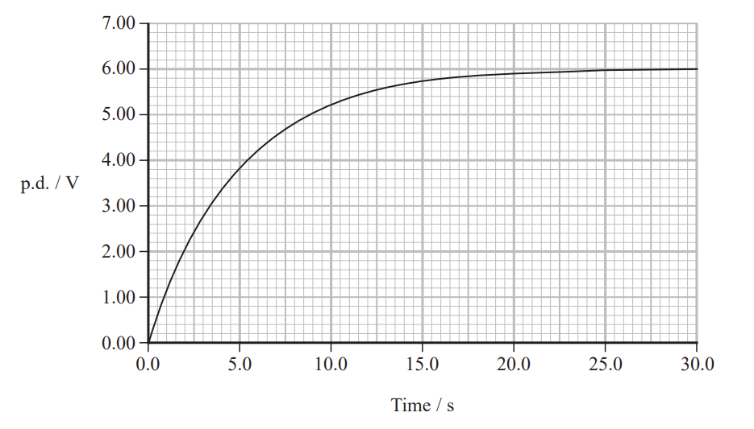
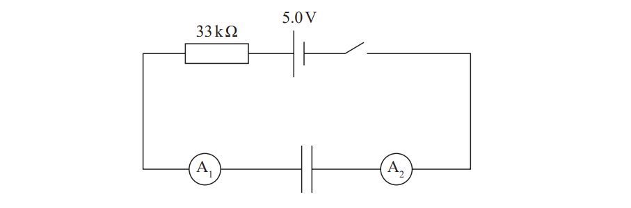
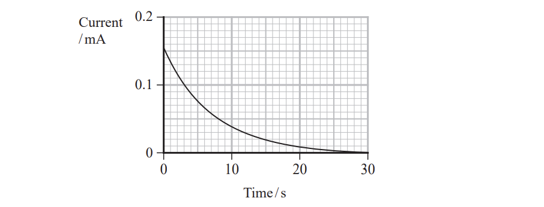
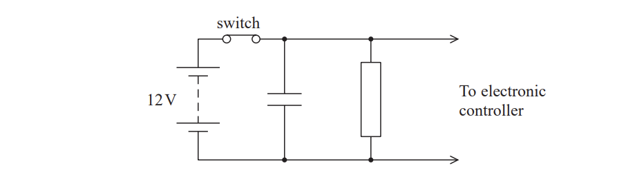
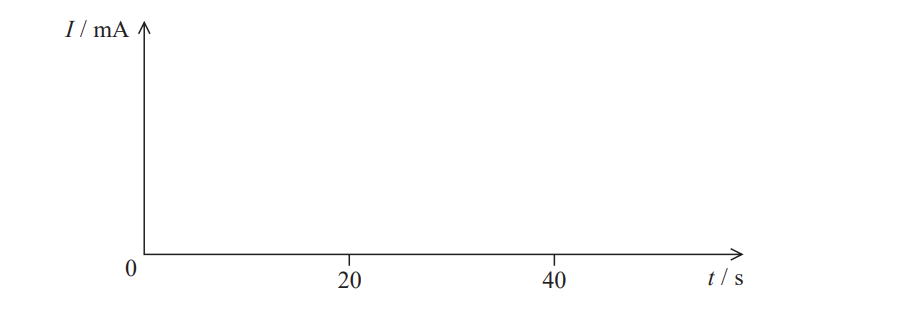

# Exam Questions — Capacitance
**4. Further Mechanics, Fields & Particles** · Edexcel International A Level (IAL) Physics (YPH11)
> Source: [https://www.savemyexams.com/international-a-level/physics/edexcel/19/topic-questions/4-further-mechanics-fields-and-particles/capacitance/structured-questions/](https://www.savemyexams.com/international-a-level/physics/edexcel/19/topic-questions/4-further-mechanics-fields-and-particles/capacitance/structured-questions/) · 5 questions · total 49 marks

## Q1 — medium — 16 marks · structured-questions

### 17((a)) — 3 marks — command: add — structured — from paper June 2021 · WPH14/01
A student investigated the properties of capacitors.

The student connected a capacitor in series with a resistor. The capacitor was charged through the resistor by applying a potential difference (p.d.) using a battery of e.m.f. 6.0 V and negligible internal resistance. The capacitor was then discharged through the resistor. The p.d. across the capacitor was measured during the charging and discharging processes.

Add to the diagram to show a suitable circuit for charging and discharging the capacitor while measuring the p.d. across it.

### 17((b)) — 13 marks — command: multiple — structured — from paper June 2021 · WPH14/01
The graph shows how the p.d. across the capacitor varies with time as it is being charged by the 6.0 V battery.

i) Sketch, on the same axes, a graph to show how the p.d. across the resistor varies with time.

**(2)**

ii) Show that the p.d *V* across the capacitor when it is charging is given by

$V=V_{0}-V_{0}e^{-\frac{t}{RC}}$

where *V*0 is the e.m.f. of the battery

*t* is the time

*R* is the resistance of the resistor

and *C* is the capacitance of the capacitor.

**(3)**

iii) During the charging process, the student recorded the p.d. across the capacitor and the resistance of the resistor.

The capacitors available had the following values:

| 10 μF | 15 μF | 47 μF | 100 μF | 150 μF |
|---|---|---|---|---|

Deduce the value of capacitance for the capacitor that was used.

*R* = 330 kΩ

**(4)**

iv) Calculate the charge on the fully charged capacitor.

Charge = .........................................**(2)**

v) Calculate the energy stored by the fully charged capacitor.

Energy stored = .....................................**(2) **

## Q2 — hard — 11 marks · structured-questions

### 14((a)) — 2 marks — command: determine — structured — from paper 2022 Jan · WPH14/01
A student built the circuit shown. The capacitor was initially uncharged.

She closed the switch and plotted a graph of current on ammeter A1 against time.

Determine whether the initial value of current on the graph is consistent with the values stated on the circuit diagram.

### 14((b)) — 2 marks — command: explain — structured — from paper 2022 Jan · WPH14/01
Explain how the current on ammeter A2 would vary over the same time interval.

### 14((c)) — 3 marks — command: determine — structured — from paper 2022 Jan · WPH14/01
Determine the capacitance of the capacitor.

Capacitance = ...............................

### 14((d)) — 2 marks — command: determine — structured — from paper 2022 Jan · WPH14/01
Determine the charge stored on the capacitor after 30 s.

Charge stored on capacitor after 30 s = ................................

### 14((e)) — 2 marks — command: determine — structured — from paper 2022 Jan · WPH14/01
Determine the maximum energy stored by the capacitor.

Maximum energy = ...............................

## Q3 — hard — 9 marks · structured-questions

### 14((a)) — 3 marks — command: explain — structured — from paper Oct/Nov 2021 · WPH14/01
The train on a model railway is powered by contact with the rails. The train sometimes loses contact with the rails. The diagram shows a circuit that can maintain power for an electronic controller on the train even when the power is disconnected for a short time.

The switch represents the contact between the train and the rails.

Explain how this circuit can maintain power to the electronic controller if the switch is opened for a short time.

### 14((b)) — 2 marks — command: calculate — structured — from paper Oct/Nov 2021 · WPH14/01
The switch is opened.

Calculate the time taken for the potential difference across the capacitor to decrease to 4.0 V.

Assume the resistance of the electronic controller is infinite.

capacitance of capacitor = 47 mF

resistance of resistor = 470 Ω

Time taken = ...........................................

### 14((c)) — 4 marks — command: sketch — structured — from paper Oct/Nov 2021 · WPH14/01
The switch is closed at time *t* = 0 and then opened at *t *= 20 s.

Sketch a graph on the axes below to show how current *I* through the resistor varies with *t*.

## Q4 — hard — 12 marks · structured-questions

### 1() — 7 marks — command: multiple — structured
An emergency lighting system uses the capacitor circuit shown.

When the mains power is on, the two-way switch is connected to position X to charge the capacitor. The capacitor is uncharged at time $t=0\text{s}$.

(i) Explain how the current in the circuit varies when the switch is connected to position X.

[3]

(ii) Complete the graph to show how the current varies with time until the capacitor is fully charged.

Include values on both axes.

[4]

### 2() — 2 marks — command: show — structured
When the mains power fails, the switch connects to position Y and the capacitor discharges through the $250\text{kΩ}$ resistor.

Show that the time taken for the capacitor to lose 99% of its full charge is approximately $\text{17}$ times longer than the time taken to reach 99% of its full charge.

### 3() — 3 marks — command: deduce — structured
An external sensor circuit monitors the potential difference (p.d.) across the capacitor. An LED warning light in the sensor circuit remains switched on as long as the p.d. remains above $2.0\text{V}$.

The LED is required to stay on for at least $15\text{minutes}$ after a power failure.

Deduce whether the design of the circuit meets this requirement.

## Q5 — easy — 1 marks · multiple-choice-questions

### 7() — 1 mark — multiple_choice — from paper Oct/Nov 2021 · WPH14/01
A battery of e.m.f. *V*  is connected to a capacitor as shown. The capacitor is initially uncharged.

Work is done by the battery to transfer a charge *Q* from one plate of the capacitor to the other plate. The final potential difference across the capacitor is *V*.

Which row of the table gives the work done by the battery, and the energy stored by the capacitor, at the end of this process?

|   | **Work done by battery** | **Energy stored by capacitor** |
|---|---|---|
| **A** | $\frac{QV}{2}$ | $\frac{QV}{2}$ |
| **B** | $\frac{QV}{2}$ | $QV$ |
| **C** | $QV$ | $\frac{QV}{2}$ |
| **D** | $QV$ | $QV$ |
- **A.** 
- **B.** 
- **C.** 
- **D.** 
