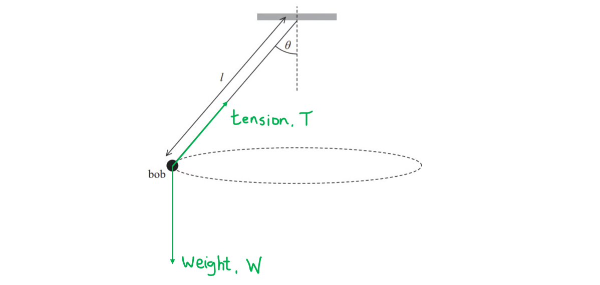
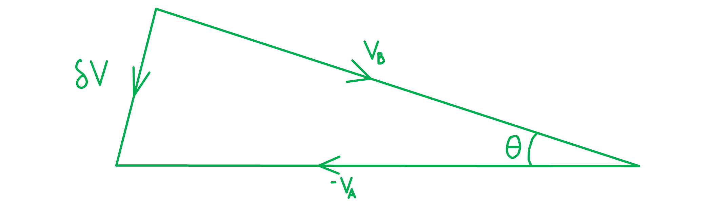

# Mark Schemes — Circular Motion
**4. Further Mechanics, Fields & Particles** · Edexcel International A Level (IAL) Physics (YPH11)

## Q1 — medium — 9 marks · structured-questions

### 12((a)) — 2 marks
The two forces acting on the bob are:

- Arrow upwards along wire labelled tension / *T*; **[1 mark]**
- Arrow downwards from bob labelled weight / *W* / *mg* / gravitational force / force due to gravity; **[1 mark]**

**[Total: 2 marks]**

- *The tension is always directed **towards** the point at which the object is connected to a stationary object*

  - *Imagine you pulled this bob outwards, you would feel a resistive force in the opposite direction, this is the tension so it is directed **up** the string*

### 12((b)) — 7 marks
i) Derive the equation for the angular velocity *ω* of the bob:

Resolving the forces vertically (↑):

- $T\mathrm{cos}θ=mg$ **[1 mark]**

Resolving the forces horizontally (→):

- $T\mathrm{sin}θ=mω^{2}r$ **[1 mark]**

Determine an equation for the radius of the circular path:

- $r=l\times\mathrm{sin}θ$ **[1 mark]**

Equate and rearrange the expressions into the required form:

- `T space sin space theta space equals space m omega squared open parentheses l space sin space theta close parentheses space space space space space rightwards double arrow space space space space space T space equals space m omega squared l space`
- $T\mathrm{cos}θ=mg\RightarrowT=\frac{mg}{\mathrm{cos}θ}$
- $mω^{2}l=\frac{mg}{\mathrm{cos}θ}$
- `omega squared space equals space fraction numerator up diagonal strike m g over denominator cos space theta end fraction cross times fraction numerator 1 over denominator up diagonal strike m l end fraction space equals space fraction numerator g over denominator l space cos space theta end fraction`
- $ω=\sqrt{\frac{g}{l\mathrm{cos}θ}}$ **[1 mark]**

ii) Deduce whether this arrangement leads to *T *= 5.0 s:

List the known quantities:

- Length,* *$l$* *= 6.4 m
- Angle,* θ* = 13.9°
- Gravitational field strength, *g* = 9.81 N kg−1

Use the relationship between *T* and *ω *to calculate *T*:

- $T=\frac{2π}{ω}$
- $ω=\frac{2π}{T}=\sqrt{\frac{g}{l\mathrm{cos}θ}}\RightarrowT=2π\sqrt{\frac{l\mathrm{cos}θ}{g}}$ **[1 mark]**
- `T space equals space 2 straight pi space square root of fraction numerator 6.4 space cross times space cos space open parentheses 13.9 close parentheses over denominator 9.81 end fraction end root` = 5.0 s **[1 mark]**

Write a supporting conclusion:

- The length and angle of the arrangement satisfy the requirements and produce the required period of *T* = 5.0 s; **[1 mark]**

**[Total: 7 marks]**

- *In part i), full working must be seen for the final mark so be very clear with your algebra *

  - *You must be confident with manipulating and rearranging equations in A level physics to gain the top marks*
  - *Revise this from the maths revision notes if you're unsure*
- *In part ii), you must always write a concluding sentence for a 'deduce' or 'assess' command word to get full marks*

## Q2 — medium — 12 marks · structured-questions

### 15((a)) — 5 marks
To derive the equation for centripetal acceleration:

Construct a vector diagram for the velocity change:

- Diagram has δ*v* marked; **[1 mark]**

Note the small angle approximation:

- Recall the arc length and angular displacement equation $Δθ=\frac{ΔS}{r}$
- Small angle, therefore $δθ=\frac{δv}{v}$ (equation 1) **[1 mark]**

Introduce relevant equations:

- $ω=\frac{δθ}{δt}$(equation 2) **and **$v=rω$ (equation 3) **[1 mark]**
- $a=\frac{δv}{δt}$ (equation 4) **[1 mark]**

Prove the relationships algebraically:

- Substitute equation 1 into equation 4: $a=\frac{δv}{δt}=\frac{vδθ}{δt}$
- Use equation 2: $a=\frac{vδθ}{δt}=vω$
- Use equation 3: $a=vω=\frac{v^{2}}{r}$ **[1 mark]**

- *This derivation is on your course specification, meaning that it is a likely exam question.*

  - *You should be clear about the diagram and the derivation, and include both in your revision notes.*
  - *A useful tip is to keep the final answer in front of you throughout, so you can look for the pattern of your solution matching the pattern in the question.*
- *There are multiple methods for deriving this equation*

  - *In this method, the small angle approximation allows us to apply the arc length equation to a vector triangle*
  - *This is because, as arc length decreases, it tends towards a **straight** line*

### 15((b)) — 3 marks
To calculate acceleration of the ball:

Determine the velocity to calculate acceleration:

- `v space equals omega r space equals space f space cross times space 2 pi space r space equals space 1.3 cross times open parentheses 2 cross times pi cross times 0.58 close parentheses space equals space 4.74 space ms to the power of negative 1 end exponent` **[1 mark]**

Use the equation from part (a) to calculate acceleration:

- $a=\frac{v^{2}}{r}=\frac{4.74^{2}}{0.58}=38.7$ **[1 mark]**
- $a=39\mathrm{ms}^{-2}$ **[1 mark]**

**[Total: 3 marks]**

- *You could also calculate this answer using the equations *$ω=2πf$* and *$a=\frac{ω^{2}}{r}$

### 15((c)) — 4 marks
Discuss the child's comment:

The child is correct because:

- The force felt by the child is the tension in the cord; **[1 mark]**
- Centripetal force is constant; **[1 mark]**
- Resultant / centripetal force at the top equals tension + weight; **[1 mark]**
- Resultant / centripetal force at the bottom equals tension - weight; **[1 mark]**

**[Total: 4 marks]**

- *Many students started with the changes in resultant force rather than progressing logically through the situation.*
- *For this reason many forgot to mention the tension in the string and the centripetal force.*

## Q3 — medium — 8 marks · structured-questions

### 1() — 2 marks
The forces acting on the item of clothing at each position are:

**[2 marks]**

> **[mark-scheme]**
> 1 mark for drawing and labelling arrows for the weight force on both diagrams
> 
> - Must be vertically downward on both diagrams
> - Acceptable labels include weight, $W$ or $mg$
> 
> 1 mark for drawing and labelling arrows for the reaction force on both diagrams
> 
> - Must be vertically upward on the first diagram, and vertically downward on the second diagram
> - Acceptable labels include reaction, normal, $R$ or $N$

> **[exam-tip]**
> For an object resting against the inside of a rotating drum, the reaction (contact) force always points from the drum surface back toward the drum's centre. At the bottom of the drum the surface is below the object, so R points upward; at the top, the surface is above the object, so R points downward. The weight, by contrast, always points vertically downward regardless of the object's position around the loop. Recognising this asymmetry between W (always down) and R (varies with position) is the key to every vertical circular motion problem.

### 2() — 3 marks
> **[mark-scheme]**
> - The weight ($W$) is constant, and the reaction force ($R$) is minimum at the top and maximum at the bottom **[1 mark]**
> - At the top of the drum, the centripetal force is $F_{c}=R+W$ **[1 mark]**
> - At the bottom of the drum, the centripetal force is $F_{c}=R-W$ **[1 mark]**

> **[exam-tip]**
> At the bottom of a vertical loop, the reaction force must exceed the weight to supply the net upward (centripetal) force. At the top, the weight already points toward the centre, so the reaction force is reduced by exactly the weight. Whatever the speed, the difference is equal to $R_{\text{bottom}} - R_{\text{top}} = 2 W$.

### 3() — 3 marks
To calculate the minimum speed at the top of the drum:

- List the known quantities:

  - Internal radius of drum, $r=0.25\text{m}$
  - Acceleration due to gravity, $g=9.81\text{m s}^{-2}$
- At the minimum speed, the reaction force at the top is zero ($R = 0$)

  - Therefore, the weight $F=mg$ alone provides the centripetal force

$F=\frac{mv^{2}}{r}$

$mg=\frac{mv^{2}}{r}$ **[1 mark]**

$v=\sqrt{gr}$ **[1 mark]**

- Substitute the known values into the equation for $v$:

$v=\sqrt{9.81\times0.25}$

$v=1.566...$

$v=$ $1.6\text{m s}^{-1}$ **[1 mark]**

> **[mark-scheme]**
> 1 mark for recognising that reaction force is zero ($R = 0$) so the centripetal force is due to weight ($mg$) only
> 
> 1 mark for use of $v_{\mathrm{min}} = \sqrt{gr}$
> 
> 1 mark for a correct final answer ($1.6\text{m s}^{-1}$)
> 
> - Accept answers given to 2 or 3 s.f.
> 
> Full marks can be awarded for a correct final answer with no working shown.

> **[exam-tip]**
> The minimum-speed condition at the top of a vertical circular motion is a recurring exam scenario: set the contact / tension / normal force to **zero** — gravity alone supplies the centripetal force, giving $v_{\mathrm{min}} = \sqrt{gr}$. The mass always cancels, so this is a fixed property of the geometry: any object, regardless of mass, has the same minimum speed at the top of the same circular path. Below this speed, the object loses contact and falls inward.

## Q4 — hard — 6 marks · structured-questions

### 13() — 6 marks
Deduce whether the car will complete the loop and reach point D:

List the known quantities:

- Release height above point A, Δ*h* = 25 cm = 0.25 m
- Diameter of loop, *d* = 22 cm = 0.22 m
- Radius of loop, *r* = 0.22 ÷ 2 = 0.11 m
- Mass of toy car, *m* = 33 g = 0.033 kg

Determine the initial GPE of the toy car at launch:

- Initial GPE at launch height: $\DeltaE_{grav}=mg\Deltah$
- $\DeltaE_{grav}$ = 0.033 × 9.81 × 0.25 = 0.0809 J **[1 mark]**

Determine the minimum speed required to reach the top of the loop:

- Centripetal force:  $F=\frac{mv^{2}}{r}$ and weight:  $W=mg$
- For circular motion to be maintained: centripetal force at top of loop = weight of toy car
- $W=\frac{mv^{2}}{r}=mg$ **[1 mark]**
- Minimum speed: $v^{2}=gr\Rightarrowv=\sqrt{9.81\times0.11}$ = 1.04 m s–1 **[1 mark]**

Determine the kinetic energy required to reach the top of the loop:

- Kinetic energy:  $E_{k}=\frac{1}{2}mv^{2}$
- Required `E subscript k space equals space 1 half space cross times space 0.033 space cross times space open parentheses 1.04 close parentheses squared` = 0.0178 J **[1 mark]**

Determine the total energy required to reach the top of the loop:

- ΔEgrav at top of loop = *mgd* = 0.033 × 9.81 × 0.22 = 0.0712 J
- Total energy required to complete loop = (Required Ek) + (ΔEgrav at top of loop)
- Total energy required to complete loop = 0.0178 + 0.0712 = 0.089 J **[1 mark]**

Max **one** mark from one of the following conclusions:

**Conclusion 1: Compare initial GPE to total energy required**

- The total energy required is 0.089 J which is greater than 0.081 J, the GPE at the start, hence it has insufficient energy and does not complete the loop; **[1 mark]**

**Conclusion 2: Compare initial height to the required height**

- Required initial height, Δ*h* = $\frac{0.089}{0.033\times9.81}$ = 0.275 m
- The initial height required is 0.275 m which is greater than 0.25 m, the height of the launch position, hence it has insufficient energy and does not complete the loop; **[1 mark]**

**Conclusion 3: Compare actual KE to the required KE**

- Actual KE at top = (Egrav at launch) − (Egrav at top of loop) = 0.0809 − 0.0712 = 0.0097 J
- The KE required at the top of the loop is 0.0178 J which is greater than 0.0097 J, the actual KE it would have, hence it has insufficient energy and does not complete the loop; **[1 mark]**

**Conclusion 4: Compare actual speed to the required speed**

- Actual speed at top = $\sqrt{\frac{2KE}{m}}=\sqrt{\frac{2\times0.0097}{0.033}}$ = 0.77 m s–1
- The speed required at the top of the loop is 1.04 m s–1 which is greater than 0.77 m s–1, the actual speed it would have, hence it has insufficient energy and does not complete the loop; **[1 mark]**

**Conclusion 5: Compare centripetal force to weight**

- Centripetal force:  $F=\frac{mv^{2}}{r}=\frac{0.033\times0.77^{2}}{0.11}$ = 0.18 N
- Weight:  $W=mg=0.033\times9.81$ = 0.32 N
- The weight of the toy is 0.32 N which is greater than 0.18 N, the centripetal force it would experience, hence it has insufficient energy and does not complete the loop; **[1 mark]**

**[Total: 6 marks]**

- *Make sure not to use equations of uniform acceleration as you will not gain full credit!*

  - *Remember - the acceleration is **not** uniform in this situation, so equations such as **v**2** = **u**2** + 2**as** do not apply*

- *Try not to panic if you get lost during a lengthy calculation like this, write down all the quantities you are given and all the equations that you think might be relevant*
- *Next, carry out some calculations and see what you can deduce about the situation, even if you can't reach a final conclusion*
- *In this question, you could get 3 marks for simply plugging numbers into the following equations:*

$E_{grav}=mg\DeltahE_{k}=\frac{1}{2}mv^{2}F=\frac{mv^{2}}{r}$

- *However, the other three marks depend on your ability to bring these calculations and ideas together and draw a conclusion about the situation backed up by your calculated values*

## Q5 — medium — 1 marks · multiple-choice-questions

### 10() — 1 marks
**Correct answer: B** — 

**Final answer:** **The correct answer is ****B**** because:**

- As radius increases, the distance travelled increases

  - Therefore if time period is the same then speed must increase
- Since time period is constant, angular velocity is also constant

## Q6 — medium — 1 marks · multiple-choice-questions

### 1() — 1 marks
**Correct answer: C** — $3 v$

**Final answer:** **The correct answer is C**

- All points on a rigid rotating disc have the same angular speed $ω$
- The linear speed of a point at distance $r$ from the axis is

$v = r ω$

- Since $ω$ is the same for both points, $v$ is directly proportional to $r$:

$\frac{v_{P}}{v_{Q}}=\frac{r_{P}}{r_{Q}}$

- Point P is three times as far from the axis as point Q, so $r_{P}=3r_{Q}$ and therefore

$v_{P}=3v_{Q}=3v$

**A** is incorrect because the ratio has been inverted — the linear speed at the larger radius is *greater* than at the smaller radius, not smaller.

**B** is incorrect because it treats the linear speed as the same at every point on the disc. Only the *angular* speed $ω$ is uniform across a rigid body; the linear speed $v = r ω$ depends on $r$.

**D** is incorrect because the linear speed scales *linearly* with $r$ (from $v = r ω$), not quadratically — multiplying $r$ by 3 multiplies $v$ by 3, not by $3^{2} = 9$.

> **[exam-tip]**
> For two points on the same rigid rotating body, the angular speed $ω$ is the same for both — *not* the linear speed. Compare linear speeds via $v = r ω$. The most common slip is treating the linear speed as uniform; the next most common is confusing the linear scaling of $v$ with $r$ for the *quadratic* scaling that appears in centripetal acceleration ($a = ω^{2} r$) or kinetic energy ($E_{k} = \frac{1}{2} m v^{2}$).
