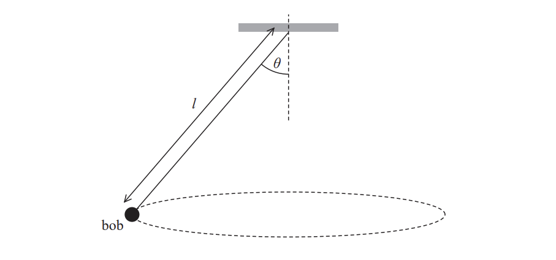
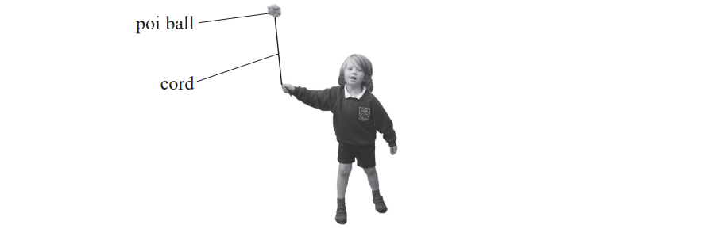
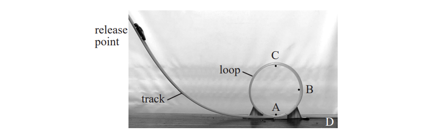

# Exam Questions — Circular Motion
**4. Further Mechanics, Fields & Particles** · Edexcel International A Level (IAL) Physics (YPH11)
> Source: [https://www.savemyexams.com/international-a-level/physics/edexcel/19/topic-questions/4-further-mechanics-fields-and-particles/circular-motion/structured-questions/](https://www.savemyexams.com/international-a-level/physics/edexcel/19/topic-questions/4-further-mechanics-fields-and-particles/circular-motion/structured-questions/) · 6 questions · total 37 marks

## Q1 — medium — 9 marks · structured-questions

### 12((a)) — 2 marks — command: add — structured — from paper Oct/Nov 2021 · WPH14/01
18th century clocks sometimes used a conical pendulum to measure regular periods of time.

A conical pendulum consists of a bob of mass *m* fixed to the end of a wire of length $l$ as shown. The bob is set to follow a circular path in the horizontal plane. The wire makes an angle *θ* with the vertical.

Add to the diagram to show the two forces acting on the bob.

### 12((b)) — 7 marks — command: multiple — structured — from paper Oct/Nov 2021 · WPH14/01
i) Derive the following equation for the angular velocity *ω* of the bob.

$ω=\sqrt{\frac{g}{l\mathrm{cos}θ}}$

**(4)**

ii) A clock requires the period of the bob to be 5.0 s.

$l$* *= 6.4 m

*θ* = 13.9°

Deduce whether this arrangement leads to the required period.

**(3)**

## Q2 — medium — 12 marks · structured-questions

### 15((a)) — 5 marks — command: derive — structured — from paper 2022 Jan · WPH14/01
A poi ball is a ball attached to a person’s hand by a cord. A child makes the poi ball undergo circular motion in a vertical plane as shown in the photograph.

The poi ball moves clockwise in a circle of radius *r*, centre O, with a constant speed *v*.

The diagram shows two positions, A and B, of the poi ball.

Derive the equation for centripetal acceleration  $a=\frac{v^{2}}{r}$ by considering the velocity of the poi ball at these two positions.

Your answer should include a vector diagram.

### 15((b)) — 3 marks — command: calculate — structured — from paper 2022 Jan · WPH14/01
The poi ball completes 1.3 revolutions per second.

Calculate the acceleration of the poi ball.

radius of circular motion = 0.58 m

Acceleration = ..............................

### 15((c)) — 4 marks — command: discuss — structured — from paper 2022 Jan · WPH14/01
The child comments that as the ball goes round the circle with a constant speed, the size of the force on his hand changes.

Discuss whether this comment is correct.

## Q3 — medium — 8 marks · structured-questions

### 1() — 2 marks — command: add — structured
A washing machine drum rotates about a horizontal axis. As the drum rotates at high speed, items of clothing move in a vertical circle resting against the inside surface of the drum.

The dot in the diagrams represents an item of clothing as it rotates with the drum.

Add labelled arrows to each diagram to show the forces acting on the item of clothing at each position.

### 2() — 3 marks — command: explain — structured
The drum rotates at a constant speed.

Explain how the forces on the item of clothing vary between the bottom and the top of the drum.

### 3() — 3 marks — command: calculate — structured
The drum has an internal radius of $0 . 25 \text{m}$.

Calculate the minimum speed at which the clothing remains in contact with the drum at the top of the rotation.

## Q4 — hard — 6 marks · structured-questions

### 13() — 6 marks — command: deduce — structured — from paper June 2021 · WPH14/01
The photograph shows a track for a toy car. The car moves down the track towards a circular loop. The loop starts at point A.

If the release point of the car is high enough, the car moves fast enough to pass point C and complete the loop, continuing to the end of the track at point D.

If the release point is too low, the car falls off the track between point B and point C.

Deduce whether a car released from a vertical height of 25 cm above point A will complete the loop and reach point D. You should assume that friction is negligible.

vertical height of point C above point A = 22 cm

mass of toy car = 33 g

## Q5 — medium — 1 marks · multiple-choice-questions

### 10() — 1 mark — multiple_choice — from paper 2022 Jan · WPH14/01
A website states: “The radius of the orbit of the Moon around the Earth is increasing by a small amount each year, however the time period of the orbit remains constant.”

Which row of the table is correct if the statement is true?

|   | **Angular velocity of Moon** | **Speed of Moon** |
|---|---|---|
| **A** | constant | constant |
| **B** | constant | increasing |
| **C** | increasing | constant |
| **D** | increasing | increasing |

** **
- **A.** 
- **B.** 
- **C.** 
- **D.** 

## Q6 — medium — 1 marks · multiple-choice-questions

### 1() — 1 mark — multiple_choice
Two points, P and Q, lie on a disc that rotates about a fixed axis. Point P is three times as far from the axis as point Q. The linear speed of point Q is $v$.

Which of the following gives the linear speed of point P?
- **A.** $\frac{1}{3} v$
- **B.** $v$
- **C.** $3 v$
- **D.** $9 v$
