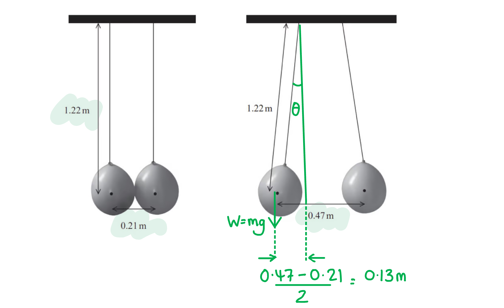
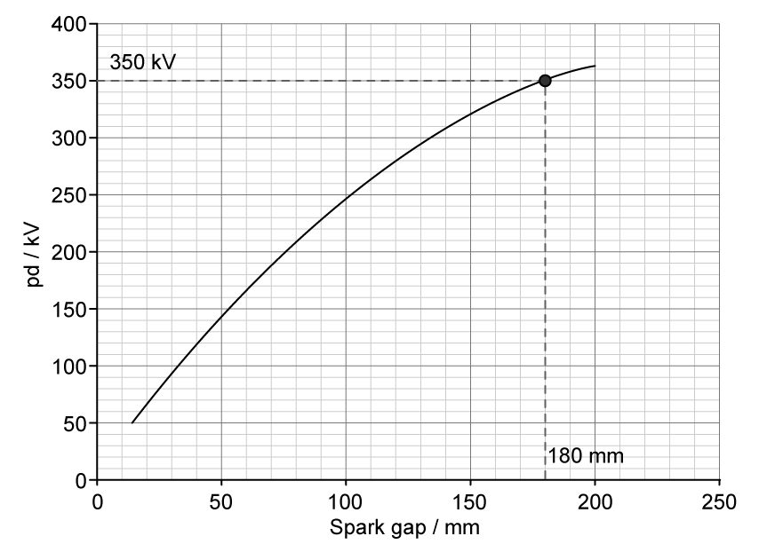
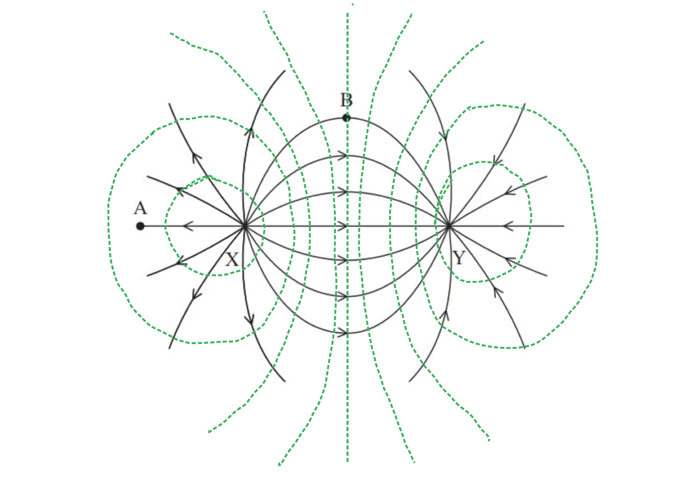

# Mark Schemes — Electric Fields
**4. Further Mechanics, Fields & Particles** · Edexcel International A Level (IAL) Physics (YPH11)

## Q1 — medium — 4 marks · structured-questions

### 11((a)) — 3 marks
Calculate the electric potential around a helium nucleus:

List the known quantities:

- Coulomb's law constant, $k=\frac{1}{4πε_{0}}$ = 8.99 × 109 N m2 C–2
- Distance, *r* = 26.6 × 10–12 m

Calculate the charge of the `He presubscript 2 presuperscript 4` nucleus:

- *Q* = 2e = 2 × (1.6 × 10–19) C **[1 mark]**

Substitute the values into the electric potential equation:

- $V=\frac{Q}{4πε_{0}r}$
- `V space equals space fraction numerator open parentheses 8.99 cross times 10 to the power of 9 close parentheses cross times 2 cross times open parentheses 1.6 cross times 10 to the power of negative 19 end exponent close parentheses over denominator 26.6 cross times 10 to the power of negative 12 end exponent end fraction` **[1 mark]**
- *V* = 108 V **[1 mark]**

**[Total: 3 marks]**

- *The only particles that contribute to the charge of a nucleus as the **protons*
- *These are the same **magnitude** of charge as an electron (e = 1.60 × 10**–19** C)*

### 11((b)) — 1 marks
An assumption made in the calculation in (a) is:

Any **one** from:

- The (electric) field is radial; **[1 mark]**
- The nucleus can be regarded as a point (charge); **[1 mark]**
- There are no other charged particles nearby; **[1 mark]**
- The distance is measured from the centre of the nucleus; **[1 mark]**

**[Total: 1 mark]**

## Q2 — medium — 8 marks · structured-questions

### 16((a)) — 3 marks
The electric field lines between the plates look as follows:

- At least three parallel vertical lines drawn touching both plates; **[1 mark]**
- The lines are equally spaced; **[1 mark]**
- Arrow on at least one line pointing down; **[1 mark]**

**[Total: 3 marks]**

### 16((b)) — 5 marks
List the known quantities:

- Potential difference, *V* = 10.5 kV = 10 500 V
- Charge on ionised atom, *Q* = 1.60 × 10−19 C
- Distance between plates, *d* = 6.40 mm = 6.40 × 10−3 m
- Distance travelled by ion, Δ*s* = 0.2 μm = 0.2 × 10−6 m
- Ionisation energy of atoms = 3.9 × 10–19 J

i) Show that the force on an ionised atom due to the electric field is about 2.6 × 10–13 N:

Determine an equation for the force, *F*:

- $E=\frac{V}{d}$ and $E=\frac{F}{Q}$
- $\frac{F}{Q}=\frac{V}{d}\RightarrowF=\frac{QV}{d}$ **[1 mark]**

Substitute in the values to calculate the force:

- `F space equals space fraction numerator open parentheses 1.60 cross times 10 to the power of negative 19 end exponent close parentheses open parentheses 10 space 500 close parentheses over denominator 6.40 cross times 10 to the power of negative 3 end exponent end fraction` **[1 mark]**
- *F* = 2.625 × 10−13 N (3 or 4 s.f.) **[1 mark]**

ii) Deduce whether the collision could lead to further ionisation:

Max **two** marks from **one** of the following methods:

**Method 1: Required energy vs actual energy**

- Required energy, Δ*W* = *F*Δ*s* = (2.625 × 10−13) × (0.2 × 10−6) = 5.25 × 10−20 J **[1 mark]**
- This is less than the ionisation energy 3.9 × 10–19 J, hence it does not cause further ionisation; **[1 mark]**

**Method 2: Required force vs actual force**

- Required force, $F=\frac{\DeltaW}{\Deltas}=\frac{3.9\times10^{-19}}{0.2\times10^{-6}}$ = 1.95 × 10−12 N **[1 mark]**
- This is greater than the actual force 2.6 × 10−13 N, hence it does not cause further ionisation; **[1 mark]**

**Method 3: Required distance vs actual distance travelled**

- Required distance, $\Deltas=\frac{\DeltaW}{F}=\frac{3.9\times10^{-19}}{2.6\times10^{-13}}$ = 1.5 × 10−6 m **[1 mark]**
- This is greater than the actual distance 0.2 × 10−6 m, hence it does not cause further ionisation; **[1 mark]**

**[Total: 5 marks]**

- *In part ii) remember to write a conclusion sentence to sum up your deduction with the question asked*

## Q3 — medium — 3 marks · structured-questions

### 11() — 3 marks
The field lines around a negative point charge look like:

- At least <u>4 radial straight</u> lines; **[1 mark]**
- Lines are <u>distributed equally</u>; **[1 mark]**
- Arrows pointing <u>towards</u> centre; **[1 mark]**

**[Total: 3 marks]**

- *After this question was used in a real exam the Examiner noted that not all candidates **'went on to score the full three marks because their field lines were not distributed evenly ... **particularly so for those who did not use the ruler they were instructed to have by the note on the front of the exam paper**.'*

  - *Your teacher probably tells you to use a ruler nearly every day. Listen to this good advice!*

## Q4 — medium — 8 marks · structured-questions

### 13((a)) — 6 marks
i) To calculate the force of repulsion between the balloons:

Determine the angle to the vertical:

- $\mathrm{sin}θ=\frac{13}{122}$** [1 mark]**
- Angle of thread to vertical $θ=6.12^{\circ}$

Resolve vertical forces in equilibrium:

- Downwards, $W=mg$, upwards vertical component of tension $T_{v}=T\mathrm{cos}θ$
- $?\mathrm{cos}6.12^{\circ}=1.1\times10^{-3}\mathrm{kg}\times9.81\mathrm{Nkg}$ **[1 mark]**

Calculate to find tension:

- $T=0.0109N$ **[1 mark]**

Calculate the horizontal force:

- Force of repulsion, $F=0.0109\mathrm{sin}6.12^{\circ}=1.16\times10^{-3}N$ **[1 mark]**

**                               **

ii) To calculate the charge on each balloon:

Use Coulomb's Law:

- $F=k\frac{Q_{1}Q_{2}}{r^{2}}=k\frac{Q^{2}}{r^{2}}$

Calculate the charge:

- `Q squared space equals fraction numerator F space r squared over denominator k end fraction space equals space fraction numerator open parentheses 1.16 cross times 10 to the power of negative 3 end exponent close parentheses space cross times 0.47 squared over denominator open parentheses 8.99 cross times 10 to the power of 9 close parentheses end fraction equals 2.85 cross times 10 to the power of negative 14 end exponent` **[1 mark]**
- $Q=1.69\times10^{-7}C$ **[1 mark]**

**[Total: 6 marks]**

- *You must get into the habit of sketching and annotating diagrams.*
- *A question like this will catch out many students who don't, because the gap between the balloons tricks them into thinking the short side of the triangle measures 0.235 m rather than 0.13 m.*

### 13((b)) — 2 marks
Calculate electrical potential when *r* = 0.30 m:

- Electric potential:  $V=\frac{Q}{4πε_{0}r}$
- `V space equals space fraction numerator 1.69 cross times 10 to the power of negative 7 end exponent over denominator 4 straight pi space cross times space open parentheses 8.85 space cross times space 10 to the power of negative 12 end exponent close parentheses space cross times space 0.3 end fraction space equals space 5065 space straight V` **[1 mark]**
- $V=5100V$ (2 s.f)** [1 mark]**

**[Total: 2 marks]**

## Q5 — medium — 10 marks · structured-questions

### 1() — 2 marks
Electric field around a positively charged sphere:

**[2 marks]**

> **[mark-scheme]**
> 1 mark for drawing at least four straight, equally spaced lines pointing away from the sphere
> 
> 1 mark for drawing field lines starting at the surface
> 
> - Lines must not be drawn within the sphere

### 2() — 2 marks
Graph of electric field strength vs. distance from the centre of the sphere:

**[2 marks]**

> **[mark-scheme]**
> 1 mark for drawing a concave curve starting from the dashed line at the radius
> 
> - Curve must not touch the horizontal axis
> 
> 1 mark for drawing a horizontal line along $E=0$ before the dashed line
> 
> - Accept no line drawn for this part if a graph is sketched after the dashed line at the radius

### 3() — 3 marks
To calculate the charge on the conducting sphere at a spark gap of $180\text{mm}$:

- List the known quantities:

  - Radius of sphere, $r=12.5\text{cm}=0.125\text{m}$
  - Permittivity of free space, $ε_{0}=8.85\times10^{-12}\text{F m}^{-1}$
- Read the p.d. from the graph at a spark gap of $180 \text{mm}$:

$V=350\text{kV}$ **[1 mark]**

- Calculate the charge on the sphere with $r=0.125\text{m}$

$V=\frac{Q}{4πε_{0}r}$

$Q=4πε_{0}rV$

`Q space equals space 4 straight pi cross times open parentheses 8.85 cross times 10 to the power of negative 12 end exponent close parentheses cross times 0.125 cross times open parentheses 350 cross times 10 cubed close parentheses` **[1 mark]**

$Q=$ $4.87\times10^{-6}\text{C}$ **[1 mark]**

> **[mark-scheme]**
> 1 mark for reading $V=350\text{kV}$ from the graph at $180 \text{mm}$
> 
> - Accept a tolerance of $\pm\frac{1}{2}$ small square for values read from the graph (i.e., within range $345$–$355\text{kV}$)
> 
> 1 mark for substitution into $V=\frac{Q}{4πε_{0}r}$
> 
> 1 mark for a correct final answer ($4.87\times10^{-6}\text{C}$)
> 
> - Accept range $4.8\times10^{-6}$ to $4.9\times10^{-6}\text{C}$ (or $4.8$–$4.9μ\text{C}$)

### 4() — 3 marks
To deduce whether the teacher's prediction is correct:

- List the known quantities:

  - Claimed potential, $V=350\text{kV}=350\times10^{3}\text{V}$
  - Radius of sphere, $r=0.125\text{m}$
  - Breakdown field strength of air, $E=3.0\times10^{6}\text{V m}^{-1}$
- Determine an expression for the E-field at the surface of the sphere:

combining $V=\frac{Q}{4πε_{0}r}$ with $E=\frac{Q}{4πε_{0}r^{2}}$ gives

$Er^{2}=Vr$

$E=\frac{V}{r}$ **[1 mark]**

- Calculate the electric field strength at the surface of the sphere:

$E=\frac{350\times10^{3}}{0.125}$

$E=2.8\times10^{6}\text{V m}^{-1}$ **[1 mark]**

- Write a concluding statement:

Since $2.8\times10^{6}\text{V m}^{-1}<3.0\times10^{6}\text{V m}^{-1}$, the air would not be ionised before the sphere reaches $350\text{kV}$. Therefore, the teacher's prediction is correct **[1 mark]**

> **[mark-scheme]**
> **Method 1: Calculating the field strength at 350 kV**
> 
> 1 mark for using $V=\frac{Q}{4πϵ_{0}r}$ to find $Q=4.9\times10^{-6}\text{C}$ **OR** recognising that at the surface of the sphere $E=\frac{V}{r}$
> 
> 1 mark for calculating $E$ at $V=350\mathrm{kV}$ ($2.8\times10^{6}\text{V m}^{-1}$)
> 
> 1 mark for an explicit comparison of calculated value of $E$ with $3.0\times10^{6}\text{V m}^{-1}$ and a valid conclusion
> 
> - Expected conclusion: the prediction is correct as the air would not be ionised before reaching $350\text{kV}$
> 
> **Method 2: Calculating the maximum possible potential**
> 
> 1 mark for using $E=\frac{Q}{4πϵ_{0}r^{2}}$ to find $Q_{max}=5.2\times10^{-6}\text{C}$ **OR** recognising that at the surface of the sphere $E=\frac{V}{r}$
> 
> 1 mark for calculating $V_{max}$ at $E_{max}=3.0\times10^{6}\text{V m}^{-1}$ ($375  \text{kV}$)
> 
> 1 mark for an explicit comparison of calculated value of $V_{max}$ with $350\text{kV}$ and a valid conclusion
> 
> - Expected conclusion: the prediction is correct as the sphere would not discharge before reaching $350\text{kV}$

> **[exam-tip]**
> "Deduce whether" questions require three explicit elements: a calculation, a comparison, and a stated conclusion. The calculation alone does not score the conclusion mark — examiners look for an explicit verdict in words.

## Q6 — hard — 15 marks · structured-questions

### 16((a)) — 3 marks
To calculate the magnitude of the electric field strength:

- Distance between the charges and the halfway point, *d* = 4.0 cm = 0.04 m
- Charges are equal in magnitude but opposite in sign, *Q* = ± 2.5 × 10–7 C
- Electric field strength, $E=k\frac{Q}{r^{2}}=\frac{Q}{4πε_{0}r^{2}}$

Calculate the field strength due to each point charge:

**One mark** for either field calculated

- Field due to **X**: `E subscript X space equals space fraction numerator 2.5 space cross times space 10 to the power of negative 7 end exponent over denominator 4 pi space cross times space open parentheses 8.85 cross times 10 to the power of negative 12 end exponent close parentheses space cross times space left parenthesis 0.04 right parenthesis squared end fraction equals 1.4 space cross times space 10 to the power of 6 space end exponent Vm to the power of negative 1 end exponent` (towards Y) **[1 mark]**
- Field due to **Y**: `E subscript Y space equals space fraction numerator 2.5 space cross times space 10 to the power of negative 7 end exponent over denominator 4 pi space cross times space open parentheses 8.85 cross times 10 to the power of negative 12 end exponent close parentheses space cross times space left parenthesis 0.04 right parenthesis squared end fraction equals space 1.4 space cross times space 10 to the power of 6 space end exponent Vm to the power of negative 1 end exponent` (towards Y) **[1 mark]**

Add the field strengths to find the value at the midpoint:

- Field at midpoint, $E=E_{X}+E_{Y}$ **[1 mark]**
- `E space equals space space 2 cross times open parentheses 1.4 cross times 10 to the power of 6 close parentheses space equals space 2.8 cross times 10 to the power of 6 space Vm to the power of negative 1 end exponent` **[1 mark]**

**[Total: 3 marks]**

- *The easiest mistake to make with this question is to subtract **E**Y** from **E**X** due to the negative charge. *
- *However, remember that an electric field is understood by describing it as a region where a positive charge will be moved.*
- *Therefore both charges would move a positive charge to the right (towards **Y**), and so the values add up.*

### 16((b)) — 7 marks
i) Equipotential lines for this combination of charges look like:

- Central straight line equidistant from **X** and **Y** **and **at least one of the diverging lines between **X** and the central line **and **at least one of the diverging lines between the central line and **Y**;** [1 mark]**
- At least one line looping **X** **and **one line looping **Y**; **[1 mark]**
- Line spacing between **X** and **Y** smaller than line spacing to the left of **X** **and **to the right of **Y**; **[1 mark]**

ii) To discuss the statement that “An electric field line shows the path a free positive test charge follows” in relation to this arrangement:

- Field lines show direction of force on a (positive) charge; **[1 mark]**
- (So) field line shows the direction of acceleration; **[1 mark]**
- Point A - Where the line is straight, a charge (initially at rest) will follow the line, so true in this case; **[1 mark]**
- Point B - Curved line means acceleration always changing direction but velocity is not in the direction of acceleration so statement not true; **[1 mark]**

**[Total: 7 marks]**

- *Your teacher will tell you to always draw diagrams using a sharp pencil, and to have a rubber to hand for mistakes.*

  - *This is absolutely right and you should follow this good advice.*
- *However the examiner does not mind whether your work is in pencil or pen, as long as it is correct.*

  - *Therefore a great exam technique is to do your draft lines in pencil, then once you are happy, go over in pen for the perfect diagram, rubbing out your initial sketching lines.*
- *The lines in our diagram above are almost all either our second, or even third, attempt to get them right.*

### 16((c)) — 5 marks
To calculate the magnitude of the potential difference between **C** and **D**:

List the key information:

- Distances **CX** and **DY*** *= 2.5 cm = 0.025 m
- Distances **CY** and **DX*** *= 5.5 cm = 0.055 m
- Charges are equal in magnitude but opposite in sign, *Q* = ± 5.0 × 10–7 C
- Potential, $V=k\frac{Q}{r}=\frac{Q}{4πε_{0}r}$

Calculate the potential at **C** due to **X **and **Y**:

- `V subscript C X end subscript equals space fraction numerator 5.0 space cross times space 10 to the power of negative 7 end exponent over denominator 4 pi space cross times space open parentheses 8.85 cross times 10 to the power of negative 12 end exponent close parentheses space cross times space 0.025 end fraction space equals space 1.8 space cross times space 10 to the power of 5 space straight V`
- `V subscript C Y end subscript equals space fraction numerator negative 5.0 space cross times space 10 to the power of negative 7 end exponent over denominator 4 pi space cross times space open parentheses 8.85 cross times 10 to the power of negative 12 end exponent close parentheses space cross times space 0.055 end fraction space equals space minus 0.8 space cross times space 10 to the power of 5 space straight V`
- Maximum of **one mark** for either calculation

Calculate the potential at **D** due to **X **and **Y**:

- `V subscript D X end subscript equals space fraction numerator 5.0 space cross times space 10 to the power of negative 7 end exponent over denominator 4 pi space cross times space open parentheses 8.85 cross times 10 to the power of negative 12 end exponent close parentheses space cross times space 0.055 end fraction space equals space 0.8 space cross times space 10 to the power of 5 space straight V`
- `V subscript D Y end subscript equals space fraction numerator negative 5.0 space cross times space 10 to the power of negative 7 end exponent over denominator 4 pi space cross times space open parentheses 8.85 cross times 10 to the power of negative 12 end exponent close parentheses space cross times space 0.025 end fraction space equals space minus 1.8 space cross times space 10 to the power of 5 space straight V`
- Maximum of **one mark** for either calculation

Calculate total potentials at **C **and **D**:

- $V_{C}=V_{CX}+V_{CY}=1.8-0.8\times10^{5}=1.0\times10^{5}V$
- ** **$V_{D}=V_{DX}+V_{DY}=-1.8+0.8\times10^{5}=-1.0\times10^{5}V$
- Maximum of **one mark** for either calculation

Calculate p.d. at the midpoint:

- `V subscript C D end subscript space equals space V subscript D space minus space V subscript C space equals space open parentheses negative 1.0 minus 1.0 close parentheses cross times 10 to the power of 5` **[1 mark]**
- $V_{CD}=-2.0\times10^{5}V$ **[1 mark]**

**[Total: 5 marks]**

## Q7 — medium — 1 marks · multiple-choice-questions

### 4() — 1 marks
**Correct answer: B** — 

**Final answer:** **The correct answer is ****B ****because:**

- The relationship between electric field strength *E* and distance *r* is:

  - $E\propto\frac{1}{r^{2}}$
- This is an **inverse square law** relationship which means as *r* increases:

  - *E* will start at a maximum value and decrease
  - The curve will show an initial steep decline and will become less steep at greater values of *r*
  - When *r* increases by a factor of 2, *E* should decrease by a factor of $\frac{1}{4}$

- This is shown by graph **B**

**A **is incorrect as this graph shows that electric field strength does not vary with distance

**C **is incorrect as this graph shows an exponential relationship - it does not show a steep enough decline as *r* increases to be an inverse square relationship

**D **is incorrect as this graph shows a linear relationship e.g. *E *∝ *−r*

## Q8 — medium — 1 marks · multiple-choice-questions

### 6() — 1 marks
**Correct answer: B** — 

**Final answer:** **The correct answer is ****B**** because:**

- Electric field strength is equal to the **gradient** of the potential-distance graph
- The greatest value will be at the point where the gradient is steepest

  - This is at point **B**

**A **is incorrect as at this point, the gradient is zero

**C & D **are incorrect as at these points, the gradient is less steep than at **B**

## Q9 — medium — 1 marks · multiple-choice-questions

### 8() — 1 marks
**Correct answer: C** — 

**Final answer:** **The only correct answer is ****C**** because:**

- The angle of deflection will decrease if the particle has less force on it, or accelerates less
- Since $E=\frac{V}{d}$ the electric field strength will be reduced if either *V* is reduced, or the distance between the plates, *d* is increased

## Q10 — medium — 1 marks · multiple-choice-questions

### 1() — 1 marks
**Correct answer: B** — $\frac{mgd}{2V}$

**Final answer:** **The correct answer is B**

- The electric field between two parallel plates is

$E=\frac{\DeltaV}{d}$

- With one plate at $+ V$ and the other at $- V$, the potential difference is $\DeltaV=V-(-V)=2V$, so

$E = \frac{2V}{d}$

- For the droplet to be stationary, the upward electric force balances the downward weight:

$qE=mg$

$q=\frac{mg}{E}=\frac{mgd}{2V}$

**A** is incorrect because it uses the potential on a single plate ($V$) as the potential difference, instead of the total $\DeltaV=2V$ between the +V and −V plates.

**C** is incorrect because it makes both errors at once: it uses $V$ instead of $2 V$ for the p.d., and inverts $d$ in the rearrangement (taking $E = V d$ instead of $E = V / d$).

**D** is incorrect because it correctly uses $2 V$ for the p.d. but inverts $d$ in the rearrangement, taking $E = 2 V d$ instead of $E = 2 V / d$.
