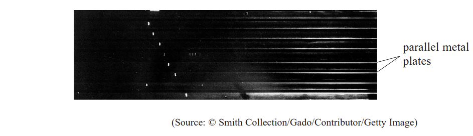
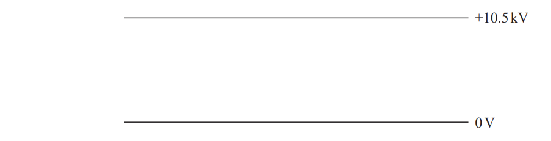
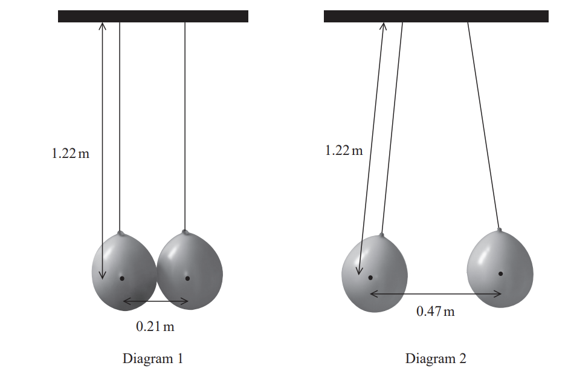
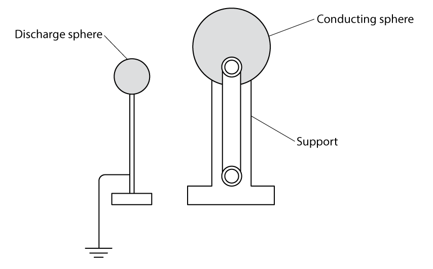
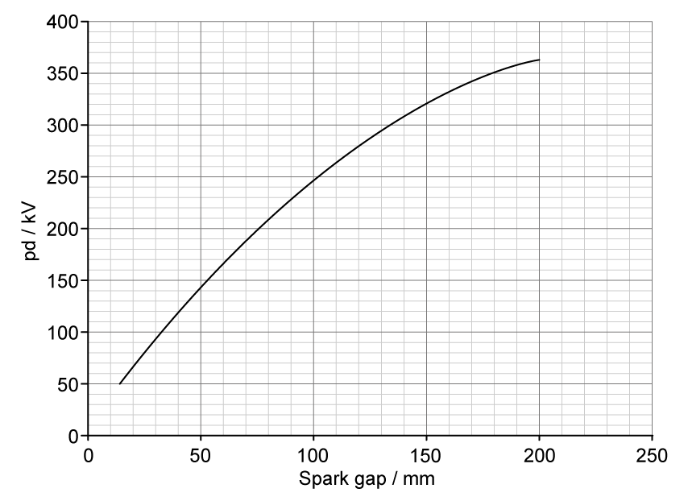
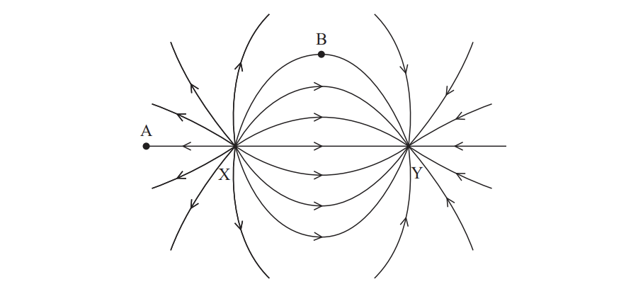
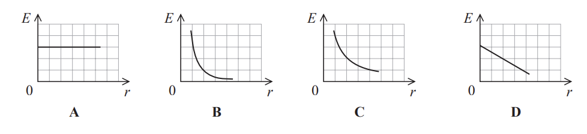

# Exam Questions — Electric Fields
**4. Further Mechanics, Fields & Particles** · Edexcel International A Level (IAL) Physics (YPH11)
> Source: [https://www.savemyexams.com/international-a-level/physics/edexcel/19/topic-questions/4-further-mechanics-fields-and-particles/electric-fields/structured-questions/](https://www.savemyexams.com/international-a-level/physics/edexcel/19/topic-questions/4-further-mechanics-fields-and-particles/electric-fields/structured-questions/) · 10 questions · total 52 marks

## Q1 — medium — 4 marks · structured-questions

### 11((a)) — 3 marks — command: calculate — structured — from paper Oct/Nov 2021 · WPH14/01
There is an electric field around a helium nucleus.

Calculate the electric potential at a distance 26.6 × 10–12 m from a helium `He presubscript 2 presuperscript 4` nucleus.

Electric potential = .........................................

### 11((b)) — 1 mark — command: state — structured — from paper Oct/Nov 2021 · WPH14/01
State one assumption made for this calculation.

## Q2 — medium — 8 marks · structured-questions

### 16((a)) — 3 marks — command: sketch — structured — from paper Oct/Nov 2021 · WPH14/01
A spark chamber consists of a set of parallel metal plates. It can reveal the path of a high energy particle as shown.

A potential difference of 10.5kV is applied across two adjacent plates as shown below.

Sketch lines to represent the electric field between the plates.

### 16((b)) — 5 marks — command: multiple — structured — from paper Oct/Nov 2021 · WPH14/01
A high energy particle causes ionisation of the atoms in the space between the plates.

i) Show that the force on an ionised atom due to the electric field is about 2.6 × 10–13 N.

charge on ionised atom = 1.60 × 10–19 C

distance between plates = 6.40 mm

**(3)**

ii) The ionised atom travels 0.2 μm in the direction perpendicular to the plates before colliding with another atom.

Deduce whether the collision could lead to further ionisation.

ionisation energy of atoms = 3.9 × 10–19 J

**(2)**

## Q3 — medium — 3 marks · structured-questions

### 11() — 3 marks — command: draw — structured — from paper 2022 Jan · WPH14/01
The diagram represents a negative point charge.

Draw field lines to show the electric field around the charge.

## Q4 — medium — 8 marks · structured-questions

### 13((a)) — 6 marks — command: show — structured — from paper 2022 Jan · WPH14/01
The surface of a balloon can become charged by rubbing it against clothing. The charge on the surface of the balloon can be assumed to act as if it was concentrated at the balloon’s centre.

Two balloons are suspended by cotton threads so that they just touch each other as shown in diagram 1. The two balloons are then given an equal negative charge and repel as shown in diagram 2. The dots represent the centre of each balloon.

i) Show that the force of repulsion between the balloons in diagram 2 is about 1 × 10−3 N.

mass of each balloon = 1.1 grams

**(4)**

ii) Show that the charge on each balloon is about 2 × 10−7 C.

**(2)**

### 13((b)) — 2 marks — command: calculate — structured — from paper 2022 Jan · WPH14/01
One balloon is removed and the remaining balloon returns to its original position.

Calculate the electric potential at a distance of 0.30 m from the centre of the remaining balloon.

Electric potential = ...............................

## Q5 — medium — 10 marks · structured-questions

### 1() — 2 marks — command: sketch — structured
The diagram shows a Van de Graaff generator. This is a device that produces a large potential difference by charging a conducting sphere.

The conducting sphere becomes positively charged with the charge distributed evenly on its outside surface.

Sketch the electric field around a positively charged sphere.

### 2() — 2 marks — command: sketch — structured
Sketch a graph to show how the electric field strength varies with distance from the centre of the positively charged sphere.

### 3() — 3 marks — command: calculate — structured
When a grounded discharge sphere is brought near the conducting sphere, sparks are seen in the gap between them.

The graph shows how the potential difference between the two spheres varies with the maximum spark gap.

The conducting sphere of the Van de Graaff generator has a radius of $12.5\text{cm}$.

Calculate the charge stored on the conducting sphere just before a spark forms across a gap of $180\text{mm}$.

### 4() — 3 marks — command: deduce — structured
Sparks form in air when the electric field strength exceeds $3.0\times10^{6}\text{V m}^{-1}$ and the air molecules become ionised for a short time.

A teacher predicts that the generator can charge the sphere to a potential of at least $350\text{kV}$ before the surrounding air breaks down.

Deduce whether this prediction is correct.

Assume the generator is operated without the grounded discharge sphere nearby.

## Q6 — hard — 15 marks · structured-questions

### 16((a)) — 3 marks — command: calculate — structured — from paper June 2021 · WPH14/01
A point positive charge and a point negative charge are placed 8.0 cm apart at X and Y, as shown.

`straight X with ● on top`                                               `straight Y with ● on top`

Calculate the magnitude of the electric field strength midway between X and Y.

charge at X = + 2.5 × 10–7 C

charge at Y = – 2.5 × 10–7 C

Electric field strength = .......................................

### 16((b)) — 7 marks — command: multiple — structured — from paper June 2021 · WPH14/01
The diagram below represents the electric field for this combination of charges.

i) Add dashed lines to the electric field diagram to show equipotentials for this combination of charges.

**(3)**

ii) A textbook states, “An electric field line shows the path a free positive test charge follows”.

Discuss the accuracy of this statement for free positive test charges placed at point A and at point B.

**(4)**

### 16((c)) — 5 marks — command: determine — structured — from paper June 2021 · WPH14/01
The charges at X and Y are replaced by charges of twice the magnitude.

C and D are points between the charges.

Determine the magnitude of the potential difference between points C and D.

charge at X = + 5.0 × 10–7 C

charge at Y = – 5.0 × 10–7 C

Magnitude of potential difference = .........................................

## Q7 — medium — 1 marks · multiple-choice-questions

### 4() — 1 mark — multiple_choice — from paper Oct/Nov 2021 · WPH14/01
Which of the following graphs shows how the electric field strength *E* varies with distance *r* from a positive point charge?

- **A.** 
- **B.** 
- **C.** 
- **D.** 

## Q8 — medium — 1 marks · multiple-choice-questions

### 6() — 1 mark — multiple_choice — from paper Oct/Nov 2021 · WPH14/01
The electric potential *V* varies with the distance *r* from a charged object as shown.

At which distance, A, B, C or D, does the electric field strength have its maximum value?
- **A.** 
- **B.** 
- **C.** 
- **D.** 

## Q9 — medium — 1 marks · multiple-choice-questions

### 8() — 1 mark — multiple_choice — from paper June 2021 · WPH14/01
The diagram shows two metal plates with a potential difference *V* across them.

The path of an electron travelling between the plates is shown.

The electron is deviated through an angle *θ*.

Which row of the table shows changes that will cause *θ* to decrease?

|   | ***V*** | **Distance between plates** |
|---|---|---|
| **A** | doubled | halved |
| **B** | doubled | unchanged |
| **C** | halved | doubled |
| **D** | unchanged | halved |
- **A.** 
- **B.** 
- **C.** 
- **D.** 

## Q10 — medium — 1 marks · multiple-choice-questions

### 1() — 1 mark — multiple_choice
The diagram shows an oil droplet of mass $m$ between two parallel metal plates separated by a distance $d$. The upper plate is at potential $+ V$ and the lower plate is at potential $- V$. The droplet is stationary.

What is the magnitude of the charge on the droplet?
- **A.** $\frac{mgd}{V}$
- **B.** $\frac{mgd}{2V}$
- **C.** $\frac{mg}{Vd}$
- **D.** $\frac{mg}{2Vd}$
