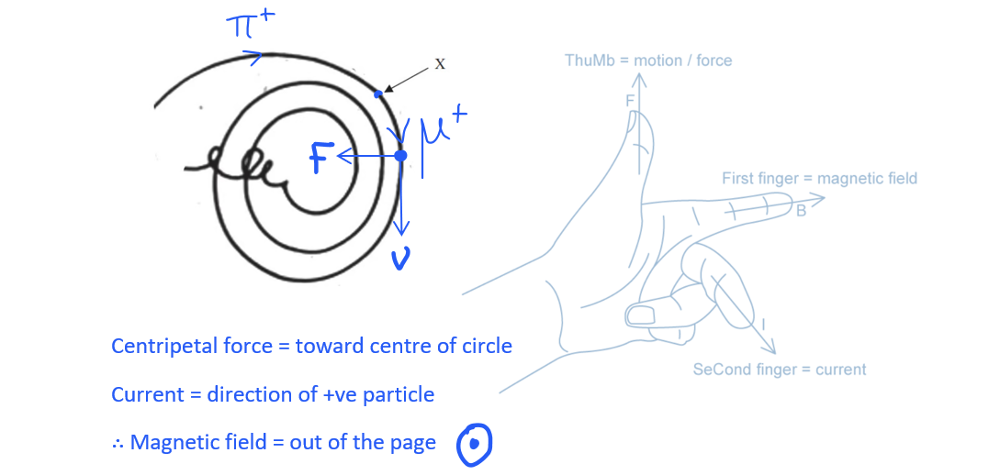
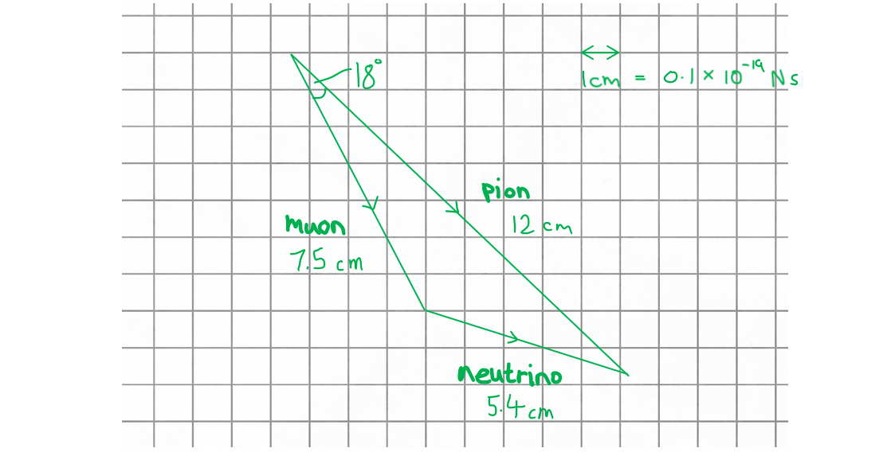
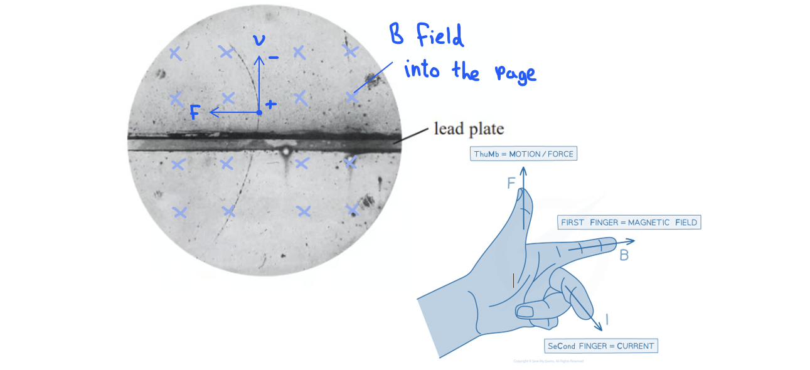

# Mark Schemes — Exploring the Structure of Matter
**4. Further Mechanics, Fields & Particles** · Edexcel International A Level (IAL) Physics (YPH11)

## Q1 — medium — 8 marks · structured-questions

### 13((a)) — 6 marks
The results of Rutherford's experiment were surprising and subsequently led to the nuclear model because:

The following list is the 'indicative marking points'. Stating all six will score **four marks**, less than six is marked according to the scale given below (in blue). The remaining **two marks** are given for the linking and explanation:

Indicative content (IC):

1. Prior to the experiment, the plum pudding model / J J Thomson model of the atom was the accepted model **OR** the atom was believed to have an equally distributed mass / charge throughout
2. The alpha particles were expected to go straight through / have only a small deflection
3. A small number of alphas were deflected straight back (180°) / through very large angles (>90°)
4. (Changed to) a model of the atom with a very small nucleus **OR** (changed to) a model of the atom where most is empty space
5. (In the new model) the nucleus is (positively) charged
6. (In the new model) the nucleus contains (almost) all the mass

**An example of an answer which would score 6 marks is:**

Prior to the experiment, the plum pudding model of the atom was the accepted model **[1]**. Rutherford expected his results to be consistent with this, so he was surprised when his results showed that atoms do not have an equally distributed mass or charge throughout **[linkage]**.

In Rutherford's experiments, most of the alpha particles passed straight through the foil without being deflected **[linkage]**, which is what he expected **[2]**. However, occasionally the alpha particles were deflected in their paths through very large angles, and rarely the alpha particles were deflected backwards at a 180° angle **[3]**.

Alpha particles are positively charged, and since like charges repel, Rutherford concluded that the cause of the large deflections **[linkage]** must be due to the presence of a very small, positively charged nucleus** ****[4] [5]****.** Further to this, he concluded that most of an atom is empty space since most of the alpha particles passed straight through **[linkage]**, and contained at the centre is a tiny, dense, positively charged nucleus that contains most of the mass of the atom **[6]**.

- Six indicative marking points; **[4 marks]**
- Linkage made between experimental observations and the previous and new models; **[2 marks]**

**[Total: 6 marks]**

- *The starred written questions assess your ability to **link** **facts** in a logically **structured** answer.*
- *In the table below, **indicative content (IC) points** are from the list above. The second column shows the **maximum marks** you can earn from these **statements**.*

  - *As you see, **6** correct **statements** are worth a total of **4 marks*

- *The third column is for ‘**linkage marks**’. This means how well you linked the statements in your argument. The maximum linkage mark depends on the number of statements. *

  - *Even if you linked well, only **one** linkage mark is available if you only mentioned **4 out of 6** IC points*

- *To score 6/6 marks, you will need a **full** **paragraph**, using a "point, evidence, explain" structure, **as well as** using your Physics to link together at least six points from the content you have learned. *

| > *Number of IC points* | > *Total IC marks* | > *Max. linkage marks* | > *Max. final mark* |
|---|---|---|---|
| > *6* | > *4* | > *2* | > *6* |
| > *5* | > *3* | > *2* | > *5* |
| > *4* | > *3* | > *1* | > *4* |
| > *3* | > *2* | > *1* | > *3* |
| > *2* | > *2* | > *0* | > *2* |
| > *1* | > *1* | > *0* | > *1* |
| > *0* | > *0* | > *0* | > *0* |

### 13((b)) — 2 marks
The thickness of the gold foil had to be very small because:

**EITHER**

- A thin sheet would contain few layers of atoms; **[1 mark]**
- So alpha particles would be less likely to be absorbed / undergo multiple deflections; **[1 mark]**

**OR**

- Alpha particles are strongly ionising; **[1 mark]**
- So alpha particles have low penetration / they can only penetrate a thin sheet; **[1 mark]**

**[Total: 2 marks]**

## Q2 — medium — 10 marks · structured-questions

### 18((a)) — 2 marks
The diagram shows that an anti‐muon must also have a positive charge because:

- It has the same direction of curvature (as the pion track); **[1 mark]**
- No other charged particle / visible track is produced (so charge is conserved); **[1 mark]**

**[Total: 2 marks]**

### 18((b)) — 3 marks
The diagram shows that the anti‐muon is travelling in a clockwise path because:

- The radius of the (spiral) path decreases (following it clockwise); **[1 mark]**
- The momentum / velocity / speed of the particle is decreasing; **[1 mark]**
- (As a result of) energy being transferred from the anti-muon (by ionisation and electromagnetic radiation); **[1 mark]**

**[Total: 3 marks]**

### 18((c)) — 1 marks
The direction of the magnetic field is:

- Out of the page / screen; **[1 mark]**

**[Total: 1 mark]**

- *Use the visual guide below with the reminder of Fleming's LH rule if you are not sure why the magnetic field is directed out of the page*

### 18((d)) — 3 marks
Calculate the radius of the path of the pion:

List the known quantities:

- Momentum of the pion, *p* = 1.2 × 10–19 N s
- Magnetic flux density, *B* = 3.5 T
- Charge of a pion, *Q* = 1.6 × 10–19 C **[1 mark]**

Use the equation for charged particle in a magnetic field to find *r*:

- In a magnetic field: $r=\frac{p}{BQ}$
- `r space equals space fraction numerator 1.2 cross times 10 to the power of negative 19 end exponent over denominator 3.5 cross times open parentheses 1.6 cross times 10 to the power of negative 19 end exponent close parentheses end fraction` **[1 mark]**
- Radius = 0.21 m **[1 mark]**

**[Total: 3 marks]**

- *The charge of the muon is not explicitly stated in the question*

  - *However, we know it is positive, so it has a relative charge of +1**e*

### 18((e)) — 1 marks
i) The equation for this decay process is as follows:

- $π\rightarrowμ^{+}+ν_{μ}$ **[1 mark]**

ii) Use a scale diagram to deduce whether momentum is conserved:

- Straight lines drawn and at least one correctly labelled (pion, muon or neutrino); **[1 mark]**
- A sensible scale is used e.g. 1 cm = 0.1 × 10−19 N s; **[1 mark]**
- All three vectors drawn correctly end to end; **[1 mark]**
- Correct arrows on at least two vectors; **[1 mark]**

Write a concluding statement:

- The three lines form a closed triangle (with arrows in correct direction) hence conservation of momentum is obeyed; **[1 mark] ** **OR**
- Conclusion that a quantity resulting from the scale drawing has the correct value; **[1 mark]**

*Example of alternate calculation & conclusion*

- Measured angle between pion and neutrino is 25° which is consistent with the sine rule `fraction numerator sin space A over denominator A end fraction space equals space fraction numerator sin space B over denominator B end fraction space space space rightwards double arrow space space space B space equals space sin to the power of negative 1 end exponent space open parentheses fraction numerator 7.5 over denominator 5.4 end fraction cross times sin space 18 degree close parentheses space equals space 25.4 degree`

**[Total: 6 marks]**

- *Although it's not necessary for the mark, adding what you've considered the scale in your diagram (the top right of the mark scheme image) will help the examiner see that you have considered this for the mark*
- *If you are struggling to understand scaled vector drawings, make sure you revise this from the vectors topic*

  - *You will be expected to do these in any topic, not just in forces*

## Q3 — hard — 6 marks · structured-questions

### 12((a)) — 2 marks
Derive the energy-momentum relation:

- Start with kinetic energy:  $E_{k}=\frac{1}{2}mv^{2}$
- Multiply $E_{k}$ by $\frac{m}{m}$

  - `E subscript k space equals space m over m cross times space open parentheses 1 half m v squared close parentheses space equals space fraction numerator m cross times m v squared over denominator 2 cross times m end fraction space equals space fraction numerator m squared v squared over denominator 2 m end fraction` **[1 mark]**
- Substitute in momentum: $p=mv$
- `E subscript k space equals space fraction numerator open parentheses m v close parentheses squared over denominator 2 m end fraction space equals space fraction numerator p squared over denominator 2 m end fraction` **[1 mark]**

**[Total: 2 marks]**

### 12((b)) — 4 marks
Calculate the momentum of the ion when it reaches the next drift tube:

List the known quantities:

- Mass of mercury ion, *m* = 3.32 × 10–25 kg
- Charge of mercury ion, *Q* = 1.60 × 10–19 C
- Electric field strength between drift tubes, *E* = 7.64 × 106 V m–1
- Distance between drift tubes, Δ*s* = 5.50 × 10–3 m
- Initial kinetic energy of mercury ion = 6.42 × 10–15 J

Determine the electric force on the ion:

- Electric force on the ion due to the field:  $F=EQ$
- *F* = (7.64 × 106) × (1.60 × 10–19) = 1.22 × 10–12 N **[1 mark]**

Determine the kinetic energy of the ion when it reaches the next tube:

- Energy transferred to the ion by the field: $W=F\Deltas$
- *W* = (1.22 × 10–12) × (5.50 × 10–3) = 6.72 × 10–15 J **[1 mark]**
- Final kinetic energy: *E**k* = (6.72 + 6.42) × 10–15 = 1.31 × 10–14 J

Use the energy-momentum relation:

- $E_{k}=\frac{p^{2}}{2m}\Rightarrowp=\sqrt{2mE_{k}}$
- `p space equals space square root of 2 space cross times space open parentheses 3.32 cross times 10 to the power of negative 25 end exponent close parentheses space cross times space open parentheses 1.31 cross times 10 to the power of negative 14 end exponent close parentheses end root` **[1 mark]**
- Momentum = 9.33 × 10–20 kg m s−1 **[1 mark]**

**[Total: 4 marks]**

## Q4 — hard — 16 marks · structured-questions

### 18((a)) — 3 marks
The properties of a positron which show it is the antiparticle of the electron are:

- It has an equal mass (to the mass of an electron); **[1 mark]**
- It has an equal and opposite charge (to the charge of an electron); **[1 mark]**
- It has an equal and opposite lepton number (to the lepton number of an electron); **[1 mark]**

**[Total: 3 marks]**

### 18((b)) — 3 marks
The direction of the magnetic field can be deduced because:

- The curvature is greater in the top half (of image);** [1 mark]**
- Particle must be moving slower after passing through the lead plate due to energy loss, hence it moves from the lower half to the top half; **[1 mark]**

Apply Fleming's left hand rule to determine the direction of the field:

- Force (thumb) = to the left
- Motion (second finger) = upwards
- Field (first finger) = into the page; **[1 mark]**

**[Total: 3 marks]**

- *If you struggle to visualise the motion of charged particles in a magnetic field, start by drawing the directions of the components you do know*

  - *Centripetal force = towards the centre of the circular path*
  - *Current = in the direction of a positive particle (remember + → −)*

### 18((c)) — 6 marks
List the known quantities:

- Positron energy, *E* = 23 MeV
- Positron mass, *m**e* = 9.11 × 10−31 kg
- Electronvolt, 1 eV = 1.6 × 10−19 J
- Speed of light, *c* = 3 × 108 m s−1
- Radius of curvature of path, *r* = 3.7 cm = 0.037 m
- Charge of a positron, *Q* = 1.6 × 10−19 C

i) Show that the positron must have been travelling at a relativistic speed:

- Convert from eV to J:  *E**k* = (23 × 106) × (1.6 × 10−19) **[1 mark]**
- Kinetic energy:  $E_{k}=\frac{1}{2}mv^{2}\Rightarrowv=\sqrt{\frac{2E_{k}}{m}}$
- `v space equals space square root of fraction numerator 2 cross times open parentheses 23 cross times 10 to the power of 6 close parentheses cross times open parentheses 1.6 cross times 10 to the power of negative 19 end exponent close parentheses over denominator 9.11 cross times 10 to the power of negative 31 end exponent end fraction end root` = 2.8 × 109 m s−1 **[1 mark]**
- The speed of the positron (2.8 × 109 m s−1) is greater than the speed of light (3.0 × 108 m s−1) hence it must be relativistic; **[1 mark]**

ii) Determine the magnetic flux density of the magnetic field:

- Relativistic energy-momentum:  $E=pc$
- `p space equals space E over c space equals space fraction numerator open parentheses 23 cross times 10 to the power of 6 close parentheses cross times open parentheses 1.6 cross times 10 to the power of negative 19 end exponent close parentheses over denominator 3.0 cross times 10 to the power of 8 end fraction` = 1.2 × 10−20 N s **[1 mark]**
- Radius of a particle in a magnetic field:  $r=\frac{p}{BQ}$
- `B space equals space fraction numerator p over denominator r Q end fraction space equals space fraction numerator 1.2 cross times 10 to the power of negative 20 end exponent over denominator 0.037 cross times open parentheses 1.6 cross times 10 to the power of negative 19 end exponent close parentheses end fraction` = 2.072 **[1 mark]**
- Magnetic flux density = 2.1 T **[1 mark]**

**[Total: 6 marks]**

### 18((d)) — 4 marks
Calculate the frequency of the gamma radiation produced in the annihilation:

List the known quantities:

- Electron / positron speed, *v* = 1.5 × 107 m s−1
- Electron / positron mass, *m**e* = 9.11 × 10−31 kg
- Speed of light, *c* = 3.0 × 108 m s−1
- Planck constant, *h* = 6.63 × 10−34 J s

Determine the kinetic energy of the electron and positron:

- Kinetic energy:  `E subscript k space equals space 1 half m v squared space space space space space rightwards double arrow space space space space space E subscript k space equals space stack stack open parentheses 1 half m subscript e v squared close parentheses with underbrace below with e l e c t r o n below space space plus space space stack stack open parentheses 1 half m subscript e v squared close parentheses with underbrace below with p o s i t r o n below`
- `E subscript k space equals space 2 space cross times space 1 half space cross times space open parentheses 9.11 cross times 10 to the power of negative 31 end exponent close parentheses space cross times space open parentheses 1.5 cross times 10 to the power of 7 close parentheses squared` = 2.0 × 10−16 J **[1 mark]**

Use mass-energy equivalence to determine the total energy available:

- Mass-energy equivalence:  $\DeltaE=c^{2}\Deltam$
- `increment E space equals space open parentheses 3.0 cross times 10 to the power of 8 close parentheses squared cross times 2 cross times open parentheses 9.11 cross times 10 to the power of negative 31 end exponent close parentheses` = 1.64 × 10−13 J **[1 mark]**
- Total energy = (1.64 × 10−13) + (2.0 × 10−16) = 1.642 × 10−13 J

Determine the energy and frequency of one gamma photon:

- Photon energy:  $E=hf\Rightarrowf=\frac{E}{h}$
- Energy for one gamma photon = ½ × (1.642 × 10−13) = 8.21 × 10−12 J
- $f=\frac{8.21\times10^{-12}}{6.63\times10^{-34}}$ = 1.238 × 1020 Hz **[1 mark]**
- Frequency = 1.2 × 1020 Hz **[1 mark]**

**[Total: 4 marks]**

## Q5 — hard — 14 marks · structured-questions

### 1() — 3 marks
> **[mark-scheme]**
> (i) The quark structure of a $π^{-}$ particle is:
> 
> - $d\overline{u}$ **[1 mark]**

> **[exam-tip]**
> You should know that mesons are made from a quark and an antiquark. Pions are particles that don't contain strange quarks, only up and down quarks. So you should be able to work out that a neutral $π^{0}$ particle can be $u\overline{u}$ or $d\overline{d}$ (it is its own antiparticle), a $π^{+}$ particle is $u\overline{d}$, and a $π^{-}$ particle is $d\overline{u}$.

(ii) The particle equation for the decay of $π^{-}$ is:

$π^{-}\rightarrowμ^{-}+\overline{ν}_{μ}$

**[2 marks]**

> **[mark-scheme]**
> 1 mark for writing the correct symbols for the muon ($μ$) and muon antineutrino ($\overline{ν}_{μ}$)
> 
> - Do not accept $ν_{μ}$ (neutrino without bar)
> - Do not award this mark if any additional symbols are given
> 
> 1 mark for marking the muon as negative ($μ^{-}$)
> 
> - Ignore 0 if written next to $\overline{ν}_{μ}$

> **[exam-tip]**
> The stem says a "neutrino" but conservation of muon lepton number forces the second product to be an **anti**neutrino. The muon ($μ^{-}$) has $L_{μ} = + 1$, so the other product must have $L_{μ} = - 1$ — that is the muon antineutrino. Always check conservation laws when completing weak-decay equations.

### 2() — 2 marks
Two other conservation laws applied to this decay:

- Conservation of charge:

  - $π^{-}$ charge $=-1$
  - $μ^{-}$ charge $=-1$
  - $\overline{ν}_{μ}$ charge $=0$

$π^{-}\rightarrowμ^{-}+\overline{ν}_{μ}$

$-1\rightarrow-1+0$

Total charge $=-1$ before and after, therefore, charge is conserved

**[1 mark]**

- Conservation of lepton number:

  - $π^{-}$ lepton number $=0$
  - $μ^{-}$ lepton number $=+1$
  - $\overline{ν}_{μ}$ lepton number $=-1$

$π^{-}\rightarrowμ^{-}+\overline{ν}_{μ}$

`0 space rightwards arrow space 1 space plus space open parentheses negative 1 close parentheses`

Total lepton number $=0$ before and after, therefore, lepton number is conserved

**[1 mark]**

> **[mark-scheme]**
> Any **two** from (1 mark per point):
> 
> - Charge: $-1\rightarrow-1+0$
> - Lepton number: `0 space rightwards arrow space 1 space plus space open parentheses negative 1 close parentheses`
> - Baryon number: $0\rightarrow0+0$
> 
> To score each mark, the conservation law must be named **AND** correctly applied to the decay $π^{-}\rightarrowμ^{-}+\overline{ν}_{μ}$

### 3() — 3 marks
To calculate the mass of the $π^{-}$ particle in kg:

- List the known quantities:

  - Rest mass of $π^{-}$ particle, $m=139.57\text{MeV/c}^{2}$
  - Speed of light, $c=3.00\times10^{8}\text{m s}^{-1}$
  - $1\text{eV}=1.60\times10^{-19}\text{J}$
- Convert the energy from MeV to joules:

$1 \text{MeV} = 1 . 60 \times 10^{-13} \text{J}$

`E space equals space 139.57 cross times open parentheses 1.60 cross times 10 to the power of negative 13 end exponent close parentheses space equals space 2.23 cross times 10 to the power of negative 11 end exponent text  J end text` **[1 mark]**

- Use energy-mass equivalence and rearrange for mass:

$\DeltaE=c^{2}\Deltam$

$m=\frac{E}{c^{2}}$

`m space equals space fraction numerator 139.57 cross times open parentheses 1.60 cross times 10 to the power of negative 13 end exponent close parentheses over denominator left parenthesis 3.00 cross times 10 to the power of 8 right parenthesis squared end fraction` **[1 mark]**

$m=$ $2.48\times10^{-28}\text{kg}$ **[1 mark]**

> **[mark-scheme]**
> 1 mark for converting energy from MeV to J ($2.23\times10^{-11}\text{J}$)
> 
> 1 mark for substitution into $m=E/c^{2}$
> 
> 1 mark for the correct final answer ($2.5\times10^{-28}\text{kg}$)
> 
> - Accept answers to 2 or 3 s.f.
> - Full marks can be scored for a correct answer alone

### 4() — 2 marks
> **[mark-scheme]**
> - The (kinetic) energy of the cosmic ray (proton) is converted into matter / mass according to $\DeltaE=c^{2}\Deltam$  **[1 mark]**
> - The energy of one cosmic ray (proton) is large enough to provide the total rest mass of multiple pions
> **OR**
> Each cosmic ray (proton) must have an energy of at least $140\text{MeV}$ ($139.57\text{MeV}$) per pion created **[1 mark]**
> 
> Ignore references to collisions or the idea of particles sticking together

### 5() — 4 marks
The time taken for a muon to travel $10\text{km}$ is predicted to be:

`t space equals space d over v space equals space fraction numerator 10   000 over denominator 0.99 cross times open parentheses 3.00 cross times 10 to the power of 8 close parentheses end fraction space almost equal to space 3.4 cross times 10 to the power of negative 5 end exponent text  s end text` **[1 mark]**

The average lifetime of a muon is $2.2\times10^{-6}\text{s}$, which is much shorter than $3.4\times10^{-5}\text{s}$. So, according to classical mechanics, most muons should decay before reaching sea level.

However, at speeds close to the speed of light, relativistic effects become significant **[1 mark]**

As a result, time dilation occurs, which means the lifetime of a muon travelling at $0.99c$ is much longer compared to a muon at rest **[1 mark]**

The relativistic effect allows significantly more muons to reach sea level before decaying. Therefore, the observation is consistent with ideas from relativity **[1 mark]**

> **[mark-scheme]**
> 1 mark for a calculation of time or distance without relativistic effects, e.g.
> 
> - Time to travel $10\text{km}$ at $0.99c$ ($3.4\times10^{-5}\text{s}$, or $34\text{μs}$)
> - **OR** distance travelled at $0.99c$ in $2.2\text{μs}$ ($650\text{m}$)
> 
> 1 mark for identifying that relativistic effects will be significant (as velocity close to c)
> 
> - Accept mention of time dilation or length contraction
> 
> 1 mark for stating the effect on muon lifetime or time of flight due to relativistic effects
> 
> - (To observers on Earth) muon lifetime increases
> - (To the muon) distance to Earth / sea level decreases
> 
> 1 mark for a conclusion that is consistent with the reason why most muons reach the ground
> 
> - Expected conclusion: The observation is consistent with ideas from relativity, as the relativistic effects allow more muons to reach sea level than classical mechanics predicts

> **[exam-tip]**
> "Explain whether ... consistent with" questions require all three of: a calculation, a comparison, and an explicit verdict. Either frame (Earth's or muon's) is acceptable for the relativistic explanation — you do not need to discuss both. Note that the spec for this topic does not require you to use relativistic equations such as the Lorentz factor.

## Q6 — hard — 10 marks · structured-questions

### 1() — 2 marks
> **[mark-scheme]**
> - The metal disc / cathode is heated (by a current) **[1 mark]**
> - Electrons are released by thermionic emission **[1 mark]**

### 2() — 2 marks
To calculate the accelerating potential difference:

- List the known quantities:

  - Kinetic energy gained, $E_{k}=8.0\times10^{-12}\text{J}$
  - Electron charge, $e=1.60\times10^{-19}\text{C}$
- The work done by the accelerating p.d. equals the kinetic energy gained (the electron starts from rest)

$W=QV$

$E_{k}=eV$

- Substitute the values into the equation and calculate:

$V=\frac{E_{k}}{e}$

$V=\frac{8.0\times10^{-12}}{1.60\times10^{-19}}$ **[1 mark]**

$V=5.0\times10^{7}\text{V}=$ $50\text{MV}$ **[1 mark]**

> **[mark-scheme]**
> 1 mark for use of $W=QV$ (or equivalent, e.g. $E_{k} = e V$)
> 
> 1 mark for a final answer of $5.0\times10^{7}\text{V}$ (or $50\text{MV}$)

### 3() — 6 marks
Once electrons are released, they are accelerated by an electric field towards the first drift tube. The electric field inside each drift tube is zero, so the electron travels through each tube at constant velocity.

Between adjacent drift tubes is a narrow gap in which the alternating p.d. sets up an electric field. When the electron reaches a gap, the field is in the direction that accelerates it toward the next tube; the electron gains kinetic energy as it crosses the gap.

While the electron is inside the next drift tube, the polarity of the a.c. supply reverses. The tube length is chosen so that the time the electron spends in each tube equals half the period of the a.c. supply, so when the electron emerges into the next gap, the field has reversed and is again in the direction that accelerates it. Since the electron becomes faster after each gap along the linac, the drift tubes must be made progressively longer to keep the time spent in each one constant.

The total kinetic energy gained is the product of the electron charge and the total accelerating potential difference across all gaps, which gives each electron a kinetic energy of $8.0\times10^{-12}\text{J}$, or $50\text{MeV}$.

**[6 marks]**

> **[mark-scheme]**
> This is a levelled response question. Each point made in the answer does not equal one mark.
> 
> Marks are awarded for indicative content and for how the answer is structured, with linked and fully sustained lines of reasoning. The banding table shows how the indicative content (IC) and linkage marks should be awarded, up to a maximum of 6 marks.
> 
> **Indicative content**
> 
> - **IC1 **The electrons are accelerated by an electric field / potential difference
> 
> - **IC2** Acceleration takes place in the gaps between tubes
> 
> - **IC3** Adjacent tubes are connected to opposite terminals of the (a.c.) supply **OR** the (a.c.) polarity changes (when the electrons are in the tubes)
> 
> - **IC4 **The (a.c.) supply / p.d. / electric field is alternating, so the (electric) field is always in the same (positive) direction (when the electrons are in the gaps) **OR** it is always accelerating the electrons
> 
> - **IC5** The frequency of the a.c. supply is constant
> 
> - **IC6** The time spent in each tube / gap must be the same, so the tubes / gaps must get longer as the electrons travel faster
> 
> **Linkage**
> 
> - **1 linkage mark** for a clear answer that shows a coherent and logical structure
> - **1 linkage mark** for fully sustained lines of reasoning demonstrated throughout
> 
> **Banding table**
> 
> | IC points | IC mark | Max linkage mark | Max final mark |
> |---|---|---|---|
> | 6 | 4 | 2 | 6 |
> | 5 | 4 | 1 | 5 |
> | 4 | 3 | 1 | 4 |
> | 3 | 2 | 1 | 3 |
> | 2 | 2 | 0 | 2 |
> | 1 | 1 | 0 | 1 |
> | 0 | 0 | 0 | 0 |

> **[exam-tip]**
> Starred (QWC) questions reward structured answers. Organise your response into three logical blocks: (1) alternating p.d., (2) drift tubes, and (3) timing, covering each in turn to maximise IC coverage.
> 
> Do not confuse linacs with cyclotrons:
> 
> - a linac uses an alternating electric field in a straight line of drift tubes
> - a cyclotron uses a constant magnetic field to circle the particle through a single accelerating gap twice per revolution

## Q7 — medium — 1 marks · multiple-choice-questions

### 8() — 1 marks
**Correct answer: B** — Electrons can be part of an atom.

**Final answer:** **The incorrect answer is ****B**** because:**

- Electrons are ideal to use to probe the nuclei of atoms because:

  - They can be accelerated to high energies, which decreases their de Broglie wavelength ($E\propto\frac{1}{λ}$)
  - The closer the de Broglie wavelength to the size of nuclei, the **greater** the diffraction effects observed and the more **detail** that can be resolved

- This eliminates options **A**, **C** & **D **as these statements are correct

- The statement "electrons can be part of an atom" has nothing to do with the use of electrons as atomic probes

  - Hence option **B** is incorrect

## Q8 — medium — 1 marks · multiple-choice-questions

### 1() — 1 marks
**Correct answer: D** — 

**Final answer:** **The correct answer is ****D**** because:**

- The atomic number is 8, therefore the proton number is 8
- The mass number is 17, therefore the nucleon number is 17

  - Neutron number = nucleon number - proton number = 17 - 8 = 9

## Q9 — medium — 1 marks · multiple-choice-questions

### 5() — 1 marks
**Correct answer: D** — thermionic emission

**Final answer:** **The correct answer is ****D**** because:**

- Thermionic emission is the release of electrons from a hot metal

- Ionisation is a chemical change resulting in the gain or loss of electrons
- Photoelectric emission is the release of electrons due to the energy carried by light of a certain frequency
- Relativistic effects are the differences between values calculated by models that consider relativity and those that don't

## Q10 — medium — 1 marks · multiple-choice-questions

### 6() — 1 marks
**Correct answer: B** — increasing the distance between the plates

**Final answer:** **The correct answer is ****B**** because:**

- Deflection is caused when the charged particle passes through the electric field between the plates
- Increasing the distance between the plates reduces the strength of the field where the charged particle moves ($E=\frac{V}{d}$)

  - Therefore the angle of deflection also reduces

## Q11 — medium — 1 marks · multiple-choice-questions

### 8() — 1 marks
**Correct answer: C** — The nucleus contains neutrons and protons.

**Final answer:** **The correct answer is ****C**** because:**

- Rutherford's experiment suggested that the nucleus was positively charged but did not allow researchers to deduce anything about non-charged (neutral) particles

**A** is a correct statement as the deflection of positively charged particles suggested a positively charged nucleus

**B** and **D** are correct as the small numbers of deflections suggested a very small nucleus compared to the size of the atom

## Q12 — medium — 1 marks · multiple-choice-questions

### 9() — 1 marks
**Correct answer: D** — increasing the maximum potential difference across the dees

**Final answer:** **The correct answer is ****D**** because:**

- A cyclotron uses both an electric field and a magnetic field to accelerate charged particles
- The magnetic field is applied perpendicular to the dees

  - This is responsible for maintaining the circular path of the particles within the dees

- The electric field is applied between the dees

  - This is responsible for accelerating the particles across the gap between the dees using a high-frequency alternating p.d.
  - The kinetic energy gained by the particle with charge *e* is given by $W=QV\RightarrowE_{k}=eV$

- Therefore, increasing the maximum p.d. would increase the energy transferred to the particles

**A** is incorrect as $E\propto\frac{1}{d}$ so increasing the distance between the dees would only decrease the strength of the E-field and hence, a greater p.d. would be required to achieve the same amount of energy transferred to the particles

**B** is incorrect as increasing the frequency of the p.d. across the dees would only change the direction of the E-field more frequently, this would not change the amount of energy transferred to the particles over one revolution

**C** is incorrect as $B\propto\frac{1}{r}$so increasing the strength of the B-field would only increase the centripetal force experienced by the particles and hence reduce the radius of their circular path

## Q13 — medium — 1 marks · multiple-choice-questions

### 10() — 1 marks
**Correct answer: D** — to produce short de Broglie wavelengths

**Final answer:** **The only correct answer is ****D**** because:**

- Energy is related to the de Broglie wavelength by the equations $E=hf=\frac{hc}{λ}$
- Therefore energy is inversely proportional to wavelength
- Since short de Broglie wavelengths are needed to investigate the structure of nucleons at smaller scales, high energy electrons will be required

**A** is incorrect because these experiments are not about the creation of new particles

**B** is incorrect because negative electrons do not experience repulsive electrostatic forces from positive protons or neutral neutrons

**C** is incorrect because particle lifetime is not relevant as all of the particles involved are believed to be stable, as long as neutrons are in a nucleus

## Q14 — hard — 1 marks · multiple-choice-questions

### 1() — 1 marks
**Correct answer: B** — The momentum of the ejected electron is greater than the momentum of the electron–positron pair

**Final answer:** **The correct answer is B**

- A charged particle moving in a magnetic field follows a circular path of radius $r = p / ( q B )$
- All three particles produced in this interaction have a charge of $e$, so the spiral radius depends only on momentum
- The ejected electron leaves a nearly straight track (very large $r$), while the electron and positron of the pair leave tightly wound spirals (small $r$)
- The ejected electron, therefore, has a greater momentum than each particle in the e⁻–e⁺ pair.

**A** is incorrect because photons are uncharged and do not ionise the bubble chamber medium, so they leave no visible track. The nearly straight track is the ejected electron travelling away from the interaction. Therefore, by conservation of momentum, the photon entered from the left.

**C** is incorrect because the direction of the magnetic field is into the page. The nearly straight track, which is the ejected electron, is deflected downward slightly, indicating the lower spiral of the two pair tracks is the electron. Using Fleming's left-hand rule:

- the thumb (force) points towards the centre of the circular path
- the second finger (current) points in the opposite direction to the electron's path
- as a result, the first finger (field) points **into the page**

**D** is incorrect because charge is conserved overall in the interaction:

- Before collision: photon charge = 0, hydrogen atom charge = 0
- After collision: hydrogen nucleus (proton) charge = +1, ejected electron charge = -1, electron-positron pair charge (= -1+1) = 0, therefore overall charge = 0

> **[exam-tip]**
> Bubble chamber problems test two distinct skills: knowing what leaves a track (only charged particles — photons are invisible because they do not ionise the medium) and knowing how track geometry relates to momentum ($r = p / ( q B )$). A track of large radius means large momentum; tightly wound spirals mean low momentum. The presence of an uncharged particle like a photon is inferred from what it leaves behind — here, the ejected electron's straight track and the e⁻–e⁺ pair appearing seemingly out of nowhere.
