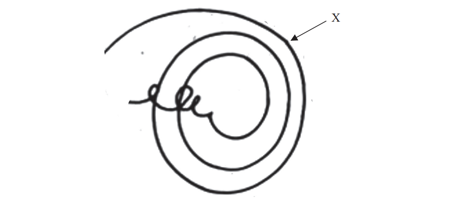
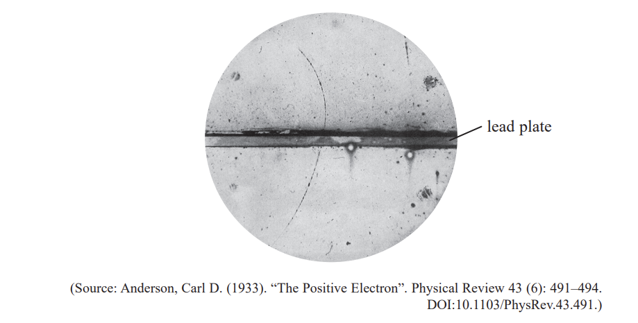
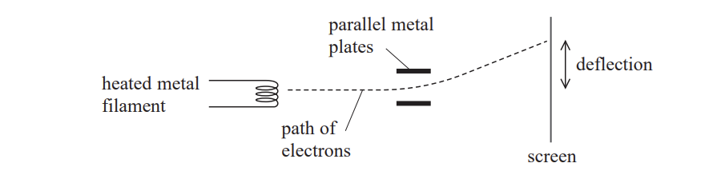
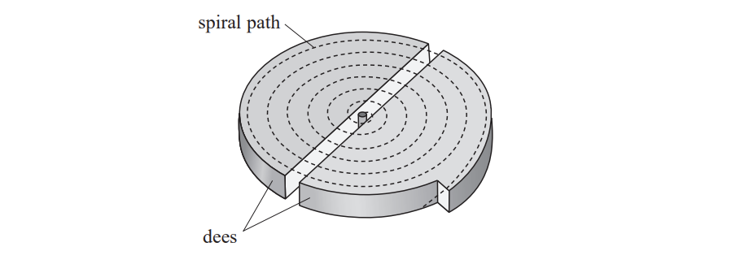

# Exam Questions — Exploring the Structure of Matter
**4. Further Mechanics, Fields & Particles** · Edexcel International A Level (IAL) Physics (YPH11)
> Source: [https://www.savemyexams.com/international-a-level/physics/edexcel/19/topic-questions/4-further-mechanics-fields-and-particles/exploring-the-structure-of-matter/structured-questions/](https://www.savemyexams.com/international-a-level/physics/edexcel/19/topic-questions/4-further-mechanics-fields-and-particles/exploring-the-structure-of-matter/structured-questions/) · 14 questions · total 72 marks

## Q1 — medium — 8 marks · structured-questions

### 13((a)) — 6 marks — command: explain — structured — from paper Oct/Nov 2021 · WPH14/01
The alpha particle scattering experiments using gold foil were first carried out by a team of scientists led by Rutherford.

Following these experiments Rutherford said

“It was almost as incredible as if you fired a 15‐inch shell (large missile) at a piece of tissue paper and it came back and hit you.”

Explain why Rutherford was surprised at the results of the experiment and how this led to the nuclear model for the atom.

### 13((b)) — 2 marks — command: explain — structured — from paper Oct/Nov 2021 · WPH14/01
Explain why the thickness of the gold foil had to be very small.

## Q2 — medium — 10 marks · structured-questions

### 18((a)) — 2 marks — command: state — structured — from paper Oct/Nov 2021 · WPH14/01
The diagram shows particle tracks in a detector.

A positive pion decays into an anti‐muon at point X.

State two ways in which the diagram shows that an anti‐muon must also have a positive charge.

### 18((b)) — 3 marks — command: explain — structured — from paper Oct/Nov 2021 · WPH14/01
Explain how the diagram shows that the anti‐muon is travelling in a clockwise path.

### 18((c)) — 1 mark — command: state — structured — from paper Oct/Nov 2021 · WPH14/01
State the direction of the magnetic field acting in the detector.

### 18((d)) — 3 marks — command: calculate — structured — from paper Oct/Nov 2021 · WPH14/01
The momentum of the pion is 1.2 ×10–19 N s.

Calculate the radius of the path of the pion.

magnetic flux density = 3.5 T

Radius = ...........................................

### 18((e)) — 1 mark — command: multiple — structured — from paper Oct/Nov 2021 · WPH14/01
A neutrino is also produced at X.

i) Write an equation for this decay process.

**(1)**

ii) The initial path of the muon is at an angle of 18° to the direction of the pion, as shown. Data for the momentum of each particle at point X is listed below.

momentum of pion = 1.2 × 10–19 N s

momentum of muon = 0.75 × 10–19 N s

momentum of neutrino = 0.54 × 10–19 N s

Deduce whether this data is consistent with the law of conservation of momentum. You should include a scaled vector diagram in the space below.

**(5)**

## Q3 — hard — 6 marks · structured-questions

### 12((a)) — 2 marks — command: derive — structured — from paper June 2021 · WPH14/01
In 1931, Sloan and Lawrence built a linear accelerator (linac) with several drift tubes.

They used the linac to accelerate mercury ions up to energies of 1.26 MeV. The behaviour of the particles was non-relativistic.

The kinetic energy of a non-relativistic particle of mass *m* with momentum *p* is given by

$E_{k}=\frac{p^{2}}{2m}$

Derive this formula.

### 12((b)) — 4 marks — command: calculate — structured — from paper June 2021 · WPH14/01
A mercury ion with kinetic energy 6.42 × 10–15 J leaves a drift tube, as shown.

Calculate the momentum of the mercury ion when it reaches the next drift tube.

mass of mercury ion = 3.32 × 10–25 kg

charge of mercury ion = 1.60 × 10–19 C

electric field strength between drift tubes = 7.64 × 106 Vm–1

distance between drift tubes = 5.50 × 10–3 m

Momentum = ........................................

## Q4 — hard — 16 marks · structured-questions

### 18((a)) — 3 marks — command: state — structured — from paper June 2021 · WPH14/01
In 1932, Carl Anderson published this photograph of a track in a cloud chamber. The cloud chamber contained a lead plate. There was a magnetic field perpendicular to the plane of the track.

The photograph shows the track of a positron from cosmic rays and is the first photographic record of the existence of an antiparticle.

State the properties of a positron that show it is the antiparticle to the electron.

### 18((b)) — 3 marks — command: deduce — structured — from paper June 2021 · WPH14/01
Deduce the direction of the magnetic field.

Direction of magnetic field = .........................................

### 18((c)) — 6 marks — command: multiple — structured — from paper June 2021 · WPH14/01
In the upper part of the photograph the positron had an energy of 23 MeV.

i) Show that the positron must have been travelling at a relativistic speed. Assume that all of its energy is kinetic energy.

**(3)**

ii) For relativistic particles such as this positron, momentum obeys the relationship

*E = pc*

where *E* = particle energy, *p* = particle momentum and *c* = speed of light.

Determine the magnetic flux density of the magnetic field.

radius of curvature of path = 3.7 cm

Magnetic flux density = .........................................**(3)**

### 18((d)) — 4 marks — command: calculate — structured — from paper June 2021 · WPH14/01
A positron travelling at a non-relativistic speed of 1.5 × 107 m s−1 collides with an electron travelling at the same speed in the opposite direction. This collision results in the production of gamma radiation.

Calculate the frequency of the gamma radiation produced.

Frequency = ..........................................

## Q5 — hard — 14 marks · structured-questions

### 1() — 3 marks — command: multiple — structured
The $π^{-}$ particle is a meson of mass $139.57\text{MeV/c}^{2}$. It decays via the weak interaction, producing a muon and a neutrino.

The table shows the properties of two quarks.

| Quark | Charge  / *e* |
|---|---|
| $u$ | $+2/3$ |
| $d$ | $-1/3$ |

(i) Give the quark structure of a $π^{-}$ particle.

[1]

(ii) Complete the particle equation for this decay.

$π^{-}\rightarrow$

[2]

### 2() — 2 marks — command: explain — structured
Energy and momentum must be conserved in this decay.

Explain how two other conservation laws apply to this decay.

### 3() — 3 marks — command: calculate — structured
Calculate the mass, in kg, of the $π^{-}$ particle.

### 4() — 2 marks — command: explain — structured
Pions are produced in the upper atmosphere when cosmic rays, consisting mainly of high-energy protons, collide with nuclei.

Explain why a single cosmic ray could lead to the creation of several pions.

### 5() — 4 marks — command: calculate — structured
The muons produced from the decay of these pions travel towards the Earth's surface at a velocity of $0.99c$. The average lifetime for muons at rest is $2.2\times10^{-6}\text{s}$, yet muons produced at a height of $10\text{km}$ are found in significant numbers at sea level.

Explain whether this observation is consistent with ideas from relativity. Your answer should include a calculation.

## Q6 — hard — 10 marks · structured-questions

### 1() — 2 marks — command: describe — structured
A hospital radiotherapy unit uses a linear accelerator (linac) to produce beams of high-energy electrons.

The diagram shows the initial section of a linac. The electron source is a metal disc.

Describe how a metal disc can be made to emit electrons.

### 2() — 2 marks — command: calculate — structured
Each electron leaves the linac with a kinetic energy of $8.0\times10^{-12}\text{J}$.

Calculate the potential difference of the a.c. supply.

### 3() — 6 marks — command: explain — structured
Explain how the linac produces a beam of high-energy electrons.

## Q7 — medium — 1 marks · multiple-choice-questions

### 8() — 1 mark — multiple_choice — from paper Oct/Nov 2021 · WPH14/01
Which of the following statements does **not** help to explain why electrons can be used to probe the nuclei of atoms?
- **A.** Electrons can be accelerated to high energies.
- **B.** Electrons can be part of an atom.
- **C.** Electrons can exhibit diffraction effects.
- **D.** Electrons can have wavelengths similar in size to nuclear diameters.

## Q8 — medium — 1 marks · multiple-choice-questions

### 1() — 1 mark — multiple_choice — from paper 2022 Jan · WPH14/01
`straight O presubscript 8 presuperscript 17` is an isotope of oxygen.

Which row of the table gives the number of nucleons and the number of neutrons in an atom of `O presubscript 8 presuperscript 17`?

|   | **Number of nucleons** | **Number of neutrons** |
|---|---|---|
| **A** | 8 | 8 |
| **B** | 8 | 9 |
| **C** | 17 | 8 |
| **D** | 17 | 9 |
- **A.** 
- **B.** 
- **C.** 
- **D.** 

## Q9 — medium — 1 marks · multiple-choice-questions

### 5() — 1 mark — multiple_choice — from paper 2022 Jan · WPH14/01
The diagram shows some of the components in a cathode ray tube.

Electrons are released from the heated metal filament.

Which of the following is the name of this process?
- **A.** ionisation
- **B.** photoelectric emission
- **C.** relativistic effect
- **D.** thermionic emission

## Q10 — medium — 1 marks · multiple-choice-questions

### 6() — 1 mark — multiple_choice — from paper 2022 Jan · WPH14/01
The diagram shows some of the components in a cathode ray tube.

When a potential difference is applied across the parallel metal plates, the electrons are deflected.

Which of the following changes would decrease the deflection of the electrons?
- **A.** increasing the current in the metal filament
- **B.** increasing the distance between the plates
- **C.** increasing the length of the plates
- **D.** increasing the potential difference across the plates

## Q11 — medium — 1 marks · multiple-choice-questions

### 8() — 1 mark — multiple_choice — from paper 2022 Jan · WPH14/01
In the early 20th century experiments were carried out to measure the scattering of alpha particles after striking thin gold foil.

Which of the following could **not** be concluded from the results of these experiments?
- **A.** The nucleus is charged.
- **B.** The nucleus contains most of the mass of the atom.
- **C.** The nucleus contains neutrons and protons.
- **D.** The nucleus is very small compared to the atom.

## Q12 — medium — 1 marks · multiple-choice-questions

### 9() — 1 mark — multiple_choice — from paper 2022 Jan · WPH14/01
A charged particle is accelerated in a spiral path in a cyclotron.

Which of the following changes would increase the amount of energy transferred to the particle as it travels through 360°?
- **A.** increasing the distance between the dees
- **B.** increasing the frequency of the potential difference across the dees
- **C.** increasing the strength of the magnetic field within the dees
- **D.** increasing the maximum potential difference across the dees

## Q13 — medium — 1 marks · multiple-choice-questions

### 10() — 1 mark — multiple_choice — from paper June 2021 · WPH14/01
The structure of nucleons can be investigated using electrons with high energies.

Which of the following is the reason why high energies are required?
- **A.** to allow for the creation of new particles
- **B.** to overcome the repulsive electrostatic forces
- **C.** to produce a relativistic increase in particle lifetime
- **D.** to produce short de Broglie wavelengths

## Q14 — hard — 1 marks · multiple-choice-questions

### 1() — 1 mark — multiple_choice
The diagram shows particle tracks in a bubble chamber. A photon enters the chamber and collides with a stationary neutral hydrogen atom. An electron is ejected from the atom, and an electron–positron pair is produced.

Which of the following is a valid conclusion from these tracks?
- **A.** The photon enters the chamber from the right
- **B.** The momentum of the ejected electron is greater than the momentum of the electron–positron pair
- **C.** The magnetic field is directed out of the page
- **D.** Charge is not conserved in this interaction
