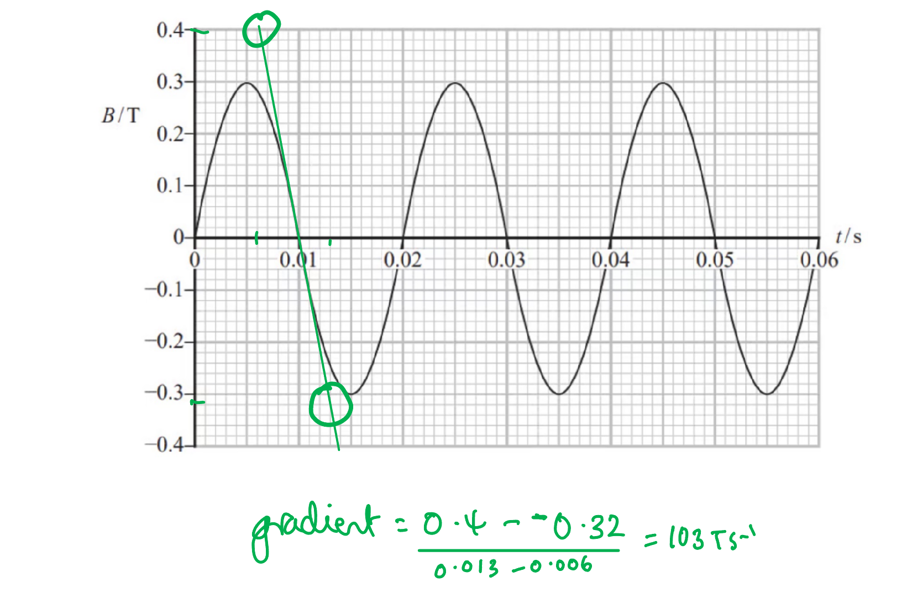
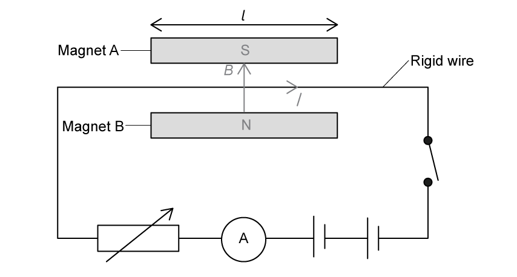
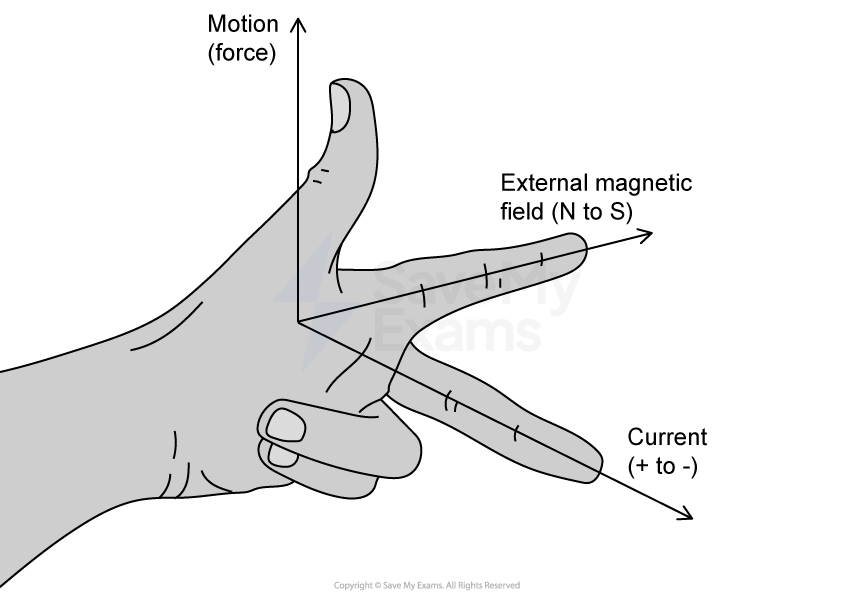

# Mark Schemes — Magnetic Fields
**4. Further Mechanics, Fields & Particles** · Edexcel International A Level (IAL) Physics (YPH11)

## Q1 — medium — 3 marks · structured-questions

### 17((a)) — 3 marks
Explain how an alternating current in the coil causes the cone to oscillate with the frequency of the alternating current:

**EITHER**

- The current carrying coil / conductor is in a magnetic field; **[1 mark]**
- The coil experiences a force; **[1 mark]**
- The force changes direction with the current, as the current is changing direction; **[1 mark]**

**   ****OR**

- The current in the coil causes a magnetic field; **[1 mark]**
- The field interacts with the magnetic field of the permanent magnet; **[1 mark]**
- The magnetic field changes direction with the current, so the force changes direction; **[1 mark]**

**[Total: 3 marks]**

## Q2 — medium — 10 marks · structured-questions

### 15((a)) — 5 marks
List the known quantities:

- Total mass, *m* = 7500 kg
- Force, *F* = 109 kN = 109 000 N
- Time force acts,* *Δ*t *= 2.9 s
- Initial velocity, *u* = 0
- Final velocity = $v$
- Height of tower, Δ*h* = 81 m

i) Show that the velocity of the carriage is about 40 m s–1 as it leaves the horizontal track:

Determine an equation for the velocity, *v*:

- Combining $F\Deltat=\Deltap$ and$p=mv$ **OR**  $F=ma$ and $a=\frac{\Deltav}{\Deltat}$
- $F\Deltat=m\Deltav\Rightarrowv=\frac{F\Deltat}{m}$

Substitute in the values into the equation:

- $v=\frac{109000\times2.9}{7500}$ **[1 mark]**
- $v$ = 42 m s−1 **[1 mark]**

ii) Deduce whether the carriage can reach the top of the tower:

Max **three** marks from **one** of the following methods:

**Method 1: Compare E****k**** and E****grav**

- KE at the bottom, `E subscript k space equals space 1 half m v squared space equals space 1 half space cross times space 7500 space cross times space open parentheses 42 close parentheses squared space equals space 6.6 cross times 10 to the power of 6 space straight J` **[1 mark]**
- KE required, $\DeltaE_{grav}=mg\Deltah=7500\times9.81\times81=6.0\times10^{6}J$ **[1 mark]**
- It reaches the top of the tower, as the initial Ek = 6.6 × 106 J is greater than energy required, ΔEgrav = 6.0 × 106 J; **[1 mark]**

**Method 2: Compare the height it can reach with the required height**

- `1 half m v squared space equals space m g increment h space space space space space rightwards double arrow space space space space space increment h space equals space fraction numerator v squared over denominator 2 g end fraction space equals space fraction numerator open parentheses 42 close parentheses squared over denominator 2 cross times 9.81 end fraction` **[1 mark]**
- Required height, $\Deltah=90m$ **[1 mark]**
- It reaches the top of the tower as it can reach a height of 90 m which is greater than the required 81 m; **[1 mark]**

**Method 3: Compare initial speed with the minimum initial speed**

- $\frac{1}{2}mv^{2}=mg\Deltah\Rightarrowv=\sqrt{2g\Deltah}=\sqrt{2\times9.81\times81}$ **[1 mark]**
- Minimum initial speed, $v=40ms^{-1}$ **[1 mark]**
- It reaches the top of the tower because 42 m s−1 is greater than the required speed of 40 m s−1; **[1 mark]**

If SUVAT equations used, maximum of **one **mark** **from:

- It reaches the top of the tower because the speed at the top is 13 m s−1 so it is still moving; **[1 mark]**

**[Total: 5 marks]**

- *Any questions asked about whether an object can reach the top of an object or hit the ground at a certain speed are likely to be energy conservation*

  - *You will not get full marks in this question if you use SUVAT*

### 15((b)) — 5 marks
The fin will leave the gap with a much slower speed than it entered the gap because:

- There is a change in flux linkage of the magnetic field and the metal fin **OR** the fin cuts magnetic field / flux (lines); **[1 mark]**
- This induces an emf (across the fin); **[1 mark]**
- (Which leads to) a current produced in the fin; **[1 mark]**
- A force acts on the fin, as there is a current in a magnetic field **OR** the field (due to the current) in the fin interacts with the field due to the magnets, which results in a force acting on the fin; **[1 mark]**
- The force opposes the motion due to Lenz’s law **OR** the energy dissipated by the current comes from (a reduction in) the kinetic energy of the vehicle; **[1 mark]**

**[Total: 5 marks]**

- *This is a **very** common electromagnetic induction question - you must be detailed in your answer and use physics terms such as '**induces**' an emf (avoid 'creates')*
- *Always refer back to the scenario in the question and don't just regurgitate a memorised answer*

  - *In this case, reference to the fin and the vehicle are essential for full marks*

## Q3 — medium — 14 marks · structured-questions

### 18((a)) — 2 marks
The correct name and unit are:

- Flux linkage; **[1 mark]**
- Weber / Wb; **[1 mark]**

**[Total: 2 marks]**

### 18((b)) — 6 marks
To calculate maximum emf:

Show evidence of using the graph to find gradient: **[1 mark]**

Determine the gradient at the steepest point:

- $\frac{ΔB}{Δt}=\frac{0.6T}{0.006s}=100\mathrm{Ts}^{-1}$ **[1 mark]**

Calculate area of the coil:

- `A space equals space pi cross times space open parentheses 0.003 close parentheses squared space equals space 2.83 cross times 10 to the power of negative 5 end exponent space straight m squared` **[1 mark]**

Use the equation for magnetic flux combined with Faraday's Law:

- $ϕ=BA$ and $ε=\frac{-d(Nϕ)}{dt}$ **[1 mark]**
- $ε=\frac{d(NBA)}{dt}=N\times\frac{dB}{dt}\timesA$
- `epsilon space equals space fraction numerator negative d left parenthesis N ϕ right parenthesis over denominator space d t end fraction equals 500 space turns cross times space 100 space Ts to the power of negative 1 end exponent cross times space open parentheses 2.83 cross times 10 to the power of negative 5 end exponent close parentheses` **[1 mark]**
- $ε=1.4V$ (answers in range 1.2-1.6 V)  **[1 mark]**

**[Total: 6 marks]**

- *The values in this calculation of gradient are just examples - yours will vary*

  - *Answers for maximum emf need to be in the range 1.2 - 1.6 V*
- *When combining the equations for flux and emf, the negative sign is dropped - this is just for convenience, maximum emf refers to the amplitude of the varying emf and direction is unimportant*

### 18((c)) — 6 marks
A discussion of the suggestion that the disc will start to rotate as the magnet is moved and that the disc will rotate in the same direction as the movement of the magnet would include the following points:

- There is a change in the magnetic flux (linkage with aluminium disc) **or **disc is cutting magnetic field / flux; **[1 mark]**
- So an e.m.f. is induced; **[1 mark]**
- Leads to a current / eddy current (in the disc); **[1 mark]**
- Force acts on the disc, as there is a current in a magnetic field / according to Fleming's Left Hand Rule / F = BIL **or **field due to current in disc interacting with field due to magnet to cause force on disc; **[1 mark]**
- Lenz’s law / the direction of e.m.f./current is such to oppose the change in flux; **[1 mark]**
- The disc moves to reduce this change (the same direction as the magnet) so correct suggestion; **[1 mark]**

**[Total: 6 marks]**

## Q4 — medium — 6 marks · structured-questions

### 11((a)) — 3 marks
Determine the period of revolution of the wire:

- Time to complete 10 revolutions = 8.3 s
- Therefore, period, *T* =  8.3 ÷ 10 = 0.83 s **[1 mark]**

Determine the angular velocity:

- Angular velocity, $ω=\frac{2π}{T}=\frac{2π}{0.83}$ **[1 mark]**
- Angular velocity = 7.6 rad s−1 **[1 mark]**

**[Total: 3 marks]**

### 11((b)) — 3 marks
Determine the force on the wire:

List the known quantities:

- Magnetic flux density, $B$ = 0.053 T
- Current in wire, $I$ = 1.1 A
- Length of wire, $l$ = 3.5 cm = 3.5 × 10−2 m
- Angle between the wire and field, $θ$ = 90° − 10° = 80°

Determine the magnitude of the force:

- Force on a current-carrying wire: $F=BIl\mathrm{sin}θ$
- *F* = 0.053 × 1.1 × (3.5 × 10−2) × sin 80° **[1 mark]**
- F = 2.0 × 10−3 N **[1 mark]**

Use Fleming's left hand rule to determine the direction of the force:

- Field (first finger) = to the right
- Current (second finger) = downwards
- Direction (of force) = out of the page; **[1 mark]**

**[Total: 3 marks]**

## Q5 — medium — 8 marks · structured-questions

### 1() — 2 marks
To deduce the direction of the magnetic field:

- Determine the direction of the force on the wire

  - When there is a current in the circuit, the wire experiences a force upwards (due to the magnetic field)
  - By Newton's third law, the wire exerts an equal and opposite force downwards on the magnet (so the reading on the balance increases)

The force on the wire is upwards **[1 mark]**

- Apply Fleming's left-hand rule to determine the direction of the field:

The current is from left to right

The field is from magnet B to magnet A **[1 mark]**

> **[mark-scheme]**
> 1 mark for stating the force on the wire is upwards (or out of the page on the plan view)
> 
> 1 mark for correctly applying the left-hand rule to identify the direction of the field
> 
> - Accept valid annotations on the diagram
> - This mark can be awarded for a direction consistent with the given force and current, e.g., force down, current left, magnetic field A to B would score 1 mark

> **[exam-tip]**
> The key to solving this question is to start from the force causing the increased balance reading and work backwards from there.
> 
> For the balance to register a positive reading, the wire must exert a downward force on the magnet. This is the reaction force on the magnet — equal and opposite to the force on the wire.
> 
> This is a result of Newton's third law. A force is exerted on the wire by the magnetic field when there is a current in the circuit (i.e., when the switch is closed), so there must be an equal but opposite force exerted on the magnet by the wire. Therefore, the direction of the force on the wire must be upward.
> 
> Once you have established the direction of the force on the wire, you can then apply Fleming's left-hand rule to determine the direction of the magnetic field.
> 
> 

### 2() — 3 marks
To calculate the magnetic flux density $B$:

- List the known quantities:

  - Current in the wire, $I=3.25\text{A}$
  - Increase in balance reading, $\Deltam=6.285\text{g}=6.285\times10^{-3}\text{kg}$
  - Length of wire in field, $l=4.5\text{cm}=0.045\text{m}$
  - $g=9.81\text{N kg}^{-1}$
- Determine the force on the wire:

  - The force on the wire equals the extra weight registered by the balance

$F=\Deltamg$

`F space equals space open parentheses 6.285 cross times 10 to the power of negative 3 end exponent close parentheses cross times 9.81` **[1 mark]**

- Calculate the flux density:

  - The wire is perpendicular to the field, so $θ=90^{\circ}$

$F=BIl=\Deltamg$

$B=\frac{\Deltamg}{Il}$

`B space equals space fraction numerator open parentheses 6.285 cross times 10 to the power of negative 3 end exponent close parentheses cross times 9.81 over denominator 3.25 cross times 0.045 end fraction` **[1 mark]**

$B=$ $0.42\text{T}$ **[1 mark]**

> **[mark-scheme]**
> 1 mark for use of $F=mg$
> 
> 1 mark for use of $F=BIl\mathrm{sin}θ$
> 
> 1 mark for a final answer of $B=0.42\text{T}$

### 3() — 3 marks
To assess which of these measurements was the most significant source of uncertainty:

- List the known quantities

  - Mass, $m=6.285\text{g}$
  - Uncertainty in mass, $\Deltam=0.001\text{g}$
  - Length, $l=4.5\text{cm}=45\text{mm}$
  - Uncertainty in length, $\Deltal=0.5\text{mm}$ (half resolution)
  - % uncertainty in `I space equals space 0.3 percent sign`
- Determine the percentage uncertainties (%U) in force and length:

%U in $F=$%U in $m$ (as %U in $g$ is negligible)

%U in `F space equals space fraction numerator 0.001 over denominator 6.285 end fraction cross times 100 space equals space 0.02 percent sign` **[1 mark]**

%U in `l space equals space fraction numerator 0.5 over denominator 45 end fraction cross times 100 space equals space 1.1 percent sign` **[1 mark]**

- Write a concluding statement:

**The % uncertainty in length is the largest (**`1.1 percent sign greater than 0.3 percent sign greater than 0.02 percent sign`**), so **$l$** is the most significant source of uncertainty** **[1 mark]**

> **[mark-scheme]**
> 1 mark for assessing the uncertainty in force
> 
> 1 mark for assessing the uncertainty in length
> 
> 1 mark for a valid conclusion with a numerical comparison of the uncertainty assessments

## Q6 — hard — 6 marks · structured-questions

### 14() — 6 marks
There was an increased reading on the force meter because:

The following list gives the 'indicative marking points'. Stating **all six** will score** four marks.** The remaining two marks are for linking and explanation. Check the table below for a full explanation of the marking sliding scale.

Indicative content:

- **(IC1)** Change of flux linked to surrounding metal **or** change of flux linked to copper tube
- **(IC2) **e.m.f induced
- **(IC3) **Full conducting path available, so current in metal
- **(IC4) **Current produces magnetic field
- **(IC5) **(By Lenz’s law the) magnetic field (due to the induced current) produces a force (on the magnet) that opposes the motion of magnet causing it
- **(IC6) **Upward force on magnet, so (increased) downward force on tube

**An example of an answer which would score 6 marks is:**

An increased reading on the force meter means an increased downwards force due to the magnet moving in the tube. **(linkage)**

Since the metal is copper it contains free electrons **(linkage)** which can create a current **(IC3)**. As the magnet falls through the tube its field lines cause a change of flux **(IC1)** in the metal which **(linkage)**** **induces an emf **(IC2)** and causes **(linkage)**** **eddy currents to move. **(IC4)**

The induced current produces a magnetic field which in turn produces a force which opposes the motion of the magnet (according to Lenz’s Law). **(IC5)** The tube is therefore putting an upwards force on the magnetic field, and therefore the magnetic field is putting a downwards force on the tube. **(IC6)** This is detected by the force meter. **(linkage)**

- Six indicative marking points; **[4 marks]**
- Linkage made between points; **[2 marks]**

**[Total: 6 marks]**

- *The starred written questions assess your ability to **link** **facts** in a logically **structured** answer.*
- *In the table below, **indicative content (IC) points** are from the list above. The second column shows the **maximum marks** you can earn from these **statements**.*

  - *As you see, **6** correct **statements** are worth a total of **4 marks*

- *The third column is for ‘**linkage marks**’. This means how well you linked the statements in your argument. The maximum linkage mark depends on the number of statements. *

  - *Even if you linked well, only **one** linkage mark is available if you only mentioned **4 out of 6** IC points*

- *To score 6/6 marks, you will need a **full** **paragraph**, using a "point, evidence, explain" structure, **as well as** using your Physics to link together at least six points from the content you have learned. *

| > *Number of IC points* | > *Total IC marks* | > *Max. linkage marks* | > *Max. final mark* |
|---|---|---|---|
| > *6* | > *4* | > *2* | > *6* |
| > *5* | > *3* | > *2* | > *5* |
| > *4* | > *3* | > *1* | > *4* |
| > *3* | > *2* | > *1* | > *3* |
| > *2* | > *2* | > *0* | > *2* |
| > *1* | > *1* | > *0* | > *1* |
| > *0* | > *0* | > *0* | > *0* |

## Q7 — hard — 4 marks · structured-questions

### 1() — 4 marks
> **[mark-scheme]**
> - (As the train moves) there is a (rate of) change of magnetic flux (linkage) through the coils in the track **[1 mark]**
> - By Faraday's law, this induces an e.m.f. (and therefore a current) in the coils **[1 mark]**
> - By Lenz's law, the direction of the induced current opposes the change that created it **[1 mark]**
> - This creates a magnetic field that repels the train's magnet, providing an upward force **[1 mark]**

## Q8 — easy — 1 marks · multiple-choice-questions

### 6() — 1 marks
**Correct answer: D** — increasing the time taken to reach the maximum flux density

**Final answer:** **The only correct answer is ****D**** because:**

- Increasing the time taken decreases rate of change
- Decreasing rate of change of flux linkage decreases the induced emf and therefore the current

- The other options would all lead to an increased rate of change of flux linkage so that both induced emf and current would also increase.

## Q9 — medium — 1 marks · multiple-choice-questions

### 5() — 1 marks
**Correct answer: D** — $2Nϕ$

**Final answer:** **The correct answer is ****D**** because:**

- Flux linkage is equal to $Nϕ=BAN\mathrm{cos}θ$

  - Initially, $\mathrm{cos}0=1$, so $Nϕ=BAN$
  - When the coil is rotated by $π$ radians, $\mathrm{cos}π=-1$ so $Nϕ=-BAN$

- Therefore, the change in flux linkage is equal to

  - `increment open parentheses N ϕ close parentheses space equals space B A N space cos space 0 space minus space B A N space cos space straight pi`
  - `increment open parentheses N ϕ close parentheses space equals space B A N space minus space open parentheses negative B A N close parentheses space equals space 2 B A N`
  - `increment open parentheses N ϕ close parentheses space equals space 2 N ϕ`

- This is option **D**

- You do not have to remember that cos π. = –1 as you can check this on your calculator - but you must make sure you're in **radians **mode!

## Q10 — medium — 1 marks · multiple-choice-questions

### 10() — 1 marks
**Correct answer: B** — 

**Final answer:** **The correct answer is ****B**** because:**

- The force on a current-carrying conductor is equal to $F=BIl\mathrm{sin}θ$

  - When θ = 0, $F=BIl\mathrm{sin}0=0$
  - When θ = 90°, $F=BIl\mathrm{sin}90=BIl$

- This means the graph will start at 0 and reach a maximum value at 90°

  - This eliminates graphs **C** and **D**

- The shape of the graph will be sinusoidal, which is shown by graph **B**

## Q11 — medium — 1 marks · multiple-choice-questions

### 7() — 1 marks
**Correct answer: A** — 

**Final answer:** **The correct answer is ****A ****because:**

- A magnetic force is induced when the current-carrying wire cuts through magnetic field lines and is given by

  - $F=BIlsinθ$

- This means that when the wire and field lines are :

  - Perpendicular `open parentheses sin space 90 degree space equals space 1 close parentheses`: a force will be induced `open parentheses F space equals space B I l close parentheses`
  - Parallel `open parentheses sin space 0 degree space equals space 0 close parentheses`: a force will **not** be induced `open parentheses F space equals space 0 close parentheses`

- Hence, the perpendicular sides **SP** and **QR** will experience a magnetic force of $BIl$
- And the parallel sides **PQ **and** RS **will experience a magnetic force of 0

  - Therefore, the only row that corresponds to this is row **A**

**B **is incorrect as **QR** crosses the field lines so there will be a **non-zero** force (the force will be out of the page)

**C **is incorrect as **RS** is parallel to the field lines so there will be **zero **force

**D **is incorrect as **SP** crosses the field lines inducing a force directed **into **the page

## Q12 — medium — 1 marks · multiple-choice-questions

### 9() — 1 marks
**Correct answer: B** — $\frac{1.20\times10^{-11}}{5.00\times1.60\times10^{-19}}$

**Final answer:** **The only correct answer is ****B**** because:**

- The equation which applies to a charged particle moving in a magnetic field is $F=Bqv$
- Therefore the velocity is found using $v=\frac{F}{Bq}$
- Substituting the values from the question gives the equation $v=\frac{1.20\times10^{-11}}{5.00\times1.60\times10^{-19}}$

## Q13 — medium — 1 marks · multiple-choice-questions

### 1() — 1 marks
**Correct answer: D** — 

**Final answer:** **The correct answer is D**

- The magnetic force on a current-carrying conductor is

$F = B I L \mathrm{sin} θ$

- where $θ$ is the angle between the current direction and the magnetic field; the direction of the force is given by Fleming's left-hand rule
- The field $B$ points horizontally from N to S, parallel to sides YX and ZW. So:
- Sides YX and ZW (length $w$): current is parallel or antiparallel to $B$, $\mathrm{sin} θ = 0$, so $F = 0$
- Sides YZ and XW (length $l$): current is perpendicular to $B$, so the magnitude of the force is $F = B I l$
- For side YZ, the current flows from Z to Y (upward), and $B$ points to the right
- Fleming's left-hand rule then gives a force directed downwards, which is row **D**

**A** & **C** are incorrect because side YX and side ZW are parallel to the field, so $\mathrm{sin} θ = 0$ and the force on it is zero — not $B I w$. The error is applying $F = B I L$ without checking the orientation of the wire relative to the field.

**B** is incorrect because the magnitude $B I l$ is right but the direction is wrong. The current in XW flows from X to W (downward), so Fleming's left-hand rule gives a force upwards, not downwards. The forces on YZ and XW are equal in magnitude but opposite in direction — together they form the couple that turns the motor coil.

> **[exam-tip]**
> For a coil in a magnetic field, work in two steps: (1) identify which sides are parallel to $B$ (force = 0) and which are perpendicular (force = $B I L$); (2) use Fleming's left-hand rule to fix the direction on each perpendicular side. Remember that the two perpendicular sides experience forces in *opposite* directions — this is what produces the turning effect of a motor.
