# Exam Questions — Magnetic Fields
**4. Further Mechanics, Fields & Particles** · Edexcel International A Level (IAL) Physics (YPH11)
> Source: [https://www.savemyexams.com/international-a-level/physics/edexcel/19/topic-questions/4-further-mechanics-fields-and-particles/magnetic-fields/structured-questions/](https://www.savemyexams.com/international-a-level/physics/edexcel/19/topic-questions/4-further-mechanics-fields-and-particles/magnetic-fields/structured-questions/) · 13 questions · total 57 marks

## Q1 — medium — 3 marks · structured-questions

### 17((a)) — 3 marks — command: explain — structured — from paper 2022 Jan · WPH15/01
A music system has a number of loudspeakers. One loudspeaker produces the low frequency sounds. This loudspeaker consists of a coil connected to a cone. The coil is in a region of magnetic field produced by a permanent magnet, as shown.

Explain how an alternating current in the coil causes the cone to oscillate with the frequency of the alternating current.

## Q2 — medium — 10 marks · structured-questions

### 15((a)) — 5 marks — command: multiple — structured — from paper Oct/Nov 2021 · WPH14/01
A carriage on a roller coaster ride travels along a horizontal track towards a vertical tower, as shown.

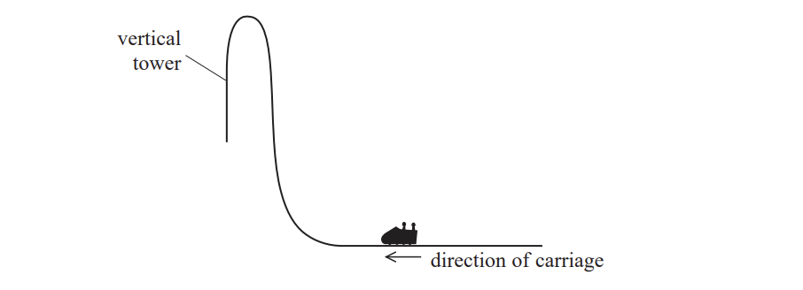

The carriage starts from rest. A force of 109 kN acts on the carriage for 2.9 s. The carriage then moves up a vertical tower of height 81 m.

i) Show that the velocity of the carriage is about 40 m s–1 as it leaves the horizontal track.

total mass of carriage and people = 7500 kg

**(2)**

ii) Deduce whether this velocity is enough for the carriage to reach the top of the tower.

Assume that resistive forces are negligible.

**(3)**

### 15((b)) — 5 marks — command: explain — structured — from paper Oct/Nov 2021 · WPH14/01
Just before the carriage reaches the end of the ride it is slowed by an electromagnetic brake. Powerful magnets are attached to the track. An aluminium fin is attached to the carriage. The fin moves through a narrow gap between the magnets.

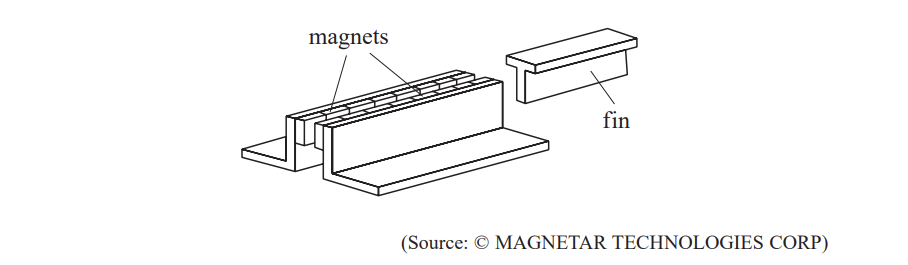

Explain why the fin will leave the gap with a much slower speed than it entered the gap.

## Q3 — medium — 14 marks · structured-questions

### 18((a)) — 2 marks — command: state — structured — from paper 2022 Jan · WPH14/01
Faraday’s law can be written as `xi space equals space fraction numerator negative d open parentheses N ϕ close parentheses over denominator d t end fraction`

State the name of the term $Nϕ$ and its unit.

### 18((b)) — 6 marks — command: determine — structured — from paper 2022 Jan · WPH14/01
A coil of 500 turns and radius 3.0 mm is placed between two poles of an electromagnet as shown. The terminals are connected to an a.c. power supply.

The magnetic flux density *B* perpendicular to the plane of the coil varies with time *t *as shown below.

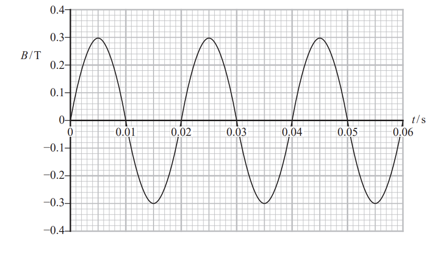

Determine the maximum e.m.f. across the coil.

Maximum e.m.f. = ..............................

### 18((c)) — 6 marks — command: discuss — structured — from paper 2022 Jan · WPH14/01
Some electric motor designs rely on electromagnetic induction.

A laboratory demonstration of the principle of an induction motor is shown.

An aluminium disc is free to rotate and is initially stationary. A powerful magnet is moved around the disc in the direction of the arrow, without touching the disc.

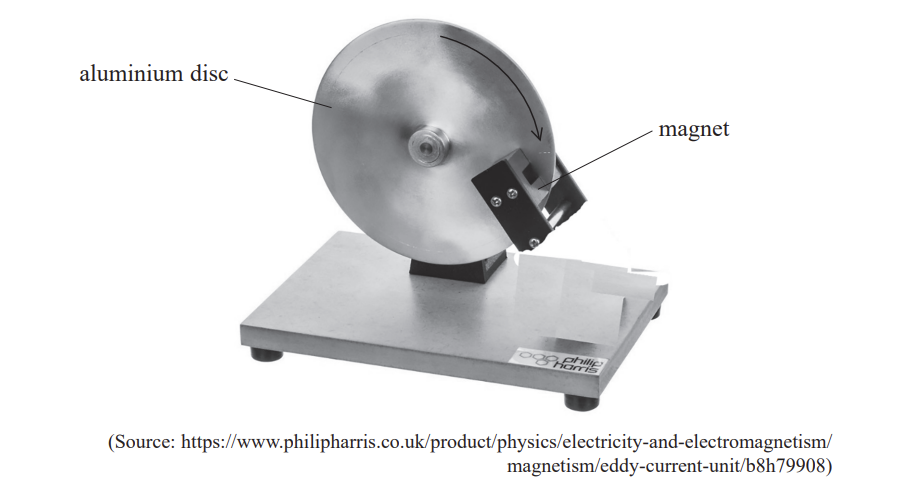

A student suggests that the disc will start to rotate as the magnet is moved and that the disc will rotate in the same direction as the movement of the magnet.

Discuss this suggestion.

## Q4 — medium — 6 marks · structured-questions

### 11((a)) — 3 marks — command: calculate — structured — from paper June 2021 · WPH14/01
In 1821, Michael Faraday made what is believed to be the first electric motor.

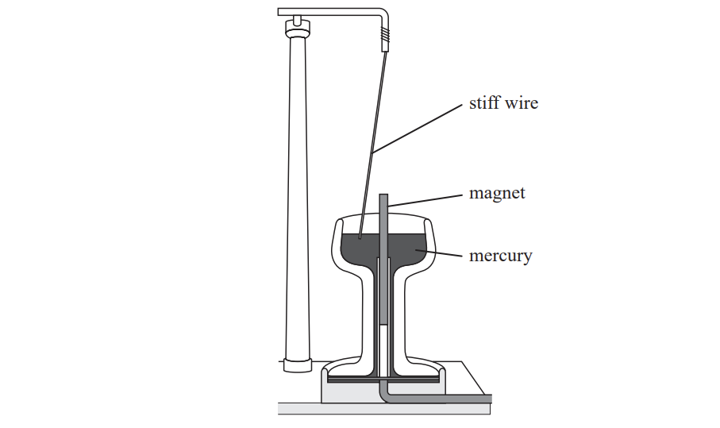

The stiff wire was suspended freely from a stand. The mercury completed an electrical circuit, which included the wire. When there was a current in the wire, the wire moved around the magnet.

The wire made 10 complete revolutions around the magnet in a time of 8.3 s.

Calculate the angular velocity of the wire.

Angular velocity = .....................................

### 11((b)) — 3 marks — command: determine — structured — from paper June 2021 · WPH14/01
When the current in the wire is 1.1 A, the wire is at an angle of 10° to the vertical.

The length of the wire in the horizontal magnetic field is 3.5 cm.

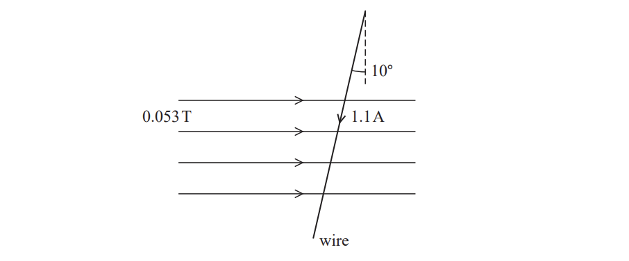

Determine the force on the wire.

magnetic flux density = 0.053 T

Magnitude of force on wire = .......................................

Direction of force on wire = ......................................

## Q5 — medium — 8 marks · structured-questions

### 1() — 2 marks — command: deduce — structured
A student sets up the apparatus shown to investigate the force on a rigid wire in a uniform magnetic field of flux density $B$.

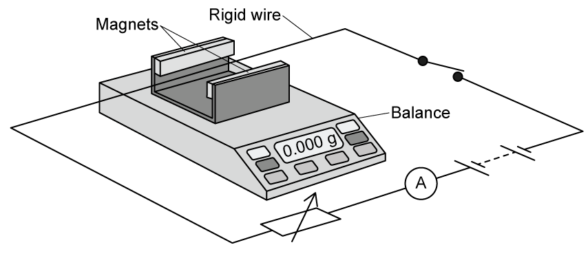

A plan view of the apparatus is also shown.

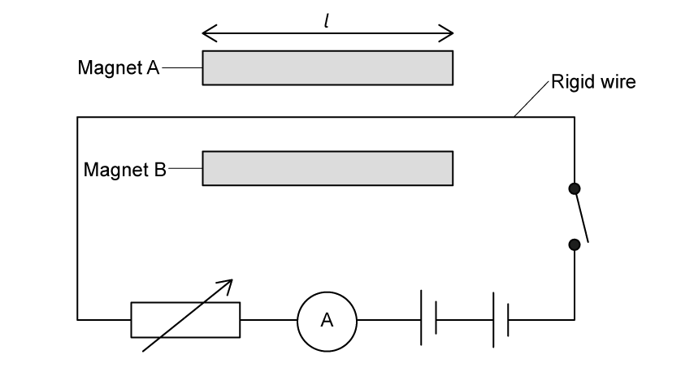

With the switch open, the balance is zeroed. When the switch is closed, the reading on the balance increases.

Deduce the direction of the magnetic field. You may add to the diagram.

### 2() — 3 marks — command: calculate — structured
When the reading on the ammeter was $3.25\text{A}$, the balance reading increased by $6.285\text{g}$. The length $l$ of wire in the magnetic field was $4.5\text{cm}$.

Calculate the magnetic flux density $B$ in the region between the magnets.

### 3() — 3 marks — command: assess — structured
The resolution of the balance was $0.001\text{g}$.

$l$ was measured with a metre rule of resolution $1\text{mm}$.

The percentage uncertainty in the ammeter reading was `0.3 percent sign`.

Assess which of these measurements was the most significant source of uncertainty in the measured value of $B$.

## Q6 — hard — 6 marks · structured-questions

### 14() — 6 marks — command: explain — structured — from paper June 2021 · WPH14/01
*A student carried out an investigation of Lenz’s law. A copper tube was suspended from a force meter, as shown.

A magnet was released at the top of the tube. When the magnet was falling through the tube, there was an increased reading on the force meter.

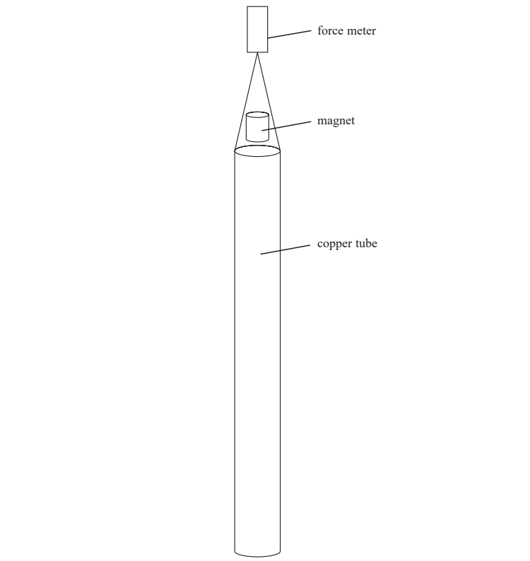

Explain why there was an increased reading on the force meter.

## Q7 — hard — 4 marks · structured-questions

### 1() — 4 marks — command: explain — structured
The Superconducting Maglev, or SCMaglev, is a Japanese high-speed magnetic levitation train system currently under construction between Tokyo and Nagoya.

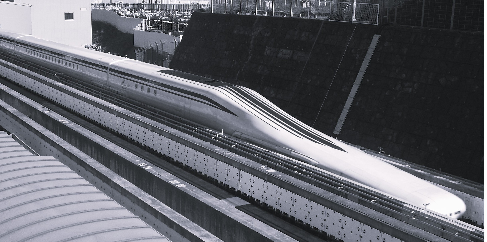

Photo: [Saruno Hirobano](https://commons.wikimedia.org/wiki/File:Series_L0.JPG)

Powerful superconducting electromagnets are built into the sides of the train. As the train moves forward, these magnets pass metallic coils mounted in the walls of the track.

Explain, using the laws of electromagnetic induction, how this produces an upward levitation force.

## Q8 — easy — 1 marks · multiple-choice-questions

### 6() — 1 mark — multiple_choice — from paper June 2021 · WPH14/01
A coil of wire is connected to a resistor as shown.

The magnetic flux density of the field through the coil is increased steadily from zero to a maximum value.

Which of the following single changes would result in a smaller current in the resistor?
- **A.** increasing the area of the coil in the magnetic field
- **B.** increasing the maximum flux density
- **C.** increasing the number of turns on the coil
- **D.** increasing the time taken to reach the maximum flux density

## Q9 — medium — 1 marks · multiple-choice-questions

### 5() — 1 mark — multiple_choice — from paper Oct/Nov 2021 · WPH14/01
The diagram shows a rectangular coil of *N* turns. The coil rotates around an axis as shown. A magnetic field acts perpendicular to the plane of the coil in the position shown.

The magnetic flux linkage with the coil is $Nϕ$. The coil is rotated through an angle of $π$ radians.

Which of the following is equal to the change in magnetic flux linkage with the coil?
- **A.** 0
- **B.** $\frac{Nϕ}{2}$
- **C.** $Nϕ$
- **D.** $2Nϕ$

## Q10 — medium — 1 marks · multiple-choice-questions

### 10() — 1 mark — multiple_choice — from paper Oct/Nov 2021 · WPH14/01
The diagram shows a current‐carrying wire at an angle *θ* to a uniform magnetic field.

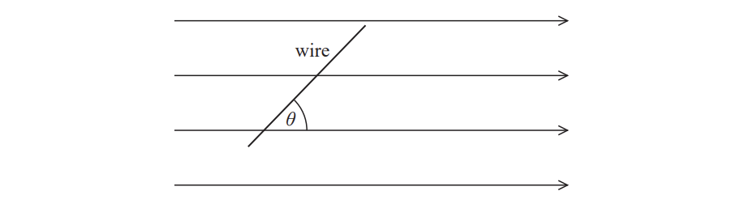

Which of the following graphs shows how the force *F* on the wire varies as *θ* is increased from 0 to 90°?

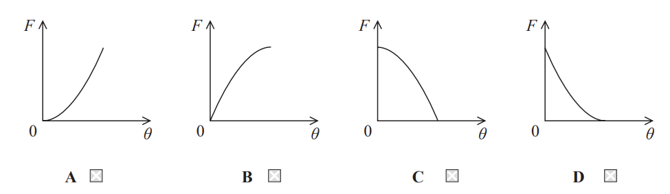
- **A.** 
- **B.** 
- **C.** 
- **D.** 

## Q11 — medium — 1 marks · multiple-choice-questions

### 7() — 1 mark — multiple_choice — from paper 2022 Jan · WPH14/01
A square coil PQRS has sides of length *l*. There is a clockwise current *I* in the coil as shown. The plane of the coil is parallel to a magnetic field of magnetic flux density *B*.

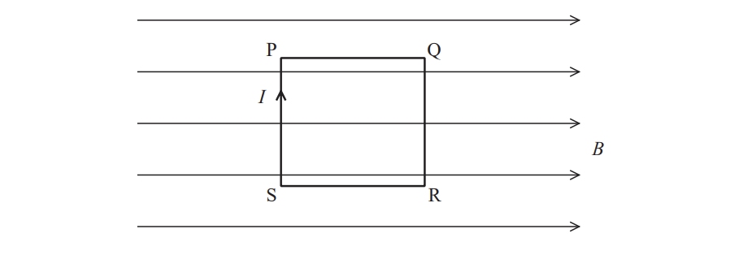

Which row of the table is correct?

|   | **Side of coil** | **Magnetic force** |
|---|---|---|
| **A** | PQ | 0 |
| **B** | QR | 0 |
| **C** | RS | $BIl$ into page |
| **D** | SP | $BIl$out of page |
- **A.** 
- **B.** 
- **C.** 
- **D.** 

## Q12 — medium — 1 marks · multiple-choice-questions

### 9() — 1 mark — multiple_choice — from paper June 2021 · WPH14/01
A proton travelling at speed *v* enters a magnetic field of magnetic flux density 5.00 T, as shown.

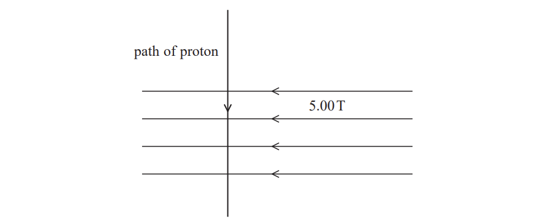

A force of 1.20 × 10–11 N is exerted on the proton.

Which of the following gives the speed of the proton in m s–1?
- **A.** $\frac{1.20\times10^{-11}}{5.00\times1.67\times10^{-27}}$
- **B.** $\frac{1.20\times10^{-11}}{5.00\times1.60\times10^{-19}}$
- **C.** $\frac{5.00\times1.67\times10^{-27}}{1.20\times10^{-11}}$
- **D.** $\frac{5.00\times1.60\times10^{-19}}{1.20\times10^{-11}}$

## Q13 — medium — 1 marks · multiple-choice-questions

### 1() — 1 mark — multiple_choice
A rectangular coil has sides of length $l$ and width $w$ and carries a current $I$. The plane of the coil is parallel to a magnetic field of flux density $B$, as shown.

Which row of the table gives the magnetic force on the named side of the coil?

|   | Side | Magnetic force |
|---|---|---|
| **A** | YX | $B I w$ to the right |
| **B** | XW | $B I l$ to the left |
| **C** | WZ | $B I w$ upwards |
| **D** | ZY | $B I l$ downwards |
- **A.** 
- **B.** 
- **C.** 
- **D.** 
