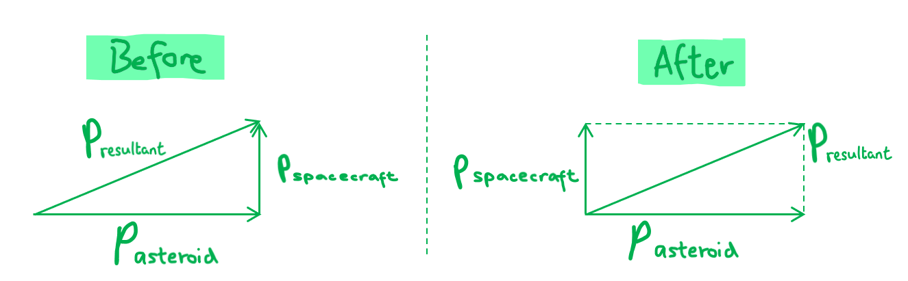

# Mark Schemes — Momentum & Impulse
**4. Further Mechanics, Fields & Particles** · Edexcel International A Level (IAL) Physics (YPH11)

## Q1 — medium — 10 marks · structured-questions

### 15((a)) — 2 marks
The vector triangle for the momenta of the bodies is as follows:

- Resultant drawn including arrows with a clear right angle between initial asteroid momentum and initial spacecraft momentum; **[1 mark]**
- All labels correct; **[1 mark]**

**[Total: 2 marks]**

### 15((b)) — 2 marks
Show that the momentum of the spacecraft is about 107 N s:

- Momentum:  $p=mv$
- *p* = 920 × 12 000 **[1 mark]**
- *p* = 1.1 × 107 N s (2 s.f.) **[1 mark]**

**[Total: 2 marks]**

### 15((c)) — 2 marks
Show that this collision method causes the asteroid to change its direction by 10–7 rad:

List the known quantities:

- Momentum of spacecraft, pspacecraft = 1.1 × 107 N s
- Momentum of asteroid, pasteroid = 7.6 × 1013 N s

Use trigonometry to determine the resultant:

- $\mathrm{tan}θ=\frac{p_{spacecraft}}{p_{asteroid}}=\frac{1.1\times10^{7}}{7.6\times10^{13}}$
- `theta space equals space tan to the power of negative 1 end exponent space open parentheses fraction numerator 1.1 cross times 10 to the power of 7 over denominator 7.6 cross times 10 to the power of 13 end fraction close parentheses` = 1.447 × 10−7 **[1 mark]**
- Angle, *θ* = 1.45 × 10−7 rad (minimum 2 s.f.) **[1 mark]**

**[Total: 2 marks]**

### 15((d)) — 2 marks
Calculate the velocity component in the original direction of the spacecraft after the collision:

- Conservation of momentum:  momentum before collision = momentum after collision
- Momentum before (↑) =$p_{spacecraft}$
- Momentum after (↑) = `open parentheses m subscript s p a c e c r a f t end subscript space plus space m subscript a s t e r o i d end subscript close parentheses space cross times space v subscript upwards arrow`

Determine the velocity component:

- Component of velocity (↑), `v subscript upwards arrow space equals space fraction numerator M o m e n t u m space a f t e r over denominator open parentheses m subscript s p a c e c r a f t end subscript space plus space m subscript a s t e r o i d end subscript close parentheses end fraction space equals space fraction numerator p subscript s p a c e c r a f t end subscript over denominator open parentheses m subscript s p a c e c r a f t end subscript space plus space m subscript a s t e r o i d end subscript close parentheses end fraction`
- Component of velocity (↑), `v subscript upwards arrow space equals space fraction numerator 1.1 cross times 10 to the power of 7 over denominator 920 space plus space open parentheses 2.8 cross times 10 to the power of 9 close parentheses end fraction` **[1 mark]**
- Component of velocity = 3.9 × 10−3 m s–1 **[1 mark]**

**[Total: 2 marks]**

### 15((e)) — 2 marks
The change in momentum produced by the rocket engine method is:

- Impulse:  $F\Deltat=\Deltap$
- Impulse = (5.1 × 106) × (6 × 60) = 1.8 × 109 N s **[1 mark]**

Write a conclusion comparing the two methods:

- The rocket engines method produces a change in momentum of 1.8 × 109 N s which is greater than 1.1 × 107 N s, the change in momentum from the impact method; **[1 mark]**

**[Total: 2 marks]**

## Q2 — easy — 1 marks · multiple-choice-questions

### 2() — 1 marks
**Correct answer: A** — 

**Final answer:** **The correct answer is ****A ****because:**

- An elastic collision is defined as a collision in which kinetic energy is **conserved**

  - This eliminates options **B** and **D**
- Momentum is **always** conserved in all collisions

  - Hence, only option **A** is correct

**B **is incorrect as kinetic energy is conserved in **elastic** collisions

**C **&** D **are incorrect as momentum is conserved in **all** collisions

## Q3 — medium — 1 marks · multiple-choice-questions

### 3() — 1 marks
**Correct answer: C** — $2p$

**Final answer:** **The correct answer is ****C ****because:**

- The energy-momentum relation is given by $E_{k}=\frac{p^{2}}{2m}$
- Particle 1 has momentum $p=\sqrt{2mE_{k}}$
- Particle 2 has momentum `space p subscript 2 space equals space square root of 2 open parentheses 2 m close parentheses open parentheses 2 E subscript k close parentheses end root`
- Therefore,$p_{2}$ in terms of$p$:

  - $p_{2}=\sqrt{4\times2mE_{k}}=\sqrt{4}\sqrt{2mE_{k}}=2\sqrt{2mE_{k}}=2p$

- Hence, **C** is correct

- You must know how surds work (revise this from GCSE maths if not)
- If a value is inside a square root, it can be taken out as a factor but you must keep the square root!

  - $\sqrt{xy}=\sqrt{x}\sqrt{y}$

## Q4 — medium — 1 marks · multiple-choice-questions

### 4() — 1 marks
**Correct answer: B** — 

**Final answer:** **The correct answer is ****B**** because:**

- Momentum is **always **conserved in a closed system

  - This eliminates options **C** and **D**
- Kinetic energy before the collision is found using

  - $KE_{initial}=\frac{1}{2}mv^{2}=\frac{1}{2}\times0.25\times2^{2}=0.5J$
- The kinetic energy after the collision is found by adding up the masses then using

  - $KE_{final}=\frac{1}{2}mv^{2}=\frac{1}{2}\times0.5\times1^{2}=0.25J$
- Since kinetic energy has **not been conserved**, the collision is inelastic

## Q5 — medium — 1 marks · multiple-choice-questions

### 7() — 1 marks
**Correct answer: B** — $\frac{v}{\sqrt{2}}$

**Final answer:** **The only correct answer is ****B**** because:**

- After the collision, each sphere will have half of the original kinetic energy
- Since $KE_{i}=\frac{1}{2}mv_{i}^{2}$ then $KE_{f}=\frac{1}{2}KE_{i}$
- `1 half m v subscript f squared space equals space 1 half cross times space open parentheses 1 half m v subscript i squared close parentheses`
- $\frac{v_{i}^{2}}{2}=v_{f}^{2}$ therefore $v_{f}=\frac{v}{\sqrt{2}}$

## Q6 — medium — 1 marks · multiple-choice-questions

### 1() — 1 marks
**Correct answer: C** — $6 . 0 \text{J}$

**Final answer:** **The correct answer is C**

- Apply conservation of linear momentum to find the speed of the combined trolleys after the collision:

$m_{X} v_{X} = ( m_{X} + m_{Y} ) v$

$1 . 0 \times 4 . 0 = 4 . 0 \times v \Rightarrow v = 1 . 0 \text{m s}^{-1}$

- Calculate the kinetic energies before and after:

$E_{k,\text{before}} = \frac{1}{2} m_{X} v_{X}^{2} = \frac{1}{2} \times 1 . 0 \times 4 . 0^{2} = 8 . 0 \text{J}$

$E_{k,\text{after}} = \frac{1}{2} ( m_{X} + m_{Y} ) v^{2} = \frac{1}{2} \times 4 . 0 \times 1 . 0^{2} = 2 . 0 \text{J}$

- The kinetic energy transferred to the surroundings is the difference:

$Δ E_{k} = E_{k,\text{before}} - E_{k,\text{after}} = 8 . 0 - 2 . 0 = 6 . 0 \text{J}$

**A** is incorrect because it assumes kinetic energy is conserved in the collision. Kinetic energy is conserved only in *elastic* collisions; a stick-together collision is inelastic, so $Δ E_{k}$ is non-zero.

**B** is incorrect because it gives the kinetic energy of the trolleys *after* the collision, not the kinetic energy lost. The question asks for the energy transferred away from the kinetic store, not the remaining kinetic energy.

**D** is incorrect because it gives the *initial* kinetic energy of trolley X. The energy transferred to the surroundings is the difference between initial and final kinetic energies, not the initial value alone.

> **[exam-tip]**
> For inelastic collisions, work in two stages: (1) use conservation of momentum to find the final speed of the combined mass; (2) calculate KE before and after, then subtract. The KE *after* must use the combined mass and the new speed — a common slip is to reuse the initial trolley's mass or speed in the final-KE expression.
