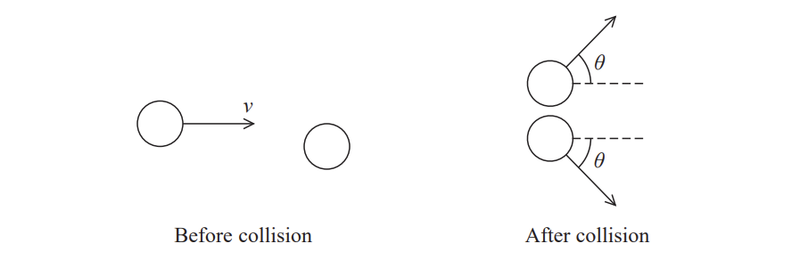

# Exam Questions — Momentum & Impulse
**4. Further Mechanics, Fields & Particles** · Edexcel International A Level (IAL) Physics (YPH11)
> Source: [https://www.savemyexams.com/international-a-level/physics/edexcel/19/topic-questions/4-further-mechanics-fields-and-particles/momentum-and-impulse/structured-questions/](https://www.savemyexams.com/international-a-level/physics/edexcel/19/topic-questions/4-further-mechanics-fields-and-particles/momentum-and-impulse/structured-questions/) · 6 questions · total 15 marks

## Q1 — medium — 10 marks · structured-questions

### 15((a)) — 2 marks — command: sketch — structured — from paper June 2021 · WPH14/01
Some asteroids pass very close to the Earth. Scientists are planning methods to deflect asteroids, to prevent them from hitting the Earth.

One method would involve colliding a spacecraft into the surface of the asteroid, to change the path and speed of the asteroid. The spacecraft would remain joined to the asteroid after the collision.

This collision method is modelled for a spacecraft travelling in a direction at 90° to the path of the asteroid.

Sketch a labelled vector diagram to show the momenta of the bodies before and after the collision.

### 15((b)) — 2 marks — command: show — structured — from paper June 2021 · WPH14/01
Show that the momentum of the spacecraft is about 107 N s.

mass of spacecraft = 920 kg

speed of spacecraft = 12 000 m s−1

### 15((c)) — 2 marks — command: show — structured — from paper June 2021 · WPH14/01
Show that this collision method causes the asteroid to change its direction through an angle of about 10–7 radian.

momentum of spacecraft=1.1 × 107 N s

momentum of asteroid = 7.6 × 1013 N s

### 15((d)) — 2 marks — command: calculate — structured — from paper June 2021 · WPH14/01
After the collision, the asteroid and spacecraft remain joined and move together.

Calculate the component of their velocity at 90° to the original path of the asteroid after the collision.

mass of asteroid = 2.8 × 109 kg

Component of velocity = .......................................

### 15((e)) — 2 marks — command: deduce — structured — from paper June 2021 · WPH14/01
Another method would involve attaching a rocket motor to the asteroid and using the motor to apply a force to the asteroid.

In this method the force is applied at 90° to the path of the asteroid.

Deduce whether this would produce a change in momentum as great as the change produced by the collision method.

force exerted by rocket motor = 5.1 × 106 N

time for which rocket motor applies force = 6 minutes

## Q2 — easy — 1 marks · multiple-choice-questions

### 2() — 1 mark — multiple_choice — from paper Oct/Nov 2021 · WPH14/01
Which row of the table identifies what happens to momentum and kinetic energy in an elastic collision?

|   | **Momentum** | **Kinetic energy** |
|---|---|---|
| **A** | conserved | conserved |
| **B** | conserved | not conserved |
| **C** | not conserved | conserved |
| **D** | not conserved | not conserved |
- **A.** 
- **B.** 
- **C.** 
- **D.** 

## Q3 — medium — 1 marks · multiple-choice-questions

### 3() — 1 mark — multiple_choice — from paper Oct/Nov 2021 · WPH14/01
A particle of mass *m* has kinetic energy *E*k and momentum *p*. A second particle of mass 2*m* has kinetic energy 2*E*k. Both particles are non‐relativistic.

Which of the following is equal to the momentum of the second particle?
- **A.** $\sqrt{2}p$
- **B.** $p$
- **C.** $2p$
- **D.** $4p$

## Q4 — medium — 1 marks · multiple-choice-questions

### 4() — 1 mark — multiple_choice — from paper 2022 Jan · WPH14/01
The diagram shows the momentum of two trolleys, X and Y, before a collision. The mass of each trolley is 0.25 kg.

The two trolleys join together after the collision and move on with a velocity of 1 m s−1 .

Which row of the table is correct for this collision?

|   | **Momentum** | **Elastic or inelastic collision** |
|---|---|---|
| **A** | conserved | elastic |
| **B** | conserved | inelastic |
| **C** | not conserved | elastic |
| **D** | not conserved | inelastic |
- **A.** 
- **B.** 
- **C.** 
- **D.** 

## Q5 — medium — 1 marks · multiple-choice-questions

### 7() — 1 mark — multiple_choice — from paper June 2021 · WPH14/01
A sphere travelling at speed *v* collides elastically with an identical sphere which is at rest.

After the collision, both spheres move off at an angle *θ* to the direction of travel of the first sphere, as shown. The spheres have the same speed as each other.

What is the speed of the spheres after the collision?
- **A.** $v$
- **B.** $\frac{v}{\sqrt{2}}$
- **C.** $\frac{v}{2}$
- **D.** $\frac{v}{4}$

## Q6 — medium — 1 marks · multiple-choice-questions

### 1() — 1 mark — multiple_choice
Two trolleys are on a straight, frictionless track. Trolley X has mass $1 . 0 \text{kg}$ and is moving at $4 . 0 \text{m s}^{-1}$. It collides with a stationary trolley Y of mass $3 . 0 \text{kg}$. After the collision the two trolleys stick together.

What is the total kinetic energy transferred to the surroundings during the collision?
- **A.** $0 \text{J}$
- **B.** $2 . 0 \text{J}$
- **C.** $6 . 0 \text{J}$
- **D.** $8 . 0 \text{J}$
