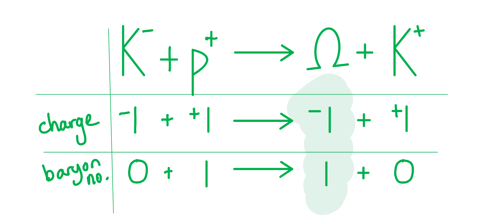
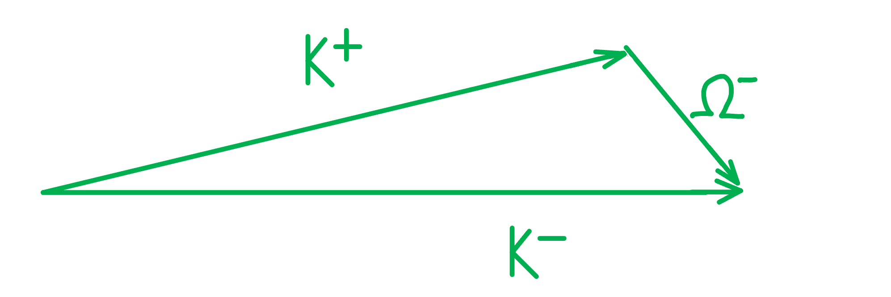
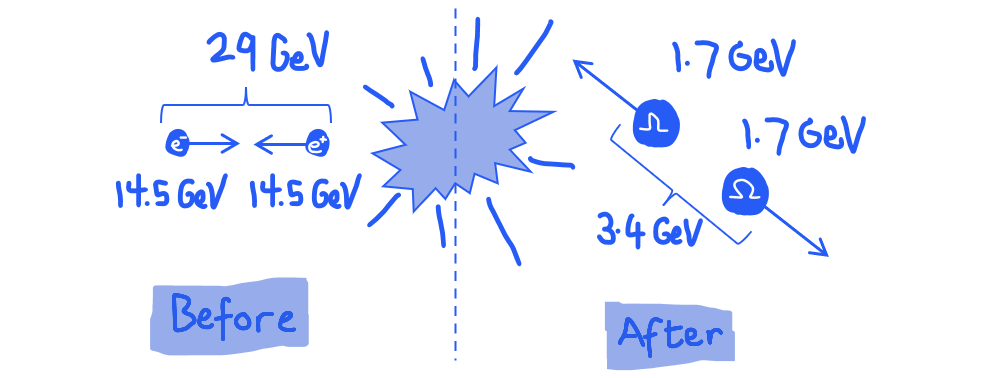
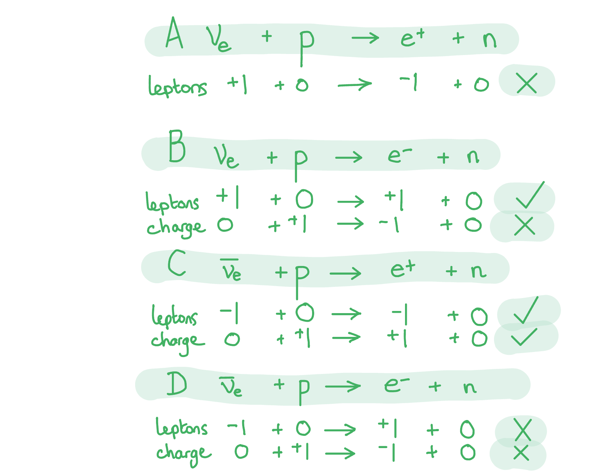

# Mark Schemes — Particle Interactions & Conservation
**4. Further Mechanics, Fields & Particles** · Edexcel International A Level (IAL) Physics (YPH11)

## Q1 — medium — 14 marks · structured-questions

### 16((a)) — 2 marks
A particle detector can detect charged particles because:

- The (charged) particles are ionising / they knock electrons out of atoms in their path; **[1 mark]**
- A track is formed by the ionised particles produced; **[1 mark]**

**[Total: 2 marks]**

- *The diagram shows a curved track which may have led you to think the question was about the curvature of the tracks caused by the magnetic field.*
- *However good your answer may be, you only get marks for answering the question as it is written!*

### 16((b)) — 6 marks
i) The structure of a baryon and a meson:

- A baryon is three quarks (or three antiquarks); **[1 mark]**
- A meson is an anti-quark and a quark; **[1 mark]**

ii) The direction of the magnetic field:

- Into the page/paper; **[1 mark]**

iii) To deduce the charge and baryon number for the omega particle:

- Use of charge and baryon number conservation; **[1 mark]**
- Charge = −1; **[1 mark]**
- Baryon number = 1;** [1 mark]**

**[Total: 3 marks]**

- *Although the calculation table shown above does not get any marks directly, it does provide a structure to solve, and give evidence of solving, the problem which has been set.*
- *The examiner noted after this exam that many students could not gain these marks, but of those that did, **'The best answers included an equation for the interaction, with a corresponding line below for the charges and another line for the baryon number.'*

### 16((c)) — 6 marks
The following list gives the 'indicative marking points'. Stating **all six** will score** four marks.** The remaining two marks are for linking and explanation. Check the table below for a full explanation of the marking sliding scale.

*Energy:*

- IC1. As (Rest) mass-energy of proton and kaon + Initial Ek = (rest) mass-energy of omega and kaon + kinetic energies of both particles **or **(Total) mass-energy conserved
- IC2. Incoming K− had high kinetic energy
- IC3. Some of this initial kinetic energy converted to mass of the omega particle (– mass of proton)
- IC4. $ΔE=Δmc^{2}$

*Momentum:*

- IC5. Momentum of K− = sum of *x*-components of K+ + Ω− **or **vector sum of momentum of K+ + Ω− = momentum of K− **or **an attempt to sketch a triangle of vectors as below.

- IC6.* y*-component of K+ equals *y*-component Ω− **or **all vectors correctly labelled in diagram as shown.

**An example answer which scores six marks is:**

Charge, energy and momentum are always conserved in interactions between particles.

Therefore **(linkage)** the total rest mass-energy of the initial kaon- and proton must equal the final rest mass-energy of the omega particle and kaon+, and also the total kinetic energies must be equal before and after. **(IC1) (linkage)**

For mass to have increased, then initial energy must be converted to final mass. **(linkage)**** **The incoming K− had high kinetic energy **(linkage)**** **which could then be converted to mass of the omega particle **(IC3) **since we know that the masses of the two K particles is identical (they are antiparticles of each other). **(linkage)**

To calculate this change we use Einstein’s mass-energy equation, E = mc2 **(IC4)**

Momentum is conserved in all collisions. **(linkage)**** **Considering the components of velocity, the x-component of the K- momentum is equal to the x-component of the omega and K+. **(IC5) **The initial y-component appears to be zero, which explains the two final particles moving in opposite directions since their momentums must also sum to zero. **(IC6)****                          **

- There are 4 references to energy and 2 to momentum; **[4 marks]**
- Linkage is demonstrated by linking energy and momentum to theory; **[2 marks]**

**[Total: 6 marks]**

- *In the exam this was a very difficult question with about half of candidates getting no marks at all.*
- *Linking together the conservation of energy and momentum is essential physics, which you must be able to do. To help get it right in the exam, practice writing paragraphs for your revision notes which explain and link together these two aspects of collisions into logical statements.*
- *The best answers connected conservation of kinetic energy to mass-energy conservation, and were specific about which energy and which mass, naming, for example, the K meson as having high kinetic energy.*
- *The diagram in part (a) shows directions and should remind you of the vector nature of momentum.*

> *Total marks for indicative content and linkage are shown in the table below.*

| > *Number of IC points* | > *Total IC marks* | > *Max. linkage marks* | > *Max. final mark* |
|---|---|---|---|
| > *6* | > *4* | > *2* | > *6* |
| > *5* | > *3* | > *2* | > *5* |
| > *4* | > *3* | > *1* | > *4* |
| > *3* | > *2* | > *1* | > *3* |
| > *2* | > *2* | > *0* | > *2* |
| > *1* | > *1* | > *0* | > *1* |
| > *0* | > *0* | > *0* | > *0* |

## Q2 — medium — 14 marks · structured-questions

### 17((a)) — 4 marks
A LINAC works with a constant frequency a.c. supply because:

- The beam / particle / electron / positron gains speed; **[1 mark]**
- The length of tubes increases / the length of gaps between tubes increases; **[1 mark]**
- So the time between beam exiting (successive) tubes **OR** time spent in each tube **OR** time spent between (each successive pair of) tubes is <u>constant</u>; **[1 mark]**
- The p.d. has to reverse in this time period and hence frequency is constant; **[1 mark]**

**[Total: 4 marks]**

### 17((b)) — 7 marks
List the known quantities:

- Energy of electron / positron = 14.5 GeV
- Electronvolt, eV = 1.6 × 10−19 J
- Mass of electron/positron, *m**e* = 9.11 × 10−31 kg
- Mass of omega, *m*Ω = 3272 × *m*e

i) Show that the mass of an omega baryon is about 1700 MeV/c2:

- Mass-energy equivalence:$\DeltaE=c^{2}\Deltam$
- $\DeltaE_{Ω}=c^{2}\times3272\timesm_{e}$ **[1 mark]**
- `increment E subscript capital omega space equals space open parentheses 3 cross times 10 to the power of 8 close parentheses squared space cross times space 3272 space cross times space open parentheses 9.11 cross times 10 to the power of negative 31 end exponent close parentheses space equals space 2.68 space cross times space 10 to the power of negative 10 end exponent space straight J` **[1 mark]**

Calculate the mass in MeV/c2:

- $\DeltaE_{Ω}=\frac{2.68\times10^{-10}}{1.6\times10^{-19}}=1.677\times10^{9}eV$ **[1 mark]**
- $m_{Ω}=1.677\times10^{9}\frac{eV}{c^{2}}\Rightarrow1677\frac{MeV}{c^{2}}$ **[1 mark]**
- Hence, mass of omega baryon = 1677 MeV/c2

ii) Calculate the kinetic energy of one of the omega baryons:

List the known quantities:

- Mass of omega baryon, *m*Ω = 1677 MeV/c2

Calculate the energy of a positron / electron:

- Rest mass energy of one omega = 1.677 GeV
- Energy available to one omega = Energy of a positron or electron = 14.5 GeV **[1 mark]**

Calculate the energy of each omega baryon:

- Kinetic energy of each omega = (Energy of a positron or electron) – (Rest mass energy of one omega)
- Kinetic energy of each omega = 14.5 – 1.677 = 12.823 GeV **[1 mark]**
- Kinetic energy of each omega = 12.8 GeV **[1 mark]** *Acceptable value for KE in J = 2.05 × 10**−9** J*

**[Total: 7 marks]**

- *In part (ii), you could also gain all the marks for calculating the total KE:*

  - *Total KE = (total energy of the positron and electron) − (total rest energy of both omega particles)*
  - *Which gives total KE = (14.5 × 2) − (1.677 × 2) = 25.6 GeV*
  - *Then half of this gives KE of each omega = 12.8 GeV*

- *You could also convert from GeV to J and carry out the same calculations as above to get 2.05 × 10**−9** J*

  - *However, doing this in an exam situation could eat into precious time - so make sure you practice working with energies and masses in eV and eV/c**2** as these units are much easier to work with when you are comfortable with them!*

- *Whichever method you use, it is useful to sketch the situation to make sure you set up your calculation correctly:*

### 17((c)) — 3 marks
For the suggestion:

*This collision cannot lead to both particles being omega baryons, as this breaks a conservation law.*

Some valid comments would be:

- If both particles are omega baryons, it would break the law of conservation of baryon number; **[1 mark]**
- The two particles must be an omega and an anti-omega baryon; **[1 mark]**

Show that baryon number is conserved or not conserved in one of these scenarios:

**EITHER**

- Both omega: $e^{-}+e^{+}\rightarrowΩ+Ω$
- Baryon number: $0+0\rightarrow1+1$

- **Before**: baryon number = 0 and **after**: baryon number = 2, this does not obey the conservation of baryon number; **[1 mark]**

**OR**

- Omega and anti-omega: $e^{-}+e^{+}\rightarrowΩ+\overline{Ω}$
- Baryon number: `0 space plus space 0 space space rightwards arrow space space 1 space plus space open parentheses negative 1 close parentheses`

- **Before**: baryon number = 0 and **after**: baryon number = 0, this obeys the conservation of baryon number; **[1 mark]**

**[Total: 3 marks]**

- *You must know how to determine the baryon number of any particle*

  - *If the particle is a **baryon** (made up of 3 quarks), it has a baryon number of 1*
  - *If the particle is an **anti-baryon** (made up of 3 anti-quarks), it has a baryon number of –1*

## Q3 — easy — 1 marks · multiple-choice-questions

### 1() — 1 marks
**Correct answer: C** — neutrino

**Final answer:** **The correct answer is ****C ****because:**

- All leptons are fundamental because they are not made up of any smaller particle
- A neutrino is a type of **lepton**

**A **is incorrect as an atom is not a fundamental particle because it is made up of neutrons, protons and electrons

**B **is incorrect as a baryon is not a fundamental particle because it is made up of 3 quarks

**D **is incorrect as a pion is not a fundamental particle because it is made up of a quark and an antiquark

## Q4 — easy — 1 marks · multiple-choice-questions

### 1() — 1 marks
**Correct answer: B** — muon

**Final answer:** **The correct answer is ****B**** because:**

- Fundamental particles are subatomic particles which are not made up from any other particles.

  - A muon is a fundamental particle.

Antiprotons are made up from antiquarks.

Neutrons are made of quarks.

Pions are made up of quark-antiquark.

## Q5 — easy — 1 marks · multiple-choice-questions

### 4() — 1 marks
**Correct answer: A** — 

**Final answer:** **The only correct answer is ****A**** because:**

- Baryons always contain three quarks

  - Only **A** or **B** could be correct
- Mesons always contain one quark and one anti-quark

  - This eliminates option **B**

**B** mixes quarks and anti-quarks in the baryon and contains only quarks in the meson

**C** and **D** both have the wrong number of quarks for the baryon and the meson

## Q6 — easy — 1 marks · multiple-choice-questions

### 1() — 1 marks
**Correct answer: B** — 

**Final answer:** **The correct answer is B**

- Sum the charges of the three quarks to find the total charge

`Q = \left(+\tfrac{2}{3}\right) + \left(-\tfrac{1}{3}\right) + \left(-\tfrac{1}{3}\right) = 0`

- Each quark has a baryon number of $+ \frac{1}{3}$, so

$B = 3 \times \frac{1}{3} = + 1$

- By convention, each strange quark carries a strangeness of $- 1$; $Λ^{0}$ contains one strange quark, so

$S = - 1$

**A** is incorrect because the strangeness has been given the wrong sign — a strange quark has $S = - 1$, not $+ 1$

**C** is incorrect because the quark charges have been summed incorrectly; $\frac{2}{3} - \frac{1}{3} - \frac{1}{3}$ equals zero, not $+ 1$

**D** is incorrect because the baryon number has been given as $- 1$; this is the value for an antibaryon (three antiquarks), not for a baryon made of three quarks

> **[exam-tip]**
> For any three-quark baryon, always compute the three properties separately: sum the charges in units of $e$, sum the baryon numbers (each quark contributes $+ \frac{1}{3}$), and sum the strangeness (each strange quark contributes $- 1$, all other quarks contribute $0$). Antibaryons, made from three antiquarks, have $B = - 1$ and opposite-sign charges and strangeness.

## Q7 — medium — 1 marks · multiple-choice-questions

### 9() — 1 marks
**Correct answer: C** — $\overline{u}d$

**Final answer:** **The correct answer is ****C**** because:**

- A pion is a type of **meson**

  - A meson is made up of a quark and an antiquark

- The only meson is $\overline{u}d$, so **C** is correct

**A & B **are incorrect as particles made up of 3 quarks are baryons and pions are mesons

**D **is incorrect as pions contain a quark and an antiquark

- We can confirm it is a $π^{-}$ by looking at the charges

  - $\overline{u}=-\frac{2}{3}e$
  - $d=-\frac{1}{3}e$
  - $\overline{u}d=-\frac{2}{3}e-\frac{1}{3}e=-1e$

- The charge is equal to −1 as expected,

## Q8 — medium — 1 marks · multiple-choice-questions

### 2() — 1 marks
**Correct answer: D** — 

**Final answer:** **The correct answer is ****D**** because:**

- The charge of an anti-particle is identical in magnitude but opposite in sign to the corresponding particle
- The mass of an anti-particle is identical in magnitude to the corresponding particle

  - The charge of a proton is +1.6 × 10−19 C (the magnitude of electron charge) and the mass is 1.67 × 10−27 kg (from the data at the back of the exam paper)
  - Therefore the charge of an antiproton is -1.6 × 10−19 C and the mass is 1.67 × 10−27 kg

**A** and **B** give the mass of an electron

**A **and **C** give the charge on a proton

## Q9 — medium — 1 marks · multiple-choice-questions

### 3() — 1 marks
**Correct answer: C** — $\overline{ν}_{e}+p\rightarrowe^{+}+n$

**Final answer:** **The correct answer is ****C**** because:**

- To test whether a reaction is possible each side must be checked for conservation of lepton number and charge
- In possible reactions both are always conserved

**A** is incorrect because lepton number is not conserved

**B** is incorrect because charge is not conserved

**D**  is incorrect because lepton number is not conserved and charge is not conserved
