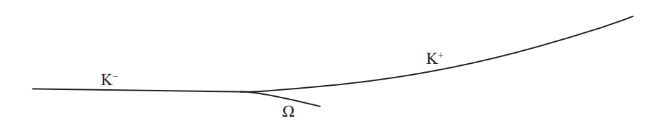
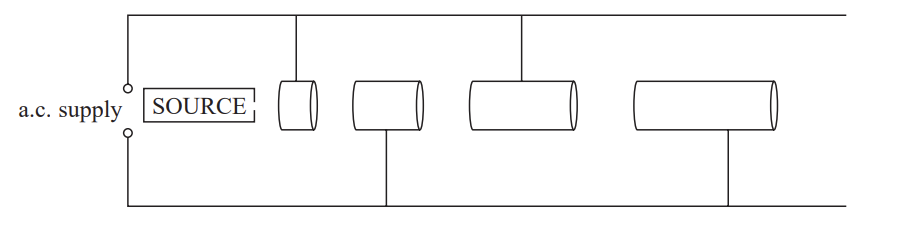

# Exam Questions — Particle Interactions & Conservation
**4. Further Mechanics, Fields & Particles** · Edexcel International A Level (IAL) Physics (YPH11)
> Source: [https://www.savemyexams.com/international-a-level/physics/edexcel/19/topic-questions/4-further-mechanics-fields-and-particles/particle-interactions-and-conservation/structured-questions/](https://www.savemyexams.com/international-a-level/physics/edexcel/19/topic-questions/4-further-mechanics-fields-and-particles/particle-interactions-and-conservation/structured-questions/) · 9 questions · total 35 marks

## Q1 — medium — 14 marks · structured-questions

### 16((a)) — 2 marks — command: explain — structured — from paper 2022 Jan · WPH14/01
The diagram shows particle tracks in a detector. A negative K meson collided with a stationary proton. An omega baryon and a positive K meson were produced after the impact.

Explain the process that enables a particle detector to detect charged particles.

### 16((b)) — 6 marks — command: multiple — structured — from paper 2022 Jan · WPH14/01
i) Describe the structure of a baryon and a meson.

**(2)**

ii) A magnetic field acts in the detector.

State the direction of the magnetic field.

**(1)**

iii) Deduce the charge and baryon number for the omega particle.

**(3)**

### 16((c)) — 6 marks — command: discuss — structured — from paper 2022 Jan · WPH14/01
* The rest mass of the omega baryon is significantly larger than the rest mass of the proton.

Discuss how energy and momentum are conserved during this collision.

## Q2 — medium — 14 marks · structured-questions

### 17((a)) — 4 marks — command: explain — structured — from paper Oct/Nov 2021 · WPH14/01
A particle collider can include a LINAC.

The diagram represents a LINAC.

Explain why this arrangement works with a constant frequency a.c. supply.

### 17((b)) — 7 marks — command: multiple — structured — from paper Oct/Nov 2021 · WPH14/01
In a particle collider, a positron and an electron collided. Each particle had an energy of 14.5 GeV. The collision produced two particles of a type called omega baryons.

i) An omega baryon has a mass equivalent to 3272 times the mass of an electron.

Show that the mass of an omega baryon is about 1700 MeV/c2.

**(4)**

ii) Calculate the kinetic energy of one of the omega baryons.

Kinetic energy = ...........................................**(3)**

### 17((c)) — 3 marks — command: discuss — structured — from paper Oct/Nov 2021 · WPH14/01
A student correctly suggests that this collision cannot lead to both particles being omega baryons, as this breaks a conservation law.

Discuss the student’s suggestion.

## Q3 — easy — 1 marks · multiple-choice-questions

### 1() — 1 mark — multiple_choice — from paper Oct/Nov 2021 · WPH14/01
Which of the following is a fundamental particle?
- **A.** atom
- **B.** baryon
- **C.** neutrino
- **D.** pion

## Q4 — easy — 1 marks · multiple-choice-questions

### 1() — 1 mark — multiple_choice — from paper June 2021 · WPH14/01
Which of the following is a fundamental particle?
- **A.** antiproton
- **B.** muon
- **C.** neutron
- **D.** pion

## Q5 — easy — 1 marks · multiple-choice-questions

### 4() — 1 mark — multiple_choice — from paper June 2021 · WPH14/01
In 2015, a pentaquark was discovered.

The pentaquark was made of 5 quarks, $c,\overline{c},d,u,u.$

The pentaquark can form a baryon-meson combination.

Which row of the table shows a possible arrangement of the quarks?

|   | **Quarks in baryon** | **Quarks in meson** |
|---|---|---|
| **A** | $duu$ | $c\overline{c}$ |
| **B** | $u\overline{c}u$ | $dc$ |
| **C** | $\overline{c}u$ | $duc$ |
| **D** | $ud$ | $c\overline{c}u$ |
- **A.** 
- **B.** 
- **C.** 
- **D.** 

## Q6 — easy — 1 marks · multiple-choice-questions

### 1() — 1 mark — multiple_choice
The $Λ^{0}$ baryon has the quark content $\text{uds}$ (one up, one down, one strange).

The table shows four possible sets of values for the charge, baryon number and strangeness of the $Λ^{0}$.

Which row shows the correct values?

| Row | Charge / $e$ | Baryon number | Strangeness |
|---|---|---|---|
| **A** | $0$ | $+ 1$ | $+ 1$ |
| **B** | $0$ | $+ 1$ | $- 1$ |
| **C** | $+ 1$ | $+ 1$ | $- 1$ |
| **D** | $0$ | $- 1$ | $- 1$ |
- **A.** 
- **B.** 
- **C.** 
- **D.** 

## Q7 — medium — 1 marks · multiple-choice-questions

### 9() — 1 mark — multiple_choice — from paper Oct/Nov 2021 · WPH14/01
Which of the following is the quark structure for a $π^{-}$ particle?
- **A.** $ddd$
- **B.** $\overline{uud}$
- **C.** $\overline{u}d$
- **D.** $ud$

## Q8 — medium — 1 marks · multiple-choice-questions

### 2() — 1 mark — multiple_choice — from paper 2022 Jan · WPH14/01
Which row in the table gives the charge and mass of an antiproton?

|   | **Charge / C** | **Mass / kg** |
|---|---|---|
| **A** | 1.6 × 10−19 | −9.11 × 10−31 |
| **B** | –1.6 × 10−19 | 9.11 × 10−31 |
| **C** | 1.6 × 10−19 | −1.67 × 10−27 |
| **D** | –1.6 × 10−19 | 1.67 × 10−27 |
- **A.** 
- **B.** 
- **C.** 
- **D.** 

## Q9 — medium — 1 marks · multiple-choice-questions

### 3() — 1 mark — multiple_choice — from paper June 2021 · WPH14/01
Neutrinos can interact with protons to create neutrons.

Which of the following equations shows this process?
- **A.** $ν_{e}+p\rightarrowe^{+}+n$
- **B.** $ν_{e}+p\rightarrowe^{--}+n$
- **C.** $\overline{ν}_{e}+p\rightarrowe^{+}+n$
- **D.** $\overline{ν}_{e}+p\rightarrowe^{--}+n$
