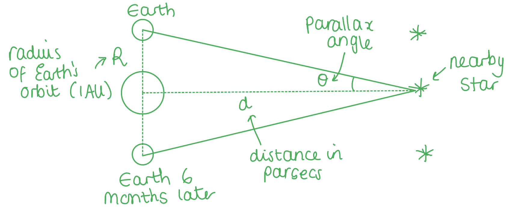
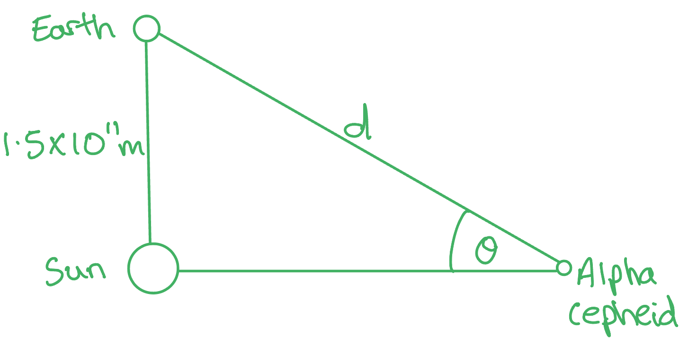
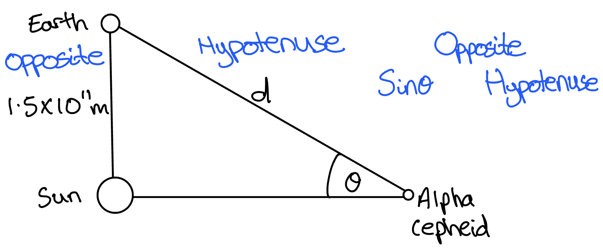
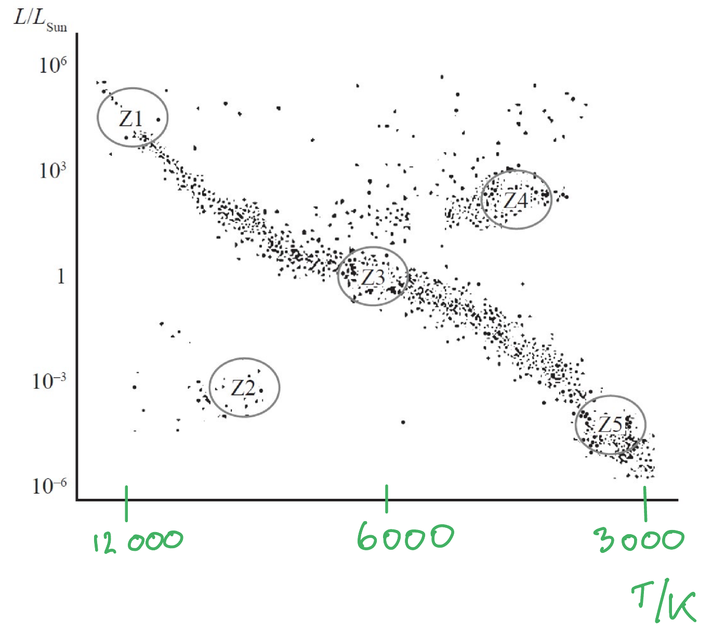
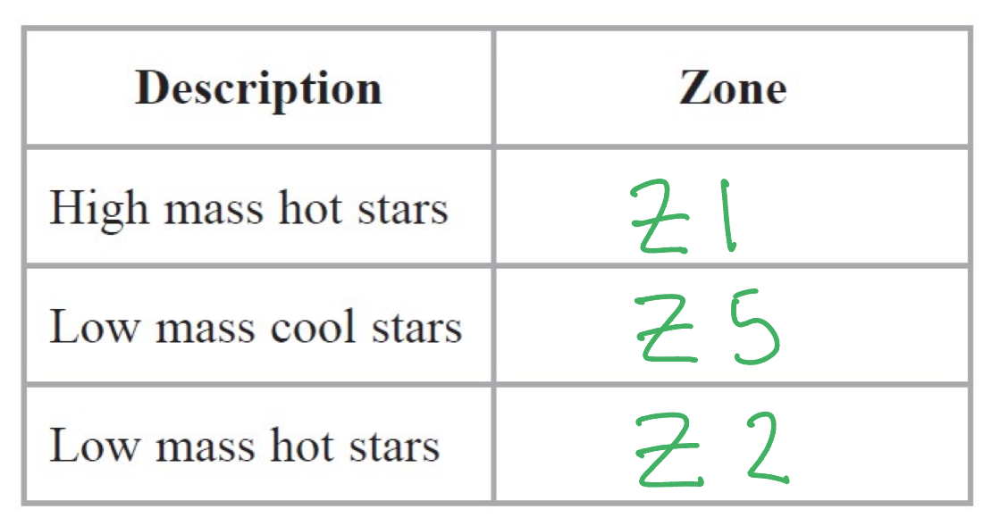

# Mark Schemes — Astronomy
**5. Thermodynamics, Radiation, Oscillations & Cosmology** · Edexcel International A Level (IAL) Physics (YPH11)

## Q1 — easy — 7 marks · structured-questions

### 17((a)) — 3 marks
Τrigonometric parallax can be used to determine the distance to a nearby star by:

- Find (angular) displacement of the star (as Earth moves around the Sun) over a 6 month period **OR** find (angular) displacement of the star (as Earth moves around the Sun) over a diameter of the Earth’s orbit; **[1 mark]**
- Measurements are made against the background of (more) distant stars; **[1 mark]**
- Radius / diameter of the Earth’s orbit about the Sun must be known/measured (to calculate the distance to the star); **[1 mark]**

**[Total: 3 marks]**

- *In your description, it must be clear that **angles** are being measured*
- *You do need the annotated diagram, but you can obtain marks from it*

  - *Make sure your diagram is appropriately labelled to obtain the marks*

### 17((b)) — 4 marks
A knowledge of the distances to distant galaxies has enabled astronomers to determine a value for the age of the universe from:

**EITHER**

- Distant galaxies are receding; **[1 mark]**
- The velocity of recession can be calculated from the redshift; **[1 mark]**
- A graph of recessional velocity against distance has a gradient equal to the Hubble constant, $H_{0}$  **[1 mark]**
- The age of the universe is $\frac{1}{H_{0}}$ **[1 mark]**

**OR**

- Distant galaxies are receding; **[1 mark]**
- The redshift can be calculated; **[1 mark]**
- A graph of redshift against distance has a gradient equal to $\frac{H_{0}}{c}$ **[1 mark]**
- The age of the universe is $\frac{1}{H_{0}}$ **[1 mark]**

**[Total: 4 marks]**

- *The age of the universe of *$\frac{1}{H_{0}}$* is sometimes referred to as the 'Hubble time'*

## Q2 — medium — 18 marks · structured-questions

### 19((a)) — 3 marks
Deduce whether the distance to Alpha Cephei could be determined from parallax measurements:

List the known quantities:

- Distance from Earth to Sun = 1.5 × 1011 m
- Distance from Earth to Alpha Cephei, $d$ = 4.6 × 1017 m
- Distances can be determined with a parallax angle > 2.4 × 10–7 rad

Use trigonometry to calculate the angle of Alpha Cepheid from the Earth, *θ:*

- $\mathrm{sin}θ=\frac{opposite}{hypotenuse}=\frac{1.5\times10^{11}}{4.6\times10^{17}}$
- `theta space equals space sin to the power of negative 1 end exponent space open parentheses fraction numerator 1.5 space cross times space 10 to the power of 11 over denominator 4.6 space cross times space 10 to the power of 17 end fraction close parentheses space`**[1 mark]**
- $θ=3.26\times10^{-7}\mathrm{rad}$** [1 mark]**

Deduce whether the distance could be calculated using parallax measurements:

Parallax angle, *θ* = 3.3 × 10–7 rad

Minimum angle required = 2.4 × 10–7 rad

- The distance <u>could be calculated</u> using parallax measurements because 3.3 × 10−7 > 2.4 × 10–7 **[1 mark]**

**[Total: 3 marks]**

- *It can be tricky to set up a diagram with the **correct triangle**:*

### 19((b)) — 3 marks
Standard candles can be used to determine distances to stars by:

- Measuring the intensity of the radiation from the candle; **[1 mark]**
- Knowing the luminosity of the standard candle; **[1 mark]**
- Using the inverse square law (of flux) to determine the distance to the star; **[1 mark]**

**[Total: 3 marks]**

- *If you quoted the equation for the Stefan-Boltzmann law to get **full marks** you must **define all the variables*

### 19((c)) — 12 marks
i) A graph with a correctly labelled *x*-axis should look like this:

- *x*-axis labelled with T / K; **[1 mark]**
- The scale on the graph is reverse logarithmic; **[1 mark]**
- The Sun is classified as a Z3 star, with a temperature of 6000 K; **[1 mark]**

ii) A completed table that would score 3 marks should look like this:

- One mark for each correct zone; **[3 marks]**

iii) A star like the Sun evolves as it progresses from zone Z3 to its final position on the HR diagram as follows:

The following list is the 'indicative marking points'. Stating all six will score **four marks**, less than six is marked according to the scale given below (in blue). The remaining **two marks** are given for the linking and explanation:

Indicative content (IC)

1. On the main sequence (in Z3), the star fuses hydrogen in its core
2. When fusion ceases (the core of the star cools and) the core collapses / contracts (under gravitational forces)
3. The star (moves to Z4 as it expands and) becomes a red giant star
4. Temperature (in the core) is high enough for helium fusion to begin
5. Helium begins to run out and then fusion ceases
6. The star becomes a white dwarf (in Z2)

**An example of an answer which would score 6 marks is:**

While the star is on the main sequence, in zone 3, the star fuses hydrogen in its core **[1]**. When fusion ceases, the core of the star no longer generates energy or radiation pressure **[linkage]**, and the core begins to collapse under strong gravitational forces **[2]**. At this point, the star moves to zone 4 as the outer layers expand **[linkage]** and the star becomes a red giant star **[3]**. Now, the temperature in the core is high enough for helium fusion to begin **[4]**. Eventually, when the helium in the core runs out, fusion ceases **[5]** for good and the star becomes a white dwarf, shown by zone 2 **[6]**.

- Six indicative marking points; **[4 marks]**
- Linkage made between evolutionary stages and physical processes; **[2 marks]**

**[Total: 6 marks]**

- *The starred written questions assess your ability to **link** **facts** in a logically **structured** answer.*
- *In the table below, **indicative content (IC) points** are from the list above. The second column shows the **maximum marks** you can earn from these **statements**.*

  - *As you see, **6** correct **statements** are worth a total of **4 marks*

- *The third column is for ‘**linkage marks**’. This means how well you linked the statements in your argument. The maximum linkage mark depends on the number of statements. *

  - *Even if you linked well, only **one** linkage mark is available if you only mentioned **4 out of 6** IC points*

- *To score 6/6 marks, you will need a **full** **paragraph**, using a "point, evidence, explain" structure, **as well as** using your Physics to link together at least six points from the content you have learned. *

| > *IC points* | > *IC mark* | > *Maximum linkage marks available* | > *Maximum final mark* |
|---|---|---|---|
| > *6* | > *4* | > *2* | > *6* |
| > *5* | > *3* | > *2* | > *5* |
| > *4* | > *3* | > *1* | > *4* |
| > *3* | > *2* | > *1* | > *3* |
| > *2* | > *2* | > *0* | > *2* |
| > *1* | > *1* | > *0* | > *1* |
| > *0* | > *0* | > *0* | > *0* |

## Q3 — medium — 2 marks · structured-questions

### 11() — 2 marks
Calculate the distance of Sirius from the Earth

List the known quantities:

- Intensity of Sirius, *I* = 1.09 × 10–7 W m–2
- Luminsoity of Sirius, *L* = 8.94 × 1027 W

Rearrange the intensity equation for the distance, *d*:

- $I=\frac{L}{4πd^{2}}$
- $d=\sqrt{\frac{L}{4πI}}$

Substitute in the values to calculate* d*:

- `d space equals space square root of fraction numerator 8.94 space cross times space 10 to the power of 27 over denominator 4 pi space cross times space open parentheses 1.09 space cross times space 10 to the power of negative 7 end exponent close parentheses end fraction end root` **[1 mark]**
- $d=8.0789\times10^{16}=8.08\times10^{16}m$ **[1 mark]**

**[Total: 2 marks]**

- *The first mark is just the 'use of' the intensity equation*

  - *This means you can either substitute in the values first and then rearrange for **d** or rearrange and substitute like it is done in this mark scheme*
- *You must know exactly what each variable in all the equations mean to pick out the correct equation from your data sheet*

## Q4 — medium — 7 marks · structured-questions

### 12((a)) — 1 marks
State what is meant by a standard candle:

- A standard candle is an (astronomical) object of <u>known luminosity</u>; **[1 mark]**

**[Total: 1 mark]**

- *Only "luminosity" is accepted, not "brightness"*

### 12((b)) — 6 marks
i) Show that the luminosity of the source is about 2 × 1035 W:

List the known quantities:

- Distance from Earth, $d$ = 4.60 × 1024 m
- Area of detector, $A$ = 1.00 × 10−4 m2
- Energy of burst, $E$ = 9.40 × 10−23 J
- Time of burst, $t$ = 1.15 ms = 1.15 × 10-3 s

Determine the power of the burst of radio waves:

- $P=\frac{E}{t}=\frac{9.40\times10^{-23}}{1.15\times10^{-3}}=8.17\times10^{-20}W$ **[1 mark]**

Determine the intensity of the burst:

- $I=\frac{P}{A}=\frac{8.17\times10^{-20}}{1.00\times10^{-4}}=8.17\times10^{-16}Wm^{-2}$ **[1 mark]**

Rearrange the equation for intensity of radiation:

- $I=\frac{L}{4πd^{2}}$
- `L space equals space 4 straight pi d squared I space equals space 4 straight pi space cross times space open parentheses 4.60 space cross times space 10 to the power of 24 close parentheses squared space cross times space open parentheses 8.17 space cross times space 10 to the power of negative 16 end exponent close parentheses` **[1 mark]**
- `L space equals space 2.17 space cross times space 10 to the power of 35 space straight W space open parentheses equals space 2.2 space cross times space 10 to the power of 35 space straight W close parentheses` **[1 mark]**

ii) Suggest why it is unlikely that FRB sources are alien communications:

- The luminosity of the FRB source is much larger than the luminosity of the Sun; **[1 mark]**
- So a power output this large is unlikely to be artificially produced **or** the temperature is higher than the Sun's so it is unlikely to be artificial; **[1 mark]**

**[Total: 6 marks]**

- *The marks for part (ii) can only be gained if the answer for part (i) is significantly larger than the value given for the Sun's luminosity*

## Q5 — easy — 1 marks · multiple-choice-questions

### 1() — 1 marks
**Correct answer: C** — a star of known luminosity

**Final answer:** **The correct answer is ****C**** because:**

- A standard candle is a type of measurement used by astronomers when the distances are too large to use parallax

  - The distance is calculated by knowing the source's **luminosity**

- Therefore, a standard candle is a star of known **luminosity**

## Q6 — medium — 1 marks · multiple-choice-questions

### 8() — 1 marks
**Correct answer: B** — 4

**Final answer:** **The correct answer is ****B ****because:**

- Consider the inverse square law of flux for *I**s* and*I**α*
- Use the equation:

  - $I=\frac{L}{4πd^{2}}$
- `I subscript s space equals space fraction numerator 16 L over denominator 4 pi open parentheses 2 d close parentheses squared end fraction`
- $I_{α}=\frac{L}{4πd^{2}}$
- Consider the ratio: $\frac{I_{s}}{I_{α}}$:

  - `I subscript s over I subscript alpha space equals space fraction numerator open parentheses fraction numerator 16 L over denominator 4 pi space cross times space 4 d squared end fraction close parentheses over denominator open parentheses fraction numerator L over denominator 4 pi d squared end fraction close parentheses end fraction space equals space fraction numerator open parentheses fraction numerator L over denominator pi d squared end fraction close parentheses over denominator open parentheses fraction numerator L over denominator 4 pi d squared end fraction close parentheses end fraction`
  - $\frac{I_{s}}{I_{α}}=\frac{L}{πd^{2}}\times\frac{4πd^{2}}{L}$
  - $\frac{I_{s}}{I_{α}}=4$

## Q7 — medium — 1 marks · multiple-choice-questions

### 8() — 1 marks
**Correct answer: D** — Y → Z

**Final answer:** **The correct answer is ****D****:**

- This is the Hertzsprung-Russel diagram
- The points are:

  - W = main sequence (very hot) stars
  - X = white dwarfs
  - Y = main sequence (cooler) stars
  - Z = red giants
- An ordinary star will either be at W or Y and then move to X (at the very end of its life) or Z (just after its run out of fuel)
- Therefore, the only path in the options that works is Y → Z

**A** & **C** are incorrect as stars do not move **along** the sections where all the main sequence stars are plotted in the middle of the diagram

**B** is incorrect as   X is where the white dwarfs are, which a star turns into at the end of its lifecycle (long after being a main sequence star)

## Q8 — medium — 1 marks · multiple-choice-questions

### 9() — 1 marks
**Correct answer: D** — Y has a lower surface temperature than X.

**Final answer:** **The correct answer is ****D**** because:**

- This is the Hertzsprung-Russel diagram
- The points are:

  - W = main sequence (very hot) stars
  - X = white dwarfs
  - Y = main sequence (cooler) stars
  - Z = red giants
- The temperature axis from **right** to **left** is **increasing** temperature (or decreasing temperature from left to right)
- Therefore, Y has a lower surface temperature than X

**A** is incorrect as  the mass of stars increases along the main sequences

**B** is incorrect as  on an HR-diagram the temperature scale is a reverse scale (increasing from right to left instead of from left to right)

**C** is incorrect as  white dwarfs have smaller masses than the main sequence stars

## Q9 — medium — 1 marks · multiple-choice-questions

### 6() — 1 marks
**Correct answer: A** — main sequence star

**Final answer:** **The correct answer is ****A**** because:**

- Consider **A**:

  - A main sequence star has a similar luminosity and temperature to the Sun (which has a surface temperature of 5800 K)
  - This is in line with the information given about the star
- Consider **B**:

  - A red dwarf would have a much lower temperature and luminosity than the Sun (e.g. $\frac{L_{sun}}{1000}$)
  - This doesn't match the information given
- Consider **C**:

  - Red giants have a similar surface temperature to the Sun
  - The luminosity would be much higher - this does not match the information given
- Consider **D**:

  - A white dwarf may have a higher temperature than the Sun
  - The luminosity would be much lower - this does not match the information given

- Having an idea of where the different types of stars lie on the **Hertzsprung-Russell** diagram **relative** to one another is **quicker** than **memorising** facts about every star type

## Q10 — medium — 1 marks · multiple-choice-questions

### 8() — 1 marks
**Correct answer: D** — 16

**Final answer:** **The correct answer is ****D**** because:**

- The Stefan-Boltzmann law states $L=σAT^{4}$

  - Area is the same for both stars, so only temperature will affect luminosity
  - The question states that $T_{P}=2T_{Q}$
  - `L subscript P over L subscript Q space equals fraction numerator space sigma A open parentheses T subscript P close parentheses to the power of 4 over denominator sigma A open parentheses T subscript Q close parentheses to the power of 4 end fraction space equals space open parentheses 2 T subscript Q close parentheses to the power of 4 over T subscript Q to the power of 4 space equals space 2 to the power of 4 space equals space 16`

- One big mistake a lot of students make is to confuse $2T_{Q}^{4}$ with `open parentheses 2 T subscript Q close parentheses to the power of 4`

  - Including **brackets** around terms is very helpful for **proportionality** questions like this - the incorrect options rely on you incorrectly applying the power of four to the factor of 2

## Q11 — medium — 1 marks · multiple-choice-questions

### 1() — 1 marks
**Correct answer: B** — 

**Final answer:** **The correct answer is B**

- On a Hertzsprung–Russell (HR) diagram, with luminosity on the y-axis and temperature on the x-axis:

  - the Sun sits on the main sequence
  - a red giant occupies the upper-right region
- Therefore, compared to the Sun, a red giant star has

  - a lower surface temperature $T<T_{S}$
  - a larger surface area $A>A_{S}$
  - a higher luminosity $L>L_{S}$
- This is shown by row **B**

> **[exam-tip]**
> Remember, on an HR diagram, surface temperature decreases from left to right and luminosity increases upward. A red giant is in the upper right region, representing a higher luminosity, a lower temperature, and a larger size.
> 
> 
