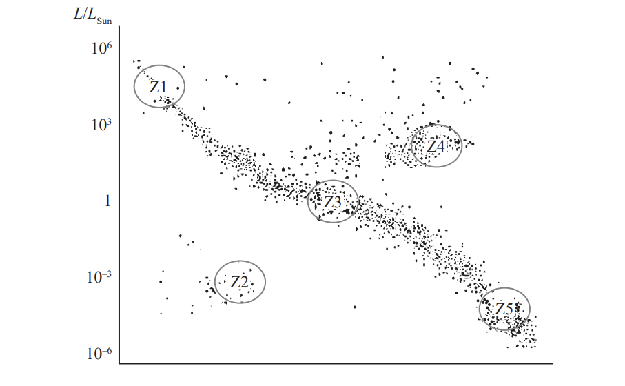
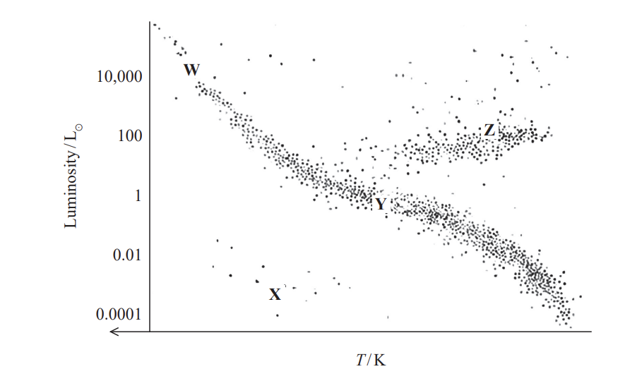

# Exam Questions — Astronomy
**5. Thermodynamics, Radiation, Oscillations & Cosmology** · Edexcel International A Level (IAL) Physics (YPH11)
> Source: [https://www.savemyexams.com/international-a-level/physics/edexcel/19/topic-questions/5-thermodynamics-radiation-oscillations-and-cosmology/astronomy/structured-questions/](https://www.savemyexams.com/international-a-level/physics/edexcel/19/topic-questions/5-thermodynamics-radiation-oscillations-and-cosmology/astronomy/structured-questions/) · 11 questions · total 41 marks

## Q1 — easy — 7 marks · structured-questions

### 17((a)) — 3 marks — command: describe — structured — from paper Oct/Nov 2021 · WPH15/01
Astronomers use a variety of techniques to determine the distances to astronomical objects outside our solar system.

Describe how trigonometric parallax can be used to determine the distance to a nearby star.

### 17((b)) — 4 marks — command: explain — structured — from paper Oct/Nov 2021 · WPH15/01
Explain how a knowledge of the distances to distant galaxies has enabled astronomers to determine a value for the age of the universe.

## Q2 — medium — 18 marks · structured-questions

### 19((a)) — 3 marks — command: deduce — structured — from paper 2022 Jan · WPH15/01
The astronomer Hertzsprung used parallax to determine the distances to some of the variable stars known as Cepheids.

Using parallax measurements, astronomers can determine distances to all stars with a parallax angle larger than 2.4 × 10–7 rad.

The variable star Alpha Cephei is 4.6 × 1017 m from the Earth.

Deduce whether the distance to Alpha Cephei could be determined from parallax measurements.

distance from Earth to Sun = 1.5 × 1011 m

### 19((b)) — 3 marks — command: describe — structured — from paper 2022 Jan · WPH15/01
Cepheids are a type of standard candle.

Describe how standard candles can be used to determine distances to stars.

### 19((c)) — 12 marks — command: multiple — structured — from paper 2022 Jan · WPH15/01
The Sun is a yellow star with a surface temperature of about 6000 K. In the 20th century, astronomers discovered a large variety of stars in our galaxy.

Hertzsprung and Russell developed the Hertzsprung-Russell (HR) diagram as a way of classifying stars.

An HR diagram is shown below.

i) Label the *x*-axis of the HR diagram. You should include approximate values.

**(3)**

ii) There are five zones, Z1, Z2, Z3, Z4 and Z5, identified on the HR diagram.

Complete the following table. You should match one zone with each description.

| **Description** | **Zone** |
|---|---|
| High mass hot stars |   |
| Low mass cool stars |   |
| Low mass hot stars |   |

** (3)**

*iii) The position of a star on the HR diagram changes as the star evolves.

Explain how a star like the Sun evolves as it progresses from zone Z3 to its final position on the HR diagram.

**(6)**

## Q3 — medium — 2 marks · structured-questions

### 11() — 2 marks — command: calculate — structured — from paper Oct/Nov 2021 · WPH15/01
Sirius is the brightest star in the night sky. The intensity of Sirius is measured to be 1.09 × 10−7 Wm−2.

Calculate the distance of Sirius from the Earth.

luminosity of Sirius = 8.94 × 1027 W

Distance of Sirius from the Earth = ......................................

## Q4 — medium — 7 marks · structured-questions

### 12((a)) — 1 mark — command: state — structured — from paper June 2021 · WPH15/01
In recent years, astronomers have discovered sources of fast radio bursts (FRBs) in other galaxies. Studies suggest that these sources may be a type of standard candle.

State what is meant by a standard candle.

### 12((b)) — 6 marks — command: multiple — structured — from paper June 2021 · WPH15/01
An FRB source emits intense bursts of radio waves, each burst lasting for a fraction of a second. The closest FRB source is in a massive spiral galaxy 4.60 × 1024 m from the Earth.

A detector of area 1.00 × 10−4 m2 on the surface of the Earth received bursts of radio waves. In one burst, 9.40 × 10−23 J of energy was received in a time of 1.15 ms.

i) Show that the luminosity of the source is about 2 × 1035 W.

**(4)**

ii) When FRB sources were first discovered, some observers suggested that the bursts might be alien communications.

Suggest why this is unlikely.

luminosity of the Sun = 3.8 × 1026 W

**(2)**

## Q5 — easy — 1 marks · multiple-choice-questions

### 1() — 1 mark — multiple_choice — from paper Oct/Nov 2021 · WPH15/01
Which of the following describes a standard candle?
- **A.** a star of known distance
- **B.** a star of known intensity
- **C.** a star of known luminosity
- **D.** a star of known mass

## Q6 — medium — 1 marks · multiple-choice-questions

### 8() — 1 mark — multiple_choice — from paper 2022 Jan · WPH15/01
Sirius and α-Centauri are two of our closest stars. Sirius has a luminosity about 16 times greater than the luminosity of α-Centauri. Sirius is twice as far away from the Earth as α-Centauri.

The intensity of light from Sirius is *I*s and the intensity of light from α-Centauri is* I*α .

Which of the following is the value of $\frac{I_{s}}{I_{α}}$?
- **A.** $\frac{1}{4}$
- **B.** 4
- **C.** 8
- **D.** 16

## Q7 — medium — 1 marks · multiple-choice-questions

### 8() — 1 mark — multiple_choice — from paper Oct/Nov 2021 · WPH15/01
The letters W, X, Y and Z represent stars at these positions on the diagram.

Which of the following is part of a possible evolutionary path of a star?
- **A.** W → Y
- **B.** X → Y
- **C.** Y → W
- **D.** Y → Z

## Q8 — medium — 1 marks · multiple-choice-questions

### 9() — 1 mark — multiple_choice — from paper Oct/Nov 2021 · WPH15/01
Which of the following statements about stars in positions W, X, Y and Z is correct?

- **A.** W and Y have the same mass.
- **B.** W has a lower surface temperature than Z.
- **C.** Y is more massive than W.
- **D.** Y has a lower surface temperature than X.

## Q9 — medium — 1 marks · multiple-choice-questions

### 6() — 1 mark — multiple_choice — from paper June 2021 · WPH15/01
Tau Ceti is one of the closest stars to the Sun. Tau Ceti has a surface temperature of 5300 K and a luminosity of 0.55 *L*Sun, where *L*Sun is the luminosity of the Sun.

Which of the following is the correct description of Tau Ceti?
- **A.** main sequence star
- **B.** red dwarf star
- **C.** red giant star
- **D.** white dwarf star

## Q10 — medium — 1 marks · multiple-choice-questions

### 8() — 1 mark — multiple_choice — from paper June 2021 · WPH15/01
Two stars, P and Q, have approximately the same radius. The surface temperature of star P is twice the surface temperature of star Q.

Star P has a luminosity $L_{P}$ and star Q has a luminosity $L_{Q}$.

The ratio $\frac{L_{p}}{L_{Q}}$ is approximately
- **A.** 2
- **B.** 4
- **C.** 8
- **D.** 16

## Q11 — medium — 1 marks · multiple-choice-questions

### 1() — 1 mark — multiple_choice
A red giant star of surface temperature $T$ and surface area $A$ has a luminosity $L$.

The Sun has a surface temperature of $T_{S}$, a surface area of $A_{S}$ and a luminosity of $L_{S}$.

Which row of the table is correct?

| **A** | $T<T_{S}$ | $A<A_{S}$ | $L<L_{S}$ |
|---|---|---|---|
| **B** | $T<T_{S}$ | $A>A_{S}$ | $L>L_{S}$ |
| **C** | $T>T_{S}$ | $A<A_{S}$ | $L<L_{S}$ |
| **D** | $T>T_{S}$ | $A>A_{S}$ | $L>L_{S}$ |
- **A.** 
- **B.** 
- **C.** 
- **D.** 
