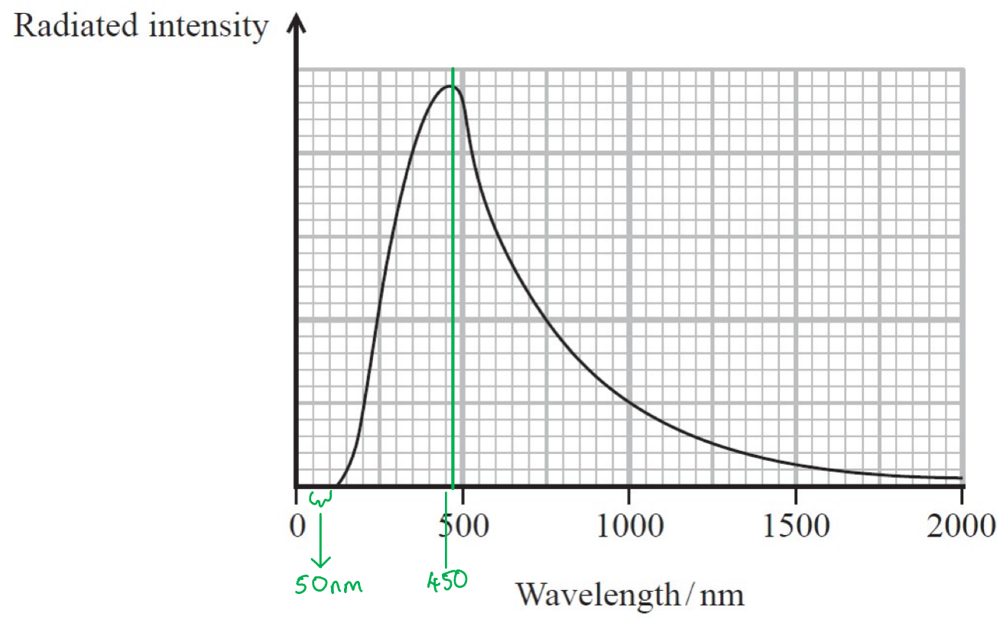
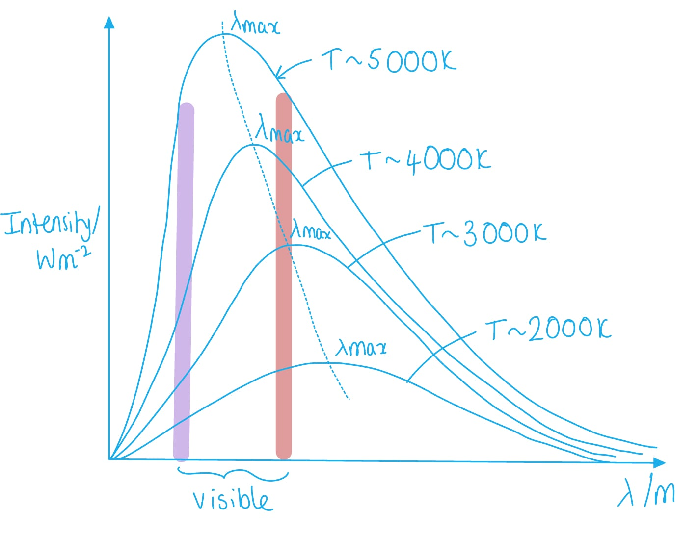
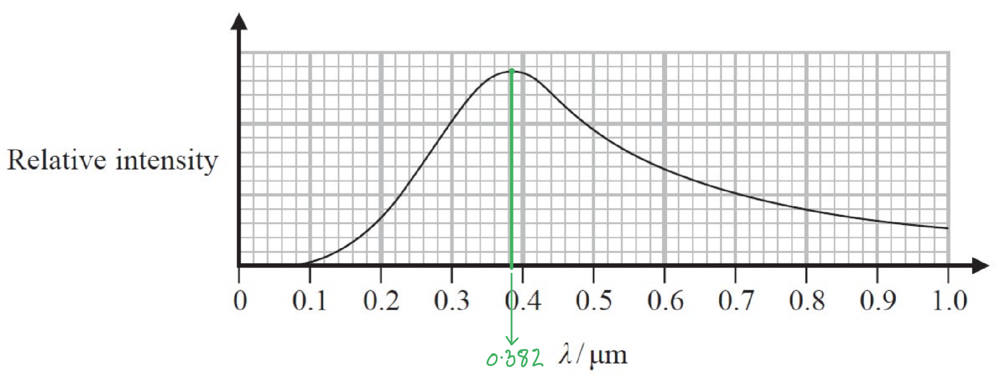
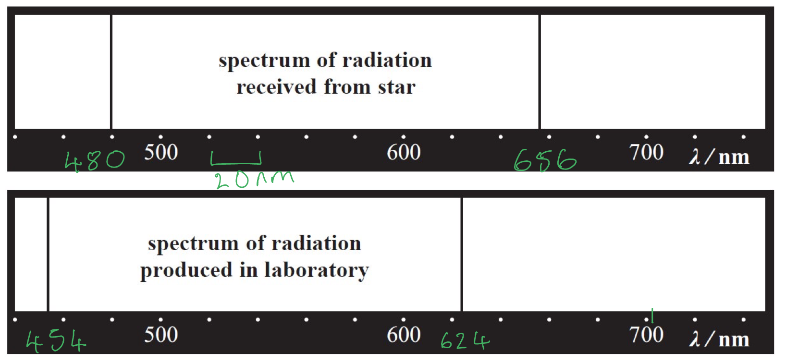
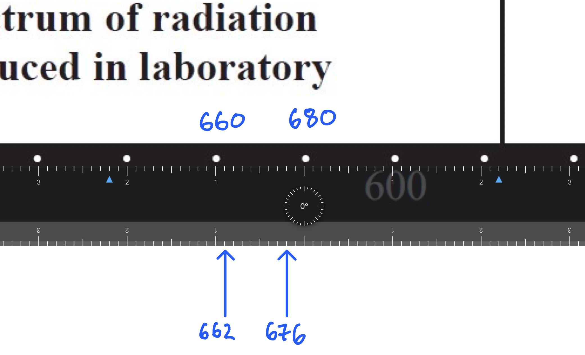
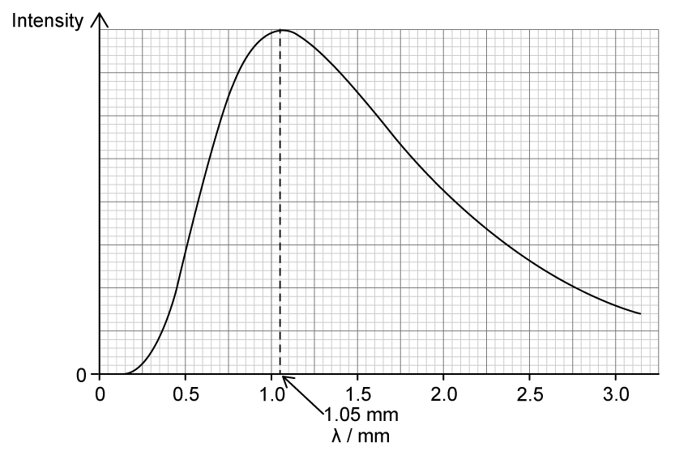

# Mark Schemes — Black Body Radiation
**5. Thermodynamics, Radiation, Oscillations & Cosmology** · Edexcel International A Level (IAL) Physics (YPH11)

## Q1 — medium — 5 marks · structured-questions

### 15() — 5 marks
A website states that Procyon has twice the diameter of the Sun. Assess the accuracy of this statement:

From the data booklet:

- Luminosity of Procyon, $L$ = 2.65 × 1027 W
- Diameter of Sun, $d$ = 6.96 × 108 m

From the data booklet:

- Wien's Law: $λ_{max}T=2.898\times10^{-3}mK$
- Stefan-Boltzmann Law: $L=σAT^{4}$
- Stefan-Boltzmann constant, $σ$ = 5.67 × 10–8 W m–2 K–4

Draw lines on the graph to obtain a value for $λ_{max}$:

- $λ_{max}=475\mathrm{nm}=475\times10^{-9}m$ [1 mark]

  - Accepted range: 450 - 500 nm

Use Wien's Law to calculate the temperature of Procyon:

- $T=\frac{2.898\times10^{-3}}{λ_{max}}=\frac{2.898\times10^{-3}}{475\times10^{-9}}=6101K$ [1 mark]

Use the Stefan-Boltzmann Law to calculate the area of Procyon:

- $A=\frac{L}{σT^{4}}$
- `A space equals space fraction numerator open parentheses 2.65 space cross times space 10 to the power of 27 close parentheses over denominator open parentheses 5.67 space cross times space 10 to the power of negative 8 end exponent close parentheses space cross times open parentheses 6101 close parentheses to the power of 4 end fraction`
- $A=3.37\times10^{19}m^{2}$ **[1 mark]**

Calculate the radius of Procyon:

- $A=4πr^{2}$
- $r=\sqrt{\frac{A}{4π}}$
- $r=\sqrt{\frac{3.37\times10^{19}}{4π}}$
- $r=1.64\times10^{9}m$ **[1 mark]**

Compare the diameter of the Sun and the diameter of Procyon:

- `D subscript p space equals space 2 space cross times space r subscript p space equals space 2 space cross times space open parentheses 1.64 space cross times space 10 to the power of 9 close parentheses space equals space 3.28 space cross times space 10 to the power of 9 space straight m`
- `D subscript p over D subscript S u n end subscript space equals space fraction numerator open parentheses 3.28 space cross times space 10 to the power of 9 close parentheses over denominator open parentheses 6.96 space cross times space 10 to the power of 8 close parentheses end fraction space equals space 4.7`
- Hence, this is more than twice the diameter of the Sun, so the website is not correct; **[1 mark]**

**[Total: 5 marks]**

- *Don't forget that the **surface area of a sphere** is **4πr**2** not πr**2*
- *Remember to compare the **diameter** of **Procyon** and the Sun and not the radius of Procyon*

## Q2 — medium — 12 marks · structured-questions

### 20((a)) — 1 marks
A main sequence star is:

- (A star that is) fusing hydrogen (into helium) in the core of the star; **[1 mark]**

**[Total: 1 mark]**

- *Stars spend most of their lifetime as a main sequence star*

### 20((b)) — 8 marks
Show that the current radius of the Sun is about 7.0 × 108 m

List the known quantities:

- Luminosity of the Sun, *L* = 3.83 × 1026 W
- Surface temperature of the Sun, *T* = 5780 K

Rearrange the luminosity equation for the radius, *r*:

- $L=σAT^{4}=σ4πr^{2}T^{4}$
- $r=\sqrt{\frac{L}{σ4πT^{4}}}$

Substitute in the values and calculate *r*:

- `r space equals space square root of fraction numerator 3.83 space cross times space 10 to the power of 26 over denominator open parentheses 5.67 space cross times space 10 to the power of negative 8 end exponent close parentheses space cross times space 4 pi cross times space 5780 to the power of 4 end fraction end root` **[1 mark]**
- $r=6.9398\times10^{8}=6.94\times10^{8}m$ **[1 mark]**

ii) Show that when the Sun is in its red giant stage, *λ*max is about 1 × 10−6 m

- Radius of a red giant star = 150 × its current radius  = 150 × (7.0 × 108)
- Luminosity of a red giant star = 1600 × its current luminosity  = 1600 × (3.83 × 1026)
- Current radius of the Sun = 7.0 × 108 m

Calculate the surface temperature of the red giant, *T*:

- $L=σAT^{4}=σ4πr^{2}T^{4}$
- `T space equals space fourth root of fraction numerator L over denominator sigma 4 pi r squared end fraction end root space equals space fourth root of fraction numerator 1600 space cross times space open parentheses 3.83 space cross times space 10 to the power of 26 close parentheses over denominator open parentheses 5.67 space cross times space 10 to the power of negative 8 end exponent close parentheses space cross times space 4 pi space cross times space open parentheses 150 space cross times space open parentheses 7.0 space cross times space 10 to the power of 8 close parentheses close parentheses end fraction end root space equals space 2872 space straight K` **[1 mark]**

Calculate *λ*max using Wein's law:

- $λ_{max}T=2.898\times10^{-3}mK$
- $λ_{max}=\frac{2.898\times10^{-3}}{2872}$ **[1 mark]**
- $λ_{max}=1.0\times10^{-6}m$ **[1 mark]**

iii) Comment on the value for *λ*max and this classification of the Sun

List the known quantities:

- Range of wavelengths of red light = (6.20 × 10–7 m) to (7.8 × 10–7 m)

Comment on the value for *λ*max:

- *λ*max is not in the wavelength range for red light **OR ***λ*max is in the infrared wavelength range; **[1 mark]**
- There is a range of wavelengths emitted around the value of *λ*max **[1 mark]**
- The most intense region of the visible spectrum will be red light; **[1 mark]**

**[Total: 8 marks]**

- *Red light is in the **visible** part of the electromagnetic spectrum and has the longest wavelength of all the colours*
- *It also is the most intense region of this spectrum at temperatures between 2000 – 3000 K, as seen from the black body curve*

### 20((c)) — 3 marks
The orbital period of a planet would change as the mass of the Sun decreases by:

**EITHER**

- (The mass of the Sun decreases and so) the gravitational force exerted on the planet decreases
- The gravitational force provides a centripetal force; **[1 mark]**
- $F=mω^{2}r$ and *ω *will decrease **OR** $F=\frac{mv^{2}}{r}$ and *v* will decrease, so *T* must increase; **[1 mark]**

**OR**

- Equate $F=\frac{GMm}{r^{2}}$and $F=mω^{2}r$ **[1 mark]**
- Derive expression for T; **[1 mark]**
- Deduce that *T* will increases; **[1 mark]**

*Example answer*:

- `F space equals fraction numerator space G M m over denominator r squared end fraction space equals space m omega squared r space equals space m open parentheses fraction numerator 2 pi over denominator T end fraction close parentheses squared r`
- $\frac{GM}{r^{2}}=\frac{4π^{2}}{T^{2}}r$
- $T=\sqrt{\frac{4π^{2}r^{3}}{GM}}$
- Therefore, as *M* (the mass of the Sun) decreases, *T* will increase

**[Total: 3 marks]**

- *In questions where you are asked to explain how one variable changes with another (in this case how **T**, the orbital period of a planet varies with **M**, the mass of the Sun) always use **equations **to check their relationship*
- *If the two variables are inversely proportional l e.g. *$x\propto\frac{1}{y}$* , like in this question, then as **y** increases then **x** decreases and vice versa*

  - *Therefore, it's **essential** you are confident in rearranging equations to make a required variable the subject*
- *Remember in the gravitational fields equations, **M **and **m** refer to very specific masses*

  - *M** is the mass of the planet that this being orbited*
  - *m **is the mass of the object that is orbiting*
- *Therefore, the time period **T** does not depend on the mass of the object that is orbiting (since **m** is not in the equation for **T - ** it cancels out in the derivation)*

## Q3 — medium — 8 marks · structured-questions

### 15((a)) — 3 marks
Determine the surface temperature of the star:

From the data booklet:

- Wien's Law: $λ_{max}T=2.898\times10^{-3}mK$

Draw lines on the graph to obtain the maximum wavelength of the star, $λ_{max}$:

- $λ_{max}$ = 0.382 µm **[1 mark]**

  - Accepted range: 0.37 - 0.40 µm

Calculate the surface temperature of the star, $T$:

- $T=\frac{2.898\times10^{-3}}{0.382\times10^{-6}}$** [1 mark]**
- $T=7586K$ ** [1 mark]**

**[Total: 3 marks]**

### 15((b)) — 5 marks
Comparing the spectrum from the star and from the laboratory:

From the data booklet:

- Redshift of electromagnetic radiation, $z\approx\frac{\Deltaλ}{λ}\approx\frac{\Deltaf}{f}\approx\frac{v}{c}$
- Speed of light in a vacuum, $c$ = 3.00 × 108 m s−1

A pair of wavelengths are emitted from each spectrum:

- Draw lines on the line spectra to identify the wavelengths of the emitted radiation:

- $λ_{star}=480\mathrm{nm}$

  - Acceptable range: 479 - 480 nm

** AND**

- $λ_{lab}=454\mathrm{nm}$

  - Acceptable range: 452 - 456 nm **[1 mark]**

Calculate the change in wavelength between the star and the laboratory:

- $\Deltaλ=480-454=26\mathrm{nm}$ **[1 mark]**

The wavelengths in each spectrum are different, so a wavelength shift, $v$ can be calculated:

- $\frac{\Deltaλ}{λ}\approx\frac{v}{c}$
- $v=c\times\frac{\Deltaλ}{λ}$
- `v space equals space open parentheses 3 space cross times space 10 to the power of 8 close parentheses space cross times space fraction numerator 26 space cross times space 10 to the power of negative 9 end exponent over denominator 454 space cross times space 10 to the power of negative 9 end exponent end fraction`** [1 mark]**
- $v=1.72\times10^{-7}ms^{-1}$ **[1 mark]**

Conclusion:

- Hence, the star has a speed of recession, so it is receding; **[1 mark]**

**[Total: 5 marks]**

- *You must use a **ruler** to correctly identify the wavelengths between those identified on the axis:*

- *You could use the **other wavelengths** in your calculation to get the **same answer**:* *   AND*

  - $λ_{star}=656nm$*:*
  
    - *Acceptable range: 654 - 658 nm*

  - $λ_{lab}=624nm$* *
  
    - *Acceptable range: 622 - 626 nm *
- *In the Doppler shift equation *$λ$* = *$λ_{lab}$* because this is the **source radiation**, the radiation from the star is being compared with this*

## Q4 — medium — 2 marks · structured-questions

### 1() — 2 marks
To determine the temperature of the CMB:

- Read the peak wavelength from the graph:

$λ_{\text{max}}=1.05\text{mm}$ **[1 mark]**

- Apply Wien's law and compare with the graph:

$λ_{\text{max}}T=2.898\times10^{-3}\text{m K}$

$T=\frac{2.898\times10^{-3}}{1.05\times10^{-3}}$

$T=2.76K\approx3K$**, therefore, the graph is consistent** **[1 mark]**

> **[mark-scheme]**
> 1 mark for correctly reading the peak wavelength from the graph
> 
> - Accept values in the range 1.0–1.1 mm
> 
> 1 mark for correct substitution into Wien's law **AND** conclusion that the graph is consistent

## Q5 — medium — 1 marks · multiple-choice-questions

### 10() — 1 marks
**Correct answer: A** — Star X is brighter and has a higher surface temperature than star Y.

**Final answer:** **The correct answer is ****A**** because:**

- Wien's law states that the wavelength at which an object emits the most intense light, $λ_{max}$ is inversely proportional to the object's temperature

  - Star X has a lower $λ_{max}$ so it has a higher surface temperature than star Y
- At every wavelength, the intensity (and hence luminosity) of star X is higher, so it is brighter than star Y
