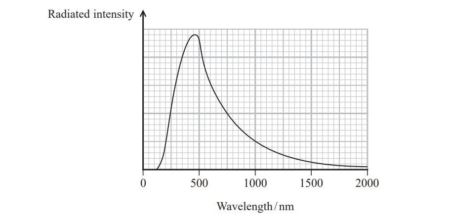
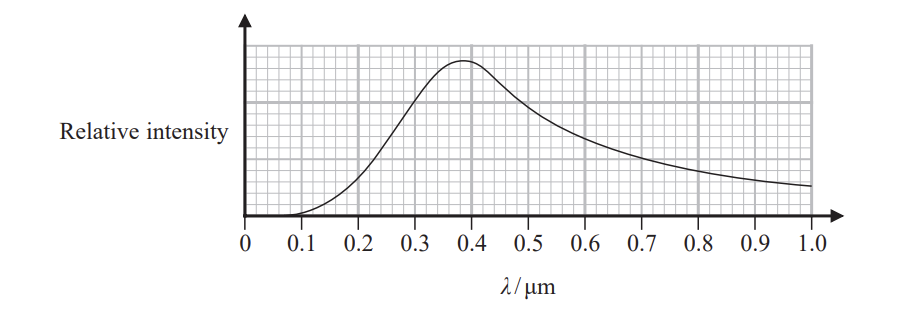
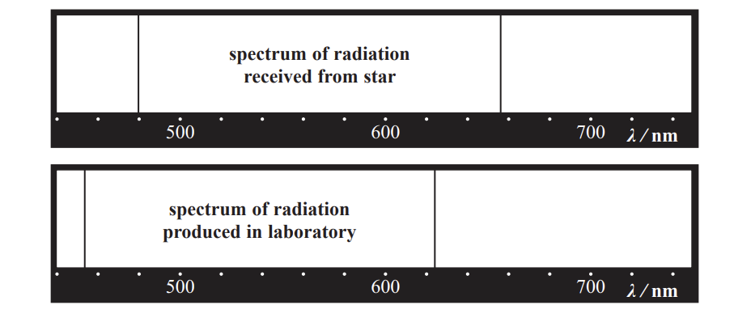
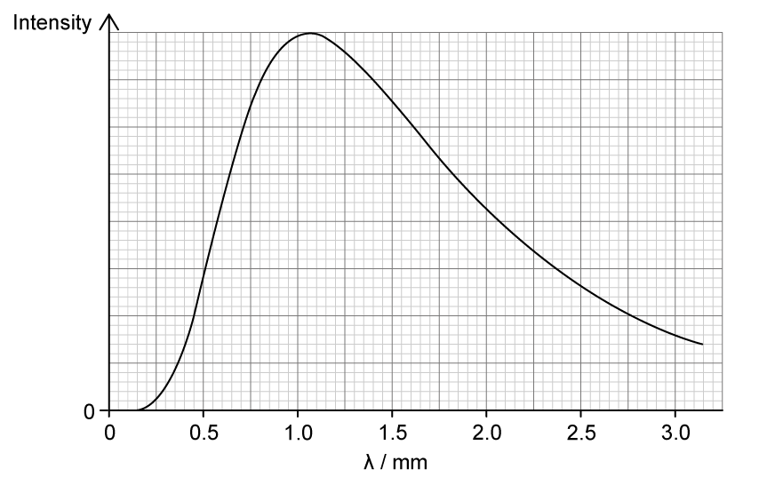
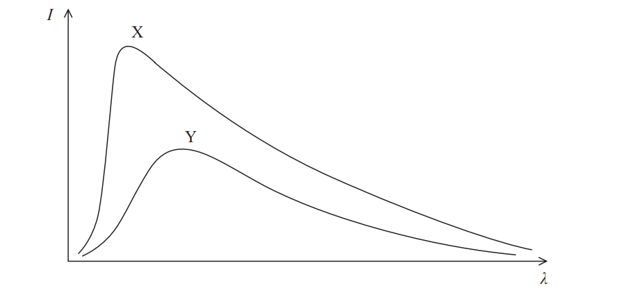

# Exam Questions — Black Body Radiation
**5. Thermodynamics, Radiation, Oscillations & Cosmology** · Edexcel International A Level (IAL) Physics (YPH11)
> Source: [https://www.savemyexams.com/international-a-level/physics/edexcel/19/topic-questions/5-thermodynamics-radiation-oscillations-and-cosmology/black-body-radiation/structured-questions/](https://www.savemyexams.com/international-a-level/physics/edexcel/19/topic-questions/5-thermodynamics-radiation-oscillations-and-cosmology/black-body-radiation/structured-questions/) · 5 questions · total 28 marks

## Q1 — medium — 5 marks · structured-questions

### 15() — 5 marks — command: assess — structured — from paper 2022 Jan · WPH15/01
Procyon is the brightest star in the constellation Canis Minor. The graph shows how the radiated intensity from Procyon varies with wavelength.

A website states that Procyon has twice the diameter of the Sun.

Assess the accuracy of this statement.

luminosity of Procyon = 2.65 × 1027 W

diameter of Sun = 6.96 × 108 m

## Q2 — medium — 12 marks · structured-questions

### 20((a)) — 1 mark — command: state — structured — from paper Oct/Nov 2021 · WPH15/01
The Sun is a main sequence star.

State what is meant by a main sequence star.

### 20((b)) — 8 marks — command: multiple — structured — from paper Oct/Nov 2021 · WPH15/01
The Sun will eventually leave the main sequence and become a red giant star.

luminosity of Sun = 3.83 × 1026 W

i) Show that the current radius of the Sun is about 7.0 × 108 m.

surface temperature of Sun = 5780 K

**(2)**

ii) As a red giant star, the radius of the Sun will be about 150 times its current radius. Its luminosity will be about 1600 times its current luminosity. *λ*max is the wavelength at which peak power radiation occurs.

Show that when the Sun is in its red giant stage, *λ*max is about 1 × 10−6 m.

current radius of Sun = 7.0 × 108 m

**(3)**

iii) At this stage of its evolution the Sun will be classified as a red giant star.

The wavelength of red light is between 6.2 × 10−7 m and 7.8 × 10−7 m.

Comment on the value for *λ*max and this classification of the Sun.

**(3)**

### 20((c)) — 3 marks — command: explain — structured — from paper Oct/Nov 2021 · WPH15/01
As the Sun continues its evolution, its mass will decrease. It is estimated that at its largest radius, the mass of the Sun will have decreased significantly.

Explain how the orbital period of a planet would change as the mass of the Sun decreases.

Assume that the radius of the planet’s orbit about the Sun does not change.

## Q3 — medium — 8 marks · structured-questions

### 15((a)) — 3 marks — command: determine — structured — from paper June 2021 · WPH15/01
A graph of relative intensity against wavelength for a star is shown.

Determine the surface temperature of the star.

Surface temperature of star = ...........................................

### 15((b)) — 5 marks — command: explain — structured — from paper June 2021 · WPH15/01
Radiation from the star is analysed. The radiation from the star has spectral lines at different wavelengths from the same spectral lines produced by a source in the laboratory, as shown.

Explain what can be concluded about the star from these results.

Your answer should include a calculation.

## Q4 — medium — 2 marks · structured-questions

### 1() — 2 marks — command: show — structured
The cosmic microwave background (CMB) radiation is detected to come from all directions in space equally. The graph shows how the intensity of the CMB radiation varies with its wavelength.

Show that the graph is consistent with a black-body temperature of about $3K$.

## Q5 — medium — 1 marks · multiple-choice-questions

### 10() — 1 mark — multiple_choice — from paper June 2021 · WPH15/01
Two stars, X and Y, behave as black body radiators. The graphs show how the intensity *I* of radiation emitted varies with wavelength λ for the two stars.

The stars are both viewed from the same distance.

Which of the following statements can be deduced from the two graphs?
- **A.** Star X is brighter and has a higher surface temperature than star Y.
- **B.** Star X is brighter and has a lower surface temperature than star Y.
- **C.** Star X is dimmer and has a higher surface temperature than star Y.
- **D.** Star X is dimmer and has a lower surface temperature than star Y.
