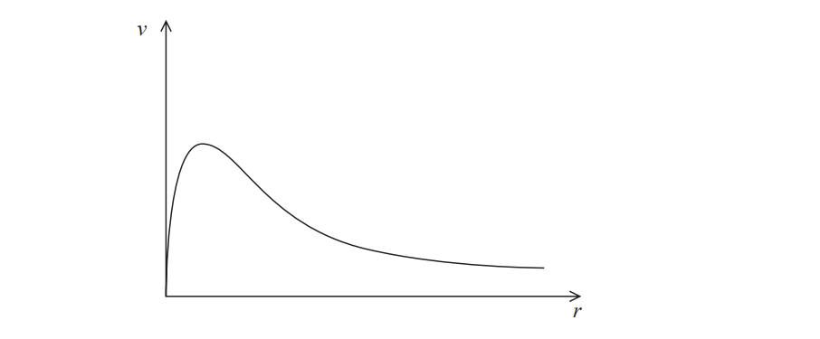
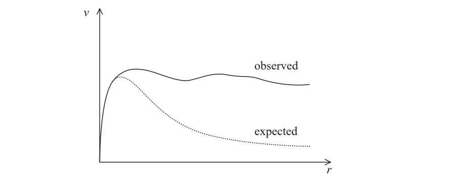
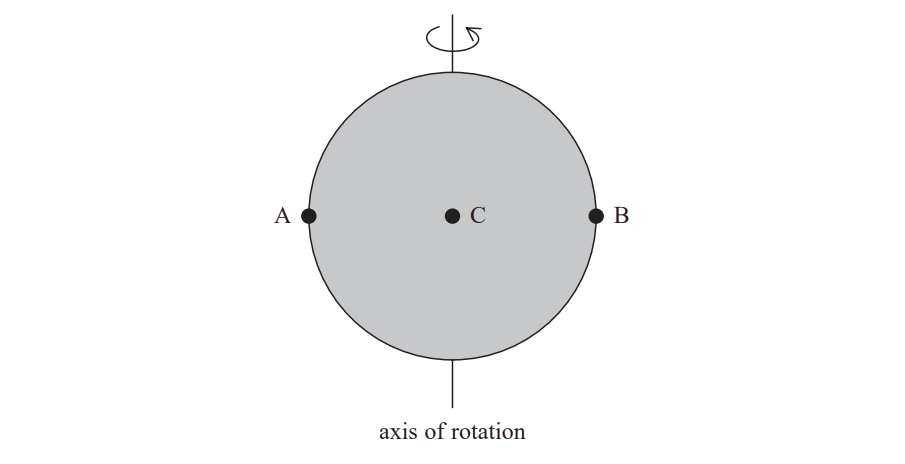

# Exam Questions — Cosmology
**5. Thermodynamics, Radiation, Oscillations & Cosmology** · Edexcel International A Level (IAL) Physics (YPH11)
> Source: [https://www.savemyexams.com/international-a-level/physics/edexcel/19/topic-questions/5-thermodynamics-radiation-oscillations-and-cosmology/cosmology/structured-questions/](https://www.savemyexams.com/international-a-level/physics/edexcel/19/topic-questions/5-thermodynamics-radiation-oscillations-and-cosmology/cosmology/structured-questions/) · 6 questions · total 23 marks

## Q1 — medium — 7 marks · structured-questions

### 16((a)) — 5 marks — command: multiple — structured — from paper 2022 Jan · WPH15/01
The image shown is a representation of our galaxy, the Milky Way.

Astronomers think that there is a very large concentration of stars in the central region of the galaxy. Outside this central region the concentration of stars is very much less. All stars in the galaxy are rotating about its centre.

It can be shown that the velocity *v* of a star a distance *r* from the centre of the galaxy is given by the expression

$v=\sqrt{\frac{GM}{r}}$

where *M* is the mass of the galaxy contained in a sphere of radius *r*.

i) The graph shows how astronomers expect *v* to vary with *r*.

Explain how the expression gives the variation of *v* with *r* shown in the graph.

**(3)**

ii) The observed variation of *v* with *r* has been added to produce the graph below.

Suggest why the ‘observed’ velocity varies as shown.

**(2)**

### 16((b)) — 2 marks — command: explain — structured — from paper 2022 Jan · WPH15/01
The ultimate fate of the universe may be a closed universe, but astronomers cannot be sure what their current models predict.

Explain why astronomers cannot be sure that the universe is closed.

## Q2 — medium — 7 marks · structured-questions

### 16((a)) — 1 mark — command: complete — structured — from paper Oct/Nov 2021 · WPH15/01
The diagram shows the Sun rotating about its axis as viewed from the Earth.

A, B and C are points on the surface of the Sun.

Light from points A, B and C is analysed. The wavelength λα of the alpha line in the hydrogen spectrum is determined for the light from each point.

Complete the table with the letters A, B and C to indicate the point corresponding to each wavelength.

| **λ****α**** /nm** | **Point** |
|---|---|
| 656.2837 |   |
| 656.2797 |   |
| 656.2757 |   |

### 16((b)) — 2 marks — command: explain — structured — from paper Oct/Nov 2021 · WPH15/01
Explain why there is a variation in the wavelength of the light from different points on the Sun.

### 16((c)) — 4 marks — command: assess — structured — from paper Oct/Nov 2021 · WPH15/01
In the laboratory, the wavelength of the alpha line in the hydrogen spectrum is 656.2797 nm.

Assess whether this is consistent with the Sun having a period of rotation approximately equal to 28 days.

radius of the Sun = 7.0 × 108 m

1 day = 86 400 s

## Q3 — medium — 6 marks · structured-questions

### 1() — 2 marks — command: explain — structured
Explain how the observation of CMB radiation supports the Big Bang theory of the universe.

### 2() — 4 marks — command: multiple — structured
An astronomer observes a distant quasar with a redshift $z$ of $0.134$.

(i) Determine the distance, in $\text{m}$, from the Earth to the quasar.

$H_{0} = 67 \text{km s}^{-1} \text{Mpc}^{-1}$

$1\text{pc}=3.1\times10^{16}\text{m}$

[3]

(ii) Suggest one reason why Hubble's law may not give a reliable value for the distance to such a remote object.

[1]

## Q4 — medium — 1 marks · multiple-choice-questions

### 6() — 1 mark — multiple_choice — from paper 2022 Jan · WPH15/01
Current theory suggests that the universe is expanding.

Which of the following is evidence to support this theory?
- **A.** All galaxies appear to be rotating in space.
- **B.** Dark matter has been detected in the universe.
- **C.** All distant stars are observed to be increasing in size.
- **D.** The further a galaxy is from the Earth, the faster it recedes.

## Q5 — medium — 1 marks · multiple-choice-questions

### 9() — 1 mark — multiple_choice — from paper 2022 Jan · WPH15/01
The spectrum of electromagnetic radiation from a galaxy is observed to have a redshift.

Which of the following is a correct statement about lines in this spectrum?
- **A.** All the lines are in the red part of the spectrum.
- **B.** All the lines are observed to have longer wavelengths than expected.
- **C.** Lines with wavelengths at the red end of the spectrum are the most intense.
- **D.** Light for all the lines was emitted with longer wavelengths than expected.

## Q6 — medium — 1 marks · multiple-choice-questions

### 2() — 1 mark — multiple_choice — from paper June 2021 · WPH15/01
The initial value determined by astronomers for the Hubble constant was smaller than the currently accepted value.

Which of the following statements is correct?
- **A.** The universe is bigger than astronomers initially thought.
- **B.** The universe is not as old as astronomers initially thought.
- **C.** The universe is older than astronomers initially thought.
- **D.** The universe is smaller than astronomers initially thought.
