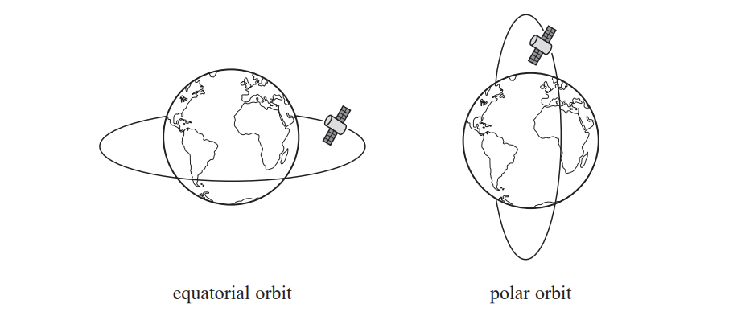

# Exam Questions — Gravitational Fields
**5. Thermodynamics, Radiation, Oscillations & Cosmology** · Edexcel International A Level (IAL) Physics (YPH11)
> Source: [https://www.savemyexams.com/international-a-level/physics/edexcel/19/topic-questions/5-thermodynamics-radiation-oscillations-and-cosmology/gravitational-fields/structured-questions/](https://www.savemyexams.com/international-a-level/physics/edexcel/19/topic-questions/5-thermodynamics-radiation-oscillations-and-cosmology/gravitational-fields/structured-questions/) · 9 questions · total 45 marks

## Q1 — medium — 5 marks · structured-questions

### 18((a)) — 3 marks — command: show — structured — from paper 2022 Jan · WPH15/01
In the 17th century, Kepler proposed his ‘law of harmonies’ for planetary motion. This law suggested that the ratio of the square of the orbital period *T* to the cube of the mean radius *R* has the same value for all the planets that orbit the Sun.

Mathematically his ‘law of harmonies’ can be written

$T^{2}=KR^{3}$

where *K* is a constant.

The table shows data for Earth and Mars.

| **Planet** | ***T***** / s** | ***R***** / m** |
|---|---|---|
| Earth | 3.16 × 107 | 1.50 × 1011 |
| Mars | 5.93 × 107 | 2.28 × 1011 |

** **Show that, for Earth and for Mars, *K* has a value of about 3.0 × 10–19 s2 m–3.

### 18((c)) — 2 marks — command: calculate — structured — from paper 2022 Jan · WPH15/01
Jupiter is the most massive planet in the solar system and has many moons. Kepler’s law of harmonies applies to the orbiting moons. However, the value of *K* for the moons is not the same as the value that applies to planets orbiting the Sun.

Ganymede is Jupiter’s largest moon. Ganymede has an orbital radius of 1.07 × 109 m and an orbital period of 172 hours.

Another moon, Io, has an orbital radius of 4.22 × 108 m.

Calculate the orbital period *T*I of Io about Jupiter.

*T*I= ............................

## Q2 — medium — 11 marks · structured-questions

### 21((a)) — 4 marks — command: multiple — structured — from paper Oct/Nov 2021 · WPH15/01
Weather satellites may be in an equatorial orbit or a polar orbit, as shown.

A weather satellite in a polar orbit circles the Earth at a height of 8.50 × 105 m above the surface of the Earth.

i) Show that the gravitational potential at this height is about −5.5 × 107 J kg−1.

mass of Earth = 5.98 × 1024 kg

radius of Earth = 6360 km

**(2)**

ii) Hence calculate the increase in gravitational potential energy when the satellite is placed in orbit.

satellite mass = 4990 kg

gravitational potential at the Earth’s surface = −6.27 × 107 J kg−1

Increase in gravitational potential energy = ............................**(2)**

### 21((b)) — 5 marks — command: assess — structured — from paper Oct/Nov 2021 · WPH15/01
It is claimed that a satellite in orbit at a height of 8.50 × 105 m would make 15 orbits of the Earth every 24 hours.

Assess the validity of this claim.

### 21((c)) — 2 marks — command: give — structured — from paper Oct/Nov 2021 · WPH15/01
It is suggested that the satellite could be placed in an equatorial orbit at a radius of 42 200 km. With this radius the satellite would have an orbital period equal to 24 hours.

Give one advantage and one disadvantage of placing a weather satellite in a polar orbit rather than in the suggested equatorial orbit.

## Q3 — medium — 9 marks · structured-questions

### 16((a)) — 3 marks — command: calculate — structured — from paper June 2021 · WPH15/01
In 2015, the company SpaceX stated its plan to launch about 4,000 “Starlink” satellites into a low Earth orbit. These satellites would provide a low-cost internet service to people around the world.

By the start of 2020 almost 200 Starlink satellites had been launched into an orbit 550 km above the Earth’s surface.

mass of Earth = 6.0 × 1024 kg

radius of Earth = 6.4 × 106 m

Calculate the orbital time of a Starlink satellite.

Orbital time of satellite = ...........................................

### 16((b)) — 3 marks — command: explain — structured — from paper June 2021 · WPH15/01
In 2015, the company SpaceX stated its plan to launch about 4,000 “Starlink” satellites into a low Earth orbit. These satellites would provide a low-cost internet service to people around the world.

By the start of 2020 almost 200 Starlink satellites had been launched into an orbit 550 km above the Earth’s surface.

mass of Earth = 6.0 × 1024 kg

radius of Earth = 6.4 × 106 m

Explain why satellites in low Earth orbits have a smaller orbital time than satellites in higher Earth orbits.

### 16((c)) — 3 marks — command: calculate — structured — from paper June 2021 · WPH15/01
The satellites were launched into orbit using rockets able to make multiple space flights.

Calculate the minimum kinetic energy required to raise the satellite to its lower orbit height.

mass of a Starlink satellite = 227 kg.

Minimum kinetic energy = ......................................

## Q4 — hard — 3 marks · structured-questions

### 18((b)) — 3 marks — command: determine — structured — from paper 2022 Jan · WPH15/01
In the 17th century, Kepler proposed his ‘law of harmonies’ for planetary motion. This law suggested that the ratio of the square of the orbital period *T* to the cube of the mean radius *R* has the same value for all the planets that orbit the Sun.

Mathematically his ‘law of harmonies’ can be written

$T^{2}=KR^{3}$

where *K* is a constant.

Kepler’s law of harmonies was derived later by Newton. Newton applied his law of gravitation to a planet moving in an approximately circular orbit around the Sun.

Determine a value for *K* by applying Newton’s law of gravitation to a planet of mass *m* moving in a circular orbit about the Sun.

mass of Sun = 1.99 × 1030 kg

*K* = .............................. s2 m–3

## Q5 — hard — 3 marks · structured-questions

### 16((a)) — 3 marks — command: calculate — structured — from paper June 2021 · WPH15/01
In 2015, the company SpaceX stated its plan to launch about 4,000 “Starlink” satellites into a low Earth orbit. These satellites would provide a low-cost internet service to people around the world.

By the start of 2020 almost 200 Starlink satellites had been launched into an orbit 550 km above the Earth’s surface.

mass of Earth = 6.0 × 1024 kg

radius of Earth = 6.4 × 106 m

Calculate the orbital time of a Starlink satellite.

Orbital time of satellite = ...........................................

## Q6 — hard — 11 marks · structured-questions

### 1() — 3 marks — command: show — structured
The Solar and Heliospheric Observatory (SOHO) is a satellite that monitors the Sun at a position called the L1 Lagrange point. This point lies on a direct line between the Earth and the Sun.

In December 1995, the SOHO satellite was launched from the surface of the Earth. To move the satellite from the Earth's surface to the L1 point, $1.158\times10^{11}\text{J}$ of work was done against the Earth's gravitational field.

Show that the distance of the SOHO satellite from the Earth is about $1.5\times10^{9}\text{m}$.

mass of SOHO$=1862\text{kg}$

mass of Earth$=5.972\times10^{24}\text{kg}$

radius of Earth$=6378\text{km}$

### 2() — 5 marks — command: calculate — structured
The location of the L1 point allows the SOHO satellite to always remain in a fixed position relative to the Earth.

Explain how the SOHO satellite at L1 can orbit the Sun and remain in the same position relative to the Earth.

Your answer should include a calculation.

distance from the Earth to the Sun$=1.496\times10^{11}\text{m}$

mass of the Sun$=1.989\times10^{30}\text{kg}$

### 3() — 3 marks — command: assess — structured
A student states:

*"Because the satellite remains at a fixed distance between the Earth and the Sun, the resultant gravitational field strength at L1 must be zero."*

Assess the student's statement.

## Q7 — medium — 1 marks · multiple-choice-questions

### 2() — 1 mark — multiple_choice — from paper Oct/Nov 2021 · WPH15/01
A helium nucleus approaches a gold nucleus. An electric force and a gravitational force act on each nucleus.

Which statement about these forces is **not** correct?
- **A.** The electric force between the nuclei is repulsive.
- **B.** The electric force is always smaller than the gravitational force.
- **C.** Both forces increase as the nuclei approach.
- **D.** The gravitational force between the nuclei is attractive.

## Q8 — medium — 1 marks · multiple-choice-questions

### 5() — 1 mark — multiple_choice — from paper June 2021 · WPH15/01
The gravitational field strength on the surface of Mercury is $g_{M}$. Callisto, a moon of Jupiter, has the same radius as Mercury but only one third of its density.

What is the gravitational field strength on the surface of Callisto?
- **A.** $\frac{g_{M}}{9}$
- **B.** $\frac{g_{M}}{3}$
- **C.** $3g_{M}$
- **D.** $9g_{M}$

## Q9 — medium — 1 marks · multiple-choice-questions

### 1() — 1 mark — multiple_choice
The gravitational field strength at Earth's surface is $g$ and the radius of the Earth is $R$. A satellite orbits at height $h$ above Earth's surface.

Which of the following expressions gives the gravitational field strength at the satellite?
- **A.** `g open parentheses fraction numerator R over denominator R plus h end fraction close parentheses squared`
- **B.** `g open parentheses R over h close parentheses squared`
- **C.** `g   open parentheses fraction numerator R over denominator R plus h end fraction close parentheses`
- **D.** $\frac{g}{R+h}$
