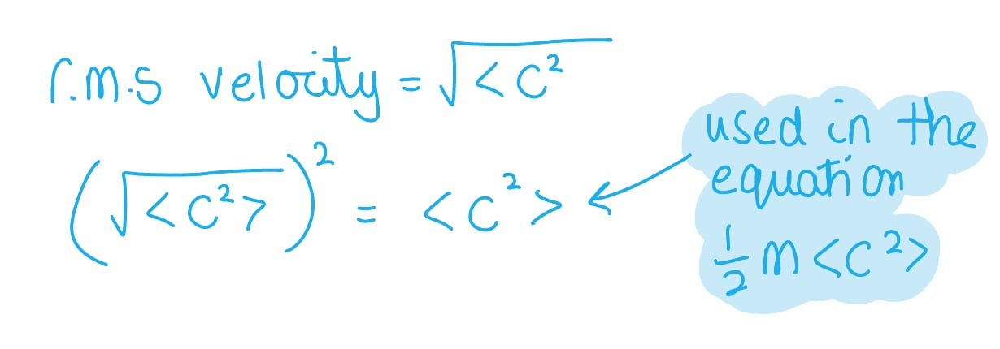
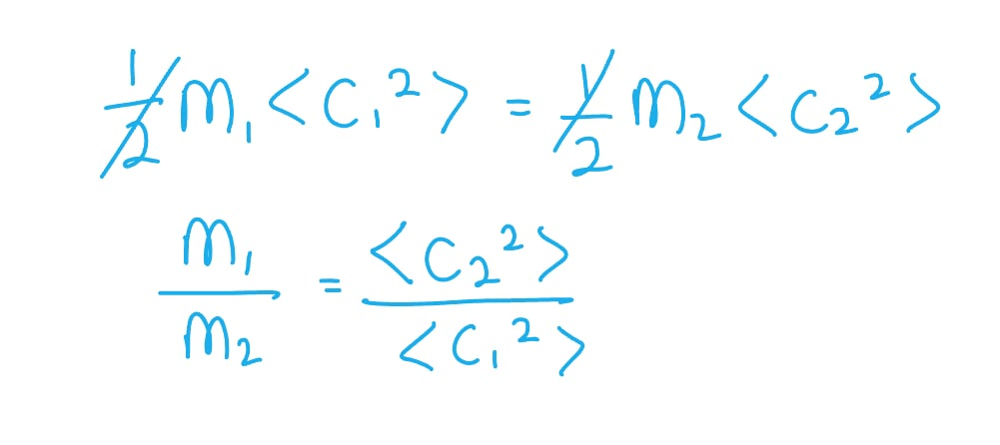

# Mark Schemes — Kinetic Theory & Ideal Gases
**5. Thermodynamics, Radiation, Oscillations & Cosmology** · Edexcel International A Level (IAL) Physics (YPH11)

## Q1 — medium — 5 marks · structured-questions

### 13((a)) — 3 marks
Calculate the volume of the balloon at the maximum height:

List the known quantities:

Before rising:

- Temperature of hydrogen in balloon, $T_{1}$ = 22.5 °C
- Pressure of hydrogen in balloon, $p_{1}$ = 1.02 × 105 Pa
- Volume of balloon before rising, $V_{1}$ = 7.50 m3

After rising:

- Temperature, $T_{2}$ = −48.0 °C
- Pressure, $p_{2}$ = 8.4 × 104 Pa

From the data booklet:

- Ideal gas equation: $pV=NkT$

Convert the temperatures of hydrogen into K:

- $T_{1}=22.5+273=295.5K$ **AND**
- $T_{2}=-48+273=225K$ **[1 mark]**

Obtain an expression from the ideal gas equation to calculate the volume of the balloon after rising, $V_{2}$:

- $pV=NkT$

  - Where, $N$ and $k$ are constants in this question
- So, $\frac{pV}{T}=constant$
- Hence, $\frac{p_{1}V_{1}}{T_{1}}=\frac{p_{2}V_{2}}{T_{2}}$
- `fraction numerator open parentheses 1.02 space cross times space 10 to the power of 5 close parentheses space cross times space open parentheses 7.5 close parentheses over denominator 295.5 end fraction space equals space 2588.8`
- `2588.8 space equals space fraction numerator open parentheses 8.4 space cross times space 10 to the power of 4 close parentheses space cross times space V subscript 2 over denominator 225 end fraction`** [1 mark]**
- `V subscript 2 space equals space fraction numerator 2588.8 space cross times space 225 over denominator open parentheses 8.4 space cross times space 10 to the power of 4 close parentheses end fraction`
- $V_{2}=6.93m^{3}$ **[1 mark]**

**[Total: 3 marks]**

- *The method above shows the **quickest** way to answer this question*
- *You can use: **pV **= **NkT **before the balloon rises to calculate **N*
- *Then substitute that into **pV **= **NkT **for when the balloon has risen to find **V *

### 13((b)) — 2 marks
Calculate the decrease in the mean kinetic energy of a hydrogen molecule in the balloon as the balloon rises to the maximum height:

List the known quantities:

- Temperature before rising, $T_{1}$ = 295.5 K
- Temperature after rising, $T_{2}$ = 225 K

From the data booklet:

- Molecular kinetic theory: `1 half m open angle brackets c squared close angle brackets space equals space 3 over 2 k T`
- Boltzmann constant, $k$ = 1.38 × 10−23 J K−1

Substitute the known quantities into the equation to calculate the decrease in mean kinetic energy:

- `straight capital delta open angle brackets K E close angle brackets space equals space 3 over 2 k straight capital delta T space equals space 3 over 2 space cross times space open parentheses 1.38 space cross times space 10 to the power of negative 23 end exponent close parentheses space cross times space open parentheses 295.5 space minus space 225 close parentheses space` **[1 mark]**
- Decrease in mean KE = 1.46 × 10−21 J **[1 mark]**

**[Total: 2 marks]**

## Q2 — medium — 6 marks · structured-questions

### 14((a)) — 3 marks
Show that the number of molecules in 1 mole of carbon dioxide is about 6.0 × 1023

List the known quantities:

- Pressure, *p* = 1.01 × 105 Pa
- Number of moles, *n* = 1
- Volume, *V* = 0.0241 m3
- Temperature, *T* = 20.0 °C = 20 + 273 = 293 K **[1 mark]**

Rearrange the ideal gas equation to find the number of molecules, *N*:

- $pV=NkT\RightarrowN=\frac{pV}{kT}$
- `N space equals space fraction numerator open parentheses 1.01 space cross times space 10 to the power of 5 close parentheses space cross times space 0.0241 over denominator open parentheses 1.38 space cross times space 10 to the power of negative 23 end exponent close parentheses space cross times space 293 end fraction space` **[1 mark]**
- $N=6.02\times10^{23}$ **[1 mark]**

**[Total: 3 marks]**

- *You should always make sure the temperature **T** is in **kelvin** when using the ideal gas equation *
- *The Boltzmann constant **k** is given on your data sheet (do not get this mixed up with Coulomb's law constant - that is relevant in the electric fields topic)*

### 14((b)) — 3 marks
Deduce the ratio of the masses of CO2 and CH4 molecules:

List the known quantities:

- % of r.m.s velocity of the methane molecules,  $\sqrt{\frac{<c_{C}^{2}>}{<c_{M}^{2}>}}$= 60.5 % = 0.605

Calculate the ratio of the r.m.s speeds:

- $\sqrt{\frac{<c_{C}^{2}>}{<c_{M}^{2}>}}=0.605\Rightarrow\frac{<c_{C}^{2}>}{<c_{M}^{2}>}=0.605^{2}=0.366$ **[1 mark] **

Calculate the ratio of the masses:

- KE of CO2 molecules = KE of CH4 molecules
- $\frac{m_{C}}{m_{M}}=\frac{<c_{M}^{2}>}{<c_{C}^{2}>}=\frac{1}{0.366}$ **[1 mark] **
- $\frac{m_{C}}{m_{M}}=2.73=2.7$ **[1 mark] **

**[Total: 3 marks]**

- *Make sure you're clear on the difference between mean square speed <**c**2**> and the r.m.s speed *$\sqrt{<c^{2}>}$*, as they are **different!*

- *To obtain the ratio of the masses, simply use the equation for KE*
- *Just be careful with your labels for carbon dioxide and methane, as these could get easily muddled if you don't set them out clearly*

## Q3 — medium — 6 marks · structured-questions

### 11((a)) — 4 marks
Explain why the pressure of the trapped air increases when the air is forced into a smaller volume:

- The molecules make more frequent collisions with the glass tube; **[1 mark]**
- (Therefore) the rate of change of momentum of the molecules increases; **[1 mark]**
- The force exerted on the glass tube increases; **[1 mark]**
- (The pressure exerted by the gas increases because) pressure is force per unit area **or** $P=\frac{F}{A}$; **[1 mark]**

**[Total: 4 marks]**

- *This explanation actually comes from the Edexcel GCSE course, but you still need to remember it! Refer to the revision notes for this course if you are unsure*
- *Make sure not to miss out any steps - at this level, going from frequent to collisions to pressure is not detailed enough*

  - *You must explain **how** the pressure is increased - frequent collisions means a large rate of change in momentum*

### 11((b)) — 2 marks
Calculate the number of molecules of air trapped in the glass tube:

List the known quantities:

- Temperature, $T$ = 293 K
- Volume, $V$ = 2.43 × 10−3 m3
- pressure, $p$ = 1.05 × 105 Pa

Rearrange the ideal gas equation:

- $pV=NkT$
- `N space equals space fraction numerator p V over denominator k T end fraction space equals space fraction numerator open parentheses 1.05 space cross times space 10 to the power of 5 close parentheses space cross times space open parentheses 2.43 space cross times space 10 to the power of negative 3 end exponent close parentheses over denominator open parentheses 1.38 space cross times space 10 to the power of negative 23 end exponent close parentheses space cross times space 293 end fraction` **[1 mark]**
- $N=6.31\times10^{22}$ **[1 mark]**

**[Total: 2 marks]**

- *N** = 6.3 × 10**22** to 2 significant figures is also accepted, but all the information in the question is given to 3 s.f. so your answer should be given to this resolution too*

## Q4 — medium — 1 marks · multiple-choice-questions

### 5() — 1 marks
**Correct answer: A** — 

**Final answer:** **The correct answer is ****A ****because:**

- The ideal gas equation is $pV=NkT$

  - Pressure is directly proportional to temperature and inversely proportional to volume
- This means that, as pressure increases, temperature increases and volume decreases

  - The temperature must increase by the **same** factor that volume decreases
  - Option **A** is the only option where this occurs

- This question is tricky because both volume and temperature depend on pressure

  - It is also possible to use the ideal gas equation and go through each row until you find a pressure of 4*p*
- If you need to convince yourself of this with the equation:

$\frac{NkT}{V}=p$

`fraction numerator N k open parentheses 2 T close parentheses over denominator open parentheses V over 2 close parentheses end fraction space equals space 4 p`

## Q5 — medium — 1 marks · multiple-choice-questions

### 7() — 1 marks
**Correct answer: C** — 4

**Final answer:** **The correct answer is ****C**** because:**

- Mean square speed is related to temperature in the equation `1 half m open angle brackets c squared close angle brackets space equals space 3 over 2 k T`

  - Mass of a particle is constant, so `open angle brackets c squared close angle brackets space proportional to space T`
- Temperature is related to pressure by $pV=NkT$

  - Volume and number of molecules are both constant, as the container is closed and rigid
  - $p\proptoT$
- This means that `open angle brackets c squared close angle brackets space proportional to space p`

  - If pressure multiplies by 4, so does mean square speed
- `fraction numerator open angle brackets v subscript F squared close angle brackets over denominator open angle brackets v subscript 1 squared close angle brackets end fraction space equals space 4`

## Q6 — easy — 1 marks · multiple-choice-questions

### 1() — 1 marks
**Correct answer: A** — 

**Final answer:** **The correct answer is A**

- For an ideal gas, there is no intermolecular potential energy, so the internal energy is the sum of the random kinetic energies of the molecules only

$U=E_{k}$

- The average molecular kinetic energy is directly proportional to the absolute temperature of the gas, so

$E_{k}\proptoT$

$U\proptoT$

- A directly proportional relationship is a straight line that passes through the origin: at $T = 0$ the molecules have no kinetic energy, so $U = 0$

  - This is shown by graph **A**

**B** is incorrect because the line has a positive intercept, implying the gas still has internal energy at absolute zero.

**C** is incorrect because the gradient increases with temperature, implying $U$ rises faster than $T$ (for example $U \propto T^{2}$).

**D** is incorrect because the gradient decreases with temperature, implying the internal energy approaches a maximum value.

## Q7 — hard — 4 marks · multiple-choice-questions

### 1() — 4 marks
To deduce whether the plasma in the solar corona behaves as an ideal gas:

- List the known quantities:

  - Temperature of corona, $T=2.0\times10^{6}\text{K}$
  - Number density of particles, $n=1.1\times10^{15}\text{m}^{-3}$
  - Boltzmann constant, $k=1.38\times10^{-23}\text{J K}^{-1}$
  - Permittivity of free space, $ε_{0}=8.85\times10^{-12}\text{F m}^{-1}$
  - Elementary charge, $e=1.60\times10^{-19}\text{C}$
- Calculate the mean thermal kinetic energy of the particles in the corona:

$E_{k}=\frac{3}{2}kT$

`E subscript k space equals space 3 over 2 cross times open parentheses 1.38 cross times 10 to the power of negative 23 end exponent close parentheses cross times open parentheses 2.0 cross times 10 to the power of 6 close parentheses`

$E_{k}=4.1\times10^{-17}\text{J}$ **[1 mark]**

- Determine the average separation between the particles:

  - The number density of particles in the solar corona is $N/V$, so the mean separation $r$ can be estimated by assuming a simple cubic arrangement ($V\approxr^{3}$)

Volume per particle: $\frac{1}{n}=\frac{1}{1.1\times10^{15}}$

`r space almost equal to space cube root of 1 over n end root space almost equal to space cube root of fraction numerator 1 over denominator 1.1 cross times 10 to the power of 15 end fraction end root`

$r\approx9.7\times10^{-6}\text{m}$ **[1 mark]**

- Calculate the average electric potential energy:

$E_{p}=VQ=\frac{Q_{1}Q_{2}}{4πϵ_{0}r}$

$E_{p}=\frac{1}{4πϵ_{0}}\frac{e^{2}}{r}$

`E subscript p space equals space fraction numerator open parentheses 1.60 cross times 10 to the power of negative 19 end exponent close parentheses squared over denominator 4 straight pi cross times open parentheses 8.85 cross times 10 to the power of negative 12 end exponent close parentheses cross times open parentheses 9.7 cross times 10 to the power of negative 6 end exponent close parentheses end fraction`

$E_{p}=2.4\times10^{-23}\text{J}$ **[1 mark]**

- Write a concluding statement:

`4.1 cross times 10 to the power of negative 17 end exponent   text J end text much greater-than 2.4 cross times 10 to the power of negative 23 end exponent   text J end text`, so the mean thermal kinetic energy is about $10^{6}$ times greater than the average electric potential energy. Therefore, the plasma **does** behave as an ideal gas **[1 mark]**

> **[mark-scheme]**
> 1 mark for use of `1 half m open angle brackets c squared close angle brackets equals 3 over 2 k T` to find the mean thermal kinetic energy `open parentheses 4.1 cross times 10 to the power of negative 17 end exponent   text J end text close parentheses`
> 
> 1 mark for estimating the average particle separation from the number density
> 
> - Allow other reasonable approaches, e.g. assuming a spherical volume $V\approx4πr^{3}/3$
> 
> 1 mark for use of $E=\frac{Q_{1}Q_{2}}{4πϵ_{0}r}$ to find the average electric potential energy ($2.4\times10^{-23}\text{J}$)
> 
> 1 mark for an explicit comparison of the two values (e.g. `E_k \gg E_p`) and a valid conclusion
> 
> - Expected conclusion: the plasma behaves as an ideal gas
