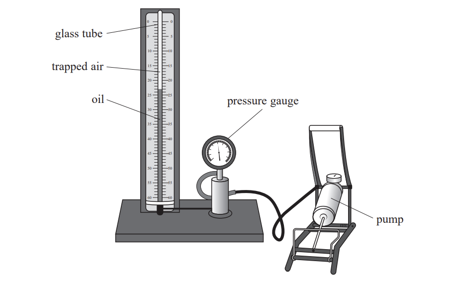

# Exam Questions — Kinetic Theory & Ideal Gases
**5. Thermodynamics, Radiation, Oscillations & Cosmology** · Edexcel International A Level (IAL) Physics (YPH11)
> Source: [https://www.savemyexams.com/international-a-level/physics/edexcel/19/topic-questions/5-thermodynamics-radiation-oscillations-and-cosmology/kinetic-theory-and-ideal-gases/structured-questions/](https://www.savemyexams.com/international-a-level/physics/edexcel/19/topic-questions/5-thermodynamics-radiation-oscillations-and-cosmology/kinetic-theory-and-ideal-gases/structured-questions/) · 7 questions · total 24 marks

## Q1 — medium — 5 marks · structured-questions

### 13((a)) — 3 marks — command: calculate — structured — from paper 2022 Jan · WPH15/01
A weather balloon takes scientific equipment high into the atmosphere to monitor atmospheric conditions.

A weather balloon is filled with hydrogen at a temperature of 22.5 °C and a pressure of 1.02 × 105 Pa. The volume of the balloon is 7.50 m3.

The balloon rises through the atmosphere to a maximum height. At the maximum height, the temperature of the hydrogen in the balloon is –48.0 °C and the pressure of the hydrogen in the balloon is 8.40 × 104 Pa.

Calculate the volume of the balloon at the maximum height.

Volume of balloon = ..............................

### 13((b)) — 2 marks — command: calculate — structured — from paper 2022 Jan · WPH15/01
Calculate the decrease in the mean kinetic energy of a hydrogen molecule in the balloon as the balloon rises to the maximum height.

Decrease in mean kinetic energy = ..............................

## Q2 — medium — 6 marks · structured-questions

### 14((a)) — 3 marks — command: show — structured — from paper Oct/Nov 2021 · WPH15/01
Natural gas produced from landfill consists of a mixture of methane and carbon dioxide gases.

At a temperature of 20.0°C and a pressure of 1.01 × 105 Pa the volume occupied by 1 mole of carbon dioxide is 0.0241 m3.

Show that the number of molecules in 1 mole of carbon dioxide is about 6.0 × 1023.

### 14((b)) — 3 marks — command: deduce — structured — from paper Oct/Nov 2021 · WPH15/01
In a sample of natural gas, the r.m.s. velocity of the carbon dioxide molecules is 60.5% of the r.m.s. velocity of the methane molecules.

`straight r. straight m. straight s. space velocity space equals space square root of open angle brackets straight c squared close angle brackets end root`

$\mathrm{Deduce} \mathrm{the} \mathrm{ratio}\frac{\mathrm{mass} \mathrm{of} \mathrm{carbon} \mathrm{dioxide} \mathrm{molecule}}{\mathrm{mass} \mathrm{of} \mathrm{methane} \mathrm{molecule}}$.

$\frac{\mathrm{mass} \mathrm{of} \mathrm{carbon} \mathrm{dioxide} \mathrm{molecule}}{\mathrm{mass} \mathrm{of} \mathrm{methane} \mathrm{molecule}}=$**...............................**

## Q3 — medium — 6 marks · structured-questions

### 11((a)) — 4 marks — command: explain — structured — from paper June 2021 · WPH15/01
The school apparatus shown is used to demonstrate a gas law.

Air is trapped in a glass tube of uniform cross-sectional area. A pump forces oil into the base of the glass tube. This forces the air into a smaller volume. The pressure of the trapped air is displayed on the pressure gauge.

The pressure of the trapped air increases when the air is forced into a smaller volume.

Explain why, using ideas of molecular motion.

### 11((b)) — 2 marks — command: calculate — structured — from paper June 2021 · WPH15/01
The apparatus is used in a laboratory where the temperature is 293 K.

When the air occupies a volume of 2.43 × 10−3 m3 the reading on the pressure gauge is 1.05 × 105 Pa.

Calculate the number of molecules of air trapped in the glass tube.

Number of molecules of air = ......................................

## Q4 — medium — 1 marks · multiple-choice-questions

### 5() — 1 mark — multiple_choice — from paper 2022 Jan · WPH15/01
A fixed mass of an ideal gas has a volume *V* and exerts a pressure *p*. The absolute temperature of the gas is *T*. When the gas is heated, the new pressure is 4*p*.

Which row of the table gives correct values of the new volume and the new temperature?

|   | **Volume** | **Temperature** |
|---|---|---|
| **A** | $\frac{V}{2}$ | $2T$ |
| **B** | $\frac{V}{2}$ | $4T$ |
| **C** | $2V$ | $2T$ |
| **D** | $2V$ | $4T$ |
- **A.** 
- **B.** 
- **C.** 
- **D.** 

## Q5 — medium — 1 marks · multiple-choice-questions

### 7() — 1 mark — multiple_choice — from paper June 2021 · WPH15/01
Helium gas in a closed cylinder is heated until the pressure exerted by the helium is four times the original pressure. The volume occupied by the helium stays constant.

The mean square speed of the helium molecules before heating is `open angle brackets v subscript 1 superscript 2 close angle brackets`. The mean square speed of the helium molecules after heating is `open angle brackets v subscript straight F superscript 2 close angle brackets`.

What is the ratio `fraction numerator open angle brackets v subscript straight F superscript 2 close angle brackets over denominator open angle brackets v subscript 1 superscript 2 close angle brackets end fraction`?
- **A.** 1
- **B.** 2
- **C.** 4
- **D.** 8

## Q6 — easy — 1 marks · multiple-choice-questions

### 1() — 1 mark — multiple_choice
Which of the following graphs shows how the internal energy $U$ of an ideal gas varies with the absolute temperature $T$ of the gas?

- **A.** 
- **B.** 
- **C.** 
- **D.** 

## Q7 — hard — 4 marks · multiple-choice-questions

### 1() — 4 marks — command: deduce — structured
The solar corona is the outermost layer of the Sun's atmosphere. It consists of a highly ionised gas called a plasma, and is composed mostly of protons and electrons.

In a particular region of the corona, the temperature is $2.0\times10^{6}\text{K}$ and the number density of particles is about $1.1\times10^{15}\text{m}^{-3}$.

A plasma can be considered to behave as an ideal gas when the mean thermal kinetic energy of the particles is much greater than the average electric potential energy between them.

Deduce whether the plasma in the solar corona behaves as an ideal gas.
