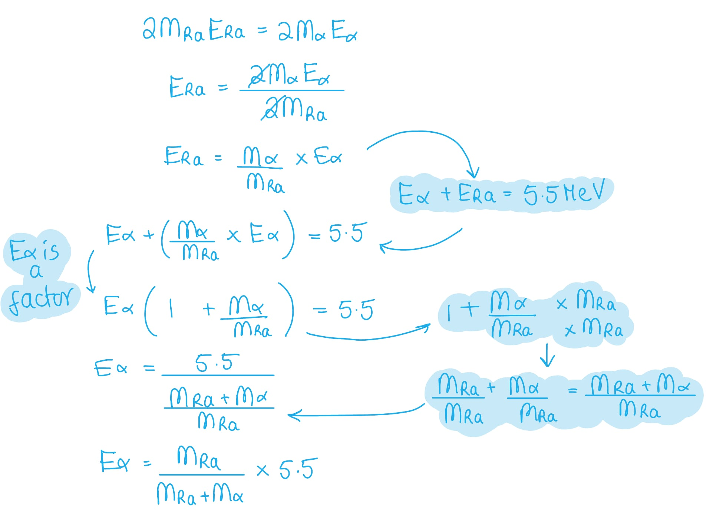
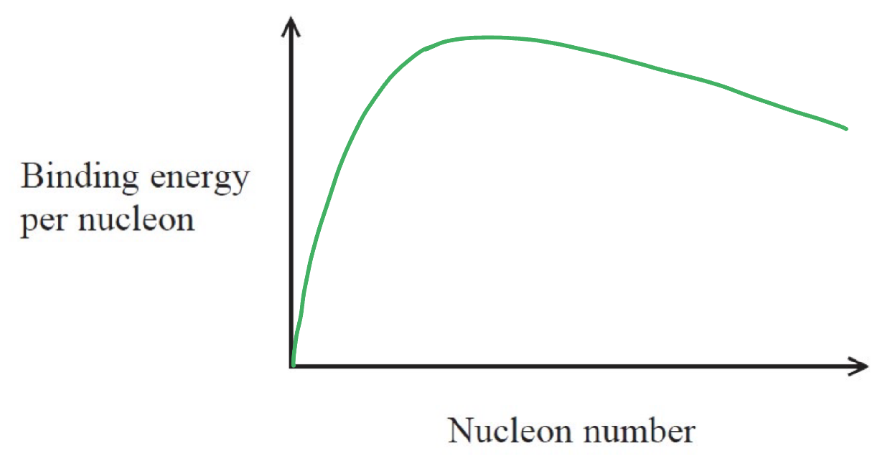
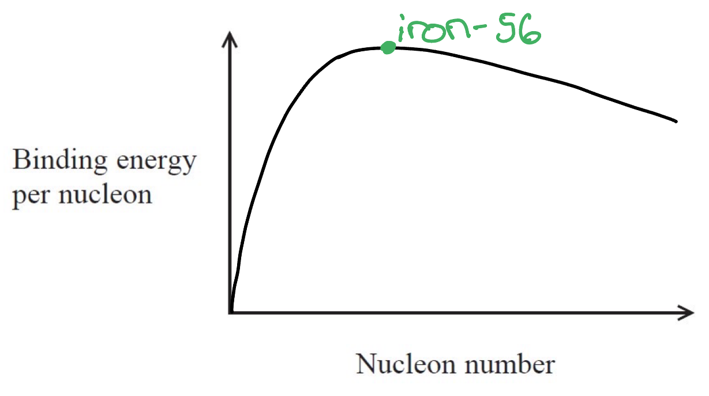

# Mark Schemes — Nuclear Fusion & Fission
**5. Thermodynamics, Radiation, Oscillations & Cosmology** · Edexcel International A Level (IAL) Physics (YPH11)

## Q1 — medium — 14 marks · structured-questions

### 17((a)) — 2 marks
The muon's classification:

- It is a lepton; **[1 mark]**
- It is a fundamental particle **or** second generation; **[1 mark]**

**[Total: 2 marks]**

### 17((b)) — 2 marks
The other particles are:

- Negative pion; **[1 mark]**
- Muon anti-neutrino; **[1 mark]**

**[Total: 2 marks]**

### 17((c)) — 3 marks
To deduce whether the statement is correct, calculate the values:

Calculate rest mass of the muon:

- Rest mass, `m space equals space fraction numerator E cross times e over denominator c squared end fraction equals space fraction numerator open parentheses 106 cross times 10 to the power of 6 close parentheses cross times open parentheses 1.6 cross times 10 to the power of negative 19 end exponent close parentheses over denominator open parentheses 3.0 cross times 10 to the power of 8 close parentheses squared end fraction equals 1.88 cross times 10 to the power of negative 28 end exponent space kg` **[1 mark]**

Compare masses:

- $\frac{m_{m}}{m_{e}}=\frac{1.88\times10^{-28}}{9.11\times10^{-31}}=207$ **[1 mark]**

Draw a conclusion:

- (Mass is approximately 200 times so) statement is correct; **[1 mark]**

**[Total: 3 marks]**

- *The conversion comes from the mass-energy equivalence equation *$m=\frac{E}{c^{2}}$*, with the energy being converted to joules with the factor of **e*

### 17((d)) — 7 marks
i) Explain why the unit GeV / c is a valid unit for momentum.

State relevant units:

- $GeV$ are units of energy **or **$\frac{GeV}{c^{2}}$ are units of mass;** [1 mark]**

Substitute into equations for momentum:

- Momentum, $p=mv=\frac{GeV}{c^{2}}\timesc=\frac{GeV}{c}$  **or****  **$p=\frac{E}{v}=\frac{GeV}{c}$;** [1 mark]**

ii) To deduce whether the ring has a circumference of 44.7 m and, using a magnetic field of flux density 1.45 T, it could confine muons with a momentum of 3.10 GeV / c:

Convert 3.10 GeV / c to SI units:

- `fraction numerator open parentheses space 3.10 space cross times 10 to the power of 9 close parentheses cross times open parentheses 1.6 space cross times 10 to the power of blank to the power of minus 19 end exponent close parentheses over denominator 3.0 cross times 10 to the power of 8 end fraction equals 1.65 cross times 10 to the power of negative 18 end exponent space Ns`

Calculate radius:

- $r=\frac{\mathrm{circumference}}{2π}=\frac{44.7}{2π}=7.11m$ **[1 mark]**

Use the equation relating radius and a magnetic field to show whether the values are consistent:

- `r space equals space fraction numerator p over denominator B Q end fraction equals space fraction numerator 1.65 cross times 10 to the power of negative 18 end exponent over denominator 1.45 cross times open parentheses 1.6 cross times 10 to the power of negative 19 end exponent close parentheses end fraction equals 7.11 space straight m` **[1 mark]**
- Therefore the values are consistent and the claim is correct; **[1 mark]**

iii) Muons in the ring are observed to have a much greater mean lifetime than unstable, stationary muons because:

- Muons are travelling close to speed of light; **[1 mark]**
- There are relativistic effects on the particle lifetime; **[1 mark]**

**[Total: 7 marks]**

## Q2 — medium — 8 marks · structured-questions

### 13((a)) — 4 marks
Show that the energy released in the decay is about 5.5 MeV

Calculate the difference in mass, Δ*m*:

- `increment m space equals space m subscript T h end subscript space minus space open parentheses m subscript R a end subscript space minus space m subscript alpha close parentheses space equals space space 228.02873 space minus space open parentheses 224.02021 space plus space 4.00260 close parentheses space equals space 5.92 space cross times space 10 to the power of negative 3 end exponent space straight u` **[1 mark]**

Convert the mass from u to kg:

- 1 u = 1.66 × 10–27 kg
- `open parentheses 5.92 space cross times space 10 to the power of negative 3 end exponent space close parentheses space cross times space open parentheses 1.66 space cross times space 10 to the power of negative 27 end exponent close parentheses space equals space 9.83 space cross times space 10 to the power of negative 30 end exponent space kg` **[1 mark]**

Calculate the energy released:

- $\DeltaE=c^{2}\Deltam$
- `increment E space equals space open parentheses 3.00 space cross times space 10 to the power of 8 close parentheses squared space cross times space open parentheses 9.83 space cross times space 10 to the power of negative 30 end exponent close parentheses space equals space 8.85 space cross times space 10 to the power of negative 13 end exponent space straight J` **[1 mark]**

Convert the energy from J to MeV:

- 1 MeV = (1.60  × 10–19)  × 106
- `increment E space equals space fraction numerator 8.85 space cross times space 10 to the power of negative 13 end exponent space over denominator open parentheses 1.60 space cross times space 10 to the power of negative 13 end exponent close parentheses end fraction space equals space 5.53 space MeV space`**[1 mark]**

**[Total: 4 marks]**

- *You must be confident with the following unit conversions in this topic:*

  - *u to kg (and vice versa)*
  - *eV to J (and vice versa)*
- *The value of the atomic mass unit, u is given on your data sheet - you do need to memorise this value, but it may speed you up during revision*

### 13((b)) — 4 marks
Comment on this statement

List the known quantities:

- The energy released in the decay = 5.5 MeV (from part (a))

Consider momentum conservation:

- The total momentum before the decay = the total momentum after the decay **OR **$p_{Th}=p_{Ra}+p_{α}$ **OR **$p_{Ra}=-p_{α}$** ****[1 mark]**

Rearrange the kinetic energy equation for momentum, *p*:

- $E_{k}=\frac{p^{2}}{2m}\Rightarrowp=\sqrt{2mE_{k}}$ **[1 mark]**

Consider the momentum before and after:

- $\sqrt{2m_{Ra}E_{Ra}}=\sqrt{2m_{α}E_{α}}$ **[1 mark]**
- $2m_{Ra}E_{Ra}=2m_{α}E_{α}$

Rearrange the equation for the energy of the alpha particle, *E*α:

- $E_{α}=\frac{m_{Ra}}{m_{Ra}+m_{α}}\timesE_{Ra}$

Substitute in the values to calculate the kinetic energy gained by the alpha particle, *E**α**:*

- $E_{α}=\frac{224}{224+4}\times5.53=5.43\mathrm{MeV}$ **[1 mark]**

**[Total: 4 marks]**

- *The equation *$E_{k}=\frac{p^{2}}{2m}$* is the kinetic energy of a non-relativistic particle, this equation is given on your data sheet but can be derived from *$p=mv$* **and *$E_{k}=\frac{1}{2}mv^{2}$
- *There are many ways to rearrange the equation for **E**α** and there is no right way to get there*

  - *The rearranging of the equation used in this mark scheme is shown below*
  - *You must have very strong algebra skills in A level physics - revisit the maths revision notes to practice this if you're unsure*
- *The energy released in the decay is **E**α** + **E**Ra** (the products of the decay)*

## Q3 — medium — 6 marks · structured-questions

### 15() — 6 marks
Explain the conditions required to bring about and maintain nuclear fusion in stars.

The following list is the 'indicative marking points'. Stating all six will score four marks, less than six is marked according to a scale given below. The remaining two marks are given for the linking and explanation.

Indicative content (IC):

- There is a very high temperature (in the core)
- (So) nuclei/protons have a high kinetic energy
- (Sufficient) to overcome electrostatic repulsion
- And allow nuclei/protons to get close enough to fuse
- Gravitational forces produce a very high density (in the core)
- (So) the collision rate is high enough to sustain fusion

**An answer that would score 6 marks:**

The core of a star is at an extremely high temperature. The protons, therefore, gain high kinetic energy as they move around quicker. This is enough for them to overcome the electrostatic repulsion between other protons, as they all have the same positive charge. This allows the nuclei to get close enough to fuse. The gravitational forces pulling towards the core produce a very high density of these protons. This means the proton collision rate is high enough to sustain fusion to create heavier elements.

**[Total: 6 marks]**

- *The starred written questions assess your ability to link facts in a logically structured answer where you also explain your reasoning through linking*
- *In the table below, ‘indicative marking points’ means the factual statements from the list above. The second column shows the maximum marks you can earn from these statements. As you see six correct statements are worth a total of 4 marks*
- *The third column is for ‘linkage marks’. This means how well you linked the statements using a reasoned, or logical, argument. The maximum linkage mark depends on the number of statements*
- *To score 6/6 will need a full paragraph, using the same kind of P-E-E (point, evidence, explain) that you use in English comprehension, as well as using your Physics to link together at least six points from the content you have learned. This is something which will definitely need practice*

| > *Number of indicative points seen in the answer* | > *Number of marks awarded for the indicative marking points* | > *Maximum linkage mark* | > *Maximum final mark* |
|---|---|---|---|
| > *6* | > *4* | > *2* | > *6* |
| > *5* | > *3* | > *2* | > *5* |
| > *4* | > *3* | > *1* | > *4* |
| > *3* | > *2* | > *1* | > *3* |
| > *2* | > *2* | > *0* | > *2* |
| > *1* | > *1* | > *0* | > *1* |
| > *0* | > *0* | > *0* | > *0* |

## Q4 — medium — 14 marks · structured-questions

### 18((a)) — 1 marks
Nuclear fusion is:

- When a massive / large nucleus is split into smaller fragments / pieces; **[1 mark]**

**[Total: 1 mark]**

### 18((b)) — 3 marks
i) A graph that would score 2 marks for the binding energy per nucleon should look like this:

- The curve rises steeply from near to the origin; **[1 mark]**
- After the peak, the curve slowly decreases; **[1 mark]**

ii) A graph that would score 1 mark showing iron-56 should look like this:

- Iron-56 is marked at the peak of the curve; **[1 mark]**

**[Total: 3 marks]**

### 18((c)) — 2 marks
To complete the nuclear equation:

Consider the nucleon and proton numbers of $n$:

- $n$ is a neutron
- Hence, the nuclide notation looks like this:

  - `straight n presubscript 0 presuperscript 1`

Consider the nucleon numbers for the equation:

- 236 = A + 141 + (2 × 1)
- A = 93

Consider the proton numbers for the equation:

- 92 = 38 + Z + 0
- Z = 54

Complete the nuclear equation:

- `straight U presubscript 92 presuperscript 236 space rightwards arrow space Sr presubscript 38 presuperscript bold 93 space plus space Xe presubscript bold 54 presuperscript 141 space plus space 2 space cross times space straight n presubscript bold 0 presuperscript bold 1`

- Nucleon numbers correct; **[1 mark]**
- Proton numbers correct; **[1 mark]**

**[Total: 2 marks]**

### 18((d)) — 2 marks
Calculate, in MeV, the binding energy per nucleon for a nucleus of `straight U presubscript 92 presuperscript 236`:

From the data booklet:

- Mass-energy: $\DeltaE=c^{2}\Deltam$
- Unified atomic mass unit, $u$* *= 1.66 × 10−27 kg

Use the information in the table to calculate the mass defect, $\Deltam$:

- Number of neutrons in U-236 nucleus = 236 − 92 = 144
- `increment m space equals open parentheses m a s s space o f space U minus 236 space n e u t r o n s space plus space m a s s space o f space U minus 236 space p r o t o n s close parentheses space minus space m a s s space o f space U minus 236 space n u c l e u s`
- `increment m space equals space open parentheses 144 space cross times space 0.93956 space u close parentheses space plus space open parentheses 92 space cross times space 0.93827 space u close parentheses space minus space 219.8750 space u space equals space 1.742 space u` **[1 mark]**

Calculate the binding energy per nucleon:

- $1.742u=1.742\frac{GeV}{c^{2}}$
- $\frac{1.742}{236}=7.38\times10^{-3}\mathrm{GeV}=7.38\mathrm{MeV}$ **[1 mark]**

**[Total: 2 marks]**

- *Use the revision notes to review **equivalent units*
- *This will save you some time with this question*

> $1\frac{GeV}{c^{2}}$* = 1.67 × 10**–27** kg*

### 18((e)) — 6 marks
UV is produced by alpha particles in the air, where UV has advantages compared with detecting alpha particles directly:

The following list is the 'indicative marking points'. Stating all six will score **four marks**, less than six is marked according to the scale given below (in blue). The remaining **two marks** are given for the linking and explanation:

Indicative content (IC)

1. Energy from the α particles is transferred to atoms / molecules in the air
2. An electron in the atom / molecule is promoted to a higher energy state / is excited
3. When the electrons return to a lower energy state / de-excites, a photon of UV radiation is emitted
4. α radiation is strongly ionising and has a short range in air
5. Ultraviolet radiation is weakly ionising and has a long range in air
6. UV-radiation can be detected much further from the source, so is safer

**An example of an answer which would score 6 marks is:**

Energy from the α particles in the air is transferred to the atoms in the air **[1]**. An electron in each atom is excited to a higher energy state **[2]**. When the electron returns from the higher energy state to the lower energy state it releases energy in the form of a photon of UV radiation **[3]****. **The advantage of detecting UV radiation compared to α-particles directly **[linkage]** is that α radiation has a short range in air because is strongly ionising **[4]**** **hence, not many α-particles would be detected **[linkage]. **Ultraviolet radiation is weakly ionising and has a long** **range in air **[5]**. Hence, UV radiation can be detected much further from the source **[6]**.

- Six indicative marking points; **[4 marks]**
- Linkage made between evolutionary stages and physical processes; **[2 marks]**

**[Total: 6 marks]**

- *The starred written questions assess your ability to **link** **facts** in a logically **structured** answer.*
- *In the table below, **indicative content (IC) points** are from the list above. The second column shows the **maximum marks** you can earn from these **statements**.*

  - *As you see, **6** correct **statements** are worth a total of **4 marks*

- *The third column is for ‘**linkage marks**’. This means how well you linked the statements in your argument. The maximum linkage mark depends on the number of statements. *

  - *Even if you linked well, only **one** linkage mark is available if you only mentioned **4 out of 6** IC points*

- *To score 6/6 marks, you will need a **full** **paragraph**, using a "point, evidence, explain" structure, **as well as** using your Physics to link together at least six points from the content you have learned. *

| > *IC points* | > *IC mark* | > *Maximum linkage marks available* | > *Maximum final mark* |
|---|---|---|---|
| > *6* | > *4* | > *2* | > *6* |
| > *5* | > *3* | > *2* | > *5* |
| > *4* | > *3* | > *1* | > *4* |
| > *3* | > *2* | > *1* | > *3* |
| > *2* | > *2* | > *0* | > *2* |
| > *1* | > *1* | > *0* | > *1* |
| > *0* | > *0* | > *0* | > *0* |

## Q5 — hard — 14 marks · structured-questions

### 20((a)) — 2 marks
The correct nuclear equation for this decay is:

`Ac presubscript 89 presuperscript 225 space space rightwards arrow space Fr presubscript bold 87 presuperscript bold 221 space plus space straight alpha presubscript bold 2 presuperscript bold 4`

- Correct proton numbers; **[1 mark]**
- Correct neutron numbers; **[1 mark]**

*Example of calculation:*

- α-particle = Helium nucleus

  - `straight alpha presubscript 2 presuperscript 4 space equals space He presubscript 2 presuperscript 4`
- Equate the nucleon numbers on both sides of the equation:

  - 225 = A + 4
  - A = 225 − 4 = 221
- Equate the proton numbers on both sides of the equation:

  - 89 = Z + 2
  - 89 − 2 = Z = 87

**[Total: 2 marks]**

### 20((b)) — 4 marks
Show that the energy released if the mass decreases by 1 u is about 930 MeV:

List the known quantities:

- Unified atomic mass unit, $u$ = 1.66 × 10−27 kg
- Speed of light in a vacuum, $c$ = 3.00 × 108 m s−1
- Electronvolt, 1 eV = 1.60 × 10−19 J

Calculate the energy released when the mass decreases by 1 $u$:

- Mass-energy equivalence:  $\DeltaE=c^{2}\Deltam=c^{2}\timesu$
- `increment E space equals space open parentheses 3 cross times 10 to the power of 8 close parentheses squared space cross times space open parentheses 1.66 cross times 10 to the power of negative 27 end exponent close parentheses` **[1 mark]**
- $\DeltaE=1.494\times10^{-10}J$ **[1 mark]**

Convert the energy in J to MeV:

- $\DeltaE=\frac{1.494\times10^{-10}}{1.6\times10^{-19}}=9.34\times10^{8}\mathrm{eV}$ **[1 mark]**
- $\DeltaE=934\mathrm{MeV}$ **[1 mark]**

**[Total: 4 marks]**

- *In a "show that" question, don't forget to write your final answer to **more significant figures** than the value you must "show"*

### 20((c)) — 4 marks
The kinetic energy given to the alpha particle is just less than 5.9 MeV because:

- The energy released during a mass decrease of 1 $u$ is 934 MeV; **[1 mark]**
- The mass of the francium nucleus is much greater than the mass of the alpha particle; **[1 mark]**
- Momentum is conserved, so the recoil velocity of the francium nucleus is much less than the velocity of the alpha particle; **[1 mark]**
- So, the kinetic energy of the alpha particle is much greater than the francium nucleus / after the decay the alpha particle has most of the kinetic energy; **[1 mark]**

**[Total: 4 marks]**

- *Recognising that you have already calculated the equivalent energy in MeV will save you some time here*
- *You will also be awarded marks if you use kinetic energy to **calculate momentum conservation** and show an** example** of the **calculation*

### 20((d)) — 4 marks
Calculate the number of actinium atoms in the sample 7.0 days later:

List the known quantities:

- Activity of actinium-225, $A$ = 7.4 × 107 Bq
- Half-life of actinium-225, $t_{\frac{1}{2}}$= 9.9 days = 9.9 × 24 × 3600 = 855 360 s
- Duration of decay, $t$ = 7.0 days = 7 × 24 × 3600 = 604 800 s

Calculate the decay constant, $λ$:

- Decay constant:  $λ=\frac{\mathrm{ln}2}{t_{\frac{1}{2}}}$
- $λ=\frac{\mathrm{ln}2}{855360}=8.1\times10^{-7}s^{-1}$ **[1 mark]**

Calculate the number of atoms in the sample when it is prepared, $N_{0}$:

- Activity:  $A=λN$
- `N subscript 0 space equals space A over lambda space equals space fraction numerator open parentheses 7.4 space cross times space 10 to the power of 7 close parentheses over denominator open parentheses 8.1 space cross times space 10 to the power of negative 7 end exponent close parentheses end fraction space equals space 9.14 space cross times space 10 to the power of 13 space`**[1 mark]**

Calculate the number of atoms in the sample after 7 days, $N$:

- Exponential decay:  $N=N_{0}e^{-λt}$
- `N space equals space open parentheses 9.14 space cross times space 10 to the power of 13 close parentheses space cross times space e to the power of negative open parentheses 8.1 cross times 10 to the power of negative 7 end exponent close parentheses cross times 604 space 800 end exponent space`**[1 mark]**
- $N=5.60\times10^{13}$ **[1 mark]**

**[Total: 4 marks]**

- *Another method is to use the **exponential decay equation** to calculate the activity after 7 days and then calculate a value for the number of unstable nuclei.*
- *It is easier to convert the **time** into **seconds** because Bq = s**−1*

## Q6 — easy — 1 marks · multiple-choice-questions

### 4() — 1 marks
**Correct answer: D** — The temperature is greatest in the core.

**Final answer:** **The correct answer is ****D**** because:**

- Fusion primarily requires a high temperature so nuclei are moving fast enough to overcome repulsion
- This temperature is highest in the centre of the Sun

**A** is incorrect as Helium is not being fused in the Sun

**B** is incorrect as Fusion doesn't require a large amount of hydrogen

**C** is incorrect as Fusion doesn't require a large amount of hydrogen

## Q7 — medium — 1 marks · multiple-choice-questions

### 10() — 1 marks
**Correct answer: D** — Low mass nuclei release energy during fusion.

**Final answer:** **The correct answer is ****D ****because:**

- The horizontal axis of the graph is the nucleon number

  - The lower the nucleon number, the lower the mass of the nuclei
- The vertical axis of the graph is the binding energy per nucleon

  - To the left of the peak, the lower mass nuclei undergo fusion
  - To the right of the peak, the higher mass nuclei undergo fission
- When two smaller nuclei to the left of the peak fuse, they form a nucleus with a higher binding energy per nucleon

  - The resulting nucleus is more stable, so energy has been **released**
- This means statement **D **is correct

**A **is incorrect as `Fe presubscript blank presuperscript 56` is the **most stable** isotope, not the most unstable, so is not readily able to undergo fission

**B **is incorrect as the graph shows the **binding energy per nucleon** and not the overall binding energy released from the fission and fusion processes

**C **is incorrect as if **enough energy** was supplied then even high mass nuclei would be able to undergo fusion

## Q8 — medium — 1 marks · multiple-choice-questions

### 7() — 1 marks
**Correct answer: D** — 28.4 Me V

**Final answer:** **The correct answer is ****D**** because:**

- From the graph, the B.E (binding energy) per nucleon for He-4 is 7.05 MeV
- The number of nucleons in He−4 is:

  - 2 protons + 2 neutrons = 4 nucleons
- Therefore, the energy required to split the He−4 nucleus (total binding energy) is:

  - $7.05\times4=28.2\mathrm{MeV}$
  - The closest answer is to this is **D**

- **B** is the biggest distractor in this question
- However, read the axes labels very carefully, this is the B.E **per nucleon** so you must **multiply** the number of nucleons to get the total B.E (energy required to split a nucleus)

## Q9 — medium — 1 marks · multiple-choice-questions

### 1() — 1 marks
**Correct answer: C** — Fission releases less energy than fusion.

**Final answer:** **The correct answer is C**

- The graph shows the binding energy **per nucleon**, which means

  - It **can** be used to deduce the direction of energy change (i.e., whether a process releases or absorbs energy)
  - It **cannot** be used to determine the total energy released in a given reaction
- To determine the total energy released, we'd need to know the number of nucleons involved and the specific reaction
- Therefore, statement **C** is the only conclusion that cannot be deduced from the graph alone

**A** can be deduced because low-mass nuclei lie to the left of the iron peak; fusing them moves up the curve to a higher binding energy per nucleon, which releases energy.

**B** can be deduced because high-mass nuclei lie to the right of the iron peak; splitting them (fission) also moves up the curve toward iron, which releases energy.

**D** can be deduced because `Fe presuperscript 56` sits at the peak of the curve, so it has the greatest binding energy per nucleon, making it the most stable nuclide.
