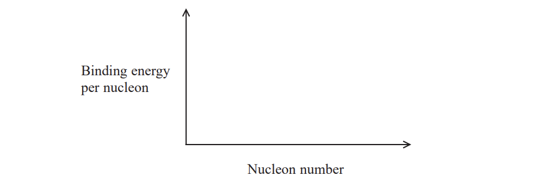
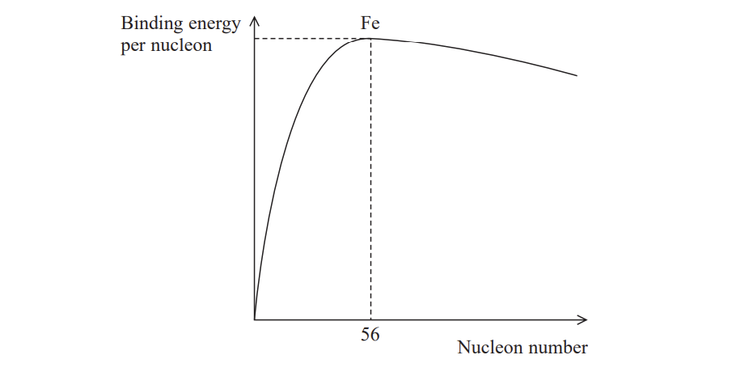
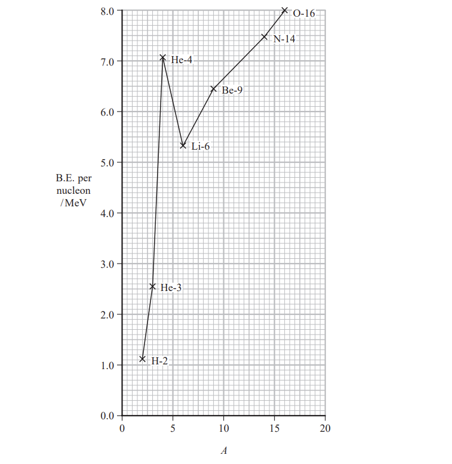

# Exam Questions — Nuclear Fusion & Fission
**5. Thermodynamics, Radiation, Oscillations & Cosmology** · Edexcel International A Level (IAL) Physics (YPH11)
> Source: [https://www.savemyexams.com/international-a-level/physics/edexcel/19/topic-questions/5-thermodynamics-radiation-oscillations-and-cosmology/nuclear-fusion-and-fission/structured-questions/](https://www.savemyexams.com/international-a-level/physics/edexcel/19/topic-questions/5-thermodynamics-radiation-oscillations-and-cosmology/nuclear-fusion-and-fission/structured-questions/) · 9 questions · total 60 marks

## Q1 — medium — 14 marks · structured-questions

### 17((a)) — 2 marks — command: state — structured — from paper 2022 Jan · WPH14/01
Experiments with muons are taking place at Fermilab in the USA to improve our understanding of the standard model.

The muon belongs to the same family of particles as the electron.

State how the muon is classified in the standard model.

### 17((b)) — 2 marks — command: state — structured — from paper 2022 Jan · WPH14/01
A muon (μ) can be produced by the decay shown in this nuclear equation.

`pi to the power of minus space rightwards arrow space mu to the power of minus space plus space top enclose nu subscript space mu end subscript`

State the names of the two other particles involved.

### 17((c)) — 3 marks — command: deduce — structured — from paper 2022 Jan · WPH14/01
A website states: “The rest mass of a muon is 106 MeV / c2, which is a little over 200 times that of an electron.”

Deduce whether this statement is correct.

### 17((d)) — 7 marks — command: multiple — structured — from paper 2022 Jan · WPH14/01
Muons are stored in a ‘storage ring’ at Fermilab. The website describes the ring as having a circumference of 44.7 m and using a magnetic field of flux density 1.45 T.

The website claims that this enables the storage ring to confine muons with a momentum of 3.10 GeV / c.

i) Explain why the unit GeV / c is a valid unit for momentum.

**(2)**

ii) Deduce whether the website’s claim is correct.

muon charge = −1.6 × 10−19 C

3.10 GeV / c = 1.65 × 10–18 N s

**(3)**

iii) Stationary muons are unstable and have a mean lifetime of a few microseconds.

Explain why muons in the ring are observed to have a much greater mean lifetime.

**(2)**

## Q2 — medium — 8 marks · structured-questions

### 13((a)) — 4 marks — command: show — structured — from paper Oct/Nov 2021 · WPH15/01
Thorium is an unstable isotope that decays into radium as shown in the nuclear equation.

`Th presubscript 90 presuperscript 228 space rightwards arrow space Ra presubscript 88 presuperscript 224 space plus space straight alpha presubscript 2 presuperscript 4`

The table below gives the masses of the nuclei.

| **Nucleus** | **Mass/u** |
|---|---|
| 228Th | 228.02873 |
| 224Ra | 224.02021 |
| 4α | 4.00260 |

Show that the energy released in the decay is about 5.5 MeV

### 13((b)) — 4 marks — command: calculate — structured — from paper Oct/Nov 2021 · WPH15/01
A textbook states that the kinetic energy gained by the alpha particle when a nucleus of thorium‐228 decays is equal to 5.4 Me V.

Comment on this statement. Your answer should include a calculation.

## Q3 — medium — 6 marks · structured-questions

### 15() — 6 marks — command: explain — structured — from paper Oct/Nov 2021 · WPH15/01
Nuclear fusion in the core of a star is the source of the star’s power output.

Explain the conditions required to bring about and maintain nuclear fusion in stars.

## Q4 — medium — 14 marks · structured-questions

### 18((a)) — 1 mark — command: state — structured — from paper June 2021 · WPH15/01
Many countries use nuclear power stations to provide electrical power. Energy is released when nuclei undergo fission in the core of the reactor.

State what is meant by nuclear fission.

### 18((b)) — 3 marks — command: multiple — structured — from paper June 2021 · WPH15/01
i) Sketch a graph to show how the binding energy per nucleon varies with nucleon number, for a wide range of isotopes.

**(2)**

ii) Mark the position of iron-56 on your graph.

**(1)**

### 18((c)) — 2 marks — command: complete — structured — from paper June 2021 · WPH15/01
Complete the nuclear equation below.

`straight U presubscript 92 presuperscript 236 space rightwards arrow space Sr presubscript 38 presuperscript midline horizontal ellipsis midline horizontal ellipsis midline horizontal ellipsis end presuperscript space plus space Xe presubscript midline horizontal ellipsis midline horizontal ellipsis midline horizontal ellipsis end presubscript presuperscript 141 space plus space 2 space cross times space straight n presubscript midline horizontal ellipsis midline horizontal ellipsis midline horizontal ellipsis end presubscript presuperscript horizontal ellipsis horizontal ellipsis horizontal ellipsis end presuperscript`

### 18((d)) — 2 marks — command: calculate — structured — from paper June 2021 · WPH15/01
Calculate, in MeV, the binding energy per nucleon for a nucleus of `straight U presubscript 92 presuperscript 236`.

|   | **Mass/GeV/c****2** |
|---|---|
| `straight U presubscript 92 presuperscript 236` | 219.8750 |
| n | 0.93956 |
| p | 0.93827 |

Binding energy per nucleon = ............................................ MeV

### 18((e)) — 6 marks — command: explain — structured — from paper June 2021 · WPH15/01
Ultraviolet radiation (UV) is produced when alpha particles interact with air.

This can be used to detect alpha particles when a nuclear reactor is decommissioned.

Explain how UV is produced by alpha particles in the air, and why detecting UV has advantages compared with detecting alpha particles directly.

## Q5 — hard — 14 marks · structured-questions

### 20((a)) — 2 marks — command: complete — structured — from paper 2022 Jan · WPH15/01
Actinium‐225 is a radioactive isotope. It decays to francium by emitting alpha particles.

Actinium‐225 has a short half-life, which makes it suitable for medical applications.

Complete the nuclear equation for this decay.

`Ac presubscript 89 presuperscript 225 space space rightwards arrow space Fr presubscript midline horizontal ellipsis presuperscript midline horizontal ellipsis space plus space straight alpha presubscript midline horizontal ellipsis presuperscript midline horizontal ellipsis`

### 20((b)) — 4 marks — command: show — structured — from paper 2022 Jan · WPH15/01
In a radioactive decay, energy is released and the total mass decreases.

Show that the energy released if the mass decreases by 1 u is about 930 MeV.

### 20((c)) — 4 marks — command: explain — structured — from paper 2022 Jan · WPH15/01
The francium nucleus and the alpha particle move away from each other after the decay.

Explain why the kinetic energy given to the alpha particle is just less than 5.9 MeV.

mass decrease for the decay = 6.35 × 10–3 u

### 20((d)) — 4 marks — command: calculate — structured — from paper 2022 Jan · WPH15/01
The activity of a sample of actinium‐225 is 7.4 × 107 Bq when it is prepared.

Calculate the number of actinium atoms in the sample 7.0 days later.

half‐life of actinium-225 = 9.9 days

Number of actinium atoms after 7.0 days = ...........................

## Q6 — easy — 1 marks · multiple-choice-questions

### 4() — 1 mark — multiple_choice — from paper June 2021 · WPH15/01
In the Sun, nuclear fusion occurs mainly in the core.

Which of the following is a reason for this?
- **A.** Helium nuclei surround the core.
- **B.** Most of the Sun’s hydrogen is in the core.
- **C.** The core contains most of the mass of the Sun.
- **D.** The temperature is greatest in the core.

## Q7 — medium — 1 marks · multiple-choice-questions

### 10() — 1 mark — multiple_choice — from paper 2022 Jan · WPH15/01
The graph shows how the binding energy per nucleon depends upon nucleon number for a range of naturally occurring nuclides.

Which of the following can be deduced from the graph?
- **A.** `Fe presubscript blank presuperscript 56` readily undergoes fission.
- **B.** Fission releases less energy than fusion.
- **C.** High mass nuclei cannot undergo fusion.
- **D.** Low mass nuclei release energy during fusion.

## Q8 — medium — 1 marks · multiple-choice-questions

### 7() — 1 mark — multiple_choice — from paper Oct/Nov 2021 · WPH15/01
The graph shows how the binding energy (B.E.) per nucleon varies with nucleon number *A* for low mass nuclei.

Which of the following is the energy required to split a He‐4 nucleus into 2 protons and 2 neutrons?
- **A.** 2.6 Me V
- **B.** 7.1 Me V
- **C.** 14.2 Me V
- **D.** 28.4 Me V

## Q9 — medium — 1 marks · multiple-choice-questions

### 1() — 1 mark — multiple_choice
The diagram shows how binding energy per nucleon $E$ varies with nucleon number $N$ for a range of nuclides.

Which of the following **cannot** be deduced from the graph?
- **A.** Low mass nuclei release energy during fusion.
- **B.** High mass nuclei release energy during fission.
- **C.** Fission releases less energy than fusion.
- **D.** `Fe presuperscript 56` is the most stable nuclide.
