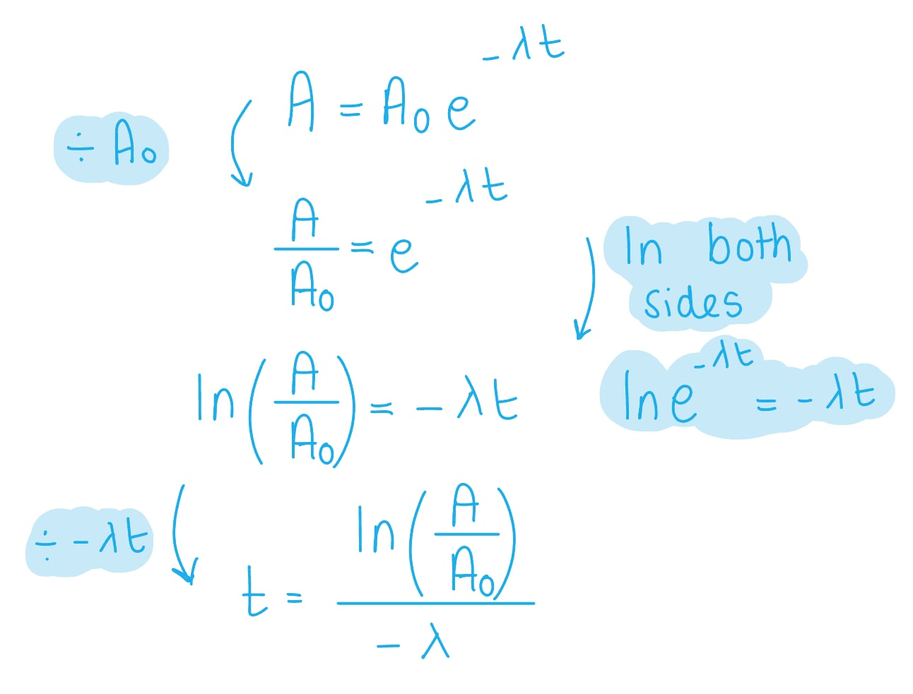
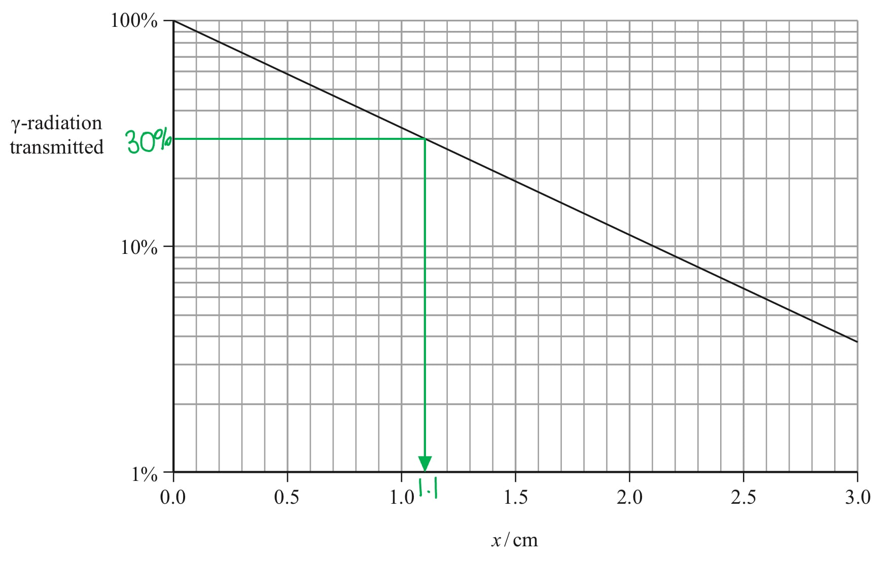
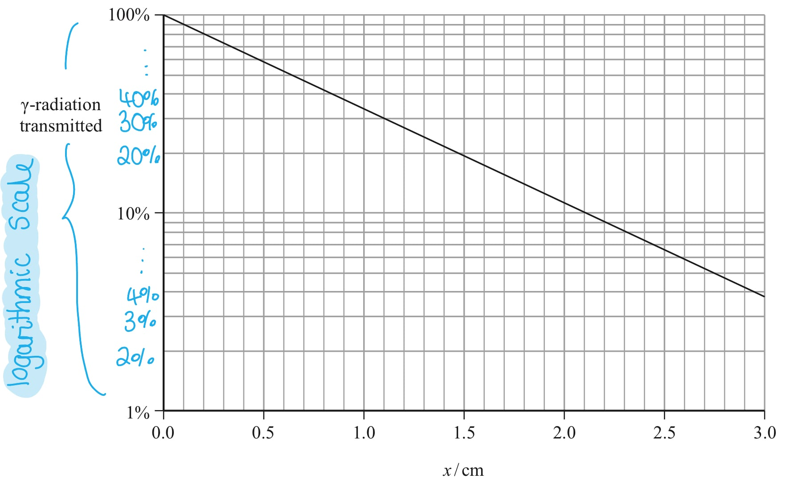
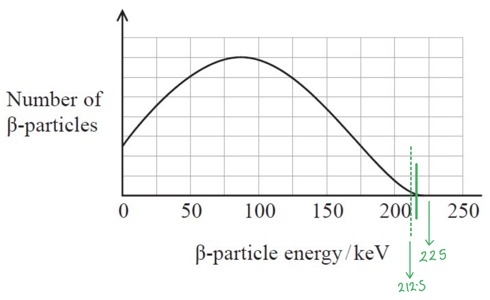
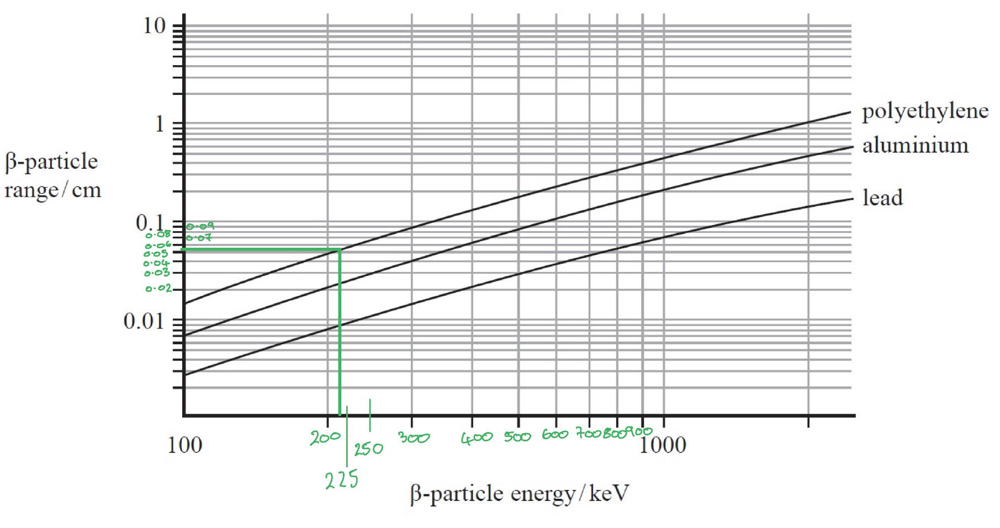
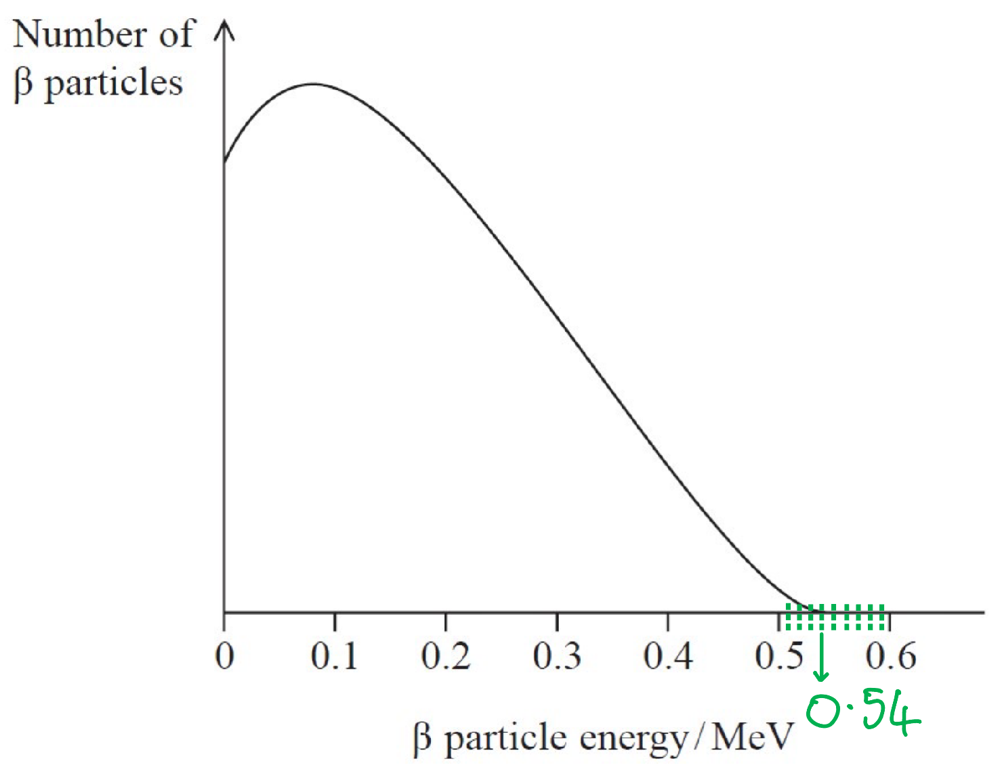
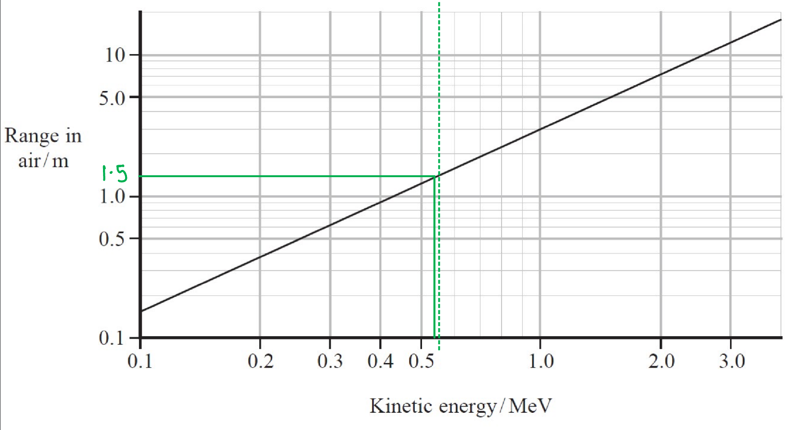
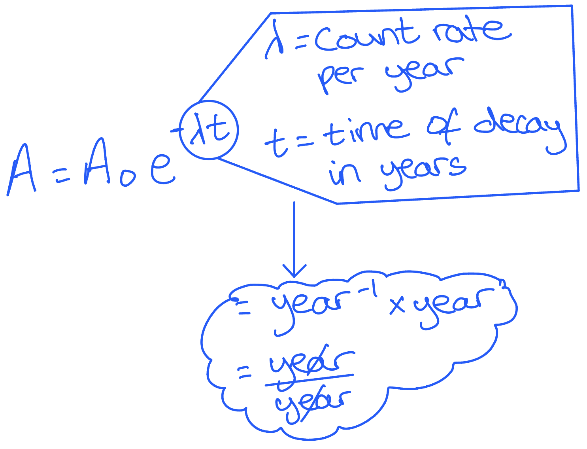
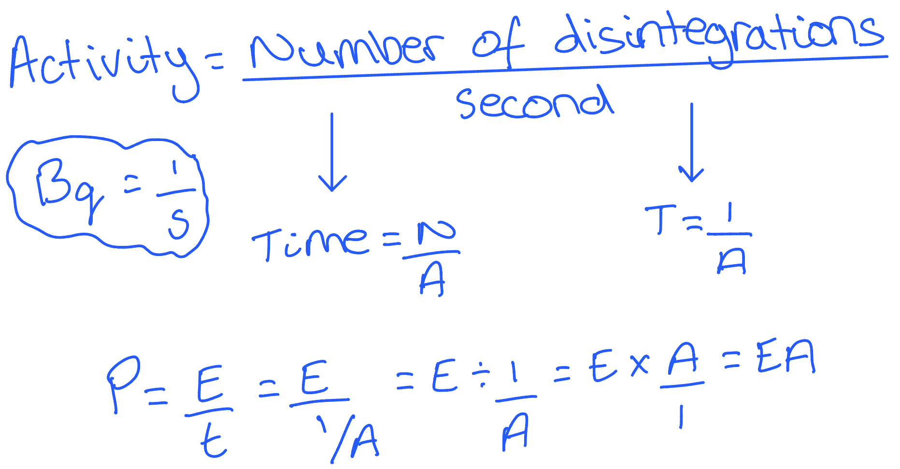
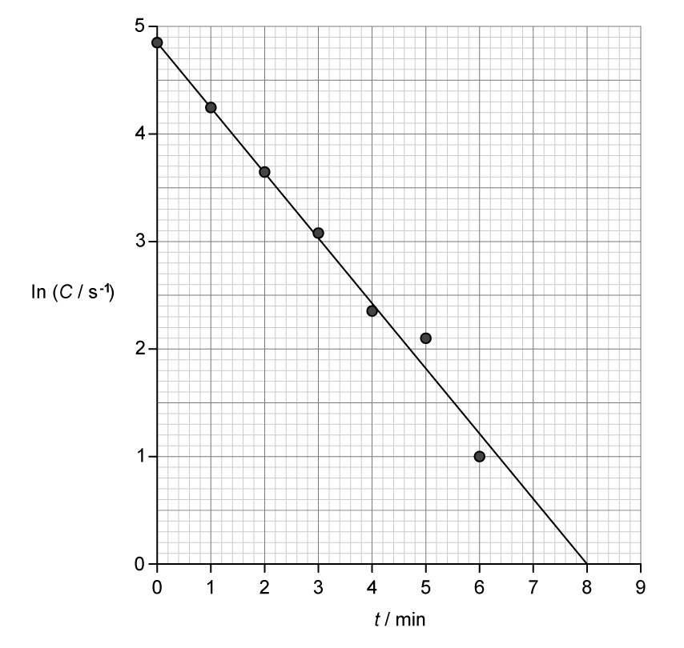

# Mark Schemes — Radioactivity Decay
**5. Thermodynamics, Radiation, Oscillations & Cosmology** · Edexcel International A Level (IAL) Physics (YPH11)

## Q1 — medium — 9 marks · structured-questions

### 19((a)) — 3 marks
i) Complete the nuclear equation for the decay of cobalt-60 to nickel

`Co presubscript 27 presuperscript 60 space rightwards arrow space Ni presubscript bold 28 presuperscript bold 60 space plus space straight beta presubscript bold minus bold 1 end presubscript presuperscript bold 0 superscript minus space plus space scriptbase straight v with bar on top end scriptbase presubscript 0 presuperscript 0 subscript straight e`

- Top line correct; **[1 mark]**
- Bottom line correct; **[1 mark]**

ii) The majority of the energy released is shared between the β− particle and the antineutrino because:

- The mass of the Ni nucleus is much larger than the total mass of the other two particles;** [1 mark]**

**[Total: 3 marks]**

### 19((b)) — 3 marks
Calculate the time in years until the source should be replaced

List the known quantities:

- Initial activity of tje cobalt-60 source, *A*0 = 4.07 × 1014 Bq
- Final activity of the cobalt-60 source, *A* = 1.85 × 1014 Bq
- Half-life of cobalt-60, *t*1/2 = 5.27 years
- 1 year in seconds = 3.16 × 107 s

Calculate the decay constant, *λ*:

- `lambda space equals fraction numerator space ln space 2 over denominator t subscript 1 half end subscript end fraction space equals space fraction numerator ln space 2 space over denominator 5.27 space cross times space open parentheses 3.16 space cross times space 10 to the power of 7 close parentheses end fraction space equals space 4.16 space cross times space 10 to the power of negative 9 end exponent space straight s to the power of negative 1 end exponent` **[1 mark]**

Use the activity decay equation to calculate the time, *t *in seconds:

- $A=A_{0}e^{-λt}$
- `t space equals negative fraction numerator space ln open parentheses A over A subscript 0 close parentheses over denominator lambda end fraction space equals space minus fraction numerator ln open parentheses fraction numerator 1.85 space cross times space 10 to the power of 14 over denominator 4.07 space cross times space 10 to the power of 14 end fraction close parentheses over denominator 4.16 space cross times space 10 to the power of negative 9 end exponent end fraction space equals 189.53 space cross times space 10 to the power of 6 space straight s` **[1 mark]**

Convert the time from seconds into years:

- $t=\frac{189.53\times10^{6}}{3.16\times10^{7}}=5.998=6\mathrm{years}$ **[1 mark]**

**[Total: 3 marks]**

- *You can either substitute the values into the activity decay equation and then rearrange for **t**, or rearrange first then substitute, either will be awarded working out marks*
- *You should be able to confidently rearrange equations with exponentials and natural logs - this comes up in the radioactivity topic and capacitors*

  - *The sketch below shows the derivation for this question*

- *You may have come across logarithms earlier in school, 'ln' (natural log) works in a similar way, except:*

  - $\mathrm{ln}=log_{e}$
  - *Therefore, *`ln open parentheses e to the power of x close parentheses space equals space log subscript e open parentheses e to the power of x close parentheses space equals space x`
- *If you're still confused with natural logs and exponentials, take a look at the maths revision notes *

### 19((c)) — 3 marks
Deduce whether lead shielding of thickness 1.0 cm would be sufficient to achieve this

List the known quantities:

- Initial count rate = 4.0 × 1014 Bq
- Final count rate = 1.2 × 1014 Bq
- Suggested thickness = 1.0 cm

Calculate the required % transmission:

- `r e q u i r e d thin space percent sign space t r a n s m i s s i o n space equals space fraction numerator 1.2 space cross times space 10 to the power of 14 space over denominator 4.0 space cross times space 10 to the power of 14 space end fraction space cross times space 100 space percent sign space equals space 30 thin space percent sign` **[1 mark]**

Calculate the thickness from the graph for this required transmission:

- Thickness required, *x* = 1.1 cm **[1 mark]**

Conclusion:

- Since a thickness of 1.0 cm is less than the required thickness 1.1 cm, the (lead) shielding will be inefficient;** [1 mark]**

**[Total: 3 marks]**

- *This scale is a **logarithmic** scale*

  - *This is a **non-linear** scale used when there's a large range (in this case from 1 % to 100 %)*
  - *They tend to go up in 10s, as logs are by default, to base 10 (log**10**)*
  - *Therefore, log**10**10 = 1, log**10**100 = 2*
- *However, don't let this put you off! You can count the values on the scale as you normally would, but looking at how many divisions there are (10)*

## Q2 — medium — 8 marks · structured-questions

### 19((a)) — 5 marks
Show that the energy released when a nucleus of Pu-238 decays into a nucleus of uranium is about 5.6 MeV:

From the data booklet:

- Mass-Energy: $\DeltaE=c^{2}\Deltam$
- Atomic mass unit, *u *= 1.66 × 10−27 kg
- Speed of light in a vacuum, $c$ = 3.00 × 108 m s−1
- Electronvolt, 1 eV = 1.60 × 10−19 J

Calculate the mass difference in kg from the data in the table:

- Mass difference = mass of plutonium nucleus − mass of uranium nucleus − mass of α particle
- Mass difference = 237.999089 *u *− 233.991578 *u *− 4.001506 *u *= 6.005 × 10−3 *u ***[1 mark]**
- Mass difference in kg = (6.005 × 10−3) × (1.66 × 10−27) = 9.9683 × 10−39 kg **[1 mark]**

Calculate the energy released, $\DeltaE$ in MeV:

- `increment E space equals space open parentheses 3 space cross times space 10 to the power of 8 close parentheses squared space cross times space open parentheses 9.9683 space cross times space 10 to the power of negative 39 end exponent close parentheses space equals space 8.9715 space cross times space 10 to the power of negative 13 end exponent space straight J` **[1 mark]**
- $\DeltaE$ in eV = `fraction numerator open parentheses 8.9715 space cross times space 10 to the power of negative 13 end exponent close parentheses over denominator open parentheses 1.60 space cross times space 10 to the power of negative 19 end exponent close parentheses end fraction space equals space 5.607 space cross times space 10 to the power of 6 space eV` **[1 mark]**
- $\DeltaE$ in MeV = $5.607\mathrm{MeV}$  **[1 mark]**

**[Total: 5 marks]**

- *The mass difference is the:*

  - *mass of the products − mass of the reactants*

### 19((c)) — 3 marks
A comment on the suggestion is as follows:

Draw lines on graph 1 to obtain the maximum kinetic energy of the β-particles:

- KE of β-particles = 215 keV;** [1 mark]**

  - Accepted range = 210 keV - 225 keV

Draw lines on graph 2 to obtain the β-particle range for polyethylene:

- Range of β-particles = 0.05 cm; **[1 mark]**

  - Accepted range = 0.05 cm - 0.08 cm

Comment on the suggestion:

- β-particles have a range of 0.05 cm in polyethylene
- So polyethylene with a thickness of 0.5 cm would be able to absorb all the β-particles; **[1 mark]**

**[Total: 3 marks]**

## Q3 — medium — 8 marks · structured-questions

### 1() — 1 marks
> **[mark-scheme]**
> Half-life is defined as:
> 
> - The average time taken for the activity (or for the number of undecayed nuclei in a sample) to fall to half its initial value **[1 mark]**

### 2() — 5 marks
(i) To calculate the age of the charcoal:

- List the known quantities:

  - Half-life of carbon-14, $t_{1/2}=5730\text{years}$
  - Activity of charcoal sample, $A=180\text{Bq kg}^{-1}$
  - Activity of living sample, $A_{0}=12.5\text{Bq}$
  - Mass of living sample = $50\text{g}=0.05\text{kg}$
- Calculate the decay constant of carbon-14:

$λ=\frac{\mathrm{ln}2}{t_{1/2}}=\frac{\mathrm{ln}2}{5730}$

$λ=1.21\times10^{-4}\text{year}^{-1}$ **[1 mark]**

- Convert the activity of the living sample to $\text{Bq kg}^{-1}$:

$A_{0}=\frac{12.5}{0.05}=250\text{Bq kg}^{-1}$ **[1 mark]**

- Rearrange the exponential decay equation for $t$ and substitute:

$A=A_{0}e^{-λt}$

`t space equals space 1 over lambda ln open parentheses A subscript 0 over A close parentheses`

`t space equals space fraction numerator 1 over denominator 1.21 cross times 10 to the power of negative 4 end exponent end fraction cross times ln open parentheses 250 over 180 close parentheses` **[1 mark]**

$t=2714.9=$ $2700\text{years}$ **[1 mark]**

> **[mark-scheme]**
> 1 mark for use of $λ=\frac{\mathrm{ln}2}{t_{1/2}}$
> 
> - Accept $1.2\times10^{-4}\text{year}^{-1}$ or $3.8\times10^{-12}\text{s}^{-1}$
> 
> 1 mark for correct use of $50\text{g}$
> 
> - e.g. convert $A_{0}$ to $\text{Bq kg}^{-1}$, or convert $A_{0}$ and $A$ to $\text{Bq g}^{-1}$
> 
> 1 mark for use of $A=A_{0}e^{-λt}$
> 
> 1 mark for a final answer of $2700$ years
> 
> - Accept answers given to 2 or 3 s.f.
> 
> Full marks can be awarded for a correct final answer with no working shown.

> **[mark-scheme]**
> (ii) An assumption made in radiocarbon dating is:
> 
> Any **one** from:
> 
> - The atmospheric ratio of `^{14}\text{C}` to `^{12}\text{C}` has remained constant over the timescale of the sample
> - No further `^{14}\text{C}` has been added to or removed from the sample after death
> - The sample was in equilibrium with the atmospheric ratio at the time of death
> 
> **[1 mark]**

> **[exam-tip]**
> The key assumptions in radiocarbon dating are physical (e.g. constant atmospheric ratio; no contamination after death), not biological mechanisms of carbon exchange.

### 3() — 2 marks
> **[mark-scheme]**
> Any **two** from (1 mark each):
> 
> - The radiation is emitted in all directions, so only a small fraction enters the GM-tube window
> - Some beta particles are absorbed within the sample itself (self-absorption) before they can escape
> - The GM tube does not register every particle that enters it (efficiency / dead time)
> 
> **[2 marks]**
> 
> Do not accept background radiation (this would *increase* the recorded count, not lower it).

> **[exam-tip]**
> Activity is the *total* number of decays per second in *all* directions; a detector only intercepts the small solid angle subtended by its window and is never 100% efficient. This is why a measured count rate must be corrected (or treated as a lower bound) before it can be used as the true activity.

## Q4 — hard — 5 marks · structured-questions

### 14() — 5 marks
Assess whether this estimate is consistent with the range of these β particles in air:

List the known quantities:

- Number of Nitrogen molecules ionised per cm = 250
- Energy needed to ionise 1 molecule = 15.6 eV

Draw lines on the first graph to obtain the maximum KE of one β-particle:

- Maximum KE = 0.54 Mev; **[1 mark]**

  - Acceptable range = 0.52 - 0.55 MeV

Calculate the number of nitrogen molecules ionised:

- Number of nitrogen molecules ionised = $\frac{MaxKE}{Energyneededtoionise1molecule}$
- $N=\frac{0.54\times10^{6}}{15.6}$
- $N=34615$ **[1 mark]**

Draw lines on the second graph to determine the range of the β particles:

- The range of the β particles is 1.5 m = 150 cm; **[1 mark]**

Calculate the range of the β particles using the information given:

- Range of β particles ionised = $\frac{Numberofnitrogenparticlesionised}{numberofnitrogenparticlesionisedpercm}=\frac{N}{250}$
- Range of β particles ionised = $\frac{34615}{250}$
- Range of β particles ionised = 138.46 cm **[1 mark]**

Compare the range of the β particles:

- The estimate is not consistent with the range of the β particles in air
- The actual value is higher than the one given; **[1 mark]**

**[Total: 5 marks]**

- *Draw 9 lines** between 0.5 and 0.6 eV on the graph to try to determine as accurately as possible the maximum KE*
- *If you are given two graphs in a question, it is likely you will need to **use both graphs** to obtain the necessary information*
- *The accepted answers for the estimate is between 1.2 and 1.4 m *

## Q5 — hard — 5 marks · structured-questions

### 19((b)) — 5 marks
Calculate the power of the source, in W, when it was fitted 40 years ago:

List the known quantities:

- Activity of Pu-238, $A$ = 6.75 × 1010 Bq
- Half-life of Pu-238, $t_{1/2}$= 87.7 years
- Duration of decay, $t$ = 40 years
- Energy of α-particle, $\DeltaE$ = 5.6 MeV

From the data booklet:

- `lambda space equals space fraction numerator ln space open parentheses 2 close parentheses over denominator t subscript 1 divided by 2 end subscript end fraction`
- $A=λN$
- $A=A_{0}e^{-λt}$
- $P=\frac{E}{t}$
- Electronvolt, 1 eV = 1.60 × 10−19 J

Calculate the decay constant, $λ$:

- `lambda space equals space fraction numerator ln open parentheses 2 close parentheses over denominator 87.7 end fraction space equals space 7.90 space cross times space 10 to the power of negative 3 end exponent space year to the power of negative 1 end exponent` **[1 mark]**

Calculate the initial activity of Pu-238, $A_{0}$:

- `open parentheses 6.75 space cross times space 10 to the power of 10 close parentheses space equals space A subscript 0 e to the power of negative open parentheses 7.9 space cross times space 10 to the power of negative 3 end exponent close parentheses space cross times space open parentheses 40 close parentheses end exponent`
- `fraction numerator open parentheses 6.75 space cross times space 10 to the power of 10 close parentheses over denominator e to the power of negative open parentheses 7.9 space cross times space 10 to the power of negative 3 end exponent close parentheses space cross times space open parentheses 40 close parentheses end exponent end fraction space equals space A subscript 0`
- $A_{0}=9.26\times10^{10}\mathrm{Bq}$ **[1 mark]**

Calculate the energy of the α-particle in J, $E$:

- $E=5.6\mathrm{MeV}=5.6\times10^{6}\mathrm{eV}$
- `E space equals space open parentheses 5.6 space cross times space 10 to the power of 6 close parentheses space cross times space open parentheses 1.6 space cross times space 10 to the power of negative 19 end exponent close parentheses space equals space 8.96 space cross times space 10 to the power of negative 13 end exponent space straight J` **[1 mark]**

Calculate the power generated by the source, $P$:

- $P=\frac{E}{t}=EA$
- `P space equals space open parentheses 8.96 space cross times space 10 to the power of negative 13 end exponent close parentheses space cross times space open parentheses 9.26 space cross times space 10 to the power of 10 close parentheses` **[1 mark]**
- $P=0.0830W$** [1 mark]**

**[Total: 5 marks]**

- *You can convert the decay time and half-life into seconds but there is no need as the **units cancel out** anyway*

- *Noticing *$P=\frac{E}{t}=EA$* is hard, it works like this:*

## Q6 — hard — 11 marks · structured-questions

### 1() — 2 marks
Complete the nuclear equation:

`straight U presubscript 92 presuperscript 238 space rightwards arrow with blank on top space space straight U presubscript 92 presuperscript 234 space plus space 1 cross times straight alpha presubscript 2 presuperscript 4 space plus space 2 cross times straight beta presubscript negative 1 end presubscript presuperscript 0`

**[2 marks]**

> **[mark-scheme]**
> 1 mark for the correct A and Z values for $α$ **AND** number of $α$ particles emitted = 1
> 
> 1 mark for the correct A and Z values for $β$ **AND **number of $β$ particles emitted = 2

> **[exam-tip]**
> You may find it easier to work out the decay chain by writing it out in the following way:
> 
> `straight U presubscript 92 presuperscript 238 space rightwards arrow with straight alpha on top space Th presubscript 90 presuperscript 234 space rightwards arrow with beta on top space Pa presubscript 91 presuperscript 234 space rightwards arrow with beta on top space straight U presubscript 92 presuperscript 234`

### 2() — 2 marks
> **[mark-scheme]**
> To determine the corrected count rate:
> 
> Any **pair** from (1 mark per point):
> 
> - (Without the source present) record the background count for a specified time, then divide by the time to obtain a background count rate
> - Subtract this background count rate from the measured count rate of the source
> 
> **OR**
> 
> - Repeat the experiment without the protactinium **OR** without shaking the bottle
> - Subtract the result from the measured count rate with protactinium present **OR** when the bottle was shaken
> 
> **[2 marks]**

### 3() — 4 marks
To determine the half-life of the protactinium:

- Draw a line of best fit on the graph:

**[1 mark]**

- Read two points from the line of best fit and calculate the gradient:

$\text{gradient}=\frac{\Delta(\mathrm{ln}C)}{\Deltat}$

$\text{gradient}=\frac{4.85-0}{0-8.0}=-0.606\text{min}^{-1}$ **[1 mark]**

$\text{gradient}=-\frac{0.606}{60}=-1.01\times10^{-2}\text{s}^{-1}$

- Identify the relationship between the gradient and the decay constant:

$λ=-\text{gradient}=1.01\times10^{-2}\text{s}^{-1}$

- Calculate the half-life:

$t_{1/2}=\frac{\mathrm{ln}2}{λ}$

$t_{1/2}=\frac{\mathrm{ln}2}{1.01\times10^{-2}}$ **[1 mark]**

$t_{1/2}=68.6=$ $69\text{s}$ **[1 mark]**

> **[mark-scheme]**
> 1 mark for drawing a suitable line of best fit through the data points on the graph
> 
> - Accept any line through the majority of points which meets the time axis between 7.5 and 8.5 minutes
> 
> 1 mark for calculating the gradient using values from the best fit line
> 
> - Accept from $-0.95\times10^{-2}\text{s}^{-1}$ to $-1.1\times10^{-2}\text{s}^{-1}$ (or $-0.57\text{min}^{-1}$ to $-0.65\text{min}^{-1}$)
> 
> 1 mark for use of $t_{1/2}=\mathrm{ln}2/λ$
> 
> 1 mark for a final answer of $69\text{s}$
> 
> - Accept answers from $63\text{s}$ to $73\text{s}$ (or $1.1\text{min}$ to $1.2\text{min}$)

> **[exam-tip]**
> To determine half-life from the graph of $\mathrm{ln}C$ against $t$, start from the relationship between corrected count rate $C$ and time $t$:
> 
> $C=C_{0}e^{-λt}$
> 
> where $C_{0}$ is the initial count rate (at $t=0$) and $λ$ is the decay constant
> 
> Take logs of both sides:
> 
> $\mathrm{ln}C=\mathrm{ln}C_{0}-λt$
> 
> Compare it to the equation of a straight line:
> 
> $y=mx+c$
> 
> $\mathrm{ln}C=-λt+\mathrm{ln}C_{0}$
> 
> A graph of $\mathrm{ln}C$ against $t$ will be a straight line with gradient $-λ$

### 4() — 3 marks
The suggestion is correct because a data logger can record data at much shorter intervals, e.g. every 5 seconds instead of 1 minute. This provides many more data points over the 6 minutes, allowing a more accurate best-fit line to be drawn and a more accurate value of half-life to be determined from the gradient.

However, using a data logger would not reduce the randomness of radioactive decay. This can only be achieved by repeating readings and calculating a mean. The student's suggestion is still correct, but it is not the only improvement that could be made to improve accuracy.

**[3 marks]**

> **[mark-scheme]**
> 1 mark for commenting on how a data logger improves accuracy, e.g.
> 
> - It allows more data to be collected in a short time
> - It has a high sampling rate
> - It enables shorter / more frequent time intervals to be taken
> - It can take more readings in the time taken (for protactinium) to decay
> 
> 1 mark for linking the use of a data logger to the experimental procedure, e.g.
> 
> - It can be difficult to read the counter and stopwatch simultaneously, especially when the count rate changes rapidly at the start
> - The half-life of protactinium is very short (~70 s) so more data points allow for a more accurate line of best fit / gradient
> - The main source of uncertainty is the random nature of radioactive decay, which can only be improved by repeating the experiment and calculating a mean (and not by using a data logger)
> 
> 1 mark for a valid assessment of the student's suggestion, consistent with arguments made
> 
> - This mark is dependent on the first or second mark

> **[exam-tip]**
> When asked to "assess" a suggestion, you need to consider both its strengths and its limitations before reaching a conclusion. Make sure your final judgement follows logically from the points you have made.
> 
> Remember that a data logger addresses the issue of collecting enough data points in a short time, but it does not reduce the fundamental randomness of radioactive decay. To access the third mark, your conclusion must be consistent with the arguments you have presented.

## Q7 — easy — 1 marks · multiple-choice-questions

### 1() — 1 marks
**Correct answer: D** — Subtracting the background count from the measured count.

**Final answer:** **The correct answer is ****D**** because:**

- The detector records count rate from the source and from the background
- The background count rate must be removed to give just the source's count rate

- The background count rate is a **systematic error**
- Only option **D** removes this

## Q8 — easy — 1 marks · multiple-choice-questions

### 4() — 1 marks
**Correct answer: D** — gamma radiation because it is very penetrating

**Final answer:** **The correct answer is ****D**** because:**

- If the source of radiation is outside the body it must be able to travel through the body to cause damage to the cancer cells

  - Therefore, it must be gamma radiation
- The amount that a radiation can travel through a medium is determined by its penetrating power

  - Gamma radiation is used because it's very penetrating

**A** &** B** are incorrect as  alpha radiation would not be able to penetrate inside the body to cause harm to the cancel cells

**C** is incorrect as gamma radiation is not very ionising, it is alpha that is

## Q9 — easy — 1 marks · multiple-choice-questions

### 1() — 1 marks
**Correct answer: D** — an alpha particle

**Final answer:** **The correct answer is D**

- Balance the nucleon numbers:

$234=230+A_{X}$

so $A_{X}=4$

- Balance the proton numbers:

$92=90+Z_{X}$

so $Z_{X}=2$

- A particle with $A=4$ and $Z=2$ is an alpha particle (`alpha presubscript 2 presuperscript 4`)

**A** is incorrect because a beta-minus particle (`^{\,0}_{-1}\beta`) has $A = 0$ and $Z = - 1$.

**B** is incorrect because a proton has $A = 1$ and $Z = + 1$.

**C** is incorrect because a gamma photon has $A = 0$ and $Z = 0$.

## Q10 — medium — 1 marks · multiple-choice-questions

### 4() — 1 marks
**Correct answer: C** — 88 Bq

**Final answer:** **The correct answer is ****C ****because:**

- From *t *= 0 to *t *= 12.5 years = 1 half-life
- From *t *= 12.5 years to *t *= 25 years = 1 half-life
- Hence, the tritium decays over two half-lives
- So, the activity has halved twice

  - $\frac{1}{2}\times\frac{1}{2}\timesA_{0}=22$
  - $A_{0}=88\mathrm{Bq}$

## Q11 — medium — 1 marks · multiple-choice-questions

### 7() — 1 marks
**Correct answer: B** — the temperature of the surroundings

**Final answer:** **The correct answer is ****B ****because:**

- Background radiation is not affected by temperature

**A **is incorrect as the location of the Geiger counter affects the background count rate the most, depending on surrounding materials

**C **is incorrect as the background count rate is not constant

**D **is incorrect as each type of Geiger counter has a different sensitivity

## Q12 — medium — 1 marks · multiple-choice-questions

### 6() — 1 marks
**Correct answer: C** — $\frac{ln2}{185}\times2.75\times10^{15}$

**Final answer:** **The correct answer is ****C**** because:**

- Activity, *A* is defined by:

  - $A=λN$
- The time constant, *λ *is calculated by:

  - $λ=\frac{\mathrm{ln}2}{t_{\frac{1}{2}}}=\frac{\mathrm{ln}2}{185}$
- Therefore, *A* is:

  - $\frac{\mathrm{ln}2}{185}\times2.75\times10^{15}$

- Remember that *N* is the number of **unstable** nuclei
- Therefore, if there was a question that asks for the number of **stable **nuclei left in the sample, you must calculate the total number – *N* to get this value
- For the activity to be in Bq, you must have the half-life in **seconds **(which in this question, it's already given in)
