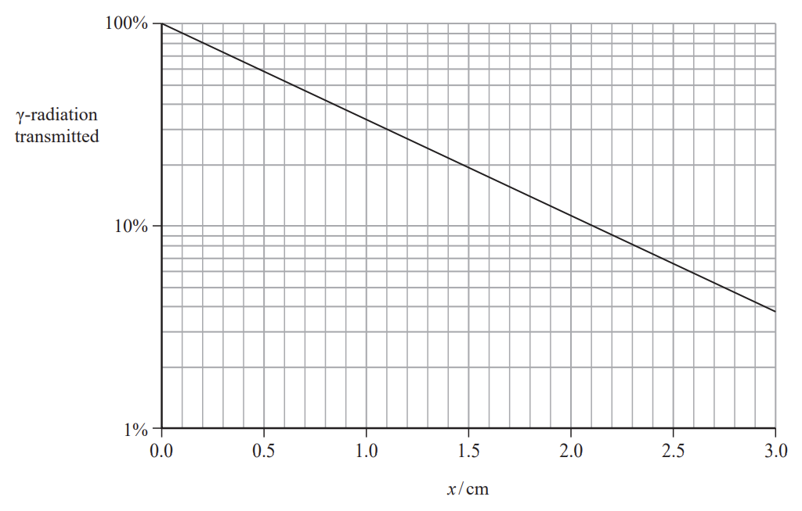
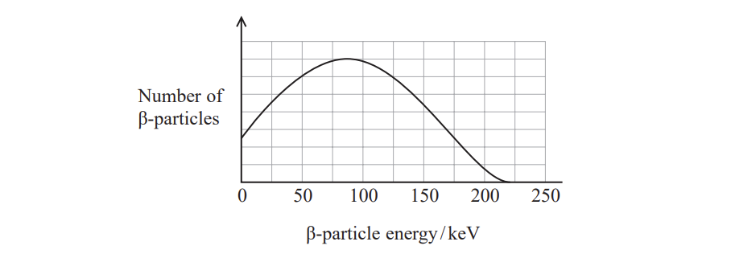
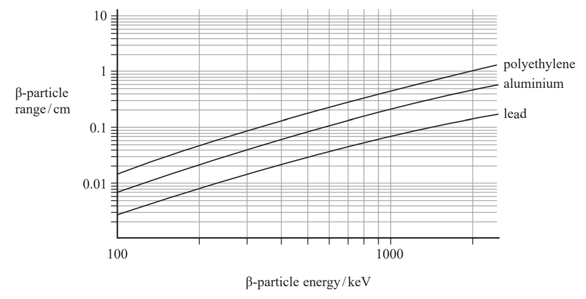
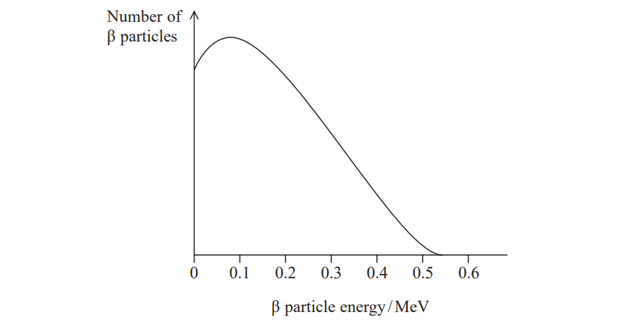
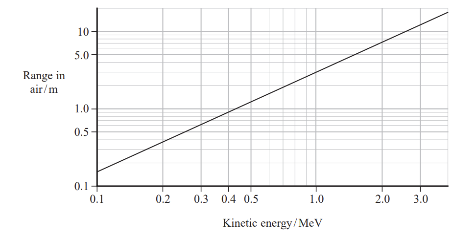

# Exam Questions — Radioactivity Decay
**5. Thermodynamics, Radiation, Oscillations & Cosmology** · Edexcel International A Level (IAL) Physics (YPH11)
> Source: [https://www.savemyexams.com/international-a-level/physics/edexcel/19/topic-questions/5-thermodynamics-radiation-oscillations-and-cosmology/radioactivity-decay/structured-questions/](https://www.savemyexams.com/international-a-level/physics/edexcel/19/topic-questions/5-thermodynamics-radiation-oscillations-and-cosmology/radioactivity-decay/structured-questions/) · 12 questions · total 52 marks

## Q1 — medium — 9 marks · structured-questions

### 19((a)) — 3 marks — command: multiple — structured — from paper Oct/Nov 2021 · WPH15/01
Cobalt‐60 is a source of gamma radiation. Gamma radiation can be used to sterilise medical equipment.

i) Complete the nuclear equation for the decay of cobalt-60 to nickel.

`Co presubscript 27 presuperscript 60 space rightwards arrow space Ni presubscript midline horizontal ellipsis midline horizontal ellipsis end presubscript presuperscript midline horizontal ellipsis midline horizontal ellipsis end presuperscript space plus space straight beta presubscript midline horizontal ellipsis midline horizontal ellipsis end presubscript presuperscript midline horizontal ellipsis midline horizontal ellipsis end presuperscript superscript minus space plus space scriptbase straight v with bar on top end scriptbase presubscript 0 presuperscript 0 subscript straight e`

**(2)**

ii) Suggest why the majority of the energy released is shared between the β− particle and the antineutrino.

**(1)**

### 19((b)) — 3 marks — command: calculate — structured — from paper Oct/Nov 2021 · WPH15/01
The activity of a cobalt‐60 source is 4.07 × 1014 Bq initially.

When used for sterilising, the source is replaced when the activity drops below 1.85 × 1014 Bq.

Calculate the time in years until the source should be replaced.

half-life of cobalt‐60 = 5.27 years

1 year = 3.16 × 107 s

Time until source should be replaced = .........................years

### 19((c)) — 3 marks — command: deduce — structured — from paper Oct/Nov 2021 · WPH15/01
When in use the cobalt-60 source is shielded with lead. The graph shows how the transmission of *γ*-radiation depends upon the thickness *x* of the lead shielding.

The count rate from a source must be reduced from 4.0 × 1014 Bq to 1.2 × 1014 Bq.

Deduce whether lead shielding of thickness 1.0 cm would be sufficient to achieve this.

## Q2 — medium — 8 marks · structured-questions

### 19((a)) — 5 marks — command: show — structured — from paper June 2021 · WPH15/01
A pacemaker is a device used to regulate a person’s heart rate.

Some of the first electronic pacemakers used an isotope of plutonium, Pu-238, as the power source.

Pu-238 decays by alpha emission.

Show that the energy released when a nucleus of Pu-238 decays into a nucleus of uranium is about 5.6 MeV.

|   | **Mass/u** |
|---|---|
| Plutonium nucleus | 237.999089 |
| Uranium nucleus | 233.991578 |
| α-particle | 4.001506 |

### 19((c)) — 3 marks — command: comment — structured — from paper June 2021 · WPH15/01
Another source that was used in early pacemakers was promethium-147. This emits β-particles. The energy spectrum for the β-particles is shown.

The graphs below show how the range of beta particles depends on the beta particle energy, for different materials.

It is suggested that a layer of polyethylene, of thickness 0.5 cm, would be able to absorb all the beta particles emitted from a promethium-147 source.

Comment on this suggestion.

## Q3 — medium — 8 marks · structured-questions

### 1() — 1 mark — command: state — structured
Carbon-14, `scriptbase text C end text end scriptbase presuperscript 14`, is a radioactive isotope with a half-life of $5730 \text{years}$. It forms in the atmosphere and is absorbed by living organisms.

State what is meant by the term half-life.

### 2() — 5 marks — command: multiple — structured
The age of ancient organic materials can be estimated by comparing the ratio of carbon-14 to the stable isotope carbon-12. This technique is known as radiocarbon dating.

While an organism is living and taking in carbon, this ratio is constant. After death, the ratio changes as carbon is no longer taken in, but the carbon-14 continues to decay.

A sample of charcoal recovered from an archaeological dig is analysed using this technique. The activity of the carbon-14 was determined to be $180\text{Bq}$ per kg of charcoal. A $50\text{g}$ sample from a living tree was measured to have an activity of $12.5\text{Bq}$.

(i) Calculate the age of the charcoal sample in years.

[4]

(ii) State one assumption made when using radiocarbon dating to determine the age of a sample.

[1]

### 3() — 2 marks — command: explain — structured
To measure the activity, a Geiger–Müller tube was placed near the sample.

Explain two reasons why the recorded count rate is significantly lower than the true activity of the sample.

## Q4 — hard — 5 marks · structured-questions

### 14() — 5 marks — command: assess — structured — from paper 2022 Jan · WPH15/01
Strontium-90 is commonly used in schools to demonstrate the properties of β particles.

The range of energies of β particles emitted from a source of strontium-90 is shown below.

When β particles travel through air they ionise air molecules, which limits how far they travel. The range of the β particles depends upon their kinetic energy when released from the nucleus.

The graph below shows how the range of a β particle in air depends upon its kinetic energy.

It is estimated that the most energetic β particles from strontium-90 will ionise 250 nitrogen molecules per cm of air that they pass through.

15.6 eV is required to ionise a nitrogen molecule.

Assess whether this estimate is consistent with the range of these β particles in air.

## Q5 — hard — 5 marks · structured-questions

### 19((b)) — 5 marks — command: calculate — structured — from paper June 2021 · WPH15/01
A pacemaker is a device used to regulate a person’s heart rate.

Some of the first electronic pacemakers used an isotope of plutonium, Pu-238, as the power source.

In one pacemaker, the activity of the plutonium source was measured to be 6.75 × 1010 Bq in 2020.

Calculate the power of the source, in W, when it was fitted 40 years ago.

half-life of Pu-238 = 87.7 years

energy of α-particle = 5.6 MeV

Power of source = ......................................... W

## Q6 — hard — 11 marks · structured-questions

### 1() — 2 marks — command: determine — structured
Protactinium, $\mathrm{Pa}$, is one of the products in the decay series of uranium-238, `straight U presubscript 92 presuperscript 238`. `straight U presubscript 92 presuperscript 238` decays to thorium, $\mathrm{Th}$, by emitting an alpha particle. $\mathrm{Th}$ then decays to $\mathrm{Pa}$ and then to a different isotope of uranium, `straight U presubscript 92 presuperscript 234`.

Determine the number of $α$ particles and $β$ particles emitted during this process to complete the nuclear equation.

`straight U presubscript 92 presuperscript 238 space rightwards arrow with blank on top space space straight U presubscript 92 presuperscript 234 space plus space.... cross times straight alpha presubscript.... end presubscript presuperscript.... end presuperscript space plus space.... cross times straight beta presubscript.... end presubscript presuperscript.... end presuperscript`

### 2() — 2 marks — command: describe — structured
The diagram shows the apparatus used by a teacher to demonstrate the decay of protactinium.

Protactinium is produced in a sealed plastic bottle containing a liquid containing a uranium salt. When the bottle is shaken, the protactinium dissolves in the solvent and floats above the liquid containing uranium and thorium.

The count rate is measured using a Geiger-Müller (GM) tube connected to a counter at intervals of 1.0 minutes for 6.0 minutes. The time intervals are measured using a stopwatch.

Describe how to determine the corrected count rate for the sample.

### 3() — 4 marks — command: determine — structured
The table shows the corrected count rate $C$ for the sample.

| $t$ / $\mathrm{min}$ | $C$ / $s^{-1}$ |
|---|---|
| 0 | 128 |
| 1.0 | 71 |
| 2.0 | 39 |
| 3.0 | 22 |
| 4.0 | 11 |
| 5.0 | 8 |
| 6.0 | 3 |

The graph shows how $\mathrm{ln}C$ varies with time.

Determine the half-life of the protactinium.

### 4() — 3 marks — command: assess — structured
A student suggests that the results would have been more accurate if a data logger had been used to record the data.

Assess the student’s suggestion.

## Q7 — easy — 1 marks · multiple-choice-questions

### 1() — 1 mark — multiple_choice — from paper June 2021 · WPH15/01
A detector and counter were placed near a radium source. A student measured the count for one minute. He used this value to calculate the count rate in Bq from the source.

Which of the following would increase the accuracy of the student’s value for the count rate?
- **A.** Adding the background count rate to the measured count rate.
- **B.** Increasing the counting time to 10 minutes.
- **C.** Repeating the count with a different detector and calculating a mean value.
- **D.** Subtracting the background count from the measured count.

## Q8 — easy — 1 marks · multiple-choice-questions

### 4() — 1 mark — multiple_choice — from paper Oct/Nov 2021 · WPH15/01
Cancer cells inside the body can be killed by directing narrow beams of radiation from different directions onto the cells. The source of radiation is outside the body.

Which radiation would be the most suitable to use?
- **A.** alpha radiation because it is very ionising
- **B.** alpha radiation because it is very penetrating
- **C.** gamma radiation because it is very ionising
- **D.** gamma radiation because it is very penetrating

## Q9 — easy — 1 marks · multiple-choice-questions

### 1() — 1 mark — multiple_choice
The radioactive decay of uranium-234 to thorium-230 is described by the equation

`scriptbase text U end text end scriptbase presubscript   92 end presubscript presuperscript 234 space rightwards arrow space   scriptbase text Th end text end scriptbase presubscript   90 end presubscript presuperscript 230 space plus space text X end text`

Particle X is
- **A.** a beta-minus particle
- **B.** a proton
- **C.** a gamma-ray photon
- **D.** an alpha particle

## Q10 — medium — 1 marks · multiple-choice-questions

### 4() — 1 mark — multiple_choice — from paper 2022 Jan · WPH15/01
Tritium is a radioactive isotope. Wine may contain traces of tritium. One 25‐year‐old bottle of wine was found to have an unusually high activity of 22 Bq.

half-life of tritium = 12.5 years

Which of the following gives the activity of this wine when it was bottled?
- **A.** 44 Bq
- **B.** 66 Bq
- **C.** 88 Bq
- **D.** 110 Bq

## Q11 — medium — 1 marks · multiple-choice-questions

### 7() — 1 mark — multiple_choice — from paper 2022 Jan · WPH15/01
A student investigates the absorption of gamma radiation by lead. She determines the background radiation count rate before she starts the investigation.

Which of the following would **not** affect her value for the background count rate?
- **A.** the place where she made the measurement
- **B.** the temperature of the surroundings
- **C.** the time interval for the background count
- **D.** the type of radiation detector she used

## Q12 — medium — 1 marks · multiple-choice-questions

### 6() — 1 mark — multiple_choice — from paper Oct/Nov 2021 · WPH15/01
Polonium‐218 is a naturally occurring radioactive isotope with a half-life of 185 s.

A sample of this isotope contains 2.75 × 1015 unstable nuclei.

Which of the following expressions can be used to determine the activity in Bq of the sample?
- **A.** $\frac{185}{ln2}\times2.75\times10^{15}$
- **B.** $\frac{2.75\times10^{15}}{ln2\times185}$
- **C.** $\frac{ln2}{185}\times2.75\times10^{15}$
- **D.** $\frac{ln2}{2.75\times10^{15}}\times185$
