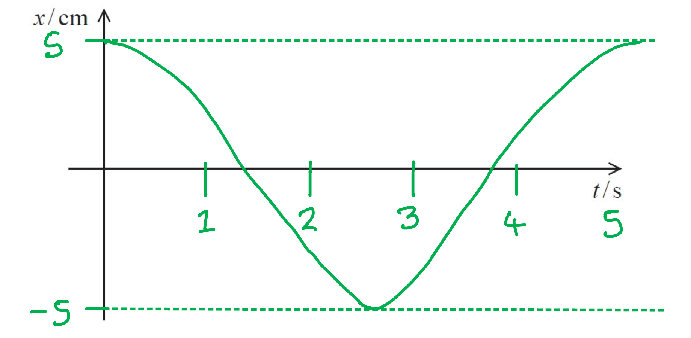
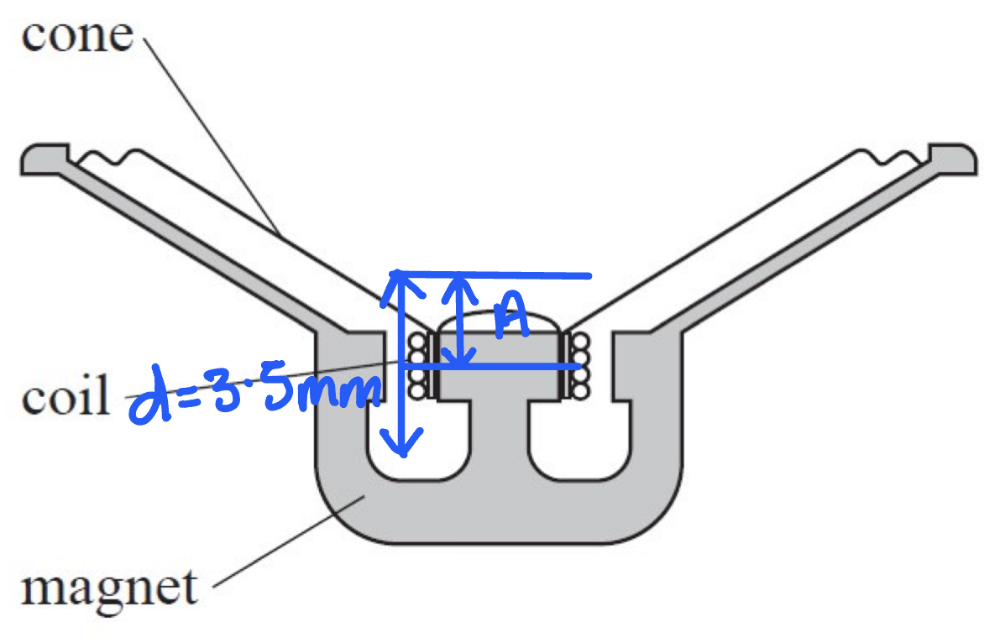
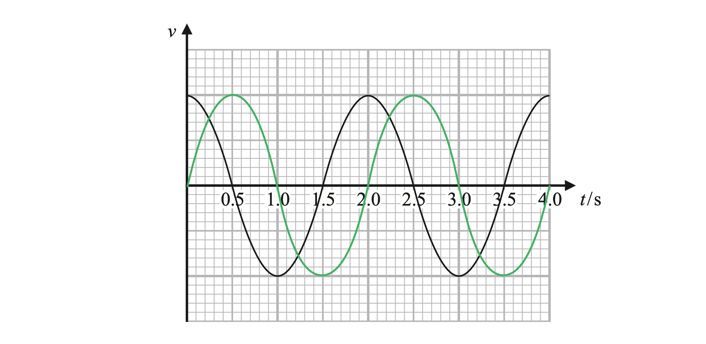
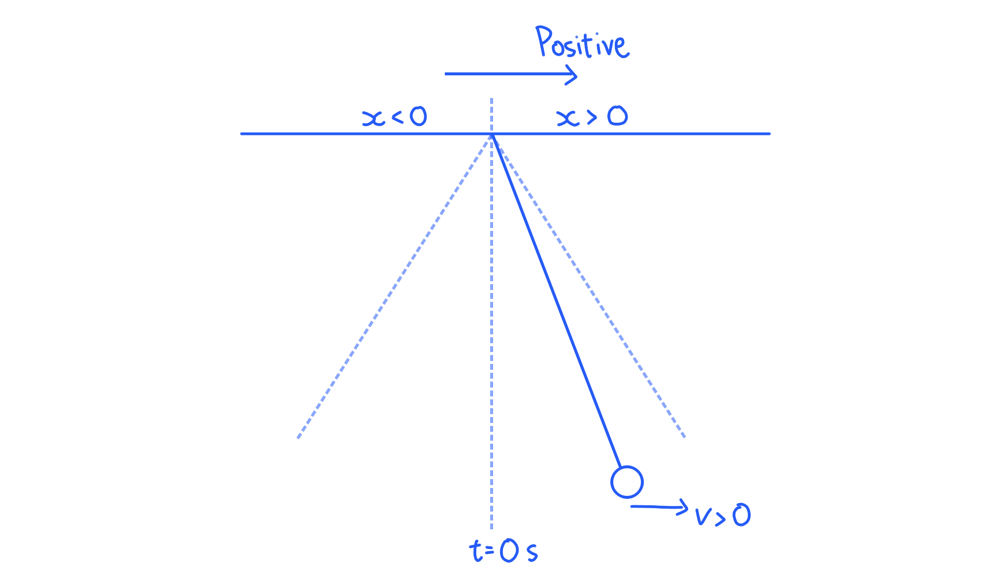
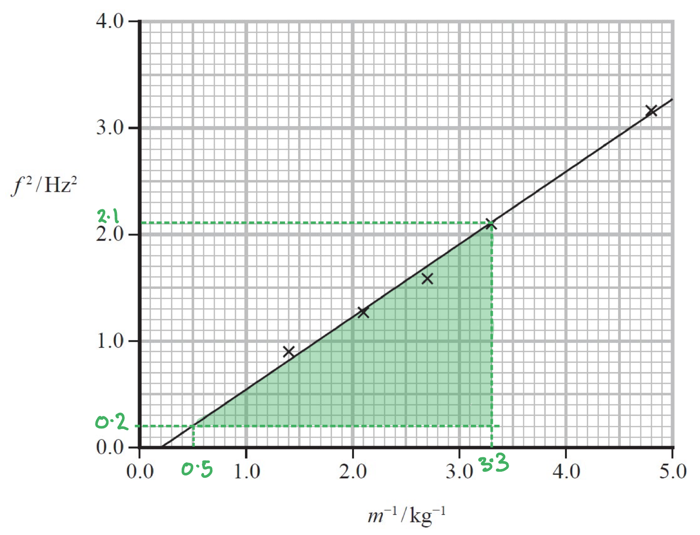
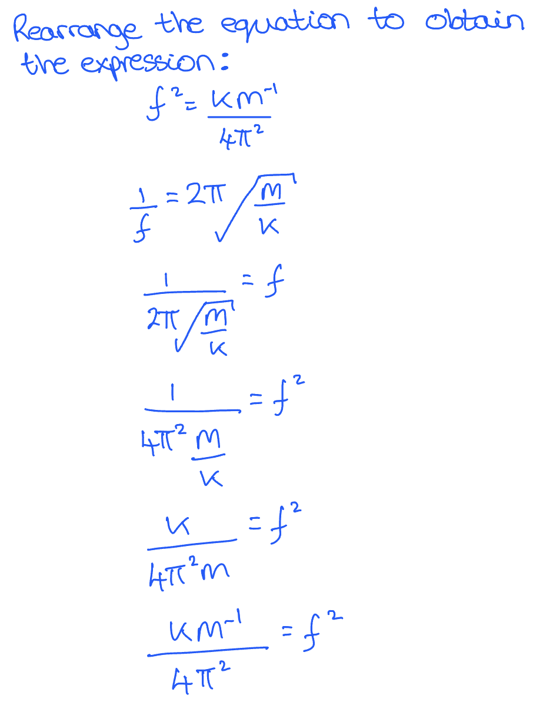
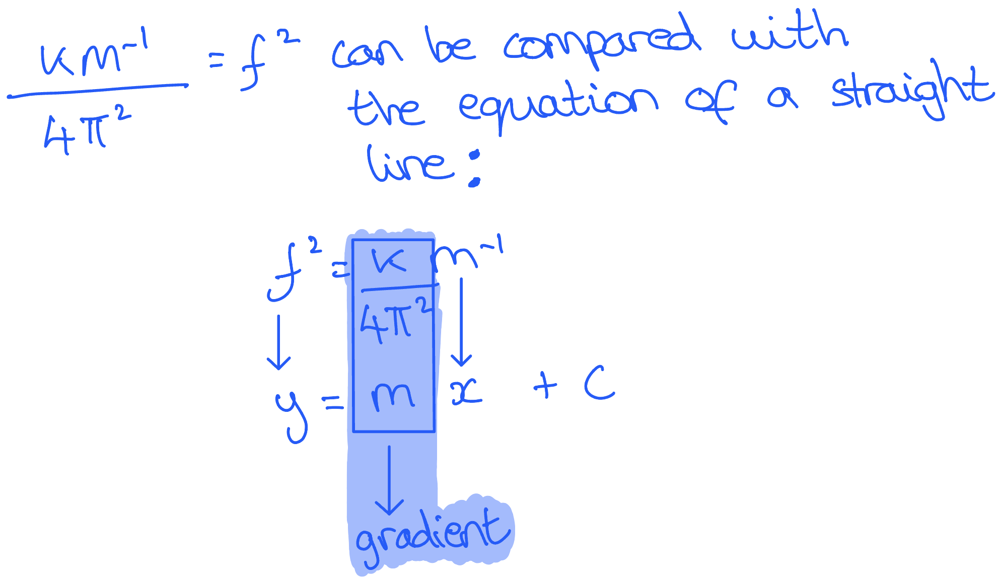

# Mark Schemes — Simple Harmonic Motion
**5. Thermodynamics, Radiation, Oscillations & Cosmology** · Edexcel International A Level (IAL) Physics (YPH11)

## Q1 — medium — 4 marks · structured-questions

### 11() — 4 marks
A sketch graph to show how *x* depends upon time *t *would look like this:

Use the graph to obtain values for *a *and *x *and calculate the time period *T*:

- *a *= 8 m s−2 and *x *= −5 m
- $a=-ω^{2}x$
- So, $ω=\sqrt{-\frac{a}{x}}=\sqrt{-\frac{8}{-5}}=1.26\mathrm{rad}s^{-1}$
- $ω=\frac{2π}{T}$
- So, $T=\frac{2π}{ω}=\frac{2π}{1.26}=4.99s$ **[1 mark]**

A graph that would score 3 marks should look like this:

- 1 cycle of oscillation is shown in a sinusoidal shape; **[1 mark]**
- An amplitude of 5 cm is shown on the vertical, displacement axis, as the initial amplitude of the oscillation; **[1 mark]**
- The period* *of oscillation *T *is shown on the horizontal axis; **[1 mark]**

**[Total: 4 marks]**

- *Don't forget to use the **SHM equations** to calculate the values you need to plot the graph*

## Q2 — medium — 6 marks · structured-questions

### 17((b)) — 4 marks
i) Calculate the maximum velocity of the coil:

List the known quantities:

- Frequency of sound emitted, $f$ = 75 Hz
- Distance, $d$ = 3.5 mm = 3.5 × 10−3 m

Calculate the angular velocity of the sound emitted, $ω$:

- Angular velocity:  $ω=2πf$
- $ω=2π\times75=471.23\mathrm{rad}s^{-1}=471\mathrm{rad}s^{-1}$ **[1 mark]**

Calculate the linear velocity of the sound emitted from the loudspeaker, $v$:

- Velocity in SHM:  $v=-Aω\mathrm{sin}ωt$

  - Amplitude:  `A space equals space 1 half d space equals space 1 half space cross times space open parentheses 3.5 space cross times space 10 to the power of negative 3 end exponent close parentheses space equals space 1.75 space cross times space 10 to the power of negative 3 end exponent space straight m`
  - At max displacement:  `sin open parentheses omega t close parentheses` = 1
- `v space equals space A cross times omega space equals space open parentheses 1.75 cross times 10 to the power of negative 3 end exponent close parentheses space cross times space 471` **[1 mark]**
- $v=0.824ms^{-1}$** [1 mark]**

ii) The position of the coil when the velocity is a maximum is:

- At the equilibrium / undisplaced / central / middle position; **[1 mark]**

**[Total: 4 marks]**

- *The coil moves through a maximum distance of 3.5 mm means:*

  - *The **amplitude is ½** of that distance*

- *When an object is oscillating at** maximum displacement** where **d **= **A **then *`s i n open parentheses omega t close parentheses space equals space 1`

### 17((c)) — 2 marks
This effect is observed because:

Any **two **from:

- The driving frequency of the coil matches the natural frequency of the cone; **[1 mark]**
- There is a maximum transfer of energy from the coil to the cone; **[1 mark]**
- So, resonance occurs; **[1 mark]**

**[Total: 2 marks]**

## Q3 — medium — 8 marks · structured-questions

### 18((a)) — 6 marks
(i) Show that the stiffness of the spring is about 350 N m−1.

List the known quantities:

- Mass, *m *= 15.0 kg
- Extension of the spring, Δ*x* = 42.5 cm = 42.5 × 10–2 m

Calculate the force on the spring:

- $\DeltaF=mg=15.0\times9.81=147.15N$

Calculate the stiffness of the spring:

- $\DeltaF=k\Deltax$
- $k=\frac{\DeltaF}{\Deltax}=\frac{147.15}{42.5\times10^{-2}}$ **[1 mark]**
- $k=346Nm^{-1}=350Nm^{-1}$**[1 mark]**

ii) The crib will oscillate with simple harmonic motion because:

- (When the crib is displaced) there is a (resultant) acceleration / force that is proportional to the displacement from the equilibrium position / ; **[1 mark]**
- and (always) acting towards the equilibrium position; **[1 mark]**

iii) Calculate the period of oscillation of the crib.

List the known quantities:

- Mass of the baby, *m*b = 7.25 kg
- Mass of the crib, *m*c = 2.55 kg
- Stiffness of the spring, *k* = 350 N m–1

Calculate the period of the oscillation, *T*:

- $T=2π\sqrt{\frac{m}{k}}$
- $T=2π\sqrt{\frac{m_{b}+m_{c}}{k}}=2π\sqrt{\frac{7.25+2.55}{350}}$ **[1 mark]**
- $T=1.05s$ **[1 mark]**

**[Total: 6 marks]**

- *In part ii), 'undisplaced / fixed / central point' or  'undisplaced / fixed / central position' will also be accepted - but only use these if you forget the correct physics term 'equilibrium'*
- *For part ii) you could also state an equation (*$a=-ω^{2}x$*) with the symbols defined correctly for both marks*
- *Remember to use the correct time period equation (there are two given on your data sheet)*

  - $T=2π\sqrt{\frac{m}{k}}$* is for a mass-spring system*
  - $T=2π\sqrt{\frac{l}{g}}$* is for a simple pendulum*

### 18((b)) — 2 marks
The instructions state that the maximum mass is only 15.0 kg because:

- The maximum load the spring can support when oscillating is less than the maximum load the spring supports when in equilibrium; **[1 mark]**
- As when the mass is below the equilibrium position, the force exerted on the spring is greater than the force at equilibrium; **[1 mark]**

**[Total: 2 marks]**

- *The thinking behind this question is about how the mass affects the force*
- *In the calculations in part a), the force is determined by the **weight** of the system*

  - *The weight is proportional to the mass (*$W=mg$*)*

## Q4 — medium — 7 marks · structured-questions

### 14((a)) — 5 marks
i) Add a line to the graph to show how the displacement of the bob varied with time during the same time interval:

- Same time period as velocity **and** constant amplitude; **[1 mark]**
- Wave shifted a quarter cycle to the right (positive sine wave with displacement of 0 at *t* = 0 s); **[1 mark]**

**   **

ii) Determine the length of the simple pendulum:

Determine the period from the graph:

- The period, $T$ = 2.0 s **[1 mark]**

Determine length:

- $T=2π\sqrt{\frac{l}{g}}$
- `l space equals space g open parentheses fraction numerator T over denominator 2 straight pi end fraction close parentheses squared space equals space 9.81 space cross times space open parentheses fraction numerator 2.0 over denominator 2 straight pi end fraction close parentheses squared space` **[1 mark]**
- $l=0.994m=0.99m$ (2 s.f.) **[1 mark]**

**[Total: 5 marks]**

- *It often helps to **visualise** the directions of each quantity using a **diagram** if you are unsure*

  - *The **direction** of displacement **relative** to velocity is important in this question*

- *If **v** is at a **maximum** at **t** = 0 s, the oscillator must start at the **central** **position** where displacement is 0 m*

### 14((b)) — 2 marks
Describe when the use of a data logger is an advantage:

Any **two** from:

- When data has to be collected over a very short time interval; **[1 mark]**
- When multiple data sets have to be collected simultaneously; **[1 mark]**
- When data has to be collected over a very long time interval; **[1 mark]**

**[Total: 2 marks]**

- *You could also gain two marks by stating an appropriate example and explaining why a data logger is useful, for example:*

  - *A data logger is an advantage when measuring the time of free fall*
  - *A light gate connected to a data logger removes the error due to reaction time*

## Q5 — medium — 2 marks · structured-questions

### 17((a)) — 2 marks
The mass moves with simple harmonic motion because:

- There is a resultant <u>force</u> acting on the mass which is proportional to its displacement from its equilibrium position; **[1 mark]**
- The <u>force</u> is always directed towards the equilibrium position;** [1 mark]**

**[Total: 2 marks]**

- *If you provide an **equation** with the following in your answer you will score 2 marks: *

  - *All the **symbols defined*
  - *Negative sign justified*

- *Equilibrium position** can also be called:*

  - *Undisplaced point / position*
  - *Fixed point / position*
  - *Central point / position*

## Q6 — hard — 8 marks · structured-questions

### 17((b)) — 8 marks
i) Show that the stiffness *k* of the spring is about 26 Nm−1:

List the known quantities:

- mass on the end of the spring, $m$ = 0.200 kg
- extension of the spring, $x$ = 7.50 cm = 0.0750 m

From the data booklet:

- $F=-kx$
- Gravitation field strength, $g$ = 9.81 m s−2

Calculate the force, $F$ on the end of the spring:

- $F=W=mg$
- $F=0.200\times9.81=1.962N$

Calculate the stiffness, *k *of the spring:

- $k=\frac{F}{x}=\frac{1.962}{0.0750}$ **[1 mark]**
- $k=26.26Nm^{-1}$ **[1 mark]**

** **

ii) Deduce whether the graph gives a value of *k* consistent with the value in (i):

From the data booklet:

- $T=2π\sqrt{\frac{m}{k}}$
- $f=\frac{1}{T}$

Combine the equations for time period to obtain an expression for $f^{2}$:

- $\frac{1}{f}=2π\sqrt{\frac{m}{k}}$
- $f^{2}=\frac{k}{4π^{2}m}=\frac{km^{-1}}{4π^{2}}$ **[1 mark]**

Obtain an expression for the gradient of the graph:

- $f^{2}=\frac{km^{-1}}{4π^{2}}\,y=mx+c$
- Gradient = $\frac{k}{4π^{2}}$ **[1 mark]**

Draw a gradient triangle on the graph to calculate the gradient:

- Large triangle used to obtain the gradient of the graph; **[1 mark]**

  - Point 1: (0.5, 0.2)
  - Point 2: (3.3, 2.1)
- Gradient = $\frac{changeiny}{changeinx}=\frac{y_{2}-y_{1}}{x_{2}-x_{1}}=\frac{2.1-0.2}{3.3-0.5}=0.679\mathrm{kg}s^{-2}$**[1 mark]**

Use the gradient to calculate the value of $k$:

- $k=gradient\times4π^{2}$
- $k=0.679\times4π^{2}=26.8Nm^{-1}$**[1 mark]**

Compare the calculated and given values of $k$:

- The value of $k$ from part (i) is consistent with the calculated value because they are within 2 s.f. of each other; **[1 mark]**

**[Total: 8 marks]**

- *Combining and rearranging** the equations for *$T$* can be done like this:*

- *Matching the expression** for *$f^{2}$* to the **equation of a straight line** can be done like this:*

- *It is good practice to form the gradient triangle between **points that you know** / that **cross exactly** between grid squares*

## Q7 — medium — 1 marks · multiple-choice-questions

### 1() — 1 marks
**Correct answer: B** — Its acceleration is always towards O.

**Final answer:** **The correct answer is ****B ****because:**

- An oscillation is said to be SHM when:

  - The acceleration is proportional to the displacement
  - The acceleration is in the opposite direction to the displacement
- This eliminates options **A**, **C **and **D **

  - As they comment on acceleration and velocity
- Hence, option **B **is correct

- **O **represents the **equilibrium position**
- Hence, "Its acceleration is always towards O" is a comment on the relationship between **acceleration** and **displacement** of the pendulum

## Q8 — medium — 1 marks · multiple-choice-questions

### 3() — 1 marks
**Correct answer: D** — `fraction numerator open parentheses 16.5 close parentheses squared space cross times 9.81 over denominator space 4 straight pi squared end fraction`

**Final answer:** **The correct answer is ****D ****because:**

- Recall the equation for the length of a pendulum from the data booklet:

  - $T=2π\sqrt{\frac{l}{g}}$
- Rearrange the equation to make $l$ the subject:

  - $\frac{T}{2π}=\sqrt{\frac{l}{g}}$
  - `open parentheses fraction numerator T over denominator 2 pi end fraction close parentheses squared space equals space l over g`
  - `open parentheses fraction numerator T over denominator 2 pi end fraction close parentheses squared space cross times space g space equals space l`
- Substitute for $T$ and $g$ into the equation:

  - The period is twice the time taken to swing between the two extremes, 8.25 s
  - `fraction numerator open parentheses 16.5 close parentheses squared space cross times space 9.81 over denominator 4 pi squared end fraction space equals space l`
- Hence, the correct answer is **D **

## Q9 — medium — 1 marks · multiple-choice-questions

### 3() — 1 marks
**Correct answer: D** — $T\sqrt{6}$

**Final answer:** **The correct answer is ****D**** because:**

- The gravitational field strength of the moon in terms of the earth is

  - $g_{M}=\frac{g_{E}}{6}$
- The time period of a simple pendulum is:

  - $T=2π\sqrt{\frac{l}{g}}=2π\sqrt{\frac{l}{g_{E}}}$
- Substitute this into the time period equation gives:

  - $T_{M}=2π\sqrt{\frac{l}{\frac{g_{E}}{6}}}=2π\sqrt{\frac{6l}{g_{E}}}$
- Therefore:

  - $T_{M}=\sqrt{6}\times2π\sqrt{\frac{l}{g_{E}}}=T\sqrt{6}$

## Q10 — medium — 1 marks · multiple-choice-questions

### 5() — 1 marks
**Correct answer: C** — $2π\times0.5\times0.3$

**Final answer:** **The correct answer is ****C**** because:**

- The velocity in simple harmonic motion is defined by:

  - $v=--Aωsinωt$
- At maximum velocity, sin* ωt* = 1 so:

  - `v subscript m a x end subscript space equals space open parentheses minus close parentheses A omega`
- The angular velocity *ω* is defined by:

  - $ω=2πf$
- Therefore:

  - $v_{max}=0.3\times2π\times0.5$

- The maximum value that the sine and cos functions can be is **1**
- It's a good idea to learn the *v*max equation as its own equation

  - Remember, it is **not** given in the data sheet in this form, only its form for *v*

## Q11 — medium — 1 marks · multiple-choice-questions

### 10() — 1 marks
**Correct answer: D** — `2 straight pi cross times square root of open parentheses fraction numerator 0.20 over denominator 3.2 end fraction close parentheses end root`

**Final answer:** **The correct answer is ****D**** because:**

- The period of oscillations is given by:

  - $T=\frac{1}{f}=\frac{2π}{ω}$
- The equation linking *a* and *x* is:

  - $a=-ω^{2}x$
- Therefore, the gradient of the graph is *ω*2
- The magnitude of the gradient gives:

  - $ω^{2}=\frac{\Deltaa}{\Deltax}=\frac{3.2}{0.20}$
  - $ω=\sqrt{\frac{3.2}{0.20}}$
- Therefore, the time period is:

  - $T=\frac{2π}{\sqrt{\frac{3.2}{0.20}}}=2π\times\sqrt{\frac{0.20}{3.2}}$

- The equation linking *a* and *x* is the defining equation of simple harmonic motion
- Although the gradient, you can just use the magnitude (size) of the gradient to calculate the time period (so the minus sign can be ignored)
- You must be confident with algebraic fractions, in this question, the following is used:

  - $\frac{1}{\frac{x}{y}}=1\div\frac{x}{y}=1\times\frac{y}{x}$

## Q12 — medium — 1 marks · multiple-choice-questions

### 9() — 1 marks
**Correct answer: B** — $\frac{2π}{0.55}\times0.25$

**Final answer:** **The correct answer is ****B**** because:**

- In SHO, velocity is given by $v=-ωA\mathrm{sin}ωt$

  - The maximum value of $\mathrm{sin}ωt$ is 1, so $v_{max}=ωA$ (the sign can be either + or −)
- $ω=2πf=\frac{2π}{T}=\frac{2π}{0.55}$

  - Therefore $v_{max}=\frac{2π}{0.55}\times0.25$

## Q13 — medium — 1 marks · multiple-choice-questions

### 1() — 1 marks
**Correct answer: C** — 

**Final answer:** **The correct answer is C**

- The period of simple harmonic motion is independent of amplitude
- For a mass–spring system:

$T=2π\sqrt{\frac{m}{k}}$

- So, halving the amplitude leaves the period unchanged at $T$

  - Therefore, **A** & **B** can be eliminated

- The total energy of an oscillator with amplitude $A$ is:

$E=\frac{1}{2}kA^{2}$

- Halving the amplitude ($A/2$) reduces the total energy by:

`E apostrophe space equals space 1 half k open parentheses A over 2 close parentheses squared space equals space 1 fourth open parentheses 1 half k A squared close parentheses space equals space E over 4`

- Period $T$ and total energy $\frac{E}{4}$ correspond to row **C**

> **[exam-tip]**
> Two independent facts are being tested here: the SHM period depends only on the system (mass and stiffness, or length and g), never on amplitude; and the total energy goes as the square of the amplitude. Halve the amplitude and the energy drops to a quarter, not a half.
