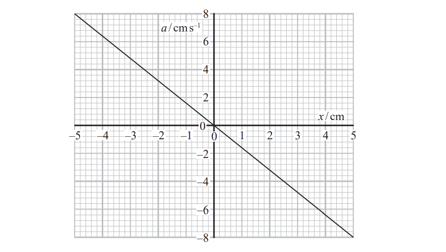
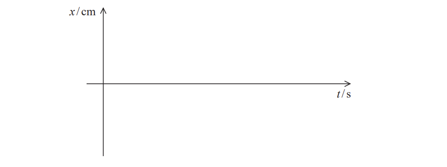
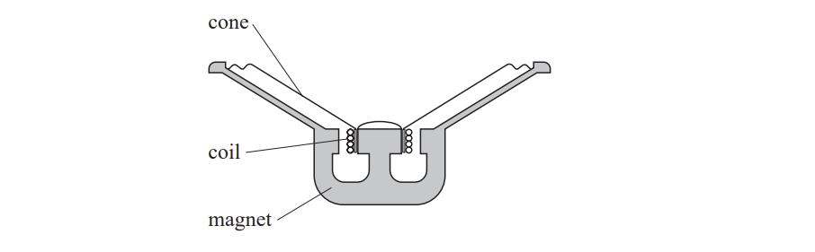
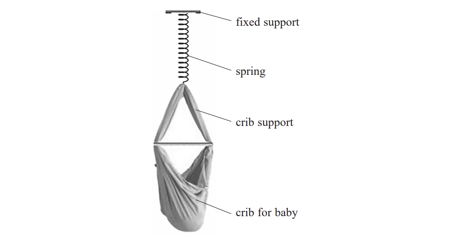
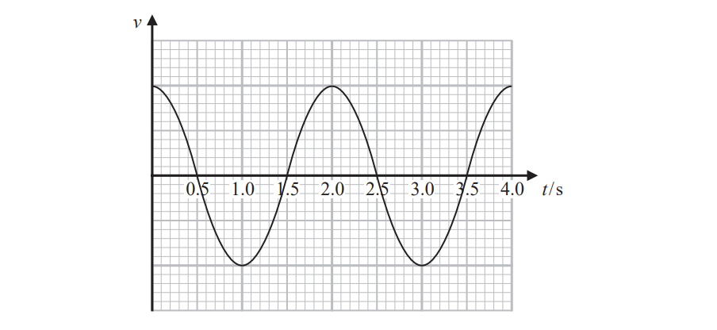
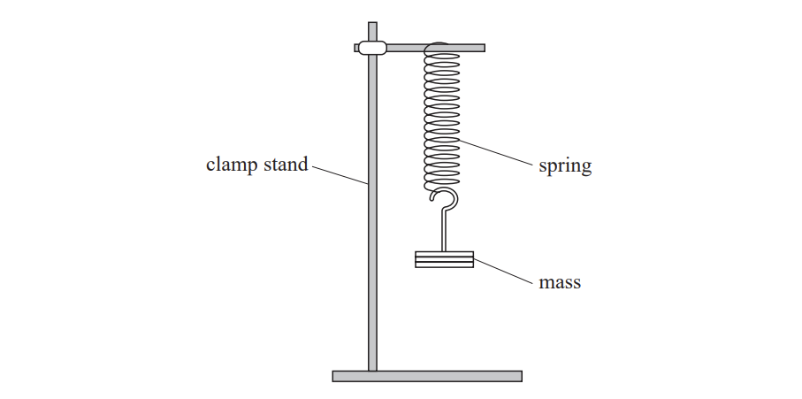
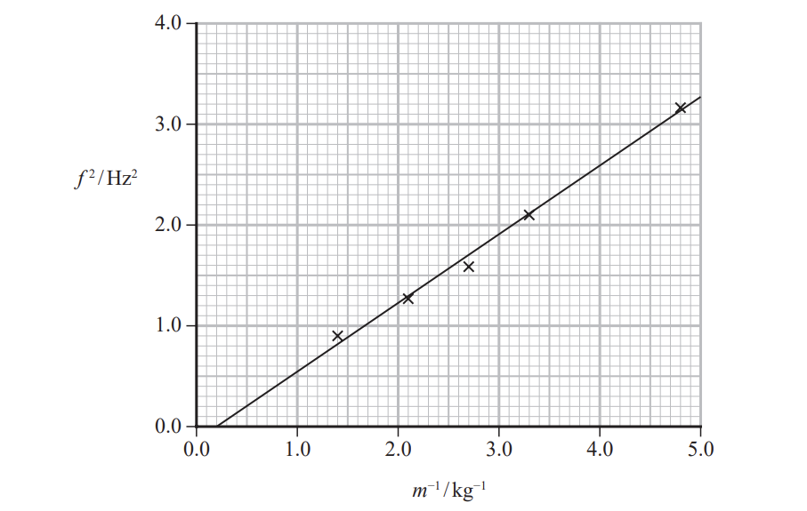
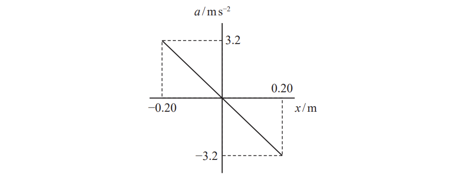

# Exam Questions — Simple Harmonic Motion
**5. Thermodynamics, Radiation, Oscillations & Cosmology** · Edexcel International A Level (IAL) Physics (YPH11)
> Source: [https://www.savemyexams.com/international-a-level/physics/edexcel/19/topic-questions/5-thermodynamics-radiation-oscillations-and-cosmology/simple-harmonic-motion/structured-questions/](https://www.savemyexams.com/international-a-level/physics/edexcel/19/topic-questions/5-thermodynamics-radiation-oscillations-and-cosmology/simple-harmonic-motion/structured-questions/) · 13 questions · total 42 marks

## Q1 — medium — 4 marks · structured-questions

### 11() — 4 marks — command: sketch — structured — from paper 2022 Jan · WPH15/01
A mass is hung from a spring and set into vertical oscillation by displacing the mass 5 cm from its equilibrium position.

The graph shows how the acceleration *a* of the mass depends upon the displacement *x *of the mass from its equilibrium position.

Sketch a graph on the axes below to show how *x* depends upon time *t*.

## Q2 — medium — 6 marks · structured-questions

### 17((b)) — 4 marks — command: multiple — structured — from paper 2022 Jan · WPH15/01
A music system has a number of loudspeakers. One loudspeaker produces the low frequency sounds. This loudspeaker consists of a coil connected to a cone. The coil is in a region of magnetic field produced by a permanent magnet, as shown.

A signal of constant frequency is applied to the loudspeaker. The coil moves with simple harmonic motion and the loudspeaker emits a sound of frequency 75 Hz.

When the loudspeaker is producing this sound, the coil moves through a maximum distance of 3.5 mm.

i) Calculate the maximum velocity of the coil.

Maximum velocity of the coil = .............................**(3)**

ii) State the position of the coil when the velocity is a maximum.

**(1)**

### 17((c)) — 2 marks — command: explain — structured — from paper 2022 Jan · WPH15/01
At a particular frequency, the loudspeaker cone starts to oscillate with a very large amplitude.

Explain why this effect is observed.

## Q3 — medium — 8 marks · structured-questions

### 18((a)) — 6 marks — command: multiple — structured — from paper Oct/Nov 2021 · WPH15/01
A website advertises a baby crib that can be hung from a spring. The crib can be set into vertical oscillation.

The instructions for the crib state that the crib can support a maximum mass of 15.0 kg.

i) When the crib supports a mass of 15.0 kg the spring extends by 42.5 cm.

Show that the stiffness of the spring is about 350 N m−1.

**(2)**

ii) A baby is placed in the crib and the spring extends to bring the system to equilibrium. The crib is displaced through a small vertical displacement and released.

State why the crib will oscillate with simple harmonic motion.

**(2)**

iii) The baby has a mass of 7.25 kg.

Calculate the period of oscillation of the crib.

mass of crib = 2.55 kg

stiffness of spring = 350 Nm−1

Period of oscillation of crib = .....................................**(2)**

### 18((b)) — 2 marks — command: explain — structured — from paper Oct/Nov 2021 · WPH15/01
The maximum mass that the spring can support before being damaged is 25.0 kg.

Explain why the instructions state that the maximum mass is only 15.0 kg.

## Q4 — medium — 7 marks · structured-questions

### 14((a)) — 5 marks — command: multiple — structured — from paper June 2021 · WPH15/01
A student set up a simple pendulum. The student used a velocity sensor connected to a data logger to record the velocity of the pendulum bob.

The graph shows how the velocity of the bob varied with time.

i) Add a line to the graph to show how the displacement of the bob varied with time during the same time interval.

**(2)**

ii) Determine the length of the simple pendulum.

Length of simple pendulum = ........................................**(3)**

### 14((b)) — 2 marks — command: describe — structured — from paper June 2021 · WPH15/01
In some experiments, it is an advantage to use a data logger rather than other measuring instruments.

Describe when the use of a data logger is an advantage.

## Q5 — medium — 2 marks · structured-questions

### 17((a)) — 2 marks — command: explain — structured — from paper June 2021 · WPH15/01
A student suspended a spring from a rigid support. She stretched the spring by hanging a mass from the free end of the spring as shown.

She set the mass into vertical oscillations by displacing it a small distance from its equilibrium position. The spring obeys Hooke’s law.

Explain why the mass moves with simple harmonic motion.

## Q6 — hard — 8 marks · structured-questions

### 17((b)) — 8 marks — command: multiple — structured — from paper June 2021 · WPH15/01
A student suspended a spring from a rigid support. She stretched the spring by hanging a mass from the free end of the spring as shown.

She set the mass into vertical oscillations by displacing it a small distance from its equilibrium position. The spring obeys Hooke’s law.

When the mass on the end of the spring was 0.200 kg, the extension of the spring was 7.50 cm when the mass was in equilibrium.

i) Show that the stiffness *k* of the spring is about 26 Nm−1.

**(2)**

ii) The student used a stopwatch to determine the frequency of oscillation *f* of the mass *m*.

She repeated this procedure for four more values of *m* and obtained the following graph.

The student used the graph to determine a value for *k*.

Deduce whether the graph gives a value of *k* consistent with the value in (i).

**(6)**

## Q7 — medium — 1 marks · multiple-choice-questions

### 1() — 1 mark — multiple_choice — from paper 2022 Jan · WPH15/01
A mass oscillates with simple harmonic motion about a fixed point O.

Which of the following statements about the motion of the mass is correct?
- **A.** Its velocity is always towards O.
- **B.** Its acceleration is always towards O.
- **C.** Its acceleration is directly proportional to its velocity.
- **D.** Its acceleration and its velocity are always in opposite directions.

## Q8 — medium — 1 marks · multiple-choice-questions

### 3() — 1 mark — multiple_choice — from paper 2022 Jan · WPH15/01
In the Pantheon in Paris there is a pendulum that takes 8.25 s to swing from one extreme position to the other.

Which of the following expressions gives the length of the pendulum?
- **A.** `fraction numerator 4 straight pi squared over denominator open parentheses 8.25 close parentheses squared space cross times 9.81 end fraction`
- **B.** `fraction numerator 4 straight pi squared over denominator open parentheses 16.5 close parentheses squared space cross times 9.81 end fraction`
- **C.** `fraction numerator open parentheses 8.25 close parentheses squared space cross times 9.81 over denominator space 4 straight pi squared end fraction`
- **D.** `fraction numerator open parentheses 16.5 close parentheses squared space cross times 9.81 over denominator space 4 straight pi squared end fraction`

## Q9 — medium — 1 marks · multiple-choice-questions

### 3() — 1 mark — multiple_choice — from paper Oct/Nov 2021 · WPH15/01
The gravitational field strength at the surface of the Moon is one sixth of that at the surface of the Earth. A simple pendulum has a period *T* at the surface of the Earth.

What would be the time period of the same pendulum at the surface of the Moon?
- **A.** $\frac{T}{6}$
- **B.** $\frac{T}{\sqrt{6}}$
- **C.** $T$
- **D.** $T\sqrt{6}$

## Q10 — medium — 1 marks · multiple-choice-questions

### 5() — 1 mark — multiple_choice — from paper Oct/Nov 2021 · WPH15/01
A mass oscillates with simple harmonic motion with a frequency of 0.5 Hz.

The amplitude of the oscillation is 0.3 m.

Which of the following is an expression for the maximum velocity in m s−1 of the mass?
- **A.** `open parentheses fraction numerator 2 straight pi over denominator 0.5 end fraction close parentheses cross times 0.3`
- **B.** `open parentheses fraction numerator 2 straight pi over denominator 0.5 end fraction close parentheses cross times 0.15`
- **C.** $2π\times0.5\times0.3$
- **D.** $2π\times0.5\times0.15$

## Q11 — medium — 1 marks · multiple-choice-questions

### 10() — 1 mark — multiple_choice — from paper Oct/Nov 2021 · WPH15/01
A mass oscillates with simple harmonic motion. The graph shows how the acceleration *a* of the mass depends upon displacement *x* from the equilibrium position.

Which of the following gives the period of oscillation, in seconds, of the mass?
- **A.** `2 straight pi cross times open parentheses fraction numerator 3.2 over denominator 0.20 end fraction close parentheses`
- **B.** `2 straight pi cross times open parentheses fraction numerator 0.20 over denominator 3.2 end fraction close parentheses`
- **C.** `2 straight pi cross times square root of open parentheses fraction numerator 3.2 over denominator 0.20 end fraction close parentheses end root`
- **D.** `2 straight pi cross times square root of open parentheses fraction numerator 0.20 over denominator 3.2 end fraction close parentheses end root`

## Q12 — medium — 1 marks · multiple-choice-questions

### 9() — 1 mark — multiple_choice — from paper June 2021 · WPH15/01
An object oscillates with simple harmonic motion. The period of oscillation is 0.55 s and the amplitude is 0.25 m.

Which of the following shows a correct calculation of the maximum velocity of the object?
- **A.** $2π\times0.55\times0.25$
- **B.** $\frac{2π}{0.55}\times0.25$
- **C.** $(2π\times0.55)^{2}\times0.25$
- **D.** `open parentheses fraction numerator 2 straight pi over denominator 0.55 end fraction close parentheses squared space cross times space 0.25`

## Q13 — medium — 1 marks · multiple-choice-questions

### 1() — 1 mark — multiple_choice
An object undergoing simple harmonic motion has a period $T$ and total energy $E$. The amplitude of oscillations is halved.

Which row of the table gives the new period and total energy of the system?

|   | Period | Total energy |
|---|---|---|
| **A** | $\frac{T}{2}$ | $\frac{E}{4}$ |
| **B** | $\frac{T}{2}$ | $\frac{E}{2}$ |
| **C** | $T$ | $\frac{E}{4}$ |
| **D** | $T$ | $\frac{E}{2}$ |
- **A.** 
- **B.** 
- **C.** 
- **D.** 
