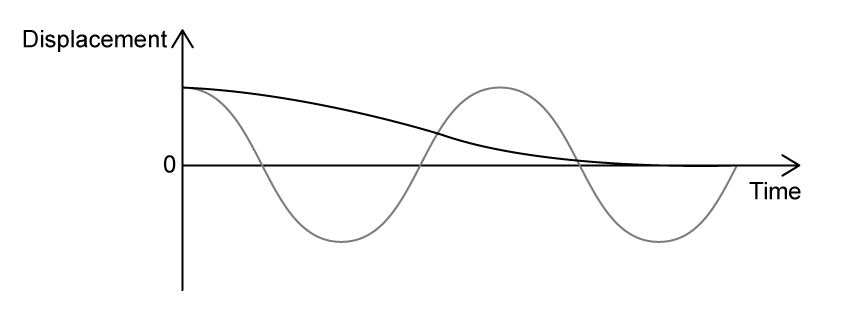
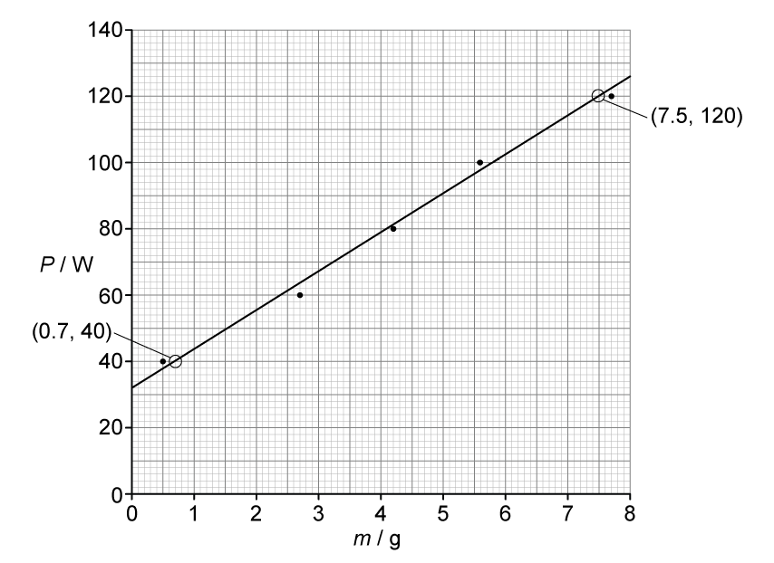

# Mark Schemes — Thermal Energy Transfer
**5. Thermodynamics, Radiation, Oscillations & Cosmology** · Edexcel International A Level (IAL) Physics (YPH11)

## Q1 — medium — 5 marks · structured-questions

### 12() — 5 marks
Deduce whether 4.0 g of ice would be enough to bring the temperature below 58.0 °C:

List the known quantities:

- Mass of hot liquid, $m_{d}$ = 275 g = 275 × 10−3 kg
- Initial temperature of drink, $T_{1}$ = 71.5 °C
- Initial temperature of ice, $T_{i}$ = 0.0 °C
- Final temperature of drink, $T_{2}$ = 58.0 °C
- Specific latent heat of ice, $L_{i}$ = 3.34 × 105 J kg–1
- Specific heat capacity of ‘hot chocolate’, $c_{h}$ = 3750 J kg–1 °C–1
- Specific heat capacity of water, $c_{w}$ = 4190 J kg–1 °C–1

Consider the energy transfer taking place when the ice is added to the hot liquid:

- Energy transferred from hot liquid = energy transferred to ice + energy transferred to cold water **[1 mark]**

Calculate the energy the hot liquid must transfer to cool to 58 °C:

- `E space equals space m c subscript h increment theta space equals space open parentheses 275 space cross times space 10 to the power of negative 3 end exponent close parentheses space cross times space open parentheses 3750 close parentheses space cross times space open parentheses 71.5 space minus space 58 close parentheses space equals space 13922 space straight J`** [1 mark]**

Calculate the energy transferred to melt the ice to cold water:

- `E subscript i space equals space m L subscript i space equals space m space cross times space open parentheses 3.34 space cross times space 10 to the power of 5 close parentheses` **[1 mark]**

Calculate the energy transferred to the cold water as it heats to 58 °C:

- `E subscript w space equals space m c subscript w increment theta space equals space m space cross times space open parentheses 4190 close parentheses space cross times space open parentheses 58 space minus space 0 close parentheses space equals space 243020 m`

Rearrange the expression for energy transfer to calculate the mass of ice, $m$ required to cool the drink to 58 °C:

- `13922 space equals space open parentheses 3.34 space cross times space 10 to the power of 5 close parentheses m space space plus space 243030 m`
- $13922=577030m$
- $m=\frac{13922}{577030}=0.0241\mathrm{kg}=24g$ **[1 mark]**

Write a conclusion:

- From the calculations, 24 g of ice is needed to bring the temperature of the drink below the ideal serving temperature
- So, 4 g of ice is not enough; **[1 mark]**

**[Total: 5 marks]**

- *For the temperature of an object to change **thermal energy** must be transferred*
- *During a **change of state**, energy is transferred through **specific latent heat*
- *In this calculation, it is important to realise that, if the hot drink reaches a temperature of 58 °C, so too will the water from the ice*

## Q2 — medium — 4 marks · structured-questions

### 12() — 4 marks
Calculate the mass of water that was boiled away

List the known quantities:

- specific heat capacity of water, *c* = 4190 J kg−1 K−1
- specific latent heat of vaporisation of water, *L* = 2.26 × 106 J kg−1
- Initial mass of the water, *m*i = 855 g = 855 × 10–3 kg
- Initial temperature of the water, *θ*i = 21.5 °C
- Time taken for the water to heat, *t* 1 = 115 s
- Final temperature of the water, *θ*f = 100 °C
- Time kettle is switched on after water is 100 °C, *t*2 = 175 s

Calculate the energy transferred in the boiling of the water, Δ*E*:

- `increment E space equals space m c increment theta space equals space m c open parentheses theta subscript f space minus space theta subscript i close parentheses`
- `increment E space equals space open parentheses 855 space cross times space 10 to the power of negative 3 end exponent close parentheses space cross times space 4190 space cross times space open parentheses 100 space minus space 21.5 close parentheses space equals space 281.22 space cross times space 10 cubed space straight J` **[1 mark]**

Calculate the power, *P*:

- $P=\frac{\DeltaE}{\Deltat}$
- $P=\frac{281.22\times10^{3}}{115}=2.445\times10^{3}W$ **[1 mark]**

Calculate the mass *m* from the specific latent heat:

- $\DeltaE=mL\Rightarrowm=\frac{\DeltaE}{l}$
- $P=\frac{\DeltaE}{\Deltat}\Rightarrow\DeltaE=P\Deltat$
- `m space equals space fraction numerator increment E space cross times space t space over denominator L end fraction space equals space space fraction numerator open parentheses 2.445 space cross times space 10 cubed close parentheses space space cross times space 175 over denominator 2.26 space cross times space 10 to the power of 6 end fraction space` **[1 mark]**
- $m=0.189\mathrm{kg}$ **[1 mark]**

**[Total: 4 marks]**

- *Consider the two scenarios given in this question:*

  - *The water is heated from an initial temperature until it is boiling (we use the specific heat capacity equation)*
  - *The kettle is left switched on which boils the water away (we use the specific latent heat equation)*
- *The specific capacity equation is used when there is a change in **temperature*
- *The specific latent heat equation is used when there is a change in **phase** / **state*
- *We used the power equation because the only information we were given for the boiling water was the time it was boiled for*
- *However, the energy given to boil that water off is **equal** to the energy transferred from the rise in temperature*

  - *This is because energy **must be conserved*
- *Practice lots of questions where there is a change of state as well as a change of temperature, these are the harder thermal energy transfer equations and come up quite a lot!*

## Q3 — medium — 6 marks · structured-questions

### 13() — 6 marks
The book states that the palace melted completely in less than a day. Deduce whether this statement could be correct:

List the known quantities:

- Volume of chocolate, $V$ = 1250 m3
- Initial temperature of chocolate, $T_{i}$ = 28.5 °C
- Melting point of chocolate, $T_{m}$ = 36.0 °C
- Rate of energy transfer to the palace, $P$ = 7.5 × 105 W
- Density of chocolate, $ρ$ = 1325 kg m−3
- Specific latent heat of chocolate, $L$ = 4.5 × 104 J kg−1
- Specific heat capacity of chocolate, $c$ = 1.30 × 103 J kg−1 K−1

Determine the mass of chocolate in the palace:

- $ρ=\frac{m}{V}$
- $m=ρV=1325\times1250=1.66\times10^{6}\mathrm{kg}$ **[1 mark]**

Determine the energy required to heat the palace to 36.0 °C:

- `straight capital delta E space equals space m c straight capital delta theta space equals space open parentheses 1.66 space cross times space 10 to the power of 6 close parentheses space cross times space open parentheses 1.30 space cross times space 10 cubed close parentheses space cross times space open parentheses 36.0 space minus space 28.5 close parentheses` **[1 mark]**
- $ΔE=1.62\times10^{10}J$

Determine the energy required to melt the palace:

- `straight capital delta E space equals space L straight capital delta m space equals space open parentheses 4.5 space cross times space 10 to the power of 4 close parentheses space cross times space open parentheses 1.66 space cross times space 10 to the power of 6 close parentheses` **[1 mark]**
- $ΔE=7.47\times10^{10}J$

Determine the total energy required to heat and melt the palace:

- `E subscript t o t a l end subscript space equals space open parentheses 1.62 space cross times space 10 to the power of 10 close parentheses space plus space open parentheses 7.47 space cross times space 10 to the power of 10 close parentheses space equals space 9.09 space cross times space 10 to the power of 10 space straight J`

Determine the energy being transferred to the palace over a day:

- $P=\frac{E}{t}$
- `E space equals space P space cross times space t space equals space open parentheses 7.5 space cross times space 10 to the power of 5 close parentheses space cross times space open parentheses 24 space cross times space 60 space cross times space 60 close parentheses` **[1 mark]**
- $E=6.48\times10^{10}J$ **[1 mark]**
- 9.09 × 1010 J needed <u>therefore</u> the palace would not melt completely; **[1 mark]**

**[Total: 6 marks]**

- *For the last stage, you may also calculate the **time** needed to completely melt the palace (33.7 hours) and stated that this is longer than a day*

  - *The final mark needs to be a conclusion based off a **value** - no marks will be awarded for answer simply stating "no, it won't melt"!*

## Q4 — hard — 16 marks · structured-questions

### 1() — 2 marks
> **[mark-scheme]**
> As the car drives over the bumps at a particular speed:
> 
> - The car is driven / forced to oscillate at its natural frequency
> **OR**
> (Resonance occurs because) the driving frequency is the same as the natural frequency (of the car) **[1 mark]**
> 
> - There is a maximum transfer of energy (to the car) **[1 mark]**
> 
> For the first mark, accept any equivalent statement, e.g. the bumps provide a driving frequency equal to the natural frequency of the car.

> **[exam-tip]**
> Many students simply state that "resonance occurs" without explaining the conditions required. Make sure you link the driving frequency (caused by regularly spaced bumps at a particular speed) to the natural frequency of the suspension system. The key idea is that at a specific speed, the frequency at which the car hits bumps matches the natural frequency of the mass-spring system, causing resonance and a large amplitude of oscillation.

### 2() — 4 marks
To calculate the speed at which the car is driven along the road:

- List the known quantities:

  - Mass of person, $m_{1}=65\text{kg}$
  - Mass of empty car, $m_{2}=1100\text{kg}$
  - Compression of springs, $\Deltax=0.8\text{cm}=0.008\text{m}$
  - Distance between bumps, $s=12.0\text{m}$
  - Acceleration due to gravity, $g=9.81\text{m s}^{-2}$
- Calculate the spring constant from the person stepping into the car:

  - The compression of the springs is due to the person's weight
  - The force on the 4 springs is shared between them, so this gives the effective spring constant of the system

$F=k\Deltax=mg$

$k=\frac{mg}{\Deltax}$

$k=\frac{65\times9.81}{0.008}$

$k=79706\text{N m}^{-1}$ **[1 mark]**

- Calculate the period of oscillation when the system is driven at its natural frequency:

$T=2π\sqrt{\frac{m}{k}}$

$T=2π\sqrt{\frac{1165}{79706}}$

$T=0.7596=0.760\text{s}$ **[1 mark]**

- At resonance, the driving frequency equals the natural frequency, so the time between bumps equals the period:

$s=v\timest$

$v=\frac{s}{T}$

$v=\frac{12.0}{0.760}$ **[1 mark]**

$v=$ $15.8\text{m s}^{-1}$ **[1 mark]**

> **[mark-scheme]**
> 1 mark for equating $F=k\Deltax$ and $F=mg$ with $m=65\text{kg}$ to calculate $k$
> 
> 1 mark for use of $T=2π\sqrt{m/k}$ with $m=1165\text{kg}$
> 
> 1 mark for use of $v=s/T$
> 
> 1 mark for a final answer of $16\text{m s}^{-1}$
> 
> - Accept answers given to 2 or 3 s.f.
> 
> Full marks can be awarded for a correct final answer with no working shown.

> **[exam-tip]**
> Be careful with unit conversions: the compression is given in cm, so convert to metres before calculating the spring constant. Also note that the mass used to find the spring constant (the mass of the person, $65\text{kg}$) is different from the mass used to find the natural frequency of the system (the total mass of the car and the person, $1165\text{kg}$). The person must be in the car to drive it over the bumps, so this is why the total mass is required, and not the mass of the car only ($1100\text{kg}$).

### 3() — 2 marks
Sketch a displacement-time graph for a heavily damped suspension system:

**[2 marks]**

> **[mark-scheme]**
> 1 mark for starting the graph at the same positive displacement
> 
> 1 mark for showing amplitude decreasing to zero without oscillating

> **[exam-tip]**
> Car suspensions are deliberately damped close to the critical value so that a bump produces a single controlled return to equilibrium rather than a string of oscillations.

### 4() — 3 marks
> **[mark-scheme]**
> - (Due to its high viscosity) the oil exerts a large resistive force on the piston **[1 mark]**
> - A large amount of work is done (when the piston moves) **[1 mark]**
> - (Heavy damping so) kinetic energy of piston is quickly dissipated to the thermal / internal energy of oil (so the energy of oscillation decreases) **[1 mark]**
> 
> For the first mark, allow reference to $F=6πηrv$
> 
> For the second mark, allow reference to $\DeltaW=F\Deltas$

> **[exam-tip]**
> Make sure you describe the physical process: the piston pushes through the oil, the oil resists the motion, and energy is dissipated. Many students simply state that "the damper reduces oscillations" without explaining the mechanism — this will not gain full marks. Think about the energy transfer: kinetic energy of the moving piston is converted to thermal energy in the oil due to the viscous drag. Also, be specific about why the damping is "heavy" — the high viscosity of the oil means the resistive force is large, so the amplitude decreases rapidly.

### 5() — 5 marks
To assess whether the damper oil exceeds its safe operating limit:

- List the known quantities:

  - Time between bumps, $T=0.7596\text{s}$ (from part b)
  - Travel time, $t=15\text{min}=15\times60=900\text{s}$
  - Mechanical energy transferred to oil, $E_{\text{in}}=90\text{J}$ per bump
  - Rate of heat dissipation, $P_{\text{out}}=80\text{W}$
  - Mass of oil, $m=0.25\text{kg}$
  - Specific heat capacity of oil, $c_{\text{oil}}=1800\text{J kg}^{-1}\text{K}^{-1}$
  - Initial temperature = $20\text{°C}$
  - Maximum temperature = $130\text{°C}$

- Determine the total energy transferred to the oil:

number of bumps $=\frac{t}{T}=\frac{900}{0.7596}=1185$

$E_{\text{in}}=90\times1185=1.07\times10^{5}\text{J}$ **[1 mark]**

- Determine the total energy transferred to the surroundings:

$E_{\text{out}}=P_{\text{out}}\timest$

$E_{\text{out}}=80\times900=7.2\times10^{4}\text{J}$ **[1 mark]**

- Calculate the energy retained in the oil as heat:

$\DeltaE=E_{\text{in}}-E_{\text{out}}$

$\DeltaE=1.07\times10^{5}-7.2\times10^{4}$

$\DeltaE=3.5\times10^{4}\text{J}$ **[1 mark]**

- Calculate the corresponding temperature rise of the oil:

$\DeltaE=mc\Deltaθ$

$\Deltaθ=\frac{\DeltaE}{mc_{\text{oil}}}$

$\Deltaθ=\frac{3.5\times10^{4}}{0.25\times1800}=78\text{°C}$ **[1 mark]**

final temperature $=78+20=98\text{°C}$

- Write a concluding statement:

The final temperature of the oil is $98\text{°C}$, which is less than $130\text{°C}$, so it stays within the safe operating limit during the drive **[1 mark]**

> **[mark-scheme]**
> 1 mark for calculating the total energy transferred to oil ($1.1\times10^{5}\text{J}$)
> 
> 1 mark for calculating the total energy dissipated to the surroundings ($7.2\times10^{4}\text{J}$)
> 
> 1 mark for calculating the net energy retained by the oil ($3.5\times10^{4}\text{J}$)
> 
> 1 mark for use of $\DeltaE=mc\Deltaθ$ to calculate the temperature rise ($78\text{°C}$)
> 
> 1 mark for explicit comparison of the calculated final temperature with $130\text{°C}$ and a clear conclusion
> 
> - Expected conclusion: the temperature does not exceed $130\text{°C}$

> **[exam-tip]**
> For synoptic SHM-thermodynamics questions, work through the energy balance in stages: (1) identify the source of energy (here, dissipated KE), (2) account for losses to the surroundings, (3) apply $\DeltaE=mc\Deltaθ$ to the remaining energy. The calculation here is conservative, as in practice, some energy also heats the metal damper body, slightly reducing the actual oil temperature rise. Even with this caveat, the final temperature is safely below the $130\text{°C}$ limit.

## Q5 — hard — 8 marks · structured-questions

### 1() — 6 marks
To assess the validity of the student’s conclusion:

- Calculate the gradient of the line:

$\mathrm{gradient}=\frac{\DeltaP}{\Deltam}$

$\mathrm{gradient}=\frac{120-40}{7.5-0.7}$ **[1 mark]**

$\mathrm{gradient}=11.76$ **[1 mark]**

- Calculate $L$ from the gradient of the line:

  - Time, $t=75\text{s}$

$\DeltaE=L\Deltam=Pt$

`L space equals space open parentheses fraction numerator increment P over denominator increment m end fraction close parentheses t space equals space text gradient end text cross times t`

$L=11.76\times75$ **[1 mark]**

$L=882\text{J g}^{-1}$

$L=8.82\times10^{5}\text{J kg}^{-1}$ or $0.882\text{MJ kg}^{-1}$ **[1 mark]**

- Identify the alcohol using the table of values and write a concluding statement:

The calculated value for $L$($0.882\text{MJ kg}^{-1}$) indicates the liquid is likely to be ethanol ($0.85\text{MJ kg}^{-1}$), so the student's conclusion is wrong **[1 mark]**

Some of the thermal energy is transferred to the surroundings, which causes the calculated value for $L$ to be higher than the actual value **[1 mark]**

> **[mark-scheme]**
> 1 mark for calculating the gradient of the best fit line
> 
> 1 mark for use of $\text{gradient}=\DeltaP/\Deltam$
> 
> - The first two marks can be awarded for reading $\DeltaP$ from the graph and using it with the corresponding $\Deltam$
> 
> 1 mark for use of $\DeltaE=L\Deltam$ and $P=\DeltaE/\Deltat$
> 
> - Accept use of $L=\text{gradient}\timest$
> 
> 1 mark for a final value of $L=8.82\times10^{5}\text{J kg}^{-1}$
> 
> - Accept answers in the range `open parentheses 8.78 minus 8.86 close parentheses cross times 10 to the power of 5 text  J kg end text to the power of negative 1 end exponent`
> 
> 1 mark for a comparison of the calculated value for $L$ with values in the table and an appropriate conclusion
> 
> - Expected conclusion: the liquid is ethanol (not propanol, so the student is wrong)
> 
> 1 mark for a justification of why the calculated value for $L$ is higher than the value in the table
> 
> - e.g., some thermal energy will be transferred to the surroundings 
> **OR **not all the energy supplied will be used to boil the liquid

### 2() — 2 marks
> **[mark-scheme]**
> - Use (thermal) lagging to insulate the container from the surroundings **[1 mark]**
> - So that a greater proportion of the energy supplied is used to boil the liquid 
> **OR**
> To minimise thermal energy transferred to the surroundings **[1 mark]**

## Q6 — medium — 1 marks · multiple-choice-questions

### 2() — 1 marks
**Correct answer: B** — The heater power was underestimated.

**Final answer:** **The correct answer is ****B ****because:**

- According to the equation for the specific latent heat of vaporisation: $\DeltaE=L\Deltam$

  - Where: $L=\frac{\DeltaE}{\Deltam}$
- $L_{recorded}<L_{actual}$
- Hence, $\DeltaE_{recorded}<\DeltaE_{acutal}$
- $P=\frac{E}{t}$ and $E=Pt$
- So, for $\DeltaE_{recorded}$ to be less then $P$ must also be less
- Hence, the correct answer is **B **

**A **is incorrect as **more energy** is used in the **calculation**, than in** reality**, as energy is lost to the surroundings, so $L_{recorded}$ is higher

**C **is incorrect as when calculating the specific latent heat of vaporisation, it is not necessary to stir the water

**D **is incorrect as in the calculation, more heat than in reality will be applied to the water, so $L_{recorded}$ is higher

## Q7 — medium — 1 marks · multiple-choice-questions

### 1() — 1 marks
**Correct answer: C** — $\frac{800\times300}{2.2\times10^{5}}$

**Final answer:** **The correct answer is C**

- The flat section of the graph (from $t=100\text{s}$ to $t=400\text{s}$) corresponds to the phase change

  - Here, the wax is melting at constant temperature
- The duration of the phase change is:

$\Deltat=400-100=300\text{s}$

- The energy transferred to the wax is:

$\DeltaE=P\Deltat$

$\DeltaE=800\times300$

- For melting, use the latent heat of fusion ($2.2\times10^{5}\text{J kg}^{-1}$)
- Therefore,  the mass of wax that melts can be calculated using:

$\DeltaE=L\Deltam$

$m=\frac{P\Deltat}{L}$

$m=\frac{800\times300}{2.2\times10^{5}}$

**A** is incorrect as this uses the value for the latent heat of vaporisation ($1.6\times10^{6}\text{J kg}^{-1}$), which corresponds to a phase change between liquid and gas.

**B** & **D** are incorrect as these use the time interval $\Deltat=600\text{s}$, which corresponds to the entire interval over which the wax is heated. The calculation should use only the interval over which the wax changes phase, not the intervals where there is a temperature change.

> **[exam-tip]**
> The flat section of a heating curve is where the phase change occurs — temperature does not rise because the energy is being used to break intermolecular bonds, not to increase kinetic energy.
