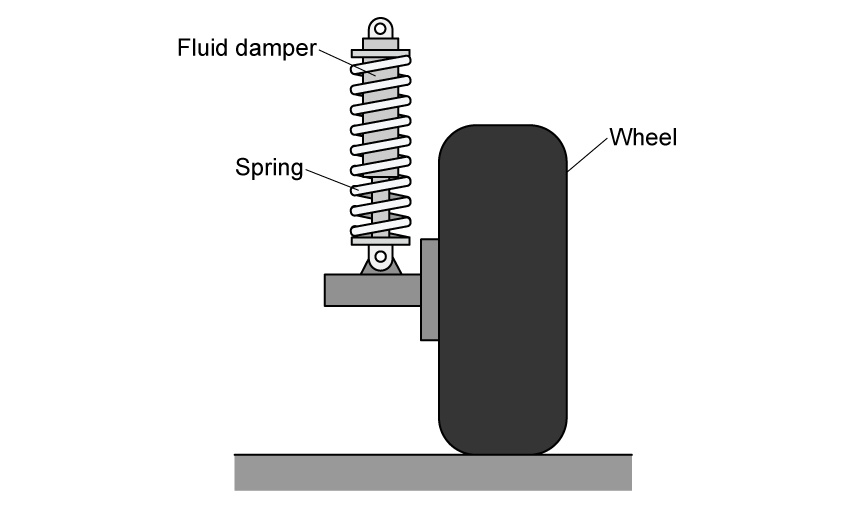
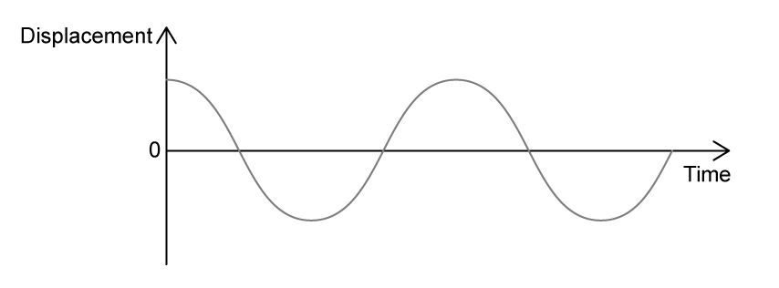
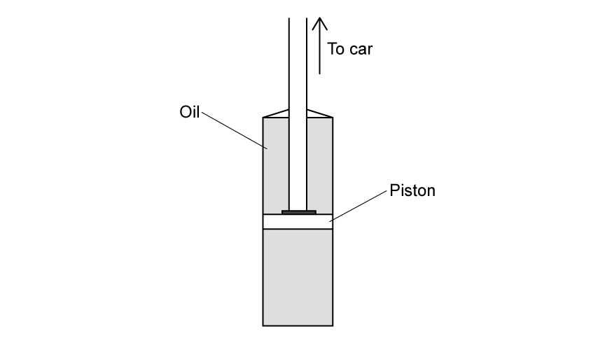
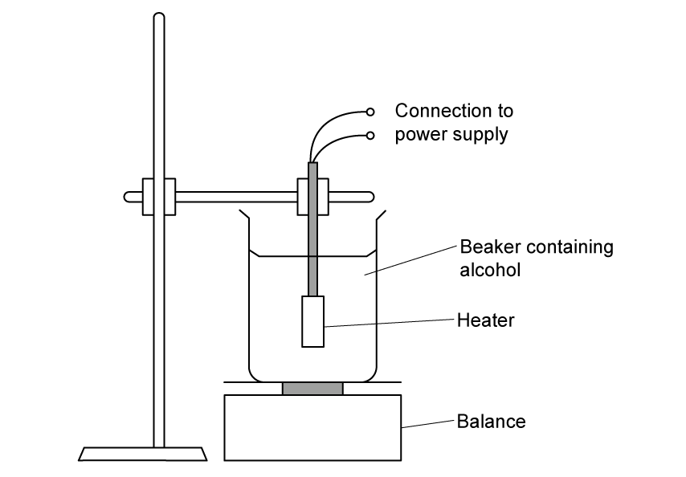
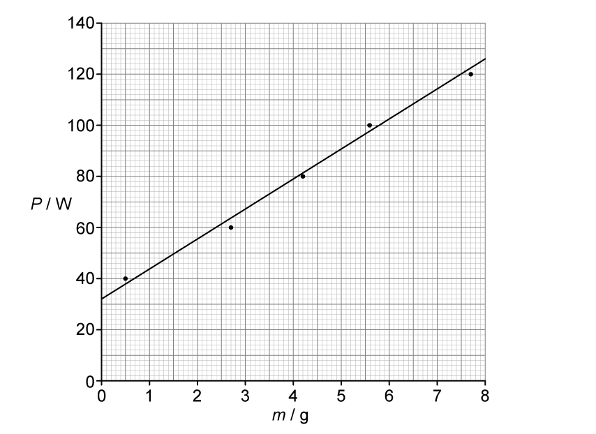

# Exam Questions — Thermal Energy Transfer
**5. Thermodynamics, Radiation, Oscillations & Cosmology** · Edexcel International A Level (IAL) Physics (YPH11)
> Source: [https://www.savemyexams.com/international-a-level/physics/edexcel/19/topic-questions/5-thermodynamics-radiation-oscillations-and-cosmology/thermal-energy-transfer/structured-questions/](https://www.savemyexams.com/international-a-level/physics/edexcel/19/topic-questions/5-thermodynamics-radiation-oscillations-and-cosmology/thermal-energy-transfer/structured-questions/) · 7 questions · total 41 marks

## Q1 — medium — 5 marks · structured-questions

### 12() — 5 marks — command: deduce — structured — from paper 2022 Jan · WPH15/01
Cocoa powder, milk and hot water are mixed together to produce a ‘hot chocolate’ drink. The mass of the drink is 275 g, and its initial temperature is 71.5 °C.

Ice at 0.0 °C is added to the drink to reduce its temperature. Research indicates that the maximum serving temperature of any hot drink should be 58.0 °C.

Deduce whether 4.0 g of ice would be enough to bring the temperature below 58.0 °C.

specific latent heat of ice = 3.34 × 105 J kg–1

specific heat capacity of ‘hot chocolate’ = 3750 J kg–1 °C–1 \

specific heat capacity of water = 4190 J kg–1 °C–1

## Q2 — medium — 4 marks · structured-questions

### 12() — 4 marks — command: calculate — structured — from paper Oct/Nov 2021 · WPH15/01
A kettle was used to heat 855 g of water to boiling point. The initial temperature of the water was 21.5 °C and it took 115 s to heat the water to 100 °C.

The kettle is left switched on for 175 s after the water has reached 100 °C.

Calculate the mass of water that was boiled away.

specific heat capacity of water = 4190 J kg−1 K−1

specific latent heat of vaporisation of water = 2.26 × 106 J kg−1

Mass of water that was boiled away = .........................................

## Q3 — medium — 6 marks · structured-questions

### 13() — 6 marks — command: deduce — structured — from paper June 2021 · WPH15/01
In the book Charlie and the Chocolate Factory, a palace is made entirely from chocolate.

Soon after it was made the palace melted, due to energy transfer from the Sun.

The total volume of chocolate used for the palace was 1250 m3. The initial temperature of the chocolate palace was 28.5°C. Chocolate melts at a temperature of 36.0°C.

The book states that the palace melted completely in less than a day.

Deduce whether this statement could be correct.

rate of energy transfer to the palace = 7.5 × 105 W

density of chocolate = 1325 kg m−3

specific latent heat of chocolate = 4.5 × 104 J kg−1

specific heat capacity of chocolate is 1.30 × 103 J kg−1 K−1

## Q4 — hard — 16 marks · structured-questions

### 1() — 2 marks — command: explain — structured
A car suspension system includes a spring and a fluid damper attached to each wheel, as shown.

When the car is driven over a bump in the road, it oscillates vertically with simple harmonic motion. On a long stretch of road with equally spaced bumps, the amplitude of the oscillations increases at a particular speed.

Explain why the amplitude of vertical oscillations becomes very large at a particular speed.

### 2() — 4 marks — command: calculate — structured
When a person of mass $65\text{kg}$ steps into the car, the vertical height of the car above the road decreases by $0.8\text{cm}$.

The greatest amplitude of oscillation occurs when the bumps are spaced $12.0\text{m}$ apart.

Calculate the speed at which the car is driven along the road. You should consider the car as a mass‑spring system.

mass of empty car = $1100\text{kg}$

### 3() — 2 marks — command: sketch — structured
The oscillations are heavily damped by the fluid dampers on each wheel.

The graph shows how the vertical displacement of the car varies with time for an undamped suspension system after it passes over a bump in the road.

Sketch, on the axes below, a graph to show how the vertical displacement of the car varies with time for the damped system over the same time interval.

### 4() — 3 marks — command: explain — structured
The fluid damper consists of a piston moving within a cylinder filled with oil. The oil has a high viscosity.

Explain how the fluid dampers produce heavy damping.

### 5() — 5 marks — command: assess — structured
Each fluid damper contains $0.25\text{kg}$ of oil. Every time the car passes over a bump, $90\text{J}$ of mechanical energy is transferred to the oil in each damper.

The car is driven along the bumpy road for $15\text{minutes}$. Heat is lost from the damper to the surrounding air at a steady rate of $80\text{W}$ during operation.

The damper oil has a safe operating limit of $130\text{°C}$.

Assess whether the damper oil exceeds its safe operating limit during the drive.

specific heat capacity of damper oil = $1800\text{J kg}^{-1}\text{K}^{-1}$

temperature of surroundings = $20\text{°C}$

## Q5 — hard — 8 marks · structured-questions

### 1() — 6 marks — command: comment — structured
A student carried out an experiment to determine the latent heat of vaporisation of an unknown alcohol.

The student used an electrical heater to boil the alcohol in a beaker. She connected the heater to a circuit and adjusted the power $P$ supplied to the heater by varying the potential difference and current in the circuit.

When the alcohol was at its boiling point, the student monitored the change in mass $m$ of alcohol in the beaker over a period of $75\text{s}$. She repeated the experiment for different values of power $P$ supplied to the heater and plotted her results on the graph.

The student used her graph to determine a value for the latent heat of the alcohol in the beaker. She concluded that the alcohol was propanol.

| Liquid | Latent heat of vaporisation / $\text{MJ kg}^{-1}$ |
|---|---|
| methanol | $1.10$ |
| ethanol | $0.85$ |
| propanol | $0.79$ |
| butanol | $0.58$ |

Comment on the validity of the student’s conclusion.

### 2() — 2 marks — command: explain — structured
Explain one modification to this method which would improve the accuracy of the student's conclusion.

## Q6 — medium — 1 marks · multiple-choice-questions

### 2() — 1 mark — multiple_choice — from paper 2022 Jan · WPH15/01
In an experiment to determine the specific latent heat of vaporisation of water *L*V , a student used an electrical heater to boil water in a beaker.

The experimental data gave *L*V = 2.20 MJ kg–1. The textbook value of *L*V is 2.26 MJ kg–1.

Which of the following could be an explanation for this difference in the values of *L*V?
- **A.** Some energy is transferred to the surroundings.
- **B.** The heater power was underestimated.
- **C.** The student did not stir the water.
- **D.** The heater is inefficient.

## Q7 — medium — 1 marks · multiple-choice-questions

### 1() — 1 mark — multiple_choice
A sample of wax is heated at a constant rate of $800W$. The graph shows how the temperature of the wax changes with time.

A data book contains the following information for wax:

- latent heat of fusion of wax = $2.2\times10^{5}\text{J kg}^{-1}$
- latent heat of vaporisation of wax = $1.6\times10^{6}\text{J kg}^{-1}$

Which of the following shows how to calculate the mass of wax that melts?
- **A.** $\frac{800\times300}{1.6\times10^{6}}$
- **B.** $\frac{800\times600}{1.6\times10^{6}}$
- **C.** $\frac{800\times300}{2.2\times10^{5}}$
- **D.** $\frac{800\times600}{2.2\times10^{5}}$
