# Mark Schemes — Practical Skills II: Analysis
**6. Practical Skills in Physics II** · Edexcel International A Level (IAL) Physics (YPH11)

## Q1 — medium — 16 marks · structured-questions

### 4((a)) — 4 marks
i) Two techniques she should use when measuring *p* and *q *are:

Any **two** from:

- Ensure the metre rule is vertical using a set square; **[1 mark]**
- Ensure the end of the rod is close to the metre rule **OR **use a set square to read off the values; **[1 mark]**
- Take readings perpendicular to the scale (to avoid parallax); **[1 mark]**

ii) The uncertainty in this value is given as 1 mm because:

- The uncertainty of a single reading is half the resolution of the metre rule, (which is 0.5 mm); **[1 mark]**
- As the two readings are subtracted, the uncertainties are added; **[1 mark]**

**[Total: 4 marks]**

- *Parallax errors occur when readings are not read at the same **angle** each time from a ruler, for example*

  - *The way to avoid this is to read the values at the same position everytime (preferably at eye level or perpendicular to the scale)*

### 4((b)) — 6 marks
i) The most appropriate instrument the student should use to measure *d *is a:

- Micrometer screw gauge (with a resolution of 0.01mm) **OR **digital caliper; **[1 mark]**
- As this would produce an uncertainty of 0.25 % which is small; **[1 mark]**

ii) One technique that she should use to measure *d *is:

**EITHER**

- Repeat at different orientations and calculate a mean; **[1 mark]**
- To reduce the effect of <u>random errors;</u> **[1 mark]**

**OR**

- Check (and correct) for zero error; **[1 mark]**
- To eliminate <u>systematic error;</u> **[1 mark]**

iii) Calculate the mean value of *d* in mm and its uncertainty

Calculate the mean of *d*:

- $meanofd=\frac{2.35+2.37+2.34+2.34+2.33}{5}=2.35\mathrm{mm}$ **[1 mark]**

Calculate the uncertainty in *d*:

- `u n c e r t a i n t y space i n space d italic space italic equals italic space plus-or-minus 1 half open parentheses r a n g e close parentheses space equals plus-or-minus 1 half open parentheses 2.37 space minus space 2.33 close parentheses space equals space 0.02 space mm space`**[1 mark]**

**[Total: 6 marks]**

- *You must remember how to calculate the uncertainty of a **mean** - this is very commonly forgotten!*
- *To calculate the % uncertainty in the micrometer screw gauge:*

  - *The absolute uncertainty in the micrometer is *$\frac{1}{2}$* the smallest reading (0.01 mm) = 0.005 mm*
  - *The % uncertainty is therefore *`fraction numerator 0.005 over denominator 2 end fraction space cross times space 100 thin space percent sign equals space 0.25 space percent sign`

### 4((c)) — 2 marks
Determine a value of *G* for steel in N m−2

List the known quantities:

- *m* = 100g with negligible uncertainty
- *l* = 58.9 cm = 58.9 × 10–2 m
- *x* = 10.3 cm = 10.3 × 10–2 m
- *y* = 26 mm = 26 × 10–3 m
- *d* = 2.45 mm (from part b) = 2.45 × 10–3 m

Substitute the values into the equation for *G*:

- `G space equals fraction numerator 32 m g l x squared over denominator pi y d to the power of 4 end fraction space equals space fraction numerator 32 space cross times space open parentheses 100 space cross times space 10 to the power of negative 3 end exponent close parentheses space cross times space 9.81 space cross times space open parentheses 58.9 space cross times space 10 to the power of negative 2 end exponent close parentheses space cross times space open parentheses 10.3 space cross times space 10 to the power of negative 2 end exponent close parentheses squared space over denominator straight pi space cross times space open parentheses 26 space cross times space 10 to the power of negative 3 end exponent close parentheses space cross times open parentheses space 2.35 space cross times space 10 to the power of negative 3 end exponent close parentheses to the power of 4 end fraction`**[1 mark]**
- $G=7.874\times10^{10}=7.9\times10^{10}Nm^{-2}$ **[1 mark]**

**[Total: 2 marks]**

- *The number of significant figures in your final answer is very important - it should be to 2 or 3 s.f. as this is the number of significant figures of the values used to calculate **G*
- *The uncertainties in **G** are a red herring - the question only asks for the **value**, not its uncertainty as well*

  - *You can check whether you need to do this by the number of marks as well*
- *Giving just the final answer of **G **without showing your calculation will **not** gain **any** marks. You always need to show your working out!*

### 4((d)) — 4 marks
Deduce whether the data provided in part (c) would allow the student to determine the type of steel the rod was made from

List the known quantities:

- *m* = 100g with negligible uncertainty
- *l* = 58.9 cm ± 0.1 cm
- *x* = 10.3 cm ± 0.1 cm
- *y* = 26 mm ± 1mm
- *d* = 2.35 mm ± 0.02 mm
- *G* = 7.87 × 1010 N m–2

Calculate the uncertainty in *G*:

- The only values with an uncertainty are *l*, *x*, *y* and *d*
- `percent sign increment G space equals space percent sign increment l space plus space 2 space percent sign increment x space plus space percent sign increment y space plus space 4 percent sign increment d`
- `percent sign increment G space equals open parentheses space open parentheses fraction numerator 0.1 over denominator 58.9 end fraction close parentheses space plus space 2 space open parentheses fraction numerator 0.1 over denominator 10.3 end fraction close parentheses space plus space open parentheses 1 over 26 close parentheses space plus space 4 open parentheses fraction numerator 0.02 over denominator 2.35 end fraction close parentheses space close parentheses space cross times space 100 space percent sign` **[1 mark]**
- `percent sign increment G space equals space 9.362 space equals space 9.4 space percent sign` **[1 mark]**

Calculate the upper and lower limits of *G*:

- `u p p e r space l i m i t space equals space open parentheses 7.87 space cross times space 10 to the power of 10 close parentheses space cross times space open parentheses 1 space plus space 0.094 close parentheses space equals space 86.1 space cross times space 10 to the power of 9 space straight N space straight m squared`

**AND**

- `l o w e r space l i m i t space equals space open parentheses 7.87 space cross times space 10 to the power of 10 close parentheses space cross times space open parentheses 1 space minus space 0.094 close parentheses space equals space 71.3 space cross times space 10 to the power of 9 space straight N space straight m squared` **[1 mark]**

Conclusion:

- As both values fall within this range, the student cannot determine which type of steel the rod is made from; **[1 mark]**

**[Total: 4 marks]**

- *You can also do this question by using the uncertainties to calculate the maximum and minimum values of **G*
- *In both ways, you must always write a **conclusion **at the end with your final deduction to answer the question - this is vital for full marks, but just doing the calculations is not enough!*

- *You must be confident in calculating uncertainties*

  - *When values are **multiplied** or **divided** you must **add** their **percentage **uncertainties (%Δ)*
  - `percent sign space u n c e r t a i n t y space space equals space fraction numerator u n c e r t a i n t y space over denominator m e a s u r e d space v a l u e end fraction space cross times space 100 space percent sign`
- *However, when you want to find the upper and lower limits, you must change these back into decimals*

  - *9.4 % = 0.094*
- *Therefore, the upper limit is a 9.4 % **increase** and the lower limit is a 9.4 % **decrease** from the measured value of **G*
- *You **must** be confident in converting between fractions and decimals, and finding the percentage decrease and increase of a value*

  - *Make sure you revise these in the maths revision notes if you're stuck*

## Q2 — medium — 15 marks · structured-questions

### 3((a)) — 4 marks
The student should use the oscilloscope to identify the resonant frequency and determine its value by:

- (Adjust the signal generator to find) trace with the maximum amplitude;** [1 mark]**
- Count the number of divisions between two (adjacent) peaks;** [1 mark]**
- Multiply by the time per division;** [1 mark]**
- Calculate frequency as $\frac{1}{T}$ **[1 mark]**

**[Total: 4 marks]**

### 3((b)) — 11 marks
i) Plot a graph of log *f* against log*V* on the grid opposite. Use the additional columns in the table to record your processed data

Complete the table:

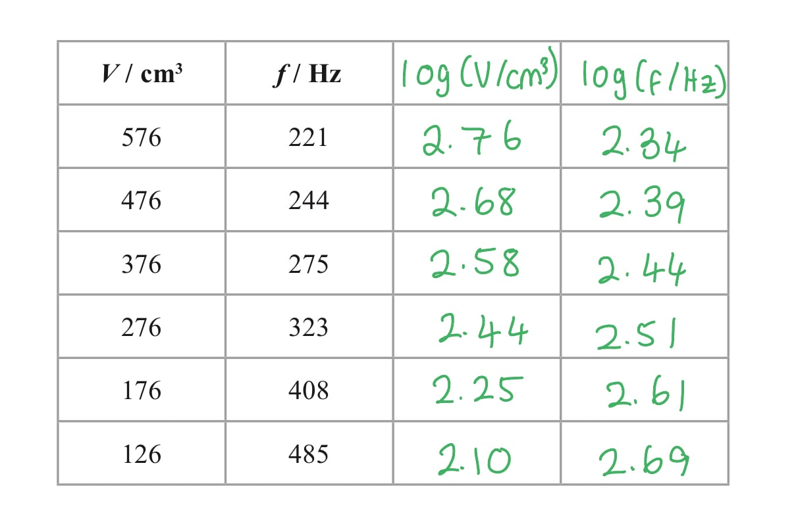

- All log *V* values correct to 2 d.p. **[1 mark]**
- All log *f *values correct to 2 d.p. **[1 mark]**

Plot the graph:

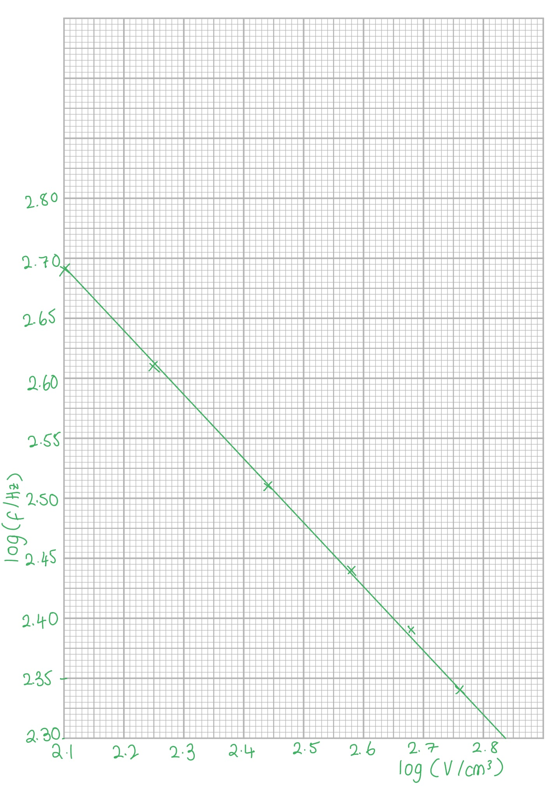

- Axes labelled: *y* as log(*f* / Hz) and *x* as log(*V* / cm3); **[1 mark]**
- Correct scales for both axes; **[1 mark]**
- Plots accurate to ± 1mm **[1 mark]**
- Best fit line with even spread of plots; **[1 mark]**

ii) Discuss whether the graph supports this suggestion

Write the equation in the form *y* = *mx* + *c*:

- $\mathrm{log}f=\mathrm{log}k-\frac{1}{2}\mathrm{log}V$**[1 mark]**

  - *y* = log *f*
  - *m* = $-\frac{1}{2}$
  - *x* = log *V*
  - *c* = log *k*
- The gradient is $-\frac{1}{2}$ **[1 mark]**

Calculate the gradient of the graph drawn:

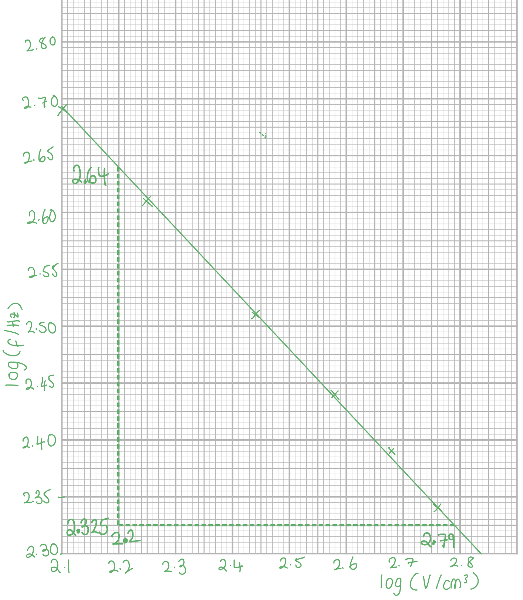

- $gradient=\frac{\Delta\mathrm{log}f}{\Delta\mathrm{log}V}=\frac{2.64-2.325}{2.2-2.79}$**[1 mark]**
- $gradient=-0.5339=-0.54$ **[1 mark]**

Conclusion:

- Since the expected gradient from the equation is –0.5 and the calculated gradient is –0.54 (0.5 to 1 s.f.), the graph supports this suggestion; **[1 mark]**

**[Total: 11 marks]**

- *Longer graphical and table questions are in every practical paper and the skills required in the questions are always similar*
- *When completing the 'log' values in the table, these must be to 2 decimal places (same as 3 s.f) at the maximum*

  - *This is because the values of **V** and **f** have been given to 3 s.f. and we cannot be more precise than this*
- *Make sure you label log(variable / unit) and **not** log(variable)/unit*

  - *Logs do **not** have units, but the variable you are putting in the log function does*
- *Remember the scales on the graph **do not need to start at 0*
- *Don't lose easy marks for things such as labelling the graph*

- *Relating equations to the form **y** = **mx** + **c** is a **very** common practical skill and you must be confident working with logs to achieve this*

  - *The log rules used in this question are: *`l o g space open parentheses a space cross times space b close parentheses space equals space l o g a space plus thin space l o g b`* and *$logx^{a}=alogx$
- *The reason log **k** is **c** is because we are told **k **is a constant (so log **k** must also be a constant)*

  - *Also, **y** must be the variable on the **y** axis plotted and the same for **x*

## Q3 — medium — 16 marks · structured-questions

### 3((a)) — 2 marks
Two precautions that should be taken when using this source are:

Any **two** from:

- Handle the source using long tongs;** [1 mark]**
- Keep the source in a lead-lined box when not in use; **[1 mark]**
- Maintain a distance from the source when in use; **[1 mark]**
- Use the source for as short a time as possible; **[1 mark]**

**[Total: 2 marks]**

- *Answers relating to PPE will not be accepted*

### 3((b)) — 2 marks
The background count rate should be measured because:

- Background count rate should be subtracted from measured count rate; **[1 mark]**
- Background radiation adds a constant amount to the overall count rate **OR** it is a systematic error; **[1 mark]**

**[Total: 2 marks]**

### 3((c)) — 2 marks
A graph of ln *C* against *t* can be used to determine a value for *λ* by:

- The gradient of the graph is –*λ ***[1 mark]**
- As ln* C = *ln* C*0* – λt *is in the form* y = c + mx / y* = *mx* + *c ***[1 mark]**

**[Total: 2 marks]**

- *If you are unsure as to how to achieve the equation linking ln **C** and **t**, take a look at the following sketch*

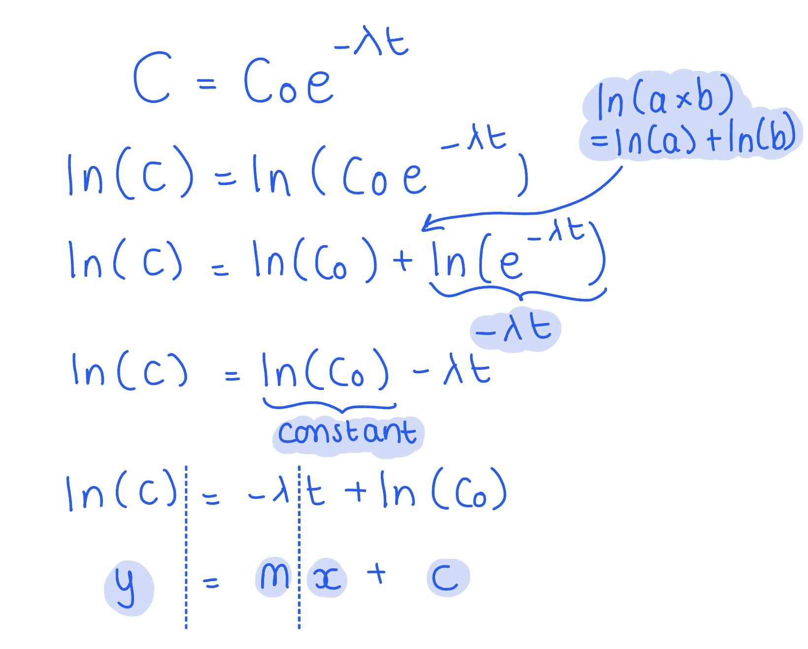

### 3((d)) — 10 marks
i) Plot a graph of ln *C* against *t* on the grid opposite. Use the additional column in the table to record your processed data

Complete the table with value of ln *C*:

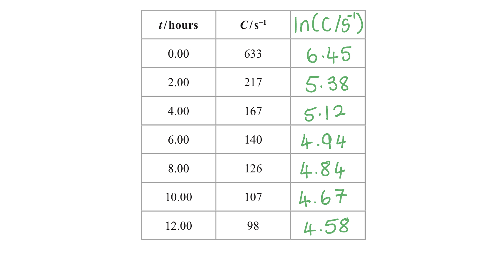

- ln* C* values correct to 2 d.p. **[1 mark]**

Plot the graph:

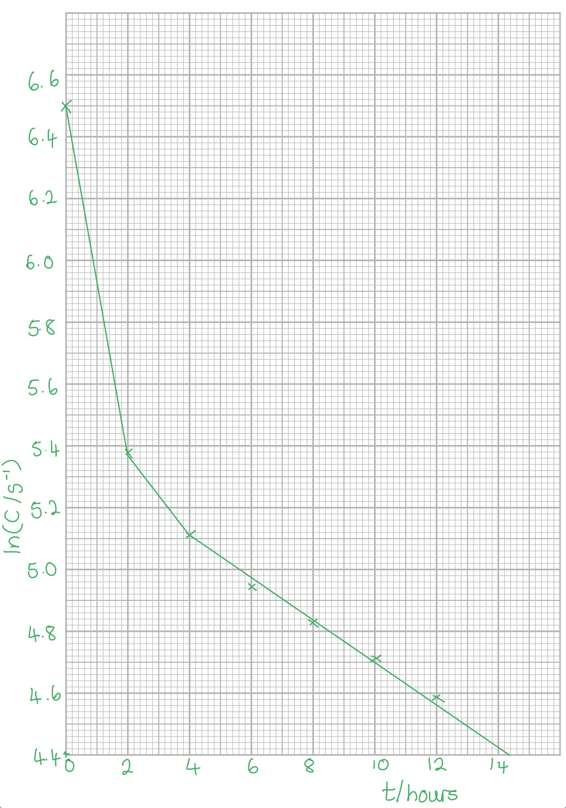

- Axes labelled: *y *as ln(C / s–1 ) and *x* as *t* / hours **[1 mark]**
- Most appropriate scales for both axes; **[1 mark]**
- Plots accurate to ± 1 mm **[1 mark]**
- Straight best fit line with even spread of plots in region t ≥ 4 hours **[1 mark]**

ii) Determine a value of *λ*, in hours−1, for isotope Y

Calculate the gradient of the graph:

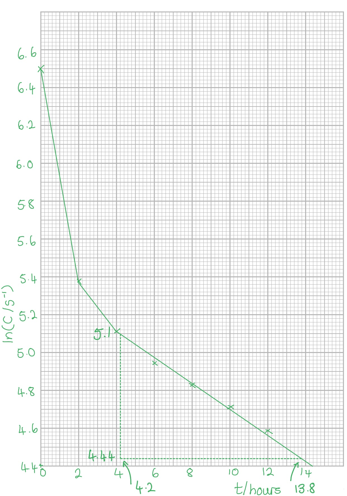

- Large triangle shown; **[1 mark]**
- $gradient=-λ=\frac{5.10-4.44}{4.2-13.8}=-0.06875$**[1 mark]**
- $λ=0.069\mathrm{hr}^{-1}$ **[1 mark]**

iii) Hence determine the half-life *t*1⁄2 for isotope Y

List the known quantities:

- Decay constant, *λ *= 0.069 hr–1 (from part ii)

Calculate the half-life, *t*1⁄2 :

- $λ=\frac{\mathrm{ln}2}{t_{\frac{1}{2}}}\Rightarrowt_{\frac{1}{2}}=\frac{\mathrm{ln}2}{λ}$
- $t_{\frac{1}{2}}=\frac{\mathrm{ln}2}{0.069}$**[1 mark]**
- $t_{\frac{1}{2}}=10\mathrm{hours}$ **[1 mark]**

**[Total: 10 marks]**

- *Longer graphical and table questions are in every practical paper and the skills required in the questions are always similar*
- *When completing the 'ln' values in the table, these must be to 2 decimal places (same as 3 s.f) at the maximum*

  - *This is because the values of **t **and **C** have been given to 3 s.f. and we cannot be more precise than this*
- *Make sure you label ln(variable / unit) and **not** ln(variable)/unit*

  - *Natural logs do **not** have units, but the variable you are putting in the log function does*
- *Remember the scales on the graph **do not need to start at 0*
- *Don't lose easy marks for things such as labelling the graph*

- *Make sure you only calculate the gradient of the **straight part** of the graph*

## Q4 — medium — 18 marks · structured-questions

### 4((a)) — 4 marks
i) Two precautions she should take to ensure the measurement is as accurate as possible are:

Any **two** from:

- Place the rule as close as possible to the ramp; **[1 mark]**
- Use a set square to ensure the rule is vertical **OR **use a spirit level to ensure the rule is vertical; **[1 mark]**
- Ensure the rule reads zero at the bench; **[1 mark]**
- Read the scale perpendicularly **OR **use a set square to read the value from the scale; **[1 mark]**

ii) The uncertainty in Δ*h* is 1 mm because:

- The uncertainty of each measurement is half the resolution of the ruler (which is 0.5 mm) **OR **the resolution of the ruler is 1 mm so the uncertainty is 0.5 mm **[1 mark]**
- As values of *h* are subtracted the uncertainty is 0.5 mm + 0.5 mm = 1 mm **OR** 2 × 0.5 mm = 1 mm **[1 mark]**

**[Total: 4 marks]**

- *The absolute uncertainty in the Δ**h** is *$\frac{1}{2}$* the smallest reading (1 mm) = 0.5 mm*
- *When you take a measurement, you place the '0' of your ruler from the start of the length you want to measure*

  - *You then read the final measurement*
  - *Technically, the final value is always 'final measurement – 0' *
- *Each of these measurements, including 0, has an uncertainty of 0.5 mm*
- *Therefore, the combination of the two to get calculate **h** is the **addition** of the absolute uncertainties *

### 4((b)) — 4 marks
i) Calculate the mean value of *t* and its uncertainty

Calculate the mean value:

- $Meant=\frac{2.10+1.86+1.94+1.89}{4}=1.9475=1.95s$**[1 mark]**

Calculate its uncertainty:

- `u n c e r t a i n t y space i n space t italic space italic equals italic space plus-or-minus 1 half open parentheses r a n g e close parentheses space equals plus-or-minus 1 half open parentheses 2.10 space minus space 1.86 close parentheses space equals space 0.12 space straight s space`**[1 mark]**

** **

ii) This might improve the measurement of *t *because:

- The values of* t *will increase **OR** the cylinder will move more slowly; **[1 mark]**

Any **one **from:

- So the percentage uncertainty in t will reduce; **[1 mark]**
- It will be easier to judge when the cylinder crosses the finish line; **[1 mark]**
- The effect of reaction time will be reduced; **[1 mark]**

**[Total: 4 marks]**

- *You must remember how to calculate the uncertainty of a **mean** - this is very commonly forgotten!*

### 4((c)) — 4 marks
Compare the accuracy and precision of the data that each student collected

- Both have the same level of accuracy as the means are the same; **[1 mark]**
- But it cannot be told whether they are close to the true value; **[1 mark]**
- Student B has a smaller range than student A; **[1 mark]**
- Therefore student B is more precise; **[1 mark]**

**[Total: 4 marks]**

### 4((d)) — 6 marks
i) Determine a value for *g*

List the known quantities:

- *t* = 2.44 s
- *s* = 80.0 cm = 80.0 × 10–2 m
- Δ*h* = 43 mm

Calculate *g*:

- $t^{2}=\frac{4s^{2}}{g\Deltah}\Rightarrowg=\frac{4s^{2}}{\Deltaht^{2}}$
- `g space equals space fraction numerator 4 space cross times space open parentheses 80 space cross times space 10 squared close parentheses squared space over denominator open parentheses 43 space cross times space 10 to the power of negative 3 end exponent close parentheses space cross times space open parentheses 2.44 close parentheses squared end fraction` **[1 mark]**
- $g=9.9998=10.0ms^{-2}$ **[1 mark]**

ii) Determine the percentage uncertainty in the value of *g*

List the known quantities:

- *t* = 2.44 s ± 0.04 s
- *s* = 80.0 cm ± 0.1 cm
- Δ*h* = 43 mm ± 1 mm

Calculate percentage uncertainty in *g*:

- `percent sign increment g space equals space 2 percent sign increment s space plus space space percent sign increment open parentheses increment h close parentheses space plus space 2 percent sign increment t space`
- `percent sign increment g space equals open parentheses space 2 open parentheses fraction numerator 0.1 over denominator 80.0 end fraction close parentheses space plus space open parentheses 1 over 43 close parentheses space plus space 2 open parentheses fraction numerator 0.04 over denominator 2.44 end fraction close parentheses space close parentheses space cross times space 100 space percent sign` **[1 mark]**
- `percent sign increment g space equals space 5.854 space equals space 5.9 space percent sign` **[1 mark]**

iii) Deduce whether the value of *g* is accurate

Calculate the lower limit of *g*:

- `l o w e r space l i m i t space equals space open parentheses 10.0 close parentheses space cross times space open parentheses 1 space minus space 0.059 close parentheses space equals space 9.41 space straight m space straight s to the power of negative 2 end exponent` **[1 mark]**

Write a conclusion:

- The accepted value of *g* is 9.81 m s–2 so as this lies within the lower limit of *G*, the value is accurate; **[1 mark]**

**[Total: 6 marks]**

- *You can also do this question by using the uncertainties to calculate the minimum value of **g*
- *You must always write a **conclusion **at the end with your final deduction to answer the question - this is vital for full marks, but just doing the calculations is not enough!*

- *You must be confident in calculating uncertainties*

  - *When values are **multiplied** or **divided** you must **add** their **percentage **uncertainties (%Δ)*
  - `percent sign space u n c e r t a i n t y space space equals space fraction numerator u n c e r t a i n t y space over denominator m e a s u r e d space v a l u e end fraction space cross times space 100 space percent sign`
- *However, when you want to find the upper and lower limits, you must change these back into decimals*

  - *5.9 % = 0.059*
- *Therefore, the lower limit is a 9.4 % **decrease** from the measured value of **g **(we did not need to find the upper limit because we already know that 9.81 < 10.0)*
- *You **must** be confident in converting between fractions and decimals and finding the percentage decrease and increase of a value*

  - *Make sure you revise these in the maths revision notes if you're stuck*

## Q5 — medium — 7 marks · structured-questions

### 1((a)) — 3 marks
Describe how a value of the time period should be determined from these pulses:

- Measure the number of divisions between the same points on the pulses; **[1 mark]**
- Multiply the number of divisions by the time per division; **[1 mark]**
- Measure between the first and last pulse and divide by two **OR**
- Measure between successive pulses and determine a mean; **[1 mark]**

**[Total: 3 marks]**

### 1((b)) — 4 marks
Explain which of these scales would display two complete pulses on the screen:

List the known quantities:

- Wheel diameter, *D* = 25.4 cm
- Speed of the magnet = 22.2 ms–1

Calculate the time for one complete rotation of the wheel:

- $T=\frac{2π}{ω}$and $v=ωr$
- Therefore, `T equals fraction numerator 2 pi over denominator v over r end fraction equals fraction numerator 2 pi r over denominator v end fraction equals fraction numerator 2 pi cross times open parentheses fraction numerator 25.4 over denominator 2 end fraction close parentheses over denominator 22.2 end fraction`**[1 mark]**
- *T* = 35.9 ms **[1 mark]**

Comment on the link between number of divisions on the screen and the time period:

- The screen is 10 divisions wide, so each division would need to be at least 3.59 ms to observe 2 pulses; **[1 mark]**
- Therefore a setting of 5 ms per division should be used as 2 ms per division is too small; **[1 mark]**

**[Total: 4 marks]**

## Q6 — medium — 18 marks · structured-questions

### 3((a)) — 4 marks
i) Describe how to modify the equipment to make the measurements as accurate as possible:

- Place a (timing) marker on the bench; **[1 mark]**
- (The marker) should be directly below a specific point on the trolley when it is at the equilibrium position; **[1 mark]**

ii) Describe two techniques he should use to reduce the uncertainty in the value of the time period:

Any two from:

- Time multiple oscillations and divide by the number of oscillations; **[1 mark]**
- Repeat and calculate a mean; **[1 mark]**
- Start timing after several oscillations have completed; **[1 mark]**

**[Total: 4 marks]**

### 3((b)) — 14 marks
i) Plot a graph of log *T* against log *M*:

Complete the table:

| ***M***** / kg** | ***T***** / s** | **Final answer:** **log (M / kg)** | **Final answer:** **log (T / s)** |
|---|---|---|---|
| 0.800 | 0.78 | **Final answer:** **−0.10** | **Final answer:** **−0.11** |
| 1.300 | 1.01 | **Final answer:** **0.11** | **Final answer:** **0.00** |
| 1.800 | 1.18 | **Final answer:** **0.26** | **Final answer:** **0.07** |
| 2.300 | 1.34 | **Final answer:** **0.36** | **Final answer:** **0.13** |
| 2.800 | 1.49 | **Final answer:** **0.45** | **Final answer:** **0.17** |
| 3.300 | 1.60 | **Final answer:** **0.52** | **Final answer:** **0.20** |

- Log *T* values correct and consistent to 2 d.p; **[1 mark]**
- Log *M* values correct and consistent to 2 d.p; **[1 mark]**

Plot the graph:

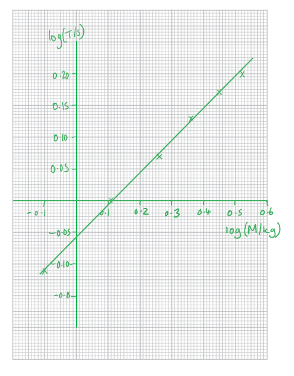

- Axes labelled: y as log (*T* / s) and x as log (*M* / kg); **[1 mark]**
- A scale which covers more than 50% of the available graph paper; **[1 mark]**
- Plots accurate to ± 1mm; **[1 mark]**
- Best fit line with even spread of plots; **[1 mark]**

ii) Discuss the validity of the prediction:

Take logs of both sides of the equation $T=2π\sqrt{\frac{M}{k}}$

- `log space open parentheses T close parentheses equals log space open parentheses fraction numerator 2 pi over denominator square root of k end fraction close parentheses plus 1 half log space open parentheses M close parentheses` **[1 mark]**
- This is in the form $y=mx+c$ with a gradient of 0.5 **[1 mark]**

  - `y equals log space open parentheses T close parentheses`
  - $m=0.5$
  - `x equals log space open parentheses M close parentheses`
  - $c=$`log space open parentheses fraction numerator 2 pi over denominator square root of k end fraction close parentheses`

Calculate the gradient from the graph:

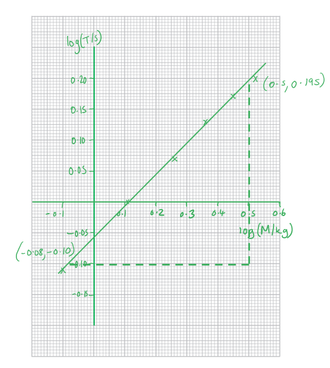

- Large triangle used; **[1 mark]**
- `g r a d i e n t equals fraction numerator open parentheses 0.195 minus negative 0.10 close parentheses over denominator open parentheses 0.5 minus negative 0.08 close parentheses end fraction equals 0.51` (range 0.47 to 0.54) **[1 mark]**

Comment on this value:

- As the gradient is approximately 0.5 the prediction is valid; **[1 mark]**

iii) Determine the value of k:

Read the y-intercept from the graph:

- −0.06 **[1 mark]**

Calculate k:

- $\mathrm{log}\frac{2π}{\sqrt{k}}=-0.06$
- $\frac{2π}{\sqrt{k}}=10^{-0.06}=0.87$ **[1 mark]**
- `k equals open parentheses fraction numerator 2 pi over denominator 0.087 end fraction close parentheses squared`
- k = 52 kg s−1 **[1 mark]**

**[Total: 14 marks]**

- *Longer graphical and table questions are in every practical paper and the skills required in the questions are always similar*

- *When completing the 'log' values in the table, these must be to 2 decimal places at the maximum*

  - *This is because the values of **V** and **f** have been given to 2 d.p. at the minimum and we cannot be more precise than this*

- *Make sure you label log(variable / unit) and **not** log(variable)/unit*

  - *Logs do **not** have units, but the variable you are putting in the log function does*

- *Remember the scales on the graph **do not need to start at 0*

- *Don't lose easy marks for things such as labelling the graph*

> * *

- *Relating equations to the form **y** = **mx** + **c** is a **very** common practical skill and you must be confident working with logs to achieve this*

  - *The log rules used in this question are: *`l o g space open parentheses a space cross times space b close parentheses space equals space l o g a space plus thin space l o g b`* and *$logx^{a}=alogx$

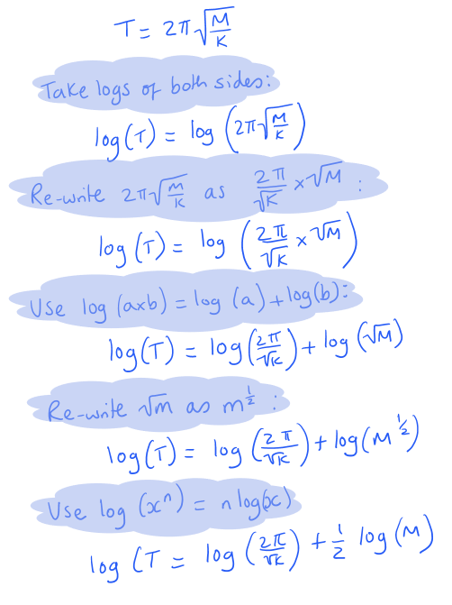

- *The reason log **k** is **c** is because we are told **k **is a constant (so log **k** must also be a constant)*

  - *Also, **y** must be the variable on the **y** axis plotted and the same for **x*

## Q7 — medium — 16 marks · structured-questions

### 4((a)) — 3 marks
i) State, with a reason, which of these measuring instruments she should use to measure the diameter *d* of the lens:

- Vernier calipers, as the range of the micrometer is too small; **[1 mark]**

ii) Explain why the conclusion may not be justified:

- There may be a systematic error **OR** there may be zero error (on the Vernier calipers); **[1 mark]**
- (Therefore) the values may not be close to the true value **OR** (therefore) there may be a constant value added to the measurements; **[1 mark]**

**[Total: 3 marks]**

### 4((b)) — 2 marks
Calculate the mean value of *x* in mm and its uncertainty:

Calculate the mean:

- $Meanofx=\frac{(2.11+2.10+2.13+2.14+2.11)}{5}=2.12\mathrm{mm}$ **[1 mark]**

Determine the uncertainty:

- `U n c e r t a i n t y space i n space x equals plus-or-minus 1 half open parentheses r a n g e close parentheses equals plus-or-minus fraction numerator 2.14 minus 2.10 over denominator 2 end fraction equals plus-or-minus 0.02 space mm space` **[1 mark]**

**[Total: 2 marks]**

- *You must remember how to calculate the uncertainty of a **mean** - this is very commonly forgotten!*

### 4((c)) — 11 marks
i) Determine the value of *n*:

List the known quantities:

- *d* = 5.10 cm ± 0.01 cm
- *t* = 8.30 mm ± 0.01 mm = 0.830 ± 0.001 cm
- *f* = 9.8 cm ± 0.3 cm
- x = 2.12 ± 0.2 mm = 0.212 ± 0.02 cm

Substitute in known values and calculate *n*:

- `n equals 1 plus fraction numerator d squared plus open parentheses t minus x close parentheses squared over denominator 8 f open parentheses t minus x close parentheses end fraction equals 1 plus fraction numerator 5.10 squared plus open parentheses 0.830 minus 0.212 close parentheses squared over denominator 8 cross times 9.8 cross times open parentheses 0.830 minus 0.212 close parentheses end fraction` **[1 mark]**
- n = 1.54 **[1 mark]**

ii) Show that the percentage uncertainty in is approximately 0.5 %:

- $U_{Tot}=U_{T}+U_{x}=0.01+0.02=0.03$ **[1 mark]**
- `percent sign U subscript T o t end subscript equals fraction numerator 0.03 over denominator 8.30 minus 2.12 end fraction cross times 100 space percent sign equals 0.49 space percent sign` **[1 mark]**

iii) Show that the uncertainty in `d squared plus open parentheses t minus x close parentheses squared` is approximately 0.11 cm:

Calculate the uncertainty in $d^{2}$:

- `percent sign U subscript d squared end subscript equals 2 cross times open parentheses fraction numerator 0.01 over denominator 5.1 end fraction cross times 100 space percent sign close parentheses equals 0.392 space percent sign`
- $U_{d^{2}}=5.1^{2}\times\frac{0.392}{100}=0.102$ **[1 mark]**

Calculate the uncertainty in `open parentheses t minus x close parentheses squared`:

- `percent sign U subscript open parentheses t minus x close parentheses squared end subscript equals 2 cross times 0.49 equals 0.98 space percent sign`
- `U subscript open parentheses t minus x close parentheses squared end subscript equals 0.618 squared cross times fraction numerator 0.98 over denominator 100 end fraction equals 0.04` **[1 mark]**

Calculate uncertainty in `d squared plus open parentheses t minus x close parentheses squared`:

- `U subscript d squared plus open parentheses t minus x close parentheses squared end subscript equals 0.102 plus 0.04` **[1 mark]**
- `U subscript d squared plus open parentheses t minus x close parentheses squared end subscript equals 0.106` **[1 mark]**

iv) Deduce whether this lens could be made from one of these materials:

Calculate percentage uncertainty in $n$:

- `percent sign U subscript n equals left parenthesis fraction numerator 0.106 over denominator 26.4 end fraction cross times 100 right parenthesis plus 0.485 plus left parenthesis fraction numerator 0.3 space over denominator 9.8 end fraction cross times 100 right parenthesis equals 0.402 plus 0.485 plus 3.06 equals 3.95 percent sign` **[1 mark]**

Calculate the upper and lower limits of $n$:

- $Upperlimit=1.54\times1.04=1.60$ **AND**
- $Lowerlimit=1.54\times0.96=1.48$ **[1 mark]**

State a conclusion:

- The lens is most likely to be made of crown glass as it is the only value to fall within the range; **[1 mark]**

**[Total: 11 marks]**

- *When you want to find the upper and lower limits of a value, you must change the percentage uncertainty into decimals*

  - *3.95% = 0.0395*
- *Therefore, the lower limit is a 3.95 % **decrease** from the measured value and the upper limit is a 3.95 % **increase** from the measured value*
- *You **must** be confident in converting between fractions and decimals and finding the percentage decrease and increase of a value*

  - *Make sure you revise these in the maths revision notes if you're stuck*

## Q8 — hard — 15 marks · structured-questions

### 1() — 4 marks
> **[mark-scheme]**
> (i) To improve the accuracy of the data obtained by the student:
> 
> - Use a (fiducial) marker placed at the mid-point / equilibrium position of the oscillation **[1 mark]**
> - (This will reduce timing errors) as the end of cantilever is moving fastest at the equilibrium position **[1 mark]**
> 
> (ii) To reduce the percentage uncertainty in the measurement of $T$:
> 
> - Time a larger number of oscillations (e.g. 20) **[1 mark]**
> - This will increase the total time recorded **[1 mark]**

### 2() — 2 marks
A graph of $\mathrm{log}T$ against $\mathrm{log}L$ would give a straight line because:

- Taking logs of $T=kL^{n}$ gives:

$\mathrm{log}T=\mathrm{log}k+n\mathrm{log}L$ **[1 mark]**

- Compare with the equation of a straight line:

$y=mx+c$

$y=\mathrm{log}T$, $x=\mathrm{log}L$

y-intercept$=\mathrm{log}k$

gradient$=n$ **[1 mark]**

> **[mark-scheme]**
> 1 mark for showing $\mathrm{log}T=n\mathrm{log}L+\mathrm{log}k$
> 
> 1 mark for comparing with $y=mx+c$ and stating that gradient$=n$

### 3() — 5 marks
To plot a graph of $\mathrm{log}T$ against $\mathrm{log}L$:

- Record values of $\mathrm{log}L$ and $\mathrm{log}T$ in the table:

| $L$ / $\text{cm}$ | $T$ / $\text{s}$ | `log space open parentheses L   text / cm end text close parentheses` | `log space open parentheses T   text / s end text close parentheses` |
|---|---|---|---|
| 85.0 | 1.789 | **1.929** | **0.253** |
| 75.0 | 1.473 | **1.875** | **0.168** |
| 65.0 | 1.171 | **1.813** | **0.069** |
| 55.0 | 0.894 | **1.740** | **-0.049** |
| 45.0 | 0.642 | **1.653** | **-0.192** |

**[1 mark]**

- Use the data to plot $\mathrm{log}T$ against $\mathrm{log}L$:

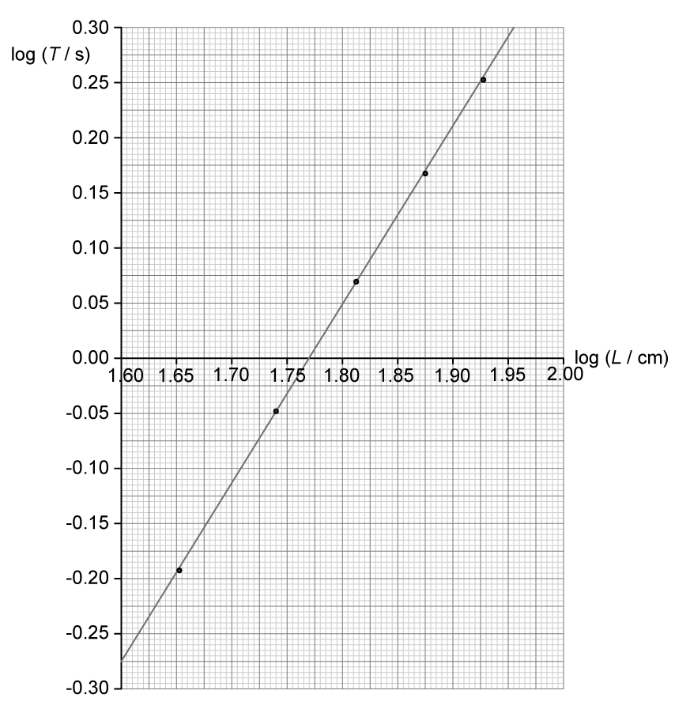

**[4 marks]**

> **[mark-scheme]**
> 1 mark for all five log values correct and consistent to 3 decimal places
> 
> - Accept $\mathrm{log}_{10}$ or $\mathrm{ln}$
> - Accept $\mathrm{log}L$ (or $\mathrm{ln}L$) in $\text{cm}$ or $\text{m}$
> 
> 1 mark for axes labelled with quantities and units
> 
> - Accept `log space open parentheses T text /s end text close parentheses` and `log space open parentheses L text /cm end text close parentheses` or `log space open parentheses L text /m end text close parentheses`
> - Accept `ln space open parentheses T text /s end text close parentheses` and `ln space open parentheses L text /cm end text close parentheses` or `ln space open parentheses L text /m end text close parentheses`
> 
> 1 mark for using appropriate scales
> 
> - Increments should be based on multiples of 1, 2 or 5
> - Plotted points must cover more than half of each axis
> 
> 1 mark for all points plotted correctly
> 
> - Each point must be plotted within ± half a small square
> 
> 1 mark for a straight line of best fit drawn
> 
> - If not all points lie on the line, then there must be a balanced spread of points above and below the line

> **[exam-tip]**
> When an examiner marks a graph plotting question, such as this, they will be looking at the following:
> 
> **Graph axes labelled with quantities and units**
> 
> - This means they will check the labels you put on each axis and the units that you include
> - In this case, they will be looking to see if you have `log space open parentheses T text /s end text close parentheses` on the y-axis and `log space open parentheses L text /cm end text close parentheses` on the x-axis (or equivalent)
> - They will ignore any labels you put in the table
> 
> **Appropriate scales used**
> 
> - Make sure to use as much of the space as possible - examiners will be expecting plots to cover at least half of the grid supplied, but using more is preferred
> - In this context, "appropriate scale" means a scale that uses easy-to-follow increments, such as 1, 2, or 5
> - Increments of 3, 4, 7, etc., are seen as "difficult scales" and will be marked down
> 
> **Plots accurate within half a small square**
> 
> - The key to plotting points accurately is to use a ruler to line up with the axes
> - Examiners will check the two points which appear furthest from your best-fit line (within half a square)
> - Note that they will not check points on "difficult scales", so getting the scale right is crucial!
> 
> **Line of best fit drawn**
> 
> - Often, the line of best fit should pass through, or pass very close to, the majority of plotted points
> - If the line does not go exactly through each point, ensure there are roughly an equal number of points on each side of the line
> - Never force your line to go through each point, and don't force it to go through zero

### 4() — 4 marks
To determine values for $k$ and $n$:

- Determine $n$ using the gradient:

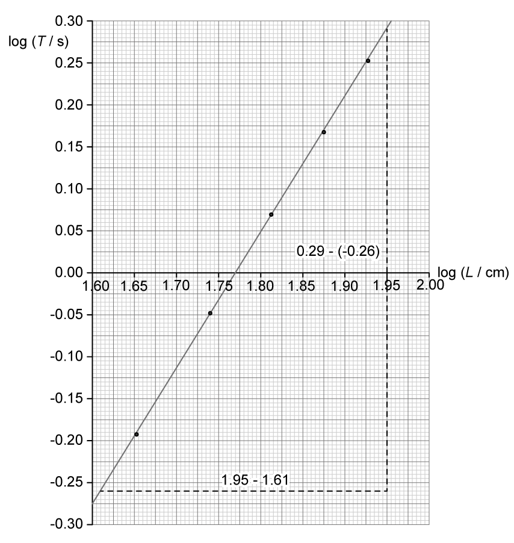

**[1 mark]**

gradient$=n$

`n space equals space fraction numerator increment log space T over denominator increment log space L end fraction space equals space fraction numerator 0.29 minus open parentheses negative 0.26 close parentheses over denominator 1.95 minus 1.61 end fraction`

$n=1.618=$ $1.62$ **[1 mark]**

- Determine $k$ using the y-intercept:

y-intercept$=\mathrm{log}k$

$\mathrm{log}T=\mathrm{log}k+n\mathrm{log}L$

when $\mathrm{log}T=0$, $\mathrm{log}L=1.770$

`0 space equals space log   k space plus space open parentheses 1.618   cross times 1.770 close parentheses`

$\mathrm{log}k=-2.86$

$k=10^{-2.86}$ **[1 mark]**

$k=$ $1.37\times10^{-3}$ **[1 mark]**

> **[mark-scheme]**
> 1 mark for determining the gradient using a large triangle
> 
> - Must use at least half of the drawn line
> - Accept use of values from the table only if the points selected lie on the line of best fit
> 
> 1 mark for $n$ in range $1.6$ to $1.7$
> 
> - Accept answers given to 2 or 3 sf
> 
> 1 mark for determining the inverse log of y-intercept
> 
> - Allow use of false origin to determine y-intercept
> 
> 1 mark for $k$ in range $1.2\times10^{-3}$ to $1.5\times10^{-3}$
> 
> - Ignore unit

## Q9 — medium — 8 marks · structured-questions

### 1() — 1 marks
> **[mark-scheme]**
> - All values of $L$ should be recorded to the same number of decimal places **OR**
> All values of $L$ should be recorded to the same resolution (as the calipers) **[1 mark]**
> 
> Do not accept same number of significant figures

> **[exam-tip]**
> "Criticise the recording" is about how the data are written down, not the physics. You should recognise that the third reading (25.1 mm) is recorded to 1 decimal place, unlike the other readings, which are recorded to the resolution of the caliper.

### 2() — 4 marks
To calculate the volume $V$ of the cube and its percentage uncertainty:

- Calculate the mean value of $L$:

$L=\frac{25.06+25.04+25.1+25.06+25.04}{5}$

$L=25.06\text{mm}=0.02506\text{m}$ **[1 mark]**

- Calculate the volume of the cube:

`V equals L cubed equals open parentheses 0.02506 close parentheses cubed`

$V=$ $1.57\times10^{-5}\text{m}^{3}$ **[1 mark]**

- Determine the percentage uncertainty in $L$:

Half range $=\frac{25.1-25.04}{2}=0.03\text{mm}$ **[1 mark]**

% uncertainty in `L equals fraction numerator 0.03 over denominator 25.06 end fraction cross times 100 equals 0.12 percent sign`

- Determine the percentage uncertainty in $V$:

% uncertainty in `V space equals space 3 cross times 0.12 percent sign`

% uncertainty in $V=$ `0.36 percent sign` **[1 mark]**

> **[mark-scheme]**
> 1 mark for calculating the mean value of $L$
> 
> 1 mark for use of $V=L^{3}$ to calculate volume ($1.57\times10^{-5}\text{m}^{3}$)
> 
> 1 mark for use of half range to calculate % uncertainty in $L$
> 
> 1 mark for % uncertainty in $V=3\times$% uncertainty in $L$ (`0.36 percent sign`)

> **[exam-tip]**
> Raising a quantity to a power multiplies its percentage uncertainty by that power, so for $V = L^{3}$ the side's percentage uncertainty triples. Forgetting the factor of 3 is the most common slip on cube-density questions.

### 3() — 3 marks
To determine whether the data is consistent with the standard value for the density of aluminium:

- List the known quantities:

  - Mass of the cube, $m=43.7\text{g}=43.7\times10^{-3}\text{kg}$
  - Volume of cube, $V=1.57\times10^{-5}\text{m}^{3}$ (from part b)
  - % uncertainty in `V equals 0.36 percent sign` (from part b)
  - Standard value for density of aluminium $=2700\text{kg m}^{-3}$
- Calculate the density of the aluminium cube:

$ρ=\frac{m}{V}$

$ρ=\frac{43.7\times10^{-3}}{1.57\times10^{-5}}=2780\text{kg m}^{-3}$ **[1 mark]**

- Determine the percentage uncertainty in $m$:

Half resolution $=\frac{0.1}{2}=0.05\text{g}$

% uncertainty in `m equals fraction numerator 0.05 over denominator 43.7 end fraction cross times 100 equals 0.11 percent sign`

- Determine the absolute uncertainty in $ρ$:

% uncertainty in `rho space equals space 0.36 percent sign plus 0.11 percent sign space equals space 0.47 percent sign`

uncertainty in $ρ=2780\times\frac{0.47}{100}$

uncertainty in $ρ=\pm10\text{kg m}^{-3}$ **[1 mark]**

- Write a concluding statement:

**The measured density is **`open parentheses 2780 plus-or-minus 10 close parentheses text  kg m end text to the power of negative 3 end exponent`**, so the minimum value is **$2770\text{kg m}^{-3}$**, which is higher than the standard value (**$2700 \text{kg m}^{-3}$**)** **[1 mark]**

> **[mark-scheme]**
> 1 mark for use of $ρ=m/V$ to calculate density ($2780\text{kg m}^{-3}$)
> 
> 1 mark for calculating uncertainty in density $=10\text{kg m}^{-3}$
> 
> 1 mark for concluding that the minimum density is higher than the standard value
> 
> - Accept a comment which is consistent with their calculated value

> **[exam-tip]**
> "Comment on" wants an explicit verdict, not just a number. State whether the accepted value sits inside or outside your uncertainty range before you conclude.
