# Exam Questions — Practical Skills II: Analysis
**6. Practical Skills in Physics II** · Edexcel International A Level (IAL) Physics (YPH11)
> Source: [https://www.savemyexams.com/international-a-level/physics/edexcel/19/topic-questions/6-practical-skills-in-physics-ii/practical-skills-ii-analysis/structured-questions/](https://www.savemyexams.com/international-a-level/physics/edexcel/19/topic-questions/6-practical-skills-in-physics-ii/practical-skills-ii-analysis/structured-questions/) · 9 questions · total 129 marks

## Q1 — medium — 16 marks · structured-questions

### 4((a)) — 4 marks — command: multiple — structured — from paper Oct/Nov 2021 · WPH16/01
An L-shaped steel rod was held horizontally in a stand clamped by its shorter end as shown.

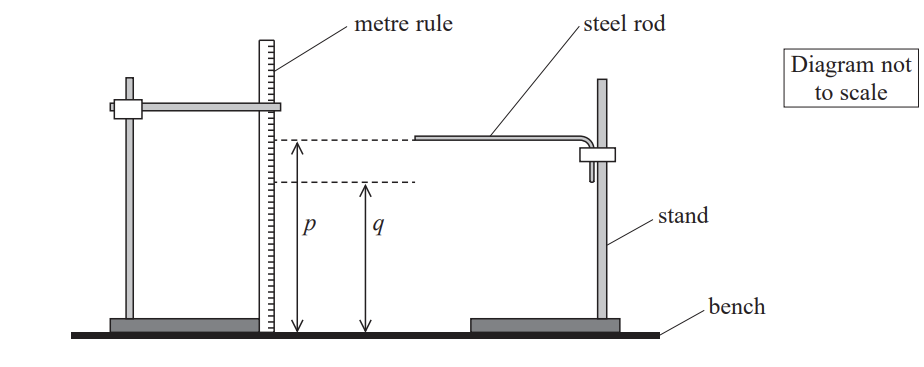

The end of the steel rod was at a height *p* above the bench.

A student attached a mass *m* to the end of the steel rod causing it to bend towards the bench. The end of the steel rod was then at a height *q* above the bench.

i) Describe two techniques she should use when measuring *p* and *q*.

**(2)**

ii) The difference between *p* and *q* was recorded as 26 mm ± 1 mm.

Explain why the uncertainty in this value is given as 1 mm.

**(2)**

### 4((b)) — 6 marks — command: multiple — structured — from paper Oct/Nov 2021 · WPH16/01
The steel rod had a circular cross-section with a diameter *d* of approximately 2 mm.

i) Explain the most appropriate instrument the student should use to measure *d*.

**(2)**

ii) Explain one technique that she should use to measure *d*.

**(2)**

iii) She recorded the following measurements.

| *d */ mm |   |   |   |   |
|---|---|---|---|---|
| 2.35 | 2.37 | 2.34 | 2.35 | 2.33 |

Calculate the mean value of *d* in mm and its uncertainty.

Mean value of *d* = ........................mm ±.........................mm**(2)**

### 4((c)) — 2 marks — command: determine — structured — from paper Oct/Nov 2021 · WPH16/01
The shear modulus *G* is a measure of a material’s resistance to bending, and is given by

$G=\frac{32mglx^{2}}{πyd^{4}}$

where *m* is the mass attached to the end of the rod and *y* is the vertical deflection.

*l* and *x* are the lengths as shown below.

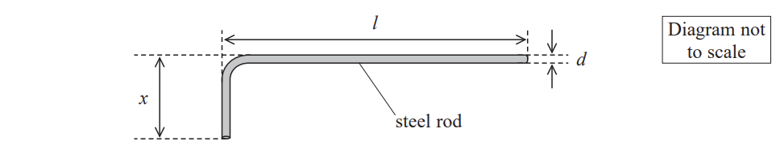

Determine a value of *G* for steel in N m−2.

*m* = 100g with negligible uncertainty

*l* = 58.9 cm ± 0.1 cm

*x* = 10.3 cm ± 0.1 cm

*y* = 26 mm ± 1mm

G = ............................................................ Nm−2

### 4((d)) — 4 marks — command: deduce — structured — from paper Oct/Nov 2021 · WPH16/01
The table shows values of *G* for different types of steel.

| **Type of steel** | Structural steel | Carbon steel |
|---|---|---|
| ***G *****/ 10****9 ****Nm****−2** | 79.3 | 77.0 |

Deduce whether the data provided in part (c) would allow the student to determine the type of steel the rod was made from.

## Q2 — medium — 15 marks · structured-questions

### 3((a)) — 4 marks — command: describe — structured — from paper Oct/Nov 2021 · WPH16/01
A student investigated standing waves using the apparatus shown.

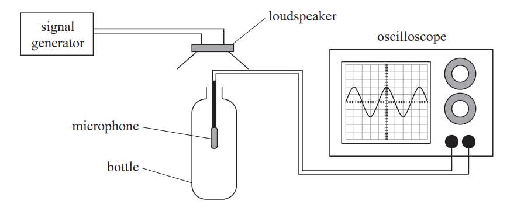

The signal generator was adjusted until a loud sound was heard at a particular frequency, known as the resonant frequency.

Describe how the student should use the oscilloscope to identify the resonant frequency and determine its value.

### 3((b)) — 11 marks — command: multiple — structured — from paper Oct/Nov 2021 · WPH16/01
The student reduced the volume *V* of air inside the bottle by adding known volumes of water. He recorded the following values of the resonant frequency *f* for each value of *V*.

| ***V***** / cm****3** | ***f *****/ Hz** |   |   |
|---|---|---|---|
| 576 | 221 |   |   |
| 476 | 244 |   |   |
| 376 | 275 |   |   |
| 276 | 323 |   |   |
| 176 | 408 |   |   |
| 126 | 485 |   |   |

i) Plot a graph of log *f* against log*V* on the grid opposite. Use the additional columns in the table to record your processed data.

**(6)**

ii) It is suggested that the relationship between *f* and *V* is given by

$f=kV^{-\frac{1}{2}}$

where *k* is a constant.

Discuss whether the graph supports this suggestion.

**(5)**

## Q3 — medium — 16 marks · structured-questions

### 3((a)) — 2 marks — command: state — structured — from paper 2022 Jan · WPH16/01
A radioactive source emits beta radiation and gamma radiation.

State two precautions that should be taken when using this source.

### 3((b)) — 2 marks — command: explain — structured — from paper 2022 Jan · WPH16/01
The radiation emitted from a radioactive source can be investigated using the apparatus shown. The Geiger-Muller (GM) tube detects beta radiation and gamma radiation.

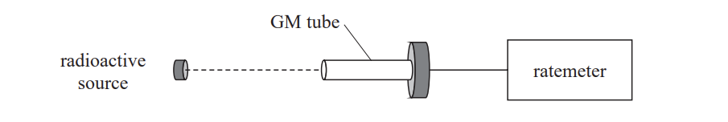

The ratemeter displays the count rate from all radiation detected by the GM tube.

Explain why the background count rate should be measured.

### 3((c)) — 2 marks — command: explain — structured — from paper 2022 Jan · WPH16/01
The corrected count rate *C* varies over time t according to the relationship

$C=C_{0}e^{-λt}$

where *C*0 is the initial count rate and λ is the decay constant.

Explain how a graph of ln *C* against *t* can be used to determine a value for λ.

### 3((d)) — 10 marks — command: multiple — structured — from paper 2022 Jan · WPH16/01
The source contained two radioactive isotopes, X and Y. The table below shows the corrected count rate as the isotopes decayed.

| ***t***** / hours** | ***C***** / s****−1** |   |
|---|---|---|
| 0.00 | 633 |   |
| 2.00 | 217 |   |
| 4.00 | 167 |   |
| 6.00 | 140 |   |
| 8.00 | 126 |   |
| 10.00 | 107 |   |
| 12.00 | 98 |   |

i) Plot a graph of ln *C* against *t* on the grid opposite. Use the additional column in the table to record your processed data.

**(5)**

ii) Isotope X has a half-life of approximately 30 minutes.

Determine a value of λ, in hours−1, for isotope Y.

λ = .............................. hours−1**(3)**

iii) Hence determine the half-life *t*1⁄2 for isotope Y.

*t*1⁄2 = ...............................

**(2)**

## Q4 — medium — 18 marks · structured-questions

### 4((a)) — 4 marks — command: multiple — structured — from paper 2022 Jan · WPH16/01
A student used the apparatus shown to investigate the time taken for a hollow cylinder to roll down a ramp.

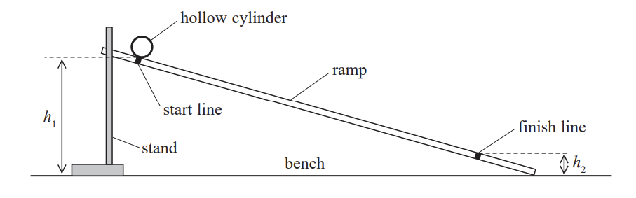

i) The student measured the height *h*1 of the start line from the bench using a metre rule.

State two precautions she should take to ensure the measurement is as accurate as possible.

**(2)**

ii) The student measured the height *h*2 of the finish line. She recorded the difference in height Δ*h* between the start line and finish line as 65 mm ± 1 mm.

Explain why the uncertainty in Δ*h* is 1 mm.

**(2)**

### 4((b)) — 4 marks — command: multiple — structured — from paper 2022 Jan · WPH16/01
The student placed the cylinder on the start line and released it. She immediately started a stopwatch and measured the time* t* for the cylinder to roll to the finish line. She repeated the measurements several times as shown.

| ***t***** / s** | 2.10 | 1.86 | 1.94 | 1.89 |
|---|---|---|---|---|

i) Calculate the mean value of *t* and its uncertainty.

Mean value of *t* = ............................... ± ..........................**(2)**

ii) The student made the ramp less steep by reducing the value of *h*1.

Explain how this might improve the measurement of *t*.

**(2)**

### 4((c)) — 4 marks — command: compare — structured — from paper 2022 Jan · WPH16/01
Two students each carried out this procedure for another value of Δ*h*. They recorded the following times for the same value of Δ*h*.

| **Student** | ***t***** / s** | **Mean *****t***** / s** |   |   |   |
|---|---|---|---|---|---|
| A | 2.45 | 2.50 | 2.38 | 2.41 | 2.44 |
| B | 2.48 | 2.45 | 2.43 | 2.40 | 2.44 |

Compare the accuracy and precision of the data that each student collected.

### 4((d)) — 6 marks — command: multiple — structured — from paper 2022 Jan · WPH16/01
The relationship between *t* and the acceleration of free fall *g* is given by

$t^{2}=\frac{4s^{2}}{g\Deltah}$

where *s* is the distance along the ramp between the start line and the finish line.

The student recorded the following values.

*t* = 2.44 s ± 0.04 s *   *

*s* = 80.0 cm ± 0.1 cm

Δ*h* = 43 mm ± 1 mm

i) Determine a value for *g*.

*g* = ..............................**(2)**

ii) Determine the percentage uncertainty in the value of *g*.

Percentage uncertainty = ...........................**(2)**

iii) Deduce whether the value of *g* is accurate.

**(2)**

## Q5 — medium — 7 marks · structured-questions

### 1((a)) — 3 marks — command: describe — structured — from paper 2021 June · WPH16/01
The time period of a rotating wheel can be determined using the apparatus shown.

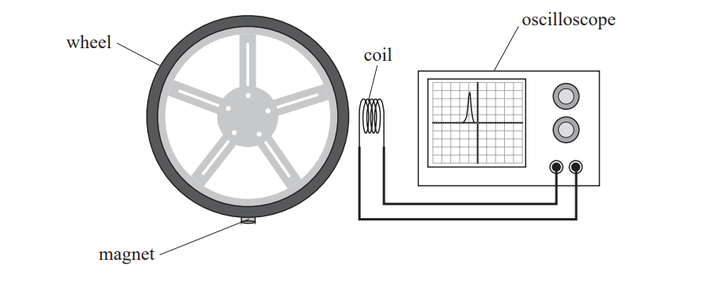

A magnet is attached to the edge of the wheel. When the magnet passes the coil, a single pulse is displayed on the oscilloscope screen.

The horizontal axis of the oscilloscope screen represents time. The number of milliseconds per division on the horizontal scale can be adjusted.

As the wheel rotates, a series of pulses is displayed as shown.

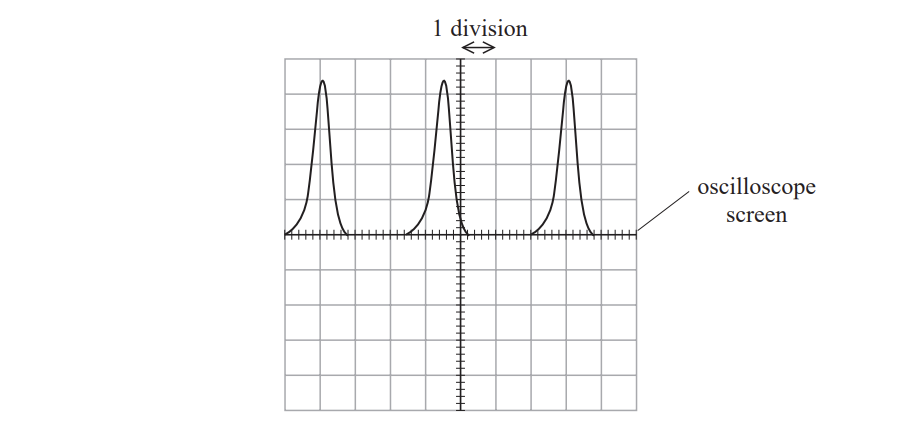

Describe how a value of the time period should be determined from these pulses.

### 1((b)) — 4 marks — command: explain — structured — from paper 2021 June · WPH16/01
When the wheel is tested, the speed of the magnet is 22.2 ms–1.

The oscilloscope can be adjusted to give the following values for the horizontal scale.

| millisecond per division | 1 | 2 | 5 | 10 |
|---|---|---|---|---|

Explain which of these scales would display two complete pulses on the screen.

wheel diameter = 25.4 cm

## Q6 — medium — 18 marks · structured-questions

### 3((a)) — 4 marks — command: describe — structured — from paper 2021 June · WPH16/01
A student investigated the horizontal oscillations of a trolley between two springs using the apparatus shown.

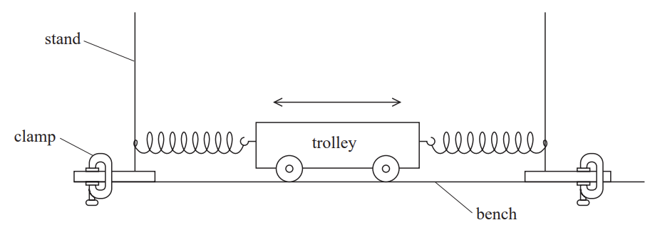

The student used a stop clock to time the oscillations.

i) Describe how he should modify the equipment to make his measurements as accurate as possible.

**(2)**

ii) Describe two techniques he should use to reduce the uncertainty in the value of the time period.

**(2)**

### 3((b)) — 14 marks — command: multiple — structured — from paper 2021 June · WPH16/01
The student added masses to the trolley. He measured the total mass *M* of the trolley and masses. He recorded the following values of the time period *T* for each value of *M*.

| ***M***** / kg** | ***T***** / s** |   |   |
|---|---|---|---|
| 0.800 | 0.78 |   |   |
| 1.300 | 1.01 |   |   |
| 1.800 | 1.18 |   |   |
| 2.300 | 1.34 |   |   |
| 2.800 | 1.49 |   |   |
| 3.300 | 1.60 |   |   |

i) Plot a graph of log *T* against log *M* on the grid opposite. Use the additional columns in the table to record your processed data.

**(6)**

ii) The student predicts that the relationship between *T* and *M* is given by

$T=2π\sqrt{\frac{M}{k}}$

where* k* is the spring constant.

Discuss the validity of this prediction.

**(5)**

iii) Determine the value of *k*.

*k* = .......................................................**(3)**

## Q7 — medium — 16 marks · structured-questions

### 4((a)) — 3 marks — command: multiple — structured — from paper 2021 June · WPH16/01
A student measured some dimensions of a thick, circular lens. The diagram shows approximate values of these dimensions.

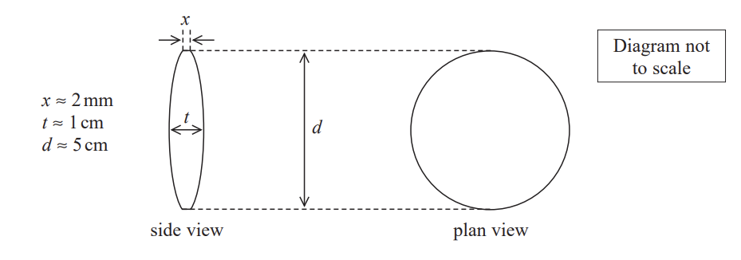

i) The student had a set of Vernier calipers and a micrometer screw gauge, as shown in the photograph.

State, with a reason, which of these measuring instruments she should use to measure the diameter d of the lens.

**(1)**

ii) The student recorded the following values of d, measured at different points across the lens.

| 5.10 cm | 5.11 cm | 5.10 cm |
|---|---|---|

She concluded that because her measurements were precise, they must be accurate.

Explain why this conclusion may not be justified.

**(2)**

### 4((b)) — 2 marks — command: calculate — structured — from paper 2021 June · WPH16/01
The student measured the thickness *x* of the edge of the lens using the micrometer screw gauge.

She recorded the following measurements.

| ***x***** / mm** |   |   |   |   |
|---|---|---|---|---|
| 2.11 | 2.10 | 2.13 | 2.14 | 2.11 |

Calculate the mean value of *x* in mm and its uncertainty.

Mean value of *x* = ............................ mm ± ........................mm

### 4((c)) — 11 marks — command: multiple — structured — from paper 2021 June · WPH16/01
The refractive index $n$ of the material of the lens can be determined using

`n equals 1 plus fraction numerator d squared plus open parentheses t minus x close parentheses squared over denominator 8 f open parentheses t minus x close parentheses end fraction`

where *f*$f$* *is the focal length of the lens.

i) Determine the value of $n$.

$d$ = 5.10 cm ± 0.01 cm

$t$ = 8.30 mm ± 0.01 mm

$f$ = 9.8 cm ± 0.3 cm

n = .......................................................**(2)**

ii) Show that the percentage uncertainty in `open parentheses t minus x close parentheses` is approximately 0.5 %.

**(2)**

iii) Show that the uncertainty in `d squared plus open parentheses t minus x close parentheses squared` is approximately 0.11 cm.

**(4)**

iv) The table shows data for some materials used to make lenses.

| **Material** | Pyrex | Crown glass | Flint glass |
|---|---|---|---|
| **Refractive index** | 1.47 | 1.52 | 1.52 |

Deduce whether this lens could be made from one of these materials.

**(3)**

## Q8 — hard — 15 marks · structured-questions

### 1() — 4 marks — command: explain — structured
A student made a cantilever by clamping one end of a metal strip to a bench and attaching a mass to the free end, as shown.

The length $L$ of the strip from the bench to the centre of the mass is measured.

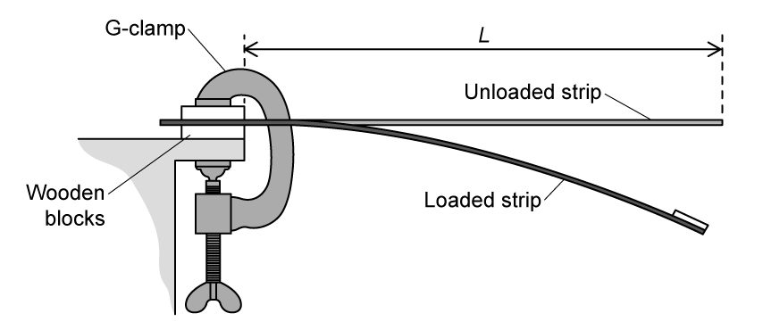

The student displaced the mass downwards and released it, causing the cantilever to oscillate with simple harmonic motion of period $T$.

The student used a stopwatch to measure the time for 5 oscillations. This was repeated twice.

(i) Explain **one** modification to the apparatus which would improve the accuracy of the data obtained by the student.

[2]

(ii) Explain **one** modification to the method which would reduce the percentage uncertainty in the measurement of $T$.

[2]

### 2() — 2 marks — command: explain — structured
It is suggested that the relationship between time period $T$ and length $L$ is

$T=kL^{n}$

where $k$ and $n$ are constants.

Explain why a graph of $\mathrm{log}T$ against $\mathrm{log}L$ would give a straight line.

### 3() — 5 marks — command: plot — structured
The student’s data is shown in the table below.

| $L$ / $\text{cm}$ | $T$ / $\text{s}$ | ‎ ‎ ‎ ‎ ‎ ‎ ‎ ‎ ‎ ‎ ‎ ‎ ‎ ‎ ‎ ‎ ‎ ‎ ‎ ‎ ‎ ‎ ‎ ‎ ‎ ‎ ‎ ‎ ‎ ‎ ‎ ‎ ‎ ‎ ‎ ‎ ‎ ‎ ‎ ‎ ‎ ‎ ‎ ‎ ‎ ‎ ‎ ‎ ‎ ‎ ‎ ‎ ‎ | ‎ ‎ ‎ ‎ ‎ ‎ ‎ ‎ ‎ ‎ ‎ ‎ ‎ ‎ ‎ ‎ ‎ ‎ ‎ ‎ ‎ ‎ ‎ ‎ ‎ ‎ ‎ ‎ ‎ ‎ ‎ ‎ ‎ ‎ ‎ ‎ ‎ ‎ ‎ ‎ ‎ ‎ ‎ ‎ ‎ ‎ ‎ ‎ ‎ ‎ ‎ ‎ ‎ |
|---|---|---|---|
| 85.0 | 1.789 | ‎ ‎ ‎ ‎ ‎ ‎ ‎ ‎ ‎ ‎ ‎ ‎ ‎ ‎ ‎ ‎ ‎ ‎ ‎ ‎ ‎ ‎ ‎ ‎ ‎ ‎ ‎ ‎ ‎ ‎ ‎ ‎ ‎ ‎ ‎ ‎ ‎ ‎ ‎ ‎ ‎ ‎ ‎ ‎ ‎ ‎ ‎ ‎ ‎ ‎ ‎ ‎ ‎ | ‎ ‎ ‎ ‎ ‎ ‎ ‎ ‎ ‎ ‎ ‎ ‎ ‎ ‎ ‎ ‎ ‎ ‎ ‎ ‎ ‎ ‎ ‎ ‎ ‎ ‎ ‎ ‎ ‎ ‎ ‎ ‎ ‎ ‎ ‎ ‎ ‎ ‎ ‎ ‎ ‎ ‎ ‎ ‎ ‎ ‎ ‎ ‎ ‎ ‎ ‎ ‎ ‎ |
| 75.0 | 1.473 | ‎ ‎ ‎ ‎ ‎ ‎ ‎ ‎ ‎ ‎ ‎ ‎ ‎ ‎ ‎ ‎ ‎ ‎ ‎ ‎ ‎ ‎ ‎ ‎ ‎ ‎ ‎ ‎ ‎ ‎ ‎ ‎ ‎ ‎ ‎ ‎ ‎ ‎ ‎ ‎ ‎ ‎ ‎ ‎ ‎ ‎ ‎ ‎ ‎ ‎ ‎ ‎ ‎ | ‎ ‎ ‎ ‎ ‎ ‎ ‎ ‎ ‎ ‎ ‎ ‎ ‎ ‎ ‎ ‎ ‎ ‎ ‎ ‎ ‎ ‎ ‎ ‎ ‎ ‎ ‎ ‎ ‎ ‎ ‎ ‎ ‎ ‎ ‎ ‎ ‎ ‎ ‎ ‎ ‎ ‎ ‎ ‎ ‎ ‎ ‎ ‎ ‎ ‎ ‎ ‎ ‎ |
| 65.0 | 1.171 | ‎ ‎ ‎ ‎ ‎ ‎ ‎ ‎ ‎ ‎ ‎ ‎ ‎ ‎ ‎ ‎ ‎ ‎ ‎ ‎ ‎ ‎ ‎ ‎ ‎ ‎ ‎ ‎ ‎ ‎ ‎ ‎ ‎ ‎ ‎ ‎ ‎ ‎ ‎ ‎ ‎ ‎ ‎ ‎ ‎ ‎ ‎ ‎ ‎ ‎ ‎ ‎ ‎ | ‎ ‎ ‎ ‎ ‎ ‎ ‎ ‎ ‎ ‎ ‎ ‎ ‎ ‎ ‎ ‎ ‎ ‎ ‎ ‎ ‎ ‎ ‎ ‎ ‎ ‎ ‎ ‎ ‎ ‎ ‎ ‎ ‎ ‎ ‎ ‎ ‎ ‎ ‎ ‎ ‎ ‎ ‎ ‎ ‎ ‎ ‎ ‎ ‎ ‎ ‎ ‎ ‎ |
| 55.0 | 0.894 | ‎ ‎ ‎ ‎ ‎ ‎ ‎ ‎ ‎ ‎ ‎ ‎ ‎ ‎ ‎ ‎ ‎ ‎ ‎ ‎ ‎ ‎ ‎ ‎ ‎ ‎ ‎ ‎ ‎ ‎ ‎ ‎ ‎ ‎ ‎ ‎ ‎ ‎ ‎ ‎ ‎ ‎ ‎ ‎ ‎ ‎ ‎ ‎ ‎ ‎ ‎ ‎ ‎ | ‎ ‎ ‎ ‎ ‎ ‎ ‎ ‎ ‎ ‎ ‎ ‎ ‎ ‎ ‎ ‎ ‎ ‎ ‎ ‎ ‎ ‎ ‎ ‎ ‎ ‎ ‎ ‎ ‎ ‎ ‎ ‎ ‎ ‎ ‎ ‎ ‎ ‎ ‎ ‎ ‎ ‎ ‎ ‎ ‎ ‎ ‎ ‎ ‎ ‎ ‎ ‎ ‎ |
| 45.0 | 0.642 | ‎ ‎ ‎ ‎ ‎ ‎ ‎ ‎ ‎ ‎ ‎ ‎ ‎ ‎ ‎ ‎ ‎ ‎ ‎ ‎ ‎ ‎ ‎ ‎ ‎ ‎ ‎ ‎ ‎ ‎ ‎ ‎ ‎ ‎ ‎ ‎ ‎ ‎ ‎ ‎ ‎ ‎ ‎ ‎ ‎ ‎ ‎ ‎ ‎ ‎ ‎ ‎ ‎ | ‎ ‎ ‎ ‎ ‎ ‎ ‎ ‎ ‎ ‎ ‎ ‎ ‎ ‎ ‎ ‎ ‎ ‎ ‎ ‎ ‎ ‎ ‎ ‎ ‎ ‎ ‎ ‎ ‎ ‎ ‎ ‎ ‎ ‎ ‎ ‎ ‎ ‎ ‎ ‎ ‎ ‎ ‎ ‎ ‎ ‎ ‎ ‎ ‎ ‎ ‎ ‎ ‎ |

Plot a graph of $\mathrm{log}T$ against $\mathrm{log}L$ on the grid provided. Use the columns provided to show any processed data.

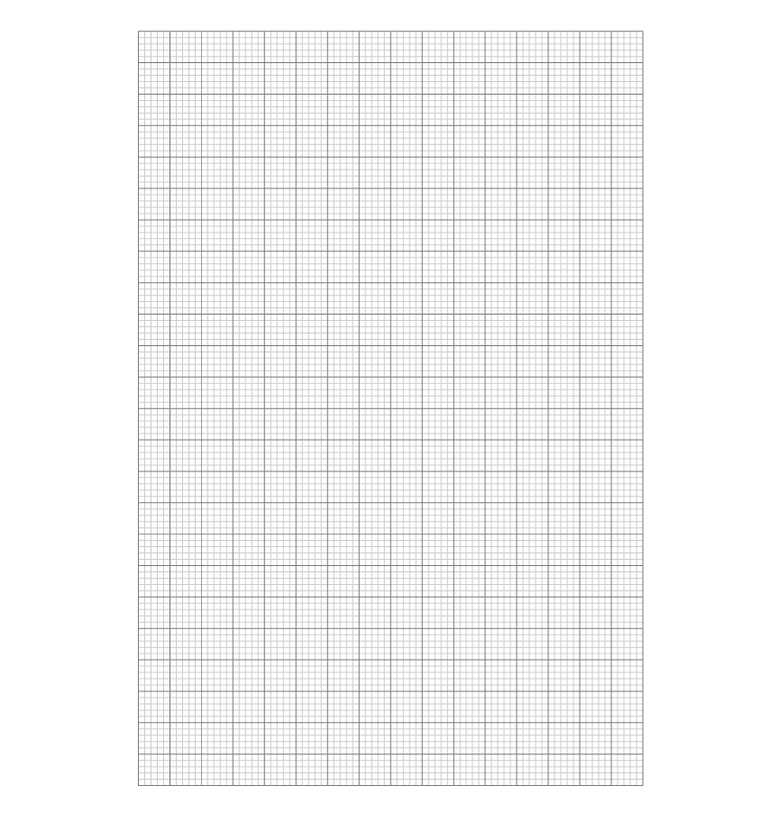

### 4() — 4 marks — command: determine — structured
Determine values for $k$ and $n$.

## Q9 — medium — 8 marks · structured-questions

### 1() — 1 mark — structured
A student carried out an experiment to determine the density of an aluminium cube.

The student measured the length $L$ of one side of the cube using Vernier calipers with a resolution of $0 . 02 \text{mm}$.

They obtained the following values for $L$.

| $L$ / $\text{mm}$ | 25.06 | 25.04 | 25.1 | 25.06 | 25.04 |
|---|---|---|---|---|---|

Criticise the student's recording of these values.

### 2() — 4 marks — command: calculate — structured
Calculate the volume $V$ of the cube, and the percentage uncertainty in $V$.

### 3() — 3 marks — command: determine — structured
The mass of the cube was measured to be $43.7\text{g}$ using an electronic balance. The balance had a resolution of $0.1\text{g}$.

Determine whether the data collected leads to a value for the density of aluminium in agreement with the standard value.

density of aluminium $=2700\text{kg m}^{-3}$
