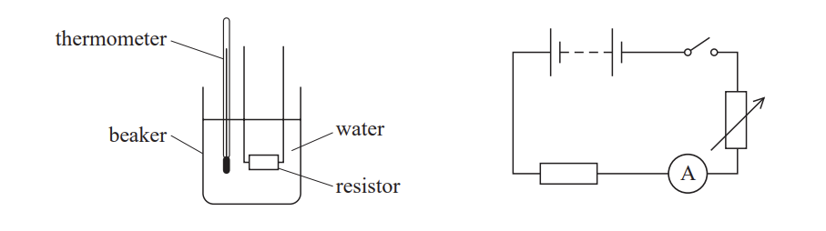

# Exam Questions — Practical Skills II: Implementation & Measurements
**6. Practical Skills in Physics II** · Edexcel International A Level (IAL) Physics (YPH11)
> Source: [https://www.savemyexams.com/international-a-level/physics/edexcel/19/topic-questions/6-practical-skills-in-physics-ii/practical-skills-ii-implementation-and-measurements/structured-questions/](https://www.savemyexams.com/international-a-level/physics/edexcel/19/topic-questions/6-practical-skills-in-physics-ii/practical-skills-ii-implementation-and-measurements/structured-questions/) · 1 questions · total 7 marks

## Q1 — medium — 7 marks · structured-questions

### 1((a)) — 5 marks — command: multiple — structured — from paper Oct/Nov 2021 · WPH16/01
A wire-wound resistor can become hot when there is a current in it. This heating effect can be investigated using the apparatus shown.

A student investigated whether the temperature rise of the water ∆*θ* was proportional to the current *I* in the resistor. For each value of current, the student refilled the beaker with water at the same initial temperature.

i) Identify two other control variables for this investigation.

**(2)**

ii) The student recorded the following data.

| **I/A** | 1.5 | 2 | 2.5 | 3 |
|---|---|---|---|---|
| ∆*θ* | 3.5 | 7 | 9.5 | 15 |

Criticise the recording of this data.

**(3)**

### 1((b)) — 2 marks — command: explain — structured — from paper Oct/Nov 2021 · WPH16/01
Explain one improvement the student could make to reduce the uncertainty in the measurement of ∆*θ* for each value of *I*.
