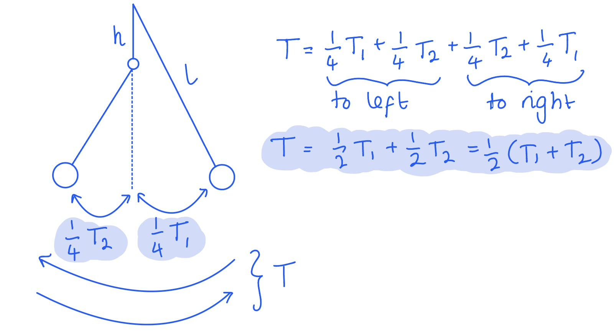
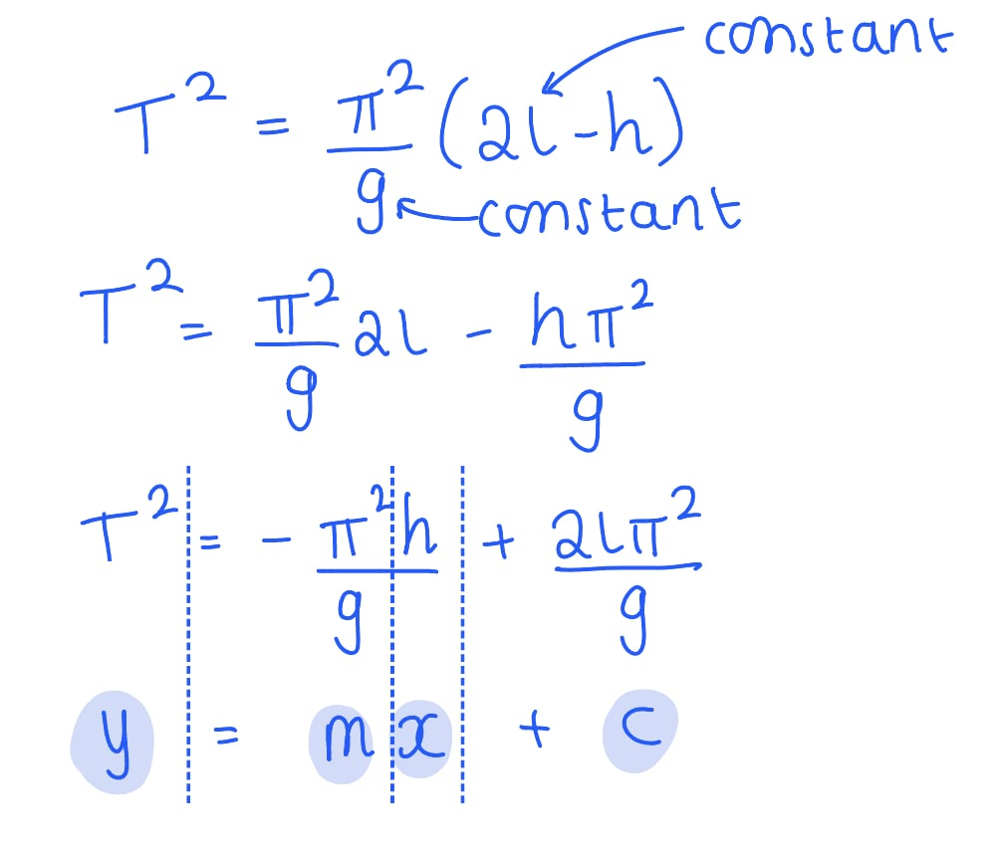

# Mark Schemes — Practical Skills II: Planning
**6. Practical Skills in Physics II** · Edexcel International A Level (IAL) Physics (YPH11)

## Q1 — medium — 12 marks · structured-questions

### 2((a)) — 3 marks
Determine the time period *T* for the whole oscillation when *h* = 0.25 m

List the known quantities:

- Distance below suspension, *h* = 0.25 m
- Length of the pendulum, *l* = 1.00 m

Calculate the time period of the longer pendulum, *T*1 and the shorter pendulum *T*2:

- $T=2π\sqrt{\frac{l}{g}}$
- $T_{1}=2π\sqrt{\frac{l}{g}}=2π\sqrt{\frac{1.00}{9.81}}=2.01s$ **AND**
- $T_{2}=2π\sqrt{\frac{l-h}{g}}=2π\sqrt{\frac{1.00-0.25}{9.81}}=1.74s$ **[1 mark]**

Calculate the time period of the whole oscillation, *T*:

- `T space equals 1 half open parentheses T subscript 1 space plus space T subscript 2 close parentheses space equals 1 half open parentheses 2.01 space plus space 1.74 close parentheses` **[1 mark]**
- $T=1.875=1.9s$ **[1 mark]**

**[Total: 3 marks]**

- *The time period is the time for **one full oscillation*
- *If you're struggling to understand the final calculation, take a look at the following sketch:*

### 2((b)) — 6 marks
Devise a plan to test the validity of the relationship using a graphical method

- Measure the distance* h *using a metre rule; **[1 mark]**

Any **three** from:

- Place a (timing) marker at the centre of the oscillation; **[1 mark]**
- Use a small initial angle; **[1 mark]**
- Time a number of oscillations and divide by the number; **[1 mark]**
- Repeat (measurement of time period) and calculate the mean; **[1 mark]**
- Start timing after several oscillations; **[1 mark]**

- Repeat the method for at least 5 values of *h*; **[1 mark]**
- Plot a graph of *T*2 against *h* to check it is a straight line; **[1 mark]**

**[Total: 6 marks]**

- *This equation can be linked to that of a straight line in the following way:*

- *The rearranging of equations and comparing them to the straight line equation **y** = **mx** + **c** is a **very** common practical skill - you must be confident in your algebra for this!*

### 2((c)) — 3 marks
Discuss whether this modification would improve the investigation.

- Using a light gate would eliminate reaction time; **[1 mark]**

**EITHER**

- Light gates remove parallax error; **[1 mark]**
- As the light gate is in a fixed position; **[1 mark]**

**OR**

- There would be uncertainty in the time period from the light gate; **[1 mark]**
- As the light gate would time from the edge of the bob rather than the centre of mass; **[1 mark]**

**[Total: 3 marks]**

## Q2 — medium — 8 marks · structured-questions

### 1((a)) — 1 marks
One end of the tube is left open because:

- To ensure the pressure remains constant **OR** to keep the pressure at atmospheric pressure; **[1 mark]**

**[Total: 1 mark]**

### 1((b)) — 2 marks
One other reason why this method may be hazardous is:

- (The boiling water may make) the air expand too quickly **OR** (the boiling water may make) the air expand too much; **[1 mark]**
- (So) the sulfuric acid could escape; **[1 mark]**

**[Total: 2 marks]**

### 1((c)) — 5 marks
i) Two techniques that should be used to ensure the measurement of *θ* is as accurate as possible are:

- Stir the water; **[1 mark]**
- Place the thermometer close to the capillary tube; **[1 mark]**

ii) Discuss whether the student’s measurements would lead to an accurate value of *θ* at absolute zero

- There are too few readings / the range of temperatures is too small; **[1 mark]**
- To draw an accurate best fit line / to be certain of a linear relationship; **[1 mark]**
- Which may lead to inaccuracy in the value of *θ ***[1 mark]**

**[Total: 5 marks]**

- *Stirring the water helps make sure all the water is at the same temperature*

  - *This is a common technique when you're dealing with heating liquids*

## Q3 — medium — 8 marks · structured-questions

### 2((a)) — 6 marks
Devise a plan, using a graphical method, to test this prediction

- Measure the length of tube *x* using a (metre) rule; **[1 mark]**
- Ensure the tube is vertical with a set square **OR **release the magnet from the top of the tube; **[1 mark]**
- Measure* t* using a stopwatch; **[1 mark]**
- Repeat the measurement of time and calculate a mean; **[1 mark]**
- Repeat for at least 5 values of *x* **[1 mark]**
- Plot a graph of* t*2 against *x* to check the gradient (which is $\frac{1}{2}a$) is constant / to check it is a straight line; **[1 mark]**

**[Total: 6 marks]**

- *A set square is a common instrument used to check whether an object is exactly vertical*

  - *This is important when reading values from a thermometer for example, to avoid parallax error*
- *Any other appropriate instrument to measure the time will be accepted in this mark scheme*

  - *However, a stopwatch is the most commonly accepted*
- *Remember to always state **repeat** readings and calculate a **mean*
- *Avoid saying 'repeat many times' - it is better to state a number. Between 5-10 readings are normally accepted*

- *The way to figure out what variables should be on the graph is by thinking of an equation that links the variables relevant to the equation*

  - *We are calculating **t**, we have the constant acceleration **a** and the distance it has fallen, **x*
  - *Therefore, we can use *$s=ut+\frac{1}{2}at^{2}$
  - *We can assume the magnet starts at rest, so **u** = 0 and *$s=\frac{1}{2}at^{2}\Rightarrowx=\frac{1}{2}at^{2}$
  - *Comparing this to the straight line equation **y** = **mx **+ **c*
  
    - *y** = **t**2** (the dependent variable we are measuring)*
    - *m = *$\frac{1}{2}a$
    - *x** = **x** (the independent variable)*
    - *c** = 0*

### 2((b)) — 2 marks
A possible source of error in this investigation is:

Any **pair** from:

- If the magnet is not aligned with the top of the tube when released; **[1 mark]**
- So the magnet would have a velocity when entering the tube; **[1 mark]**

- It would be difficult to judge when the magnet is about to leave the tube; **[1 mark]**
- So this would add to the time; **[1 mark]**

- The magnet could touch the sides of the tube and experience friction; **[1 mark]**
- So the time would increase; **[1 mark]**

- The length of the tube may vary around the circumference; **[1 mark]**
- So this may introduce random error; **[1 mark]**

**[Total: 2 marks]**
