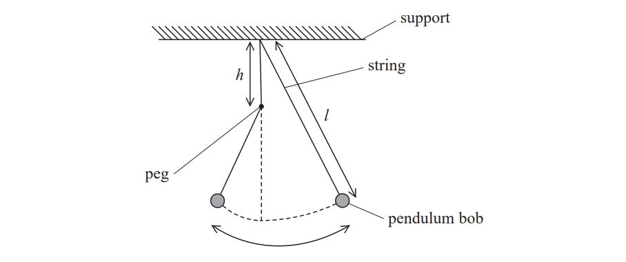
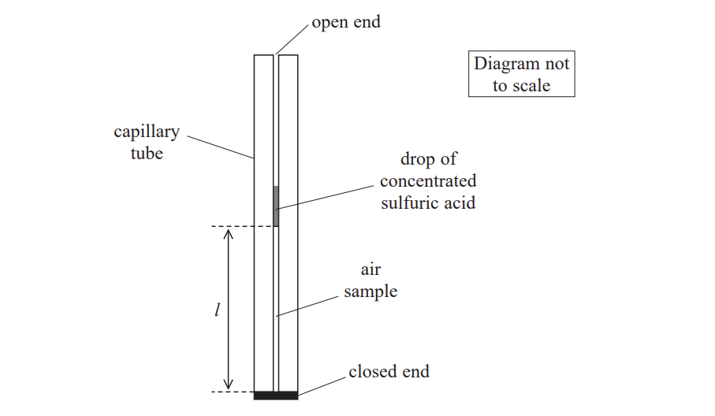
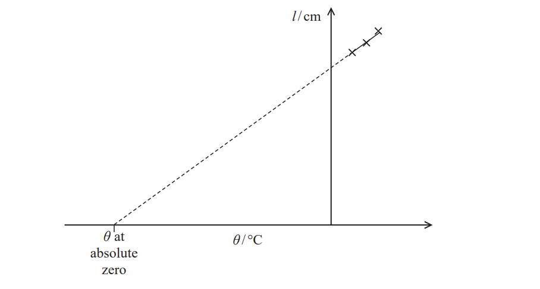
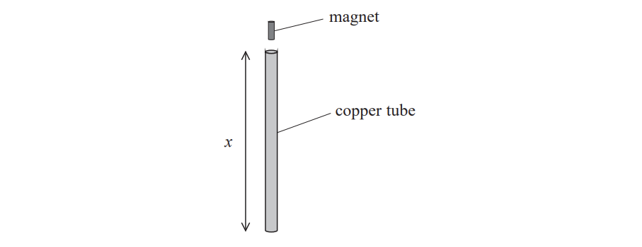

# Exam Questions — Practical Skills II: Planning
**6. Practical Skills in Physics II** · Edexcel International A Level (IAL) Physics (YPH11)
> Source: [https://www.savemyexams.com/international-a-level/physics/edexcel/19/topic-questions/6-practical-skills-in-physics-ii/practical-skills-ii-planning/structured-questions/](https://www.savemyexams.com/international-a-level/physics/edexcel/19/topic-questions/6-practical-skills-in-physics-ii/practical-skills-ii-planning/structured-questions/) · 3 questions · total 28 marks

## Q1 — medium — 12 marks · structured-questions

### 2((a)) — 3 marks — command: determine — structured — from paper Oct/Nov 2021 · WPH16/01
A pendulum of length *l* swings in a vertical plane. The string hits a peg placed at a distance *h* vertically below the point of suspension as shown. This makes the pendulum shorter for part of its motion.

Determine the time period *T*  for the whole oscillation when *h* = 0.25 m.

*l* = 1.00 m

T = ...........................................

### 2((b)) — 6 marks — command: plan — structured — from paper Oct/Nov 2021 · WPH16/01
A student suggests that an approximate relationship between *T* and *h* is given by

`T squared equals pi squared over g open parentheses 2 l minus h close parentheses`

Devise a plan to test the validity of the relationship using a graphical method.

Include the use of a stopwatch and any additional apparatus as required.

### 2((c)) — 3 marks — command: discuss — structured — from paper Oct/Nov 2021 · WPH16/01
Another student suggests determining *T*  by setting up a light gate attached to a data logger.

Discuss whether this modification would improve the investigation.

## Q2 — medium — 8 marks · structured-questions

### 1((a)) — 1 mark — command: suggest — structured — from paper 2022 Jan · WPH16/01
A student investigated the relationship between the length *l* of a column of air and its temperature *θ* using the apparatus shown.

A sample of air is trapped inside the tube between the closed end and the drop of concentrated sulfuric acid.

Suggest why one end of the tube is left open.

### 1((b)) — 2 marks — command: explain — structured — from paper 2022 Jan · WPH16/01
The student suggested placing the apparatus in a beaker of boiling water and allowing the water to cool. Boiling water is a hazard.

Explain one other reason why this method may be hazardous.

### 1((c)) — 5 marks — command: multiple — structured — from paper 2022 Jan · WPH16/01
The capillary tube was attached to a 30 cm ruler and placed in a beaker of water at room temperature. The water was heated gradually and *θ* was measured using a thermometer.

i) State two techniques that should be used to ensure the measurement of *θ* is as accurate as possible.

**(2)**

ii) The student recorded the following measurements.

| ***θ***** / °C** | ***l***** / cm** |
|---|---|
| 19.0 | 16.0 |
| 35.0 | 16.9 |
| 49.0 | 17.7 |

The student predicted that a graph of *l* against *θ* could be used to estimate a value for *θ* at absolute zero as shown.

Discuss whether the student’s measurements would lead to an accurate value of *θ* at absolute zero.

**(3)**

## Q3 — medium — 8 marks · structured-questions

### 2((a)) — 6 marks — command: plan — structured — from paper 2022 Jan · WPH16/01
A student investigated Lenz’s law using the apparatus shown.

The student dropped the magnet into the copper tube and measured the time *t* for the magnet to reach the bottom of the tube.

The student had a large number of copper tubes of different lengths *x*. He predicted that the magnet would fall with constant acceleration *a* inside the copper tubes.

Devise a plan, using a graphical method, to test this prediction.

### 2((b)) — 2 marks — command: explain — structured — from paper 2022 Jan · WPH16/01
Explain a possible source of error in this investigation.
