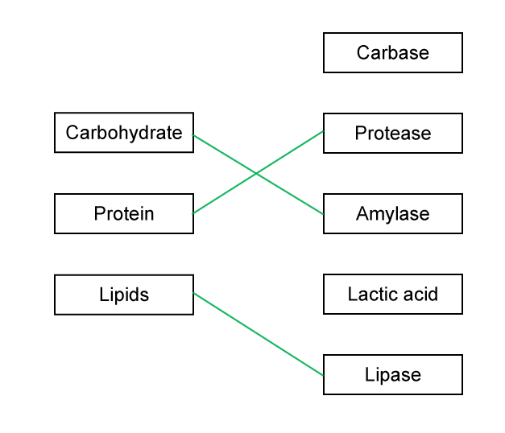
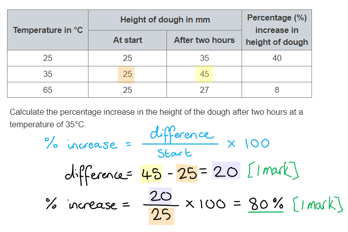
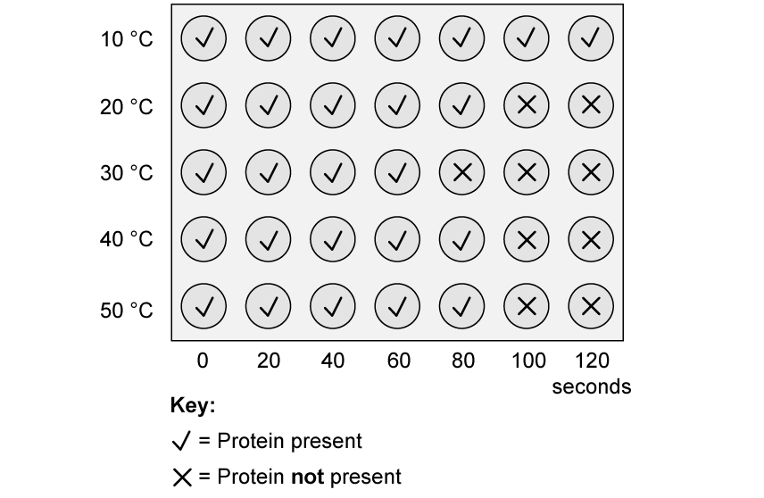
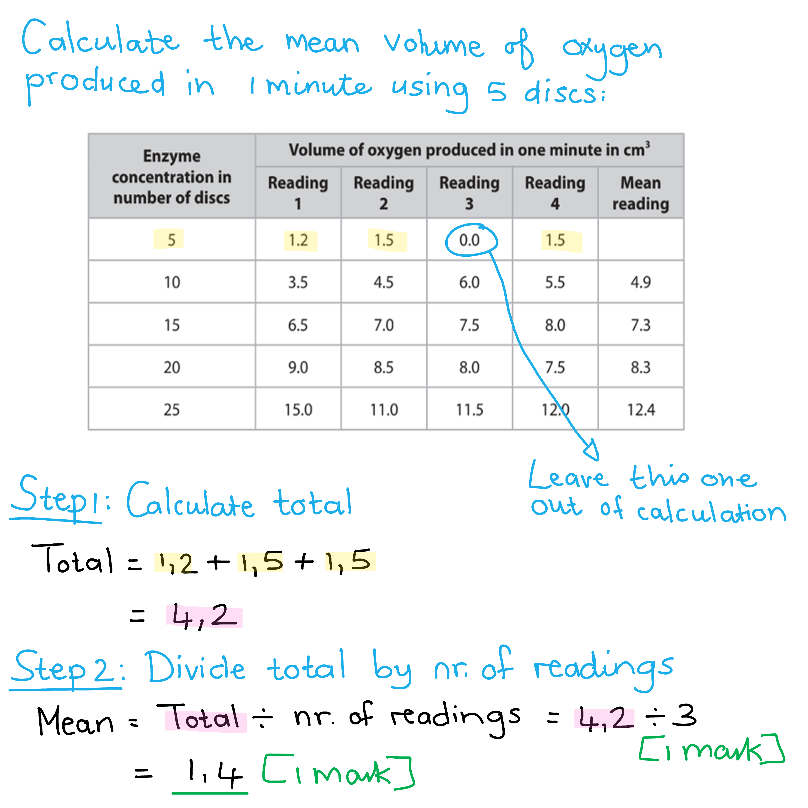
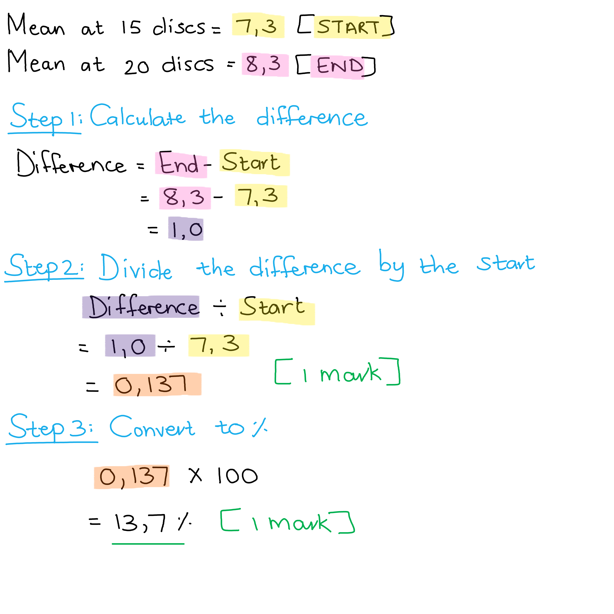
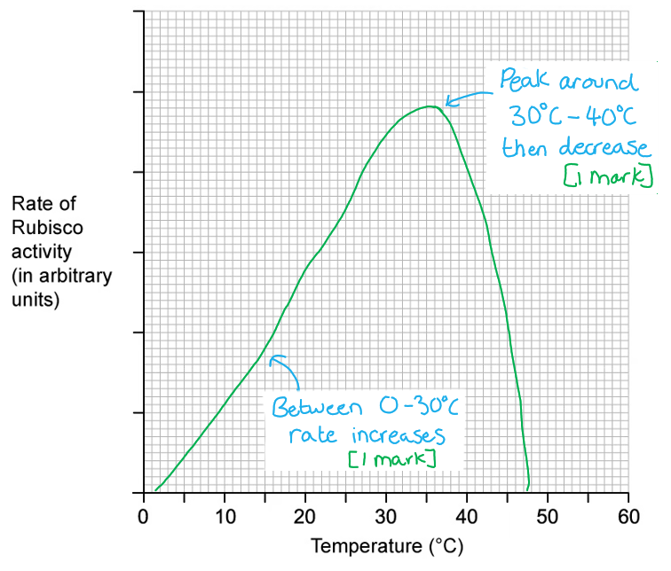
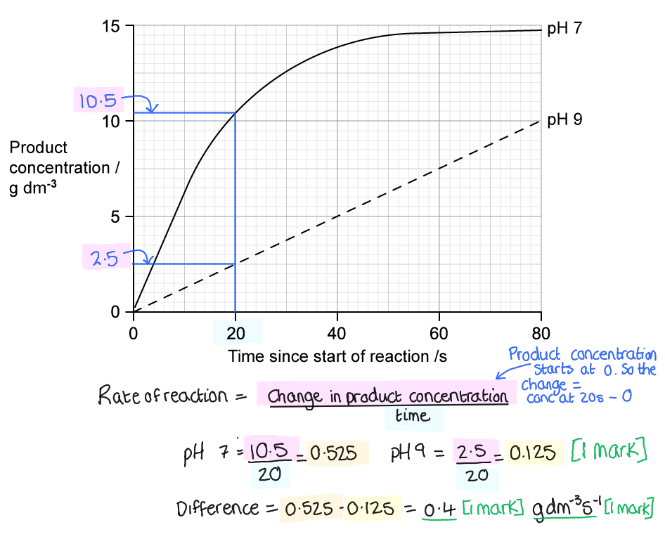

# Mark Schemes — Biological Molecules
**2. Structure & Function in Living Organisms** · Edexcel IGCSE Biology (4BI1)

## Q1 — easy — 4 marks · exam-questions

### 1((a)) — 2 marks
To test a piece of bread to show it contains starch you would...

- Add iodine (solution);** [1 mark]**
- A change to blue-black indicates the presence of starch; **[1 mark]**

***Accept**** purple for blue-black.*

**[Total: 2 marks]**

> *You would also get the mark if you described the colour change as purple but the correct colour that examiners look for is blue-black. *

### 1((b)) — 2 marks
(i) **The correct answer is B because...**

Multicellular fungi are mainly made up of thread-like structures known as hyphae that contain many nuclei and are organised into a network known as a **mycelium**.

**A** is incorrect because mycelium is not found in bacterial cells.

**C** is incorrect because mycelium is not found in protoctista.

**D **is incorrect because mycelium is not found in a virus

(ii) **The correct answer is A because...**

Amylase is a type of carbohydrase enzyme that digests starch into maltose.

**B** is incorrect because ligase is an enzyme that can catalyse the joining (ligation) of two large molecules by forming a new chemical bond.

**C** is incorrect because lipase is an enzyme that digests fats (lipds) into fatty acids and glycerol.

**D **is incorrect because proteases are a group of enzymes that digest proteins into amino acids.

Just because this question is not about humans, the same principles and knowledge applies to enzymes here. All living organisms make enzymes to support their survival.

**[Total: 2 marks]**

## Q2 — easy — 8 marks · exam-questions

### 1() — 3 marks
The molecules can be identified as follows...

- X = DNA;** [1 mark]**
- Y = lipid/triglyceride;** [1 mark]**
- Z = protein/polypeptide; **[1 mark]**

**[Total: 3 marks]**

> *The DNA molecule can be identified by its double helix shape and base pairs; this is a structure you should be familiar with from key stage 3. The DNA double helix is also covered briefly later on in the combined science course and in more detail as part of the "Separate Science: Biology Only" section.*

> *Y shows one molecule attached to 3 other identical molecules; this represents glycerol attached to 3 fatty acids.*

> *Z shows amino acids joined in a long chain to make a protein.*

### 2() — 1 marks
An element found in all of the biological molecules could be...

- Carbon / hydrogen / oxygen;** [1 mark]**

**[Total: 1 mark]**

### 3() — 4 marks
(i) The test used to identify this molecule in a sample of food is...

- Add biuret reagent/solution (to prepared food sample); **[1 mark]**
- Colour change from blue to violet/purple **OR** a positive result appears violet/purple; **[1 mark]**

(ii) The effect of a high temperature on a protein molecule is as follows...

Any **two** of the following:

- The bonds (that hold the protein together) will break; **[1 mark]**
- The shape (of the active site) will change; **[1 mark]**
- The protein/enzyme will denature; **[1 mark]**
- The protein will no longer function **OR** the enzyme will no longer fit with its substrate / catalyse its reaction; **[1 mark]**

> *You should be aware that** enzymes are made of protein**, so high temperatures will affect other proteins in the same way that they affect enzymes. Marks are available here for answers relating to proteins in general or to enzymes specifically.*

**[Total: 4 marks]**

## Q3 — easy — 10 marks · exam-questions

### 1() — 2 marks
(i) The chemical formula for glucose is...

- C6H12O6; **[1 mark]**

(ii) The disaccharide formed from glucose and fructose is...

- Sucrose; **[1 mark]**

> *It can be tricky to remember which disaccharide is which; maltose contains two molecules of glucose while **sucrose **contains a molecule of **glucose** and a molecule of **fructose**.*

**[Total: 2 marks]**

### 2() — 3 marks
(i) An enzyme is...

Any **two** of the following:

- A protein; **[1 mark]**
- A biological catalyst; **[1 mark]**
- Functions to <u>increase the rate</u> of chemical reactions in living organisms **OR **speed up chemical reactions in cells;** [1 mark]**
- Without being used up / changed (during the reaction);** [1 mark]**

*Ignore 'catalyst' on its own.*

(ii) The enzyme responsible for the digestion of starch is...

- Amylase; **[1 mark]**

**[Total: 3 marks]**

### 3() — 2 marks
Molecule **X** is known as the...

- Substrate;** [1 mark]**

Location **Y **is known as the...

- Active site; **[1 mark]**

**[Total: 2 marks]**

> *A substrate is any substance that an enzyme acts on and the active site is specifically complementary to one substrate.*

### 4() — 3 marks
(i) The name of the product is...

- Maltose; **[1 mark]**

> *You should be aware that starch is made up of **a long chain of glucose molecules**, so when starch is fully broken down, glucose is produced. However, the diagram here shows incomplete digestion; the molecules produced are **disaccharides**. The disaccharide that contains** two molecules of glucose** is **maltose**.*

(ii) The variables are....

- Independent = temperature; **[1 mark]**
- Dependent = time taken for the solution to change from brown to black;** [1 mark]**

> *You need to be confident in identifying variables in an experiment. Remember that:*

- *The independent variable is the one **that we change** on purpose.*
- *The dependent variable is the one **that we measure** (the dependent variable **depends** on the independent variable).*

**[Total: 3 marks]**

## Q4 — easy — 8 marks · exam-questions

### 1() — 3 marks
The completed table is as follows...

Award **1 mark** for each correct **row**:

| **Test reagent** | **Substance being tested** | **Result if positive** | **Result if negative** |
|---|---|---|---|
| Biuret solution | Protein | Purple | Blue |
| Iodine solution | Starch | Blue/black | Orange/brown |
| Benedict's solution | Glucose | Green/orange/red | Blue |

*Accept 'reducing sugars' for the substance tested for by Benedict's solution.*

**[Total: 3 marks]**

### 2() — 3 marks
The lines should match up the enzymes and molecules as follows...

Award 1 mark for each correctly drawn line:

*Reject any biological molecules for which more than one line has been drawn.*

**[Total: 3 marks]**

### 3() — 1 marks
This rate of reaction can be explained as follows...

Any **one** of the following:

- This is the optimum temperature for enzyme activity;** [1 mark]**
- Enzymes are catalysing the reaction at the fastest rate possible / enzyme-substrate complexes are forming as fast as possible;** [1 mark]**

**[Total: 1 mark]**

### 4() — 1 marks
**The correct answer is ****B****.**

All biological molecules contain H, O and C. Proteins also have nitrogen.

The other answers are incorrect because they contain the wrong combination of molecules. Amino acids are not chemical elements and calcium and sulfur are elements which are not part of the main four elements that build proteins.

**[Total: 1 mark]**

## Q5 — easy — 11 marks · exam-questions

### 1() — 3 marks
(i) Another environmental factor which may lead to denaturing of enzymes is...

- High temperature/heat;** [1 mark]**

(ii) When an enzyme becomes denatured, it means that...

Any **two** of the following:

- Bonds (that hold the enzyme together) are broken;** [1 mark]**
- The active site changes shape;** [1 mark]**
- The enzyme can no longer form enzyme-substrate complexes **OR **the substrate can no longer fit into the active site;** [1 mark]**

**[Total: 3 marks]**

### 2() — 4 marks
(i) Substrate X is...

- Starch;** [1 mark]**

> *Remember that starch is the substrate for the enzyme amylase.*

(ii) Buffer solution is used because...

- It maintains the required pH **OR **it keeps the pH the same/controlled throughout the investigation **OR **it allows specific pH levels to be tested;** [1 mark]**

(iii) Two safety precautions would include...

Any **two **of the following:

- Wash hands if they come into contact with solutions / rinse solutions off skin;** [1 mark]**
- Wear goggles / tie hair back;** [1 mark]**
- Clean up spillages/breakages;** [1 mark]**

> *When considering safety precautions remember that acids and alkalis are corrosive, and iodine is an irritant. You should always prepare for a practical with these risks in mind and ensure that any accidents are dealt with correctly.*

**[Total: 4 marks]**

### 3() — 4 marks
(i) Two conclusions that could be made from the results are...

Any **two** of the following:

- Amylase activity is fastest at pH 7 **AND** slowest at pH 5; **[1 mark]**
- pH 7 is the (closest to) optimum; **[1 mark]**
- Starch is digested at all three pH levels / starch does not denature at pH 5/9; **[1 mark]**

> *Note that you cannot conclude that pH 7 **is** the optimum because the pH levels either side of pH 7 have not been tested in this experiment; the reaction time could be faster at pH 6 or 8. More tests would be needed to confirm this.*

(ii) The amylase activity in the stomach would be ...

- There would be little/no amylase activity / amylase activity would be slower than at pH 5; **[1 mark]**

This is because...

Any **one** of the following:

- Stomach acid would denature the enzyme/amylase; **[1 mark]**
- The active site would change shape; **[1 mark]**
- Starch would no longer fit with the enzyme/active site **OR **enzyme substrate complexes would not form; **[1 mark]**

> *pH 5 in the experiment is a weak acid and it causes the enzyme activity to decrease, so we would expect that in a strong acid the effect on the enzyme would be greater. The enzyme could **denature** altogether, or it could just slow down further, but either way we would expect the activity of amylase in the stomach to **decrease below that seen for pH 5**.*

**[Total: 4 marks]**

## Q6 — medium — 6 marks · exam-questions

### 11() — 6 marks
An investigation to find out if argan oil shampoo does increase the strength of human hair would include the following...

Any **six** of the following:

- **C** - have a shampoo with oil and one without oil; **[1 mark]**
- **O** - hair from the same person / people with the same hair type; **[1 mark]**
- **R** - repeat test with each shampoo a minimum of three times / a stated number of times that is higher than three, e.g. five; **[1 mark]**
- **M1** - add weights / masses to hairs; **[1 mark]**
- **M2** - measure mass / g / pressure / weight / force /N that causes hair to break; **[1 mark]**
- **S1** - same volume / concentration of shampoo / same type of shampoo with and without oil;** [1 mark]**
- **S2** - wash for same time / frequency / same temperature of water / dry hair by the same method; **[1 mark]**

**[Total: 6 marks]**

> *Remember that with **CORMS** questions you will not be expected to know anything about the experiment you're presented with. You just have to apply your knowledge of experimental design to a new scenario. *

> *Remember that **CORMS** stands for: **C**hange, **O**rganism, **R**epeat, **M**easure, **S**ame. There are always two marks available for **M**easure and two for **S**ame. *

> *The most difficult mark to get is the **O**rganism because you need to remember to include the word **same** in your answer, eg. "same species". The point for **O**rganism needs to be different to the two points in **S**ame. *

> *Remember to write your answers in full sentences, as stated in the question stem, but you are welcome to make a quick bullet point plan in a blank space somewhere else on your page. Use your plan to tick off and make sure you've hit all the marking points.*

## Q7 — medium — 9 marks · exam-questions

### 1() — 3 marks
A protein can be described as follows:

Any **three** of the following:

- Contains chemical elements carbon, oxygen, hydrogen, nitrogen;** [1 mark]**
- Amino acids joined together (in chains to make protein);** [1 mark]**
- The order of amino acids determines the shape of the protein;** [1 mark]**
- Enzymes have an active site (where the substrate will bind); **[1 mark]**

**[Total: 3 marks]**

### 2() — 4 marks
Enzyme action is as follows:

Any **four **from the following:

- Substrate fits into the <u>active site</u> of the enzyme; **[1 mark]**
- The substrate and active site are <u>complementary</u> in shape; **[1 mark]**
- Substrate acts as the key, enzyme the lock (they fit together like a lock and key); **[1 mark]**
- An enzyme-substrate complex forms; **[1 mark]**
- Enzyme catalyses the reaction to give/yield a product; **[1 mark]**
- The substrate is converted/broken down into products; **[1 mark]**
- After the enzyme has catalysed the reaction, the product is released from the active site; **[1 mark]**
- The enzyme is free to act on more substrate molecules;* ***[1 mark]**

**[Total: 4 marks]**

> *In this question, you should be able to explain enzyme/substrate specificity by explaining how the substrate and active site are complementary in shape and fit together like a key in a lock. To get full marks you need to use the correct keywords (substrate and active site) and mention how a product is produced which is then released from the enzyme.*

> *It is important to remember that the enzyme and substrate are not the 'same' shape, but 'complementary' which means opposite. *

### 3() — 2 marks
The role that digestive enzymes play is...

- Breaking down carbohydrates into glucose; **[1 mark]**
- (Glucose is) used for respiration (in cells) **OR** is the reactant/substrate required for respiration; **[1 mark]**

**[Total: 2 marks]**

## Q8 — medium — 8 marks · exam-questions

### 3((b)) — 2 marks
The percentage increase in the height of the dough after two hours at a temperature of 35 °C is...

- 20; **[1 mark]**
- 80 (%);** [1 mark]**

*Full marks can be awarded for the correct answer of 80 % in the absence of other calculations.*

**[Total: 2 marks]**

### 3((b)) — 2 marks
Yeast causes the bread dough to increase in height because...

Any **two **of the following:

- (Yeast) respires / (carries out) fermentation; **[1 mark]**
- (Respiration of yeast cells) produces carbon dioxide; **[1 mark]**
- (Carbon dioxide) bubbles become trapped/stuck in the dough / cause the dough to inflate; **[1 mark]**

**[Total: 2 marks]**

### 3((b)) — 2 marks
The dough rises to a different height at 25 °C compared with the height at 35 °C because...

Any **two **of the following:

- At 25 °C the (kinetic) energy is lower / molecules move more slowly; **[1 mark]**
- (There are therefore) fewer collisions / fewer enzyme-substrate complexes **OR** (the temperature is) further away from enzyme optimum; **[1 mark]**
- Less carbon dioxide/gas is released; **[1 mark]**

***Accept ****the reverse argument for all of the above, e.g. for marking point 1 "at 35 °C the kinetic energy is ****higher****" etc.*

**[Total: 2 marks]**

### 3((b)) — 2 marks
The dough rises to a different height at 35 °C compared with the height at 65 °C because...

Any **two **of the following:

- At 35 °C the enzymes are not denatured; **[1 mark]**
- The substrate fits into the active site / the active site shape is not changed; **[1 mark]**
- Respiration continues / more carbon dioxide is produced / yeast cells are alive;** [1 mark]**

***Accept ****the reverse argument for all of the above, e.g. for marking point 1 "at 65 °C the enzymes ****are ****denatured" etc.*

**[Total: 2 marks]**

## Q9 — medium — 10 marks · exam-questions

### 1() — 4 marks
The trend can be described and explained as follows:

Any **four** from the following:

- ***Description:***** **As temperature increases from 0 to 32.5 °C, enzyme activity also increases **OR **enzyme activity increases with temperature initially; **[1 mark]**
- ***Explanation*****: **Kinetic energy increases / enzymes and substrate move around more so there are more successful collisions **OR** more enzyme substrate complexes form; **[1 mark]**
- ***Description*****: **Enzyme activity peaks at 32.5 °C; **[1 mark]**
- ***Explanation*****: **This is the optimum temperature for this enzyme; **[1 mark]**
- ***Description*****: **After 32.5 °C / this (optimum) point, enzyme activity decreases as temperature increases; **[1 mark]**
- ***Explanation*****: **Enzymes become <u>denatured</u> so enzyme-substrate complexes can no longer form **OR **high temperatures lead to bonds breaking in the enzyme active site so the shape is no longer complementary to the substrate;** [1 mark]**

*Marks should only be awarded for explanations linked to the correct description*

**[Total: 4 marks]**

> *This is a describe and explain question, so you should ensure you have described the** trend** and then explained **why i**t appears like that.*

### 2() — 2 marks
The enzyme is not one from the human body because:

- The optimum temperature of this enzyme is 32.5 °C; **[1 mark]**
- The temperature of the human body is 37 °C;** [1 mark]**

**[Total: 2 marks]**

> *The optimum temperature of enzymes in the human body is 37 °C which is important in ensuring efficient enzyme activity. The enzyme in part (a) is not as efficient at 37 °C due to the enzyme starting to become denatured.*

### 3() — 1 marks
The protein and pepsin solutions were left in the water bath in step 3 to:

- Allow the protein and pepsin solutions to equilibrate (to the temperature of the water bath) **OR** to get the protein and pepsin solutions to the same temperature / 20 °C; **[1 mark]**

**[Total: 1 mark]**

### 4() — 2 marks
The image should be completed as follows:

- 30 °C all wells contain a symbol and must contain at least three crossed wells (X) at the end; **[1 mark]**
- 40 °C all wells contain a symbol and must have fewer crossed wells (X) at the end than at 30 °C; **[1 mark] **

**[Total: 2 marks]**

> *As protease is an enzyme of the human digestive system, the optimum temperature will be around 37 °C. Protein will be digested more quickly at 30 °C than 40 °C as the enzymes will start to be denatured after the optimum. To achieve each marking point, you are not allowed a crossed well followed by a ticked well. A model answer is shown below.*

### 5() — 1 marks
Protease is secreted from the:

Any **one **from the following:

- Pancreas; **[1 mark]**
- Stomach; **[1 mark]**
- Small intestine; **[1 mark]**

**[Total: 1 mark]**

> *Protease is a category of enzyme so there are several different types released at different points throughout the digestive system to ensure efficient break down of proteins. *

## Q10 — medium — 9 marks · exam-questions

### 1() — 2 marks
The term 'semi-quantitative' means:

- Different colours correspond to different glucose (reducing sugar) levels; **[1 mark]**
- Tests can be ranked on glucose content, but we don't know the exact levels / quantities; **[1 mark]**

**[Total: 2 marks]**

> *Qualitative **tests just say whether a quality is present; for example, if there are people in different rooms, yes or no.*

> *Quantitative **tests give exact numerical data as the results; for example to say how many people are in each room.*

> *A **semi-quantitative** test is somewhere between. It will say that there are more people in one room than another, and maybe rank the rooms by how many people are in each one, **without giving any information about the numbers** of people in each.*

### 2() — 2 marks
The purpose of the test tube containing just water is:

- As a control; **[1 mark]**
- To allow comparison of each test tube **OR** to show a definite zero colour change; **[1 mark]**

**[Total: 2 marks]**

> *Water doesn't contain glucose so can be expected to show a negative result (no colour change). If the test using water had shown a colour change, even a very subtle one, the test would not be reliable as an indicator for glucose or other reducing sugars. *

### 3() — 2 marks
The test for lipids is known as an emulsion test because:

- A suspension of small droplets is formed; **[1 mark]**
- As lipids come out of solution / are insoluble in water; **[1 mark]**

*Allow: solution turns cloudy*

**[Total: 2 marks]**

> *Here you would have to give a notion that you know what an emulsion is; think of emulsion paint, which is a liquid containing millions of tiny suspended particles to make it appear opaque.*

### 4() — 3 marks
The colour changes of the iodine test on the food samples shown in the table are:

| **Food sample** | **Iodine test result** |
|---|---|
| Bagel | **Blue/black** |
| Eggs | **No change / orange/brown** |
| Fish | **No change / orange/brown** |
| Rice | **Blue/black** |
| Grapefruit | **No change / orange/brown** |

All 5 rows correct; **[3 marks]** 3 or 4 rows correct; **[2 marks]** 1 or 2 rows correct; **[1 mark]**

*Ignore ticks/crosses or Yes/No given as answers*

**[Total: 3 marks]**

> *Make sure to read the question stem carefully; it asks for a **colour change**, so just indicating with a tick for a positive result will not earn the marks. This question is asking you to use your prior knowledge to identify the foods that contain starch by predicting which foods will give the positive result in the iodine test. *

## Q11 — medium — 13 marks · exam-questions

### 1() — 1 marks
> **[mark-scheme]**
> **The correct answer is C** **[1 mark]**
> 
> This is because almost all enzymes in living organisms are proteins. Proteins are long chains of amino acids folded in to a very specific 3D shape. Each type of protein has a specific shape that allows it to carry out its function. For each enzyme, that shape creates an active site, which allows the enzyme to bind to its substrate and catalyse (speed up) a reaction.
> 
> **A **is incorrect because carbohydrates are small simple sugars (eg. glucose) or larger, more complex molecules (eg. starch, cellulose).
> 
> **B** is incorrect because an amino acid is a building block of a protein, and an enzyme is not one amino acid, an enzyme is a long chain of many amino acids joined together.
> 
> **D** is incorrect because the building blocks of larger lipid molecules include glycerol and fatty acids, and enzymes are proteins which are long chains of amino acids.

> **[exam-tip]**
> Enzymes are proteins — they are biological catalysts that speed up the rate of reactions. A common mistake is to confuse proteins with amino acids. Amino acids are the small units that join together to make proteins. Although enzymes are proteins and therefore formed from many amino acids joined together, a single amino acid on its own would not make an enzyme. Make sure you are clear on the difference between a protein and its building blocks.

### 2() — 4 marks
> **[mark-scheme]**
> (i) The independent variable in this investigation (the thing being changed) is the temperature** **of the reaction. **[1 mark]**
> 
> (ii) Both the hydrogen peroxide and the beetroot cubes are placed in the water bath before the reaction starts so that they both reach the temperature being tested.** ****[1 mark]**
> 
> ** **(iii) The control variables (things being kept the same each time) for this investigation are:
> 
> Any **two** of the following (1 mark each):
> 
> - Volume of hydrogen peroxide used (e.g. 15 cm³ each time)
> - Concentration of hydrogen peroxide
> - The size/mass/surface area of the beetroot cube
> - The type/variety of potato
> - Time allowed for the reaction/2 minutes
> - Starting conditions (the potato and hydrogen peroxide are both equilibrated for the same time at each temperature)
> 
> **[2 marks]**

> **[exam-tip]**
> This type of question - being presented with a method for an experiment/investigation and asked to identify one of the variables - is the type of a question you should anticipate being asked on a 1B paper. The context may be unfamiliar (eg. it might be an experiment you haven't done before) but you should still be able to identify the independent, dependent and control variables.
> 
> Remember: the independent variable is what has been changed (each time), the dependent variable is what is measured and the control variables are all the things that have been (or need to be) kept the same each time to ensure a fair test is being carried out.

### 3() — 3 marks
The equation to calculate rate is: $r a t e = \frac{volume}{time}$

The rate of reaction can be calculated by dividing the volume of oxygen produced at 40 ℃ by the time the volume was collected over.

First, convert time in minutes to seconds:

1 minute = 60 seconds

2 minutes = 120 seconds **[1 mark]**

Then, carry out the calculation:

$r a t e = \frac{16}{120}$

*rate = 0.13(3) *cm3 per second **[1 mark]**

Finally, convert the answer into standard form:

**0.13 = ****1.3 x 10****-1**** cm****3 ****[1 mark]**

> **[mark-scheme]**
> - One mark for converting the time to seconds correctly.
> - One mark for carrying out the correct calculation.
> - One mark for converting the answer into standard form.
> 
> All three marks would be awarded for the correct answer (**1.3 x 10****-1**** cm****3**) even if no working shown.

> **[exam-tip]**
> Watch out for the following errors when tackling a question like this where you need to convert a figure to correctly calculate a value, and represent that number (if very large or like in this case very small) in standard form:
> 
> - Dividing the volume of oxygen produced at 40℃ by 2 ***minutes***, instead of 120 ***seconds***. Always check the units!
> - Dividing the volume of oxygen by 60 (for 1 minute), ignoring that the volume of oxygen was collected over 2 minutes. Always look carefully at the information provided.
> - Forgetting that when writing a figure with a value <1 in standard form that the power of 10 must be negative, not positive.

### 4() — 2 marks
> **[mark-scheme]**
> The effect of temperature on the rate of reaction is:
> 
> Any **two** of the following (1 mark each):
> 
> - The rate of reaction (as measured by the production of oxygen over 2 minutes/120 seconds) increases from 10°C to 40°C
> - The rate of reaction is highest at 40°C
> - Then the rate of reaction decreases from 40°C to 60°C
> 
> **[2 marks]**

> **[exam-tip]**
> The command word in the question is "describe", so your answer should be focussed in on describing the trends in the results. You will not be awarded marks for explaining the trend in your answer to this question.

### 5() — 3 marks
> **[mark-scheme]**
> The volume of oxygen produced at 60℃ decreases because:
> 
> Any **three** of the following (1 mark each):
> 
> - The enzyme's active site changes shape at higher temperatures
> - The substrate/hydrogen peroxide no longer fits/the enzyme has denatured
> - Fewer enzyme-substrate complexes form
> - So less hydrogen peroxide is broken down/less oxygen produced
> 
> **[3 marks]**

## Q12 — hard — 12 marks · exam-questions

### 6((a)) — 2 marks
The expected relationship between the independent and dependent variable in this demonstration would be...

- The independent variable is enzyme/catalase concentration / number of potato discs **AND **the dependent variable is the rate/volume of oxygen production; **[1 mark]**
- Increasing the independent variable would cause an increase in the dependent variable; **[1 mark]**

**[Total: 2 marks]**

> *Remember that the independent variable is the **one that is changed by the investigator**, in this case, it would be enzyme/catalase concentration or the number of potato discs. This will have an effect on the dependent variable, which is the **one that is measured during the investigation**. For this example, the amount of oxygen produced would represent the dependent variable.*

### 6((b)) — 2 marks
Variables that would be controlled in this demonstration would include...

Any **two** of the following:

- pH / volume of buffer; **[1 mark]**
- The volume of hydrogen peroxide/substrate; **[1 mark]**
- Time / duration of the reaction; **[1 mark]**
- The size / volume / mass / shape / surface area of each disc; **[1 mark]**
- Temperature; **[1 mark]**

**[Total: 2 marks]**

> *Controlled variables are important because they show that the change in the dependent variable is caused by a change in the independent variable e.g. increasing the catalase concentration will also increase the amount of oxygen produced. If we did not control certain variables in an investigation we would not be sure whether it was due to the change in our independent variable or because of another variable (for example the temperature) that was having an effect.*

> *Note that "amount of potato" is not a permitted mark here. You must be specific with your terminology by using words such as mass or volume.*

### 6((c)) — 6 marks
(i) The mean volume of oxygen produced in one minute using 5 potato discs can be calculated as follows...

- 4.2 ÷ 3; **[1 mark]**
- 1.4 cm3; **[1 mark]**

*Full marks awarded for the correct answer in the absence of calculations.*

*Allow* **[1 mark]** *for a mean calculated using all four values, e.g. 4.2 ÷ 4 = 1.05 / 1.1 / 1.0.*

(ii) The percentage increase in the mean volume of oxygen produced in one minute can be calculated as follows...

- [(8.3 - 7.3) ÷ 7.3] x 100; **[1 mark]**
- 13.7/13.69 (%); **[1 mark]**

*Full marks awarded for an answer of 13.7 in the absence of calculations.*

(iii) The relationship between the concentration of enzyme and the mean volume of oxygen produced in one minute can be explained as follows...

Any **two** of the following:

- Increasing the enzyme concentration / number of potato discs increases the volume of oxygen produced; **[1 mark]**
- (This is because there are) more active sites (available for substrate to bind); **[1 mark]**
- (An increase in enzyme concentration) means more collisions / more enzyme substrate complexes form / more enzymes combine with substrates;** [1 mark]**

**[Total: 6 marks]*** *

### 6((d)) — 2 marks
The teacher measured the volume of oxygen after the first minute of the reaction because...

Any **two** of the following:

- To measure the initial / fastest rate (of the reaction) **OR** the reaction will slow down / rate of oxygen production / bubbles produced will slow down (after 10 minutes); **[1 mark]**
- (As time increases) hydrogen peroxide / substrate concentration falls / hydrogen peroxide breaks down / is used up **OR** (at 1 minute) the reaction is not limited by the substrate concentration **OR** the reaction may have finished by 10 minutes; **[1 mark]**
- (This would allow for a) valid (comparison to be made between different enzyme concentrations);** [1 mark]**

**[Total: 2 marks]**

> *After 10 minutes the amount of substrate available for the reaction would be very depleted and may limit the reaction rate. This would have an impact on the results as the volume of oxygen produced would decrease due to a lack of available substrate, not because of enzyme concentration. It is therefore best to measure the initial reaction rate to ensure that substrate availability isn't an influencing factor.*

## Q13 — hard — 8 marks · exam-questions

### 2((a)) — 3 marks
A saprotrophic fungus such as mould obtains its food by...

Any **three** of the following:

- (The use/release of) enzymes; **[1 mark]**
- (Feeding on) dead/decaying/decomposing organisms;** [1 mark]**
- <u>Extracellular digestion</u>; **[1 mark]**
- Absorbing the digested/broken down food/nutrients/named nutrients, e.g. amino acids / glucose / fatty acids (directly into its cells); **[1 mark]**

**[Total: 3 marks]**

> *This is a synoptic question that requires you to look back to knowledge from the 'variety of living organisms' topic covered earlier in the specification.*

### 2((b)) — 5 marks
(i) A problem with using the level of cloudiness of the solution to determine how spoiled the peas have become is...

Any **one** of the following:

- Judgement of cloudiness is subjective / cannot be repeated (in exactly the same way) by other people / done by eye; **[1 mark]**
- Judgement of cloudiness is qualitative / is not quantitative / cannot be accurately measured (by eye) / cannot accurately measure the difference in cloudiness / is imprecise / cannot see small differences in cloudiness;** [1 mark]**

> *Any measuring method that is carried out by eye is by nature subjective and qualitative. Being subjective means that it is a matter of opinion and will be different for different people, and being qualitative means that no numerical values can be gained, so the data is not an accurate or precise measure of cloudiness.*

(ii)  The appearance of the peas in water at 4 °C can be explained as follows...

Any **two** of the following:

- (There is) less kinetic energy / lower frequency of collisions / collisions happen less often / fewer E-S/enzyme-substrate complexes form **OR** this is not the optimal temperature for enzymes (of the fungi); **[1 mark]**
- (There is) less/only slight fungal growth / less mould/decay/spoilage/digestion;** [1 mark]**
- (This is due to) less/reduced respiration (by the fungal cells); **[1 mark]**

***Accept ****microbes/bacteria for fungi.*

> *At low temperatures enzyme activity is decreased due to a reduction in kinetic energy. This reduction in kinetic energy reduces collisions between molecules and so reduces the frequency at which E-S complexes can form.*

(iii) The appearance of the peas in vinegar at 37 °C can be explained as follows...

Any **two** of the following:

- The enzymes (of the fungi) denature (in the low pH of the vinegar); **[1 mark]**
- The shape of the active site changes **OR** the enzyme can no longer bind with the substrate; **[1 mark]**
- Fungal growth decreases / fungi die/are killed / there is less fungal respiration / there is less spoilage/decomposition; **[1 mark]**

***Reject**** references to high temperatures causing denaturation in marking point 1. *

***Accept ****microbes/bacteria for fungi.*

> *Non-optimum pH values can have a similar effect on enzymes at high temperatures, breaking the chemical bonds that hold the active site together and causing it to denature.*

> *Note that while combined science students are not expected to know about **how to investigate** the effect of enzymes on pH, they are expected to understand how pH can affect enzyme action.*

**[Total: 5 marks]**

> *Note that parts (ii) and (iii) both **explain** questions; no credit will be available for simply describing the data here.*

## Q14 — hard — 9 marks · exam-questions

### 1() — 2 marks
The advantages of using this method rather than the method used by the students is...

Any **two** of the following:

- (A colorimeter is) more accurate / the result will be closer to the true value; **[1 mark]**
- Colorimetry gives results that are quantitative (rather than qualitative) / can be plotted on a graph / analysed using statistical analysis; **[1 mark]**
- The results are less/not subjective / not subject to (student) opinion;** [1 mark]**

*Accept converse answers relating to colour observation.*

**[Total: 2 marks]**

> *This is a **suggest** question, meaning that you need to **apply your knowledge** of good practical procedure to the example provided. When measuring results during an investigation it is always preferable to use a method that will give accurate results that are not subject to opinion. It can also be an advantage to gain quantitative results as they can be analysed more thoroughly.*

### 2() — 1 marks
The final concentration of protein in this solution after 20 seconds was...

- 0.5 (%); **[1 mark]**

**[Total: 1 mark]**

### 3() — 3 marks
The concentration of protein in the solution at 10 °C after 1 minute is different from the concentration at 30 °C after 1 minute because...

- Protein is broken down less quickly at 10 °C / more quickly at 30 °C; **[1 mark]**
- At 10 °C molecules/substrate/enzymes have less kinetic energy than 30 °C;** [1 mark]**
- At 10 °C molecules/substrate/enzymes collide less frequently / form fewer enzyme-substrate complexes than at 30 °C; **[1 mark]**

**[Total: 3 marks]**

### 4() — 3 marks
The absorbance was measured at approximately 1.14 arbitrary units because...

- At 80  °C the enzyme/protease has denatured; **[1 mark]**
- The protein can no longer fit into the active site of the enzyme; **[1 mark]**
- Protein is not broken down (at all) / the protein concentration would remain 1%; **[1 mark]**

**[Total: 3 marks]**

> *The key to answering this question is an understanding that the protease would have denatured at such high temperatures. Therefore there will be no enzyme activity and the protein in the solution won't be digested, thus the absorbance will be the same before and after the experiment.*

## Q15 — hard — 9 marks · exam-questions

### 1() — 1 marks
Rubisco is made in the...

- Ribosomes; **[1 mark]**

**[Total: 1 mark]**

> *Remember that the ribosomes are the sight of protein synthesis and enzymes, such as Rubisco, are proteins.*

### 2() — 2 marks
The 3D shape of rubisco is determined as follows...

- The order of amino acids / amino acid sequence...; **[1 mark]**
- ...determines the position/type of bonds that form within the protein **OR **determine how the protein folds; **[1 mark] **

**[Total: 2 marks]**

### 3() — 4 marks
Body temperatures of above 40 °C can be life threatening because...

Any **four **of the following:

- High temperature leads to the breaking of bonds (that hold the protein/enzyme structure together); **[1 mark]**
- Enzymes/proteins become denatured / denaturation occurs (at high temperatures); **[1 mark]**
- Active sites become deformed / no longer compliment the substrate **OR** the shape/structure of proteins is lost; **[1 mark]**
- Enzymes substrate complexes can no longer be formed **OR** proteins can no longer carry out their specific function; **[1 mark]**
- Important chemical reactions/life processes can no longer take place / named example of a process that stops, e.g. respiration / digestion / transport across cell membranes; **[1 mark]**

**[Total: 4 marks]**

> *Remember that it is not just enzymes that become denatured, but any proteins can undergo these changes under certain conditions. There are many chemical reactions and processes in the human body, all of which rely on functional proteins; if these functional proteins become non-functional then these essential processes will all come to a halt.*

### 4() — 2 marks
The graph would appear as follows...

- An increasing line between 0-30 °C; **[1 mark]**
- A peak between 30-40 °C **AND** followed by a decreasing line;** [1 mark]**

**[Total: 2 marks]**

> *Remember that sketching a graph involves showing the expected patterns or trends; you do not need to worry about axis scales or plotting points when sketching a graph.*

## Q16 — hard — 10 marks · exam-questions

### 1() — 1 marks
**Final answer:** **The correct answer is ****C ****because...**

The students are **changing the pH level on purpose**, so this is the **independent variable**.

The **initial rate of reaction is being measured **(by measuring the volume of oxygen produced) so this is the **dependent variable**.

There are several **control variables** (which **must be kept constant** so that they don't affect the dependent variable), of which one is the volume of hydrogen peroxide being used in the method. Other control variables may include the dimensions of the potato cubes being used, and the temperature.

### 2() — 3 marks
The difference in the rate of reaction is...

- Rate for pH 7 = 0.525 (g dm-3 s-1) **AND** for** ****pH 9 = 0.125 **(g dm-3 s-1)**; [1 mark]**
- 0.4; **[1 mark]**
- g / dm3 / s **OR ** g dm-3 s-1; **[1 mark]**

**[Total: 3 marks]**

### 3() — 2 marks
The differences between the curves include…

Any **two** of the following:

- Product is produced fast<u>er</u> at pH 7 (than at pH 9) throughout; **[1 mark]**
- Rate of product production increases fast<u>er</u> at pH 7; **[1 mark]**
- Product production levels off at pH 7 after 60 s **BUT** continues increasing at pH 9; **[1 mark]**

**[Total: 2 marks]    **** **

> *This question is asking you to state **differences**, so be sure to give comparative statements. Comparative statements either include words such as fast**er** or high**er**, or include both sides of the comparison, e.g. line A does ___ while line B does___. *

### 4() — 1 marks
The curve for pH 7 has this shape because...

- (The curve levels off from around 20 s onwards because) the substrate / hydrogen peroxide is used up **OR** all the substrate is converted into product / oxygen and water;** [1 mark]**

**[Total: 1 mark]  ****   **

> *Remember that you were told the substrate (reactant) and the products earlier on in the question. If there is a finite supply of substrate then there will be a finite quantity of the resulting product. Once the reaction is over no further product can be produced.*

> *Note that answers relating to pH influencing enzyme activity are not correct here. It is clear from the graph that enzyme activity is higher at pH 7 than at pH 9, and the pH does not change through the course of the experiment, so the pH is not slowing down the rate of reaction. Given that other factors would be controlled in an experiment such as this one, it is only the substrate being used up that could cause the levelling off that we see in the curve for pH 7.*

### 5() — 3 marks
If the pH were increased to pH 11, the following would happen...

- No/very little product would be produced / the graph would have a flat line on/near the X-axis; **[1 mark]**

This is because…

- The enzyme denatures at high pH / high pH interferes with the bonds in the enzyme / the active site changes shape at high/alkaline pH;** [1 mark]**
- The enzyme and substrate are no longer complementary to each other / an enzyme-substrate complex cannot form; **[1 mark]**

**[Total: 3 marks]   **
