# Exam Questions — Cell Structure
**2. Structure & Function in Living Organisms** · Edexcel IGCSE Biology (4BI1)
> Source: [https://www.savemyexams.com/igcse/biology/edexcel/19/topic-questions/2-structure-and-function-in-living-organisms/cell-structure/exam-questions/](https://www.savemyexams.com/igcse/biology/edexcel/19/topic-questions/2-structure-and-function-in-living-organisms/cell-structure/exam-questions/) · 16 questions · total 145 marks

## Q1 — easy — 6 marks · exam-questions

### 1() — 3 marks — command: name — structured
The diagram below shows an image of a plant cell.

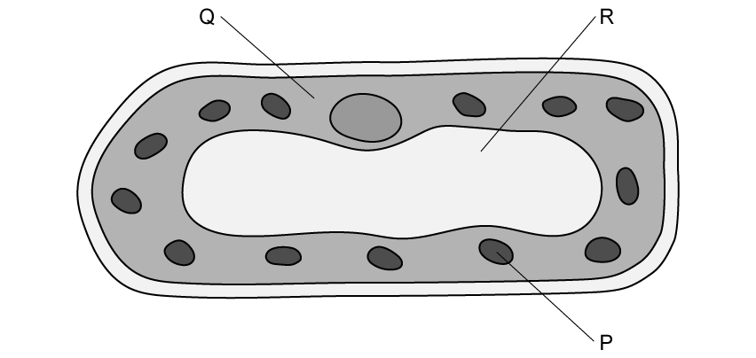

Name structures **P**, **Q** and **R.**

### 2() — 2 marks — command: multiple — structured
(i) Name** **one structure that is** **visible in the diagram that you did not** **identify in your answer to part (a).

**(1)**

(ii) State the function of the structure named in part (i)

**(1)**

### 3() — 1 mark — command: which — structured
Which of the following structures is not found in a prokaryotic cell?

| ☐ | **A** | A cell membrane |
|---|---|---|
| ☐ | **B** | Chloroplasts |
| ☐ | **C** | Plasmids |
| ☐ | **D** | Circular DNA |

## Q2 — easy — 9 marks · exam-questions

### 1() — 2 marks — command: calculate — structured
The diagram below shows a plant cell drawn to scale.

Calculate how many times longer the cell length is than the chloroplast length.

### 2() — 2 marks — command: state — structured
State two ways in which an animal cell would be different to the cell shown in part (a).

### 3() — 3 marks — command: name — structured
#### Separate: Biology Only

The diagram below shows a representation of a specialised plant cell.

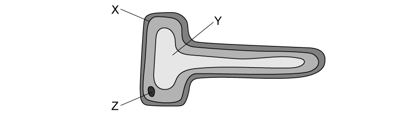

Name the structures labelled **X**, **Y** and **Z**.

### 4() — 2 marks — command: explain — structured
#### Separate: Biology Only

Explain how the cell shown in part (c) is specialised to carry out its function.

## Q3 — easy — 8 marks · exam-questions

### 1() — 4 marks — command: multiple — structured
#### Separate: Biology Only

The image below shows contains information about several types of specialised cell.

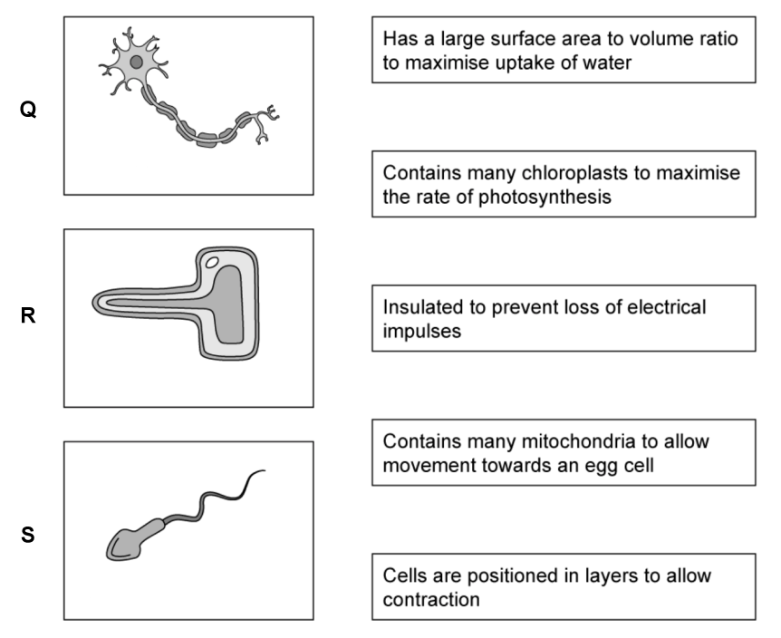

(i) Name the types of specialised cell represented by cells **Q**, **R** and **S**.

**(3)**

(ii) Draw lines between the images and the statements to match each cell with its function.

**(1)**

### 2() — 2 marks — command: explain — structured
#### Separate: Biology Only

Another example of a specialised cell is a red blood cell. One special feature of red blood cells is the absence of a nucleus.

Explain one other special feature of a red blood cell.

### 3() — 2 marks — command: multiple — structured
#### Separate: Biology Only

(i) Name the process by which cells become specialised.

**(1)**

(ii) The process named in part (i) is controlled by the DNA.

Describe how the DNA controls the process named in part (i).

**(1)**

## Q4 — easy — 7 marks · exam-questions

### 1() — 2 marks — command: state — structured
#### Separate: Biology Only

State the meaning of the term **stem cell**.

### 2() — 2 marks — command: name — structured
#### Separate: Biology Only

Name two sources of stem cells.

### 3() — 3 marks — command: describe — structured
#### Separate: Biology Only

Describe how stem cells can be used in medicine. Include an example in your answer.

## Q5 — easy — 9 marks · exam-questions

### 1() — 2 marks — command: calculate — structured
The image below shows a red blood cell viewed under a microscope using a magnification of x6000

Use the formula provided to calculate the actual diameter of the red blood cell. Give your answer in mm.

$\mathrm{Actual} \mathrm{diameter} \mathrm{of} \mathrm{cell} \mathrm{in} \mathrm{mm}=\frac{\mathrm{diameter} \mathrm{shown} \mathrm{in} \mathrm{the} \mathrm{image} \mathrm{in} \mathrm{mm}}{\mathrm{magnification}}$

### 2() — 3 marks — command: multiple — structured
#### Separate: Biology Only

Red blood cells such as that shown in part (a) do not have a nucleus.

(i) Describe the role of the nucleus in cells where it is present.

**(1)**

(ii) Explain why it is useful for the red blood cell not to have a nucleus.

**(2)**

### 3() — 2 marks — command: explain — structured
#### Separate: Biology Only

Red blood cells are an example of a specialised animal cell. An example of a specialised plant cell is a palisade mesophyll cell, shown in the diagram below.

Explain how a palisade mesophyll cell is specialised to carry out its function.

### 4() — 2 marks — command: name — structured
#### Separate: Biology Only

Other than the cell types named in parts (b) and (c), name two other examples of specialised cells.

## Q6 — easy — 2 marks · exam-questions

### 1() — 2 marks — command: calculate — structured
The drawing shows a single *S. aureus* cell that has been magnified.

The actual length of this cell is 1.5 µm.

Calculate the magnification of this drawing.

[1µm = 0.001mm]

## Q7 — medium — 8 marks · exam-questions

### 1((a)) — 2 marks — command: identify — structured — from paper Nov 2020 · 4BI1/1BR
Plant and animal cells have some features in common and some differences.

(i) Identify which of these structures is not found in animal cells?

**(1)**

| ☐ | **A** | cell membrane |
|---|---|---|
| ☐ | **B** | cell wall |
| ☐ | **C** | mitochondrion |
| ☐ | **D** | nucleus |

(ii) Identify which of these substances is a carbohydrate stored in plant cells?

**(1)**

| ☐ | **A** | chlorophyll |
|---|---|---|
| ☐ | **B** | glucose |
| ☐ | **C** | glycogen |
| ☐ | **D** | starch |

### 1((b)) — 6 marks — command: multiple — structured — from paper Nov 2020 · 4BI1/1BR
The diagram shows a leaf palisade mesophyll cell.

(i) Describe the function of the parts labelled **A**, **B**, **C **and **D**.

**(4)**

(ii) Explain two ways that the structure of this palisade mesophyll cell is adapted for its function.

**(2)**

## Q8 — medium — 5 marks · exam-questions

### 7((a)) — 2 marks — command: explain — structured — from paper Nov 2021 · 4BI1/2B
#### Separate: Biology Only

As an embryo develops, its cells differentiate.

Explain the importance of cell differentiation in the development of the growing embryo.

### 7((b)) — 3 marks — command: multiple — structured — from paper Nov 2021 · 4BI1/2B
#### Separate: Biology Only

(i) Identify which of these is a feature of adult stem cells?

**(1)**

| ☐ | **A** | They do not divide |
|---|---|---|
| ☐ | **B** | They divide by meiosis |
| ☐ | **C** | They can become all cell types |
| ☐ | **D** | They are found in some tissues and organs |

(ii) Adult stem cells or embryonic stem cells can be used in medical treatments.

Explain why the choice between these two types of stem cells can cause issues for doctors.

**(2)**

## Q9 — medium — 9 marks · exam-questions

### 1() — 3 marks — command: describe — structured
The diagram below shows a representation of a plant cell.

Describe the functions of structures **P** **Q**, and **R**.

### 2() — 2 marks — command: multiple — structured
(i) Label the diagram in part (a) with an **S** to indicate the location of the cell wall.

**(1)**

(ii) Describe the function of the cell wall.

**(1)**

### 3() — 2 marks — command: multiple — structured
Plants are one of the five groups of eukaryotes.

(i) Name another group of eukaryotes in which you might find structure **P** labelled in part (a).

**(1)**

(ii) State one other feature of the group named in part (i).

**(1)**

### 4() — 2 marks — command: suggest — structured
The cell shown below is found inside a salivary gland.

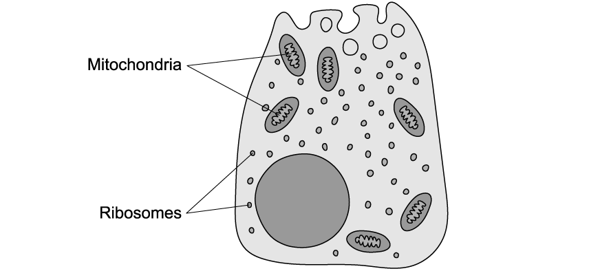

Suggest what can be concluded about the activities of the salivary gland cell from the image above.

## Q10 — medium — 19 marks · exam-questions

### 1() — 4 marks — command: identify — structured
#### Separate: Biology Only

The image below shows four specialised cells. Each cell is represented by a letter, **A**-**D**.

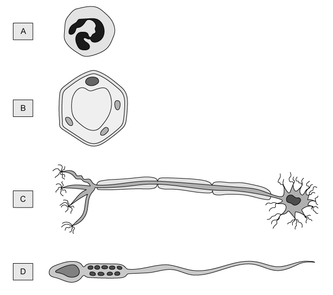

Identify one letter, from** A**-**D**, that corresponds to a cell that is described in each of the following statements. Each letter may be used once, more than once, or not at all.

(i) This is a plant cell.

**(1)**

(ii) This cell contains digestive enzymes.

**(1)**

(iii) This cell is motile (moves around).

**(1)**

(iv) This cell is involved in co-ordination of the body's activities.

**(1)**

### 2() — 2 marks — command: describe — structured
#### Separate: Biology Only

Each of the cells shown in part (a) began its life as a stem cell.

Describe how a stem cell can give rise to the cell types shown in part (a).

### 3() — 5 marks — command: multiple — structured
#### Separate: Biology Only

Muscular dystrophy is a genetic condition in which patients lose muscle mass, leading to muscle weakness.

A clinical trial was carried out to investigate the effectiveness of bone marrow-derived stem cell treatment on muscle regeneration in muscular dystrophy patients.

(i) Bone marrow-derived stem cells are extracted from bone marrow.

Explain the abilities of stem cells taken from bone marrow.

**(2)**

(ii) Suggest how stem cells could be used to treat muscle wasting.

**(3)**

### 4() — 5 marks — command: multiple — structured
#### Separate: Biology Only

The graph below shows some of the results from the trial.

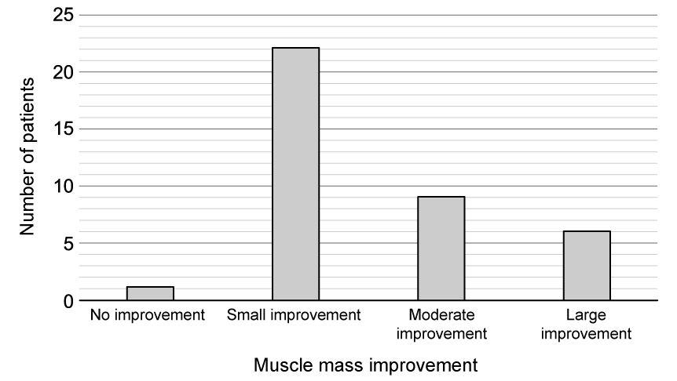

(i) Identify the dependent variable in this trial.

**(1)**

(ii) Suggest how the researchers might have measured the dependent variable identified in part (i).

**(2)**

(iii) Calculate the percentage of participants that showed a large muscle mass improvement in the trial. Give your answer to 1 decimal place.

**(2)**

### 5() — 3 marks — command: evaluate — structured
#### Separate: Biology Only

A medical student concluded from these results that stem cell therapy would be an effective treatment for muscular dystrophy.

Evaluate the student's conclusion.

## Q11 — medium — 9 marks · exam-questions

### 1() — 3 marks — command: name — structured
#### Separate: Biology Only

The image below shows a microscope image of the surface of a plant root.

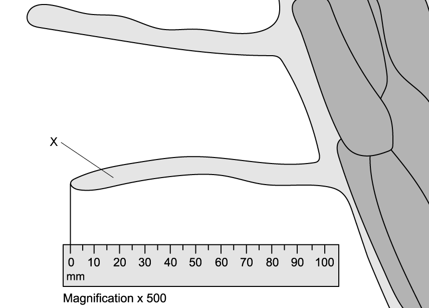

(i) Name structure **X**.

**(1)**

(ii) Name two structures that would be present in structure **X** that would not be found in an animal cell.

**(2)**

### 2() — 2 marks — command: calculate — structured
The actual length of an object in a magnified image can be calculated using the following formula:

$\mathrm{Actual} \mathrm{length}=\frac{\mathrm{length} \mathrm{of} \mathrm{image}}{\mathrm{magnification}}$

Calculate the actual length of structure **X **shown in part (a).

Measure structure **X** from the tip to the point at which the *upper* edge joins the main part of the root.

Give your answer in mm.

### 3() — 4 marks — command: suggest — structured
#### Separate: Biology Only

Suggest why the lack of a fully developed structure **X** could be damaging to a plant.

## Q12 — hard — 7 marks · exam-questions

### 3((a)) — 1 mark — command: name — structured — from paper Nov 2020 · 4BI1/1B
A student uses a light microscope to look at a human cheek cell.

The student makes this drawing of the cell.

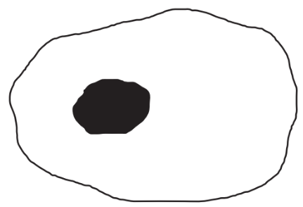

Name the organelle shown in the drawing.

### 3((b)) — 2 marks — command: calculate — structured — from paper Nov 2020 · 4BI1/1B
Mitochondria are organelles that are too small to be seen using a light microscope.

The drawing shows a mitochondrion that has been magnified.

The actual length of this mitochondrion is 6 μm.

[1 μm = 0.001 mm]

Calculate the magnification of this drawing.

### 3() — 4 marks — command: multiple — structured — from paper Nov 2020 · 4BI1/1B
The table gives information about mitochondria in different human cells.

| **Cell** | **Mean number of mitochondria per cell** | **Mean volume of cell in µm****3** | **Mean number of mitochondria per µm****3** |
|---|---|---|---|
| Heart muscle | 5 000 | 15 000 |   |
| Sperm | 75 | 30 | 2.50 |
| Egg | 600 000 | 4 000 000 | 0.15 |

(i) What is the mean number of mitochondria per μm3 in a heart muscle cell?

**(1)**

| ☐ | **A** | 0.33 |
|---|---|---|
| ☐ | **B** | 3 |
| ☐ | **C** | 10 000 |
| ☐ | **D** | 75 000 000 |

(ii) Comment on the differences in the data for the sperm and for the egg.

**(3)**

## Q13 — hard — 10 marks · exam-questions

### 1() — 2 marks — command: multiple — structured
The image below is an electron microscope photograph of a cell.

(i) Name the group of organisms from which the cell shown in the image has been taken.

**(1)**

(ii) Explain how you identified the group of organisms in part (i).

**(1)**

### 2() — 3 marks — command: explain — structured
Structure **Y** in part (a) is a starch granule.

Explain why structure **Y** is present inside structure **X** in the image in part (a).

### 3() — 3 marks — command: name — structured
Name** three** structures that are not clearly identifiable in the image in part (a) that you would expect to find inside cells from this group of organisms.

### 4() — 2 marks — command: calculate — structured
The cell in part (a) has been magnified 7.5 x 103 times, and the image of the nucleus has a diameter of 6.5 cm.

Use the formula below to calculate the actual diameter of the nucleus. Give your answer in μm.

$\mathrm{Actual} \mathrm{diameter}=\frac{\mathrm{image} \mathrm{diameter}}{\mathrm{magnification}}$

Note that 1 μm = 0.001 mm

## Q14 — hard — 13 marks · exam-questions

### 1() — 3 marks — command: name — structured
#### Separate: Biology Only

The image below is a representation of an electron microscope photograph of part of a sperm cell.

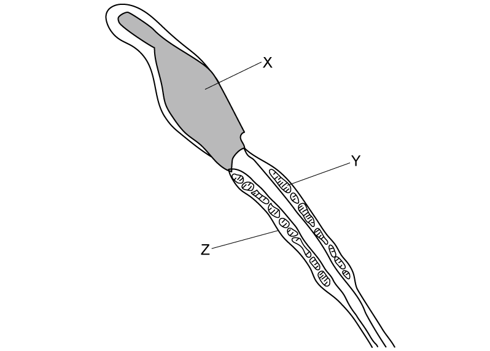

Name structures **X**, **Y** and **Z** labelled in the image.

### 2() — 2 marks — command: explain — structured
#### Separate: Biology Only

Label **two** additional features on the image in part (a) with descriptions that explain how the features aid the sperm cell in its function.

### 3() — 3 marks — command: multiple — structured
#### Separate: Biology Only

Sperm cells are produced in the testes in a process known as spermatogenesis. A summary of spermatogenesis is shown in the image below.

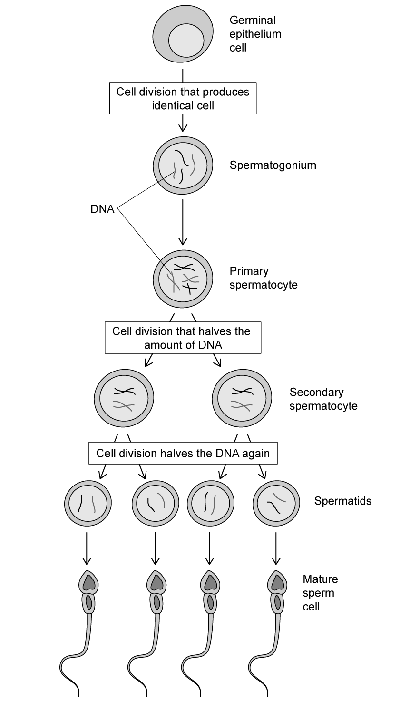

(i) Label the image above with a letter **D** to indicate where the process of differentiation is occurring.

**(1)**

(ii) Explain what is taking place at letter **D** in order for differentiation to occur.

**(2)**

### 4() — 5 marks — command: multiple — structured
Spermatogonial stem cells (SSCs) can be used to treat male infertility.

(i) Suggest how SSCs could be used to treat male infertility.

**(2)**

(ii) Some research in mice has suggested that SSCs have the ability to become many different cell types.

Evaluate the potential use of SSCs in stem cell therapy.

**(3)**

## Q15 — hard — 10 marks · exam-questions

### 1() — 2 marks — command: calculate — structured
The diagram below shows three different cells.

Calculate the size ratio of the bacterial cell compared to the liver cell and mesophyll cell.

### 2() — 3 marks — command: multiple — structured
The electron microscope image below shows a section from the inside of a liver cell...

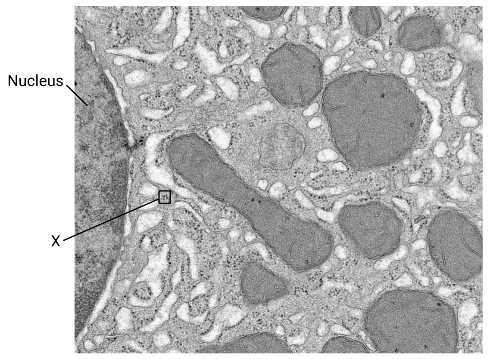

Bochimoto H, Matsuno N, Ishihara Y, Shonaka T, Koga D, Hira Y, et al., CC BY 4.0 <https://creativecommons.org/licenses/by/4.0>, via Wikimedia Commons

(i) Name the organelles indicated by **X**.

**(1)**

(ii) Use information in the image to suggest the possible cell activities that take place inside a liver cell.

**(2)**

### 3() — 2 marks — command: describe — structured
#### Separate: Biology Only

The liver is known to have a strong regenerative ability, meaning that when the liver is damaged it can regenerate itself within days. This regenerative ability is thought to be due to several types of adult stem cells present within and around the liver.

Describe the differences between adult stem cells and stem cells taken from an embryo.

### 4() — 3 marks — command: suggest — structured
#### Separate: Biology Only

Scientists researching the regenerative capacity of the liver have identified a chemical signalling pathway inside liver cells that prevents the liver from growing too large when it regenerates. This chemical signalling pathway has been named 'Hippo'.

A recent discovery has shown that switching off the Hippo signalling pathway reverses the differentiation process, resulting in de-differentiated liver cells.

Suggest what this discovery could mean for the development of stem cell therapies.

## Q16 — hard — 14 marks · exam-questions

### 1() — 5 marks — command: multiple — structured
#### Separate: Biology Only

The image below shows a light microscope photograph of part of a plant root.

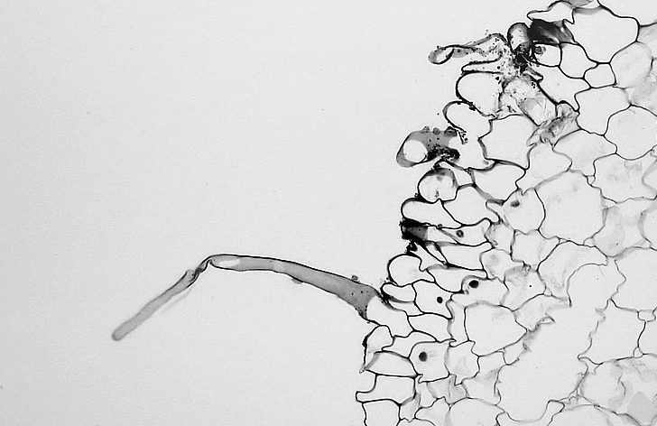

Berkshire Community College  Bioscience Image Library, CC0, via Wikimedia Commons

(i) Name the type of specialised plant cell visible in the image.

**(1)**

(ii) Explain how the process of differentiation has allowed the cell in the image to carry out its specific function in plants.

**(4)**

### 2() — 4 marks — command: explain — structured
A group of scientists carried out a study to investigate the starch content of roots in a species of grass at four points throughout the year.

Their results can be seen in the graph below.

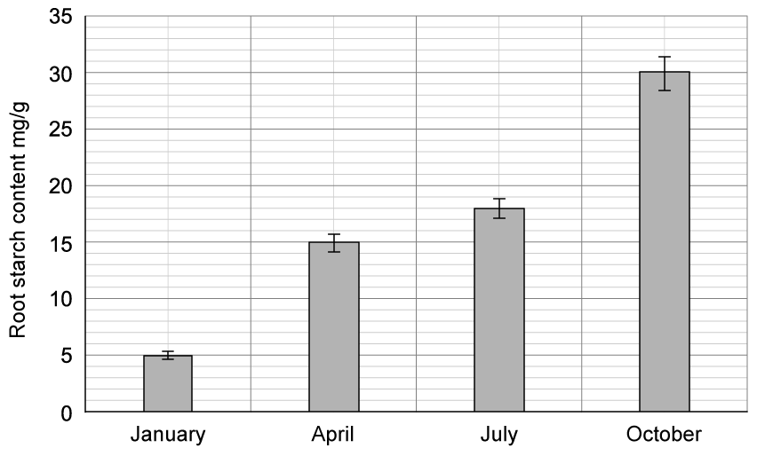

(i) Explain why the grass roots contain starch.

**(2)**

(ii) Explain how the starch found in the roots of grass species helps to support growth of the grasses.

**(2)**

### 3() — 5 marks — command: multiple — structured
(i) Calculate the percentage change in stored starch from January to October in the graph in part (b).

**(2)**

(ii) Suggest an explanation for the change calculated in part (i).

**(3)**
