# Exam Questions — Co-ordination & Response
**2. Structure & Function in Living Organisms** · Edexcel IGCSE Biology (4BI1)
> Source: [https://www.savemyexams.com/igcse/biology/edexcel/19/topic-questions/2-structure-and-function-in-living-organisms/co-ordination-and-response/exam-questions/](https://www.savemyexams.com/igcse/biology/edexcel/19/topic-questions/2-structure-and-function-in-living-organisms/co-ordination-and-response/exam-questions/) · 21 questions · total 150 marks

## Q1 — easy — 4 marks · exam-questions

### 1((b)) — 1 mark — command: which — structured — from paper Jan 2021 · 4BI1/1BR
Which of these is an example of positive phototropism?

| ☐ | **A** | A plant root growing away from light |
|---|---|---|
| ☐ | **B** | A plant root growing downwards due to gravity |
| ☐ | **C** | A plant stem growing towards light |
| ☐ | **D** | A plant stem growing upwards due to gravity |

### 1((c)) — 3 marks — command: complete — structured — from paper Jan 2021 · 4BI1/1BR
The table lists the roles of some substances found in living organisms.

Complete the table by naming each substance.

The first one has been done for you.

| **Role of substance** | **Name of substance** |
|---|---|
| Positive phototropism | Auxin |
| Digests fat |   |
| Diffuses across a synapse |   |
| Prevents scurvy |   |

## Q2 — easy — 8 marks · exam-questions

### 1() — 2 marks — command: name — structured
Name the organs of the central nervous system (CNS).

### 2() — 4 marks — command: complete — structured
Complete the sentences below using words from the box provided.

The nervous system detects a change in the environment known as a .................. using specialised cells called ...................... . Signals known as ..................... are then sent along neurones to the ...................... which co-ordinates a response.

| CNS         Sensors          Impulses          Electricity          Receptors  Stimulus          Sensory      Neurones          Bright light |
|---|

### 3() — 1 mark — command: what — structured
The diagram below shows the structure of two neurones.

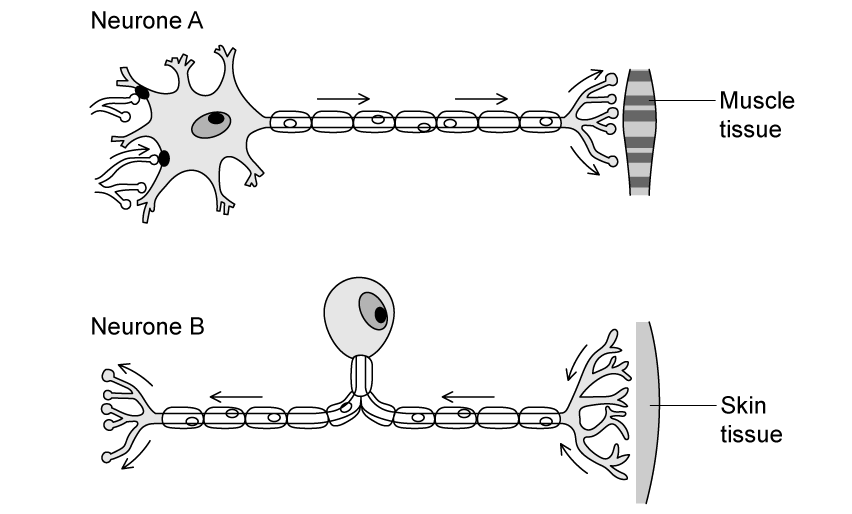

What type of neurone is **Neurone** **A**?

| ☐ | **A** | Relay neurone |
|---|---|---|
| ☐ | **B** | Sensory neurone |
| ☐ | **C** | Motor neurone |
| ☐ | **D** | Reflex neurone |

### 4() — 1 mark — command: give — structured
Nerve impulses eventually reach an organ known as the effector.

Give one example of an effector organ.

## Q3 — easy — 8 marks · exam-questions

### 1() — 1 mark — command: name — structured
The diagram shows part of the nervous system involved in a reflex action when a person steps on a sharp pin.

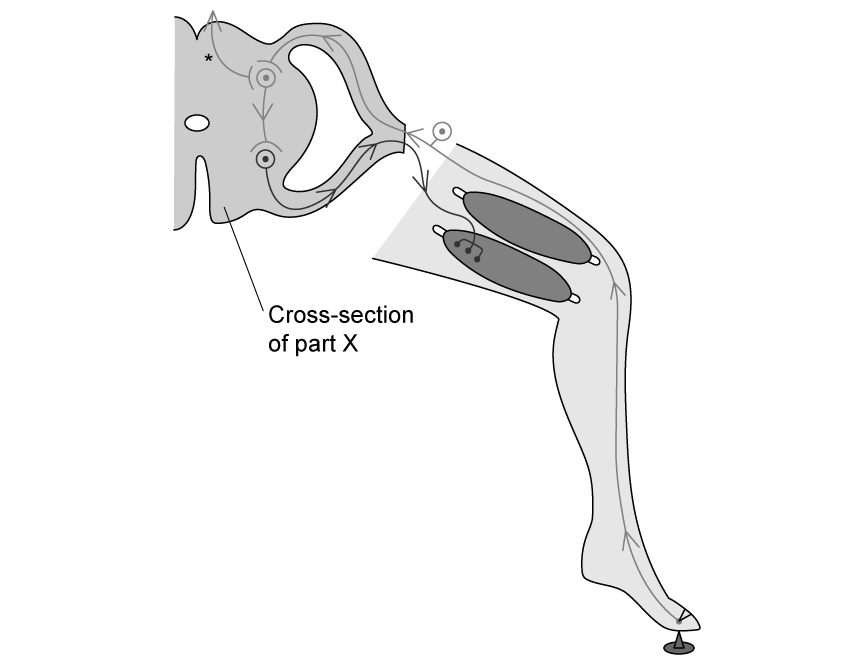

Name structure **X** in the diagram.

### 2() — 3 marks — command: describe — structured
Describe the journey taken by the nerve impulse between the sharp pin and the relay neurone within structure **X** shown in part (a).

### 3() — 2 marks — command: explain — structured
Explain the importance of the reflex arc for living organisms.

### 4() — 2 marks — command: calculate — structured
The average speed of a nerve impulse in the human body is 100 metres per second.

A man, who is 2 metres tall, accidentally stubs his toe in the dark.

Use the equation below to calculate the time it takes the nerve impulse to travel to his brain

$\mathrm{Time}=\frac{\mathrm{Distance}}{\mathrm{Speed}}$

## Q4 — easy — 7 marks · exam-questions

### 1() — 2 marks — command: complete — structured
The table below contains statements relating to the nervous and endocrine systems of the body.

Complete the table by putting a tick (✓) beside each statement to indicate whether it applies to the nervous system or the endocrine system. The first has been done for you.

| **Statement** | **Nerves** | **Hormones** |
|---|---|---|
| Very fast action | ✓ |   |
| Acts for a long time |   |   |
| Makes use of chemical messenger molecules |   |   |
| Acts on target cells in certain tissues |   |   |
| Act for a** **short time |   |   |
| Contains neurones |   |   |

### 2() — 1 mark — command: name — structured
The diagram below shows the male endocrine system.

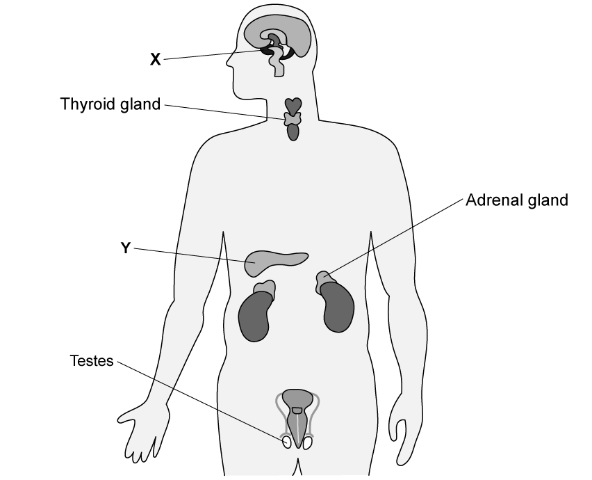

The gland labelled **Y** is the pancreas.

Name one hormone released by the pancreas.

### 3() — 2 marks — command: describe — structured
Describe how the pancreas, identified in part (b), regulates blood glucose when levels rise above normal limits.

### 4() — 2 marks — command: multiple — structured
The diagram in part (b) identifies the testes.

(i) Name a hormone produced by the testes.

**(1)**

(ii) State one role of the hormone identified in part (i).

**(1)**

## Q5 — easy — 6 marks · exam-questions

### 1() — 1 mark — command: name — structured
Name the chemical produced by plants that are responsible for both phototropism and geotropism.

### 2() — 1 mark — command: which — structured
Which of the following statements correctly describes the effect that the chemical named in (a) has on plant growth?

| ☐ | **A** | Promotes growth in both the shoot and the root. |
|---|---|---|
| ☐ | **B** | Inhibits growth in both the shoot and the root. |
| ☐ | **C** | Promotes growth in the shoot but inhibits growth in the root. |
| ☐ | **D** | Inhibits growth in the shoot and promotes growth in the root. |

### 3() — 3 marks — command: explain — structured
Explain the importance of the phototropism response for plant survival.

### 4() — 1 mark — command: state — structured
State the term used to describe tropism responses that occur towards a stimulus.

## Q6 — medium — 10 marks · exam-questions

### 10((a)) — 6 marks — command: multiple — structured — from paper Nov 2020 · 4BI1/1B
The diagram shows three types of neurone.

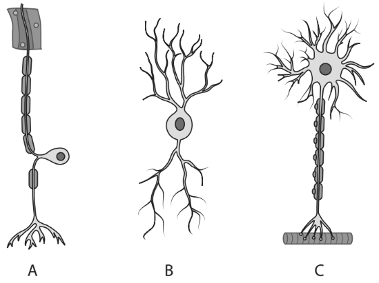

(i) Give the names of these neurones.

**(3)**

(ii) Explain the role of these neurones in the withdrawal reflex of a finger from a hot object.

**(3)**

### 10((b)) — 4 marks — command: multiple — structured — from paper Nov 2020 · 4BI1/1B
A teacher uses this method to estimate the speed of a nerve impulse.

- Students stand in a circle and hold hands
- Student A in the circle starts a timer and at the same time squeezes the hand of student B on his left
- When student B feels his hand being squeezed, he immediately squeezes the hand of the student on his left
- This process continues around the circle of students until student A feels his hand being squeezed and he stops the timer

(i) Explain what other measurements the teacher would need to make in order to calculate the speed of a nerve impulse.

**(2)**

(ii) Describe whether the teacher’s method is likely to give an accurate estimate of the speed of a nerve impulse.

**(2)**

## Q7 — medium — 10 marks · exam-questions

### 10((a)) — 1 mark — command: state — structured — from paper June 2021 · 4BI1/1B
Humans can control their internal environment.

State the term used to describe the control of an organism’s internal environment.

### 10((b)) — 4 marks — command: describe — structured — from paper June 2021 · 4BI1/1B
Coordination uses hormones and nerves.

Some responses are simple reflex arcs.

Describe the structure and functioning of the withdrawal reflex of a finger from a hot object.

### 10((c)) — 5 marks — command: explain — structured — from paper June 2021 · 4BI1/1B
Humans use their skin to regulate their body temperature. The diagram shows a section through the skin with two structures labelled A and B.

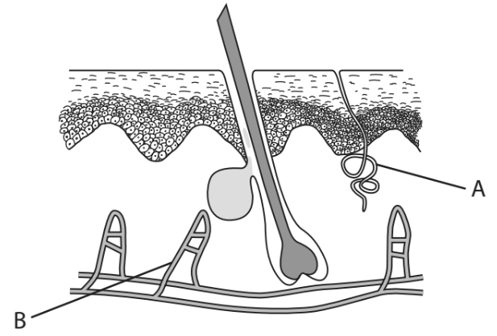

Changes take place in the skin when a person moves from a warm environment to a cold environment.

(i) Explain the changes that take place in structure A as a person enters a cold environment.

**(2)**

(ii) Explain the changes that take place in structure B as the person enters a cold environment.

**(3)**

## Q8 — medium — 7 marks · exam-questions

### 2((a)) — 1 mark — command: which — structured — from paper Jan 2021 · 4BI1/1BR
The diagram shows the position of some hormone producing glands in the female body.

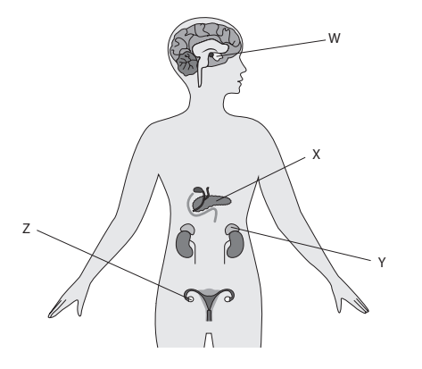

Which of these structures is the adrenal gland?

| ☐ | **A** | W |
|---|---|---|
| ☐ | **B** | X |
| ☐ | **C** | Y |
| ☐ | **D** | Z |

### 2((b)) — 1 mark — command: state — structured — from paper Jan 2021 · 4BI1/1BR
The adrenal gland is an organ that secretes adrenaline.

State what is meant by the term **organ**.

### 2((c)) — 5 marks — command: explain — structured — from paper Jan 2021 · 4BI1/1BR
Adrenaline is released into the blood when there is danger.

The list gives the effects of adrenaline on different parts of the body.

- dilates the pupil in the eye
- increases heart rate
- narrows small arteries in the intestine
- converts glycogen into glucose in the liver

Explain the advantages of these effects to a person in danger.

## Q9 — medium — 9 marks · exam-questions

### 6((a)) — 4 marks — command: multiple — structured — from paper Jan 2021 · 4BI1/1B
Neurones transmit nerve impulses. The diagram shows a neurone.

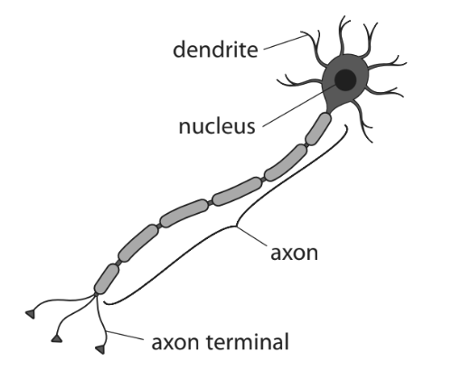

(i) This neurone is involved in the withdrawal reflex of a finger from a hot object.

The neurone transmits electrical impulses from the central nervous system to the effector.

Draw a circle on the diagram to show the part of the neurone where the impulses are transferred to the effector.

**(1)**

(ii) What is the name of this type of neurone?

**(1)**

| ☐ | **A** | Association |
|---|---|---|
| ☐ | **B** | Motor |
| ☐ | **C** | Relay |
| ☐ | **D** | Sensory |

(iii) Explain the advantage of a withdrawal reflex when a finger touches a hot object.

**(2)**

### 6((b)) — 5 marks — command: multiple — structured — from paper Jan 2021 · 4BI1/1B
Some neurones do not have a myelin sheath.

A scientist investigates the impulse speed for neurones with different diameters. She does this for neurones with a myelin sheath and neurones without a myelin sheath.

The graph shows the scientist’s results.

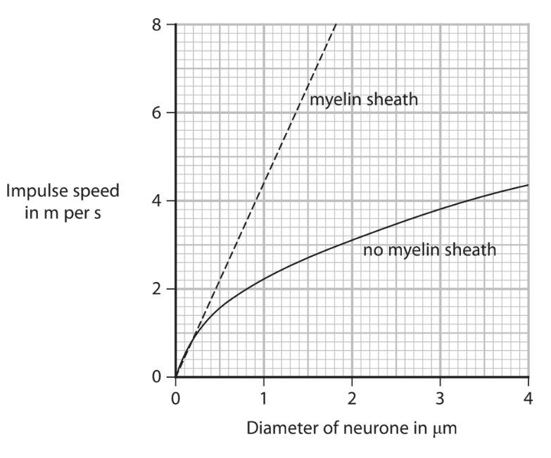

(i) Which conclusion is supported by the graph?

**(1)**

| ☐ | **A** | Impulses are always faster in neurones with a myelin sheath |
|---|---|---|
| ☐ | **B** | Neurones always have a myelin sheath |
| ☐ | **C** | Wider neurones have a myelin sheath |
| ☐ | **D** | Wider neurones have faster impulses |

(ii) A neurone with a myelin sheath has a diameter of 1.0 μm.

Use the graph to determine the speed of an impulse in this neurone in m per s.

**(1)**

(iii) The neurone is 90 cm long.

Calculate the time taken (in seconds) for an impulse to travel along this neurone.

Give your answer in standard form.

**(3)**

## Q10 — medium — 6 marks · exam-questions

### 11() — 6 marks — command: design — structured — from paper Jan 2022 · 4BI1/1BR
The photograph shows a small animal called a woodlouse.

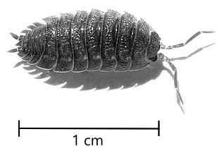

JMK, CC BY-SA 3.0 <https://creativecommons.org/licenses/by-sa/3.0>, via Wikimedia Commons

Woodlice often live under pieces of dead wood in dark, humid conditions.

Design an investigation to find out if light intensity affects the speed at which woodlice move.

Include experimental details in your answer and write in full sentences.

## Q11 — medium — 4 marks · exam-questions

### 1() — 4 marks — command: describe — structured
A person accidentally touches a hot metal tray in an oven.

Describe the pathway of a simple reflex arc that results in the person withdrawing their finger from the hot tray.

## Q12 — medium — 4 marks · exam-questions

### 1() — 4 marks — command: calculate — structured
(i) The length of a sensory neurone is 140 cm.  It takes 7.5 x 10-3 seconds for an electrical impulse to travel along this neurone.

Calculate the speed in m/s that this impulse travels at.

Give your answer to 3 significant figures.

(ii) Electrical impulses pass from neurone to neurone via junctions known as synapses. When an electrical impulse arrives at the end of one neurone, neurotransmitters diffuse across the synapse and trigger the next neurone to send an electrical impulse.

Some drugs slow down synaptic transmission by increasing the time taken for neurotransmitters to cross the synapse.

A drug increases the synaptic delay from 0.5 milliseconds to 2.5 milliseconds.

Calculate the total time for an impulse to pass along this neurone and across the synapse, after the drug has been taken.

Give your answer in standard form.

## Q13 — medium — 4 marks · exam-questions

### 1() — 4 marks — command: multiple — structured
Almost at the same time that the reflex response results in the person removing their hand from the hot tray in the oven, the hormone adrenaline is released.

(i) Define the term hormone.

(ii) Describe the effect of adrenaline on the body.

## Q14 — hard — 9 marks · exam-questions

### 2((a)) — 4 marks — command: multiple — structured — from paper Jan 2022 · 4BI1/1BR
The diagram shows the structure of a human eye.

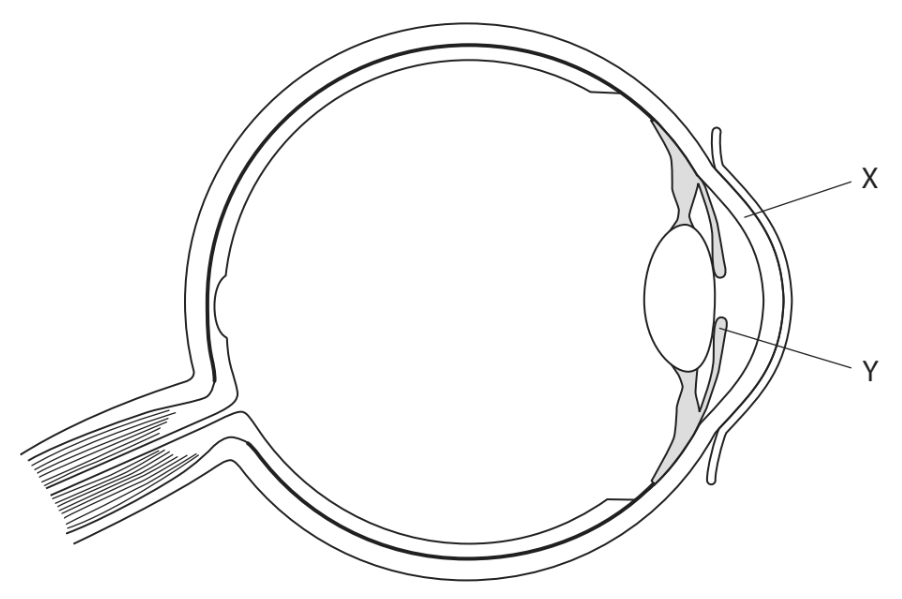

(i) Which of these is the structure labelled X?

**(1)**

| ☐ | **A** | conjunctiva |
|---|---|---|
| ☐ | **B** | cornea |
| ☐ | **C** | lens |
| ☐ | **D** | retina |

(ii) When looking at a close object, which row of the table shows the state of the ciliary muscles and suspensory ligaments?

| ** ** | ** ** | **Ciliary muscles** | **Suspensory ligaments** |
|---|---|---|---|
| ☐ | **A** | contracted | loose |
| ☐ | **B** | contracted | tight |
| ☐ | **C** | relaxed | loose |
| ☐ | **D** | relaxed | tight |

**(1)**

(iii) Explain how structure Y in the diagram controls the light entering the eye when someone walks into a dark room.

**(2)**

### 2((b)) — 5 marks — command: multiple — structured — from paper Jan 2022 · 4BI1/1BR
Multiple sclerosis is a condition that can slow down the speed at which electrical impulses travel along neurones.

The time taken for the blink reflex to occur can be used to help diagnose if someone has multiple sclerosis.

The blink reflex causes the eyelid to close.

Air is blown on to the eye and the time taken for the eyelid to close is recorded.

The diagram shows the reflex pathway.

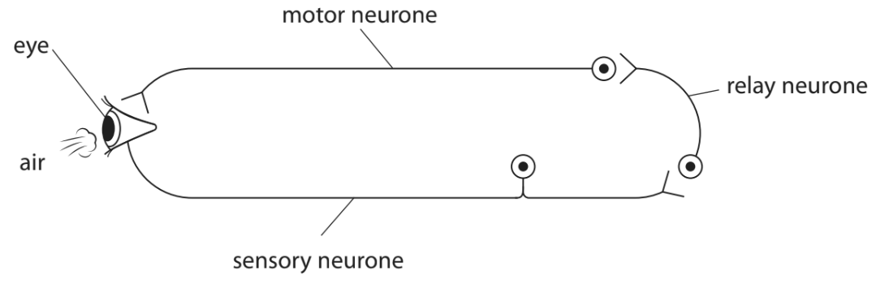

The speed the impulse moves along the reflex arc consisting of all three neurones in a person without multiple sclerosis is 77 metres per second.

The time taken for the blink reflex to occur in a person with multiple sclerosis is 0.0050 s.

The total length of the neurones in the reflex arc for the person with multiple sclerosis is 25 cm.

(i) Calculate the difference between the speed of impulse for the person with multiple sclerosis and for the person without multiple sclerosis.

Give your answer in metres per second.

**(3)**

(ii) The speed of an impulse along the axon of the motor neurone for someone without multiple sclerosis is 120 metres per second.

Suggest why the speed of the impulse calculated along all three neurones is less than the speed of the impulse along only the motor neurone.

**(2)**

## Q15 — hard — 11 marks · exam-questions

### 11((a)) — 7 marks — command: multiple — structured — from paper Nov 2021 · 4BI1/1B
The diagram shows a section through the human eye.

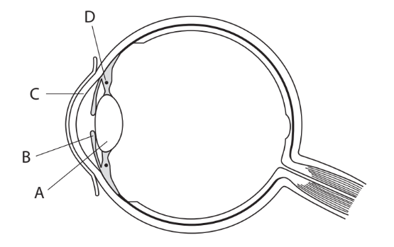

(i) Describe the role of structures A, C and D in focusing light from a near object onto the retina.

**(4)**

(ii) Bright light can damage the retina.

Explain how a reflex involving structure B protects the retina from this damage.

**(3)**

### 11((b)) — 4 marks — command: suggest — structured — from paper Nov 2021 · 4BI1/1B
There are tear glands that release liquid into the eye.

This liquid contains an enzyme called lysozyme that breaks down cell walls.

(i) Suggest why the liquid contains lysozyme.

**(2)**

(ii) Suggest why the liquid is maintained at pH 7

**(2)**

## Q16 — hard — 12 marks · exam-questions

### 1() — 1 mark — command: identify — structured
Nerve tissues that communicate with muscles contain a receptor called the nicotinic acetylcholine receptor.

The diagram below shows how a nerve impulse passing along **neurone X** is passed to a motor neurone.

The motor neurone in the diagram is connected to the diaphragm, a muscle involved in breathing.

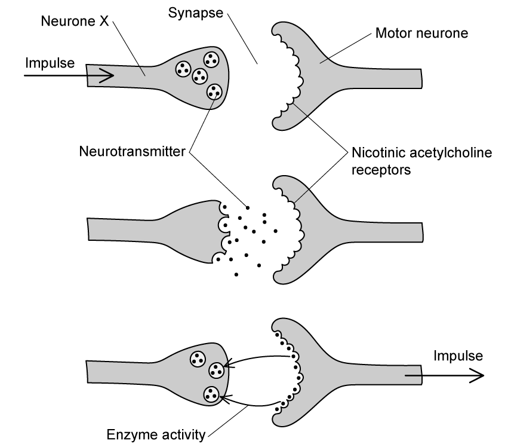

Identify the type of neuron represented by **neurone** **X**?

### 2() — 4 marks — command: describe — structured
Describe the series of events that would need to occur within the structures covered in part (a) in order for the diaphragm to contract.

### 3() — 3 marks — command: suggest — structured
Anatoxin is a neurotoxin that is also known as ‘Very Fast Death Factor’ because when it is injected into mice it induces paralysis and death within a few minutes.

Anatoxin is similar in shape to the neurotransmitter that usually binds to the nicotinic acetylcholine receptor.

Suggest how anatoxin can lead to death.

### 4() — 4 marks — command: multiple — structured
#### Separate: Biology Only

Parts (a)-(c) above relate to neuronal control systems in the body, but coordination of the body's activities can also be carried out by hormones.

One such hormone is known as ADH.

(i) Name the part of the body from which ADH is released.

**(1)**

(ii) Explain how ADH helps to prevent dehydration in the body.

**(3)**

## Q17 — hard — 10 marks · exam-questions

### 1() — 4 marks — command: explain — structured
A group of scientists wanted to investigate the control of blood glucose in mice.

They fed one group of mice with a normal diet and another group with a ‘high fat’ diet containing a high level of both fat and sugar for three weeks beforehand. They then measured the blood glucose levels of the mice over a period of 2 hours directly after a meal. Their results are shown below.

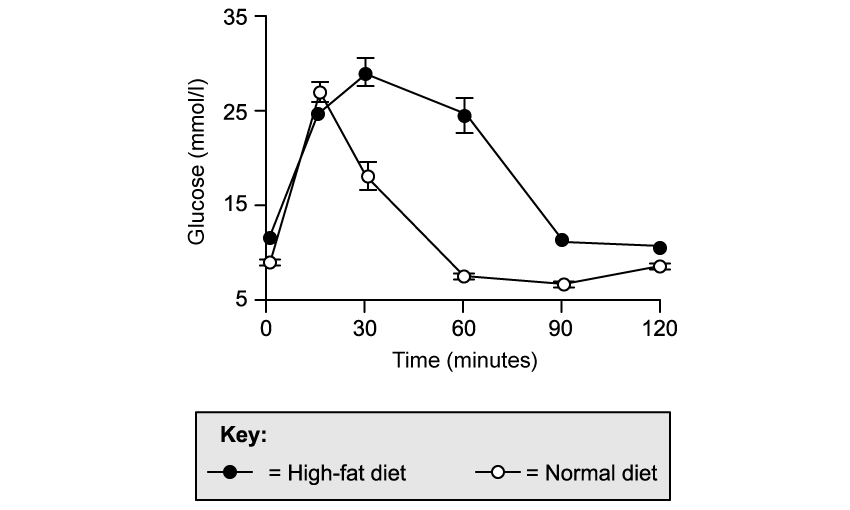

Explain the change in blood glucose levels for the **normal diet** mice during the first 90 minutes after the meal.

### 2() — 2 marks — command: suggest — structured
After the first 90 minutes the normal diet mice show an increase in blood glucose despite no more food being eaten.

Suggest why blood glucose increases despite no more food being consumed.

### 3() — 2 marks — command: suggest — structured
Suggest an explanation for the results shown in part (a) for the mice on a high-fat diet.

### 4() — 2 marks — command: suggest — structured
After carrying out the investigation detailed in part (a) the scientists gave the high fat diet mice supplements of a drug called a DDP-4 inhibitor in their drinking water. Inhibitors reduce or prevent the activity of specific enzymes; the enzyme inhibited by the DDP-4 inhibitor is known as DDP-4.

The functional DDP-4 enzyme works by inactivating another enzyme known as GLP-1. The results of this in the body are shown below.

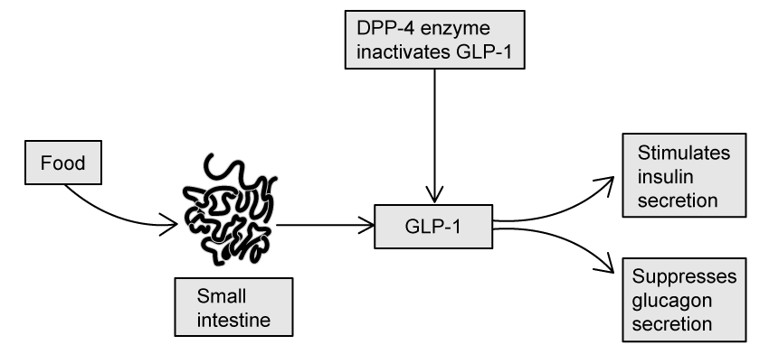

Suggest and explain how the administration of DDP-4 inhibitors might affect the blood-glucose levels of the high fat diet mice.

## Q18 — hard — 13 marks · exam-questions

### 1() — 3 marks — command: describe — structured
A group of students wanted to investigate geotropism in bean seedling roots.

The set-up of their experiment is shown in the diagram below.

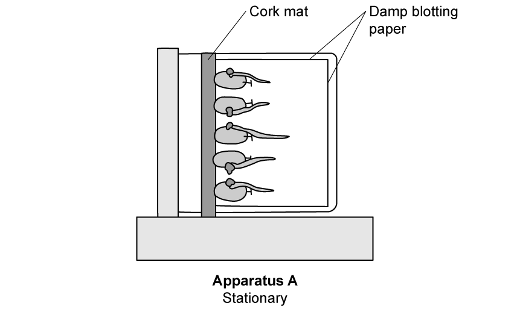

The students used the following method:

- Measure the starting length of the roots of 5 bean seedlings
- Pin the 5 bean seedlings to a cork mat as shown in **Apparatus A**
- Place **Apparatus A** in a dark cupboard for 3 days
- After 3 days, measure the length of the root in each seedling and make a drawing of each seedling

The students' teacher told them that their method was incomplete and that they needed to set up a control experiment (which will be referred to as **Apparatus B**) for comparison.

Describe how** Apparatus B** could be set up so to provide the students with a control experiment.

### 2() — 2 marks — command: explain — structured
Explain why the seedlings in the experiment in part (a) were placed into a dark room?

### 3() — 4 marks — command: calculate — structured
The students carried out their experiment using 10 bean seedlings split across two sets of apparatus; **Apparatus** **A** and **Apparatus** **B **(the control).

The results of the student’s investigation are shown in the table** **below.

|   | **Apparatus A** | **Apparatus B** |   |   |   |   |   |   |   |   |
|---|---|---|---|---|---|---|---|---|---|---|
| **Seedling number** | **1** | **2** | **3** | **4** | **5** | **1** | **2** | **3** | **4** | **5** |
| **Length of seedling on day 0 / mm** | 33 | 34 | 36 | 40 | 42 | 29 | 30 | 34 | 31 | 32 |
| **Length of seedling on day 2 / mm** | 45 | 35 | 48 | 53 | 56 | 41 | 43 | 44 | 44 | 43 |
| **Change in length / mm** |   |   |   |   |   |   |   |   |   |   |
| **Mean change in length / mm** |   |   |   |   |   |   |   |   |   |   |

Complete the table to calculate the mean change in length for the bean seedlings in Apparatus **A** and Apparatus **B**.

### 4() — 4 marks — command: explain — structured
The diagram below shows the appearance of the seedlings at the end of the 3 days.

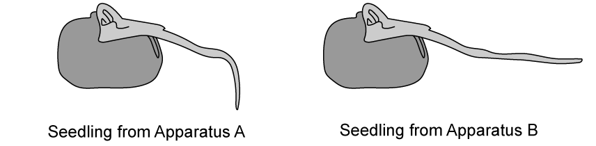

Explain the appearance of the seedlings in the diagram.

## Q19 — hard — 3 marks · exam-questions

### 1() — 3 marks — command: describe — structured
Changes in blood hormone levels regulate the female menstrual cycle.

Describe the roles of FSH and LH in ovulation.

## Q20 — hard — 2 marks · exam-questions

### 1() — 2 marks — command: explain — structured
If an egg remains unfertilised after ovulation, levels of progesterone drop.

Explain why this leads to menstruation.

## Q21 — hard — 3 marks · exam-questions

### 1() — 3 marks — command: explain — structured
The menopause occurs when the menstrual cycle stops.

Use the table and your own knowledge to explain why the menstrual cycle typically stops by the age of 50.
