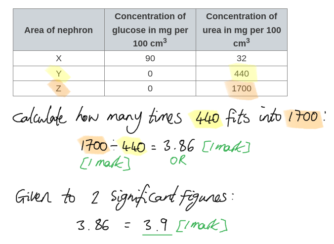
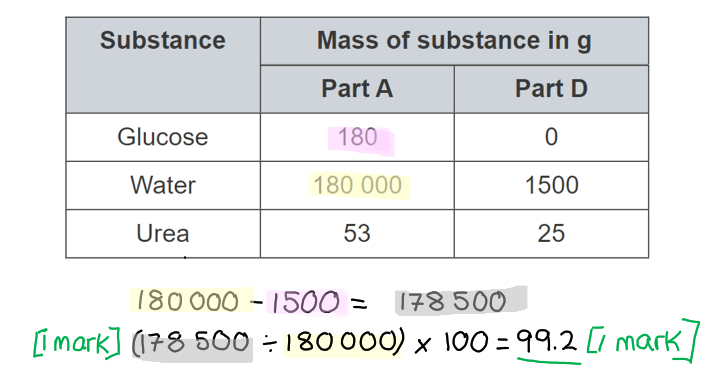
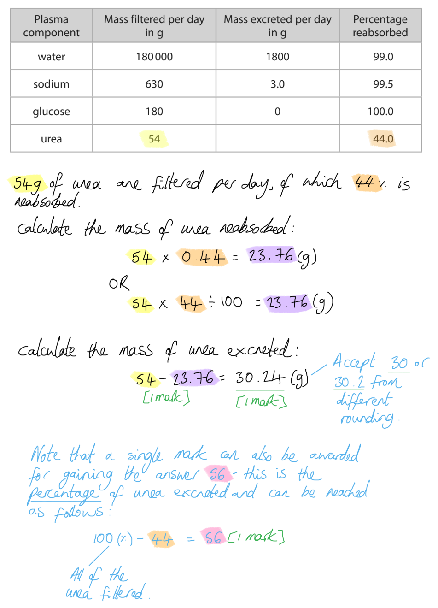
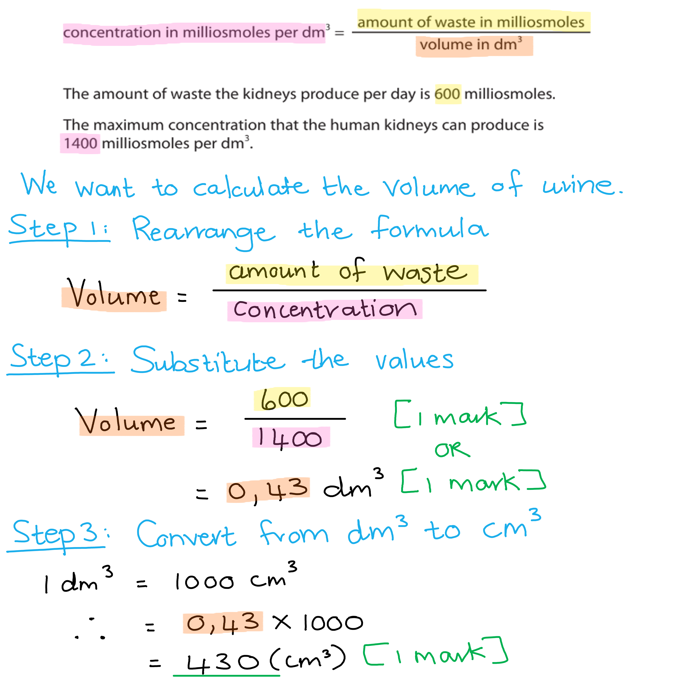

# Mark Schemes — Excretion
**2. Structure & Function in Living Organisms** · Edexcel IGCSE Biology (4BI1)

## Q1 — easy — 10 marks · exam-questions

### 1() — 6 marks
(i) The definition of excretion is...

- The removal of <u>metabolic</u>** **waste from the body; **[1 mark]**

(ii) The other life processes are...

Any **five **of the following:

- Movement; **[1 mark]**
- Respiration; **[1 mark]**
- Sensitivity; **[1 mark]**
- Control; **[1 mark]**
- Growth; **[1 mark]**
- Reproduction; **[1 mark]**
- Nutrition; **[1 mark]**

**[Total: 6 marks]**

> *One of the most common mistakes to make is to generalise excretion as being the removal of all waste from the body; excretion only refers to the **removal of waste from metabolism** (i.e. chemical reactions in the body).*

> *Remember that removal of faeces is not excretion because it is not waste from metabolism, just undigested food. Removal of faeces is known as egestion.*

### 2() — 1 marks
The source of the excreted oxygen is...

- Photosynthesis; **[1 mark]**

**[Total: 1 mark]**

### 3() — 3 marks
The table should be completed as follows...

| **Process** | **Excretion ✓ or **✗ |
|---|---|
| Water is drawn up from the roots of the plant and is lost through the leaves | ✗; **[1 mark]** |
| Carbon dioxide is released from respiring cells | **✓**;** ****[1 mark]** |
| Dead leaves fall off deciduous plants during the autumn | ✗; **[1 mark]** |

**[Total: 3 marks]**

> *Although some water is a waste product of plant metabolism, most just enters the plant via the roots and passes out of the leaves by transpiration without being involved with any form of metabolism. *

> *Note that while details of transpiration are covered in separate science, combined science students would be expected to recognise that the description of transpiration provided here is not excretion.*

## Q2 — easy — 8 marks · exam-questions

### 1() — 2 marks
The organs are...

- Organ X = lung(s); **[1 mark]**
- Organ Z = kidney(s); **[1 mark]**

**[Total: 2 marks]**

### 2() — 2 marks
Excess carbohydrates and lipids don't need to be excreted from the human body because...

Any **two **of the following:

- Carbohydrates are stored as/converted into glycogen; **[1 mark]**
- Lipids are stored under the skin / around the organs; **[1 mark]**
- Carbohydrates/lipids can be broken down to release energy; **[1 mark]**

**[Total: 2 marks]**

> *You learned about lipids and carbohydrates in the biological molecules topic and in the nutrition topic, so you should be aware that the body can store these molecules and use them as a source of energy.*

### 3() — 2 marks
Excreting carbon dioxide is important because...

Any **two** of the following:

- It dissolves easily in water / it is very soluble; **[1 mark]**
- It forms an acidic solution (in the body) / it lowers the pH of the cells; **[1 mark]**
- Which may reduce the activity of enzymes **OR** may denature the enzymes (controlling metabolic reactions); **[1 mark]**

**[Total: 2 marks]**

> *When carbon dioxide dissolves in water it forms a weak acidic solution called carbonic acid. When a solution becomes more acidic the pH of that solution will decrease. You may recall from earlier in the course that enzymes are very sensitive to changes in pH, so any decrease in the pH of the cells will cause the enzymes to denature. This means that the active site changes shape and will no longer be complementary to the shape of the substrate. Denatured enzymes can no longer catalyse the reactions that they are involved in, which is bad news for cells.*

### 4() — 2 marks
The skin carries out excretion by...

- The skin excretes water and excess mineral ions/named minerals, e.g. salt; **[1 mark]**
- Via the process of sweating; **[1 mark]**

**[Total: 2 marks]**

## Q3 — easy — 9 marks · exam-questions

### 1() — 2 marks
(i) **The correct answer is ****B ****because...**

The letter X shows the pituitary gland, which is the gland that releases ADH.

**A** is incorrect because W shows the adrenal glands

**C** is incorrect because Y shows the pancreas

**D** is incorrect because Z shows the thyroid gland

(ii) The gland that releases ADH is...

- Pituitary gland; **[1 mark]**

**[Total: 2 marks]**

### 2() — 1 marks
The part of the nephron that is affected by ADH is...

- The collecting duct; **[1 mark]**

**[Total: 1 mark]**

> *It is important that you memorise the following sentence "ADH increases the permeability of the collecting duct to water". You need to make sure you are always specific with your language in order to gain marks in an exam. *

### 3() — 3 marks
The completed sentences are as follows...

- The concentration of **urine** is controlled by a hormone called anti-diuretic hormone; **[1 mark]**
- If the blood water content is too high, **less ADH** is released, so **less** water is reabsorbed in the kidney; **[1 mark]**
- If the blood water content is too low, **more ADH** is released, so **more** water is reabsorbed in the kidney; **[1 mark]**

**[Total: 3 marks]**

### 4() — 3 marks
(i) Homeostasis is...

- The control/regulation of the internal conditions of a cell/organism (within narrow limits); **[1 mark]**

(ii) The consequence of having too much or too little water in the blood is...

Any **two** of the following:

- Water moves into the cells; **[1 mark]**
- Water moved from a high to a low water concentration / by osmosis; **[1 mark]**
- This can lead to cell lysis/bursting; **[1 mark]**

**[Total: 3 marks]**

## Q4 — easy — 9 marks · exam-questions

### 1() — 3 marks
(i) Structure **1** is the...

- Glomerulus; **[1 mark]**

(ii) The process taking place at structure **1** can be described as follows...

Any **two** of the following:

- Small(er) molecules are forced out of the capillaries (of the glomerulus) into the Bowman's capsule; **[1 mark]**
- Due to the high pressure in the (narrow) capillaries (of the glomerulus); **[1 mark]**
- During the process of ultrafiltration; **[1 mark]**

**[Total: 3 marks]**

> *During ultrafiltration, all small molecules are forced out of the blood in the glomerulus into the Bowman's capsule. Some of these molecules are useful to the body and must be reabsorbed back into the blood as the filtrate moves through the nephron.*

### 2() — 2 marks
Substances found in the filtrate in structure **2** include...

Any **two** of the following:

- Water; **[1 mark]**
- Salts; **[1 mark]**
- Glucose; **[1 mark]**
- Urea; **[1 mark]**

**[Total: 2 marks]**

### 3() — 1 marks
Structure **3** is known as the...

- Loop of Henle; **[1 mark]**

**[Total: 1 mark]**

### 4() — 3 marks
The sentences could be completed as follows...

- On a hot, sunny day the body will **lose/excrete**** **more water due to sweating; **[1 mark]**
- In order to conserve water, the collecting duct will reabsorb **more** water into the blood; **[1 mark]**
- This results in the excretion of **less **urine that is more concentrated ; **[1 mark]**

**[Total: 3 marks]**

> *On days where more water is lost from the body the collecting duct will reabsorb more water into the blood to prevent dehydration. This means that less water will be excreted in the form of urine which results in more concentrated urine being produced.*

## Q5 — medium — 11 marks · exam-questions

### 5((a)) — 3 marks
The difference in concentration of glucose between X and Y is due to...

Any **three** of the following:

- (Selective) reabsorption /  absorption into the blood; **[1 mark]**
- In the proximal convoluted tubule/PCT; **[1 mark]**
- By active transport; **[1 mark]**
- (Active transport) requires energy/ATP; **[1 mark]**

***Accept**** first convoluted tubule for marking point 2.*

**[Total: 3 marks]**

> *Always take note of the command words in a question; here you are being asked to **explain** the data; no marks will be awarded for **description** of the difference between X and Y.*

### 5((b)) — 4 marks
(i) The answer to the question of how many times more concentrated the urea is in area Z compared to area Y is...

- 3.86 **OR** 1700 ÷ 440; **[1 mark]**
- 3.9; **[1 mark]**

*Full marks can be awarded for the correct answer in the absence of other calculations.*

(ii) The difference in urea concentration in the filtrate found in Y and Z is due to...

Any **two** of the following:

- Water is absorbed / urea is not absorbed; **[1 mark]**
- (Water absorption takes place) in the collecting duct / loop of Henle / distal convoluted tubule; **[1 mark]**
- (Water is absorbed by) osmosis; **[1 mark]**
- The presence of ADH (increases water reabsorption); **[1 mark]**

**[Total: 4 marks]**

> *(i) Note that you have been asked to calculate the value to **two significant figures**; be careful not to confuse significant figures with decimal places.*

> *(ii) This is an 'explain' question, so you must **explain** the changes and should avoid giving descriptions of the data. The concentration of a solution can be increased either by the addition of solute (which in this case is urea) or by the removal of solvent (which in this case is water); there is no point within the nephron at which urea can be added, so it must be the removal of water here that has increased the urea concentration. Water is reabsorbed into the blood in the loop of Henle, distal convoluted tubule, and collecting duct.*

### 5((c)) — 4 marks
(i) A sample of urine could be tested to see if it contains protein by...

Any **pair of points** from the following:

- (The use of) biuret (reagent/solution) / sodium hydroxide **AND** copper sulfate; **[1 mark]**
- (A colour change to) lilac/purple/pink; **[1 mark]**

**OR**

- (The use of) uristicks/uristix / urine test strips / urine dip(stick) tests / urinalysis; **[1 mark]**
- (Colour change to) blue/green; **[1 mark]**

(ii) High blood pressure could cause the protein to be present in urine because...

Any **two** of the following:

- Protein is a large molecule; **[1 mark]**
- High pressure forces/pushes/squeezes protein...; **[1 mark]**
- ...out of glomerulus/capillaries/ through membranes **OR** into Bowman's capsule / glomerular filtrate; **[1 mark]**
- Protein is not reabsorbed (by the nephron); **[1 mark]**

**[Total: 4 mark]**

## Q6 — medium — 9 marks · exam-questions

### 2((a)) — 1 marks
**Final answer:** **The correct answer is ****A ****because...**

The nephrons make up the structure of the kidneys.

**B** is incorrect as this structure is the ureter which carries urine from the kidneys to the bladder.

**C** is incorrect as this structure is the bladder which holds urine.

**D** is incorrect as this structure is the urethra which carries urine from the bladder to outside the body.

**[Total: 1 mark]**

### 2((b)) — 1 marks
A substance found in urine includes...

Any **one** of the following:

- Water; **[1 mark]**
- Urea; **[1 mark]**
- Ions / named ion eg. sodium / salts; **[1 mark]**

**[Total: 1 mark]**

### 2((c)) — 7 marks
(i) The scientist's results can be explained as follows...

Any** five** of the following:

- More urine is produced when drinking water / less urine is produced when drinking the salt solution; **[1 mark]**
- A person would have a lower blood concentration (when drinking water) / a person would have a higher blood concentration (when drinking the salt solution) **OR** blood would have a higher water potential (when drinking water) / blood would have a lower water potential (when drinking the salt solution) **OR** blood would be more dilute (when drinking water); **[1 mark]**
- (The change in blood concentration / water potential is) detected by the hypothalamus / osmoreceptors;** [1 mark]**
- Less / no ADH is released by (pituitary) (when drinking water) / (more) ADH released (when drinking the salt solution); **[1 mark]**
- The collecting ducts are less permeable (when drinking water) / collecting ducts are more permeable (when drinking the salt solution); **[1 mark]**
- This means that less water is reabsorbed / absorbed into blood (when drinking water) / (more) water is reabsorbed / absorbed into blood (when drinking the salt solution); **[1 mark]**

(ii) Other factors that affect the volume of urine produced includes...

Any **two** of the following:

- Exercise / sweating / activity; **[1 mark]**
- The volume of fluid consumed / what they drank before the investigation; **[1 mark]**
- Temperature; **[1 mark]**
- The type/amount of food eaten / diet (during the investigation); **[1 mark]**

**[Total: 7 marks]**

> *The mechanism described above will ensure that the blood composition remains within set limits. If there is an excess of water in the blood, this will be excreted as urine, while a shortage of water in the blood will result in more of it being reabsorbed back into the blood vessels. The result would be the production of a smaller volume of more concentrated urine.*

## Q7 — medium — 11 marks · exam-questions

### 3((a)) — 1 marks
**Final answer:** **The correct answer is ****A**** because...**

**A** labels the Bowman's capsule

**B** is incorrect because it shows the proximal convoluted tubule

**C** is incorrect because it shows the loop of Henle

**D** is incorrect because it shows the collecting duct

**[Total: 1 mark]**

### 3((b)) — 6 marks
(i) The change in mass of glucose can be explained as follows...

Any **three** from the following:

- (Selective) (re)absorption (of glucose) occurs; **[1 mark]**
- (This means that glucose moves) into blood **OR** from the filtrate/out of the filtrate; **[1 mark]**
- In the proximal convoluted tubule / B; **[1 mark]**
- Using active transport; **[1 mark]**

(ii) The percentage reabsorption can be calculated as follows...

- 178 500 ÷ 180 000 x 100; **[1 mark]**
- = 99.2; **[1 mark]**

***Award ****full marks for the correct answer in the absence of calculations*

(iii) **The correct answer is ****C ****because...**

Proteins are broken down to produce urea.

The other answers are incorrect because fat, glucose and water are not used in the production of urea.

**[Total: 6 marks]**

### 3((c)) — 4 marks
MDMA affects urine production in the following way...

Any **four** from the following:

- There will be less urine / decreased urine production **OR** urine more concentrated; **[1 mark]**
- (Because) the collecting duct; **[1 mark]**
- Becomes more permeable; **[1 mark]**
- Therefore water (absorbed) into blood / water reabsorbed; **[1 mark]**
- By osmosis; **[1 mark]**

**[Total: 4 marks]**

> *ADH is released by the pituitary gland in the brain when the amount of water in the blood is too low. This results in more water being reabsorbed back into the blood from the filtrate in the kidney. MDMA emphasizes this effect.*

## Q8 — hard — 13 marks · exam-questions

### 2((a)) — 3 marks
(i) **The correct answer is ****D****.**

The glomerulus (S) filters the blood, allowing small molecules to pass through into the Bowman's capsule (T). The liquid that is forced into the Bowman's capsule is known as the filtrate.

P is the distal convoluted tubule.

Q is the collecting duct.

R is the loop of Henle.

(ii) **The correct answer is ****D****.**

Glucose is reabsorbed from the proximal convoluted tubule (D) by active transport. The molecules that transport glucose across cell membranes are not found in any other part of the kidney nephron, so glucose is not reabsorbed anywhere else.

Q is the collecting duct.

R is the loop of Henle.

S is the glomerulus.

(iii) **The correct answer is ****B****. **

The loop of Henle (R) descends into the central medulla of the kidney before ascending back up into the outer cortex. Water is reabsorbed here.

P is the distal convoluted tubule.

S is the glomerulus.

U is the proximal convoluted tubule.

**[Total: 3 marks]**

### 2((b)) — 10 marks
(i) Plasma components are...

- Substances/chemicals/molecules present/in solution/dissolved/carried in the liquid part of the blood/plasma; **[1 mark]**

*Do not accept components in place of substances/chemicals/molecules.*

(ii) The mean mass of urea excreted per day is...

- 54 - 23.76 **OR **54 - (54 x 0.44) **OR **54 - (54 x 44 ÷ 100) **OR** 56; **[1 mark]**
- 30/30.2/30.24; **[1 mark]**

*Full marks can be awarded for the correct answer in the absence of other calculations.*

(iii) Glucose is reabsorbed in the nephron because...

Any **two** of the following:

- So that it is not excreted / lost from the body; **[1 mark]**
- To maintain blood glucose (concentration); **[1 mark]**
- (Because it is required for) respiration / (release of) energy; **[1 mark]**

***Reject**** any reference to energy being produced or created.*

(iv) Eating a meal with a high protein and salt content and drinking a small volume of water will have the following effects...

Any **five** of the following:

Effects on values in the table

- More salt/sodium will be excreted / present in the urine **OR** less / a lower percentage of salt/sodium will be reabsorbed; **[1 mark]**
- More urea will be excreted / present in the urine **OR **less /  a lower percentage of urea will be reabsorbed; **[1 mark]**
- More glucose will be present in the blood / be filtered (by the nephron) **BUT** there will be no change (in the table) as glucose is reabsorbed / no glucose is excreted; **[1 mark]**

Effects on urine production

- More sodium/salt will be present in the plasma (this will enter the blood via the digestive system); **[1 mark]**
- More urea will be produced / urea concentration (in the blood) will increase (as a result of the breakdown of excess protein from the meal); **[1 mark]**
- Water potential of the blood decreases / (solute) concentration of blood increases (due to absorption of protein and salt from the digestive system into the blood); **[1 mark]**
- Osmoreceptors (detect this change) / hypothalamus/pituitary gland (respond to the change); **[1 mark]**
- (More) ADH is secreted; **[1 mark]**
- Permeability of the collecting duct increases (due to ADH); **[1 mark]**
- More water is reabsorbed / less water is excreted **OR** less urine / more concentrated urine is produced; **[1 mark]**

**[Total: 10 marks]**

> *The mean mass of urea excreted can be calculated as follows...*

## Q9 — hard — 11 marks · exam-questions

### 6((a)) — 2 marks
(i)** ****The correct answer is ****C ****because...**

During ultrafiltration, small substances are forced out of the capillaries that form part of the glomerulus into the Bowman's capsule of the nephron.

**A** is incorrect as ultrafiltration does not occur in the collecting duct.

**B** is incorrect as ultrafiltration does not occur in the Loop of Henle.

**D** is incorrect as ultrafiltration does not occur in the proximal convoluted tubule.

(ii)** ****The correct answer is ****D ****because...**

Glucose and other useful substances are reabsorbed back into the bloodstream in the proximal convoluted tubule during the process of selective reabsorption.

**A** and **B** are incorrect as these structures are responsible for the reabsorption of water, not glucose.

**C** is incorrect as this is the place where ultrafiltration occurs, not selective reabsorption.

**[Total: 2 marks]**

### 6((b)) — 2 marks
(i) The name for the control of blood concentration is...

- Osmoregulation;** [1 mark]**

(ii) The term excretion refers to...

- (The) removal of metabolic waste / waste from chemical reactions (from cells);** [1 mark]**

*Ignore mention of 'waste removal', this will gain no marks.*

**[Total: 2 marks]**

### 6((c)) — 4 marks
Diabetes insipidus affects the control of blood concentration in the following ways...

Any **four** of the following:

- (It will cause the) collecting duct; **[1 mark]**
- (To become) impermeable / less permeable **OR** it will not change the permeability (of the collecting duct); **[1 mark]**
- (This leads to) less water (being) reabsorbed (into the bloodstream) / water is not reabsorbed (into the bloodstream) / less water moves back into the blood; **[1 mark]**
- (This results in) more urine (being) produced / dilute urine (being) produced / more water is lost (as urine) / dehydration; **[1 mark]**
- (The) blood concentration increases; **[1 mark]**

**[Total: 4 marks]**

> *You are not expected to have knowledge of diabetes insipidus, but you should be familiar with the effect of ADH on the nephron. Since the body is unable to produce ADH when a person suffers from diabetes insipidus, this will decrease the permeability of the collecting ducts, which will result in large volumes of dilute urine being produced since less water will be reabsorbed back into the blood. This may lead to dehydration if the amount of fluid lost is not replaced.*

### 6((d)) — 3 marks
(i) Desmopressin would have the following effect on the nephron...

- (It would) increase the permeability of the collecting duct (wall) / (the collecting duct wall) becomes permeable / will now be permeable (to water); **[1 mark]**

(ii) The effects the drug would have on urine production include...

- (It would) decrease (the volume of) / (lead to the production of) less urine;** [1 mark]**
- (It would) increase the concentration (of urine); **[1 mark]**

**[Total: 3 marks]**

> *Desmopressin would have a similar effect on the nephron than ADH, therefore increasing the permeability of the collecting ducts and resulting in more water being reabsorbed back into the blood. This would lead to a smaller volume of more concentrated urine being produced.*

## Q10 — hard — 8 marks · exam-questions

### 7((a)) — 2 marks
The minimum volume of urine that must be produced each day can be calculated as follows...

- 600 ÷ 1400 **OR** 0.43 dm3; **[1 mark]**
- (0.43 x 1000) = <u>430</u> (cm3); **[1 mark]**

*Full marks awarded for the correct answer of 430 / 429 / 428.57 or 428.6 in the absence of calculations.*

**[Total: 2 marks]**

### 7((b)) — 1 marks
Another organ that carries out excretion is...

- Lungs / skin / liver; **[1 mark]**

*No marks awarded if two answers are given and one of them is incorrect e.g. skin and anus.*

**[Total: 1 mark]**

> *There are several other organs, besides the kidneys, that are responsible for the excretion of substances. The lungs are responsible for excreting carbon dioxide and water, which are produced during aerobic respiration in cells. The skin excretes excess mineral ions and water in the form of sweat, while the liver produces urea when it breaks down excess amino acids.*

### 7((c)) — 5 marks
The role of the nephron in osmoregulation includes...

Any **five** of the following:

- As the blood concentration increases osmoreceptors/hypothalamus detects the change; **[1 mark]**
- The pituitary gland release ADH; **[1 mark]**
- (This will) increase the permeability of the collecting duct; **[1 mark]**
- (Which results in more water being) reabsorbed from the collecting duct / into the blood; **[1 mark]**
- (This leads to) less urine / more concentrated urine (being produced); **[1 mark]**
- (Reabsorption of water) increases water level (of the blood) / reduces blood concentration; **[1 mark]**
- (So that the) hypothalamus is not stimulated / pituitary releases less ADH **OR**  (the control of the water content of the body is an example of) negative feedback; **[1 mark]**

*Allow the converse throughout if mention is made that the blood concentration decreases / blood water content increases at marking point 1.*

**[Total: 5 marks]**

> *For this question ensure that you write about the role of the nephron in osmoregulation in detail and that you use the correct biological terminology in your answer. It is important to note that it is the hormone ADH that controls the permeability of the collecting duct, which in turn will determine the amount of water that is reabsorbed back into the blood.*

## Q11 — hard — 1 marks · exam-questions

### 1() — 1 marks
> **[mark-scheme]**
> One of the two main functions of the kidney is:
> 
> Osmoregulation** ****[1 mark]**

> **[exam-tip]**
> **Osmoregulation** is the process of maintaining the body’s water and salt concentrations (osmotic balance). The kidneys regulate the water content of the blood by controlling how much water is reabsorbed from the nephron during the formation of urine.

## Q12 — hard — 3 marks · exam-questions

### 1() — 3 marks
> **[mark-scheme]**
> (i)  The correct answer is **C** **[1 mark]**
> 
> - **P** is the glomerulus
> - **Q** is the Bowman’s capsule
> - **R** is the proximal convoluted tubule (PCT)
> - **S** is the loop of Henle
> - **T** is the distal convoluted tubule (DCT)
> - **U** is the collecting duct
> 
> (ii) Any two from (one mark each):
> 
> - Some substances (like urea, glucose, water) are forced out of the blood into structure **Q**(the Bowman’s capsule)
> - These substances can pass through the thin membrane that separates the glomerulus/structure **P** from the Bowman’s capsule/structure **Q**
> - Larger substances (eg. proteins) cannot (normally) pass from **P** to **Q**
> 
> **[2 marks]**

## Q13 — hard — 5 marks · exam-questions

### 1() — 5 marks
> **[mark-scheme]**
> (i) A suggested value for patient 1’s glucose is **0.00 g per 100 cm³**** [1 mark]**
> 
> This is because a blue result from the Benedict’s test shows that no reducing sugar/glucose is present in the urine. Benedict’s solution is a light or bright blue solution. If heated with a reducing sugar, Benedict’s solution shows a colour change. The darker the colour, the higher the concentration of reducing sugar present.

> **[mark-scheme]**
> (ii) Any four of the following (one mark each):
> 
> - Patient 1 has protein in urine
> - Indicates kidney/glomerulus damage
> - Patient 2 has glucose in urine
> - Benedict’s test orange shows reducing sugar
> - Suggests damage to PCT/problems reabsorbing glucose
> - Patient 2 has lower water percentage (85% vs 92%)
> - This suggests Patient 2 may be more dehydrated
> - Both patients may have kidney damage/health problems
> 
> **[4 marks]**
