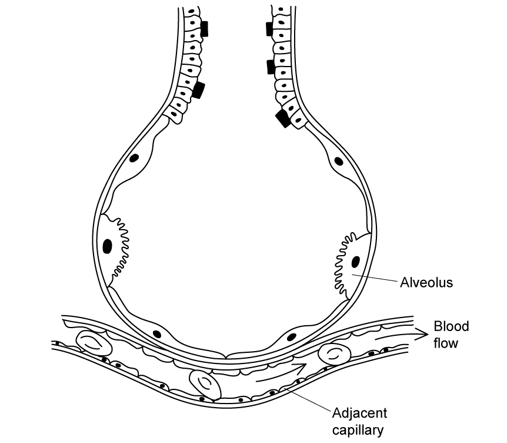
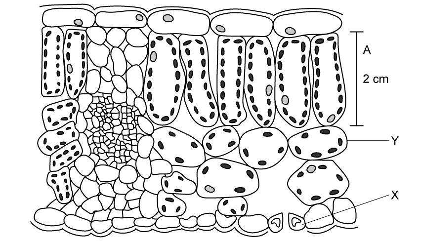
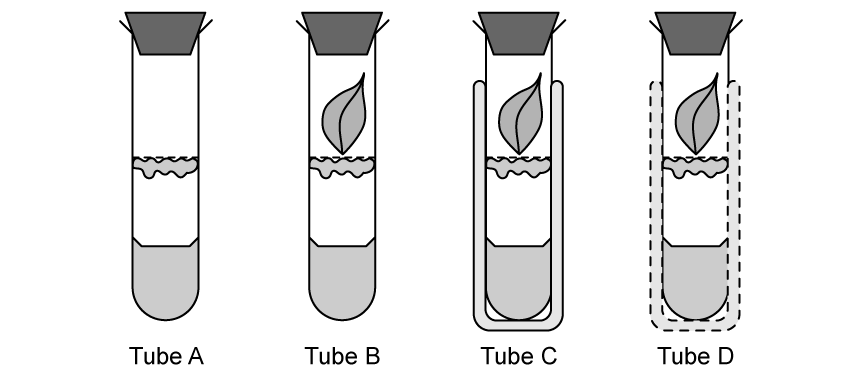
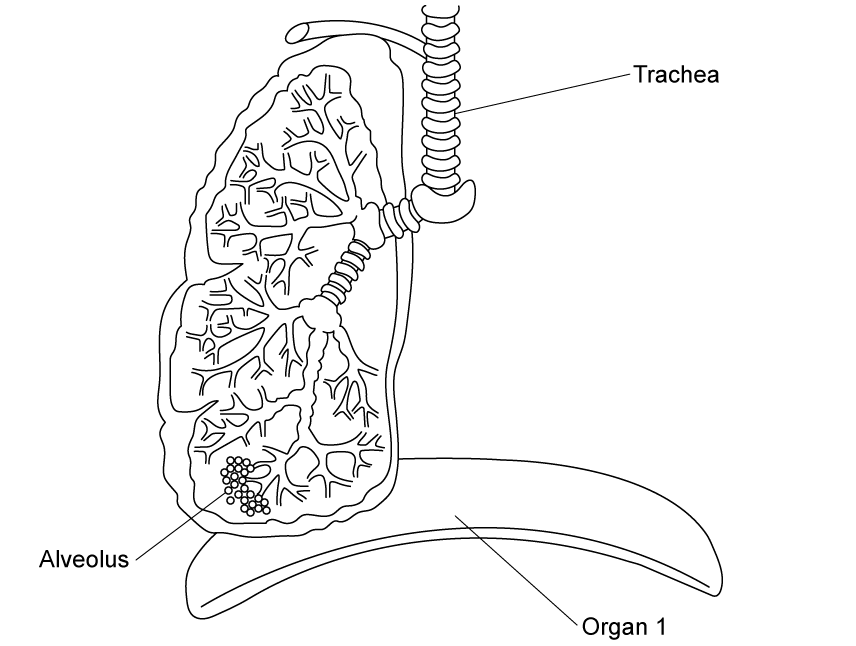
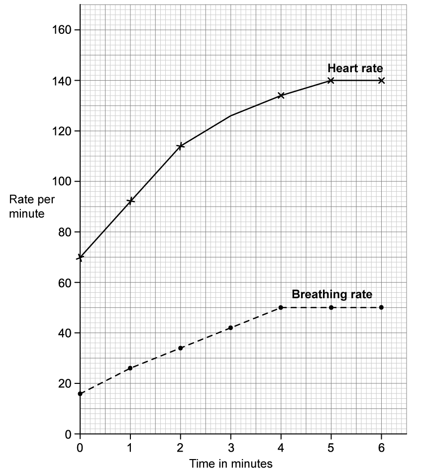
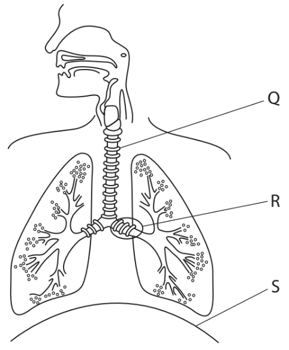
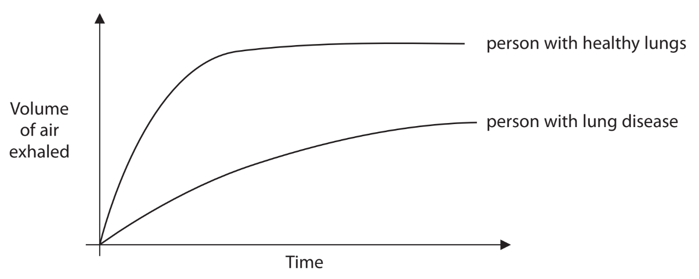
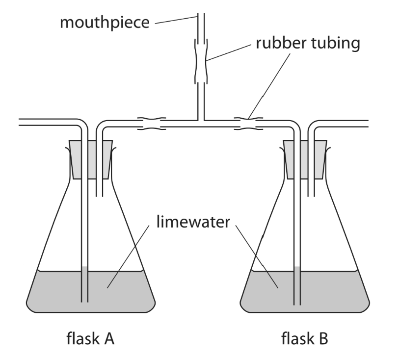
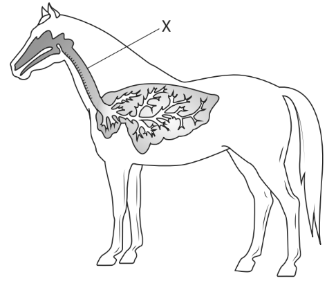

# Exam Questions — Gas Exchange
**2. Structure & Function in Living Organisms** · Edexcel IGCSE Biology (4BI1)
> Source: [https://www.savemyexams.com/igcse/biology/edexcel/19/topic-questions/2-structure-and-function-in-living-organisms/gas-exchange/exam-questions/](https://www.savemyexams.com/igcse/biology/edexcel/19/topic-questions/2-structure-and-function-in-living-organisms/gas-exchange/exam-questions/) · 10 questions · total 99 marks

## Q1 — easy — 8 marks · exam-questions

### 1() — 2 marks — command: explain — structured
The diagram below shows an alveolus (plural alveoli).

Explain one feature seen in the alveolus in the diagram which allows efficient gas exchange.

### 2() — 1 mark — command: indicate — structured
Label the diagram in part (a), using an 'X', indicate where the oxygen content of the blood is the highest.

### 3() — 2 marks — command: calculate — structured
The estimated surface area of the lung system of a new-born baby is 4.2 m2; this is around one twentieth of the overall surface area of a typical adult's lungs.

Calculate the overall surface area of a typical adult's lungs.

### 4() — 1 mark — command: complete — structured
The following list contains structures found within the breathing system.

| **structure** | **order** |
|---|---|
| bronchus |   |
| nasal cavity |   |
| alveolus | 1 |
| trachea |   |
| bronchioles |   |

Complete the table by numbering the structures to show the sequence in which air passes through them during an **exhalation**. The first structure has been numbered for you.

### 5() — 2 marks — command: describe — structured
Describe the actions of the intercostal muscle and diaphragm during inhalation.

## Q2 — easy — 12 marks · exam-questions

### 1() — 4 marks — command: multiple — structured
#### Separate: Biology Only

The image shows the cross section of a leaf.

(i) Identify the cells labelled **X** and **Y**.

**(2)**

(ii) Describe how the arrangement of cells such as Y help to maximise gas exchange in the leaf.

**(2)**

### 2() — 2 marks — command: complete — structured
#### Separate: Biology Only

Complete the table by adding an **X** to correctly identify the processes involved in controlling the opening and closing of the stomata.

|   | **Water moves in to guard cells** | **Water moves out of guard cells** | **Cells become flaccid** | **Cells become turgid** |
|---|---|---|---|---|
| Stomata open |   |   |   |   |
| Stomata close |   |   |   |   |

### 3() — 2 marks — command: explain — structured
#### Separate: Biology Only

Explain why plants only absorb carbon dioxide during the day.

### 4() — 4 marks — command: explain — structured
#### Separate: Biology Only

Some students set up an investigation into the effect of light on gas exchange in plants.They set up four boiling tubes as follows:

- Tube **A** contained no leaf
- Tube **B** contained a leaf and was placed in sunlight
- Tube **C** contained a leaf but sunlight was blocked out using tin foil
- Tube **D** contained a leaf but sunlight was partially blocked out using gauze

The students used hydrogen carbonate indicator to show the changes in carbon dioxide level for the four tubes over 30 minutes. Hydrogen carbonate indicator is an orange solution that turns yellow when carbon dioxide levels are high, and purple when carbon dioxide levels are low.

Explain the outcome that will be observed for the following:

(i) Tube B.

**(2)**

(ii) Tube C.

**(2)**

## Q3 — easy — 10 marks · exam-questions

### 1() — 1 mark — command: identify — structured
The diagram below shows some of the structures in the human body involved with the ventilation process.

Identify **Organ 1** in the diagram above.

### 2() — 2 marks — command: describe — structured
Describe how the contraction of **Organ 1** in part (a) aids the inhalation process.

### 3() — 1 mark — command: identify — structured
Other than Organ 1, identify **one** set of muscles involved with ventilation.

### 4() — 6 marks — command: multiple — structured
The graph below shows the effect of exercise on heart rate and breathing, or ventilation, rate. Exercise started at 0 minutes during the investigation.

(i) Calculate the change in breathing rate between 0 and 4 minutes.

**(2)**

(ii) Explain the change in breathing rate that occurs during exercise.

**(2)**

(iii) The individual in the investigation stopped exercising after 6 minutes.

Predict how this would affect the breathing rate line shown on the graph.

**(2)**

## Q4 — medium — 7 marks · exam-questions

### 10((a)) — 4 marks — command: multiple — structured — from paper Jan 2022 · 4BI1/1BR
The diagram shows the human thorax.

(i) Name structures Q and R.

**(1)**

|   | ** ** | **Q** | **R** |
|---|---|---|---|
| ☐ | **A** | bronchiole | trachea |
| ☐ | **B** | bronchus | trachea |
| ☐ | **C** | trachea | bronchiole |
| ☐ | **D** | trachea | bronchus |

(ii) Explain how structure S helps a person to exhale.

**(3)**

### 10((b)) — 3 marks — command: explain — structured — from paper Jan 2022 · 4BI1/1BR
The graph shows how the volume of air exhaled varies with time during one breath.

This is shown for a person with lung disease and a person with healthy lungs.

Explain why a person with lung disease is often breathless and unable to exercise.

## Q5 — medium — 9 marks · exam-questions

### 1((a)) — 5 marks — command: multiple — structured — from paper Jan 2022 · 4BI1/1B
The diagram shows apparatus a student uses to compare inhaled and exhaled air.

The student breathes into and out of the mouthpiece for one minute.

(i) Explain which flask exhaled air passes through.

**(2)**

(ii) Explain the changes that will happen in the limewater in flask A and in flask B.

**(2)**

(iii) The student uses limewater to compare the composition of exhaled and inhaled air.

Suggest an alternative substance that they could use.

**(1)**

### 1((b)) — 4 marks — command: describe — structured — from paper Jan 2022 · 4BI1/1B
Describe the role of the diaphragm and the intercostal muscles in inhalation.

## Q6 — medium — 9 marks · exam-questions

### 3() — 3 marks — command: identify — structured — from paper Nov 2020 · 4BI1/1BR
The diagram shows the location of the lungs in a horse.

(i) Identify the part labelled **X**.

**(1)**

| ☐ | **A** | bronchiole |
|---|---|---|
| ☐ | **B** | bronchus |
| ☐ | **C** | oesophagus |
| ☐ | **D** | trachea |

(ii) Identify which blood vessel transports blood to the horse’s lungs.

**(1)**

| ☐ | **A** | aorta |
|---|---|---|
| ☐ | **B** | pulmonary artery |
| ☐ | **C** | pulmonary vein |
| ☐ | **D** | vena cava |

(iii) Identify which row of the table describes what happens when the horse breathes in.

**(1)**

|   |   | **Diaphragm** | **External intercostal muscles** |
|---|---|---|---|
| ☐ | **A** | contracts | contract |
| ☐ | **B** | contracts | relax |
| ☐ | **C** | relaxes | contract |
| ☐ | **D** | relaxes | relax |

### 3((b)) — 4 marks — command: comment — structured — from paper Nov 2020 · 4BI1/1BR
The table shows the percentage of total blood flow in different body parts of a horse at rest and when running.

| **Body part** | **Percentage of total blood flow (%)** |   |
|---|---|---|
| **At rest** | **When running** |   |
| leg muscle | 15 | 82 |
| intestine | 30 | 3 |

Comment on the changes in the percentage of total blood flow in these body parts.

### 3((c)) — 2 marks — command: explain — structured — from paper Nov 2020 · 4BI1/1BR
The horse breathes faster and deeper when running.

Explain why the horse continues to breathe faster and deeper for a period of time after it has stopped running.

## Q7 — medium — 6 marks · exam-questions

### 1() — 6 marks — command: design — structured
Some students think that age affects the time taken for heart rate to return to normal after exercise.

Design an investigation to determine whether age affects the recovery time of heart rate after a fixed period of exercise.

Include experimental details in your answer and write in full sentences.

## Q8 — hard — 10 marks · exam-questions

### 4((a)) — 4 marks — command: multiple — structured — from paper Jan 2022 · 4BI1/1B
The data in the table were collected in Japan during a seven-year study.

Scientists collected data on the age of mothers and whether they smoked during pregnancy.

They also recorded the percentage of the babies that had a low birth mass.

| **Age of mother in years** | **Data for mothers who did not smoke during pregnancy** | **Data for mothers who did smoke during pregnancy** |   |   |
|---|---|---|---|---|
| **Number of mothers** | **Percentage of babies with low birth mass** | **Number of mothers** | **Percentage of babies with low birth mass** |   |
| 19 and under | 1331 | 11.5 | 356 | 16.0 |
| 20-24 | 11243 | 9.8 | 1677 | 13.2 |
| 25-29 | 24099 | 9.0 | 2211 | 13.3 |
| 30-34 | 28695 | 9.2 | 1847 | 14.5 |
| 35-39 | 16537 | 10.5 | 934 | 21.1 |
| 40 and over | 3242 | 12.3 | 181 | 22.1 |

(i) Calculate the percentage of mothers aged 19 years and under who smoked during pregnancy.

**(2)**

(ii) Determine the ratio of non-smokers to smokers used in the study.

Give the ratio as the nearest whole number (n) in the form n:1

**(2)**

### 4((b)) — 6 marks — command: comment — structured — from paper Jan 2022 · 4BI1/1B
A student examines this data and concludes that smoking is the main factor that causes low birth mass.

Use the data and your own biological knowledge to comment on this conclusion.

## Q9 — hard — 16 marks · exam-questions

### 8((a)) — 6 marks — command: plot — structured — from paper Nov 2020 · 4BI1/1BR
An electronic cigarette (e‐cigarette) has been invented.

E‐cigarettes are held in the hand like normal cigarettes. Instead of burning tobacco, e‐cigarettes heat a liquid that contains nicotine and flavourings to produce a vapour that is inhaled.

Scientists carried out an investigation to see how the smoking habits of students changed between 2011 and 2016.

Each year they determined the percentage of students who used e‐cigarettes and the percentage of students who smoked normal cigarettes during the year.

The results are shown in the table.

| **Year** | **Percentage of students** |   |
|---|---|---|
| **Using e-cigarettes** | **Smoking normal cigarettes** |   |
| 2011 | 1.5 | 15.8 |
| 2012 | 2.8 | 14.0 |
| 2013 | 4.5 | 12.7 |
| 2014 | 13.4 | 9.5 |
| 2015 | 16.0 | 9.3 |
| 2016 | 11.3 | 8.0 |

Plot a line graph to show how the percentage of students who used e‐cigarettes and the percentage of students who smoked normal cigarettes changed between 2011 and 2016.

Join the points with straight lines.

### 8((b)) — 2 marks — command: describe — structured — from paper Nov 2020 · 4BI1/1BR
Describe the changes in the percentages of students smoking cigarettes and using e‐cigarettes between 2011 and 2016.

### 8((c)) — 2 marks — command: calculate — structured — from paper Nov 2020 · 4BI1/1BR
The scientists interviewed 60 000 students each year during the period of the investigation.

Calculate the change in the number of students who were smoking normal cigarettes from 2011 to 2016.

### 8((d)) — 6 marks — command: suggest — structured — from paper Nov 2020 · 4BI1/1BR
Some people are promoting e‐cigarettes as a healthier alternative to smoking normal cigarettes.

(i) Suggest why using e‐cigarettes may be thought to be less harmful than smoking normal cigarettes.

**(4)**

(ii) Suggest why many doctors are concerned about promoting the use of e‐cigarettes to young people.

**(2)**

## Q10 — hard — 12 marks · exam-questions

### 9((a)) — 8 marks — command: multiple — structured — from paper June 2021 · 4BI1/1B
The scientist Richard Doll collected data about deaths from cancer in the 1950s.

The table shows data for four groups.

| **Cause of death** | **Number of deaths** |   |   |   |   |
|---|---|---|---|---|---|
| **non-smokers** | **light smokers** | **medium smokers** | **heavy smokers** | **total** |   |
| lung cancer | 0 | 12 | 11 | 13 | 36 |
| other cancers | 15 | 35 | 24 | 18 | 92 |
| all deaths | 82 | 345 | 206 | 157 | 790 |

(i) Plot a bar chart to show the number of deaths from lung cancer and from other cancers for each of the four groups.

**(5)**

(ii) Calculate the difference in the percentage of all deaths caused by lung cancer in heavy smokers compared to the percentage of all deaths caused by lung cancer in light smokers.

**(3)**

### 9((b)) — 2 marks — command: suggest — structured — from paper June 2021 · 4BI1/1B
This table gives no information about the age of the people who died.

Suggest why age may affect the likelihood of dying from lung cancer.

### 9((c)) — 2 marks — command: explain — structured — from paper June 2021 · 4BI1/1B
Explain one effect, other than lung cancer, that smoking has on health.
