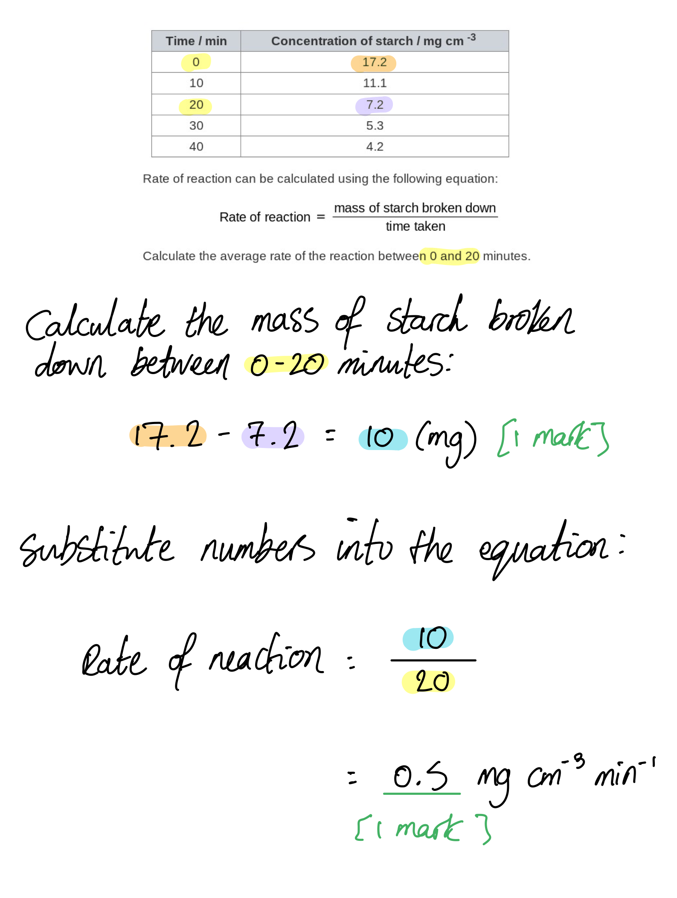
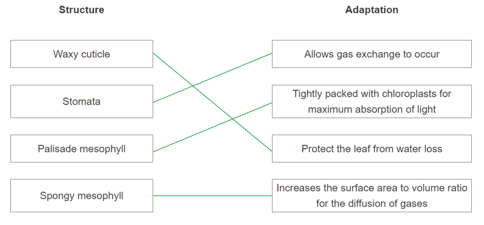
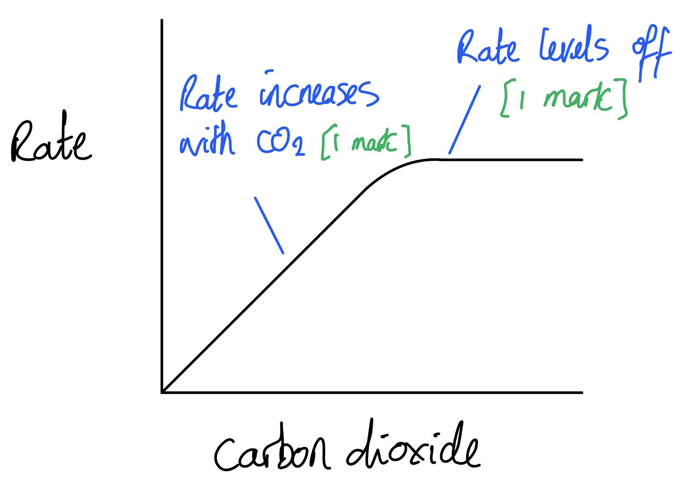
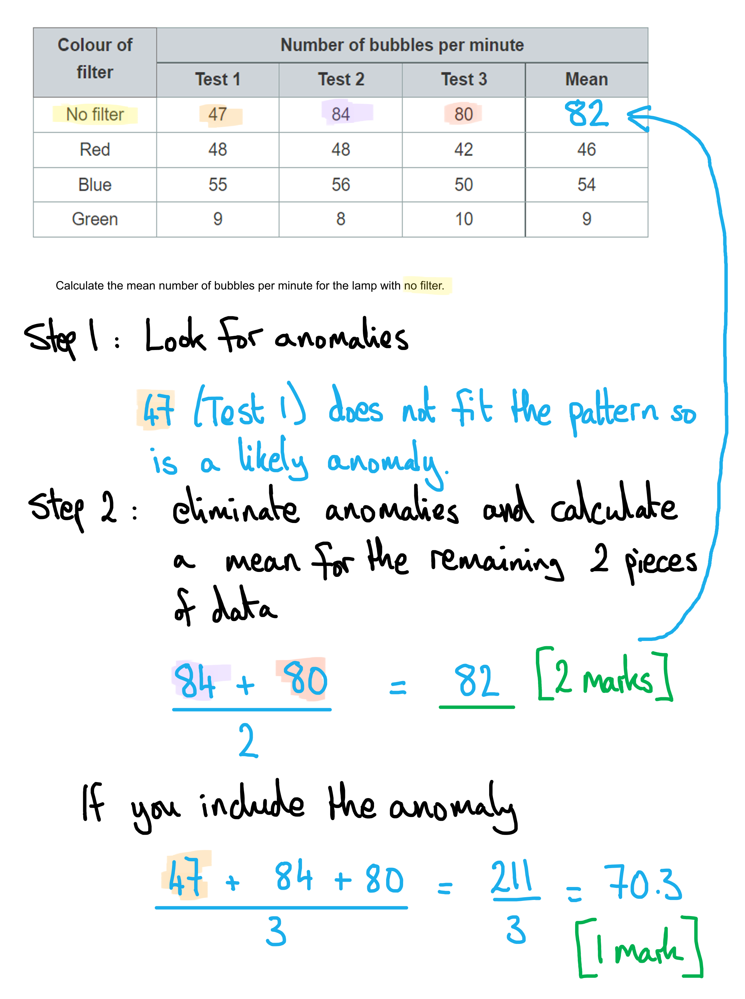
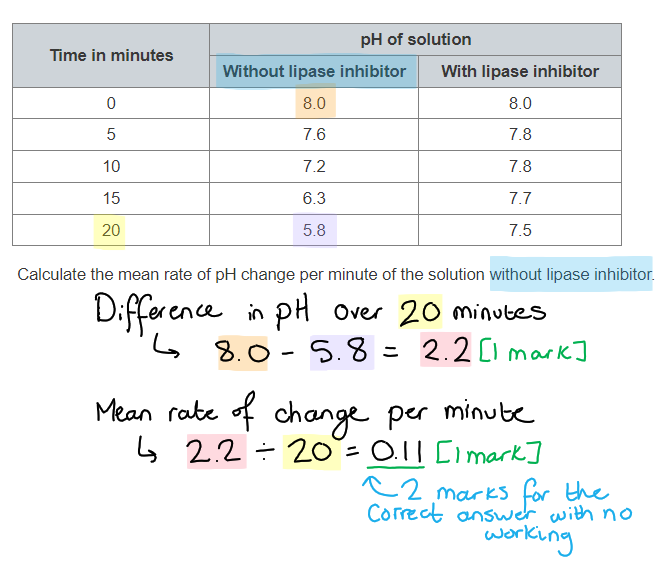
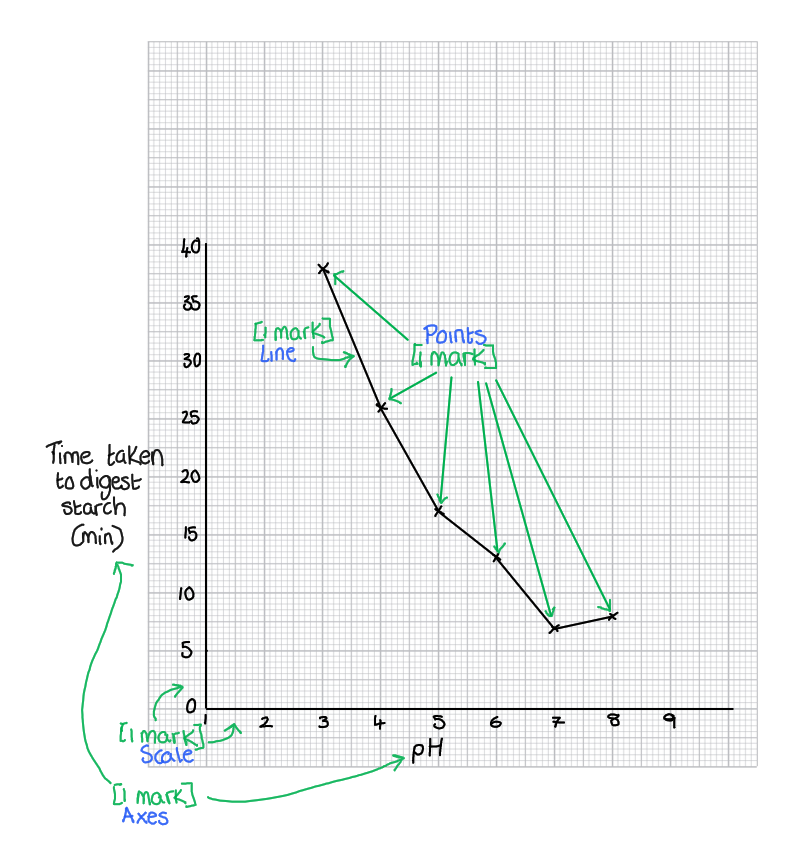
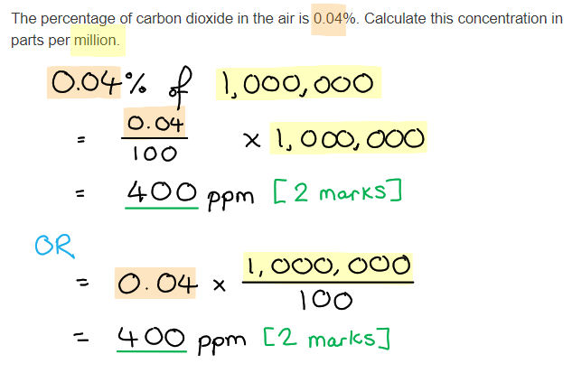

# Mark Schemes — Nutrition
**2. Structure & Function in Living Organisms** · Edexcel IGCSE Biology (4BI1)

## Q1 — easy — 4 marks · exam-questions

### 3((a)) — 2 marks
The parts of the cow labelled **P** and **Q** are...

- **P** = ileum / small intestine;** [1 mark]**
- **Q** = <u>oesophagus</u>; **[1 mark]**

***Reject**** large intestine for marking point 1.*

**[Total: 2 marks]**

### 3((b)) — 2 marks
Microorganisms are useful to a cow because...

Any **two** of the following:

- <u>Cellulose</u> (in the plant cell walls is broken down); **[1 mark]**
- (This releases) glucose / energy; **[1 mark]**
- (Glucose is used in / energy is released during) respiration; **[1 mark]**

***Allow**** "bacteria produce cellulase" for marking point 1.*

***Reject**** references to energy being produced rather than released.*

**[Total: 2 marks]**

> *The cow's digestive system does not contain enzymes to break down and digest the cellulose contained in plant cell walls. Therefore the microorganisms, which do contain these enzymes, are useful to ensure that the cellulose can be broken down and the products, namely glucose, used by the cow. *

## Q2 — easy — 4 marks · exam-questions

### 1((a)) — 4 marks
(i) **The correct answer is ****D ****because..**.

S labels the chloroplast which contains chlorophyll for absorbing light energy

**A** is incorrect as P labels the nucleus

**B** is incorrect as Q labels the cell wall

**C** is incorrect as R labels the cytoplasm

(ii) The correct answer is **C **because...

Magnesium is required to make chlorophyll.

All other answers are incorrect as they are not components of chlorophyll.

(iii) The role of chlorophyll is...

Any **two** of the following:

- To absorb/trap/capture light; **[1 mark]**
- For photosynthesis; **[1 mark]**
- To make carbohydrate/starch/glucose; **[1 mark]**

**[Total: 4 marks]**

## Q3 — easy — 8 marks · exam-questions

### 1() — 2 marks
The term enzyme can be defined as follows...

Any **two** of the following:

- A protein; **[1 mark]**
- A biological catalyst; **[1 mark]**
- That helps to <u>increase</u>/<u>speed up the rate</u> of chemical reactions (in living organisms); **[1 mark]**

*Ignore 'catalyst' on its own*

**[Total: 2 marks]**

### 2() — 1 marks
The correct answer is **D **because...

Starch digestion begins in the mouth due to the action of amylase produced by the salivary glands, and is completed in the small intestine due to the action of amylase released from the pancreas.

**A** and **C** are incorrect because while the pancreas produces and secretes amylase, digestion does not actually take place in the pancreas.

**B** is incorrect because amylase is not present in the stomach, and in fact, cannot function at the low pH of the stomach acid.

### 3() — 2 marks
Molecule **X **is the...

- Substrate; **[1 mark]**

Location **Y **is the...

- Active site; **[1 mark]**

**[Total: 2 marks]**

> *A **substrate** is a molecule that an enzyme acts on. It binds to a region of the enzyme known as the **active site** in order for the enzyme to act on it.*

### 4() — 3 marks
Enzymes work as follows...

Any **three **of the following**:**

- The substrate and active site are <u>complementary</u> / the active site is <u>specific</u> to one substrate; **[1 mark]**
- An enzyme-substrate complex forms; **[1 mark]**
- (The substrate is) converted/broken down into products; **[1 mark]**
- The products are released from the active site; **[1 mark]**
- The enzyme acts on more substrate molecules / is unchanged; **[1 mark]**

**[Total: 3 marks]**

> *In this question you should be able to explain enzyme/substrate specificity by explaining how the substrate and active site are complementary in shape and fit together like a key in a lock. To get full marks you need to use the correct keywords (substrate and active site) and mention how a product is produced which is then released from the enzyme.*

> *It is important to remember that the enzyme and substrate are not the 'same' shape, but 'complementary' which means the opposite. *

## Q4 — easy — 7 marks · exam-questions

### 1() — 2 marks
The rate of the enzyme catalysed reaction decreases after point **B **because...

Any **two **of the following:

- The enzyme denatures / the bonds holding the active site together are broken; **[1 mark]**
- The shape of the active site changes / is destroyed/lost; **[1 mark]**
- The substrate no longer fits into the active site; **[1 mark]**
- Enzyme-substrate complexes cannot form; **[1 mark]**

**[Total: 2 marks]**

> *Note that this is an 'explain' question, so you need to state **why** the graph has the shape that it does after point B. No marks will be awarded for **describing** the shape of the graph.*

> *It is important you use the key term 'denatured' and not 'killed' as enzymes have never been alive!*

### 2() — 2 marks
The rate of reaction between 0 and 20 minutes was...

- 17.2 - 7.2 / 10 (mg) **OR** 10 ÷ 20; **[1 mark]**
- 0.5 (mg cm -3 min-1); **[1 mark]**

**[Total: 2 marks]**

### 3() — 1 marks
Bile aids digestion as follows...

Any **one** of the following:

- It neutralises stomach acid / provides the optimum pH for enzymes/named enzymes (of the small intestine); **[1 mark]**
- It emulsifies fat / breaks large fat droplets into smaller droplets / increases the surface area of fat droplets; **[1 mark]**

**[Total: 1 mark]**

> *Be sure to avoid the misconception that bile contains enzymes, or that it aids in the breakdown of fat molecules; neither of these ideas is correct.*

### 4() — 2 marks
(i)  Organ **X** is the...

- Liver; **[1 mark]**

(ii) Bile is stored in the...

- Gall bladder; **[1 mark]**

**[Total: 2 marks]**

> *Remember, bile is produced in the liver and stored in the gall bladder.*

## Q5 — easy — 13 marks · exam-questions

### 1() — 4 marks
The correct adaptation for each structure is...

Award 1 mark per correctly drawn line:

*Reject any structure for which more than one line has been drawn.*

**[Total: 4 marks]**

### 2() — 4 marks
(i) The types of tissue that can be found in structure **Y** are...

- Xylem; **[1 mark]**
- Phloem; **[1 mark]**

(ii) The function of each type of tissue is...

- Xylem = transports water / mineral ions **OR** thick cell walls help to support the stem and leaf; **[1 mark]**
- Phloem = transports sugars/sucrose / amino acids; **[1 mark]**

*The functions must be clearly matched with the relevant structures for marks to be awarded here.*

**[Total: 4 marks]**

> *Make sure that you know the structure of a leaf very well, as these types of recall questions is an easy way to obtain marks in an exam.*

### 3() — 3 marks
(i) A visible difference between layers X and Z is...

A maximum of **one** from:

- X has no guard cells/stomata **WHILE** Z does; **[1 mark]**
- The cells in X are larg<u>er</u> than in Z; **[1 mark]**
- X consists of few<u>er</u> cells than Z; **[1 mark]**

*Accept the converse statement for the marking points above*

> *You must mention both X and Z in order to obtain the mark as the question is asking you to state the **difference** between them.*

(ii) The cells in X are transparent because...

A **maximum of** **two** of the following:

- To allow sunlight/light (energy) through; **[1 mark]**
- To (reach) the <u>palisade mesophyll</u> cells; **[1 mark]**
- For maximum photosynthesis (to occur); **[1 mark]**

> *You must be specific in stating that it is the **palisade** mesophyll cells that receive the light energy since this is the layer where most **photosynthesis** occurs. Simply stating 'mesophyll cells' will not gain you a mark here.*

**[Total: 3 marks]**

### 4() — 2 marks
A sketch graph that shows the effect of carbon dioxide concentration on the rate of photosynthesis should have the following appearance...

- The rate of photosynthesis increases with carbon dioxide concentration; **[1 mark]**
- The rate of photosynthesis levels off; **[1 mark]**

> *The use of the term 'sketch' in the question tells you that a detailed graph with a scale and units are not required here; you just need to show the shape of the line that you would expect to see.*

> *The rate of reaction would increase with CO**2** initially, as photosynthesis requires CO**2** as a reactant, but would then level off as other factors, such as light or temperature, become limiting.*

**[Total: 2 marks]**

## Q6 — easy — 12 marks · exam-questions

### 4((a)) — 2 marks
Layer A is adapted for its role in the following ways...

Any **two** of the following:

- It contains few/no chloroplasts **OR** it is a thin layer / consists of thin cells / one cell thick; **[1 mark]**
- It is transparent / lets light through / allows light to reach palisade layer/layer B / cells underneath to photosynthesise; **[1 mark]**
- A waxy cuticle reduces water loss / evaporation / (forms a) waterproof layer / barrier to water; **[1 mark]**
- Layer A protects against infection; **[1 mark]**

**[Total: 2 marks]**

> *Layer A is the upper epidermis, which is mainly responsible for protecting the cells underneath and allowing sunlight to reach the palisade layer, which contains most of the chloroplasts for photosynthesis.*

### 4((b)) — 4 marks
Layers B and C are adapted for photosynthesis and gas exchange in the following ways...

*Layer B*

Any **two** of the following:

- Consists of vertical cells / rectangular (in shape) / tightly packed / many chloroplasts; **[1 mark]**
- Layer B creates a large surface area; **[1 mark]**
- To absorb / capture / harvest / trap light (for photosynthesis); **[1 mark]**

**AND**

*Layer C *

Any **two** of the following:

- There are air spaces / gaps between cells / (cells are) loosely packed; **[1 mark]**
- This is for gas exchange; **[1 mark]**
- This allows for the diffusion of CO2 / diffusion of O2 ; **[1 mark]**

*Allow* *1 mark* *for 'gases diffuse' in the absence of marking point 5 and 6.*

**[Total: 4 marks]**

> *The palisade mesophyll and spongy mesophyll are each adapted for the process of photosynthesis and gas exchange respectively. The main purpose of the palisade layer is to absorb the maximum amount of sunlight to allow photosynthesis to occur at a high rate. The air spaces between the cells of the spongy mesophyll cells facilitate the diffusion of gases between the cells and the outside air so that the cells receive the carbon dioxide needed for photosynthesis and release the oxygen produced into the atmosphere.*

### 4((c)) — 2 marks
Layer D is able to regulate gas exchange in the following ways...

Any **two** of the following:

- It contains guard cells; **[1 mark]**
- That allow stomata to open and close; **[1 mark]**
- This lets carbon dioxide in during the day / when it is light **OR** lets oxygen out during the day / when it is light; **[1 mark] **

**[Total: 2 marks]**

### 4((d)) — 4 marks
The effect of an anti-transpirant spray on plant growth would be...

Any **four** of the following:

- It will reduce/stop transpiration / water loss from the plant; **[1 mark]**
- So the plant does not wilt/go flaccid; **[1 mark]**
- However, it still allows for the absorption of carbon dioxide / CO2 can still get into the leaf / can still pass through; **[1 mark]**
- This will ensure that photosynthesis can occur / (the plant) can (still) make glucose/carbohydrates/starch; **[1 mark]**
- However, there will be less absorption / transport of mineral ions / named mineral ions; **[1 mark]**
- Less transpiration will lead to less cooling / the plant may overheat; **[1 mark]**

**[Total: 4 marks]**

> *You must be able to apply your knowledge of transpiration (covered in the specification section on plant transport) to this unfamiliar scenario. Even though the plant will reduce the amount of water lost through the stomata, it will have a negative effect on the absorption and transport of mineral ions in the plant due to a reduced transpiration pull.*

## Q7 — medium — 11 marks · exam-questions

### 8((a)) — 2 marks
The balanced symbol equation for photosynthesis is...

- CO2 + H2O **→** C6H12O6 **+** O2 (correct symbols given in the correct order regardless of whether or not the equation is balanced); **[1 mark]**
- 6 molecules of CO2 **AND** 6 molecules of H2O **AND** C6H12O6 **AND** 6 molecules of O2 (equation correctly balanced); **[1 mark]**

**[Total: 2 marks]**

> *Remember not to use words if asked to give a **symbol** equation. *

### 8((b)) — 2 marks
(i) The student could improve the reliability of their results by...

- (Carrying out three or more) repeats / finding the mean (of the repeat results); **[1 mark]**

(ii) The dependent variable in the investigation is...

- Time taken (for leaf to rise); **[1 mark]**

**[Total: 2 marks]**

> *Remember that the independent variable is the thing in an experiment that you **change** and the dependent variable is the thing you **measure**. *

### 8((c)) — 4 marks
The effect of increasing the distance of the lamp on the time taken for the leaf disc to rise to the top of the syringe is...

Any **four **of the following:

- As distance increases light intensity decreases; **[1 mark]**
- (As distance increases / as light intensity decreases) the rate of photosynthesis decreases/is slower; **[1 mark]**
- (the decrease in photosynthesis rate means that) less oxygen is produced; **[1 mark]**
- Oxygen (bubbles are) trapped in leaf and cause leaf discs to rise; **[1 mark]**
- When the leaf discs are close to the lamp another factor is limiting / light intensity is not limiting; **[1 mark]**
- Limiting factor (when light level is high) could be temperature / carbon dioxide concentration; **[1 mark]**

***Accept**** reverse statement for marking point 1, e.g. "as distance decreases light intensity increases".*

**[Total: 4 marks]**

> *Remember that when asked to **explain** you must use your scientific knowledge to say **why** the data is the way it is. Do not just describe the graph as no credit will be available for this.*

### 8((d)) — 3 marks
The student could test the leaf discs for the presence of starch by...

Any **three **of the following:

- Place leaf disc in boiling water; **[1 mark]**
- Heat/boil leaf in ethanol; **[1 mark]**
- Stain with iodine; **[1 mark]**
- Iodine stain will turn blue-black in the presence of starch / if starch is present; **[1 mark]**

**[Total: 3 marks]**

## Q8 — medium — 11 marks · exam-questions

### 3((a)) — 4 marks
Leaf X can be tested as follows to show the effect of light on photosynthesis...

Any **four** of the following:

- Boil the leaf in water; **[1 mark]**
- (Then) boil (the leaf) in ethanol (to remove the chlorophyll); **[1 mark]**
- (Place test-tube containing ethanol in a) hot water bath / use hot water from the kettle / turn off Bunsen; **[1 mark]**
- (After boiling in ethanol) soak (the leaf) in water (to rehydrate / allow diffusion); **[1 mark]**
- Add iodine solution (to the leaf); **[1 mark]**
- (The uncovered part of the leaf will turn) <u>blue black</u> (indicating that) <u>starch</u> is present **OR** (The covered part of the leaf will remain) <u>yellow</u>/<u>brown</u> (indicating that) <u>no starch</u> is present; **[1 mark]**

**[Total: 4 marks]**

> *Make sure that you familiarise yourself with the basic steps of the starch test as this forms the basis of many photosynthesis experiments.*

### 3((b)) — 7 marks
(i) The results of the student can be explained as follows...

Any **four** of the following:

- Increasing the carbon dioxide concentration increases the rate of photosynthesis; **[1 mark]**
- CO2 is required / is the substrate (for photosynthesis) **OR** at low CO2 concentrations CO2 is a limiting factor / limits the rate of photosynthesis;** [1 mark]**
- (The rate of photosynthesis is) greater/higher at high light intensity **OR** (the rate of photosynthesis is) less/lower at low light intensity; **[1 mark]**
- Light is required / provides energy for photosynthesis **OR** at low light intensity light is a limiting factor / limits the rate of photosynthesis; **[1 mark]**
- The increase (in the rate of photosynthesis) is the same (when the CO2 concentration is increased) from 0.00 to 0.02 (arbitrary units) / between the first two readings (in both light intensities); **[1 mark]**
- (The rate of photosynthesis is) levels off (at high light intensity) due to temperature / temperature is a limiting factor / limits the rate of photosynthesis **OR** (The rate of photosynthesis is) levels off (at high light intensity) due to the number of chloroplasts / amount of chlorophyll; **[1 mark]**

(ii) The light intensity could be changed as follows...

Any **one** of the following:

- Use more/fewer bulbs / change the bulb wattage / use dimmer/filters; **[1 mark]**
- Change the distance (between the bulb and the plant); **[1 mark]**

(iii) The dependent variable is...

- (Number of) bubbles (per minute) / rate of photosynthesis / rate of oxygen production; **[1 mark]**

(iv) The biotic variable can be controlled as follows...

- (Use the) same type/species/piece (of the plant) **OR** (use plants with the same) mass / number of leaves / length/size; **[1 mark]**

**[Total: 7 marks]**

> *Describing results and identifying variables and controls are important scientific skills that you will encounter in every exam paper, so spend some time expanding your understanding of these concepts.*

## Q9 — medium — 10 marks · exam-questions

### 8((a)) — 6 marks
A discussion on whether cow's milk is a suitable alternative to breast milk would include...

Any **six** of the following:

*Arguments against cow's milk as a suitable alternative*

- Cow's milk contains more/too much fat (compared to breast milk); **[1 mark]**
- (The high) fat (content of cow's milk) could lead to obesity / (consuming) too many kJ/calories; **[1 mark]**
- Cow's milk contains more/too much protein (compared to breast milk); **[1 mark]**
- Cow's milk contains more/too many minerals (compared to breast milk; **[1 mark]**
- Cow's milk contains less/too little carbohydrate (compared to breast milk); **[1 mark]**
- (Low carbohydrate levels in cow's milk) will not provide enough (quick-release) energy (for a baby); **[1 mark]**
- Cow's milk does not contain human antibodies; **[1 mark]**
- Cow's milk (may) contain antibiotics; **[1 mark]**

*Arguments for cow's milk as a suitable alternative*

- Cow's milk contains a similar/same amount of vitamins (as breast milk); **[1 mark]**
- Cow's milk contains a similar/same amount of water (as breast milk); **[1 mark]**

***Accept ****converse statements for marking points 1, 3, 4, 5, 9 and 10. E.g. for marking point 1 "breast milk contains less fat (than cow's milk)" would be a creditworthy statement.*

**[Total: 6 marks]**

> *To answer this question properly it is important to compare the nutritional content of cow's milk with the composition of breast milk and note the similarities and differences between the two. Breast milk meets the nutritional requirements of a human baby so any differences in the composition of cow's milk will have an impact on the growth and development of a baby. It is also useful to know the function of some of the food substances (e.g. fat and carbohydrate) in order to add some additional information to your discussion.*

### 8((b)) — 2 marks
Ways in which additional vitamin D could be provided for a child include...

Any **two** of the following:

- Exposure to the sun / sunlight; **[1 mark]**
- A named source of vitamin D, e.g. cod-liver oil / oily fish/salmon/sardines/ herring/mackerel / red meat/liver / eggs / fortified foods; **[1 mark]**
- Add (vitamin D) drops to food/drink / take a (vitamin D) supplement/pill; **[1 mark]**

*Award* **[2 marks]** *for mention of taking cod liver oil tablets/capsules as this combines marking points 2 and 3.*

**[Total: 2 marks]**

### 8((c)) — 2 marks
A sample of cow's milk could be tested for protein in the following way...

- Add biuret (reagent/solution to the sample); **[1 mark]**
- If protein is present (the sample) turns purple/lilac/violet; **[1 mark]**

***Allow*** *use of uristix/clinistix/protein test sticks at marking point 1.*

***Allow*** *correctly stated colour change of uristix/clinistix/protein test stick at marking point 2.*

**[Total: 2 marks]**

> *Make sure that you are familiar with the food tests for different biological molecules. You will have to recall the reagent used, and the method on how to perform the test and be able to state the outcome for a positive result.*

## Q10 — medium — 13 marks · exam-questions

### 3((a)) — 2 marks
(i) **B**** is the correct answer because...**

It labels the stomach**.**

**A** is the oesophagus

**C** is the small intestine

**D** is the rectum

(ii)** ****D ****is the correct answer because...**

It labels the rectum.

**A **is the oesophagus.

**B** is the stomach.

**C** is the small intestine.

**[Total: 2 marks]**

### 3((b)) — 3 marks
The role of bile is...

Any **three** of the following:

- It neutralises acid; **[1 mark]**
- To provide optimal pH for enzymes / lipase; **[1 mark]**
- Bile also emulsifies lipid; **[1 mark]**
- (Which means it) breaks down (large droplets) into small droplets; **[1 mark]**
- This increases surface area for enzyme action; **[1 mark]**

**[Total: 3 marks]**

### 3((c)) — 8 marks
(i) The undamaged villi have the following adaptations:

Any **four** of the following:

- A large surface area; **[1 mark]**
- (Each of the villi has many) microvilli; **[1 mark]**
- (A good) blood supply / many capillaries to maintain concentration gradient / diffusion gradient; **[1 mark]**
- (This allows villi to) absorb digested food / molecules / vitamins / minerals / correct named molecule; **[1 mark]**
- (Presence of the) lacteal to absorb fats / correct vitamin / transport fats; **[1 mark]**
- (Villi have) thin walls / one cell thick / capillaries close to surface; **[1 mark]**
- So short diffusion path / rapid diffusion / rapid active transport; **[1 mark]**

(ii) Children with coeliac disease grow more slowly because...

Any **four** of the following:

- (Children with coeliac have) shorter / few / no villi / microvilli; **[1 mark]**
- This means a reduced surface area; **[1 mark]**
- Therefore less absorption of digested food / molecules / vitamins / minerals / correct example ; **[1 mark]**
- (As a result there will be) less glucose / lipid, for energy / respiration / ATP; **[1 mark]**
- Fewer amino acids for growth / protein synthesis; **[1 mark]**
- Less vitamins / minerals / named vitamin or mineral for correct function of named vitamin or mineral; **[1 mark]**
- Allow sugar for glucose e.g. iron for haemoglobin; **[1 mark]**

**[Total: 8 marks]**

## Q11 — medium — 13 marks · exam-questions

### 4((a)) — 8 marks
(i) The pot is placed in the dark for 24 hours because...

Any **two** of the following:

- No photosynthesis (will occur in the dark); **[1 mark]**
- Therefore it destarches (the plant) / removes all starch; **[1 mark]**
- (This is because starch is all used up) by respiration; **[1 mark]**
- So any starch present (as shown in the starch test) is due to photosynthesis (in the experiment); **[1 mark]**

(ii) The role of leaf Y is...

Any **two** of the following:

- To act as a control / for a comparison; **[1 mark]**
- This will show photosynthesis can occur with CO2 present / show difference between X and Y is due to CO2; **[1 mark]**
- It also shows that when CO2 is present, light is required for photosynthesis; **[1 mark]**

> *A control is required in a practical as a comparison and to clearly show the effect of the independent variable in the investigation. In this investigation, the independent variables were light and carbon dioxide. Leaf Y allowed the teacher to demonstrate that both light and carbon dioxide were required for photosynthesis and therefore starch production.*

(iii) A safe method to test for starch would be as follows...

Any **four** of the following:

- Place leaf in boiling water; **[1 mark]**
- Boil / heat (the leaf) in ethanol; **[1 mark]**
- (For safety) use a water bath / switch off Bunsen / keep away from Bunsen; **[1 mark]**
- Wear safety glasses / use tongs / forceps; **[1 mark]**
- Add iodine solution (to the leaf); **[1 mark]**
- If starch is present, (the leaf) goes blue/black / see if the leaf goes blue / black; **[1 mark]**

> *Iodine is used to test for starch, but ensure you don't get muddled with Benedicts reagent which is used to test for smaller carbohydrate molecules such as glucose. This question also specifically mentions safety, so you should detail this in your method to give the best answer.*

**[Total: 8 marks]**

### 4((b)) — 3 marks
The results show that light is required for photosynthesis because...

- (With reference to) leaf Y; **[1 mark]**
- There will be no starch present under black paper strip; **[1 mark]**
- Therefore this part (under the black paper strip) will be yellow/ orange / not blue black; **[1 mark]**

**[Total: 3 marks]**

> *Light cannot reach the part of the leaf under the strip so photosynthesis cannot happen and therefore no starch will be made.*

### 4((c)) — 2 marks
Plant store starch because...

- Starch is insoluble / doesn't dissolve (in water); **[1 mark]**
- Therefore it does not have osmotic effect on plant cell / does not diffuse / pass out of cells; **[1 mark]**

***Accept ****converse points for glucose*

**[Total: 2 mark]**

> *Glucose dissolves in water and so would lower the water potential of the cytoplasm within a cell. Starch on the other hand, is a large molecule which does not dissolve. This means that it will not affect the water potential of cells and cannot leave the cell due to its size.*

## Q12 — medium — 14 marks · exam-questions

### 4((a)) — 2 marks
The balanced symbol equation for photosynthesis is as follows...

- 6CO2 + 6H2O → C6H12O6 + 6O2; **[2 marks]**
- Unbalanced but correct chemical formulae; **[1 mark]**
- Word equation; **[0 marks]**

**[Total: 2 marks]**

> *Reactants and products can be in any order, so long as they're on the correct side of the equation. There is no need to mention energy input or the presence of chlorophyll as these do not take part in the chemical reaction. The important points for scoring both marks are the correct symbols and balancing. *

### 4((b)) — 8 marks
(i) The mean number of bubbles per minute for the lamp with no filter is as follows...

- (47+84+80) ÷ 3 = 70/70.3/70.33; **[1 mark]**
- Eliminate anomaly (47), then (84+80) ÷ 2 = 82; **[2 marks]**

> *The question steers you towards looking for an anomaly - remember there are no wasted words in a question; that phrase is included in the question stem for a reason, so make sure to take it on board and use the information, and to eliminate the anomaly before calculating the mean. *

(ii) An explanation of the student's results is as follows...

Any **four** from the following:

- No filter has highest rate of photosynthesis / bubbling / oxygen; **[1 mark]**
- (Because) all light colours / wavelengths are present / has more light energy / most amount of light that can be absorbed; **[1 mark]**
- Green has low(est) rate of photosynthesis, because green light is not absorbed/is reflected / no bubbling / 8 bubbles / no oxygen production **because **green light is reflected / passes through; **[1 mark]**
- Blue / red has a medium rate of photosynthesis because (these wavelengths/colours of) light is, absorbed / not reflected / causes photosynthesis / produces bubbles because light is, absorbed / not reflected; **[1 mark]**
- Chlorophyll / chloroplast absorbs red / blue light / does not absorb green light; **[1 mark]**

> *Be sure to take the command word on board; 'explain' is very different to 'describe' and requires more in-depth knowledge. Remember, that plants are green because they reflect green light; it is of no use to them, so placing a plant under green light will mean that they don't get the wavelengths of light that they need to carry out photosynthesis. *

(iii) Abiotic variables that the student should control in her experiment are...

Any** two** of the following**:**

- Temperature; **[1 mark]**
- Carbon dioxide (concentration/volume/amount of sodium hydrogencarbonate); **[1 mark]**
- Light <u>intensity</u> / brightness of lamp/ thickness of filter; **[1 mark]**

**[Total: 8 marks]**

> *Avoid falling into the trap of confusing this experiment with a transpiration experiment and mentioning humidity, wind speed etc as control variables, which would not score marks. *

> *Remember that abiotic features are non-living, as opposed to biotic, which would be living variables. *

### 4((c)) — 4 marks
(i) Measuring the rate of photosynthesis by counting bubbles may not be an accurate method to use because...

Any **two** from the following:

- Bubbles are different volumes / sizes; **[1 mark]**
- O2 may dissolve in water; **[1 mark]**
- Bubbles may be CO2 not oxygen / may not be due to photosynthesis / other gases may be present / bubbles may be due to respiration; **[1 mark]**
- It is easy to miscount / miss bubbles; **[1 mark]**
- Bubbles get trapped / stuck eg. on the inner surface of the glass; **[1 mark]**

> *A simple statement of 'human error' would not earn you a mark here. You would have to be more specific and state 'human error in counting' / 'error due to miscounting' etc. to satisfy the examiners on this point. *

(ii) An alternative method that the student could use to measure the rate of photosynthesis in her experiment is...

Any **pair** from the following:

- To use measuring cylinder / (gas) syringe / burette / graduated test tube; **[1 mark]**
- (To measure) volume; **[1 mark]**

**OR**

- To use hydrogen carbonate indicator; **[1 mark]**
- Observe a change of colour (of hydrogen carbonate indicator); **[1 mark]**

> *You may think that the volume of carbon dioxide produced could be measured, but it is oxygen that is being produced. You should try to give precise answers and refer to **volumes** rather than using the term 'amount'. Another misconception is that you could measure the mass of plants before and after the experiment; you could, but it would not provide any meaningful data on photosynthesis. *

**[Total: 4 marks]**

## Q13 — medium — 6 marks · exam-questions

### 5() — 6 marks
The experiment should be carried out as follows...

Any **six** of the following:

- Weigh each crisp / use the same mass of crisp; **[1 mark]**
- (Measure out a) stated volume/mass of water in a test tube/beaker/calorimeter; **[1 mark]**
- Ignite/set fire to/light crisp; **[1 mark]**
- Heat the water (in the tube/beaker) using the burning crisp **OR** place the burning crisp under the test tube; **[1 mark]**
- Burn (the crisp) until it has completely burnt / no longer relights; **[1 mark]**
- Measure the temperature of the water before and after burning / measure the change in temperature ; **[1 mark]**
- Calculate the energy content (per g) = 4.2 x mass of water × temp rise ÷ (mass of crisp); **[1 mark]**
- Repeat the method (to obtain reliable data); **[1 mark]**
- Insulate the tube/beaker **OR** move crisp under the tube quickly ; **[1 mark]**

**[Total: 6 marks]**

> *This is a core practical from the specification and as such, you are expected to know the method in a reasonable amount of detail. This includes the equation for how to calculate the energy content.*

## Q14 — medium — 8 marks · exam-questions

### 7((a)) — 5 marks
The completed sentences are as follows...

Award **one **mark for each correct answer:

Plants carry out photosynthesis to produce **carbohydrate/named carbohydrate, e.g. glucose / starch**; **[1 mark]**. To enable this process to occur the leaf cells absorb carbon dioxide and release oxygen.

At the same time the cells in the leaves are respiring. This means that they are using **oxygen / carbohydrate/glucose**; **[1 mark]** and producing carbon dioxide. If the leaves are in bright sunlight, then the rate of photosynthesis will be **higher/greater/more**; **[1 mark]** than the rate of respiration. If the leaves are in dim light, then the rate of respiration will be greater than the rate of photosynthesis and there will be a net production of **carbon dioxide**; **[1 mark]**

In conditions when there is no net absorption or release of carbon dioxide the rate of photosynthesis and respiration are **equal/the same/balanced**; **[1 mark] **and the plant is at its compensation point.

**[Total: 5 marks]**

### 7((b)) — 3 marks
You could use hydrogen-carbonate indicator to investigate the effect of light intensity on net gas exchange in a leaf by...

Any **three **of the following:

- (How light intensity is varied) foil / muslin / move lamp / some in light and some in dark; **[1 mark]**
- Leaf in test tube with bung / use flask with delivery tube; **[1 mark]**
- (Look for colour change after) same/stated time; **[1 mark]**
- Same size / species / type / surface area; **[1 mark]**
- Same temperature / same volume of indicator; **[1 mark]**
- Correct colour change so goes yellow with increased CO2 in dark / goes dark red/red/purple with reduced CO2 in light; **[1 mark]**

**[Total: 3 marks]**

> *Although this clearly isn't a CORMS question it is still important to consider all the different aspects of experimental design. You are required to be familiar with this experiment as part of your specification. *

## Q15 — medium — 10 marks · exam-questions

### 10((a)) — 3 marks
(i) The student could remove all the starch from the leaf by...

- Keeping the plant in the dark* / *named method for keeping the plant in the dark, e.g. keeping the plant in a cupboard or covered with black paper; **[1 mark]**
- For 12 hours or more; **[1 mark]**

(ii) The student removes all the starch from the leaf before starting the experiment because...

- The starch (that is recorded) is only made/produced during the experiment / in the light **OR** to prevent a false positive result; **[1 mark]**

**[Total: 3 marks]**

> *A false positive result is one that wrongly indicates that a particular condition is present. In this case, it would suggest that starch had been produced during the experiment when it might in fact have been produced before the start of the experiment.*

### 10((b)) — 1 marks
A safety precaution the student needs to take when removing chlorophyll is...

- (Heat the ethanol) using a water bath / after extinguishing the Bunsen burner; **[1 mark]**

**[Total: 1 mark]**

> *It is important here that you describe what the student **should** do rather than what they shouldn't do, e.g. stating that they should not use a Bunsen burner because ethanol is flammable would not get a mark.*

### 10((c)) — 1 marks
A suitable control for the experiment would be:

- Keep the leaf in the dark / mask the leaf / cover the leaf with foil; **[1 mark]**

**[Total: 1 mark]**

### 10((d)) — 5 marks
The structure of the leaf is adapted for photosynthesis by...

Any **five** of the following:

- The leaf is flat/wide **SO **has a large surface area for diffusion/gas exchange / light absorption; **[1 mark]**
- The leaf is thin **SO** no cells are far from the surface to absorb light / there is a short diffusion distance; **[1 mark]**
- The upper epidermis is transparent **SO** allows light through; **[1 mark]**
- The palisade (mesophyll) cells contain many chloroplasts / much chlorophyll (near the surface) **SO** they can absorb light; **[1 mark]**
- In the spongy (mesophyll) there are air spaces (between cells) / cells are not tightly packed / the tissue is spongy **SO** allows gas exchange/diffusion (to occur); **[1 mark]**
- (The lower surface) has <u>stomata</u> **SO** can absorb carbon dioxide; **[1 mark]**
- Xylem/vascular bundles are present **SO** they can bring water for photosynthesis; **[1 mark]**

**[Total: 5 marks]**

> *In this question, it is essential to relate the leaf structure directly to its function. For each mark, you need to describe a feature **and** state how it helps the leaf carry out its function. *

## Q16 — medium — 2 marks · exam-questions

### 1() — 2 marks
> **[mark-scheme]**
> The correct balanced symbol equation:
> 
> 6CO2 + 6H2O  →  C6H12O6 + 6O2 **[2 marks]**
> 
> One mark is available for the correct formula but an unbalanced equation:
> 
> CO2 + H2O  →  C6H12O6 + O2
> 
> No marks can be awarded for a word equation, the question clearly asks for the balanced **symbol** equation.

## Q17 — medium — 7 marks · exam-questions

### 1() — 4 marks
> **[mark-scheme]**
> (i) Any three from (1 mark each):
> 
> - Place the leaves in boiling/hot water
> - Place the leaf in a boiling tube of ethanol in a water bath / beaker of hot water
> - Wash leaf in water
> - Use iodine/potassium iodide
> 
> **[3 marks]**
> 
> (ii) Any one from (1 mark each):
> 
> - Keep ethanol away from an open flame / use a water bath to heat ethanol
> - Handle hot water carefully / use gloves when handling beakers
> - Wear goggles when handling iodine/potassium iodide / handle carefully
> 
> **[1 mark]**

> **[exam-tip]**
> Make sure you learn how to test a leaf for starch, not just that iodine is needed to test for starch. A common mistake is to forget the step where the leaf is washed in water after being placed in ethanol — this step softens the leaf and removes the ethanol before iodine is added.
> 
> Remember that ethanol must be heated using a water bath, not directly with a flame, as it is flammable.

### 2() — 3 marks
Any one from (1 mark each):

- The leaf in the flask with soda lime will not turn iodine blue black OR  iodine will remain yellow-brown/not change colour
- As soda lime absorbs carbon dioxide, one of the reactants needed for photosynthesis
- Without carbon dioxide, the plant cannot produce glucose
- If no glucose (is produced) then the leaf will not contain starch/starch is formed from the glucose produced during photosynthesis

**[3 marks]**

> **[exam-tip]**
> Remember the plant the leaf was taken from was destarched before the experiment began by placing the plant in the dark for 24 hours. This prevents photosynthesis from occurring during this time (placing the plant in the dark prevents photosynthesis: no light = no photosynthesis). Any starch present in the leaf before it was placed in the dark would have been broken down into glucose and used in respiration.
> 
> Even though the independent variable is **carbon dioxide availability**, if the plant were not destarched, it would already contain starch (assuming it had been photosynthesising beforehand) and you wouldn't know whether starch was formed during the experiment or not.

## Q18 — medium — 2 marks · exam-questions

### 1() — 2 marks
> **[mark-scheme]**
> (i) The correct answer is oxygen **[1 mark]**, although credit would also be given for water vapour.
> 
> (ii) The structure through which gases are lost from the leaf are the stomata** [1 mark] **(singular = stoma).
> 
> **[2 marks]**

> **[exam-tip]**
> The specification states that you should "understand the origin of carbon dioxide and oxygen as waste products of metabolism and their loss from the stomata of a leaf". Oxygen is a waste product of photosynthesis, whereas carbon dioxide is a waste product of respiration. The loss of water by evaporation from the surface of a leaf (transpiration) is a 2B topic.

## Q19 — hard — 15 marks · exam-questions

### 4((a)) — 6 marks
(i)  Food passes down the oesophagus by...

- Peristalsis; **[1 mark]**
- (Waves of) muscular contractions; **[1 mark]**

(ii) **The correct answer is ****C ****because...**

The liver is where bile is made.

**A** is incorrect because bile is not made in the stomach.

**B** is incorrect because bile is not made in the pancreas, instead, this is where a large number of digestive enzymes are made. Note that bile is not an enzyme.

**D** is incorrect because the gall bladder is where bile is stored, but it is made in the liver before it is transported to the gall bladder for storage.

(iii) The role of bile in digestion is...

Any **three **of the following:

- Bile neutralises stomach acid; **[1 mark]**
- To set the optimum pH for <u>enzymes</u>; **[1 mark]**
- Bile emulsifies fats / breaks up fats into smaller droplets; **[1 mark]**
- (Emulsification) increases the surface area (for digestion); **[1 mark]**

**[Total: 6 marks]**

> *Remember that bile isn't an enzyme so it doesn't "break down" fats; only lipase does that. You need to be very specific with your wording when describing the action of bile on fats.*

### 4((b)) — 9 marks
(i) The mean rate of pH change per minute of the solution without lipase inhibitor is...

- 8 - 5.8 **OR** 2.2 **OR** 2.2 ÷ 20; **[1 mark]**
- 0.11; **[1 mark]**

*Full marks awarded for the correct answer in the absence of other calculations.*

(ii) The difference in the changes of pH of the solutions in the two test tubes during the 20-minute period were...

Any **two **of the following:

- (Without inhibitor) the pH falls faster/more / becomes more acidic / there is a bigger change in pH; **[1 mark]**
- (There is a greater pH fall without an inhibitor) because fats are broken down into fatty acids (and glycerol); **[1 mark]**
- Inhibitor causes less acid to be produced; **[1 mark]**

***Accept**** reverse statements, e.g. for marking point 1 "With the inhibitor the pH falls more slowly" etc. *

(iii) A discussion on the use of the lipase inhibitor as a treatment for obesity is...

*Arguments in favour of lipase as an obesity treatment*

A maximum** **of **three** of the following**:**

- Lower blood lipid/fat when taking inhibitor; **[1 mark]**
- (Because) less fat is absorbed (when taking inhibitor); **[1 mark]**
- Fat needs to be broken down into fatty acids (in order to be absorbed); **[1 mark]**
- Less fat would be stored/deposited around the body; **[1 mark]**
- Side effects may be due to the olive oil / may not be caused by the drug; **[1 mark]**
- Starting levels of blood lipid were equal (so were controlled); **[1 mark]**

*Arguments against lipase as an obesity treatment include*

A maximum** **of **three** of the following:

- One person who did not take inhibitor did not have increase in lipid/fat in blood; **[1 mark]**
- Two suffered side effects when taking the drug / the drug caused side effects; **[1 mark]**
- Sample size is very small / not representative; **[1 mark]**
- There is no information about diet / other food / activity levels; **[1 mark]**
- No information on age / sex / health / diabetes; **[1 mark]**
- No information on the change of mass of people / the experiment does not actually assess obesity **OR** other factors (than lipase function) may affect obesity; **[1 mark]**

> *Whenever you are asked to discuss an experiment or a conclusion, it is always important to give points in support and against the statement being made. You need to discuss both the experiment method and the data from the experiment to get maximum marks in this question. *

**[Total: 9 marks]**

## Q20 — hard — 10 marks · exam-questions

### 6((a)) — 4 marks
The parts labelled A, B, C and D are...

- A = oesophagus/gullet;** [1 mark]**
- B = stomach; **[1 mark]**
- C = small intestine/ileum/duodenum; **[1 mark]**
- D = large intestine/colon; **[1 mark]**

*Accept jejunum for small intestine.*

**[Total: 4 marks]**

### 6((b)) — 3 marks
These bacteria help the rabbits with their diet of plant material by...

Any **three **of the following:

- (Plants contain) cellulose; **[1 mark]**
- (Which is) digested/broken down by cellulase/enzyme...; **[1 mark]**
- ... into <u>glucose</u>; **[1 mark]**
- Energy is released (from the glucose) / (glucose is a reactant for) respiration; **[1 mark]**

**[Total: 3 marks]**

### 6((c)) — 3 marks
(i) The human gut only has a small caecum and appendix because...

- Humans do not digest cellulose / do not eat only plant material / are omnivores / eat fewer plants/vegetables; **[1 mark]**

(ii) Having no appendix may increase the likelihood of bacterial infections of the colon because...

Any **two **of the following:

- Removes useful bacteria / fewer/no useful bacteria; **[1 mark]**
- Reduces competition (between pathogenic and useful bacteria); **[1 mark]**
- Pathogenic bacteria increase/survive/multiply / there are more harmful bacteria; **[1 mark]**

*Ignore mention of the appendix containing useful bacteria as this is mentioned in the question stem.*

**[Total: 3 marks]**

> *It is important to state that humans eat things other than plants, but do still eat plants. Implying that humans don't eat plants at all is incorrect. *

## Q21 — hard — 10 marks · exam-questions

### 7((a)) — 2 marks
The result of Benedict’s test if the amylase digests the starch is that...

- (Amylase) produces maltose / glucose (as it digests the starch)...; **[1 mark]**
- ... so (a positive result) turns red/green/yellow/orange (precipitate); **[1 mark]**

**[Total: 2 marks]**

### 7((b)) — 4 marks
A rewritten method (so that the student could make a valid conclusion about the effect of temperature on amylase) would include...

Any **four** of the following:

- Same/stated volume / concentration of amylase; **[1 mark]**
- Same/stated mass/size piece/volume of bread / same type of bread; **[1 mark]**
- Same/stated time (before pouring water); **[1 mark]**
- Same/stated volume of water; **[1 mark]**
- Same/stated volume / concentration / same number of drops of Benedict’s solution; **[1 mark]**
- Same time of heating / same temperature for Benedict’s test; **[1 mark]**
- Stated range of temperatures (at least two stated temperatures); **[1 mark]**
- Repeat each temperature / calculate a mean time; **[1 mark]**

*Ignore 'amount' when used to mean volume.*

**[Total: 4 marks]**

> *The examiners have specifically disallowed you from scoring certain marks if you use the word **amount** in this question. In science it is always better to use more precise terms, so avoid the temptation to write 'amount of enzyme'. 'Volume' or 'concentration' of enzyme is a much better term in this case.*

> *Preferred nouns to use inplace of 'amount': **volume, number of..., mass, concentration, duration,** all of which are more precise. *

### 7((c)) — 4 marks
Comments on the students' prediction could include...

*The student is correct *

- (Rate will increase as temperature increases) due to increased kinetic energy; **[1 mark]**
- (Rate will increase as temperature increases) as there is (more) movement of molecules / are more collisions; **[1 mark]**

*The student's prediction is not complete / not entirely correct*

A maximum of **two** of the following:

- (Rate will increase as temperature increases only) until the optimum temperature is reached; **[1 mark]**
- The rate decreases / digestion stops at high temperatures; **[1 mark]**
- Because the enzyme denatures / there is a change to the active site / the enzyme no longer binds to the substrate; **[1 mark]**

**[Total: 4 marks]**

> *Because a large number of marks are available in this question you should realise that a high level of detail is required in your answer to access all the marks available. You should be able to comment on whether the student's prediction is right or wrong, and give reasons for your comments.*

## Q22 — hard — 11 marks · exam-questions

### 1() — 4 marks
The graph should be drawn as follows:

- Scale: linear **AND** filling at least half of the area provided; **[1 mark]**
- Line: straight **AND** neat **AND** joins the points; **[1 mark]**
- Axes: labelled correctly; X = pH **AND** Y = time taken to digest starch (min); **[1 mark]**
- Points: plotted correctly to the nearest half of a small square; **[1 mark]**

**[Total: 4 points]**

> *Edexcel iGCSE follows the same marking requirements for all questions relating to drawing graphs. There are 5 points and 5 marks available, unless one of the criteria is not relevant, e.g. if a key is not required the graph may be worth a maximum of 4 marks. The 5 possible mark points are as follows: *

> *S - Scale **should be **linear**, increasing in **regular increments**. It should take up more than half the grid (and not be squashed into one corner of the graph paper)*

> *L - The line** should **join the points** (as we do not know the intermediate values). It is important that you use a ruler to join your points together.*

> *A - Axes** should be **labelled correctly** and include **units.** These can usually be taken from the table directly. It is also worth remembering that the Y axis is usually used for the dependent variable which is found on the right hand side of a table and the X axis is used to represent the independent variable which is found in the left column of the table.*

> *P - Points** should be plotted carefully and accurately as you will only be awarded the mark if all points are** within 1 small square** of where they are supposed to be.*

> *K - Keys** are sometimes necessary but** not always**. If there are multiple lines on a line graph or sets of bars on your bar chart then you might like to distinguish the different data sets using a **key or a label on the lines.*

### 2() — 3 marks
The student is incorrect because...

- Salivary amylase works best above pH 7 / in alkaline/non-acidic conditions **OR** salivary amylase takes a long time / does not work well below pH 7 / in acidic conditions **OR **stated values that provide a comparison between values at low and high pH , e.g. "at pH 3 it took 38 mins for starch to be digested whereas at pH 8 it took only 8 minutes";** [1 mark]**
- Salivary amylase (the enzyme) would have to pass through the stomach (to get to the small intestine);** [1 mark]**
- The stomach is acidic/has low pH **AND** would <u>denature</u> salivary amylase;** [1 mark]**

**[Total: 3 marks] **

> *The question instructs you to '**use the results**' in order to answer the question (covered in marking point 1), so be sure to do this in order to gain full marks.*

> *Take care in how you describe pH – an increase in acidity causes pH levels to fall. Any description of pancreatic amylase is not required here – you are asked to use the results from the experiment to explain why.*

### 3() — 2 marks
The rate of digestion by enzymes in the small intestine is not reduced by stomach acid because...

- Stomach acid is <u>neutralised</u> by the (alkaline) bile / bile is <u>alkaline</u> so neutralises/counteracts stomach acid;** [1 mark]**
- Pancreatic amylase is released into the duodenum/small intestine (and not the stomach) which has a neutral pH;** [1 mark]**

**[Total: 2 marks]**

> *The role of bile is often overlooked; make sure that you understand that bile is alkaline and neutralises stomach acid, as well as having a role in emulsifying fat.*

> *Fat digestion begins in the small intestine, unlike protein digestion which begins in the stomach, and carbohydrate digestion which starts in the mouth.*

### 4() — 2 marks
Several different enzymes are required because...

Any **two** of the following:

- Each enzyme has an active site that is <u>specific</u>/<u>complementary</u> to one substrate; **[1 mark]**
- (Therefore) each different food molecule requires its own / a different enzyme; **[1 mark]**
- Lipases only break down lipids / amylase only breaks down carbohydrate/starch / proteases only break down proteins; **[1 mark]**

**[Total: 2 marks]**

## Q23 — hard — 13 marks · exam-questions

### 8((a)) — 2 marks
The concentration of CO2 in parts per million is...

- (1 000 000 ÷ 100) = 10 000; **[1 mark]**
- (10 000 x 0.04) = 400 (ppm); **[1 mark]**

*Full marks awarded for the correct answer only.*

**[Total: 2 marks]**

### 8((b)) — 7 marks
(i) The effect of increasing the concentration of carbon dioxide on the relative rate of photosynthesis at 5 °C is...

- Increasing CO2  increases photosynthesis; **[1 mark]**
- Increase level off / reaches maximum (at 0.10 % at 1.12) / rate of increase is steepest up to 0.06 %; **[1 mark]**

(ii) The change in the effect of increasing the concentration of carbon dioxide on the relative rate of photosynthesis when temperature is increased can be described as follows:

Any **two **of the following:

- Steepest increase is at 35 °C / higher temperatures; **[1 mark]**
- Increasing CO2 increases the rate of photosynthesis at all temperatures; **[1 mark]**
- At CO2 concentration of 0.03 %, temperature is not the limiting factor / CO2 is the limiting factor, so increasing the temperature has little effect; **[1 mark]**

(iii) The effect of increasing the temperature from 5 °C to 35 °C on the relative rate of photosynthesis is...

Any **three **of the following:

- Increasing temperature increases the rate of photosynthesis; **[1 mark]**
- As more (kinetic) energy is supplied to molecules; **[1 mark]**
- More (frequent) collisions / faster collisions (between substrate and enzyme molecules) / more enzyme substrate complexes formed; **[1 mark]**
- Temperature becomes the limiting factor at 5 °C / increasing CO2 has less effect on the rate; **[1 mark]**

**[Total: 7 marks]**

> *Remember when you are asked to **describe** you must say what you see and quote numbers from the figure. When you **explain** you have to say **why** the data is how it is using your scientific knowledge.*

### 8((c)) — 4 marks
(i) Lacking a named mineral might affect plant growth by...

Any **pair **of the following:

- Nitrate; **[1 mark]**
- For amino acids / proteins / stunted growth / yellow leaves; **[1 mark]**

**OR **

- Magnesium; **[1 mark]**
- For chlorophyll / yellow leaves / chlorosis; **[1 mark]**

(ii) A named factor can affect the rate of photosynthesis by...

Any **pair** of the following:

- Increasing light (intensity); **[1 mark]**
- Provides energy for / required for photosynthesis / used by chloroplasts/chlorophyll / allows stomata to be more open; **[1 mark]**

**OR**

- Changing wavelength / colour of light; **[1 mark]**
- Some (light will) not absorbed / affect photosynthesis; **[1 mark]**

**OR**

- Availability of water; **[1 mark]**
- As reactant / substrate / used in photosynthesis; **[1 mark]**

**[Total: 4 marks]**

> *There are marks available for naming other plant minerals, such as phosphates and potassium, however, these are not prioritised as much by your exam board. *
