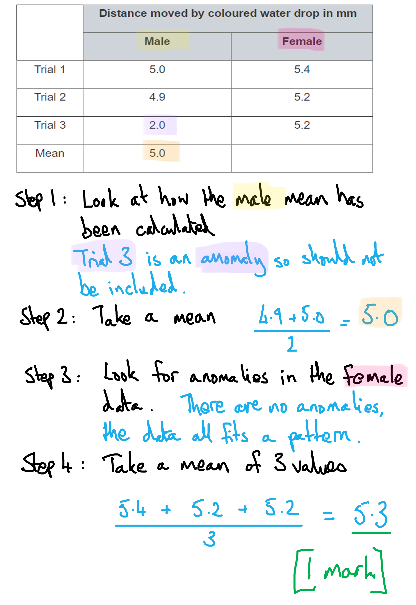
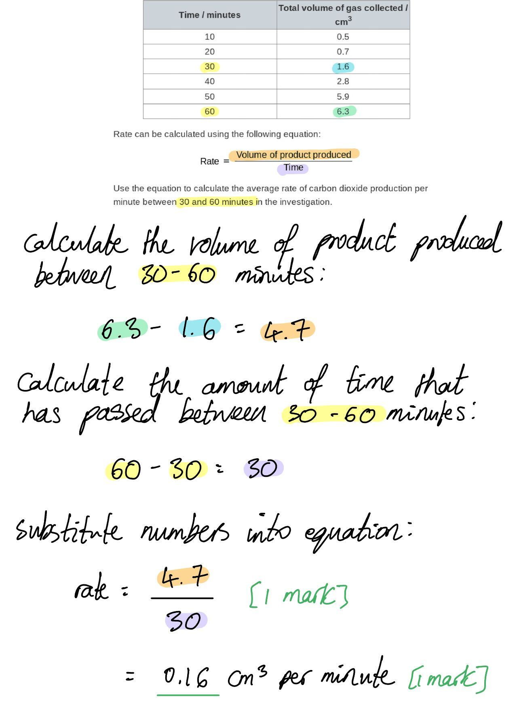
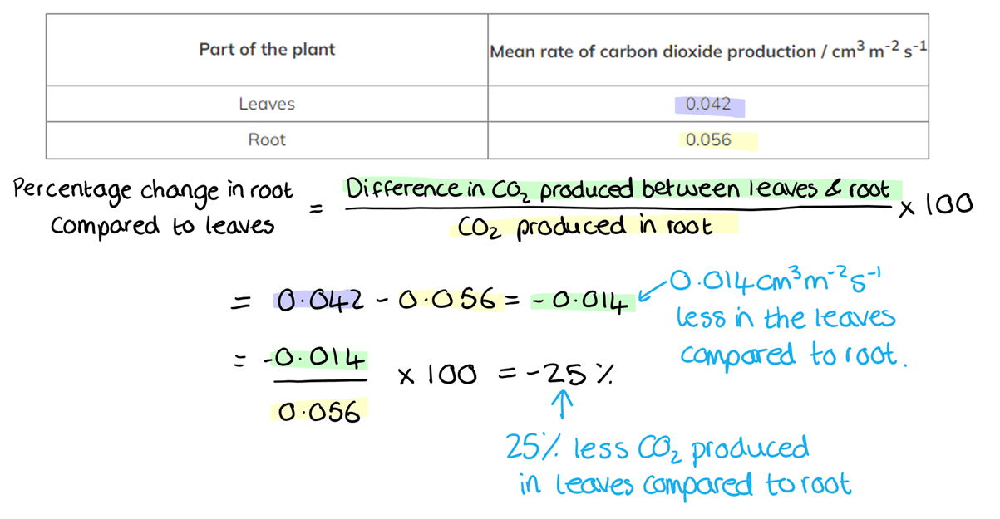
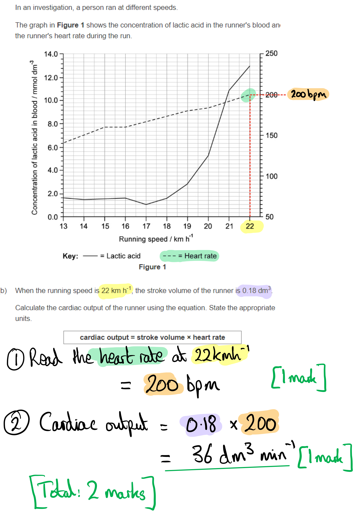
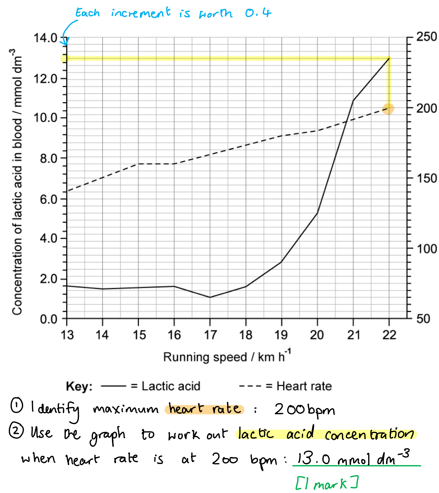
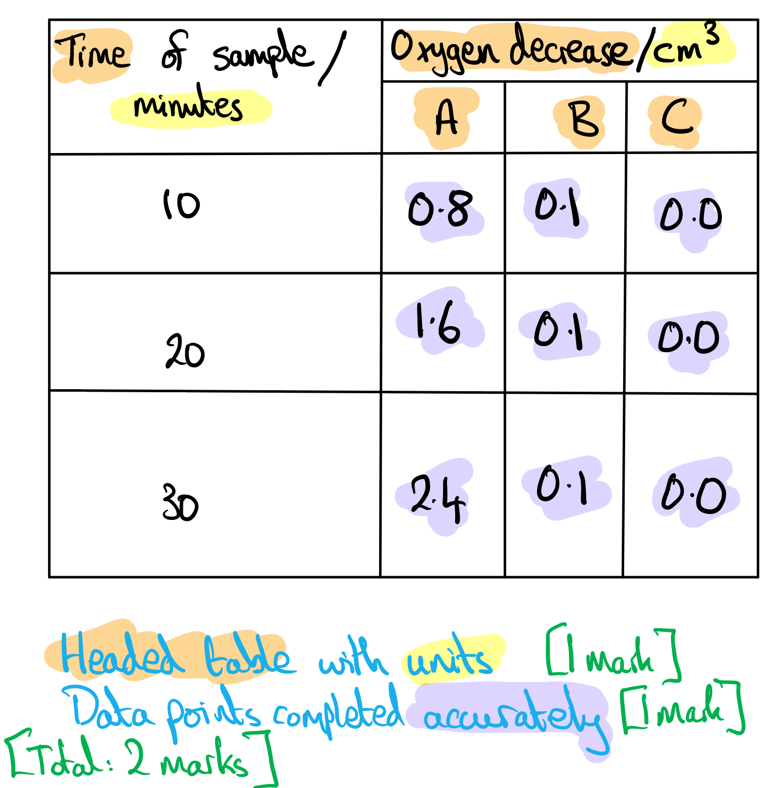
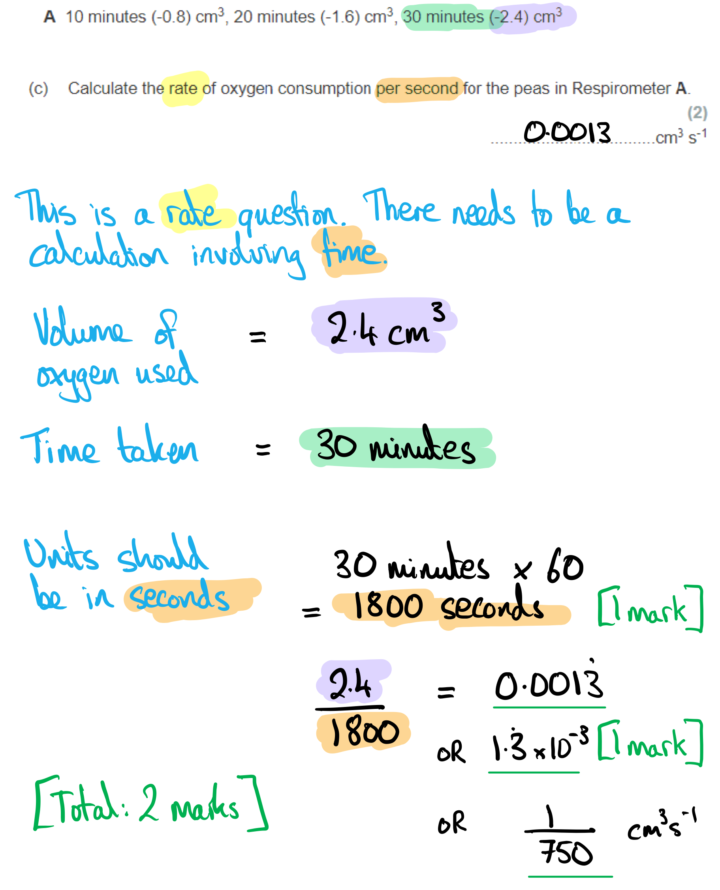

# Mark Schemes — Respiration
**2. Structure & Function in Living Organisms** · Edexcel IGCSE Biology (4BI1)

## Q1 — easy — 9 marks · exam-questions

### 1() — 1 marks
**Final answer:** **The correct answer is ****C ****because...**

Respiration is one of the MRS C GREN life processes, and it occurs (in some form) in the cells of **all living organisms**. It is an essential chemical reaction that releases the energy needed by organisms for survival. The confusion around plants often comes from the fact that plants carry out photosynthesis; remember that **plants carry out respiration as well as photosynthesis** (in fact photosynthesis produces the glucose that plants then use in respiration).

**A** is a correct statement because the energy released during respiration is then stored within the bonds of a molecule known as ATP. The energy can be released quickly from ATP for any process that needs it.

**B** is a correct statement because the bonds in glucose are broken during respiration, releasing the chemical energy stored within them.

**D** is a correct statement because some of the energy released during respiration is in the form of heat. This heat energy can be used by some organisms to assist in the regulation of body temperature

**[Total: 1 mark]**

### 2() — 2 marks
(i) The sub-cellular structure where respiration takes place is....

- Y; **[1 mark]**

(ii) The name of the structure is the...

- Mitochondrion/mitochondria; **[1 mark]**

**[Total: 2 marks]**

### 3() — 4 marks
The sentence should be completed as follows...

- Respiration releases energy from **glucose**; **[1 mark]**, to be used in life processes such as **chemical**; **[1 mark]** reactions, **muscle**; **[1 mark] **contraction and maintaining a constant body **temperature**; **[1 mark]**.

**[Total: 4 marks]**

> *The energy stored in glucose is **chemical energy**. This energy is transferred to other forms of energy once it is released during the process of respiration.*

### 4() — 2 marks
The table should be completed as follows...

Award 1 mark for each correct **column**:

|   | **Product** | **Reactant** |
|---|---|---|
| Oxygen | **X** | ✓ |
| Carbon dioxide | ✓ | **X** |
| Lactic acid | **X** | **X** |
| Glucose | **X** | ✓ |
| Water | ✓ | **X** |
| Ethanol | **X** | **X** |

**[Total: 2 marks]**

> *It is important to make sure you read the instructions carefully and fill every box with either a (✓) or a (**X**). Leaving blank spaces will result in the marks being lost.*

> *You must also note here that the question is asking you about **aerobic respiration** in **animals**; answers relating to anaerobic respiration or respiration in other groups of organisms will be incorrect.*

## Q2 — easy — 7 marks · exam-questions

### 1() — 2 marks
Two uses of energy from respiration include....

Any **two** of the following:

- Active transport; **[1 mark]**
- Muscle contraction/movement; **[1 mark]**
- (Generating/sending) nerve impulses; **[1 mark]**
- Cell growth / division; **[1 mark]**
- Protein synthesis / building proteins/enzymes **OR** building large molecules from small molecules; **[1 mark]**
- Chemical reactions / e.g. breaking down/digesting large molecules into small molecules; **[1 mark]**
- Maintaining a constant temperature / body temperature of 37 °C / thermoregulation; **[1 mark]**

*Accept other correct examples of energy use in animal cells.*

**[Total: 2 marks]**

### 2() — 1 marks
**Final answer:** **The correct answer is ****A ****because...**

Gas exchange involves the passive movement of gases (oxygen and carbon dioxide) by **diffusion** from a **high concentration to a low concentration** (down a concentration gradient).

**C** and** D** are incorrect because osmosis refers to the movement of **water** molecules and active transport **requires energy** to move molecules **against** a concentration gradient.

**[Total: 1 mark]**

### 3() — 1 marks
The process is anaerobic because...

- There is no oxygen used / oxygen is not a reactant; **[1 mark]**

**[Total: 1 mark]**

### 4() — 1 marks
Earthworms cannot survive for very long in heavily waterlogged soil because...

Any **one** of the following:

- They cannot respire anaerobically (for very long); **[1 mark]**
- Lactic acid lowers the pH of their cells/makes the cells acidic / causes enzymes in their cells to denature; **[1 mark]**
- Anaerobic respiration releases less energy / does not release enough energy; **[1 mark]**

**[Total: 1 mark]**

> *This is a straightforward example of a 'suggest' question, meaning that you are not expected to **know** about respiration in earthworms, but that you should be able to use the information provided in the question and your knowledge of anaerobic respiration to come up with a sensible answer. Here you need to consider the impacts of anaerobic respiration on organisms.*

### 5() — 2 marks
The process that occurs in the body during an oxygen debt is...

Any **two **of the following:

- Deeper/faster/harder breathing to supply oxygen; **[1 mark]**
- Oxygen is used to break down lactic acid; **[1 mark]**
- Lactic acid is converted to glucose; **[1 mark]**
- Carbon dioxide / water released as a waste product; **[1 mark]**

**[Total: 2 marks]**

## Q3 — easy — 9 marks · exam-questions

### 1() — 2 marks
(i) The type of respiration being investigated is...

- Anaerobic;** [1 mark]**

(ii) We know this because...

- The paraffin will prevent oxygen reaching the yeast/solution / keeps oxygen out (so forcing the yeast to respire anaerobically); **[1 mark]**

**[Total: 2 marks]**

> *Ensure that you study a diagram carefully and that you read all of the information provided before attempting to answer a question. Here the question stem tells us that paraffin is impermeable to oxygen, and the diagram shows that the yeast solution has been covered by a layer of paraffin. This means that the yeast cells will soon use up any oxygen in the solution and be forced to respire anaerobically.*

> *Note that while this is a practical that investigates respiration, it actually doesn't appear in the specification until the food production topic which is usually taught towards the end of the GCSE course. This doesn't mean that you shouldn't be able to answer these questions relating to the practical earlier on in your studies, but if you want to find out more about it then you will need to jump ahead in the course to read about it.*

### 2() — 1 marks
The gas in the bubbles produced is...

- Carbon dioxide; **[1 mark]**

**[Total: 1 mark]**

> *Yeast is classified as a fungus, and you should be aware that anaerobic respiration in fungi produces carbon dioxide gas.*

> *The fact that limewater becomes cloudy when carbon dioxide is bubbled through it should also be a clue here!*

### 3() — 2 marks
The student would need to control the following factors...

Any **two** of the following...

- The volume of yeast solution / the number of yeast cells in the solution; **[1 mark]**
- The concentration of sugar in the solution; **[1 mark]**
- The type of sugar in the solution; **[1 mark]**
- The depth of the paraffin layer; **[1 mark]**
- The length of time for which bubbles are counted; **[1 mark]**
- The time that the test tubes spend in the water bath before starting the bubble count; **[1 mark]**
- The depth at which the bubble/delivery tube is submerged in the limewater solution; **[1 mark]**

**[Total: 2 marks]**

> *Remember that a control variable is a factor that needs to be kept the same throughout an experiment so that it doesn't affect the results. Here there are lots of factors that can be determined by looking at the diagram and reading the method description.*

### 4() — 4 marks
The table should be completed as follows...

| **Statement** | **Respiration Type** |
|---|---|
| Produces lactic acid as a waste product | Anaerobic respiration |
| Produces ethanol when it occurs in yeast | Anaerobic respiration; **[1 mark]** |
| Produces lots of ATP | Aerobic respiration; **[1 mark]** |
| Releases energy from glucose | Both; **[1 mark]** |
| Increases during intense exercise | Anaerobic respiration; **[1 mark]** |

**[Total: 4 marks]**

## Q4 — medium — 13 marks · exam-questions

### 6((a)) — 1 marks
**The correct answer is ****D**** because...**

Oxygen and glucose react together to release energy. Carbon dioxide and water are the products.

**A** is incorrect because the equation is not balanced therefore cannot happen in reality.

**B** is the equation for a form of *anaerobic* respiration.

**C** is incorrect because the reactant (O2) and product (CO2) are on the wrong sides of the equation.

**[Total: 1 mark]**

### 6((b)) — 8 marks
> **[mark-scheme]**
> (i) The coloured water drop moves during the investigation because...
> 
> Any **two **of the following:
> 
> - (The bubble moves) left / towards the locust
> - Carbon dioxide produced by insect is absorbed by potassium hydroxide/KOH / filter paper
> - Oxygen (is used by insect)
> - In the process of respiration
> 
> **[2 marks]**
> 
> (ii) Three other variables that the student needs to control are...
> 
> Any** three** pairs from (one mark per point):
> 
> - The size / mass of locusts
> - Because more cells means more respiration
> 
> **OR**
> 
> - Movement allowed for the locust / the size of the flask
> - Because more room for movement means more respiration
> 
> **OR**
> 
> - Volume / concentration of KOH / size of filter paper
> - Because that affects the amount of carbon dioxide absorbed
> 
> **OR**
> 
> - Temperature
> - Because it affects enzymes / increase kinetic energy / particle movement
> 
> **OR**
> 
> - Time / duration of the experiment
> - Because with more time to respire / more oxygen will be absorbed by the locust
> 
> *Ignore time of day / light / oxygen / humidity etc.*

> **[exam-tip]**
> Even though there is no mark awarded for mentioning pressure changes, it is changes in gas pressure that cause the movement of the bubble. Because oxygen is used up and the carbon dioxide that replaces it in the air gets absorbed by the potassium hydroxide, this will cause an overall decrease in gas pressure because all gases occupy the same amount of volume. With effectively less gas in the system, the bubble moves left as higher-pressure air on the outside pushes it towards the locust.

### 6((c)) — 4 marks
(i) The missing mean value is calculated as follows...

- $\frac{5.4+5.2+5.2}{3}=\frac{15.8}{3}=5.3$; **[1 mark]**

(ii) Comments on the reliability of the data are as follows...

Any **three **of the following..**.**

- The data is not reliable / reliability can be increased; **[1 mark]**
- There are not enough repeats / only three results / needs to be repeated more times; **[1 mark]**
- One result is anomalous / male 3 result is anomalous; **[1 mark]**
- There is more variation within sex than between sexes; **[1 mark]**

**[Total: 4 marks]**

## Q5 — medium — 13 marks · exam-questions

### 1() — 4 marks
The statement that *'respiration and metabolic reactions are intrinsically linked to temperature'* is true because...

Any **four **of the following:

- Metabolic reactions are the chemical reactions in a cell / the body; **[1 mark]**
- Respiration is an example of a metabolic reaction; **[1 mark]**
- Respiration is controlled by enzymes **OR** metabolic reactions are controlled by enzymes; **[1 mark]**
- Enzyme controlled reactions are affected by temperature **OR** higher temperatures allow faster enzyme activity **OR** extremely high temperatures cause enzymes to denature; **[1 mark]**
- Respiration/some metabolic reactions release energy in the form of heat; **[1 mark] **

**[Total: 4 marks]**

> *All enzyme controlled reactions are dependent on temperature, and this includes metabolic reactions inside the cells, such as respiration. The rate of respiration is affected by body temperature; if the body gets too cold then respiration will slow down (e.g. during hypothermia) and if the body gets too hot then the enzymes will denature (e.g. heat stroke, or a high fever).*

### 2() — 3 marks
Three ways that animals use the energy from aerobic respiration are...

Any **three** of the following**:**

- Maintaining (core) body temperature / keeping warm / thermoregulation; **[1 mark]**
- Movement / muscle contraction / named example of muscle movement, e.g. heart beating / peristalsis; **[1 mark]**
- Synthesis of new molecules / chemical reactions to build large molecules (e.g proteins); **[1 mark]**
- Cell growth / division; **[1 mark]**
- Active transport / transporting molecules across cell membranes against their concentration gradient; **[1 mark]**
- generating/transmitting nerve impulses; **[1 mark]**

*Accept other correct examples of energy use in animals.*

**[Total: 3 marks]**

> *Answers that state 'growth, repair or reproduction' would be insufficient here; you need to be specific.*

### 3() — 3 marks
Aerobic and anaerobic respiration can be compared as follows...

Any **three** of the following:

- Aerobic respiration occurs in the presence of oxygen **WHEREAS **anaerobic respiration occurs in the absence of oxygen; **[1 mark]**
- Aerobic respiration produces <u>more</u> energy than anaerobic respiration; **[1 mark]**
- The products of aerobic respiration are carbon dioxide and water **WHEREAS** the product of anaerobic respiration is lactic acid; **[1 mark]**
- Glucose is completely broken down in aerobic respiration** WHEREAS** it is only partially broken down in anaerobic respiration; **[1 mark]**

**[Total: 3 marks]**

> *This is a **compare** question so it is important that you make direct comparisons or use language which is comparative in some way, e.g. aerobic respiration produces **more** energy than anaerobic respiration.*

### 4() — 3 marks
Exercise cannot be sustained for long periods using anaerobic respiration because...

Any **three** of the following:

- Not enough energy is transferred/released (for muscle contraction); **[1 mark]**
- Lactic acid causes the pH of cells to decrease / cells to become acidic; **[1 mark]**
- Enzymes (of the body cells) cannot function well at low pH (slowing down chemical reactions); **[1 mark]**
- Muscles become fatigued quickly (due to lack of energy); **[1 mark]**

**[Total: 3 marks]**

> *While anaerobic respiration can support short bursts of intense exercise, such as lifting a heavy weight, or running 100 m, anaerobic respiration cannot sustain long periods of activity. **Less energy is released** in anaerobic respiration and **lactic acid** **is produced** as a by-product. During long periods of anaerobic activity the lactic acids accumulates in the muscles causing them to become fatigued and stop contracting efficiently. This is why our legs feel so heavy and tired after sprinting for a long time.*

## Q6 — medium — 10 marks · exam-questions

### 1() — 3 marks
We can compare anaerobic respiration in animal muscle cells and yeast cells as follows...

- <u>Both</u> release/transfer (relatively) small amounts of energy; **[1 mark]**
- Lactic acid is produced in animal muscle cells **WHILE** ethanol is produced in yeast cells; **[1 mark]**
- Carbon dioxide is produced in yeast **WHILE** it is not in animal muscle cells; **[1 mark]**

*Award marking points 2 and 3 for word equations for anaerobic respiration in animal and yeast cells, e.g. *

- *Animals: Glucose → *<u>*lactic acid*</u>*; ***[1 mark]**
- *Yeast: Glucose → *<u>*ethanol*</u>* + *<u>*carbon dioxide*</u>*;*** [1 mark]**

**[Total: 3 marks]**

> *Pay close attention to the specifics of the question here; you are not being asked to compare aerobic and anaerobic respiration, but to compare anaerobic respiration in two cell types.*

### 2() — 2 marks
The rate of carbon dioxide production can be calculated as follows...

- 4.7 ÷ 30; **[1 mark]**
- 0.16 (cm3 min-1); **[1 mark]**

**[Total: 2 marks]**

### 3() — 3 marks
The rate of carbon dioxide production decreased because...

Any **three **of the following:

- There is no more glucose / the glucose is used up; **[1 mark]**
- Respiration slows down/stops; **[1 mark]**
- Ethanol / toxins have built up; **[1 mark]**
- Yeast cells are killed; **[1 mark]**

**[Total: 3 marks]**

### 4() — 2 marks
The student could have ensured the reliability of the results by...

- Repeating the experiment (while keeping every factor within the experiment the same); **[1 mark]**
- Ensuring that the results are similar/consistent **OR** identifying/removing/repeating any anomalous results; **[1 mark]**

**[Total: 2 marks]**

## Q7 — hard — 11 marks · exam-questions

### 1() — 2 marks
The balanced symbol equation for respiration is as follows...

Award 1 mark for correct **reactants** and 1 mark for correct **products**:

- C6H12O6 + 6O2 → 6CO2 + 6H2O; **[2 marks]**

**[Total: 2 marks]**

### 2() — 3 marks
The percentage difference is...

- (-) 0.014; **[1 mark]**
- (0.014 ÷ 0.056) x 100; **[1 mark]**
- = - 25 % **OR **25 % (less carbon dioxide produced** **in the leaves compared to the roots); **[1 mark]**

**[Total: 3 marks]**

### 3() — 3 marks
The readings were taken in the night time because...

- Photosynthesis does not occur in the dark / without light; **[1 mark]**
- Carbon dioxide produced in respiration may be used in photosynthesis; **[1 mark]**
- This will affect the measurement for the rate of production of carbon dioxide / the measured rate of carbon dioxide production may be lower than the actual rate / may not be accurate; **[1 mark]**

**[Total: 3 marks]**

> *During the daylight, photosynthesis will be taking place at the same time as respiration, so any carbon dioxide produced during respiration may be immediately used up in photosynthesis. This would mean that any recorded value for carbon dioxide production may not be accurate, as it may be less than the actual volume of carbon dioxide produced.*

### 4() — 2 marks
An explanation for the results shown in the table could be...

Any **two **of the following:

- Respiration occurs in both the leaves and the roots; **[1 mark]**
- Root cells are more active / have a higher metabolism than leaf cells **OR** root cells carry out more active transport than leaf cells / actively transport minerals from the soil (so they carry out more respiration); **[1 mark]**
- Cells in the root have more mitochondria (so they carry out more respiration); **[1 mark]**

**[Total: 2 marks]**

> *Note that this is an **explain** question so no marks will be available for just describing the results.*

> *Both root cells and leaf cells produce carbon dioxide, and this can be explained by the fact that **both sets of cells are respiring** and producing carbon dioxide as a product.*

> *The increased rate of respiration in root cells suggests that they are **more metabolically active**, e.g. due to the active transport of minerals into the root hair cells.*

> *Remember that mitochondria are the site of respiration, so a cell that has **more mitochondria** will carry out more respiration.*

### 5() — 1 marks
The readings may still be higher because...

- Respiration of other organisms/microorganisms/decomposers in the soil (produces carbon dioxide); **[1 mark]**

**[Total: 1 mark]**

> *Soil is not devoid of life, but has a rich biodiversity of microorganisms within it, such as bacteria and fungi. All of these organisms respire, and so will be releasing carbon dioxide into their surroundings.*

## Q8 — hard — 15 marks · exam-questions

### 1() — 3 marks
Respiration is...

- A chemical process / reaction in cells; **[1 mark]**
- That is exothermic / supplies / releases / generates energy;** [1 mark]**

Plus **one** of the following:

- Releases carbon dioxide / CO2 / water / H2O / lactic acid / ethanol; **[1 mark]**
- From glucose/food substances (and oxygen); **[1 mark]**

***Ignore**** references to breathing* ***Ignore ****'produces / makes energy'*

**[Total: 3 marks]**

> *For a seemingly short question, you should notice the number of marks available is quite high, at 3. This tells you that a good amount of detail has to go into your answer. Note the specific omissions in italics in the mark scheme. These are common misconceptions and the examiners will catch them out!*

> *Remember 'energy cannot be created or destroyed only transferred from one form to another' and this is why we cannot refer to 'making' energy.*

### 2() — 2 marks
The cardiac output of the runner at 22 km h-1 is...

- (Heart rate =) 198 to 200; **[1 mark]**
- 0.18 × 198 to 200 =  35.6 to 36 dm3 min-1 / dm3 per minute / litres per minute;** [1 mark]**

*A correct answer without units should be awarded a maximum score of**** *****[1 mark]**

**[Total: 2 marks]**

### 3() — 1 marks
The concentration of lactic acid in the blood when the heart rate has reached its maximum level is ...

- 13.0 mmol dm-3; **[1 mark]**

***Allow ****answers in the range 12.6 to 13.2*

**[Total: 1 mark]**

### 4() — 3 marks
The concentration of lactic acid changes at running speeds greater than 18 km h-1 because...

Any **three **of the following:

- Lactic acid increases / more lactic acid (as exercise increases); **[1 mark]**
- Requiring more energy / muscles working/contracting harder / faster; **[1 mark]**
- Aerobic respiration at its maximum rate;** [1 mark]**
- As oxygen is not supplied fast enough / muscles not getting enough oxygen;** [1 mark]**
- So anaerobic respiration occurs (producing lactic acid); **[1 mark]**

**[Total: 3 marks]**

### 5() — 6 marks
(i) The changes that occur in the lactic acid levels are...

Any **three **of the following:

- The lactic acid levels decrease; **[1 mark]**
- Lactic acid is broken down by reacting with <u>oxygen</u>; **[1 mark]**
- In the liver; **[1 mark]**
- To carbon dioxide and water; **[1 mark]**
- This pays off / reduces / removes the oxygen debt; **[1 mark]**

(ii) This process differs between fit people and unfit people by...

Any **three **of the following:

- Unfit people take longer to recover; **[1 mark]**
- (Unfit people) lactic acid levels go down slower; **[1 mark]**
- Heart/cardiac muscle is weaker (in unfit people); **[1 mark]**
- (Unfit person) take more time for enough oxygen to circulate the body (to pay back oxygen debt); **[1 mark]**

***Accept**** converse for all marking points e.g. fit people take less time to recover*

**[Total: 6 marks]**

> *Oxygen debt is one of the more challenging aspects of this topic. Make sure you can describe what happens in the body to cause an oxygen debt, and how it is paid off. *

## Q9 — hard — 16 marks · exam-questions

### 1() — 2 marks
The respirometers were placed in a water bath at 25°C for 30 minutes because...

- Same temperature / so temperature is a control variable;** [1 mark]**
- (To provide) good/ideal/optimum temperature for enzyme action in the peas; **[1 mark]**

**[Total: 2 marks]**

> *To score these 2 marks you must first identify that the temperature is being controlled and then to demonstrate an understanding of why that temperature control is important in this investigation. *

### 2() — 2 marks
Marks for the completed table are awarded as follows:

- Headed table with units stated in the headings ; **[1 mark]**
- Data points completed accurately; **[1 mark]**

*Negative numbers do not need to be shown if the table heading states oxygen used/lost/decrease ****Accept ****time in row 1 as an alternative*

**[Total: 2 marks]**

> *It is normal practise that independent variables are found in the far left column of a table and the dependent variable is found in the right side of the table. You can only achieve MP1 if this is done correctly.*

### 3() — 3 marks
The rate of oxygen consumption per second for the peas in Respirometer A was...

- 2.4 cm3 ÷ (30 × 60); **[1 mark]**
- = 0.0013  **OR** 1/750  **OR** 1.33 ×10-3; **[1 mark]**
- cm3 per second **OR **cm3 second-1 **OR **cm3/second; **[1 mark]**

***Award full marks**** for a correct numerical answer without working.*

***Allow**** calculations done over a time period of 10 or 20 minutes (because the rate is constant).*

***Allow**** answer to 2sf or 3sf / any acceptable way of showing a recurring decimal / fraction / standard form.*

*Maximum ***[1 mark]*** if there is no unit conversion.*

**[Total: 3 marks]**

### 4() — 3 marks
(i) Glass beads were used in Respirometer C because...

- To act as a control / to ensure oxygen consumption was not caused by another factor; **[1 mark]    **

(ii) Respirometer A has the highest rate of oxygen consumption of the three respirometers because...

- (The peas in A) are germinating / respiring heavily SO are using oxygen to release energy for growth; **[1 mark]**
- (The peas in B) are dead / enzymes have been denatured SO cannot respire/use oxygen; **[1 mark]**

**[Total: 3 marks]**

### 5() — 6 marks
The investigation would be as follows...

Any **six **of the following:

- C = change the types of seeds used e.g. germinating seeds, boiled seeds, glass beads; **[1 mark]**
- O = <u>same</u> species of pea / number of peas; **[1 mark]**
- R = repeat several times; **[1 mark]**
- M = measure temperature change using a thermometer/temperature probe; **[1 mark]**
- M = detail of the duration of experiment e.g. test (temperature) every hour for 5 hours; **[1 mark]**
- S = same moisture/water (in cotton wool); **[1 mark]**
- S = same oxygen availability; **[1 mark]**

**[Total: 6 marks]**

> *Remember that with **CORMS** questions you will not be expected to know anything about the experiment you're presented with. You just have to apply your knowledge of experimental design to a new scenario. *

> *Remember that **CORMS** stands for: **C**hange, **O**rganism, **R**epeat, **M**easure, **S**ame. There are always two marks available for **M**easure and two for **S**ame. *

> *The most difficult mark to get is the **O**rganism because you need to remember to include the word **same** in your answer, eg. "same species". The point for **O**rganism needs to be different to the two points in **S**ame. *

> *Remember to write your answers in full sentences, as stated in the question stem, but you are welcome to make a quick bullet point plan in a blank space somewhere else on your page. Use your plan to tick off and make sure you've hit all the marking points.*
