# Mark Schemes — Transport Systems
**2. Structure & Function in Living Organisms** · Edexcel IGCSE Biology (4BI1)

## Q1 — easy — 6 marks · exam-questions

### 3((a)) — 1 marks
**The correct answer is ****D ****because...**

Osmosis is always how water moves from the soil into the roots. Osmosis involves the movement of water from a high water potential area to a low water potential across a partially permeable membrane.

**A** is incorrect because water is not transported by the process of active transport.

**B** is incorrect because osmosis is a form of diffusion but water specifically moves by osmosis.

**C** is incorrect because water does not evaporate from the soil into the roots of the plant. The water in the roots of the plant is liquid, not a gas.

**[Total: 1 mark]**

### 3((b)) — 1 marks
The tissue that transports water to the leaves is...

- Xylem/xylem vessels; **[1 mark]**

**[Total: 1 mark]**

### 3((c)) — 1 marks
The process that moves water vapour into the air is...

- Transpiration / evaporation / diffusion / evapotranspiration;** [1 mark]**

**[Total: 1 mark]**

### 3((d)) — 1 marks
**Final answer:** **The correct answer is ****C ****because...**

Low air temperature reduces the movement of water from the leaves into the air because the water molecules have lower kinetic energy.

**A** is incorrect because high light intensity increases the movement of water because it causes more stomata to open underneath the leaf to allow for more CO2 to enter the leaf for photosynthesis.

**B** is incorrect because low air humidity increases the movement of water because it increases the diffusion gradient for water to move out of the leaf.

**D** is incorrect because windy conditions increase the movement of water because it increases the diffusion gradient for water to move out of the leaf.

**[Total: 1 mark]**

### 3((e)) — 2 marks
Two uses of water in a plant are...

Any **two **of the following:

- Support/turgor / maintaining the rigid structure of plant cells; **[1 mark]**
- Photosynthesis; **[1 mark]**
- Cooling; **[1 mark]**
- Reactions/solvent / transport of mineral ions/named mineral ion; **[1 mark]**

**[Total: 2 marks]**

> *Transpiration is not a **use** of water in the plants because it is how plants lose water, although it does contribute to cooling. *

## Q2 — easy — 12 marks · exam-questions

### 1() — 3 marks
(i) A root hair cell is adapted to absorb water in the following ways...

- (They are) an extension / pointed / elongated; **[1 mark]**
- (Which leads to an) increased surface area / increased surface area to volume ratio; **[1 mark]**

*Allow from a labelled diagram.*

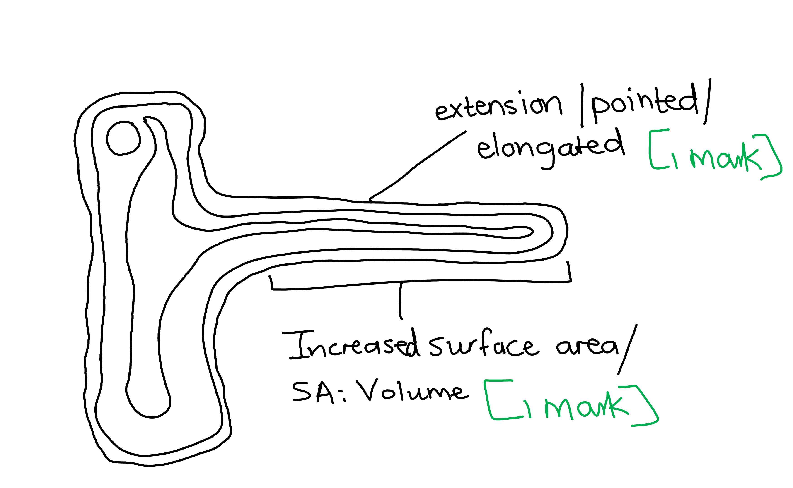

(ii) The difference between osmosis and diffusion is...

Any **one** of the following:

- (Osmosis) involves (the movement of) water (only) **OR** (diffusion) involve (the movement of different types of) molecules; **[1 mark]**
- (In osmosis water) must pass through a cell membrane / a partially permeable membrane **OR** (in diffusion) a cell membrane is not always involved; **[1 mark]**

**[Total: 3 marks]**

### 3((b)) — 5 marks
(i) The results can be explained as follows...

Any **three** of the following:

- More water is taken up in light (conditions) **OR** less water is taken up in dark (conditions); **[1 mark]**
- More water lost in light (conditions) **OR** less water lost in dark (conditions); **[1 mark]**
- Evaporation from leaves creates a transpiration stream / transpiration pull / sets up water potential gradient (in light conditions); **[1 mark]**
- (The) stomata are open in light (conditions) **OR** stomata are closed in dark (conditions); **[1 mark]**
- (More water is taken up than lost because) water used to fill cells / for growth / to maintain turgor/ for photosynthesis; **[1 mark]**

*Ignore reference to temperature for marking point 5.*

(ii) Abiotic variables that should be controlled include...

Any **two** of the following:

- Humidity/moisture; **[1 mark]**
- Temperature; **[1 mark]**
- Wind / air flow; **[1 mark]**
- Time; **[1 mark]**

*Ignore mention of carbon dioxide/CO**2**.*

**[Total: 5 marks]**

> *The loss of water vapour through the stomata by the process of transpiration is the main driving force behind the movement of water through a plant. This mainly occurs during the day when the stomata are open. This creates transpiration pull, which facilitates the upward movement of water in the xylem of the stem to replace the water that was lost through transpiration.*

### 3((c)) — 4 marks
(i) The apparatus used by the student is called a...

- Potometer / bubble potometer / volume potometer; **[1 mark]**

(ii) The student could use this apparatus to find the mean rate of water uptake as follows...

Any **three** of the following:

- Measure the distance that the bubble moves **OR** measure the volume lost from the beaker; **[1 mark]**
- Calibrate (the scale) / calculate the volume by multiplying the distance by the (cross sectional) area **OR** use the scale on the beaker / note the volume before and after the time period; **[1 mark]**
- Use the reservoir to reset (the position of the bubble to 0); **[1 mark]**
- Take repeat measurements (to calculate the mean); **[1 mark]**
- Reference to measuring / stated time e.g. leave the potometer for 30 minutes; **[1 mark]**

**[Total: 4 marks]**

> *Make sure to familiarise yourself with the steps involved in using a potometer to calculate the rate of transpiration as this is a popular exam question.*

## Q3 — medium — 12 marks · exam-questions

### 3((a)) — 2 marks
(i)** ****The correct answer is ****B ****because...**

The elongated cells present in this layer are the palisade cells after which the layer is named.

While layer C is also referred to as mesophyll, this is the spongy mesophyll and does not contain any palisade cells.

(ii) **The correct answer is ****C ****because...**

Transpiration is the loss of water vapour from leaf stomata by the process of diffusion.

Low humidity in the air surrounding the leaf creates a water vapour concentration gradient between the inside of the leaf (where water vapour concentration is high) and the surrounding air, causing air to diffuse out of the leaf at a higher rate.

High temperatures give water molecules more kinetic energy, increasing the rate at which water vapour diffuses out of the stomata.

High humidity would decrease the concentration gradient between the inside of the leaf and the surrounding air, decreasing the rate of diffusion.

Low temperatures will reduce the kinetic energy of the water molecules. decreasing the rate at which they diffuse.

**[Total: 2 marks]**

### 3((b)) — 10 marks
(i) The independent variable in this investigation is...

- Carbon dioxide (concentration); **[1 mark]**

(ii) Abiotic variables that the scientists could control include...

Any **two** of the following:

- Temperature; **[1 mark]**
- Light / light intensity/wavelength/colour; **[1 mark]**
- Mineral ion (availability) / soil pH/type; **[1 mark]**
- Water (availability) / humidity; **[1 mark]**

> *The independent variable in an investigation is the one that the investigators change on purpose; in this case they change the carbon dioxide concentration in order to observe the effects of this on stomata density.*

(iii) The mean density of stomata on the leaf surface is...

- 70; **[1 mark]**
- (Answer in the range of) 0.5 - 0.503; **[1 mark]**
- 140; **[1 mark]**

***Accept ****answers between 139 and 140 for full marks.*

*Full marks can be awarded for the correct answer in the absence of other calculations.*

> *When carrying out calculation questions it is always a good idea to show your working; this means that if your final answer is incorrect you may still gain credit for correct calculations along the way.*

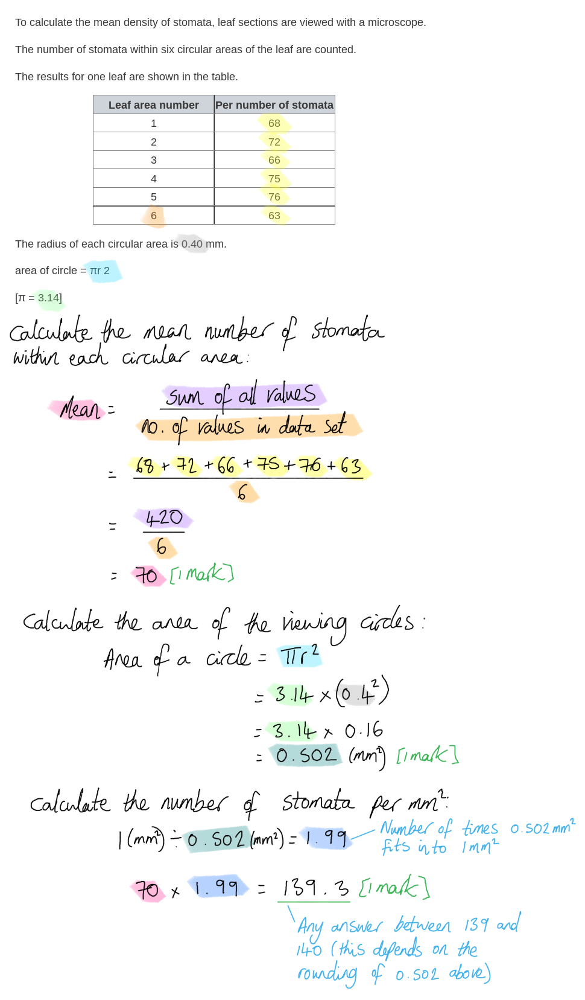

(iv) Discussion points relating to the scientist's conclusion that in hot dry areas, with increased carbon dioxide concentrations, it would be an advantage for wheat to have a lower mean density of stomata include...

Any **four** of the following:

Points relating to carbon dioxide

- Carbon dioxide is needed for photosynthesis; **[1 mark]**
- Fewer stomata may reduce uptake of carbon dioxide / reduce (rate of) gas exchange; **[1 mark]**
- Fewer stomata will be needed if carbon dioxide levels are high / when there is a steeper/higher diffusion gradient of carbon dioxide / as high carbon dioxide (concentration) generates a high/steep diffusion gradient; **[1 mark]**

Points relating to transpiration

- Fewer stomata reduces water loss / transpiration / evaporation; **[1 mark]**
- (Less transpiration) prevents wilting; **[1 mark]**

Points relating to minerals

- (Less transpiration) reduces mineral / named mineral transport/absorption (in leaves; this is because minerals are carried dissolved in water in the xylem and fresh mineral supplies arrive at the leaves only when transpiration is occurring); **[1 mark]**
- Less magnesium for (production of) chlorophyll / fewer nitrates for (production of) amino acids; **[1 mark]**

Other

- (Less transpiration) reduces cooling (of leaves by evaporation); **[1 mark]**

***Ignore**** nutrients for minerals in marking point 6*

***Accept*** *other correctly named minerals and their function for marking point 7.*

*Marks for marking points 6 and 7 can be awarded within a single sentence, e.g. less uptake of magnesium (mp6) to make chlorophyll (mp7).*

> *'Discuss' questions require you to consider all aspects of a question. Here the conclusion is a simple statement that it would be advantageous for plants to have fewer stomata in hot, dry areas where carbon dioxide availability is high. The most obvious aspect of this conclusion relates to carbon dioxide; why plants need it and why they might get away with fewer stomata when concentrations are high. Stomata number will also have an impact on transpiration, so this is another aspect to consider. The transpiration stream is important for the supply of minerals to the leaves, and transpiration also provides a cooling mechanism for the leaves, so these aspects can also be considered here.*

> *Don't be afraid of having a go at these longer 'discuss' questions; consider the processes within an organism that may be affected by the statement being discussed, and write about how they are affected and why.*

**[Total: 10 marks]**

## Q4 — medium — 10 marks · exam-questions

### 6((a)) — 6 marks
(i) Root hair cells are adapted for efficient absorption of water as follows...

Any **two** of the following:

- Elongated / projections / extensions; **[1 mark]**
- Increased surface area; **[1 mark]**
- A thin wall which gives a short diffusion path; **[1 mark]**
- Concentrated cell sap (stored in vacuole); **[1 mark]**
- A low water potential to increase gradient / water potential gradient for osmosis; **[1 mark]**

(ii) Water is transported from the soil to the leaves as follows...

Any** four** of the following:

- Water enters (root) by osmosis; **[1 mark]**
- From dilute solution to more concentrated solution / from higher water potential to lower water potential from high concentration of water to low concentration of water; **[1 mark]**
- Water enters / moves up the xylem; **[1 mark]**
- Water is pulled up to leaf due to transpiration / pulled along transpiration stream / pulled due to evaporation from leaf; **[1 mark]**
- Water vapour exits / diffuses through stomata; **[1 mark]**

> *Take care when explaining the gradients involved with osmosis. You should always make it clear whether you are referring to solute concentrations or water potentials.*

**[Total: 6 marks]**

### 6((b)) — 4 marks
The rate of water loss from a leafy shoot could be determined as follows...

Any** four** of the following:

- To use a use (bubble) / (weight) <u>potometer</u>; **[1 mark]**
- Cut the shoot underwater / dry leaves / place mineral oil on the surface of water / wrap a polythene bag around the soil (if shoot placed in soil); **[1 mark]**
- Measure the distance moved by bubble (in cm) / mass lost / change in volume of water*; **[1 mark]**
- (In a) set time / stated time, e.g. 5 minutes, 30 minutes; **[1 mark]**
- Repeat / calculate mean rate; **[1 mark]**

**[Total: 4 marks]**

> *Avoid confusion with the photosynthesis experiments in which bubbles of oxygen are counted. That's a totally different experimental set-up and will gain you no credit if you discuss it here.*

> *Always include a measurement of time in your description when calculating a rate. *

## Q5 — medium — 12 marks · exam-questions

### 3((a)) — 4 marks
The names of structures labelled W, X, Y and Z are...

- W = nucleus; **[1 mark]**
- X = cell sap/vacuole; **[1 mark]**
- Y = (cellulose) cell wall; **[1 mark]**
- Z = cytoplasm; **[1 mark]**

**[Total: 4 marks]**

### 3((b)) — 2 marks
The magnification of this drawing is...

- (A-B =) 8 <u>cm</u> / 80 <u>mm</u> / 80 000 μm / 80 (mm) × 1000 / 8 (cm) × 10000 **OR **(magnification =) 80 000 ÷ 1000; **[1 mark]**
- (Magnification = ×) 80; **[1 mark]**

*For length A-B allow answers in the range of 7.9-8.2 cm / 79-82 mm.*

*For the final answer allow answers in the range of 79-82 (this will depend on the measurement of line A-B.*

*Full marks can be awarded for the correct answer of 79-82 in the absence of other calculations.*

**[Total: 2 marks]**

> *As ever it is always a good idea to show your workings in calculation questions; marks are often available for correct steps in the process even if your final answer is incorrect.*

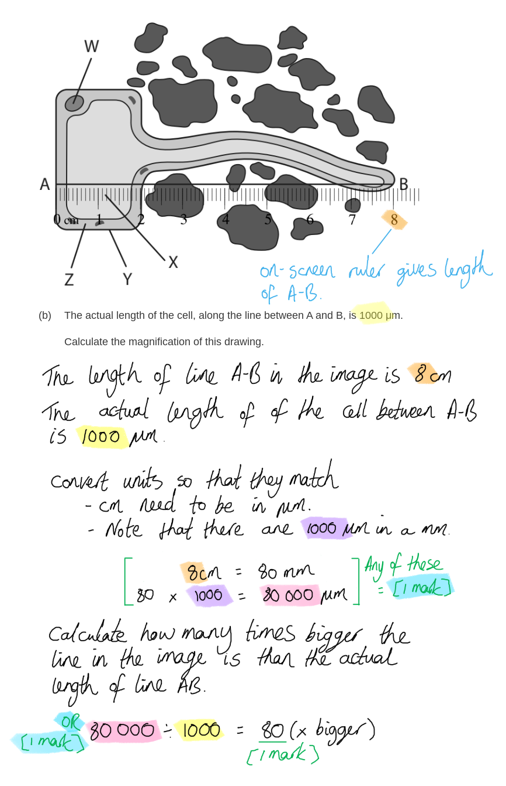

### 3((c)) — 6 marks
(i) The role of the root hair cell in absorption of water from the soil is...

Any **three** of the following:

- (Root hair cells) increase the surface area (of the root); **[1 mark]**
- (Water moves into root hair cells by) osmosis; **[1 mark]**
- There is a lower water potential / higher solute concentration inside the root hair cell (than outside in the soil) **OR** water moves from high to low water potential / low to high solute concentration **OR** there is a water potential / solute concentration gradient between the soil and the root hair cell; **[1 mark]**
- Loss of water from the leaves/stomata sets up the osmotic/water potential gradient (as water is drawn up from the roots to replace water lost from the leaves); **[1 mark]**
- (Water is needed by plants for) photosynthesis / (to maintain) turgor; **[1 mark]**
- (Water allows plants to) transport mineral ions (dissolved in water); **[1 mark]**

(ii) Too much water in the soil around the roots can lead to plants failing to grow properly because...

Any **three** of the following:

- (The plant roots have no/less) oxygen (due to air spaces in the soil being filled with water); **[1 mark]**
- (The cells in the roots cannot carry out / there is no/less) respiration; **[1 mark]**
- (Active transport cannot occur so there is no/less) absorption of minerals / named mineral e.g. nitrates/magnesium; **[1 mark]**
- (This means that there is no/less) nitrates for building amino acids / protein synthesis **OR** magnesium for producing chlorophyll; **[1 mark]**

> *Waterlogged soil can negatively affect the growth of many plants. This is because the spaces in the soil that would normally be filled with air are instead filled with water, reducing the availability of oxygen to the roots. In the absence of oxygen there can be no aerobic respiration, a process that plants roots need to release energy for active transport of minerals into their cells.*

**[Total: 6 marks]**

## Q6 — medium — 7 marks · exam-questions

### 2((a)) — 2 marks
Structures in the bacterium that are also found in eukaryotic cells include...

Any **two** of the following:

- Cytoplasm; **[1 mark]**
- Ribosomes; **[1 mark]**
- Cell membrane; **[1 mark]**
- DNA;** [1 mark]**

**[Total: 2 marks]**

> *You should be able to compare the basic structure of a prokaryotic cell with a eukaryotic cell. Remember that prokaryotes (such as bacteria) do not have membrane-bound organelles such as mitochondria, chloroplasts or a nucleus.*

### 2((b)) — 5 marks
(i) **The correct answer is ****B ****because...**

The fact that chickens die when they are injected with normal *P. multocida *means that the bacteria are pathogens.

**A** is incorrect as it is not possible to conclude that the bacteria are decomposers. Decomposers feed on dead organic matter.

**C** is incorrect as the results do not provide information about the size of the bacteria.

**D** is incorrect as the results do not provide enough information to conclude that the bacteria are non-living.

(ii) The chickens were immune against *P. multocida *because...

Any **four** of the following:

- (The injection with the weakened bacteria served as a) vaccination / (the chickens had been) inoculated (with the weakened bacteria); **[1 mark]**
- (The vaccine/inoculation contained the same) antigens/protein (that were on the normal bacteria); **[1 mark]**
- (When injected with the normal bacteria, it stimulated a) <u>secondary</u> immune response (in the chickens); **[1 mark]**
- (This will stimulate) memory cells; **[1 mark]**
- (Which will make) <u>large numbers</u> of antibodies / produce antibodies <u>fast</u>/<u>soon</u> (after infection with normal bacteria); **[1 mark]**

> *The key to the success of the secondary immune response is the ability of the memory cells to be activated by the pathogen and to quickly produce large numbers of antibodies in response. This provides the immune system with the ability to destroy or contain the pathogen before it gets a chance to multiply in numbers that will cause disease.*

**[Total: 5 marks]**

## Q7 — medium — 10 marks · exam-questions

### 2((a)) — 2 marks
(i)** ****The correct answer is ****D ****because...**

Oxygenated blood from the lungs is returned to the heart by the pulmonary vein, indicated here by the letter D.

**A** is incorrect as it indicates the vena cava which brings deoxygenated blood from the body cells back to the heart.

**B** is incorrect as it indicates the pulmonary artery which transports deoxygenated blood from the heart to the lungs.

**C** is incorrect as it indicates the aorta which transports oxygenated blood away from the heart towards the body cells.

(ii)** ****The correct answer is ****C ****because...**

Blood enters the aorta at a very high pressure (generated by the thick muscular wall of the left ventricle) because it needs to travel around the entire body.

**A** is incorrect as the vena cava returns blood to the heart at low pressure.

**B** is incorrect as the pulmonary arteries will transport blood at relatively low pressure to avoid damage to the delicate capillaries of the lungs.

**D** is incorrect as blood is transported back to the heart via the pulmonary veins at low pressure.

**[Total: 2 marks]**

### 2((b)) — 3 marks
(i) The semi-lunar valves are located as follows...

- A line drawn on the diagram to indicate a set of valves located between the ventricles and the arteries; **[1 mark]**

*Allow other forms of indication of location. *

(ii) The function of the semi-lunar valves includes...

- Preventing the backflow of blood / flow of blood back into heart / ensures one-way flow (of blood); **[1 mark]**
- (from arteries) into <u>ventricle</u>/<u>ventricles</u>; **[1 mark]**

**[Total: 3 marks]**

### 2((c)) — 5 marks
(i) The hole would normally close before the baby is born so that...

- Oxygenated and deoxygenated blood do not mix / as the left hand side (of the heart) now contains oxygenated blood from the lungs; **[1 mark]**
- Oxygenated blood can be pumped around the body / so that deoxygenated blood does not go round the body / so that oxygenated blood does not go to the lungs; **[1 mark]**

(ii) The effect of a hole in the wall separating the two atria on the baby would be...

Any **three** of the following:

- (The baby) may appear blue / lack colour / may not survive / (may experience) shortness of breath; **[1 mark]**
- (This is due to) less oxygen (being transported from the heart to the body) / deoxygenated blood goes/is transported to the body; **[1 mark]**
- (This results in) less/lower rate of (aerobic) respiration; **[1 mark]**
- (Which delivers) less energy/ATP (to the cells); **[1 mark]**

**[Total: 5 marks]**

> *It is very important that oxygenated blood from the left side of the heart does not mix with deoxygenated blood from the right side of the heart as this would decrease the overall oxygen content of the blood reaching the body cells. Oxygen is required for aerobic respiration to occur, releasing energy in the form of ATP that is needed for various processes in the cells. Low levels of oxygen in the blood will impair these processes.*

## Q8 — medium — 11 marks · exam-questions

### 9((a)) — 4 marks
(i) Blood vessels may become blocked because...

- Sickle shaped red blood cells get caught/trapped / stick to each other **OR **Sickle shaped red blood cells get caught/trapped / stick to the walls of blood vessels; **[1 mark]**

(ii) Symptoms may get worse because...

Any **three** of the following:

- Cold temperatures reduce blood flow / cause more sickling (of cells); **[1 mark]**
- There is also less oxygen (at high altitude); **[1 mark]**
- Therefore less (aerobic) respiration / (more) anaerobic respiration; **[1 mark]**
- (Anaerobic respiration releases) more lactic acid (leading to joint pain); **[1 mark]**
- (Less) energy / ATP (leading to feelings of tiredness); **[1 mark]**

**[Total: 4 marks]**

### 9((b)) — 3 marks
(i) Recessive means...

- (The allele is) only expressed when homozygous / there are two copies (of the recessive allele) **OR** (The allele is) only expressed when no dominant allele present **OR** (The allele is) not expressed in heterozygote; **[1 mark]**

(ii) The probability can be calculated as follows...

- 0.75 x 0.5 **OR **3/4 x 1/2; **[1 mark]**
- 0.375 **OR **3/8 **OR **37.5%; **[1 mark]**

*If the answer is incorrect, allow a maximum of ***[1 mark]*** for any of the following shown in the calculations:*

*3**/**4** / 0.75 / 75% ****OR ****1**/**2** / 0.5 / 50%*

**[Total: 3 marks]**

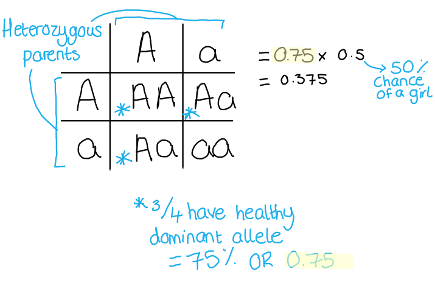

> *Note that this is a **synoptic** question, meaning that this question part addresses content that is not directly related to the transport topic and that is covered later in the specification in the inheritance topic.*

### 9((c)) — 1 marks
**Final answer:** ** The correct answer is**** D****.**

Malaria is caused by a parasitic protist which is carried and spread by mosquitoes.

**A** and** B** are incorrect as they are not pathogens which cause malaria.

**C** is incorrect as it is not a pathogen.

### 9((d)) — 1 marks
**Final answer:** **The correct answer is ****B.**

> *A** is the pigment found in plants which is responsible for absorbing sunlight*

> *C** and **D** are mineral ions*

### 9((e)) — 2 marks
Differences between red and white blood cells include...

Any **two** of the following:

- Red (blood) cells are smaller; **[1 mark]**
- Red cells have no nucleus; **[1 mark]**
- Red cells are biconcave / flattened disk; **[1 mark]**

***Allow**** converse statements for white blood cells*

***Ignore ****references to haemoglobin*

**[Total: 2 marks]**

> *Note that any reference to haemoglobin is ignored as this has been given to you in the thread of an early question subpart (9d).*

## Q9 — medium — 18 marks · exam-questions

### 1((a)) — 1 marks
Cardiomyopathy can cause heart failure because...

- (The heart is) less able to contract / pump / beat; **[1 mark]**

***Allow**** the heart has to work harder to push/pump blood*

**[Total: 1 mark]**

> *This is a suggest question so requires you to apply your knowledge to the given scenario to reach a logical answer (you should not simply repeat wording directly from the passage). The term 'cardiomyopathy' is not one from the specification, however, the information in the text leads you to consider how it might affect the pumping of the heart. *

### 1((b)) — 3 marks
The functions of the atria include...

- To pump/push/move blood into ventricles (from the atria); **[1 mark]**
- To receive deoxygenated blood / blood from body / blood from vena cava; **[1 mark]**
- To receive oxygenated blood / blood from lungs / blood from pulmonary vein; **[1 mark]**

***Allow *****[1 mark]*** for the idea that the atria receive blood, only if no mark is awarded for MP2 or MP3*

**[Total: 3 marks]**

> *Remember that blood returns to the heart in veins and leaves the heart in arteries.*

### 1((c)) — 2 marks
Blood in the pulmonary artery...

Any **two** from the following:

- Is at a low(er) pressure; **[1 mark]**
- Contains a low(er) oxygen (concentration) / less oxygenated blood / more deoxygenated blood; **[1 mark]**
- Contains a high(er) carbon dioxide (concentration); **[1 mark]**

***Allow ****converse statements for the aorta*

**[Total: 2 marks]**

### 1((d)) — 3 marks
The function of the heart-lung bypass machine is...

Any **three** from the following:

The machine mimics lung function because...

- It oxygenates blood / adds oxygen to the blood; **[1 mark]**
- It removes carbon dioxide (from the blood); **[1 mark]**

The machine mimics heart function because...

- It transports/pumps blood around body; **[1 mark]**
- (This therefore enables tissues/cells to) respire; **[1 mark]**
- This then allows surgeon to operate on heart / connect new heart (without tissues dying); **[1 mark]**

**[Total: 3 mark]**

> *You must be specific about the functions required of a heart-lung bypass machine to gain full marks here. It is not enough to simply state that it keeps the patient alive whilst they are having their operation. *

### 1((e)) — 2 marks
Immunosuppressants are required because...

Any **two** from the following:

- It prevents rejection (of the transplanted heart); **[1 mark]**
- (Rejection happens) because antigens (on the cells) are recognised / are different (to the patients cells); **[1 mark]**
- (Immunosuppressants) stop the action of the immune system / reduces immune response / reduces lymphocyte action / stops antibody production / prevents white blood cells activity; **[1 mark]**

**[Total: 2 marks]**

> *All cells have markers on them called antigens, if your white blood cells find a 'non-self' antigen, they will respond in the same way as if it were a pathogen and will try to kill the cells. It is important to stop this if the transplanted organ is going to successfully carry out its function. Immunosuppressants will reduce the likelihood of rejection, but it does come at a cost to the immune system of the patient meaning they may struggle to fight off invading pathogens.*

### 1((f)) — 2 marks
The patient should not smoke because...

Any **two** from the following:

- (Smoking leads to) less oxygen in blood / less efficient gas exchange; **[1 mark]**
- (Smoking also) narrows arteries / damages artery walls / increased risk of fat in artery walls / atheroma / increased risk of heart disease; **[1 mark]**
- Carbon monoxide (from the smoke) binds with haemoglobin / red blood cells; **[1 mark]**
- (Smoking leads to increased risk of) blood clotting / strokes; **[1 mark]**
- (Smoking increases the risk of) higher blood pressure; **[1 mark]**

**[Total: 2 marks]**

> *Specific descriptions of damage caused by smoking must be given to obtain full marks. It is important to keep in mind the theme of the question, this will help you to apply the correct knowledge to the question.*

### 1((g)) — 1 marks
A balanced diet...

- Contains all required nutrients/food groups in the correct proportion/amounts/quantities; **[1 mark]**

***Allow ****contains carbohydrates, protein, fats, vitamins, minerals, fibre (and water) in the right amounts.*

**[Total: 1 mark]**

> *You must have mentioned the required nutrients **and** the correct proportions to obtain this mark.*

### 1((h)) — 2 marks
The number of patients can be calculated as follows...

- (75 x 200) ÷ 100; **[1 mark]**
- = 150; **[1 mark]**

***Allow**** ***[1 mark] ***for use of 75 ****and**** 200*

***Award ****full marks for the correct answer in the absence of calculations*

**[Total: 2 marks]**

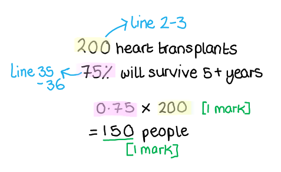

### 1((i)) — 1 marks
(i) Patients are advised to avoid strenuous exercise because...

- (Exercise) puts more pressure on heart / (increased risk of) heart attack / causes heart rate to increase / makes heart beat harder / increases blood pressure;** [1 mark]**

**[Total: 1 mark]**

### 1((j)) — 1 marks
Patients may be more at risk of food poisoning because...

- The immune system is weaker / less able to produce antibodies / less immune response; **[1 mark]**

***Allow**** because they are taking immunosuppressants.*

**[Total: 1 mark]**

## Q10 — medium — 12 marks · exam-questions

### 9((a)) — 2 marks
The word equation for aerobic respiration should include...

- glucose
- carbon dioxide
- water

Award **[2 marks] **for all 3 correctly placed

Award **[1 mark]** for 2 or 1 correctly placed

**[Total: 2 marks]**

> *This question asks for the word equation, although it is possible to gain full marks with the correct chemical formula instead.*

### 9((b)) — 3 marks
The mouse uses more oxygen per gram than a human because...

Any **three** of the following:

- The mouse is smaller / less body mass;** [1 mark]**
- It has a larger surface area to volume ratio; **[1 mark]**
- (Therefore there will be more) heat loss / mice lose heat faster; **[1 mark]**
- (Mice need to) maintain body temperature;** [1 mark]**
- (Therefore more) respiration / higher metabolic rate; **[1 mark]**

**[Total: 3 marks]**

> *A large surface area to volume ratio will result in a larger heat loss than a small surface area to volume ratio. Humans have a larger surface but because their body mass (volume) is also large, the ratio is much smaller compared to that of a mouse. All mammals rely on respiration to release heat energy to maintain optimum body temperatures.*

### 9((c)) — 7 marks
(i) **The correct answer is ****C****...**

X represents the pulmonary vein

The other answers are incorrect because X is not the aorta (A), the pulmonary artery (B) or the vena cava (D)

(ii) One difference between the structure of the frog and the human heart is...

Any **one** of the following:

- The human heart has 4 chambers **OR **frog heart has 3 chambers; **[1 mark]**
- The frog heart has one ventricle **OR** human heart has two ventricles; **[1 mark]**
- There is no septum / no division between ventricles (in the frog) **OR** human has septum ; **[1 mark]**
- The frog artery splits into two / frog only has one artery leaving the heart; **[1 mark]**
- The frog heart has no semi lunar valves; **[1 mark]**

(iii) The frog would be unable to move for long periods of time because...

Any **five** of the following:

- (It has only) one ventricle; **[1 mark]**
- This means that oxygenated and deoxygenated blood mixes / blood from body mixes with blood from lung; **[1 mark]**
- So less deoxygenated blood goes to lungs / some oxygenated blood to lungs; **[1 mark]**
- This results in less efficient gas exchange in lungs; **[1 mark]**
- (The frog heart has) no semi-lunar valves; **[1 mark]**
- So there will be backflow of blood into ventricle; **[1 mark]**
- This means less oxygenated blood to body / some deoxygenated blood to body / less oxygen (to body); **[1 mark]**
- Therefore less respiration / more anaerobic respiration; **[1 mark]**
- Lactic acid accumulation / less ATP made / less energy released ; **[1 mark]**

**[Total: 7 marks]**

## Q11 — medium — 1 marks · exam-questions

### 1() — 1 marks
> **[mark-scheme]**
> One mark for any of the following:
> 
> - White blood cells/phagocytes/lymphocytes
> - Platelets
> - Plasma
> 
> **[1 mark]**

## Q12 — medium — 4 marks · exam-questions

### 1() — 4 marks
> **[mark-scheme]**
> Any four of the following (1 mark each):
> 
> - Genes code for proteins/the HBB gene codes for haemoglobin
> - A mutation changes the structure/amino acid sequence of haemoglobin
> - Abnormal haemoglobin (HbS) is produced
> - The change in protein/haemoglobin structure affects the function of haemoglobin
> - Abnormal haemoglobin/HbS binds less oxygen/forms less oxyhaemoglobin
> - Therefore less oxygen is transported in the blood
> 
> **[4 marks]**

> **[exam-tip]**
> The command word for this question is "suggest". This means you should use your biological knowledge to propose a logical explanation. You should link together ideas about genes, proteins and function.
> 
> Start by remembering that genes code for proteins. A mutation in the HBB gene can change the structure of the haemoglobin protein, which may affect its ability to bind oxygen. If haemoglobin binds less oxygen, less oxygen will be transported in the blood.

## Q13 — medium — 1 marks · exam-questions

### 1() — 1 marks
> **[mark-scheme]**
> The blood vessel that becomes blocked in sickle cell patients:
> 
> - Capillaries/capillary** [1 mark]**

## Q14 — medium — 2 marks · exam-questions

### 1() — 2 marks
Haemoglobin concentration in a sickle cell patient $= 90 \text{g per dm}^{3}$

Blood volume $= 5 \text{dm}^{3}$

Mass of haemoglobin $90 \times 5$$= 450 \text{g}$ **[1 mark]**

**4.5 × 10² g ****[1 mark]**

> **[mark-scheme]**
> 1 mark for correctly multiplying the haemoglobin concentration by the blood volume (90 × 5 = 450 g)
> 
> 1 mark for converting the answer into standard form (4.5 × 10² g)

> **[exam-tip]**
> Remember that standard form expresses a number as $a \times 10^{n}$ where $1 \leq a < 10$. A common mistake is to write 45 × 10¹ instead of 4.5 × 10², which would lose you the final mark. Make sure you also read any data provided earlier in the question carefully — the haemoglobin concentration for a sickle cell anaemia patient may differ from a healthy individual, so check you are using the correct value.

**[2 marks]**

## Q15 — medium — 4 marks · exam-questions

### 1() — 4 marks
> **[mark-scheme]**
> Any four of the following (1 mark each):
> 
> - Cut the shoot underwater (to prevent air entering the xylem)
> - Connect the shoot to the capillary tube (using rubber tubing)
> - Use petroleum jelly to seal rubber and capillary tubes/ensure tubes are airtight
> - Introduce an air bubble into the capillary tube OR lift tube out of water to make an air bubble
> - Measure the distance moved by a bubble over a period of time using capillary tube/ruler
> - Calculate the rate of water uptake by the shoot (distance per minute or volume per minute)
> 
> **[4 marks]**

## Q16 — medium — 1 marks · exam-questions

### 1() — 1 marks
- Original rate of water update = 12 mm3
- Percentage change = +24 %
- Therefore:

- 12 x 1.24 = **14.88/14.9 mm****3** **[1 mark]**

## Q17 — medium — 3 marks · exam-questions

### 1() — 3 marks
> **[mark-scheme]**
> Three of the following:
> 
> - Wind removes water vapour from around the leaf surface
> - This maintains/increases the concentration gradient of water vapour (between the inside and outside of the leaf)
> - Increases rate of diffusion of water vapour out of the leaf
> - Increases transpiration pull/movement of water in xylem
> - Therefore increases the rate of water uptake
> 
> **[3 marks]**

## Q18 — medium — 5 marks · exam-questions

### 1() — 5 marks
> **[mark-scheme]**
> An answer that makes reference to the following points (1 mark each):
> 
> - Reducing light intensity caused a 41% decrease in water uptake
> - Therefore, less water was lost (by transpiration) compared to the original experiment/even less water was lost when half the leaves removed
> - Increasing the wind speed caused the greatest water loss/more water was taken up by the plant when wind speed increased
> - Only one plant used/no repeats
> - Other factors that affect rate of water loss may not have been controlled

## Q19 — medium — 3 marks · exam-questions

### 1() — 3 marks
> **[mark-scheme]**
> Any three from:
> 
> - The vaccine contains antigens from *B. pertussis/*the pathogen **OR** the vaccine contains dead/weakened pathogen
> - (The vaccine) stimulates the mother’s lymphocytes to produce (specific) antibodies
> - The antibodies pass from the mother to the fetus through the placenta
> - The antibodies provide (passive) immunity OR protecting the baby, before its own immune system is fully developed
> 
> **[3 marks]**

## Q20 — medium — 2 marks · exam-questions

### 1() — 2 marks
> **[mark-scheme]**
> Any two from:
> 
> - Antibodies from the mother don’t provide long term immunity **OR** antibodies are short-lived
> - (The baby) needs to make <u>memory cells</u> to have long-lasting immunity/to be able to make antibodies against *B. pertussis*/pathogen in the future
> - Without vaccination, the baby won’t be able to make antibodies against *B. pertussis*/pathogen quickly (so will get ill)
> 
> **[2 marks]**

## Q21 — medium — 2 marks · exam-questions

### 1() — 2 marks
> **[mark-scheme]**
> Stem cells are used in this treatment because:
> 
> - Blood stem cells can differentiate/specialise **OR** body cells cannot differentiate/specialise into other cell types
> - Modified blood stem cells can divide repeatedly/produce many new cells
> 
> **[2 marks]**

> **[exam-tip]**
> The key idea behind this question is that stem cells are unspecialised and can differentiate, meaning one corrected stem cell can produce many healthy red blood cells over time.

## Q22 — medium — 4 marks · exam-questions

### 1() — 4 marks
A one-time treatment could be better because it removes the need for regular blood transfusions and reduces the time that a patient needs to spend in hospital, which could mean the cost of treating patients with gene therapy is lower than using regular treatments. It may provide a long-term solution or even cure, as 24 out of 30 patients were symptom-free after 12 months. However, the study showed that the gene therapy was not effective in all patients, and the long-term effects of gene editing are not yet known which is why it's currently not the best option for treating sickle cell anaemia.

> **[mark-scheme]**
> "Evaluate" requires consideration of both the advantages and limitations of the scientist's conclusion, leading to a supported judgement
> 
> Any four from:
> 
> Reasons supporting the conclusion:
> 
> - Patients who have received the treatment will make fewer hospital visits over their lifetime
> - It is more convenient for patients to have fewer hospital visits / less or no unplanned painful episodes
> - Reduces the need for regular blood transfusions / bone marrow transplants and their side effects
> - The costs long-term for gene therapy may be lower, as less time in / visits to hospital
> - Patients may have a reduced risk of infection, as in hospital less / healthier overall
> - May provide a long-term solution / potential cure
> - 24/30 (or 80%) of patients were symptom-free after 12 months
> 
> Reasons against the conclusion:
> 
> - Long-term effects are currently unknown / it is not known if gene therapy does cure patients
> - May be risky if other genes are accidentally edited
> - May be more expensive than current treatments, especially if it is not a cure
> - Not effective for all patients — 6/30 (or 20%) are not symptom-free
> 
> **[4 marks]**

> **[exam-tip]**
> When asked to "evaluate", you must present arguments both for and against the conclusion before reaching a judgement. A common mistake is to only discuss the positives of the treatment without acknowledging its limitations — this will limit the marks you can achieve. Make sure you use data from the question to support your points where possible, e.g. referring to the 24 out of 30 patients who were symptom-free. Avoid vague statements such as "it might not work" without explaining why.

## Q23 — medium — 3 marks · exam-questions

### 1() — 3 marks
> **[mark-scheme]**
> One mark for each correct row:
> 
> | Substance | Movement into plant cells by | Needed for |
> |---|---|---|
> | Magnesium ions in the soil | active transport | to synthesise/produce chlorophyll |
> | Oxygen in the air around a leaf | diffusion | <u>aerobic</u> respiration |
> | Water in the xylem | osmosis | photosynthesis **OR** to keep cells turgid/prevent wiling |
> 
> **[3 marks]**

## Q24 — hard — 6 marks · exam-questions

### 2((a)) — 2 marks
(i) The number of white blood cells per mm3 in standard form is…

| **Type of cell** | **Number of cells per mm****3** | **Number of cells per mm****3 ****in standard form** |
|---|---|---|
| Red blood cell | 5 000 000 | 5.0 × 106 |
| White blood cell | 6000 | <u>6.0 x 10</u><u>3</u> **[1 mark]** |

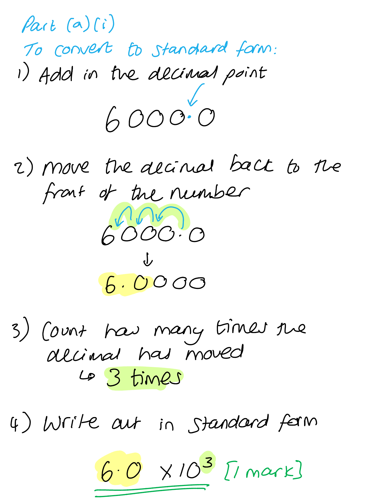

(ii) The correct answer is **D**.* *

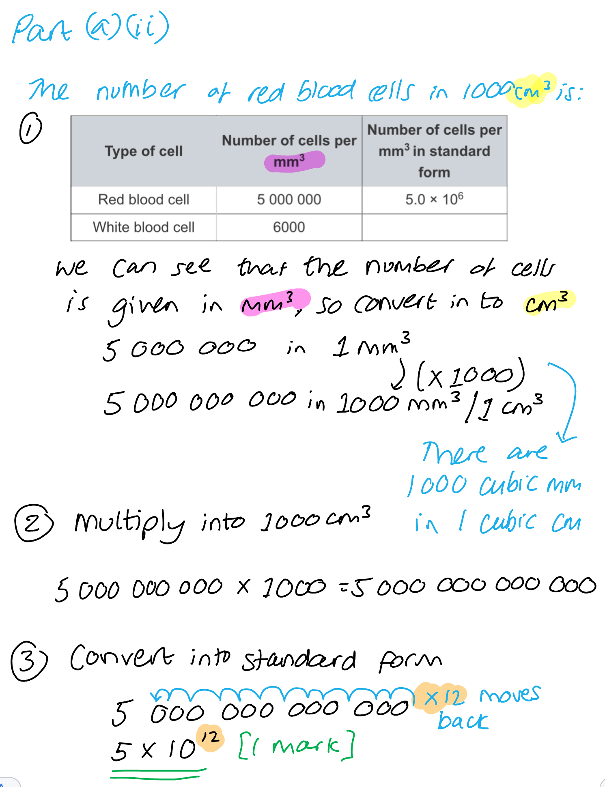

**[Total: 2 marks]**

### 2((b)) — 4 marks
(i) A person with anaemia is often tired because...

Any **two** of the following:

- Less oxygen (is transported);** [1 mark]**
- (Therefore there is) less respiration; **[1 mark]**
- (Therefore there is) less energy / ATP; **[1 mark]**

***Ignore**** references to fewer red blood cells as this information has been provided in the table.*

(ii) A person with leukopenia is more likely to get an infection because...

Any **two** of the following:

- <u>Fewer</u> phagocytes / lymphocytes;** [1 mark]**
- (Therefore there is) less ingestion/phagocytosis/digestion/engulfing; **[1 mark]**
- (So there are) fewer antibodies (to protect against infection); **[1**

***Allow**** less instead of fewer.*

***Ignore**** references to white blood cells where no more detail has been provided, as white blood cells are named in the table.*

***Allow**** fewer antitoxins.*

**[Total: 4 marks]**

## Q25 — hard — 15 marks · exam-questions

### 6((a)) — 1 marks
The role of the cell membrane is to...

- Control the movement (of substances) in/into and out of the cell / only allow certain substances to enter the cell;** [1 mark]**

**[Total: 1 mark]**

### 6((b)) — 2 marks
The area in mm2 of the lumen that is available for blood flow...

- 12.56 **OR** 0.55;** [1 mark]**
- <u>6.9</u>/<u>6.91</u>/<u>6.908</u> (mm2); **[2 marks]**

*Full marks can be awarded for the correct answer in the absence of other calculations.*

**[Total: 2 marks]**

### 6((c)) — 8 marks
(i) A graph for the data given should be as follows:

- **S** y axis is linear and takes up at least half the grid;** [1 mark]**
- **L** labelled bars drawn for each range (of blood cholesterol); **[1 mark]**
- **A1** Y axis labelled "number" (of men); **[1 mark]**
- **A2** X axis labelled "cholesterol concentration in mg/cm3 / mg per cm3 / mg cm-3";** [1 mark]**
- **P** bar heights need to be plotted correctly (to within half of a small square); **[1 mark]**

> *Remember that SLAP stands for:*

- *S - Scale*
- *L - Line (or bars in this case)*
- *A - Axis (there are two axes to think about here and it is good practice to use the labels given in the data table)*
- *P - Points or Plotting (or correct bar heights in this case)*

> *Note that it is not necessary to write the figures on the bars as shown here, but this is a way of showing the examiner that you have plotted the bars to the right heights.*

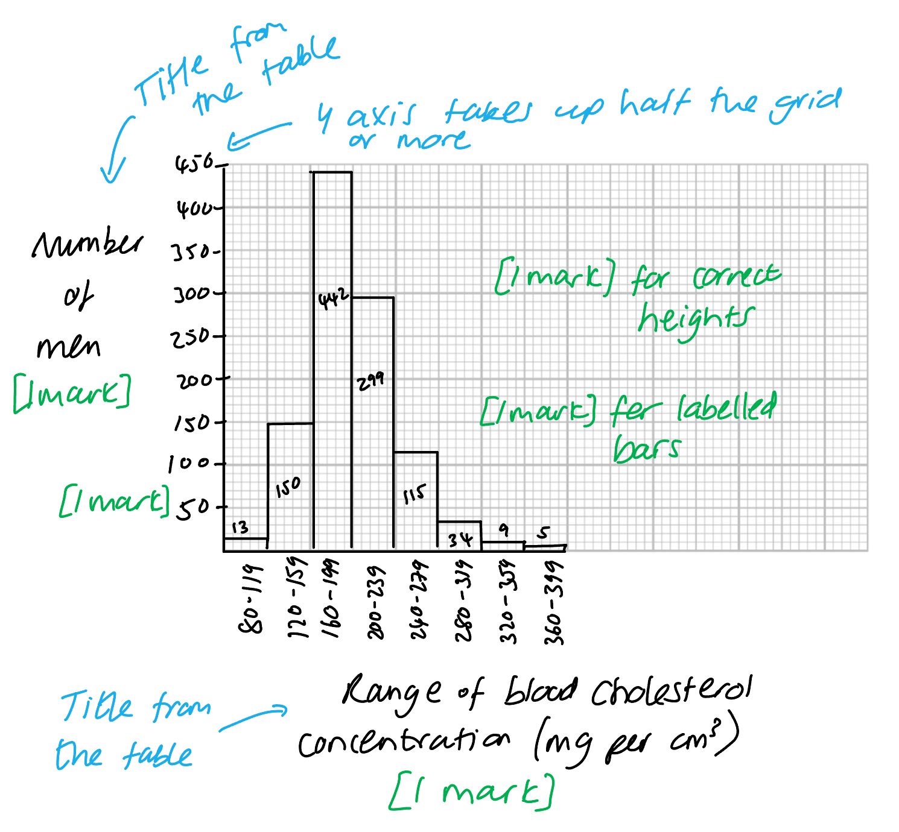

(ii) **The correct answer is ****C ****because...**

The mode is the most frequent value in a data set and the range of 160-199 has the largest number of men.

**A** is incorrect because it does not have the largest number of men.

**B** is incorrect because it is not a range given in the data.

**D **is incorrect because it has the smallest number of men.

(iii) The percentage of men in the sample at a higher risk of heart disease is...

- 163 **OR** (163 ÷ 1067) × 100 **OR **0.153 x 100; **[1 mark]**
- 15.276/15.28/15.3/15; **[1 mark]**

*Full marks can be awarded for the correct answer in the absence of other calculations.*

**[Total: 8 marks]**

### 6((d)) — 4 marks
A discussion for the conclusion is...

Any **four** of the following:

*Points that support the conclusion*

- Statins show lower percentage of / fewer heart attacks;** [1 mark]**

*Points against the conclusion*

- Only one statin was tested; **[1 mark]**
- (The scientist) only tested (the effect of statins) for four years; **[1 mark]**
- The difference could be due to chance; **[1 mark]**
- The groups may have a small size / (there is) no information on group/sample size; **[1 mark]**
- Some (of the people) may have a pre-existing heart condition / high blood pressure (which might affect the results); **[1 mark]**
- The groups may not have the same diet / exercise / stress level / smoking (so these factors might affect the result); **[1 mark]**
- The groups may be different ages / body mass/obesity / have different genes/family history / sex / ethnicity (so these factors might affect the result); **[1 mark]**

***Ignore**** references to repeat experiments for marking point 4.*

***Ignore ****statements such as 'health' or 'lifestyle' for marking points 5-7 as these are too vague.*

**[Total: 4 marks]**

> *Where the command word is "discuss", it is important to write about points that back up the conclusion and points that argue against it. The examiners would expect this as part of your answer and it will help you achieve full marks for this type of question.*

## Q26 — hard — 12 marks · exam-questions

### 3((a)) — 7 marks
(i) The table should be completed as follows...

| **Statement** | **Letter** |
|---|---|
| Contains the least carbon dioxide | A; **[1 mark]** |
| Contains the most glucose after a meal | G; **[1 mark]** |
| Contains the least oxygen | J; **[1 mark]** |
| Contains the least urea | F; **[1 mark]** |
| Contains blood at the highest pressure | B; **[1 mark]** |

(ii) Two ways in which the structure of vessel A differs from vessel J include...

Any **two **of the following:

- (A/the pulmonary vein has) a thinner wall; **[1 mark]**
- <u>Less</u> muscle / thinner muscle layer; **[1 mark]**
- <u>Less</u> elastic tissue / thinner elastic tissue layer; **[1 mark]**
- Wider/bigger lumen; **[1 mark]**

***Accept ****converse points describing J/the pulmonary artery.*

> *Be really clear about which vessel you are referring to in part (ii) to show that you don't have them confused. It is always a good idea to start your sentence with '**A** has a.......' rather than '**It** has a.....'*

**[Total: 7 marks]**

### 3((b)) — 5 marks
This conclusion can be discussed as follows...

Any** five** of the following:

*To support the conclusion*

- (More capillaries means) More oxygen / glucose; **[1 mark]**
- This allows more (aerobic) respiration / less <u>anaerobic </u>respiration; **[1 mark]**
- Therefore more ATP/energy (is released); **[1 mark]**
- So muscles can contract more; **[1 mark]**
- Less lactic acid; **[1 mark]**

*To oppose the conclusion*

- (Increased performance) only for long distance events / ineffective in power events / the study doesn't specify the type of performance / only leg muscle is sampled; **[1 mark]**
- Other factors / age / lung capacity / heart rate / other named factor, affect performance; **[1 mark]**
- More than one person should be tested / the study should be repeated; **[1 mark]**

**[Total: 5 marks]**

> *This conclusion in the question thread is very generalised, it is impossible to say from the data given that training definitely improves athletic performance. However, the data does suggest that training resulted in an increased number of capillaries which would increased the delivery of oxygenated blood and glucose. You are required to apply your knowledge of respiration and exercise in order to explain how this may lead to better performance. *

> *However, to discuss this fully, you should also consider the weakness in the study which means it is not possible to make such a sweeping statement in the conclusion. The study has many weaknesses including the lack of repeats or the limited variables that have been tested.*

> *For mark point 6, there is also a reference to the fact that the results of this study would allow improvements in long distance events (aerobic exercise types) rather than short / power exercises.*

## Q27 — hard — 17 marks · exam-questions

### 1((a)) — 1 marks
The type of cell that produces antibodies is...

- Lymphocyte(s); **[1 mark]**

***Ignore**** references to white blood cells, e.g. a mark can be awarded for the answer 'a type of white blood cell known as a lymphocyte'*

***Reject**** any use of the term phagocyte.*

**[Total: 1 mark]**

> *The term 'white blood cell' is not an incorrect answer but is not enough on its own to gain a mark; remember to always be as specific as possible in your answers.*

### 1((b)) — 2 marks
(i) The term codominant refers to...

Any **one** of the following:

- Both alleles are expressed (in the phenotype); **[1 mark]**
- Both alleles affect/influence the phenotype **OR** the phenotype depends on both alleles; **[1 mark]**
- Both alleles can be seen / are shown in the characteristics/traits (of the organism); **[1 mark]**
- Both alleles work together to produce a third phenotype (beyond just dominant and recessive); **[1 mark]**

(ii)** ****The correct answer is ****D****.**

All four blood groups can be produced when the parents have the genotypes given in the question.

All of the other options contain incomplete lists of the possible offspring genotypes.

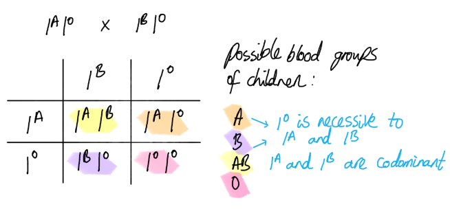

**[Total: 2 marks]**

> *Note that this question part covers content that can be found in the inheritance topic.*

### 1((c)) — 2 marks
The number of blood donations collected per year from the high‐income countries is...

- 47400000 / 47.4 million / 47 million **OR** incorrect standard form that uses the numbers 47(4); **[1 mark]**
- 4.7(4) x 107; **[1 mark]**

*Full marks can be awarded for the correct answer of 4.7(4) x 10**7 **in the absence of other numbers or calculations.*

**[Total: 2 marks]**

> *The calculation here is not very difficult but it is easy to lose marks by forgetting to convert to standard form, or by converting incorrectly. Make sure that you know how to convert numbers to and from standard form.*

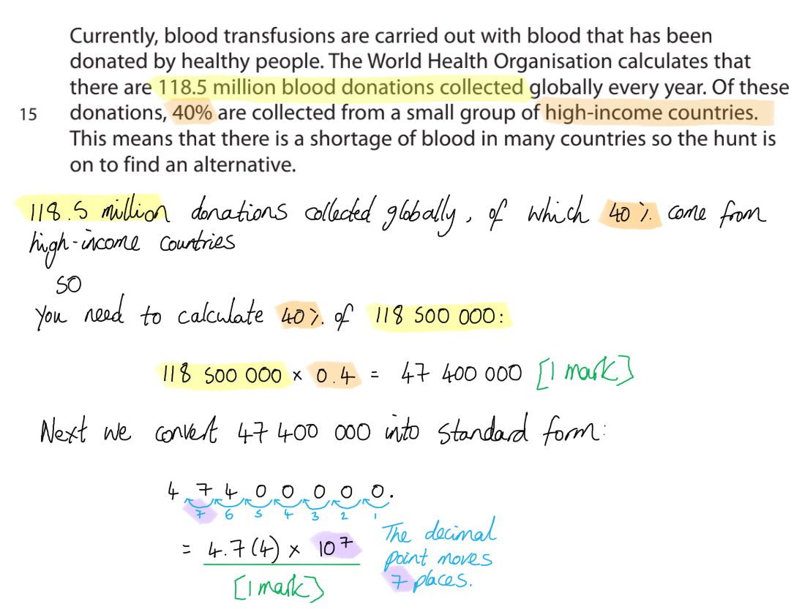

### 1((d)) — 3 marks
The shape of the artificial red blood cells reduces the efficiency of oxygen transport compared to normal human red blood cells because...

Any **three** of the following:

- Red blood cells are / artificial cells are not biconcave (discs); **[1 mark]**
- Red blood cells have a larger / artificial cells have a smaller surface area/SA (:volume ratio); **[1 mark]**
- Red blood cells absorb/bind/release/carry more / artificial cells absorb/bind/release/carry less oxygen; **[1 mark]**
- Red blood cells pass / artificial cells do not pass through capillaries easily; **[1 mark]**

**[Total: 3 marks]**

### 1((e)) — 1 marks
Artificial blood does not clot when stored because...

Any **one** of the following:

- It does not contain / there are no platelets; **[1 mark]**
- It does not contain / there is no fibrinogen; **[1 mark]**

**[Total: 1 mark]**

> *Make sure that you are specific here about the component(s) of blood that are responsible for clotting; it is the platelets that encourage the conversion of fibrinogen into fibrin, leading to the formation of a blood clot. While the blood clot itself will contain red blood cells, these cells would not form a clot were it not for the changes brought about by platelets.*

### 1((f)) — 2 marks
Artificial red blood cells are suspended in sodium chloride solution instead of in water because......

Any **two** of the following:

- There is no/less water uptake / the cells do not take on/in water / there is equal inward and outward movement of water (when cells are in sodium chloride solution); **[1 mark]**
- Due to osmosis / osmotic effects / the lower water potential inside cells (if the cells were suspended in water); **[1 mark]**
- So the cells do not burst; **[1 mark]**

***Accept*** *reverse answers, e.g. 'there would be water uptake if the cells were suspended in water' for marking point 1, or 'there are no osmotic effects when the cells are suspended in sodium chloride' for marking point 2, or 'the cells would burst if they were suspended in water' for marking point 3.*

**[Total: 2 marks]**

### 1((g)) — 4 marks
(i) Stem cells can be used to make large quantities of red blood cells because...

- Stem cells can divide / perform/carry out mitosis; **[1 mark]**
- Stem cells can differentiate/specialise / become any/other cell type(s) / are undifferentiated/unspecialised; **[1 mark]**

(ii) The scientists made red blood cells with blood group O because...

Any **two** of the following:

- No antigens/surface proteins (will be present); **[1 mark]**
- So there will be no antibodies produced / immune response / rejection (of new blood cells); **[1 mark]**
- Any/more people / blood group A/B/AB can receive blood group O **OR** blood group O is a universal donor; **[1 mark]**

> *When describing the proteins on the surface of red blood cells be careful not to mix up antigens and antibodies. Anti**gens** are proteins found on the surface of red blood cells, while anti**bodies** are produced by white blood cells in response to non-self antigens.*

**[Total: 4 marks]**

### 1((h)) — 2 marks
Substances found in blood plasma that are not present in the artificial blood include...

Any **two** of the following:

- Urea; **[1 mark]**
- Digested food / named example of digested food, e.g. amino acids / glucose / fatty acids / LDLs;
- Carbon dioxide; **[1 mark]**
- Hormone / named hormone, e.g. insulin / glucagon / adrenaline / oestrogen / testosterone / progesterone / ADH / LH / FSH / thyroxine; **[1 mark]**
- Minerals / named mineral / ions, e.g. calcium/magnesium/potassium / vitamins; **[1 mark]**
- Proteins / clotting factors/fibrinogen / antibodies; **[1 mark]**

*Do not accept sodium or sodium chloride as a named mineral/ion for marking point 5 as this has already been given in part f)*

**[Total: 2 marks]**

> *Be sure to name substances that are found dissolved in the blood plasma; other blood components such as red blood cells and platelets will not be credited here.*

## Q28 — hard — 17 marks · exam-questions

### 1((a)) — 1 marks
**Final answer:** **The correct answer is ****C****,**** ****ultrafiltration.**

**A **is incorrect because digestion is not a process in the kidneys, it takes place in the organs of the digestive system.

**B** is incorrect because mutation is not a process in the kidneys, it takes place in cells at a molecular level within strands of DNA.

**D** is incorrect because vaccination is not a process in the kidneys, it is a human intervention to prevent the spread of infectious disease.

**[Total: 1 mark]**

> *Content relating to the kidneys can be found in the excretion topic.*

### 1((b)) — 3 marks
Three ways to reduce the risk of being infected by schistosomes are as follows...

Any** three **of the following:

- Stay out of water / wear waterproof clothes / do not go in infected rivers or lakes / cover skin when in water / avoid contact with affected water / only wash in clean water; **[1 mark]**
- Treat drinking water / boil water (before drinking) / do not drink water / drink bottled water / filter water / do not drink river water / lake water; **[1 mark]**
- Sanitation / no faeces in water / no urine in water / use sewage treatment system / use toilet with septic tank; **[1 mark]**
- Remove snails / don’t touch snails; **[1 mark]**
- Vaccination; **[1 mark]**

**[Total: 3 marks]**

> *You should always try to give distinctly **different points **when asked for more than one point.*

### 1((c)) — 2 marks
Two different blood cells that would be found in the urine of infected people are...

Any **two** of the following:

- Red blood cells / rbc; **[1 mark]**
- White blood cells / wbc; **[1 mark]**
- Lymphocytes; **[1 mark]**
- Phagocytes / macrophages; **[1 mark]**

**[Total: 2 marks]**

> *If a question like this asks you to give a list of two items, resist the temptation to list more than two, as a wrong answer may contradict a correct one that you've also made. This would cause a loss of marks. *

### 1((d)) — 1 marks
The correct dose of drugs that would be effective for a person of body mass 120kg would be...

- 4 800 mg; **[1 mark]**

**[Total: 1 mark]**

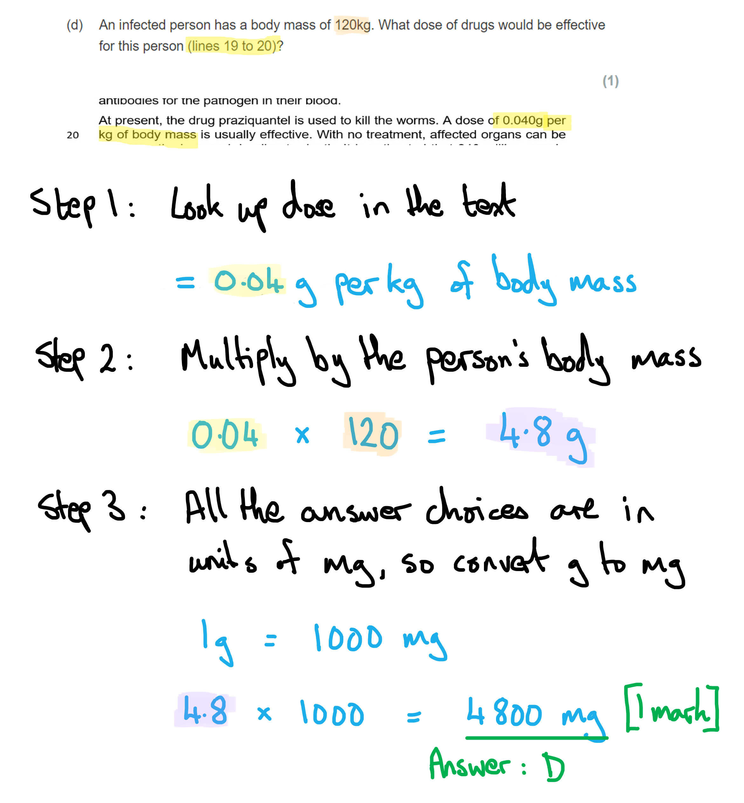

### 1((e)) — 2 marks
The number of people who die each year from schistosomiasis is calculated as follows...

- 8 x 10-4 = 0.0008; **[1 mark]**
- x 240 million = 192 000 ÷ 100 = 1 920; **[1 mark]**

**OR **a maximum of **[1 mark]** for:

- 19 200 000 / 1 920 000 / 192 000 / 19 200 / 192 / 19.2 / 1.92 / 0.192 / 0.0192; **[1 mark]**

*Award full marks for correct numerical answer without working.*

**Final answer:** **[Total: 2 marks]**

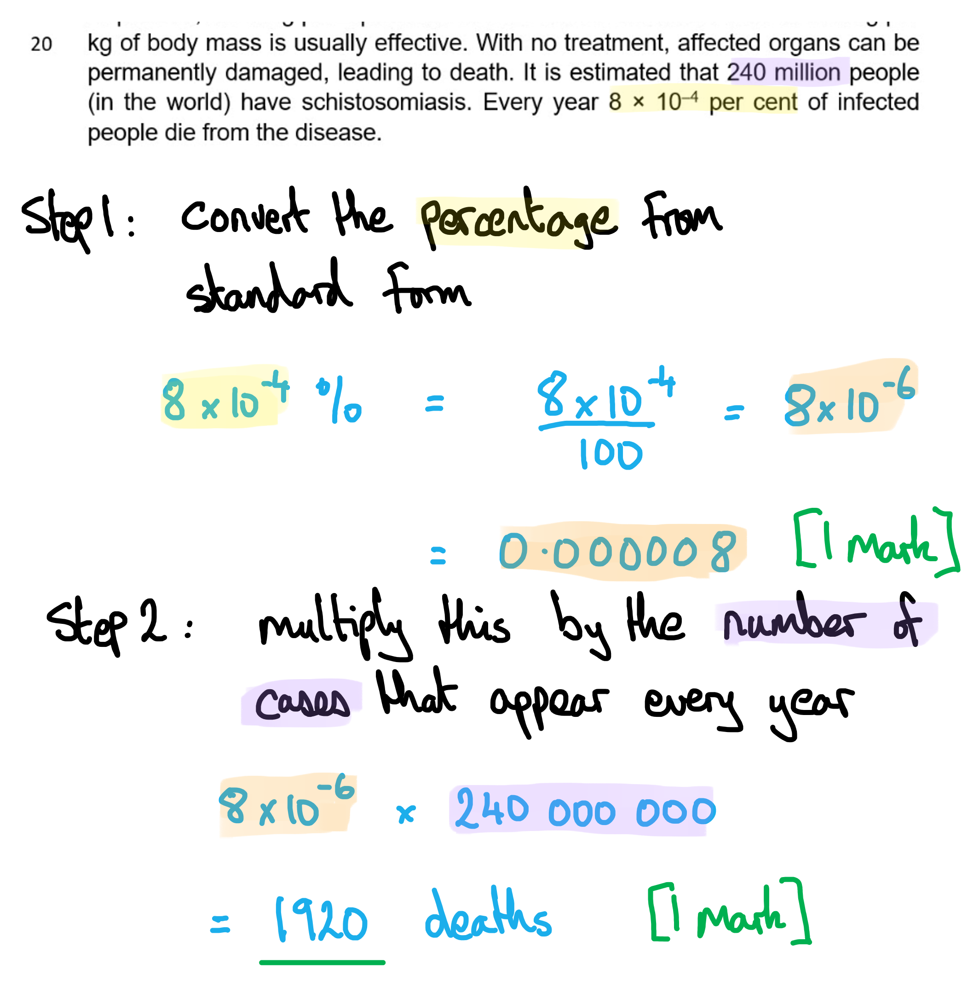

### 1((f)) — 1 marks
**Final answer:** **The correct answer is ****A**** (a circle of DNA) because...**

A plasmid forms part of the bacterial genome, even though it's situated away from the main loop of DNA that the bacterium possesses.

The other answers are incorrect because they do not form circular loops. mRNA is a straight-chain molecule with distinct ends, protein forms into all kinds of shapes but not circles, and tRNA also has a distinct shape with 2 definite ends.

**[Total: 1 mark]**

### 1((g)) — 3 marks
A vaccine could protect people from schistosomiasis as follows...

Any **three** of the following:

- The vaccine contains an antigen/antigens; **[1 mark]**
- Which allows the immune system to create memory cells / lymphocytes; **[1 mark]**
- (Which can cause) the secondary) immune response; **[1 mark]**
- There will be more antibodies / antibodies will be made sooner / faster / faster immune response; **[1 mark]**

**[Total: 3 marks]**

> *You should always mention that the production of antibodies during the secondary immune response is faster, sooner and in higher quantities than in a primary immune response.*

### 1((h)) — 4 marks
(i) The control group could have been given the following...

Any **one** of the following:

- (A treatment with) no plasmid / no protein / only water / saline; **[1 mark]**
- A placebo vaccine / a placebo / plasmid with no gene / plasmid with no DNA / different DNA; **[1 mark]**

> *The point of a control group is to give recipients in that group everything that the people receiving the drug receive, **except for the drug molecule itself**. This means that any effects observed in the drug-receiving group can be associated with the drug and not with some other element of the drug formulation or method of delivery. The control group would be expected to show zero response to the placebo, if the drug is the cause of any therapeutic benefits seen in the other group. *

(ii) Comments on whether the investigation proves the vaccine is effective against schistosomiasis are as follows...

Any** three** of the following:

- The drug reduced numbers of sufferers / reduces numbers of worms / worms decrease / lower number of worms after vaccine / more worms in the control group; **[1 mark]**
- ...by 19 / by 47% / about 50%; **[1 mark]**
- Schistosomes / worms are still present / treatment does not completely get rid of them; **[1 mark]**
- We have no idea of group size for this study / study needs to be repeated / more testing / more people tested; **[1 mark]**
- We have no idea of age / sex / health of the participants; **[1 mark]**

> *When the question command word is 'Comment on...', remember to give arguments **for and against** a claim of this kind in order to access all the available marks*

**[Total: 4 marks]**

## Q29 — hard — 11 marks · exam-questions

### 2((a)) — 5 marks
(i) The changes in the rate of evaporation from the clay pot can be explained as follows...

Any **two** of the following:

- (The rate of evaporation would be) higher when the temperature increases **OR** lower when the temperature decreases; **[1 mark]**
- (This is due to) more (kinetic) energy of the water molecules/particles **OR** the water molecules/particles would have less (kinetic) energy (at lower temperatures); **[1 mark]**
- (This will result in) increased diffusion / more liquid become gas **OR** (this will results in decreased diffusion / less liquid become gas; **[1 mark]**

(ii) The student could measure the rate of evaporation from the clay pot in the following ways...

Any **three** of the following:

- Use the scale on a beaker/tube/ruler; **[1 mark]**
- (Measure the) volume/mass of water lost from the beaker / level of water in beaker / distance moved by bubble; **[1 mark]**
- Use a clock / measure the time / stated time; **[1 mark]**
- (To calculate the rate of evaporation) divide the volume/distance by the time; **[1 mark]**

*Ignore mention of weighing the clay pot for marking point 2.*

**[Total: 5 marks]**

> *You should apply your knowledge of how to use a bubble/mass potometer to calculate the rate of transpiration to this scenario as the method would be similar.*

### 2((b)) — 6 marks
(i) A factor that affects transpiration from the plant but not evaporation from the clay pot is...

- Light (intensity) / carbon dioxide / turgor (pressure); **[1 mark]**
- Affects the stomata opening / (turgidity of the) guard cells; **[1 mark]**

(ii) The mark allocation for the diagram would be as follows...

*Bubble potometer *

Any **four** of the following:

- Plant; **[1 mark]**
- Capillary tube; **[1 mark]**
- With bubble / drop of liquid / meniscus; **[1 mark]**
- Seal / petroleum jelly / cork/bung (to prevent water loss from potometer); **[1 mark]**
- Scale / ruler (for measuring distance moved by the bubble); **[1 mark]**

*Do not award marks for diagrams without labels.*

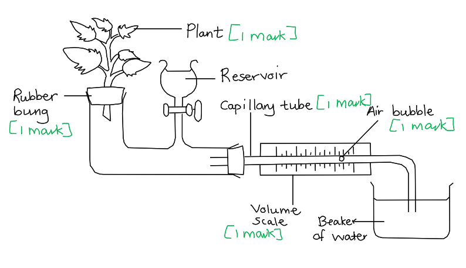

**OR**

*Mass potometer*

- Plant; **[1 mark]**
- Pot with soil **OR** glass container with water; **[1 mark]**
- Method to avoid soil water loss e.g. polythene / bung / layer of oil; **[1 mark]**
- Weighing scales; **[1 mark]**

*Do not award marks for diagrams without labels.*

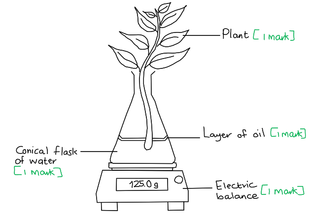

**[Total: 6 marks]**

> *For this question you could have drawn either a bubble or mass potometer, just don't forget to label your diagram as failure to do so would have resulted in no marks at all.*

## Q30 — hard — 3 marks · exam-questions

### 1() — 3 marks
> **[mark-scheme]**
> The correct answers are:
> 
> **X **- aorta **[1 mark]**
> 
> **Y** - hepatic portal vein **[1 mark]**
> 
> **Z** - renal artery **[1 mark]**

## Q31 — hard — 3 marks · exam-questions

### 1() — 3 marks
> **[mark-scheme]**
> Any **three** from (1 mark each):
> 
> - Deposits in the coronary artery restrict/reduce blood flow to the heart muscle (or narrow the diameter of the artery)
> - The coronary arteries transport blood to the heart muscle
> - (The deposits) reduce the volume of oxygen that is transported to the heart muscle
> - Less oxygen (in the heart muscle) reduces the amount of aerobic respiration that can occur
> - (Less oxygen) may cause the heart muscle cells to stop contracting properly/cause a  heart attack
> - (Less oxygen) can lead to angina (chest pain)
> 
> **[3 marks]**

## Q32 — hard — 5 marks · exam-questions

### 1() — 5 marks
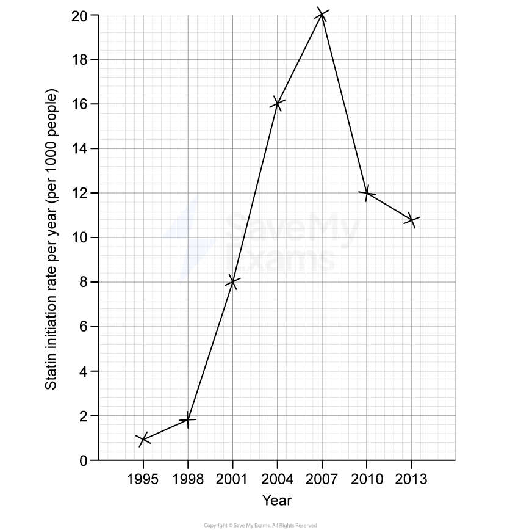

**[5 marks]**

> **[mark-scheme]**
> Five marks are available for the following criteria:
> 
> - S — Scales are linear and use at least half the page/allocated graph space **[1 mark]**
> - A — The x-axis is labelled with year **[1 mark]**
> - U — The y-axis includes units: per year (per 1000 people) **[1 mark]**
> - P — All points are accurately plotted **[1 mark]**
> - L — Straight lines are drawn through the points using a ruler **[1 mark]**

> **[exam-tip]**
> When plotting a line graph, always start by choosing sensible scales that spread the data across the available space — do not squash all the points into one corner. Make sure both axes are clearly labelled with the variable name and the correct units. Plot each point carefully using a sharp pencil and a small cross (×), then use a ruler to join consecutive points with straight lines. Many students miss marks by drawing freehand lines or by forgetting to include units on the y-axis. Double-check each plotted point against the table before moving on.

**[5 marks]**

## Q33 — hard — 5 marks · exam-questions

### 1() — 5 marks
> **[mark-scheme]**
> Five marks are available for the following points (1 mark each):
> 
> - The number of deaths from CHD/CHD mortality has declined in both males and females
> - Death rates are (consistently) higher in males than females
> - Increase in statin use/initiation rate may have contributed to fall in CHD mortality
> - Statins reduced cholesterol, lowering CHD risk
> - Statin initiation rate/use peaks in 2007 and then declines
> - CHD mortality continues to fall beyond this date
> - Data may still show a correlation as individuals stay on statins for life/individuals are only counted in the data when statins first prescribed to them
> - No information on sample sizes / only one country / only UK data
> - Statin initiation rate is not separated by sex but mortality is
> - CHD has other risks factors like genetics /stress/exercise/diet OR other factors may have influenced mortality
> 
> **[5 marks]**

> **[exam-tip]**
> The command word in this question is **“comment on.”**
> 
> This means you must do more than simply describe trends. A “comment on” question requires you to:
> 
> - Identify patterns in the data
> - Use figures to support your points
> - Link the different sets of information together
> - Make a judgement
> 
> In this question, that means you should:
> 
> - Describe how CHD mortality changes over time
> - Refer to how statin prescriptions change
> - Link the two trends together
> - Include a judgement about whether the increase in statin use may be related to the decrease in CHD deaths
> 
> A strong answer will recognise that the data show a correlation, but that this does not prove statins were the only cause of the decline.

## Q34 — hard — 3 marks · exam-questions

### 1() — 3 marks
> **[mark-scheme]**
> Any **three** from:
> 
> - Humans are multicellular organisms
> - Multicellular organisms have a relatively low surface area to volume ratio (compared to single celled organisms)
> - (Multicellular organisms) cannot rely on diffusion alone (across (outer) surfaces) to obtain the substances they need/to remove waste products from cells OR diffusion would be insufficient to meet the demands of cells
> - The circulatory system transports substances (glucose/oxygen/carbon dioxide/urea) around the body
> - The circulatory system maintains a steep concentration gradient between exchange surfaces and the blood
> 
> **[3 marks]**

> **[exam-tip]**
> Humans are multicellular organisms. As a **cell** or **organism** **increases** in size, its **surface area to volume ratio decreases **which means there is less surface area available for each unit of volume, so diffusion alone becomes less efficient/insufficient at supplying cells/organisms with essential substances and removing waste products. This is why transport systems like the circulatory system have evolved.
