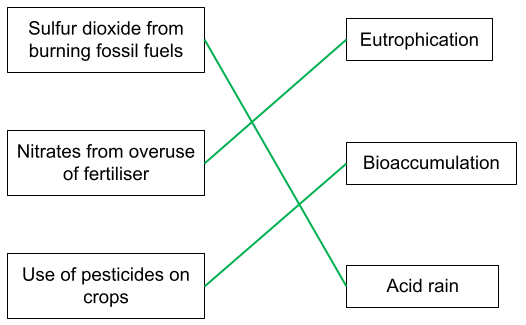
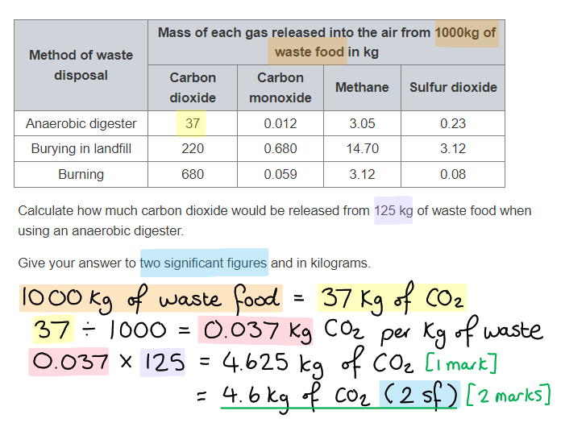
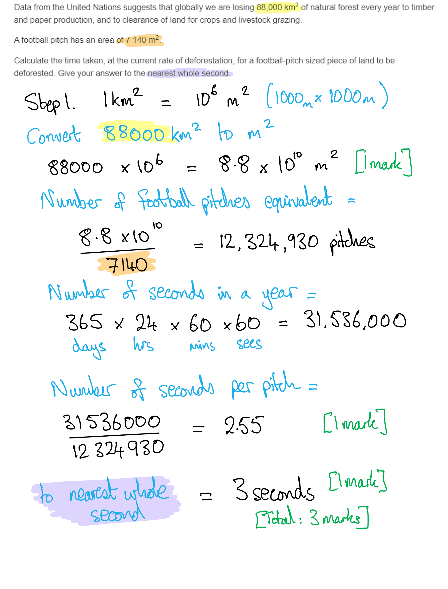
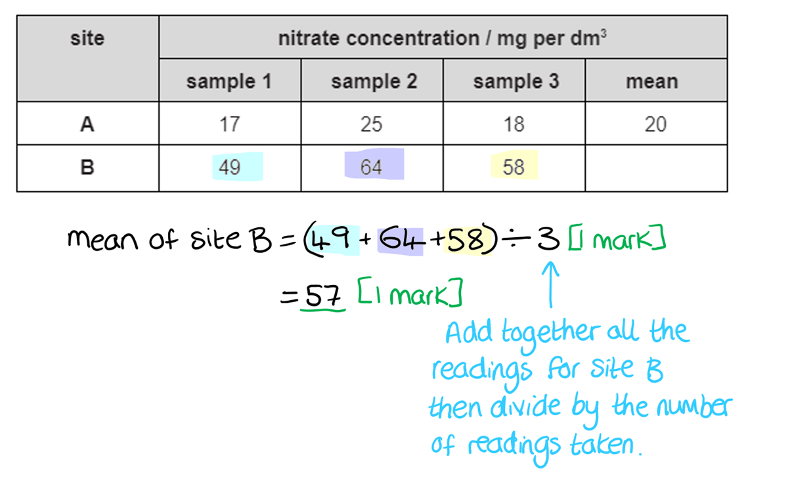
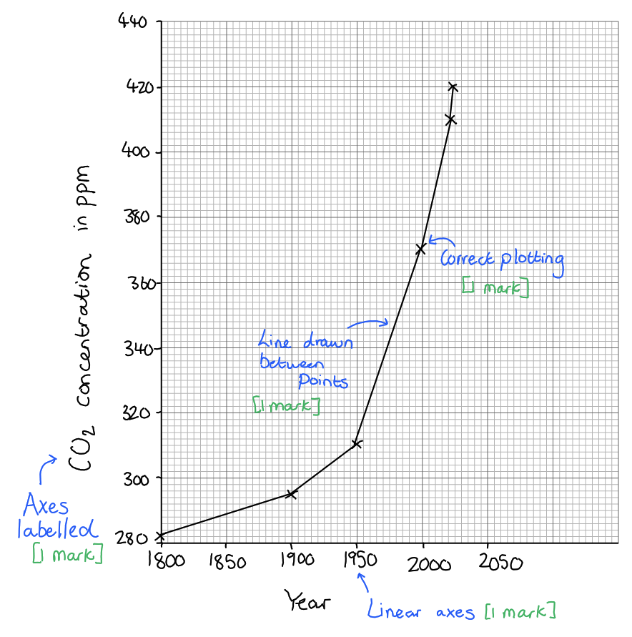
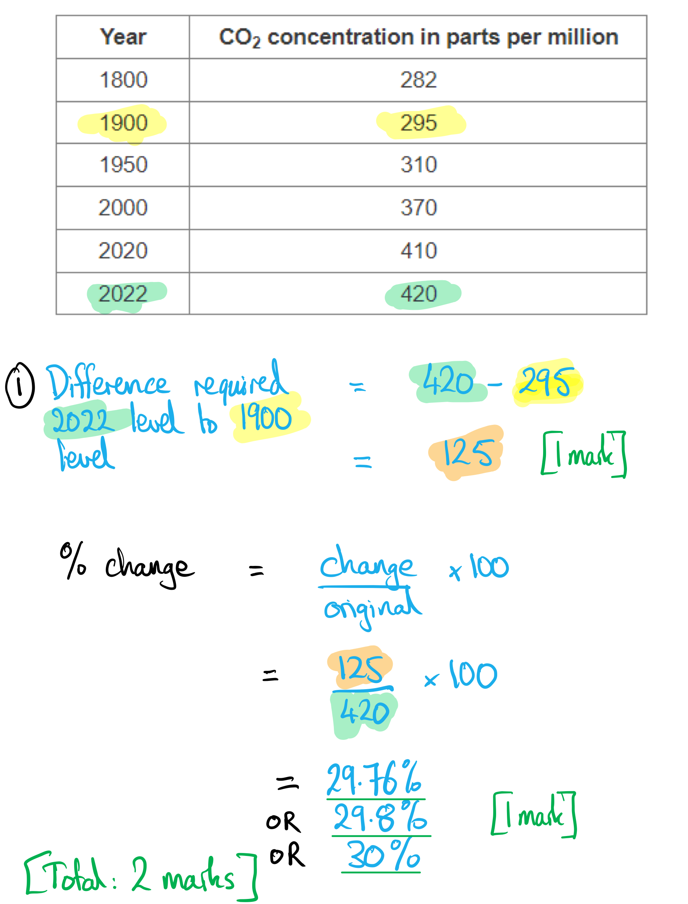

# Mark Schemes — Human Influences on the Environment
**4. Ecology & the Environment** · Edexcel IGCSE Biology (4BI1)

## Q1 — easy — 8 marks · exam-questions

### 1() — 1 marks
**Final answer:** **The correct answer is A because...**

** **As all three named factors increase, it puts pressure on the Earth's resources and means that more waste is produced.

Waste can take many forms; body waste eg. urine, faeces, CO2, and also the waste that we generate through our activities e.g. plastic, landfill, waste food, polluted land etc.

**[Total: 1 mark]**

### 2() — 2 marks
Ways in which pollution can reduce biodiversity are...

Any **two** from the following:

- Toxicity / poisoning species; **[1 mark]**
- Toxic substances accumulating / bioaccumulation in organisms / being magnified through food chains;** [1 mark]**
- Causing one species to thrive (at the expense of others) eg. eutrophication; **[1 mark]**
- Stripping out an abiotic factor eg. oxygen, light;** [1 mark]**
- By taking up space eg. landfill sites / sewage treatment works; **[1 mark]**

**[Total: 2 marks]**

### 3() — 2 marks
Join each pollutant with a straight line to the effect that it creates, as follows:

- All 3 lines correct: **[2 marks]**
- 1 or 2 lines correct;** [1 mark]**

**[Total: 2 marks]**

### 4() — 2 marks
The concentration of the pesticide in the fish's gills is as follows:

- 877 × 9.75 million / 9 750 000 = 8 550 750 000 ppb; **[1 mark]**
- 8.55×109 / 8.6×109 / 9×109; **[1 mark]**

*Correct answer, not expressed in standard form = ***[1 mark]**

**[Total: 2 marks]**

**Final answer:** ** **

### 5() — 1 marks
Biomagnification differs from bioaccumulation by...

- (Bioaccumulation measures the level of a toxic compound) through an organism's life / lifespan; **[1 mark]**

**[Total: 1 mark]**

## Q2 — easy — 6 marks · exam-questions

### 1() — 2 marks
Two reasons why deforestation is contributing to an increase in atmospheric CO2 levels are:

Any** two** from the following:

- (Fewer trees mean) less photosynthesis, so less CO2 being removed/locked up by trees; **[1 mark]**
- Trees being burned means (more CO2 being emitted/released into the air); **[1 mark]**
- Microorganisms feeding on rotting wood release CO2; **[1 mark]**

**[Total: 2 marks]**

### 2() — 1 marks
**Final answer:** **The correct answer is ****C.**

Fossil fuels are not being regenerated, and certainly not at a rate that anywhere matches the rate at which they have been depleted in the last 150 years.

**A**, **B** and **D** are all well-documented effects of global warming that are happening now to a greater or lesser extent.

**[Total: 1 mark]**

### 3() — 2 marks
The action that carbon dioxide (CO2) and methane (CH4) both have on the atmosphere that causes them to be greenhouses gases is...

- As <u>insulators</u>; **[1 mark]**
- They trap heat / prevent heat leaving earth to space;** [1 mark]**

**[Total: 2 marks]**

### 4() — 1 marks
One other greenhouse gas is...

Any **one **of the following:

- Water vapour
- Nitrous oxides
- CFCs

**[Total: 1 mark]**

## Q3 — easy — 8 marks · exam-questions

### 1() — 3 marks
The correct order is...

| **Stage of Eutrophication** | **Order** |
|---|---|
| Algal bloom prevents sunlight from reaching aquatic plants. Water oxygen levels fall | **Final answer:** **4** |
| Excessive nutrients from fertilisers run-off from the land into the water | **Final answer:** **1** |
| Algae also show rapid growth | **Final answer:** **3** |
| Death of organisms requiring dissolved oxygen in water | **Final answer:** **6** |
| Decomposition rate increases. Aerobic respiration of decomposers reduces dissolved oxygen further | **Final answer:** **5** |
| Aquatic plants flourish, growing rapidly | **Final answer:** **2** |

** ****Award ****[3 marks] **for all numbers correct ** **
**Award** **[2 marks] **for 4-5 numbers correct** **
**Award** **[1 mark] **for 2-3 numbers correct

**[Total: 3 marks]**

### 2() — 2 marks
Another consequence of sewage in the water is...

- Sewage contains pathogens / pathogenic bacteria; **[1 mark]**
- Which can cause disease; **[1 mark]**

**[Total: 2 marks]**

### 3() — 3 marks
(i) The gaps should be completed as follows:

- Glucose + oxygen → carbon dixoide + water; **[2 marks]**

**[1 mark] ***for the correct reactants ***[1 mark] ***for the correct products*

(ii) One process which requires energy might include:

Any **one **of the following:

- Active transport (transports digested nutrients into the cells); **[1 mark]**
- Protein synthesis (creates digestive enzymes to be secreted); **[1 mark]**

**[Total: 3 marks]**

## Q4 — easy — 8 marks · exam-questions

### 1() — 3 marks
The biological consequences of air pollution by sulfur dioxide is...

Any **three **of the following:

- Sulfur dioxide released dissolves in water; **[1 mark]**
- And forms sulfuric acid; **[1 mark]**
- Acid rain occurs; **[1 mark]**
- Which causes damage to plants / deforestation; **[1 mark]**
- Breathing problems for humans / animals; **[1 mark]**
- Death of fish / aquatic organisms; **[1 mark]**

**[Total: 3 marks]**

### 2() — 1 marks
Sulfur dioxide pollution can be reduced by...

Any **one **of the following:

- Less burning / use of fossil fuels / named fossil fuel; **[1 mark]**
- Named example of alternative to using fossil fuels e.g. use public transport / use wind power / cycling etc.; **[1 mark]**

**[Total: 1 mark]**

### 3() — 4 marks
(i) Carbon monoxide is...

- **Not** a greenhouse gas; **[1 mark]**
- It does not contribute to / cause global warming / warming of the atmosphere / (enhanced) greenhouse effect; **[1 mark]**

(ii) Carbon monoxide is a harmful air pollutant because...

- Attaches to haemoglobin; **[1 mark]**
- Therefore less oxygen transport (in the blood); **[1 mark]**

**[Total: 4 marks]**

> *You learned about carbon monoxide in the 'gas exchange' topic. Remember that exam questions often ask you to draw information from different parts of the course. *

## Q5 — medium — 7 marks · exam-questions

### 9((a)) — 2 marks
The amount of carbon dioxide released from 125 kg of waste food using an anaerobic digester is...

- 0.037 **OR** 4.625 **OR **4.63; **[1 mark]**
- 4.6 (kg); **[1 mark]**

*Full marks can be awarded for the correct answer in the absence of other calculations.*

**[Total: 2 marks]**

> *4.625 or 4.63 can only be awarded 1 mark because the answer has not been given to** two significant figures**. *

### 9((b)) — 5 marks
An evaluation of whether anaerobic digesters are the most environmentally friendly method of waste disposal is...

Any **five **of the following:

*Agreement:*

- (Anaerobic digesters) release less CO2 / methane; **[1 mark]**
- Release less CO; **[1 mark]**
- (Because less CO2 / less methane) there is less greenhouse effect/global warming; **[1 mark]**
- So less ice cap melting / habitat loss / climate change / flooding / coral reef damage / ocean acidification / extreme weather / desertification / other named effect of climate change; **[1 mark]**
- (Because less carbon monoxide is released there is) less damage to haemoglobin; **[1 mark]**
- (Less haemoglobin damage means that) there is less effect on oxygen transport; **[1 mark]**

*Disagreement:*

- Anaerobic digesters release more sulfur dioxide; **[1 mark]**
- (Sulfur dioxide causes) acid rain; **[1 mark]**
- (Acid rain) causes deforestation / kills fish in lakes / other named effect of acid rain; **[1 mark]**

**[Total: 5 marks]**

> *When evaluating you must always discuss points both **for and against **the statement made in the question. *

## Q6 — medium — 9 marks · exam-questions

### 10((a)) — 4 marks
Chemical fertilisers can increase crop yield as follows...

Any **four** of the following:

- (Fertilisers contain) nitrates (for growth);** [1 mark]**
- (Nitrates are) used to make/build/produce amino acids; **[1 mark]**
- Plants can use (amino acids) to make protein;** [1 mark]**
- (Fertilisers contain) magnesium for chlorophyll/chloroplasts; **[1 mark]**
- (Chloroplasts) allow more photosynthesis to take place; **[1 mark]**
- (Photosynthesis) produces more glucose; **[1 mark]**
- (Fertilisers contain) phosphates which are used for ATP / DNA;** [1 mark]**
- (Fertilisers contain) potassium which is used for control of water movement; **[1 mark]**

**[Total: 4 marks]**

> *In an extended response question like this, the marking points all link together. For example, you could state that fertilisers contain nitrogen, which the plant needs to manufacture amino acids which in turn are needed for proteins. Use short sentences linked with words such as Consequently..., As a result..., This causes... etc. to link your points together. *

> *A common pitfall in this question is to write vaguely about fertilisers in general, whereas the examiners require a focus on the main constituent of fertilisers and how each affects plant growth. It is always a good idea to quote the specific examples that are quoted in the specification, such as nitrates, magnesium and chlorophyll. *

### 10((b)) — 4 marks
The scientist's conclusion that the use of fertiliser in the field has affected the oxygen content of the river can be discussed as follows...

Any **four** of the following:

- Fertiliser leaches/washes into the river; **[1 mark]**
- Fertiliser would cause algal/plant growth / algal bloom / eutrophication; **[1 mark]**
- Dead algae are decomposed/broken down by bacteria/decomposers ; **[1 mark]**
- (Bacterial) respiration would reduce the level of (dissolved) oxygen (in the river water); **[1 mark]**
- Means were calculated (by the scientist) / readings were repeated **SO** the experiment is <u>reliable</u> / <u>valid</u>; **[1 mark]**
- Measurements were taken at the same time of year / in April (so are comparable/valid); **[1 mark]**
- The direction of the river is past the farm; **[1 mark]**
- The reduced oxygen level could be due to other factors / sources of fertiliser from other fields; **[1 mark]**

**[Total: 4 marks]**

> *For this kind of question, a bit of detective work is required to find the clues hidden among the introductory text at the top of the page. For example, a mark can be awarded for acknowledging that the scientist took many readings and calculated a mean, but the word 'mean' is easy to miss if you only read through the question text once (or if you only skim-read it, or don't read it at all!). The trick is to keep referring back to the introductory text and to pick out the small details that can assist your critique of the scientists' conclusion. *

### 10((c)) — 1 marks
One alternative substance (to fertilisers) that a farmer may use is...

Any** one** of the following:

- Manure/faeces/dung/animal waste; **[1 mark]**
- Compost; **[1 mark]**
- Seaweed; **[1 mark]**
- Bone / blood; **[1 mark]**

**[Total: 1 mark]**

## Q7 — medium — 9 marks · exam-questions

### 1() — 2 marks
Two ways in which deforestation impact biodiversity negatively are...

Any **two **of the following:

- Loss of plant species due to clearing (of forest); **[1 mark]**
- Loss of food sources / disruption to the food chain;** [1 mark]**
- Loss of habitat;** [1 mark]**
- Smaller populations become less likely to survive as they are more vulnerable; **[1 mark]**

**[Total: 2 marks]**

### 2() — 3 marks
The time taken, at the current rate of deforestation, for a football-pitch sized piece of land to be deforested is...

- 3 seconds; **[3 marks]**
- 2.55 or 2.6 seconds; **[2 marks]**
- 88 000 km2 = 8.8 × 1010 m2; **[1 mark]**

**[Total: 3 marks]**

> *A correct answer with no working showing gains full marks. However, you should always set out your steps clearly to gain 'method marks' even if your final answer is incorrect. Remember to pay attention to the level of precision required in the answer; leaving your answer not to the nearest whole second will cost you a mark. *

### 3() — 4 marks
Soil erosion occurs by...

Any** four **of the following:

- When the roots of the tree are removed / destroyed / decompose; **[1 mark]**
- Roots no longer hold soil in place; **[1 mark]**
- Soil can be washed away by rain / water movement / rivers / streams; **[1 mark]**
- Leads to leaching of nutrients/minerals from the soil; **[1 mark]**
- Loss of habitat for new trees / plants; **[1 mark]**
- Can affect/disturb the whole food chain; **[1 mark]**

**[Total: 4 marks]**

> *Soil erosion is one of a long list of negative consequences of deforestation. Make sure you can describe at least three of these factors in detail. *

## Q8 — medium — 10 marks · exam-questions

### 1() — 3 marks
Increases in the proportions of greenhouse gases in the atmosphere have led to global warming by...

- Increased levels of greenhouse gases absorb more energy / infrared radiation reflected from the Earth's surface; **[1 mark]**
- This reduces heat loss to space; **[1 mark]**
- Keeping the Earth warmer** OR** meaning that the earth's atmosphere becomes warmer;** [1 mark]**

**[Total: 3 marks]**

> *This question refers to the current level of greenhouse gases compared to when levels of greenhouse gases were lower and therefore requires that you use comparative language such as 'more' or 'warmer'*

### 2() — 2 marks
One effect of global warming that may be beneficial to an individual species could be...

Any **one** of the following:

- (Warmer temperatures mean that) an organism can colonise land/ocean nearer to the poles / away from tropical areas, so will extend the range/population of that organism; **[2 marks]**
- (Warmer temperatures mean that) an organism loses less heat through respiration / can transfer more energy into biomass; **[2 marks]**
- (Warmer temperatures mean that) some enzymes function closer to their optimum temperature so work more efficiently; **[2 marks]**
- (Warmer temperatures mean that) there may be a longer growing season for crops in certain areas, allowing greater agricultural output/productivity; **[2 marks]**
- Higher CO2 levels will favour photosynthesis / may allow faster plant growth;** [2 marks]**

*Any effect given without its explanation, award** ***[1 mark]**

**[Total: 2 marks]**

> *Any change to environmental conditions may lead to a specific habitat becoming less hostile to a certain species, therefore giving that species an advantage. Whilst the overall impact of global warming is detrimental, on a species level, there may be benefits to the changes brought about by global warming.*

### 3() — 5 marks
(i) A description of the data is...

- Greenhouse gas emissions from China increased (in the years 1990-2019); **[1 mark]**
- Greenhouse gas emissions from Europe decreased (in the years 1990-2019); **[1 mark]**
- Any correct quoted data from the graph e.g. Europe emissions decrease around 2 billion tonnes in the years 1990-2019; **[1 mark]**

(ii) Two explanations for the data could be...

Any **two **of the following:

- China's industry is growing / more factories / more cars/trains/planes; **[1 mark]**
- China's population size is increasing (faster/more than Europe); **[1 mark]**
- Europeans are switching to riding bikes / using more public transport / electric cars / green energy e.g. wind/solar power; **[1 mark]**
- Europe's industry is shrinking / fewer factories etc.; **[1 mark]**

**[Total: 5 marks]**

> *When asked to explain trends you need to make sure you're referring to things that could be causing the data to increase or decrease. For example, saying "China has a bigger population than Europe" could explain why China has greater emissions overall, but doesn't explain why the emissions are increasing. Saying "China's population size could be growing (more than Europe)" would be a better answer. *

## Q9 — medium — 10 marks · exam-questions

### 1() — 2 marks
The mean nitrate concentration for site B can be calculated as follows:

- (49 + 64 + 58) ÷ 3 **OR **171 ÷ 3; **[1 mark]**
- 57; **[1 mark]**

**[Total: 2 marks]**

### 2() — 4 marks
These observations could be a result of the following factors...

Any **four **from the following:

- Nitrates leaked/leached into the river (between the two sites); **[1 mark]**
- Causing eutrophication; **[1 mark]**
- Algae block light to underwater plants / underwater plants cannot photosynthesise; **[1 mark]**
- (Dead plants / algae) broken down by microorganisms; **[1 mark]**
- Microorganisms respire; **[1 mark]**
- Causing oxygen depletion / less oxygen available for the fish; **[1 mark]**

**[Total: 4 marks]**

### 3() — 4 marks
Sulfuric acid could have washed into the river because...

- Sulfur dioxide released from cars/factories etc.; **[1 mark]**
- Sulfur dioxide dissolves in water (vapour) creating sulfuric acid; **[1 mark]**
- Sulfuric acid falls in rain (as acid rain); **[1 mark]**
- (Acidic) water from the rain gets washed into the river; **[1 mark]**

**[Total: 4 marks]**

## Q10 — hard — 7 marks · exam-questions

### 1() — 1 marks
The total area of land lost to deforestation in Ecuador from the beginning of 2014 to the end of 2019 is...

- (6.5 + 8.5 + 13 + 21 + 13.5 + 12.5 =) 75 000 (hectares); **[1 mark]**

**[Total: 1 mark]**

### 2() — 2 marks
The possible reasons for the change in the area of forest lost per year between 2014 and 2017 are...

| The local people stop growing maize |   |
|---|---|
| Less new house-building is needed for the population |   |
| The local people decided to farm sheep and goats | ✓; **[1 mark]** |
| More trees have been planted |   |
| A company starts growing sugar cane for the production of biofuel | ✓; **[1 mark]** |

**[Total: 2 marks]**

> *The graph shows that in the years between 2014 and 2017, the** forest lost each year is increasing**, so you need to look for reasons that might cause an **increase in deforestation**. Keeping sheep and goats might require deforestation to clear land for grazing and a company looking to grow sugar cane would need cleared land on which to plant the crop.*

> *Stopping maize production, a reduced need to build houses, and the planting of trees, are all reasons to **decrease** deforestation.*

### 3() — 2 marks
Two explanations for the reduction in loss of forest land in Ecuador in the years 2018 and 2019 could be...

Any** two** from the following:

- The human population has not increased / has been stable / has decreased; **[1 mark]**
- Conservation measures (beginning to take effect) / government intervention to reduce habitat destruction; **[1 mark]**
- Lack of suitable forest to cut further;** [1 mark]**
- Less deforestation being declared/reported than the reality / misreporting of data / corruption / grey market; **[1 mark]**

**[Total: 2 marks]**

### 4() — 2 marks
The conclusion that the forest is starting to recover is incorrect because...

Any **two** of the following:

- The data shows a decline in the rate of deforestation but not an increase in forest cover **OR** deforestation is still taking place, just more slowly **OR** the rate of forest loss has not decreased to zero; **[1 mark]**
- The decrease in the rate of forest loss has only been occurring for two years **AND** would need to continue for longer / may not be permanent / there could be an increase in 2020;** [1 mark]**
- Forest recovery cannot be measured just using reduction of land loss **AND** requires the return of more species / an increase in diversity; **[1 mark]**

**[Total: 2 marks]**

## Q11 — hard — 11 marks · exam-questions

### 1() — 2 marks
Deforestation causes an increase in the level of carbon dioxide in the atmosphere because...

Any** two** of the following:

- There will be fewer trees to fix carbon / take in CO2 for <u>photosynthesis</u>;** [1 mark]**
- Decomposers/microorganisms respire (as they decay dead trees) and release CO2; **[1 mark]**
- The combustion/burning of wood releases CO2 (back into the atmosphere); **[1 mark]**

***Allow ****CO**2** released by burning fossil fuels in vehicles used to clear land.*

**[Total: 2 marks]**

> *Note that while the specifics of deforestation are covered in the separate science only specification, combined science students do need to know the content covered here in the context of the **carbon cycle**.*

### 2() — 5 marks
The effect that the waste water will have on the plants and animals living in the stream is as follows...

Any **five **of the following:

- The waste water contains mineral ions (and organic matter); **[1 mark]**
- This increases the growth of algae/water plants / causes an algal bloom; **[1 mark]**
- The plants living under the surface of the water die due to lack of light / photosynthesis; **[1 mark]**
- Decomposers/microorganisms feed on dead plant matter; **[1 mark]**
- The respiration of decomposers uses up all the (dissolved) oxygen; **[1 mark]**
- Invertebrates/fish die due to lack of oxygen / aerobic respiration; **[1 mark]**

**[Total: 5 marks]**

> *This question relates to the process of **eutrophication**, which can be caused by untreated sewage entering a body of water. Remember, when describing a process like this, that you need to include all of the stages and that each stage should link directly to the stages before and after it.*

### 3((c)) — 4 marks
A comment on the claim that injecting GH into cows would reduce climate change could include...

Any **four** of the following:

*Comments in support of the claim*

- (There would be) fewer cows meaning less methane (released into the atmosphere);** [1 mark]**
- (Methane is a) greenhouse gas;** [1 mark]**
- (So there would be) less heat trapped / radiation reflected; **[1 mark]**
- (Therefore) less global warming;** [1 mark]**

*Comments against the claim*

- Farmers may choose to keep the same number of/more cows (despite their increased milk production); **[1 mark]**
- Some cows may be kept for beef (rather than milk); **[1 mark]**
- (There are) other sources of greenhouse gas / cars / fossil fuels (which may be more significant than cows); **[1 mark]**

***Allow**** converse statement for marking point 1, i.e. "More cows mean more methane".*

***Ignore**** the term climate change as this is too general and does not contain the idea of warming.*

**[Total: 4 marks]**

> *The command word here is "comment". Due to the context of the question and the information provided it is wise for you to give a **balanced view** on the claim made by the scientists; with some statements backing up his claim and some statements disputing his claim. Sometimes mark schemes will only award maximum marks if both sides have been addressed in the response. *

## Q12 — hard — 9 marks · exam-questions

### 1() — 4 marks
The graph of CO2 concentration over time should contain the following features...

- S: *y*-axis is linear and *x*-axis are linear **AND **fill over half of the available space;** [1 mark]**
- L: points are joined with a line; **[1 mark]**
- A: axes are the correct way around **AND** are correctly labelled with units; **[1 mark]**
- P: data points are correctly plotted **AND** a line graph has been produced; **[1 mark]**

*Allow a scale that starts at zero.*

**[Total: 4 marks]**

> *Edexcel iGCSE follows the same marking requirements for all questions relating to drawing graphs. There are 5 points and 5 marks available, unless one of the criteria is not relevant, e.g. if a key is not required the graph may be worth a maximum of 4 marks. The 5 possible mark points are as follows: *

> *S - Scale **should be **linear**, increasing in **regular increments**. It should take up more than half the grid (and not be squashed into one corner of the graph paper)*

> *L - The line** should **join the points**. It is important that you use a ruler to join your points together. Don't extrapolate (join your line) to the origin (0,0) unless your data includes this point. *

> *A - Axes** should be **labelled correctly** and include **units.** These can usually be taken directly from the table. It is also worth remembering that the Y axis is usually used for the dependent variable which is found on the right hand side of a table and the X axis is used to represent the independent variable which is found in the left column of the table.*

> *P - Points** should be plotted carefully and accurately as you will only be awarded the mark if all points are** within 1 small square** of where they are supposed to be.*

> *K - Keys** are sometimes necessary but** not always**. If there are multiple lines on a line graph or sets of bars on your bar chart then you might like to distinguish the different data sets using a **key or a label on the lines.*

### 2() — 3 marks
Carbon dioxide concentrations in the atmosphere are changing because...

- More <u>fossil fuels</u> are being burned; **[1 mark]**
- Deforestation means less photosynthesis / fewer plants are absorbing carbon dioxide;** [1 mark]**
- Deforestation means more respiration/decay/burning (of dead plant matter); **[1 mark]**

**[Total: 3 marks]**

### 3() — 2 marks
The percentage decrease that the climate activist claims would be needed to return the atmospheric CO2 level to its 1900 level is calculated as follows...

- (420 - 295 =) 125; **[1 mark]**
- 29.76/ 29.8/30 (%); **[1 mark]**

*Full marks can be awarded for the correct answer in the absence of other calculations.*

**[Total: 2 marks]**

**Final answer:** ** **

## Q13 — hard — 10 marks · exam-questions

### 1() — 2 marks
The advantage of the process of flue gas desulfurisation is...

- It prevents sulfur dioxide from dissolving in (rain)water/water vapour to form (sulfuric) acid; **[1 mark]**
- It reduces <u>acid rain</u>; **[1 mark]**

**[Total: 2 marks]**

### 2() — 3 marks
The consequences for living organisms would be...

Any** three** of the following:

- Acid rain could lead to the death of (leaves/buds/flowers/roots of) plants/trees **OR** could lead to deforestation; **[1 mark]**
- Acidic soil can kill organisms that live in the soil / soil bacteria / fungi / soil microorganisms; **[1 mark]**
- Death of plants would remove sources of food for herbivores / disrupt food chains/webs; **[1 mark]**
- Acidic water could lead to the death of aquatic organisms/fish (in lakes/streams/rivers); **[1 mark]**

**[Total: 3 marks]**

> *The question is specifically asking about the **living organisms** in the environment, not the environment in general, so make sure your answer addresses this specifically. *

### 3() — 5 marks
An evaluation of both methods of waste disposal could include...

*Incineration over landfill*

A maximum of **four** of the following:

- Incineration reduces the volume of waste / requires less space **WHILE** landfill requires a large site / there is a shortage of sites for landfill; **[1 mark]**
- Incineration can be used to generate electricity **WHILE** landfill generates no/less energy; **[1 mark]**
- Incineration produces less land/water pollution / pollutants are not washed into water bodies; **[1 mark]**
- Incineration does not release as much odour / attract rats **WHILE** landfill does; **[1 mark]**
- Incineration is less likely to involve export/long distance transport of waste / movement of heavy vehicles (as plants can be set up locally); **[1 mark]**
- Modern / clean burning technology can reduce the release of pollutants **WHILE** landfill uses (more) traditional technologies; **[1 mark]**

*Landfill over incineration*

- Landfill does not require a large incinerator plant/factory (which locals often do not like) **WHILE** incineration does; **[1 mark]**
- Landfill releases less carbon/greenhouse gas / air pollution; **[1 mark]**
- The methane produced by landfill can be captured and used as a fuel **WHILE** incineration does not produce methane; **[1 mark]**
- Incineration generates smoke/particulate pollution **WHILE** landfill does not; **[1 mark]**

*Features of both*

- Both can enable the generation of (renewable) energy/electricity; **[1 mark]**
- Both can involve the transport of large amounts of waste; **[1 mark]**

**[Total: 5 marks]**

> *You need to make sure your answer includes a **balanced evaluation **that gives **both sides** of the argument; you cannot gain full marks for only arguing for one form of waste management.*

> *Remember in your answer to keep your statements comparative, e.g. incineration produces less land pollution **than landfill**; examiners often point to incomplete comparisons when explaining why some students lost marks. *

## Q14 — hard — 8 marks · exam-questions

### 1() — 8 marks
> **[mark-scheme]**
> (i)
> 
> Description:
> 
> - As nitrate concentration increases, dissolved oxygen concentration decreases **[1 mark]**
> - The relationship is not proportional / not linear / the decrease is not constant **[1 mark]**
> 
> Explanation:
> 
> - Nitrate promotes algal growth / increases algal biomass **[1 mark]**
> - Decomposition of dead algae by (aerobic) bacteria / microorganisms uses up oxygen **OR** increased algal respiration uses up oxygen **[1 mark]**
> 
> (ii)
> 
> Any four from:
> 
> - At 40 mg per dm³ there is rapid algal growth / dense bloom
> - Light becomes limiting / competition increases
> - Many algae die
> - Decomposition increases
> - Low oxygen reduces algal survival
> 
> **[4 marks]**

> **[exam-tip]**
> This question requires you to build a logical chain of reasoning. Think about what happens step by step: high nitrate causes rapid growth, which leads to overcrowding, which causes light limitation and competition, which leads to death and decomposition, which lowers oxygen further. Each step in this chain can earn a mark, so lay out your answer clearly and in a logical sequence. Avoid vague statements such as "there is too much nitrate" without explaining the consequences.

## Q15 — hard — 2 marks · exam-questions

### 1() — 2 marks
> **[mark-scheme]**
> - Tree roots normally absorb nitrate ions from soil** [1 mark]**
> - Fewer plants means more nitrates are leached into water **[1 mark]**
> 
> **[2 marks]**

## Q16 — hard — 2 marks · exam-questions

### 1() — 2 marks
> **[mark-scheme]**
> Plants need nitrate ions:
> 
> - To make amino acids **[1 mark]**
> - For protein (synthesis)/for growth  **OR** without nitrate ions plants have stunted growth/yellow leaves **[1 mark]**
