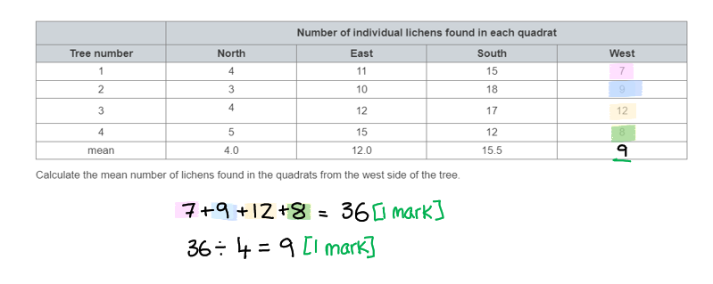
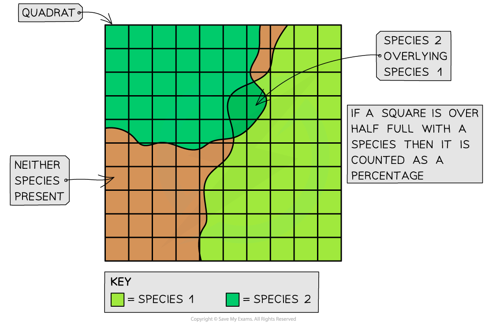
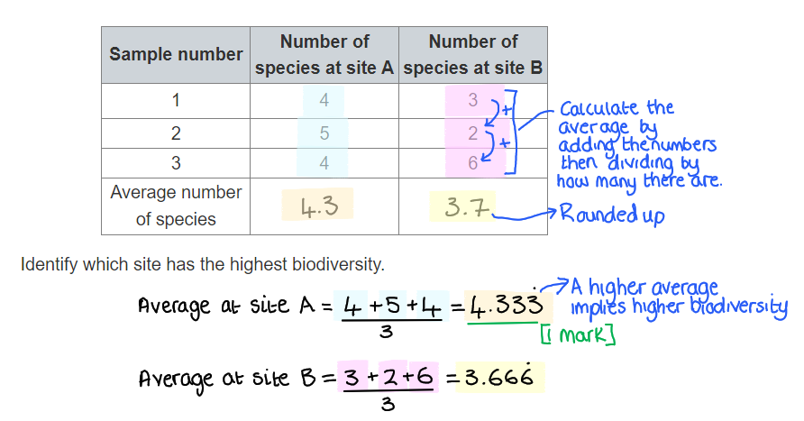
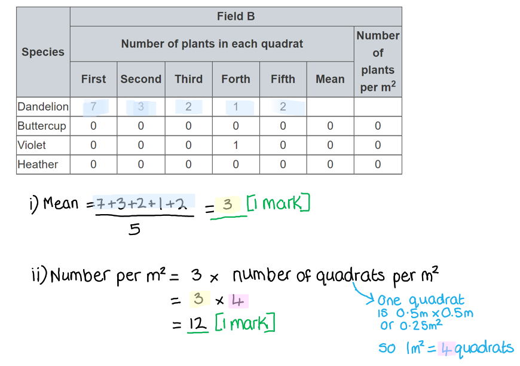
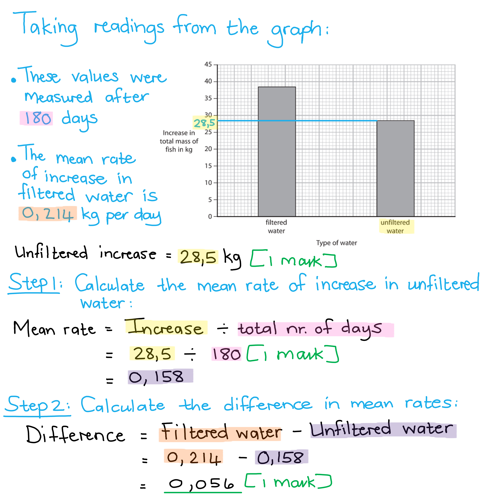
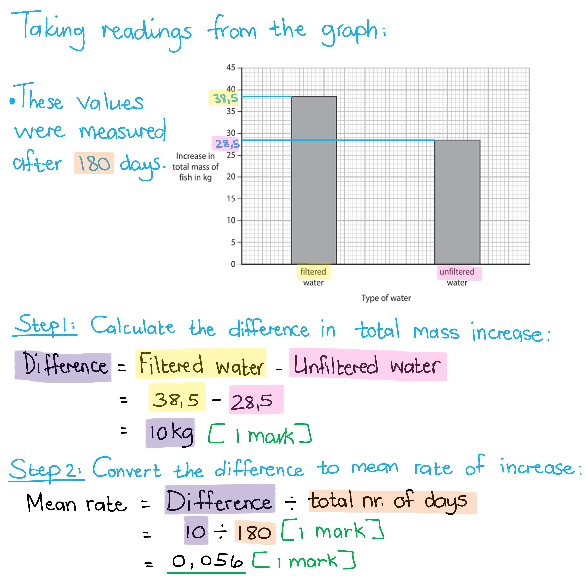
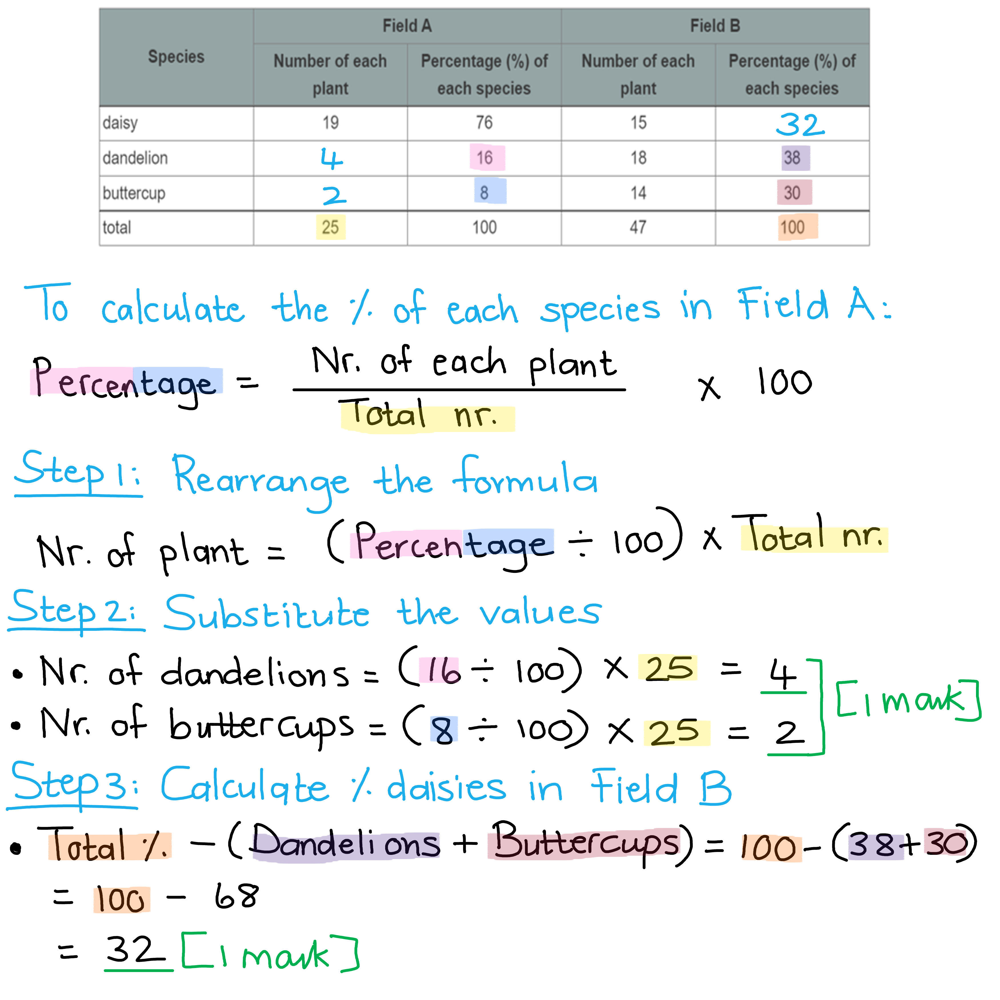
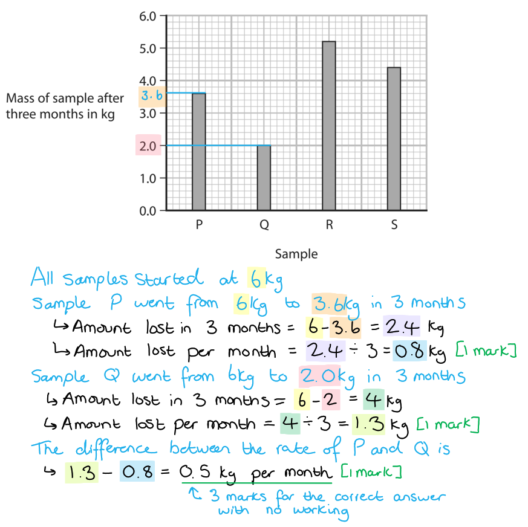

# Mark Schemes — The Organism in the Environment
**4. Ecology & the Environment** · Edexcel IGCSE Biology (4BI1)

## Q1 — easy — 8 marks · exam-questions

### 1() — 2 marks
A community refers to...

Any** two **of the following:

- All the living factors / biotic factors / organisms / populations; **[1 mark]**
- Living in one area / habitat at one time;** [1 mark]**
- Organisms are all interdependent / depend on each other; **[1 mark]**

**[Total: 2 marks]**

### 2() — 2 marks
Interdependent means...

- All organisms depend/rely on each other; **[1 mark]**
- Changes / rise or fall in one population / species will impact other populations / species in the food web;** [1 mark]**

**[Total: 2 marks]**

### 3() — 2 marks
The image does not represent an ecosystem because...

- It does not include information about the abiotic factors; **[1 mark]**
- Any correct example of an abiotic factor (water, light intensity, wind speed, mineral ion availability, temperature);** [1 mark]**

**[Total: 2 marks]**

### 4() — 2 marks
The affect on the population of caterpillars would be as follows:

Any **two **from the following:

- The population would decrease;** [1 mark]**
- (Because) there is less food / less for them to eat;** [1 mark]**
- (Which means) there will be more competition between the caterpillars **OR** more competition between the caterpillars and rabbits / earthworms; **[1 mark]**

**[Total: 2 marks]**

## Q2 — easy — 6 marks · exam-questions

### 1() — 1 marks
The students could choose four trees in the following way:

- Using a random number generator / randomly / using random numbers; **[1 mark]**

**[Total: 1 mark]**

*It is important that the numbers are selected randomly to avoid bias***.**

### 2() — 2 marks
The mean can be calculated as follows:

- 8 + 12 + 9 + 7 = 36; **[1 mark]**
- 36 ÷ 4 = 9; **[1 mark]**

**[Total: 2 marks]**

> *A mean is calculated by** adding** together all of the numbers in the sample and then **dividing** by how many numbers there were. There were 4 trees being sampled so in this example, we divide by 4.*

### 3() — 1 marks
Another method for measuring the abundance of lichen is..

- Estimating the percentage cover of the lichen in the quadrat; **[1 mark]**

**[Total: 1 mark]**

> *Sometimes, estimating percentage cover of a quadrat is more suitable method especially where the organism is particularly **small** or where it **covers vast areas** of the sample sites. This method can be seen in the image below*

### 4() — 2 marks
Two abiotic factors which will impact lichen growth could include:

Any **two** from the following:** **

- Temperature; **[1 mark]**
- Sunlight/light intensity; **[1 mark]**
- Moisture / water availability; **[1 mark]**
- pH; **[1 mark]**
- Carbon dioxide levels / oxygen levels; **[1 mark]**
- Exposure to weather conditions e.g. wind;** [1 mark]**

***Accept**** other valid factors which would impact the growth of the lichen*

**[Total: 2 marks]**

> *Lichen are a more complicated organism than most due to the fact that they actually consist of** two** organisms living in mutualism. This is not knowledge that is required for the question as the information given in the question stem tells you that they are **photosynthetic** and also** fungi**. Therefore, lichen will be impacted by a wide variety of abiotic (non-living) factors.*

> *As this is a **list style **question, it is important that you only put answers that you are sure of as an incorrect answer may negate an early marking point and lead to lost marks.*

## Q3 — easy — 7 marks · exam-questions

### 1() — 2 marks
Biodiversity means...

- The range of different species of organism **OR** the species richness; **[1 mark]**
- (And) the variation within the species **OR **variety within the species; **[1 mark]**

**[Total: 2 marks]**

> *There may be other ways to describe biodiversity to still obtain the marks, so long as the descriptions give the same meaning.*

> *A very simplistic measure of biodiversity is to simply count the number of organisms, however, a more accurate measure should consider the variation within the species also.*

### 2() — 1 marks
The students should collect the following data:

- Select more sample sites / at least 10 sample sites; **[1 mark]**

**[Total: 1 mark]**

### 3() — 1 marks
The site with the highest biodiversity is...

- Site A; **[1 mark]**

**[Total: 1 mark]**

### 4() — 1 marks
Data about birds could not be collected using the method in part (b) because...

- Birds move **so** the quadrat would not be suitable for collecting data about birds; **[1 mark]**

**[Total: 1 mark]**

### 5() — 2 marks
The large heather plants may have led to the biodiversity seen because:

Any **two **from the following:

- (The heather) outcompetes other species **/** there is competition between species / species compete for (named) resources; **[1 mark]**
- This is a <u>biotic</u> factor (which influences biodiversity); **[1 mark]**
- Therefore there is a lower biodiversity (at site B) / fewer different species can survive; **[1 mark]**

**[Total: 2 marks]**

## Q4 — medium — 11 marks · exam-questions

### 6((a)) — 2 marks
The results shown in the table can be explained as follows...

Any **two** of the following:

- As distance from city centre increases, percentage coverage by lichen increases / there is a (positive) correlation between distance and lichen coverage; **[1 mark]**
- There are more cars in city centre / is more car pollution in city centre; **[1 mark]**
- There is more sulfur dioxide in city centre; **[1 mark]**

*Allow converse answer for marking points 2 and 3, e.g. "there are fewer cars further away from the city centre" and "there is less sulfur dioxide further away from the city centre"*

**[Total: 2 marks]**

### 6((b)) — 3 marks
A method to measure the percentage of a stone wall covered by lichen is as follows...

Any **three** of the following:

- Measure the area of/covered by lichen / use a grid/quadrat to measure the percentage cover / count the number of <u>squares</u> with lichen; **[1 mark]**
- Measure the (total) area of stone; **[1 mark]**
- Divide (lichen) cover by total area and x 100; **[1 mark]**
- Repeat (to calculate a mean); **[1 mark]**

**[Total: 3 marks]**

> *Remember you're not being asked to count individual lichen organisms here, just to measure the area covered by them as a percentage of the total area of the wall. *

### 6((c)) — 6 marks
A laboratory investigation to find out the effect of sulfur dioxide gas on the heat released by germinating seeds would include the following...

Any **six** of the following:

- **C **- seeds either exposed to SO2 or not exposed to SO2 / exposed to different concentrations of SO2; **[1 mark]**
- **O **- same species / age / variety/type of seed; **[1 mark]**
- **R **- lots of seeds / repeat experiments; **[1 mark]**
- **M1 **- measure temperature change...; **[1 mark]**
- **M2 **- ...using a thermometer; **[1 mark]**
- **S1 **- thermos flask to contain seeds / insulate seeds / prevent heat loss; **[1 mark]**
- **S2 **- same moisture/humidity / oxygen / water / carbon dioxide / same starting temperature / light intensity / wash seeds with disinfectant / time; **[1 mark]**

**[Total: 6 marks]**

> *Remember that with **CORMS** questions you will not be expected to know anything about the experiment you're presented with. You just have to apply your knowledge of experimental design to a new scenario.*

> *Remember that **CORMS** stands for: **C**hange, **O**rganism, **R**epeat, **M**easure, **S**ame. There are always two marks available for **M**easure and two for **S**ame.*

> *The most difficult mark to get is the **O**rganism because you need to remember to include the word **same** in your answer, e.g. "same species". The point for **O**rganism needs to be different to the two points in **S**ame.*

> *Remember to write your answers in **full sentences**, as stated in the question stem, but you are welcome to make a quick bullet point plan in a blank space somewhere else on your page. Use your plan to tick off and make sure you've hit all the marking points.*

## Q5 — medium — 9 marks · exam-questions

### 5((a)) — 2 marks
The role of a named vector in the process of genetic modification is...

Any **two** of the following:

- A plasmid / virus / bacteriophage/phage / gene gun;** [1 mark]**
- (Used to) transfer/insert/carry/introduce (recombinant) DNA/gene into the (new) organism; **[1 mark]**

**[Total: 2 marks]*** *

### 5((b)) — 7 marks
(i) The mineral used to make chlorophyll is...

Any **one** of the following:

- Magnesium/Mg/Mg2+;** [1 mark]**
- Iron/Fe/Fe2+/Fe3+; **[1 mark]**
- Nitrate/NO3/NO3-; **[1 mark]**

(ii) An investigation to find out which method produces the highest crop yield is:

Any **six** of the following:

- **C** (carry out an experimental condition that uses) pulling/method A **AND** (another experimental condition that uses) weedicide/weedkiller/method B; **[1 mark]**
- **O** use the same species/type of crop/plant; **[1 mark]**
- **R** repeat the investigation / use more than one field (for the plants); **[1 mark]**
- **M1** measures the crop mass / weigh the crops; **[1 mark]**
- **M2** use quadrats / sampling / (measure mass) per m2 / per unit area / per tray (of plants/crops); **[1 mark]**
- **S1** (carry out sampling) after a <u>stated</u> time period / one growing season; **[1 mark]**
- **S2** (control the) temperature / light / carbon dioxide / soil / water / fertiliser / minerals; **[1 mark]**

***Reject**** amount or yield for marking point M1.*

***Allow**** idea of same geographical region / climate for S2.*

**[Total: 6 marks]**

> *CORMS** stands for:*

- *C **- what is being **C**hanged?*
- *O **- What is being controlled related to the **O**rganism?*
- *R **- **R**epeats*
- *M** - What **M**easurements will you take? (Use multiple examples here)*
- *S** - What will you keep the **S**ame? (Give more than one example here)*

> *Remember that with **CORMS** questions you will not be expected to know anything about the experiment you're presented with. You just have to apply your knowledge of experimental design to a new scenario.*

> *There are always two marks available for **M**easure and two for **S**ame.*

> *The most difficult mark to get is **O**rganism because you need to remember to include the word "**same**" in your answer, e.g. "**same species**". The point for **O**rganism needs to be **different** to the two points in **S**ame.*

> *Remember to write your answers in full sentences, as stated in the question stem, but you are welcome to make a quick bullet point plan in a blank space somewhere else on your page. Use your plan to tick off and make sure you've hit all the marking points.*

## Q6 — medium — 11 marks · exam-questions

### 4((a)) — 3 marks
The table should be completed as follows...

| **Examples of process** | **Name of process** |
|---|---|
| Plants with a short growing season survive drought | Natural selection |
| Growth of algae in rivers polluted by fertiliser | Eutrophication; **[1 mark]** |
| Pollen transferred from one plant to another by an insect | <u>Insect</u> pollination; **[1 mark]** |
| Absorption of nitrate ions from soil using ATP | Active transport; **[1 mark]** |

**[Total: 3 marks]**

### 4((b)) — 8 marks
(i) Natural selection could be responsible for the results because...

Any **four** from the following:

- (Between 0 and 100 m / near the mine) grass flourishes / grows well / survives / not killed by zinc / other species are killed near the mine; **[1 mark]**
- (Because there is) less competition (with other species); **[1 mark]**
- A mutation (in the grass allows survival);** [1 mark]**
- (Successful grass) reproduces; **[1 mark]**
- Therefore they pass (advantageous) allele / gene / DNA on to offspring; **[1 mark]**

> *Natural selection occurs where there is a selection pressure which favours or opposes certain characteristics. In this case, the selection pressure is the presence of zinc and the characteristic that's being favoured is tolerance to zinc. Natural selection usually starts with a mutation which provides the advantage to the organism trying to survive.*

(ii) The scientist could use the following method for comparison...

- Use a tape measure; **[1 mark]**
- And a <u>quadrat</u>; **[1 mark]**
- Repeat / take several readings **OR** place the quadrat several times *(accept a sensible number of repeats here, more than three and less than thirty*);** [1 mark]**
- (In each quadrat) count plants / estimate percentage cover (*accept description*); **[1 mark]**

> *An ecological study such as this can only collect valid and reliable data through correct techniques. Random placement of the quadrat is fundamental, but it is also key to obtain as many readings as is possible whilst also being achievable. This will give a representative sample which will indicate the population proportions accurately.*

**[Total: 8 marks]**

## Q7 — medium — 9 marks · exam-questions

### 6((a)) — 2 marks
Random samples can be obtained in the following way...

- Use random number tables/computer/generator; **[1 mark]**
- To generate coordinates in field **OR** place tape measures along edge of the field / split the area into a grid; **[1 mark]**

**[Total: 2 marks]**

> *Collecting random data is fundamental in collecting representative samples in ecological data. When using a quadrat, the random generation of sample sites is important.*

### 6((b)) — 2 marks
(i) The mean can be calculated as follows:

- (7+3+2+1+2) ÷ 5
- = 3; **[1 mark]**

(ii) The number of dandelions can be calculated as follows...

- 3 x 4
- = 12; **[1 mark]**

*Allow errors carried from part (b)(i).*

**[Total: 2 marks]**

> *There are no marks for the calculation here, only for obtaining the correct answers.*

### 6((c)) — 2 marks
The differences in species distribution can be compared as follows...

Any **two** from the following:

- More plants / named plants in field A / more plants per quadrat / more of each species **OR **field A has 39 plants and B has 16; **[1 mark]**
- More species in field A **OR **A has 4 species and B only has 2; **[1 mark]**
- There is a higher (bio)diversity in field A; **[1 mark]**
- More species evenness / even distributions (in field A); **[1 mark]**

*Allow converse statements for field B*

**[Total: 2 marks]**

### 6((d)) — 3 marks
The students could do the following...

**EITHER**

*Method 1*

Any **three** from the following:

- Measure water content of soil / field **OR **calculate mean water content of the soil; **[1 mark]**
- Take repeated samples; **[1 mark]**
- (Samples taken) along a transect / at random locations; **[1 mark]**
- Count buttercups / compare number of buttercups to water content of soil; **[1 mark]**

**OR**

*Method 2*

Any **three** from the following:

- Plant buttercups in one field / pots with poor drainage **and** one with good drainage **OR **plant in high soil water and in low soil water; **[1 mark]**
- Repeat (method with multiple pots / fields); **[1 mark]**
- Control temperature / minerals / light / rainfall / water added; **[1 mark]**
- Count number of buttercups; **[1 mark]**

**[Total: 3 marks]**

> *As there are different ways to investigate the suggestion in the question thread, there are two methods offered in the mark scheme. You can mark your answer for one or other of the method, but not for a mixture of the two. It is important that you relate your method directly to the question thread rather than providing a generalised method.*

## Q8 — medium — 2 marks · exam-questions

### 1() — 2 marks
> **[mark-scheme]**
> (i)  A population is a group of organisms of the same species living in a particular area/habitat at the same time **[1 mark]**
> 
> (ii) Any 1 from:
> 
> - To avoid bias
> - To obtain a representative sample of the area
> - To increase reliability
> - To improve validity
> 
> **[1 mark]**

> **[exam-tip]**
> For population, make sure you include all three key parts of the definition: same species, same area/habitat, and same time. Missing any one of these is a common reason for losing the mark.
> 
> Population is one of the key ecology terms you need to understand. The others are community, habitat and ecosystem.

## Q9 — medium — 4 marks · exam-questions

### 1() — 4 marks
> **[mark-scheme]**
> (i) Area B has an anomalous result **[1 mark]**
> 
> (The result for quadrat 3 in Area B is 42 is much lower than the others and can therefore be treated as anomalous)
> 
> (ii) To calculate the mean for Area B, excluding the anomalous result of 42:
> 
> Add the values together: 74 + 83 + 76 + 69 = 302
> 
> Divide the sum of these values by 4: 302  ÷ 4 =** ****75.5%**** ****[1 mark]**
> 
> (iii) To calculate the percentage change in mean grass cover in Area A compared to Area B:
> 
> The formula needed is:
> 
> `\% c h a n g e = \frac{c h a n g e}{o r i g i n a l } x 100`
> 
> The change (difference) between Area A and B is the difference between the original and the new value.
> 
> The original value is the % grass cover in Area A, and the new value is the % grass cover in Area B. Don't forget to use the calculated mean value for Area B from part (ii).
> 
> `\% c h a n g e = \frac{\left(o r i g i n a l - n e w\right)}{o r i g i n a l } x 100`
> 
> `\% c h a n g e = \frac{\left(30 . 0 - 75 . 5\right)}{75 . 5} x 100`
> 
> `\% c h a n g e = \frac{\left(- 45 . 5\right)}{75 . 5} x 100`= **-60.3 % ****[2 marks]**
> 
> 1 mark can be awarded if the answer is wrong, but a value of -45.5 is calculated.
> 
> 1 mark can be awarded if the mean value for Area B in the table is used in this calculation:
> 
> `\% c h a n g e = \frac{\left(30 . 0 - 68 . 8\right)}{68 . 8} x 100 = - 56 . 4 \%`

> **[exam-tip]**
> Always, always show your working, no matter how easy you find a calculation. One of the most frequent comments from examiners in their examiner reports is that students should be reminded to show their working, because marks may still be awarded for correct working even if the final result is incorrect.

## Q10 — medium — 3 marks · exam-questions

### 1() — 3 marks
> **[mark-scheme]**
> Any three of the following (1 mark each):
> 
> - (Fewer seeds might germinate in soil that has been trampled as) trampling compacts the soil
> - Air spaces are reduced (in more compact/trampled soil)
> - So less oxygen available for respiration (to provide energy for germination/growth)
> - Poor water infiltration/less water available (for germination)
> - Water is needed to swell the seed/break the seed coat/to activate enzymes for growth
> 
> **[3 marks]**

> **[exam-tip]**
> Three key factors are needed for successful germination: oxygen, water and warmth. Trampled (more compact) soil is likely to impact the first two of these.
> 
> Remember a seed that is germinating is not photosynthesising (it will have no leaves!) so less water availability  here does not impact photosynthesis.

## Q11 — medium — 4 marks · exam-questions

### 1() — 4 marks
> **[mark-scheme]**
> An answer that makes reference to the following points (1 mark each):
> 
> - Fewer seeds germinated in soil from Area A than Area B/Area A had a lower % mean grass cover and fewer seeds germinated in this soil
> - Which supports the idea that trampling reduces germination
> - However only one sample of soil tested from each area / no repeats
> - Small sample size (20 seeds each time)
> - Other variables in the soil that can impact germination may differ (e.g. water content / nutrients / microorganisms)
> - Oxygen availability was not directly measured
> - Results show correlation but do not prove trampling caused the difference
> - The experiment should be repeated so that a mean can be calculated
> - Increase the number of seeds used/more soil samples from each area
> 
> **[4 marks]**

## Q12 — hard — 8 marks · exam-questions

### 5((a)) — 3 marks
A description of a method to measure the mean number of weeds per m2 in each field would include...

Any **three** of the following:

- (Make use of a) <u>quadrat</u> (to take measurements); **[1 mark]**
- Repeat / use the quadrat several times / take repeat measurements; **[1 mark]**
- (The quadrat should be placed) at random / using (grid) coordinates; **[1 mark]**
- Count the number of / record the amount of/how many (weeds); **[1 mark]**
- (To calculate the mean) divide the total (count) by (the area/number of) quadrats; **[1 mark]**

*For marking points 1 and 2 combined award* **[2 marks]** *for reference to using quadrat*<u>*s*</u>.

**[Total: 3 marks]**

> *Weeds are stationary organisms (they do not move around), therefore using quadrats is a suitable method for determining the mean number of weeds per m**2** in a field. It is important to spread out the repeat measurements across the entire study area to ensure a more accurate estimation of the mean.*

### 5((b)) — 5 marks
A discussion of the conclusion would include...

Any **five** of the following:

*Advantages of biological control*

- Biological control numbers are (overall) lower; **[1 mark]**
- Biological control numbers stay low / are less variable while chemical control numbers go up and down / are more variable; **[1 mark]**
- With biological control there is no need to reapply (the treatment) **OR** the insects reproduce (that are used as biological control agent); **[1 mark]**
- Biological control holds less risk of pollution (of the environment); **[1 mark]**
- With biological control there is less risk that weeds will become resistant (to insect predation); **[1 mark]**
- Biological control is specific (to its target species) **OR** does not affect (other) food chains; **[1 mark]**
- There is no bioaccumulation/biomagnification with using biological control methods; **[1 mark]**

*Disadvantages of biological control*

- The biological control numbers decline more slowly **OR** the chemical control numbers are lower at the start/in February; **[1 mark]**
- The chemical control numbers are lower in some months / April/June/August; **[1 mark]**
- Biological control species may become pests (as well); **[1 mark]**

*Allow for converse arguments throughout, e.g. for marking point 1 "chemical control numbers are (overall) higher".*

**[Total: 5 marks]**

> *You must be able to compare the advantages and disadvantages of biological and chemical methods of pest control. The main advantage of biological control methods is that there is no chemical pollution of the environment and the introduced species will mostly target the pest species specifically without affecting other organisms across different food chains. Some of the disadvantages is that it can take a long time before it appears to be effective and there is always the risk that the introduced species may become a pest itself if it starts feeding on other organisms.*

## Q13 — hard — 8 marks · exam-questions

### 4((a)) — 3 marks
The difference between the mean rate of increase of the fish in filtered and unfiltered water can be calculated as follows...

- Increase in total mass of fish in unfiltered water: 28.5 kg; **[1 mark]**
- Growth rate in unfiltered water: 28.5 <u>÷ 180</u> (= 0.158); **[1 mark]**
- (0.214 - 0.158) = 0.056; **[1 mark]**

**OR**

- Difference in total mass between filtered and unfiltered water: (38.5 - 28.5) = 10 kg;** [1 mark]**
- Mean rate of increase: 10 <u>÷ 180</u>; **[1 mark]**
- = 0.056; **[1 mark]**

*Full marks awarded for the correct answer of 0.056 or 0.05 recurring, in the absence of calculations.*

**[Total: 3 marks]**

> *There are two different ways in which the answer could have been calculated.*

> *Method 1:*

> *Method 2:*

### 4((b)) — 3 marks
Unfiltered water containing more bacteria would affect the growth of fish because...

Any **three** of the following:

- (In unfiltered water there is) less growth; **[1 mark]**
- (Because there is) less oxygen (in the water); **[1 mark]**
- (This means there would be) less respiration (in the cells of fish); **[1 mark]**
- (More bacteria may lead to) more disease / damage to gills (in fish); **[1 mark]**

**[Total: 3 marks]**

> *Some of the bacteria that are present in the water might be pathogenic and cause disease or physical damage to the fish. Since more energy would go into fighting infection or repairing damaged tissue/organs, there would be less available for growth. Bacteria that act as decomposers will use oxygen in the water to break down dead organic material, which leaves less oxygen available for fish to use during respiration. Lower rates of respiration will lead to less energy being released that could be used for growth.*

### 4((c)) — 1 marks
A biotic variable that could be controlled would be...

- (The) species/type/mass of fish (at the start of investigation); **[1 mark]**

**[Total: 1 mark]**

> *Remember that biotic refers to the living component of this investigation, which is the fish. The scientist would have to make sure that the fish in the filtered and unfiltered water is as similar to each other as possible, in order to obtain reliable results about their growth.*

### 4((d)) — 1 marks
A method that the scientist could use to control interspecific predation would include...

Any **one** of the following:

- (They could) use a net/cage (to trap predators); **[1 mark]**
- (They could) shoot/kill predators; **[1 mark]**
- (They could) make noise (to scare off predators); **[1 mark]**

**[Total: 1 mark]**

## Q14 — hard — 7 marks · exam-questions

### 7((a)) — 1 marks
The number of individuals of one species present in a habitat at one time is called a...

- Population; **[1 mark]**

**[Total: 1 mark]**

### 7((b)) — 4 marks
(i) The completed table would look as follows...

| **Species** | **Field A** | **Field B** |   |   |
|---|---|---|---|---|
| **Number of each plant** | **Percentage (%) of each species** | **Number of each plant** | **Percentage (%) of each species** |   |
| daisy | 19 | 76 | 15 | **32** |
| dandelion | **4** | 16 | 18 | 38 |
| buttercup | **2** | 8 | 14 | 30 |
| total | 25 | 100 | 47 | 100 |

*Award ***[1 mark]*** for 4 *<u>*and*</u><u> </u>*2. *

*Award* **[1 mark]** *for 32(%)*

(ii) The field with the greatest level of biodiversity is...

- (Although) both / (field) A and B, have 3 different species / same number of species; **[1 mark]**
- (Field) B (is more diverse) because it has a more even/similar numbers of each species; **[1 mark]**

**[Total: 4 marks]**

> *The calculations for the missing values in the table:*

### 7((c)) — 2 marks
A mineral shortage could affect the size of plants in the following ways...

- (A correctly) named mineral / nitrate / magnesium; **[1 mark]**
- The correct function (of mineral) / (nitrate needed for) amino acids/protein **OR** (magnesium is needed for) chlorophyll/photosynthesis; **[1 mark]**

*Allow other correctly named mineral at marking point 1.* *Award marking point 2 only if the correct mineral is given at marking point 1.* *Ignore mention of 'nitrogen' at marking point 1. For example, 'Nitrogen is needed for amino acids' is worth only* **[1 mark]**.

**[Total: 2 marks]**

> *Mineral ions are essential for the proper growth of plants, so take some time to study the examples covered in the specification.*

## Q15 — hard — 9 marks · exam-questions

### 2((a)) — 4 marks
An explanation of the results is...

Any **four **of the following:

- (There is) more / faster (decomposition) with warmer temperatures; **[1 mark]**
- Enzymes (have more kinetic energy / are closer to their optimum temperature); **[1 mark]**
- (There is) more / faster decomposition with cut material; **[1 mark]**
- (Because this gives a) larger surface area; **[1 mark]**
- For fungi / bacteria (to access for decomposition / to secrete their enzymes over); **[1 mark]**

**[Total: 4 marks]**

> *Remember whenever you see the command word 'explain' that means you must talk about the science behind the data using your knowledge to give a reason for the results. *

### 2((b)) — 3 marks
The difference between the rate of decomposition in sample P and the rate of decomposition in sample Q is...

Any **three **of the following:

- 6.0 – 3.6 = 2.4 2.4 ÷ 3 = 0.8; **[1 mark]**
- 6.0 – 2.0 = 4.0 4.0 ÷ 3 = 1.3; **[1 mark]**
- 1.3 – 0.8 = <u>0.5 / 0.53 / 0.533</u> kg per month *(award 3 marks for the correct final answer with no calculations shown)*; **[1 mark]**

*Alternatively: *4 - 2.4 = 1.6, 1.6 ÷ 3 = 0.5; **[3 marks]** *Alternatively: *3.6 - 2 = 1.6, 1.6 ÷3 = 0.5; **[3 marks]**

**[Total: 3 marks]**

> *Allow 1 mark for 2.4** and** 4.0, or 1.3 **and** 0.8. Allow 1  mark for dividing by 3, so can get 2 marks for (2.4 and 4.0) and dividing by 3.*

### 2((c)) — 2 marks
Two biotic variables she should control are...

Any **two **of the following:

- Species/type / of leaves/plant; **[1 mark]**
- Age of plant/leaves; **[1 mark]**
- Same number of / type of decomposers; **[1 mark]**
- Insects or organisms that might consume/eat the leaves; **[1 mark]**

*Ignore references to the volume of leaves*

**[Total: 2 marks]**

> *Remember that biotic is just living things, not non-living, which would be abiotic. *
