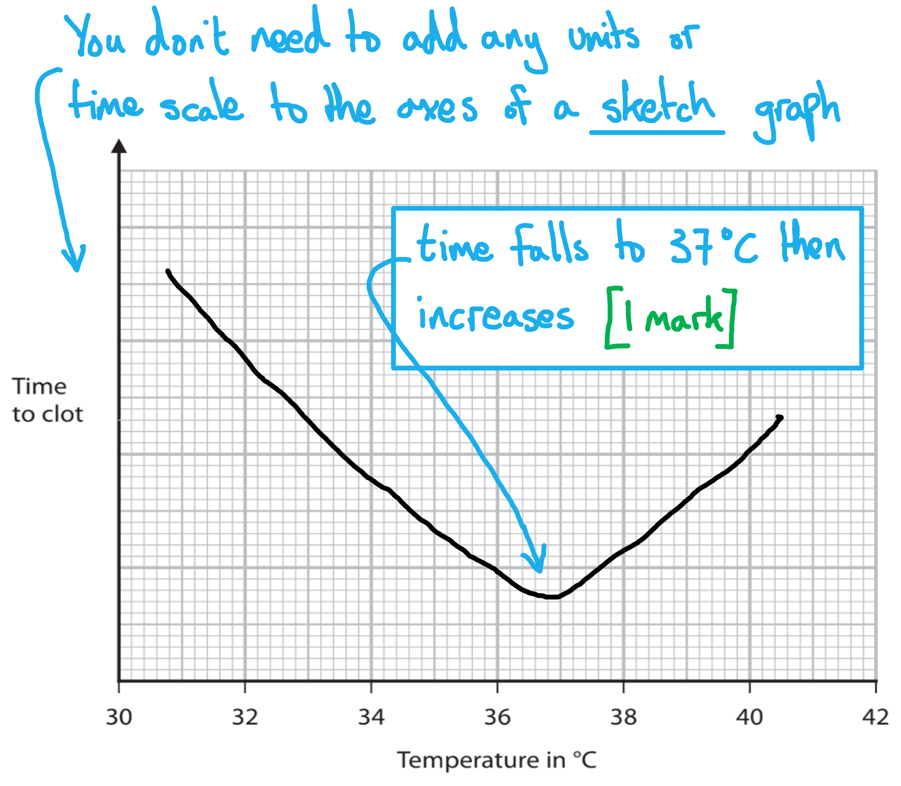
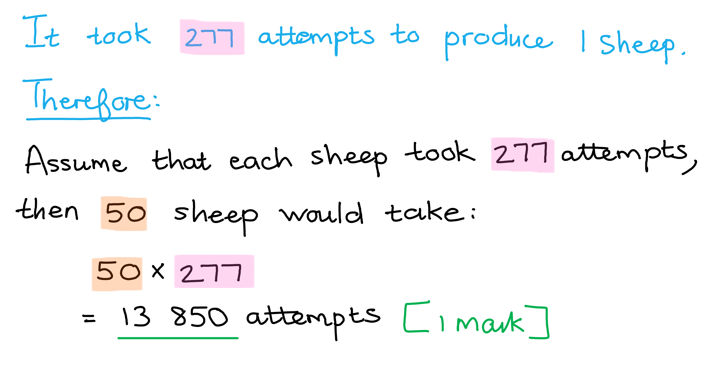
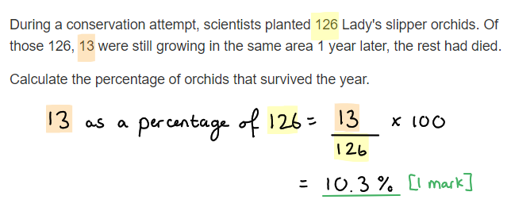

# Mark Schemes — Cloning
**5. Use of Biological Resources** · Edexcel IGCSE Biology (4BI1)

## Q1 — easy — 7 marks · exam-questions

### 1() — 2 marks
The purpose of the bleach in step 1** **is to...

Any **two** of the following:

- Sterilise the piece of plant tissue / kill microorganisms/bacteria/fungi on the tissue; **[1 mark]**
- Ensure that the new plant is free of infection / does not become infected as it grows; **[1 mark]**
- Ensure that the nutrient agar feeds plant growth and not microbial growth / that microbial cells do not use up the nutrients in the agar **OR** prevent competition between plant and microbial cells; **[1 mark]**

**[Total: 2 marks]**

> *This is an **explain** question, so you need to include additional detail that says **why** the step is important. Here the bleach kills microorganisms, and the purpose of this is to prevent infection and to ensure that only plant tissue grows on the nutrient medium.*

### 2() — 2 marks
The term callus as set out in step 3 means...

- A ball/growth/mass of cells...; **[1 mark]**
- ...that are undifferentiated/unspecialised; **[1 mark]**

**[Total: 2 marks]**

### 3() — 2 marks
Two advantages of the use of tissue culture to extend the growing of plantains in different African countries, are...

Any **two** of the following:

- It is easy to transfer tissue samples between countries / farms **OR** only needs a small amount of source material (so it is easy to transport);** [1 mark]**
- Many new plants can be produced very quickly / in a small space; **[1 mark]**
- All plantains produced desirable characteristics / a named desirable characteristic, e.g. colour / flavour / ease of eating; **[1 mark]**
- New plants are free of infection / will not transfer disease from country to country; **[1 mark]**
- Plants can be grown (in a lab setting) at any time of year (so it doesn't matter if the season in one country is different to the season in another); **[1 mark]**

*Ignore references to the propagation of genetically modified cells as this is not relevant to the scenario presented.*

**[Total: 2 marks]**

### 4() — 1 marks
Small pieces of animal tissue from any part of an animal cannot grow into new individuals because...

Any **one **of the following:

- Specialised animal cells are unable to differentiate/specialise into new/different cell types / can only divide to form one cell type; **[1 mark]**
- Animal stem cells with the ability to differentiate/specialise (into new cell types) are found only in specific locations / the embryo / bone marrow / umbilical cord; **[1 mark] **

*Accept 'animal cells cannot dedifferentiate'.*

**[Total: 1 mark]**

## Q2 — easy — 11 marks · exam-questions

### 1() — 6 marks
The completed passage would be as follows...

A nucleus is taken from a body **cell**;** ****[1 mark]** of an adult Javan rhino. This nucleus is put into an enucleated **egg cell/ovum**; **[1 mark]**. The cell is given a mild electric shock to help it divide by a type of cell division called **mitosis**; **[1 mark]**. A ball of cells is produced called an **embryo**; **[1 mark]**. The ball of cells is placed into the **uterus/womb**; **[1 mark]** of a female rhino.

This female rhino is called a **surrogate**; **[1 mark] **mother.

**[Total: 6 marks]**

### 2() — 2 marks
(i) The term explant can be defined as follows...

- Several plant cells / fragments of plant tissue that are transferred to a nutrient medium; **[1 mark]**

(ii) The term *in vitro *can be defined as follows...

- Something that occurs / is grown outside a living organism / in glass / in a petri dish / in a lab; **[1 mark]**

**[Total: 2 marks]**

> *Always make sure you are confident with your understanding of the key words for each topic. *

### 3() — 1 marks
The number of harvested trees between 1991-1997 was...

- (35 000 x 7 =) 245 000; **[1 mark]**

**[Total: 1 mark]**

> *There are seven years to count during the time period given (1991-1997) and 35 000 trees were killed each year, so the answer can be calculated as follows:*

> *35 000 x 7 = 245 000*

### 4() — 2 marks
Some advantages and disadvantages of conserving the African cherry tree using micropropagation are...

*Advantages*

Any **one** of the following...

- Can produce large numbers of trees quickly / in a small space; **[1 mark]**
- Can produce trees with desired characteristics / that are clones of the original tree; **[1 mark]**
- Ensures that new plants are disease/infection free;
- The process is not dependent on seasons / can be carried out at any time of year; **[1 mark]**

*Disadvantages*

Any **one** of the following..**.**

- Laboratory equipment / specialist training is required; **[1 mark]**
- Reduces genetic variation in the population; **[1 mark]**
- Trees may be vulnerable to (the same) pests/diseases (because they are all clones); **[1 mark]**

**[Total: 2 marks]**

## Q3 — easy — 8 marks · exam-questions

### 1() — 4 marks
(i)** The correct answer is ****A ****because...**

This is the sheep that donated its genetic material (DNA). None of the other sheep in this process gave their DNA to the offspring clone.

**B** is incorrect because this sheep only donated the egg cell.

**C** is incorrect because this sheep is just the surrogate mother.* *

(ii) Structure X is an...

- Embryo; **[1 mark]**

(iii) During process Y the following takes place...

- Cell X is given an electric shock / the empty/enucleated egg cell takes up the DNA (from another sheep); **[1 mark]**
- The embryo cells divide by <u>mitosis</u> (to create a ball of cells); **[1 mark]**

**[Total: 4 marks]**

### 2() — 2 marks
(i) It is useful for the protein to be extracted from the milk because...

Any **one **of the following:

- The sheep can continue to produce the milk throughout its life / the sheep doesn't have to be killed to extract the protein; **[1 mark]**
- It is easy to extract the protein from the milk (with the right technology) / the protein does not need to be extracted from within the cells of the sheep; **[1 mark]**

> *This is a **suggest** question; while you are expected to know about this method of cloning animals for the production of human proteins, you may not have covered details of producing proteins in milk. Instead you need to use your reasoning skills to consider why it might be useful to produce proteins specifically in the milk, e.g. because it avoids the need to kill the animal to harvest the product, or because it the human proteins can be easily extracted from milk.*

(ii) The biological term used to describe an organism that has DNA from another species in its genome is...

- Transgenic; **[1 mark]**

**[Total: 2 marks]**

### 3() — 2 marks
Two other examples of proteins that can be produced using animals in this way are...

- Antibodies; **[1 mark]**
- Alpha-1-antitrypsin; **[1 mark]**

*Accept any other valid answer*

**[Total: 2 marks]**

> *The reason these answers are given is because these are the ones listed in our revision notes, however there are lots of examples you could use. It's worthwhile taking the time to familiarise yourself with a few examples, although in an exam scenario it's more likely you'll be asked an application question, with an example given in the stem of the question. *

## Q4 — easy — 8 marks · exam-questions

### 1() — 1 marks
The term clone can be defined as...

- Individuals/cells that are <u>genetically</u> identical / that have the same <u>DNA</u>; **[1 mark]**

**[Total: 1 mark]**

### 2() — 1 marks
**Final answer:** **The correct answer is ****A ****because...**

Micropropagation is a process that involves taking cells from plants and then culturing them using tissue culture techniques to produce new cloned plants.

**B **'joining male and female sex cells' and **C** 'hand pollination' are incorrect because they both describe sexual reproduction, which is not how clones are produced.

**D **is incorrect because 'transferring genes from one plant to another plant' allows for genetic modification, not cloning.

### 3() — 5 marks
The dog could be cloned using the following method...

Any **five of** the following:

- Take an (unfertilised) egg cell from another dog; **[1 mark]**
- <u>Remove the nucleus</u> from the egg cell; **[1 mark]**
- Take the <u>nucleus</u> from a skin cell of the family dog; **[1 mark]**
- Put the (family dog cell) nucleus into the empty/enucleated egg cell; **[1 mark]**
- Electricity/an electric shock is applied to the egg cell; **[1 mark]**
- The egg cell divides by <u>mitosis</u>; **[1 mark]**
- The egg cell develops into an embryo; **[1 mark]**
- (The embryo is) placed in the womb / uterus of a surrogate; **[1 mark]**

**[Total: 5 marks]**

### 4() — 1 marks
The dog will not be exactly the same as the old dog because...

Any **one **of the following:

- The phenotype/characteristics of an organism is caused by a combination of genotype/DNA/genetics and the environment; **[1 mark]**
- The new dog may be exposed to different environmental factors as the old dog / named environmental factors may be different, e.g. diet / training / exercise; **[1 mark]**

**[Total: 1 mark]**

> *The causes of variation in living organisms are covered in the inheritance topic; you should be aware that variation is caused by both genetic and environmental factors, so even if two organisms have the same genes, exposure to subtle difference in environment will lead to subtle differences in phenotype.*

## Q5 — medium — 11 marks · exam-questions

### 3((a)) — 1 marks
*In vitro* means...

- In glass / in test tube / in (Petri) dish; **[1 mark]**

**[Total: 1 mark]**

### 3((b)) — 8 marks
(i) The relationship between pH and the mean number of shoots per explant can be explained as follows...

Any **two** of the following:

- (The mean number of shoots) increases up to pH 6 **and** decreases above pH 6; **[1 mark]**
- <u>Enzymes</u> are involved with plant growth; **[1 mark]**
- (The) optimum pH (of these enzymes) is 6 / (enzymes) denature at high / low pH; **[1 mark]**

(ii) The student could obtain explants in the following ways...

Any **six** of the following:

- Use forceps/scalpel/knife to remove explants / pieces from plant; **[1 mark]**
- Wash (the explants) in bleach / hypochlorite / ethanol / alcohol / sterile wipes; **[1 mark]**
- (Grow them on) agar; **[1 mark]**
- (The agar contains) nutrients / minerals / carbohydrates / amino acids / named mineral / growth factors / hormones; **[1 mark]**
- Add acid / alkali / buffer (to the agar); **[1 mark]**
- Use several/multiple explants / repeat (the experiment); **[1 mark]**
- Control the temperature / (the amount of) carbon dioxide / light; **[1 mark]**
- (Use) sterile agar/test-tubes/cotton wool **OR** ensure sterile conditions / that equipment used have been sterilised/disinfected; **[1 mark]**
- (Use the) same age plant / same plant / same size of explants; **[1 mark]**
- Count the number of shoots/roots after the same / stated (amount of) time; **[1 mark]**

*Ignore mention of 'sterilised' on its own for marking point 2.* *Allow 'rooting powder' as an answer for marking point 4.*

**[Total: 8 marks]**

> *Ensure that you are able to describe the process of micropropagation well as this question counts many marks. As with any scientific investigation you must remember to do several repeats of the experiment and pay attention to the variables that would need to be controlled between the petri dishes.*

### 3((c)) — 2 marks
The benefits of using micropropagation rather than seeds include...

Any **two** of the following:

- Lots/many plants are produced by micropropagation; **[1 mark]**
- (These plants are) genetically identical / all the same type / have the same characteristics/identical / (there is) no variation (between plants) / guaranteed plant / they are clones; **[1 mark]**
- Micropropagation can grow GM / genetically modified plants; **[1 mark]**
- Plants can be grown faster/quicker; **[1 mark]**
- Plants can be grown any time of year; **[1 mark]**
- Micropropagation can be used for plants that are hard to germinate / grow from seed; **[1 mark]**

**[Total: 2 marks]**

> *Micropropagation is a useful process when you require many plants that are identical to one another. Seeds are the result of sexual reproduction so genetic material from the parents are combined to form the offspring and is therefore not suited to use if you are looking for specific characteristics to be present in all of the plants. Some seeds are not viable and will therefore not germinate, while the explants will always result in the growth of a plant. Germination takes time, while micropropagation is much faster and produces many more plants from just a few cells of the parent plant.*

## Q6 — medium — 11 marks · exam-questions

### 2((a)) — 3 marks
(i) Reasons why blood clotting is important are...

- To prevent loss of blood / stops bleeding;** [1 mark]**
- To prevent entry of pathogens / microbes / bacteria / viruses / fungi / to prevent infections; **[1 mark]**

> *Avoid vague statements like 'stopping germs entering' or 'to allow a scab to form'. The specification lists specific points on this topic so your choice of wording is crucial to ensure that you achieve the full number of marks available. *

(ii) A sketch graph to show how temperature affects the time taken for blood to clot is as follows...

- A graph showing a drop to 37°C, then an increase; **[1 mark]**

**[Total: 3 marks]**

> *There are a few common errors in this type of question, to avoid:*

- *Adding units to the axes; the command word is 'Sketch (a graph)' which means just draw a line of the roughly correct shape of the plot; you don't have to worry about the y-axis labelling, and the x-axis has already been labelled for you, so you can identify the turning point at 37°C*
- *Plotting a typical 'rate' curve as seen in all textbooks and revision notes. Because the y-axis is plotting a 'time taken' this is the reciprocal of rate, so if you plot a rate curve it'll be 'upside-down' and therefore the wrong shape*
- *Making your curve over-elaborate; it's only a ***[1 mark]*** question so a very simple plot is all that's required*

> *An important clue, buried right at the start of the question, is that the process of blood clotting is controlled by enzymes. Make sure to take this on board, it will steer you towards something significant happening at 37°C, which should be shown in your sketch graph. *

### 2((b)) — 8 marks
(i) These animals are described as transgenic because...

- They have been given / contain genetic material / gene / allele / DNA / have been genetically altered; **[1 mark]**
- (DNA etc. is) from a human / a different species; **[1 mark]**

(ii) A mammal is cloned as follows...

Any** six** of the following:

- Use an enucleated egg / empty egg / remove nucleus from egg; **[1 mark]**
- A nucleus* is taken from body cell / diploid nucleus **AND** placed into empty egg / fused adult cell with empty egg; **[1 mark]**
- Electricity / shock used to stimulate...; **[1 mark]**
- Cell division / mitosis; **[1 mark]**
- So an <u>embryo</u> develops; **[1 mark]**
- In the uterus / womb of a ...; **[1 mark]**
- ...surrogate mother; **[1 mark]**

**Ignore DNA*

**[Total: 8 marks]**

## Q7 — medium — 7 marks · exam-questions

### 4((a)) — 3 marks
(i) Enucleated means...

- The nucleus is removed** OR **the cell is without nucleus; **[1 mark]**

(ii) The single cell develops as follows...

Any **two** from the following:

- (The cell) divides (many times) / produces ball of cells / cell division occurs; **[1 mark]**
- (Division is) by mitosis; **[1 mark]**
- The cells differentiate / specialise (to develop into the cells of the embryo); **[1 mark]**

**[Total: 3 marks]**

### 4((b)) — 4 marks
This data can be evaluated as follows...

Any **four** from the following:

*Against fetal body cells: *

- The same number of offspring produced with each type of (body) cell **OR **both types produce two offspring; **[1 mark]**
- There were fewer pregnancies with fetal cells / lower proportion of pregnancies with fetal cells; **[1 mark]**
- Fewer surrogates used for fetal cells; **[1 mark]**
- (Only) 29 % successful pregnancies from fetal cells **OR** 52% successful pregnancies from adult cells; **[1 mark]**

*For fetal body cells:*

- Offspring from fetal cells are healthy / fetal cells produce more healthy offspring; **[1 mark]**

*Conclusion:*

- Fetal cells are more successful (for cloning) / fetal should be used; **[1 mark]**

**[Total: 4 marks]**

> *An evaluate question like this, requires statements considering both sides of the argument as well as an overall conclusion about which method is best.*

## Q8 — medium — 10 marks · exam-questions

### 5((a)) — 1 marks
The number of attempts to produce 50 cloned sheep can be calculated as follows...

- (277 x 50) = 13 850; **[1 mark]**

**[Total: 1 mark]**

### 5((b)) — 5 marks
The stages used to clone a male dog would include...

Any **five** of the following:

- (The) nucleus from a <u>body</u>/<u>adult</u>/<u>diploid</u> cell of a <u>male</u>** **dog (is removed); **[1 mark]**
- Insert (this) nucleus into a enucleated/empty egg cell; **[1 mark]**
- (Give the egg cell a small) electric shock; **[1 mark]**
- (This will stimulate) mitosis / cell division (in the egg cell); **[1 mark]**
- (Insert the resulting) <u>embryo</u> into the uterus/womb; **[1 mark]**
- (Of a) surrogate mother; **[1 mark]**

**[Total: 5 marks]**

> *When answering a question like this, remember to focus on the specific example that is given (in this case a male dog). Do not write about how Dolly the sheep was cloned, unless you are specifically asked to do so. Doing this here would have cost you some marks.*

### 5((c)) — 4 marks
Comments on the cloning of pets would include the following points...

Any **four** of the following:

***Arguments for cloning:***

- (Cloning) can produce a genetically identical pet / reduced genetic variation (in the clone); **[1 mark]**
- (The clone) may have a similar appearance/features to the pet; **[1 mark]**
- (A pet) can be cloned before death / (cloning a pet) may stop the owner from grieving; **[1 mark]**

***Arguments against cloning:***

- (Cloning is) expensive; **[1 mark]**
- (The cloned) pet may behave different due to its environment/training; **[1 mark]**
- Many dogs (would be) used/die in an attempt (to clone a pet) **OR** (pet cloning may require the need for) dog farming / (the process/requirements of pet cloning may be) unethical; **[1 mark]**
- (The clone would have a) shorter life span; **[1 mark]**
- (Cloning would lead to) reduced variation within (dog) breeds/ (cloning may lead to) inbreeding /(cloning would have a) negative impact on breed health; **[1 mark]**

**[Total: 4 marks]**

> *This is a popular question on cloning so make sure you are able to discuss the benefits and risks of the process.*

## Q9 — hard — 13 marks · exam-questions

### 1() — 5 marks
Micropropagation can be used to produce large quantities of orchids as follows...

Any **five **of the following:

- Cells/fragments are removed from the parent plant **AND** this is the explant; **[1 mark]**
- (The explant) is sterilised; **[1 mark]**
- (The explant) is grown in (sterile) agar/growth medium containing nutrients / a named nutrient, e.g. nitrates; **[1 mark]**
- (The explant) grows into a ball/mass of cells/a callus; **[1 mark]**
- (The callus) is transferred to a nutrient medium/agar containing growth regulators/hormones/rooting powder; **[1 mark]**
- (Callus) develops roots and shoots; **[1 mark]**
- New plant(let)s are transferred to soil; **[1 mark]**

**[Total: 5 marks]**

### 2() — 3 marks
It is not a good method for growing plants for reintroduction into the wild because...

Any **three **of the following:

- No genetic diversity / all plants are clones/genetically identical / all plants have the same DNA; **[1 mark]**
- Plants will be unable to adapt to environmental changes / genetic variation is necessary for adaptation/natural selection; **[1 mark]**
- Cloned plants will all be susceptible to the same diseases / predators / food shortages / other named example of selection pressure;** [1 mark]**

**[Total: 3 marks]**

> *There are many scenarios in which micropropagation is a really effective way of quickly producing a large number of useful plants, such as with cloning transgenic plants, however when carrying out conservation it is always important to prioritise **genetic diversity **in order to 'future proof' the population against potential environmental change. *

### 3() — 5 marks
(i) The percentage of orchids that survived the year is...

- (13 ÷ 126) x 100 = 10.3% ;** [1 mark]**

(ii) Two reasons why so many of the orchids died in the space of a year could be...

Any **two **of the following:

- Pests / disease; **[1 mark]**
- Poor weather conditions / described example of poor weather conditions, e.g. flood / drought; **[1 mark]**
- Grazing animals / being eaten; **[1 mark]**
- Human activities, e.g. people pick them / walk on them / their environment was lost (e.g. due to development); **[1 mark]**
- Competition with other plants / nearby plants grew faster and outcompeted them; **[1 mark]**

(iii) New strategies to increase the success of the second attempt could be...

Any **two **of the following:

- Selectively breed / clone surviving plants (that are suited to the environment); **[1 mark]**
- Limit human activities in the area; **[1 mark]**
- Remove animals that might graze the area / protect against grazing with fence/wire; **[1 mark]**
- Plant orchids with a wider range of genetic diversity; **[1 mark]**

**[Total: 5 marks]**

## Q10 — hard — 11 marks · exam-questions

### 1() — 2 marks
Plants are able to reproduce asexually as follows...

Any **two** of the following:

- Using <u>runners</u>; **[1 mark]**
- (Runners are) horizontal stems that grow sideways (from the parent plant); **[1 mark]**
- (Runners) produce small plant(let)s that grow roots and become independent from the parent plant; **[1 mark]**

*Accept references to other methods of asexual reproduction for 1 mark, e.g. "tubers / bulbs can sprout under the ground to grow into new plants"*

**[Total: 2 marks]**

> *Note that methods like cuttings and micropropagation aren't included here because the question is asking about **natural** methods, not ones that involve human intervention. *

### 2() — 3 marks
A comparison of asexual reproduction and micropropagation includes...

Any **three **of the following:

- <u>Both</u> result in genetically identical plants being produced; **[1 mark]**
- <u>Both</u> can produce a large number of new plants; **[1 mark]**
- Micropropagation can produce <u>more</u> new plants than runners; **[1 mark]**
- Not all plants can reproduce asexually **WHILE **all plants can undergo micropropagation; **[1 mark]**
- Micropropagation requires human intervention/activity **WHILE **asexual reproduction can happen naturally/without humans; **[1 mark]**
- Micropropagation must be carried out in sterile conditions **WHILE** asexual reproduction does not; **[1 mark]**

**[Total: 3 marks]**

> *Make sure you're using your comparative language here, such as '**both'**, '**more'**, and '**while'.** You must talk about both processes side by side rather than writing about one then the other separately. *

### 3() — 6 marks
The experiment should be carried out as follows...

Any **six **of the following:

- C = changing concentration of amino acids / adding more different types of amino acids / changing the number of amino acids; **[1 mark]**
- O = plants/explants/calluses are the <u>same</u> age / mass/size / from the same parent plant/species/type / are clones; **[1 mark]**
- R = repeat the experiment at each measure of amino acids; **[1 mark]**
- M = measure the height / width / mass / number of leaves; **[1 mark]**
- M = measure after a<u> stated</u> time, e.g. 1 day +; **[1 mark]**
- S = same temperature / light intensity/wavelength / CO2 / humidity / oxygen / water; **[1 mark]**
- S = sterile / cotton bung / foil cover / agar / minerals / glucose / hormones / auxin; **[1 mark]**

**[Total: 6 marks]**

> *Remember that with **CORMS** questions you will not be expected to know anything about the experiment you're presented with. You just have to apply your knowledge of experimental design to a new scenario. *

> *Remember that **CORMS** stands for: **C**hange, **O**rganism, **R**epeat, **M**easure, **S**ame. There are always two marks available for **M**easure and two for **S**ame. *

> *The most difficult mark to get is the **O**rganism because you need to remember to include the word **same** in your answer, e.g. "same species". The point for **O**rganism needs to be different to the two points in **S**ame. *

> *Remember to write your answers in full sentences, as stated in the question stem, but you are welcome to make a quick bullet point plan in a blank space somewhere else on your page. Use your plan to tick off and make sure you've hit all the marking points.*

## Q11 — hard — 16 marks · exam-questions

### 1() — 5 marks
(i) Some similarities and differences between the process in the diagram and cloning mammals are...

*Similarities*

- <u>Both</u> involve removing the nucleus from a donor egg cell; **[1 mark]**
- <u>Both</u> involve placing a nucleus from another cell into an enucleated egg cell; **[1 mark]**
- <u>Both</u> involve stimulating the division of a single cell into an embryo; **[1 mark]**

*Differences*

A **maximum of three **of the following:

- With treatment the cells are taken from the embryo and cultured **WHILE** with mammal cloning the embryo is implanted into a surrogate; **[1 mark]**
- With treatment an organ/tissue/group of cells is produced **WHILE** with cloning a new organism is produced; **[1 mark]**
- With treatment the embryo is discarded after cells are removed **WHILE** with cloning the embryo is implanted into a surrogate / allowed to develop; **[1 mark]**
- Treatment can be used to cure people / as a treatment **WHILE** mammal cloning cannot; **[1 mark]**
- Treatment can be used/tested in humans **WHILE** mammal cloning cannot / is illegal in humans; **[1 mark]**

> *Make sure you answer 'compare' questions with both similarities and differences where possible. You should ensure that each statement contains a direct comparison.*

(ii) One other disease that could be treated using this method is...

Any **one **of the following:

- Blindness; **[1 mark]**
- Paralysis / disease caused by nerve damage;
- Parkinson's; **[1 mark]**
- Organ failure / create organs for transplant; **[1 mark]**

*Accept any other valid example of a disease that could be treated using therapeutic cloning.*

> *You can suggest any disease that could be treated by replacing dead or damaged cells with new ones. This is suitable for diseases where the cells can't renew on their own.*

> *Note that treatments like this are not currently in use, but they are potential future treatments currently being researched.*

**[Total: 5 marks]**

### 2() — 3 marks
The benefits of using cells that match the patient are...

Any **three** of the following:

- Cells produced by the method in (a) may have the ability to differentiate into more different cell types; **[1 mark]**
- The cells (that match the patient) will be a genetic match / will contain the same DNA as the patient (rather than the donor's DNA); **[1 mark]**
- (Using the patient's own cells) reduces the risk of rejection / attack by the immune system **OR **the patient's immune system will recognise the cells as being the patient's own / recognise self antigens; **[1 mark]**
- The patient will not have to take immunosuppressant drugs / drugs to suppress the immune system; **[1 mark]**

*Accept converse answers relating to the use of donor cells, e.g. "donor cells may not be able to differentiate into as many cell types" for marking point 1.*

**[Total: 3 marks]**

### 3() — 2 marks
Some reasons why people may have concerns around stem cell therapy are...

Any **two **of the following:

- Embryos are destroyed after use / the destruction of embryos may be considered as equivalent to killing a human; **[1 mark]**
- This method of cloning human tissue could lead to the cloning of entire humans / human reproductive cloning; **[1 mark]**
- Stem cells cultured in the lab may become infected and transmit infection to patient **OR** cultured stem cells may develop into tumours / become cancerous after being injected into patient; **[1 mark]**
- There may be a shortage of egg donors **OR** egg donors need to take fertility treatments / undergo potentially risky surgery **OR** there is a risk that an illegal/unethical trade in human eggs could arise; **[1 mark]**

**[Total: 2 marks]**

> *It is always important to be able to discuss the concerns around new technologies,especially those with potential ethical issues such as cloning and stem cells.*

### 4() — 6 marks
The experiment would be as follows...

- C = (store the eggs at) different temperature / a range of temperatures; **[1 mark]**
- O = eggs are taken from the <u>same</u> species / same age of egg / same egg donor; **[1 mark]**
- R = repeat the experiment several times at each temperature; **[1 mark]**
- M = count/record the number/percentage of eggs that survive / that divide / that are alive/viable; **[1 mark]**
- M = leave eggs for a stated time, e.g. 48 hours / measure the length of time the eggs survive for; **[1 mark]**
- S = use the same volume of solution / same concentration of solution / same nutrients in solution; **[1 mark]**
- S = same oxygen levels / sterile conditions / pH; **[1 mark]**

**[Total: 6 marks]**

> *Remember that with **CORMS** questions you will not be expected to know anything about the experiment you're presented with. You just have to apply your knowledge of experimental design to a new scenario. *

> *Remember that **CORMS** stands for: **C**hange, **O**rganism, **R**epeat, **M**easure, **S**ame. There are always two marks available for **M**easure and two for **S**ame. *

> *The most difficult mark to get is the **O**rganism because you need to remember to include the word **same** in your answer, e.g. "same species". The point for **O**rganism needs to be different to the two points in **S**ame. *

> *Remember to write your answers in full sentences, as stated in the question stem, but you are welcome to make a quick bullet point plan in a blank space somewhere else on your page. Use your plan to tick off and make sure you've hit all the marking points.*

## Q12 — hard — 12 marks · exam-questions

### 1() — 4 marks
It is possible for humans to develop varieties of bananas without seeds as follows...

Any **four **of the following:

- Selective breeding; **[1 mark]**
- Growers select the banana plants with the fewest/smallest seeds; **[1 mark]**
- Breed the plants with the desired feature/smallest seeds together; **[1 mark]**
- Select the offspring with the fewest/smallest seeds **AND** breed them together; **[1 mark]**
- Repeat this process over several generations;** [1 mark]**

**[Total: 4 marks]**

### 2() — 4 marks
Points for discussion when considering the most suitable cloning method for the farmer to use would include...

Any **four **of the following:

- Micropropagation can produce thousands of new plants from a small sample of tissue **WHILE **cuttings only produce a small number of offspring per plant; **[1 mark]**
- Micropropagation is a very expensive process **WHILE** cuttings are very cheap; **[1 mark]**
- Micropropagation takes <u>more</u> time for new plants to be produced; **[1 mark]**
- Micropropagation would need to be carried out in a lab **WHILE** cuttings could be taken on the farm by the farmer; **[1 mark]**
- Cuttings would (probably) be most suitable for the circumstances of the farmer; **[1 mark]**

**[Total: 4 marks]**

### 3() — 4 marks
The disease poses such a large threat because...

Any **four **of the following:

- All plants are genetically identical / have the same DNA / are clones of each other; **[1 mark]**
- No plants contain <u>DNA</u>/<u>allele</u> for disease resistance; **[1 mark]**
- It is not possible to selectively breed resistance because plants can't sexually reproduce; **[1 mark]**
- The only way to introduce resistance is through genetic engineering / breeding crop plants with wild varieties; **[1 mark]**
- The entire global crop would need to be replaced with a resistant (currently wild) variety; **[1 mark]**
- Even if the infected plants are removed/destroyed the pathogen can still remain in the soil; **[1 mark]**

*Assume that answers refer to crop plants rather than wild varieties unless otherwise stated.*

**[Total: 4 marks]**

> *Natural populations usually have genetic variation which means that some individuals are likely to have resistance alleles due to random mutations. When large numbers of plants are genetically identical they are less likely to have natural resistance in the population, which can lead to large numbers of plants dying from diseases caused by pathogens. This has already happened in the past with the Gros Michel banana variety, which was devastated by Panama disease in the 1970s and 1980s.*
