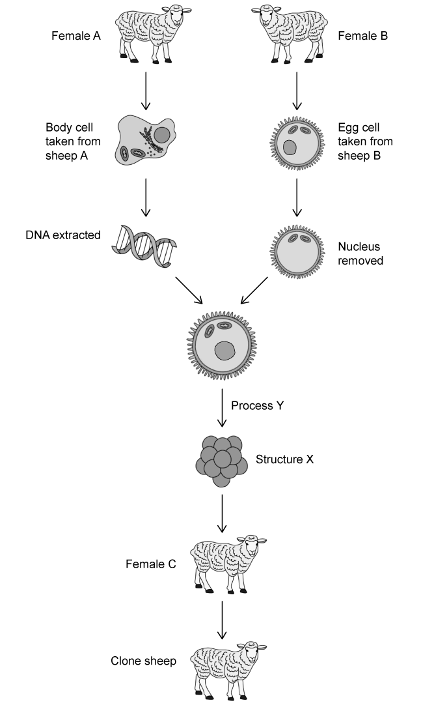
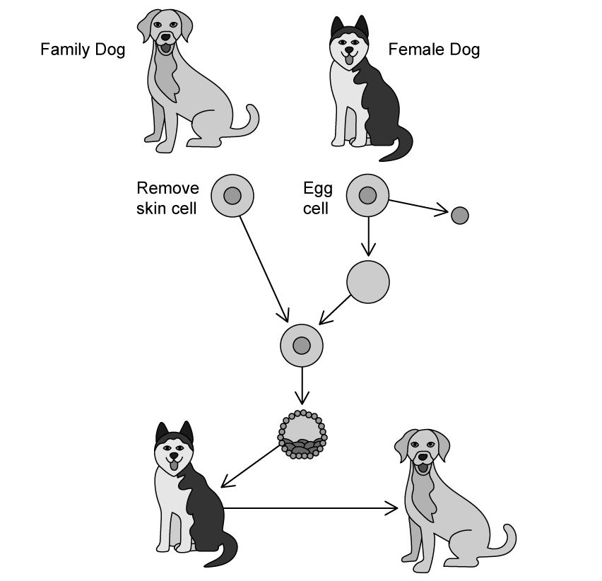
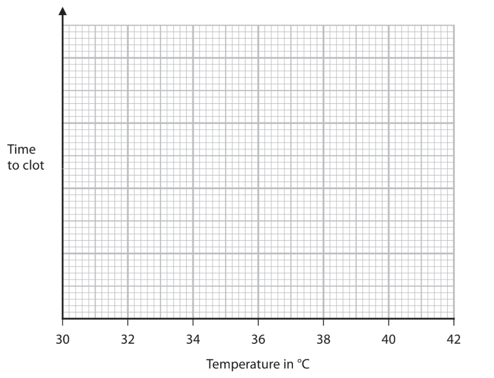
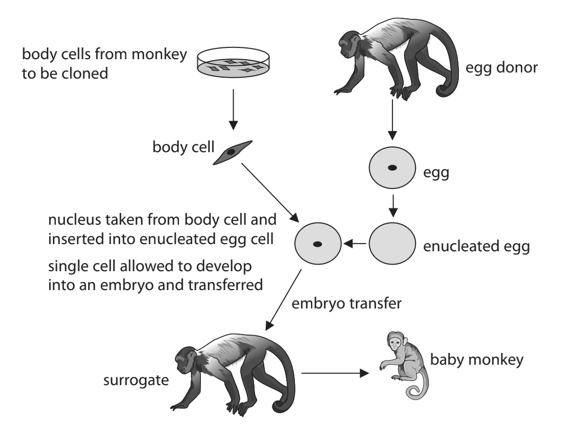
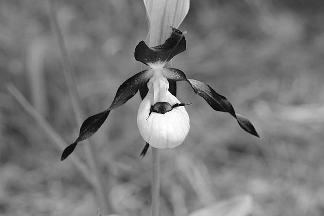
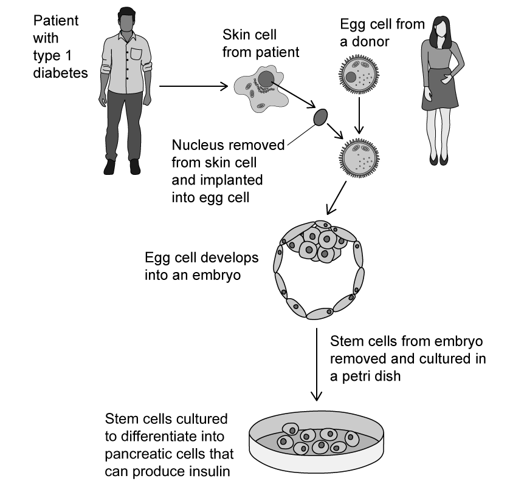
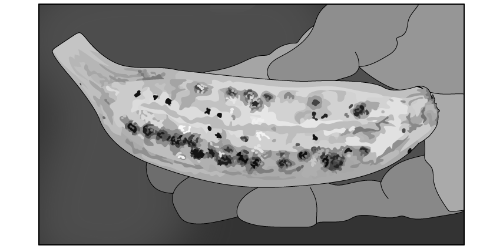

# Exam Questions — Cloning
**5. Use of Biological Resources** · Edexcel IGCSE Biology (4BI1)
> Source: [https://www.savemyexams.com/igcse/biology/edexcel/19/topic-questions/5-use-of-biological-resources/cloning/exam-questions/](https://www.savemyexams.com/igcse/biology/edexcel/19/topic-questions/5-use-of-biological-resources/cloning/exam-questions/) · 12 questions · total 125 marks

## Q1 — easy — 7 marks · exam-questions

### 1() — 2 marks — command: explain — structured
A plantain is a close relative of the banana and an important food crop in African countries.

A plantain is shown in the diagram.

To extend the growing of plantains into other countries and farms, growers in Africa have used micropropagation.

The steps of micropropagation technique are set out below:

| **Step** | **Process** |
|---|---|
| 1 | A piece of plantain is placed in bleach |
| 2 | A small amount of the tissue is cut off and placed on nutrient agar |
| 3 | A callus develops on the agar |
| 4 | Hormones are added to the callus |
| 5 | The callus begins to form roots and shoots |
| 6 | The plantlets are transferred into soil or compost to grow |

Explain the purpose of the bleach in step **1**.

### 2() — 2 marks — command: give — structured
Give the meaning of the term **callus** as set out in step **3** of** **the table in part (a).

### 3() — 2 marks — command: state — structured
State two advantages of the use of micropropagation to extend the growing of plantains in different African countries.

### 4() — 1 mark — command: explain — structured
Small pieces of plant tissue from anywhere in a plant can grow into new individuals during the process of micropropagation.

Explain why small pieces of animal tissue from any part of an animal cannot grow into new individuals.

## Q2 — easy — 11 marks · exam-questions

### 1() — 6 marks — command: complete — structured
Some animals, such as the Javan rhinoceros (*Rhinoceros sondaicus*), are very close to extinction.

A possible method of increasing the number of Javan rhinos would be to clone existing animals. The passage below describes the process of cloning.

Complete the passage by writing a suitable word on each dotted line.

A nucleus is taken from a body ........................ of an adult Javan rhino. This nucleus is put into an enucleated ........................ cell. The cell is given a mild electric shock to help it divide by a type of cell division called ........................ . A ball of cells is produced called an ........................ . The ball of cells is placed into the ........................ of a female rhino.

This female rhino is called a ........................ mother.

### 2() — 2 marks — command: give — structured
Other organisms that can be conserved using cloning include plants.

Plants can be cloned using a method called micropropagation. During micropropagation explants are grown *in vitro*.

(i) Give the meaning of the term **explant.**

**(1)**

(ii) Give the meaning of the term ***in vitro***.

**(1)**

### 3() — 1 mark — command: calculate — structured
One example of an endangered plant that can be conserved by cloning is the African cherry tree, *Prunus africana*.

This plant has some medicinal properties and is particularly popular amongst people who use traditional medicine in the areas where it grows. As a result it has been overharvested in the wild. It has been estimated that 35 000 trees were killed every year for use in traditional medicine throughout the 1990s.

Calculate the number of African cherry trees that were harvested in the years 1991-1997 inclusive.

### 4() — 2 marks — command: state — structured
State one advantage and** **one disadvantage of conserving the African cherry tree using micropropagation.

## Q3 — easy — 8 marks · exam-questions

### 1() — 4 marks — command: multiple — structured
The diagram below shows the process of producing the first cloned animal, Dolly the sheep.

(i) Identify the sheep that is genetically identical to the clone sheep in the diagram above.

**(1)**

| ☐ | **A** | Female A |
|---|---|---|
| ☐ | **B** | Female B |
| ☐ | **C** | Female C |

(ii) Name **structure X** shown in the diagram above.

**(1)**

(iii) Describe the events that occur during **process Y** labelled in the diagram above.

**(2)**

### 2() — 2 marks — command: multiple — structured
Scientists created Dolly the sheep because they were exploring the possibility of producing medicines in the milk of mammals.

For example *Polly* the sheep was a cloned sheep produced by the same people that cloned Dolly, but Polly was genetically modified to produce a protein known as human blood clotting factor IX, which is used to treat people with the disease haemophilia.

The protein could be extracted from Polly's milk.

(i) Suggest why it is useful for the protein to be extracted from the sheep via their milk.

**(1)**

(ii) Give the biological term that can be used to describe Polly the sheep, a genetically modified sheep with DNA from two different species in her genome.

**(1)**

### 3() — 2 marks — command: give — structured
Give two other examples of proteins that can be produced from animals in the way described in part (b).

## Q4 — easy — 8 marks · exam-questions

### 1() — 1 mark — command: give — structured
Give the meaning of the term **clone**.

### 2() — 1 mark — command: identify — structured
There are several different methods used to create clones.

Identify which of the following is a method of producing cloned plants.

| ☐ | **A** | Micropropagation |
|---|---|---|
| ☐ | **B** | Joining male and female sex cells |
| ☐ | **C** | Hand pollination |
| ☐ | **D** | Transferring genes from one plant to another |

### 3() — 5 marks — command: describe — structured
As well as cloning plants, it is also possible to clone animals.

A family has a beloved pet dog that is reaching the end of its life and they are looking into the possibility of cloning their pet dog and raising the puppy.

The diagram shows the process that would be used to clone the dog.

Use information from the diagram and your own knowledge to describe how the process shown above could be used to clone the dog.

### 4() — 1 mark — command: suggest — structured
If the family choose to clone their pet dog they need to take into account the fact that the new dog will not be exactly the same as the old dog.

Suggest why the new dog will not be exactly the same as the old dog.

## Q5 — medium — 11 marks · exam-questions

### 3((a)) — 1 mark — command: state — structured — from paper Jan 2021 · 4BI1/2B
Micropropagation is used to produce plant clones.

The process involves growing explants *in vitro*.

State what is meant by the term ***in vitro***.

### 3((b)) — 8 marks — command: multiple — structured — from paper Jan 2021 · 4BI1/2B
The explants grow new roots and shoots.

A student investigates the effect of pH on the growth of new shoots.

The table shows the student’s results.

| **pH** | **Mean number of shoots per explant** |
|---|---|
| 4.5 | 3.0 |
| 5.0 | 4.8 |
| 5.5 | 5.4 |
| 6.0 | 6.4 |
| 6.5 | 4.3 |

(i) Explain the relationship between pH and the mean number of shoots per explant.

**(2)**

(ii) Describe a procedure the student could use to obtain explants and produce these results.

**(6)**

### 3((c)) — 2 marks — command: give — structured — from paper Jan 2021 · 4BI1/2B
Give two benefits of using micropropagation to produce new plants rather than using seeds.

## Q6 — medium — 11 marks · exam-questions

### 2((a)) — 3 marks — command: multiple — structured — from paper Nov 2020 · 4BI1/2B
Blood clotting is an important process in humans. The process is controlled by enzymes.

(i) Give two reasons why blood clotting is important.

**(2)**

(ii) The optimum temperature for the enzymes involved in blood clotting is 37°C.

Sketch a graph to show how temperature affects the time taken for blood to clot.

**(1)**

### 2((b)) — 8 marks — command: multiple — structured — from paper Nov 2020 · 4BI1/2B
Some people cannot make the proteins needed for blood clotting.

Cloning is used to produce large numbers of transgenic mammals.

These transgenic mammals can make the human blood-clotting proteins. The human blood-clotting proteins can then be removed from the mammals’ milk and injected into people who cannot make the proteins.

(i) Explain why these mammals are described as transgenic.

**(2)**

(ii) Describe how a mammal is cloned.

**(6)**

## Q7 — medium — 7 marks · exam-questions

### 4((a)) — 3 marks — command: multiple — structured — from paper Nov 2021 · 4BI1/2B
Scientists have produced cloned monkeys. The diagram shows the procedure used to produce cloned monkeys

(i) State the meaning of the term enucleated.

**(1)**

(ii) Describe how the single cell develops into an embryo.

**(2)**

### 4((b)) — 4 marks — command: evaluate — structured — from paper Nov 2021 · 4BI1/2B
Scientists can use adult body cells or fetal body cells to clone monkeys.

The table gives information about cloning using body cells from different sources.

| **Source of body cells** | **Number of surrogates used** | **Number of successful pregnancies** | **Offspring produced** |
|---|---|---|---|
| Adult | 42 | 22 | 2 short-lived |
| Fetus | 21 | 6 | 2 healthy |

Evaluate this data to decide which source of body cells is more successful in cloning monkeys.

## Q8 — medium — 10 marks · exam-questions

### 5((a)) — 1 mark — command: calculate — structured — from paper Jan 2021 · 4BI1/2BR
Many mammals have been cloned since Dolly the sheep was produced by cloning in 1996.

It took 277 attempts at cloning to produce one sheep.

Calculate how many attempts would have been needed to produce 50 cloned sheep in 1996.

Assume the same number of attempts are needed to produce each sheep as were needed to produce Dolly.

### 5((b)) — 5 marks — command: describe — structured — from paper Jan 2021 · 4BI1/2BR
Describe the stages used to clone a male dog.

### 5((c)) — 4 marks — command: comment — structured — from paper Jan 2021 · 4BI1/2BR
Pet owners can now pay scientists to use cells from their pet to produce a clone.

The process costs \$50 000 for a dog and \$25 000 for a cat.

Cloning is not always successful and as with Dolly, many attempts may need to be made to produce one clone.

Many scientists disagree with this use of cloning.

Comment on whether cloning of pets is a good idea.

Use the information in this question and your own knowledge to support your answer.

## Q9 — hard — 13 marks · exam-questions

### 1() — 5 marks — command: describe — structured
The lady's slipper orchid (*Cypripedium calceolus*) is extremely rare in the UK. ** **

Björn S..., CC BY-SA 2.0 <https://creativecommons.org/licenses/by-sa/2.0>, via Wikimedia Commons

Conservationists are keen to reintroduce the species into the wild and are using a variety of breeders from around the world to provide plants.

Another method to help with the reintroduction is to produce clones of the orchid which can be planted in the wild.

Describe how micropropagation can be used to produce large numbers of lady's slipper orchid individuals.

### 2() — 3 marks — command: explain — structured
Some people argue that using this method to clone lady's slipper orchids is a good method for growing orchids to use as house plants, but not for reintroduction to the wild.

Explain why cloning lady's slipper orchids in this way may not be a suitable method for producing plants to be reintroduced into the wild.

### 3() — 5 marks — command: multiple — structured
During a conservation attempt, scientists planted 126 Lady's slipper orchids. Of the orchids planted, 13 were still growing a year later while the rest had died.

(i) Calculate the percentage of orchids that survived the year.

**(1)**

(ii) Suggest **two **reasons why so many of the Lady's slipper orchids died in the space of a year.

**(2)**

(iii) The scientists decided to try again and plant more orchids in the area in a second conservation attempt.

Suggest **two **strategies the scientists could use to increase the success of the second attempt.

**(2)**

## Q10 — hard — 11 marks · exam-questions

### 1() — 2 marks — command: describe — structured
Describe how plants are able to reproduce asexually without human intervention.

### 2() — 3 marks — command: describe — structured
Micropropagation is a form of asexual reproduction in plants.

Describe how the asexual reproduction you described in part (a) compares with micropropagation.

### 3() — 6 marks — command: design — structured
Design an investigation to find out whether adding more amino acids to nutrient media during micropropagation affects the growth of the new plants.

Your answer should include experimental details and be written in full sentences.

## Q11 — hard — 16 marks · exam-questions

### 1() — 5 marks — command: multiple — structured
New medical technologies have the potential to use human stem cells to treat patients with previously incurable diseases, such as type 1 diabetes.

The diagram below shows one such strategy.

(i) Describe how the process shown in the diagram compares with the method used to clone mammals, such as Dolly the sheep.

**(4)**

(ii) Name **one** other condition that could theoretically be treated using this method.

**(1)**

### 2() — 3 marks — command: explain — structured
It is thought that the method shown in part (a) will be better for patients than using stem cells taken from a human donor, e.g. umbilical cord cells.

Explain the benefit of using cells produced by the method shown in (a) rather than cells from a human donor.

### 3() — 2 marks — command: state — structured
State two** **reasons why some people may be concerned about using stem cells in the way shown in part (a).

### 4() — 6 marks — command: design — structured
The unfertilised eggs from a donor, shown in part (a), can be stored in a special nutrient solution before they are combined with a skin cell nucleus.

Design an investigation to find the best storage temperature for the survival of the unfertilised eggs.

Your answer should include experimental details and be written in full sentences.

## Q12 — hard — 12 marks · exam-questions

### 1() — 4 marks — command: explain — structured
There are a number of wild species of banana that contain large seeds in their fruits, as shown in** **the diagram below.

The varieties of banana that humans consume do not have large seeds, which improves the experience of eating them.

Seeds play an important role in sexual reproduction in plants and therefore it is not possible for any species to naturally evolve to produce seedless fruit.

Explain how it is possible for humans to develop varieties of bananas without seeds.

### 2() — 4 marks — command: discuss — structured
Bananas without seeds cannot reproduce sexually.

A low-income farmer who grows bananas in rural South America must decide whether to use cuttings or micropropagation to produce new plants for his farm.

Discuss which method would be the most suitable for the farmer to use.

### 3() — 4 marks — command: explain — structured
A type of fungal pathogen called *Fusarium oxysporum *infects banana plants and causes a disease called Panama disease. The fungal spores live in the soil and can pass from plant to plant in water droplets.

A variant of banana called Cavendish accounts for around 99 % of all banana exports to developed countries.

The Cavendish banana is vulnerable to Panama disease.

Using information from the question and your own knowledge, explain why this disease poses such a large threat to crop varieties of banana plants.
