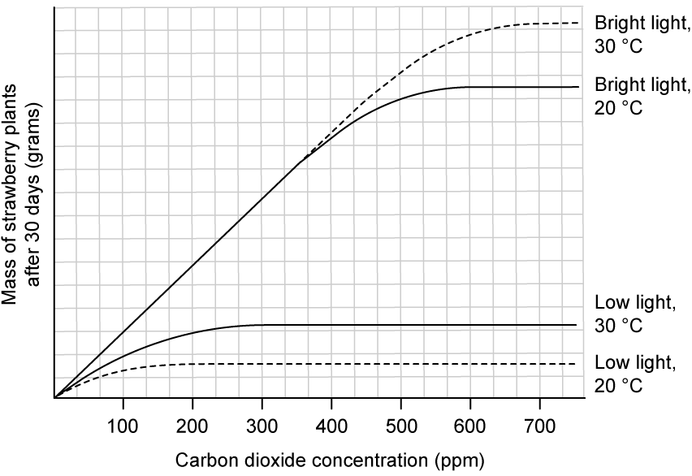
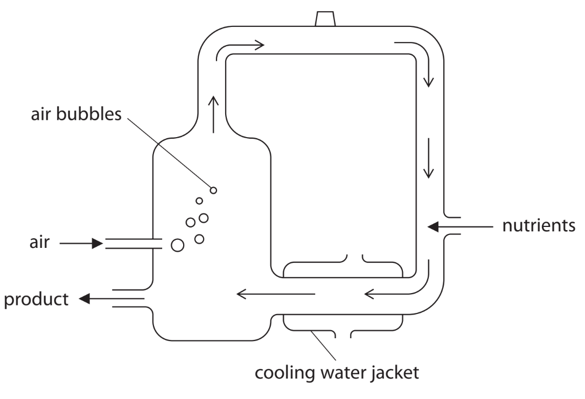
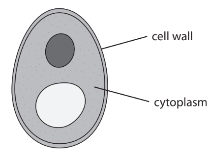
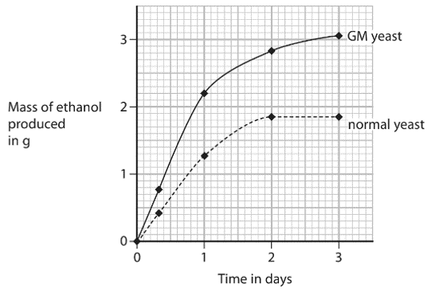
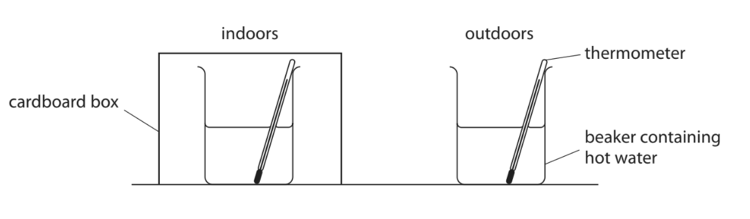
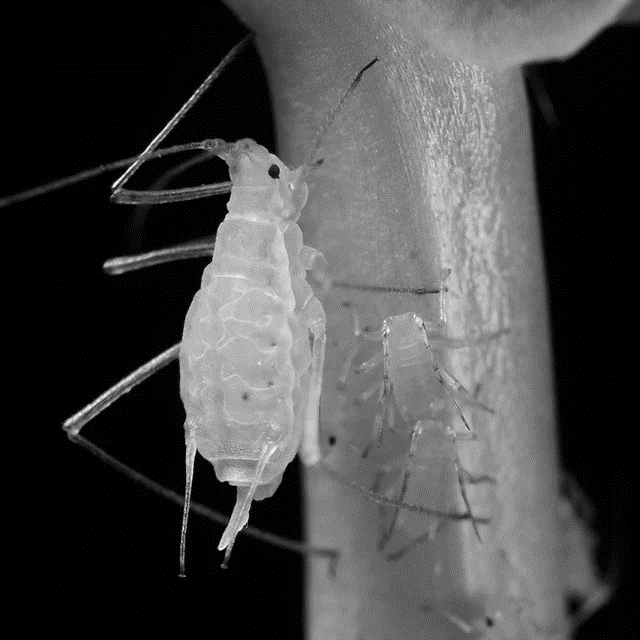
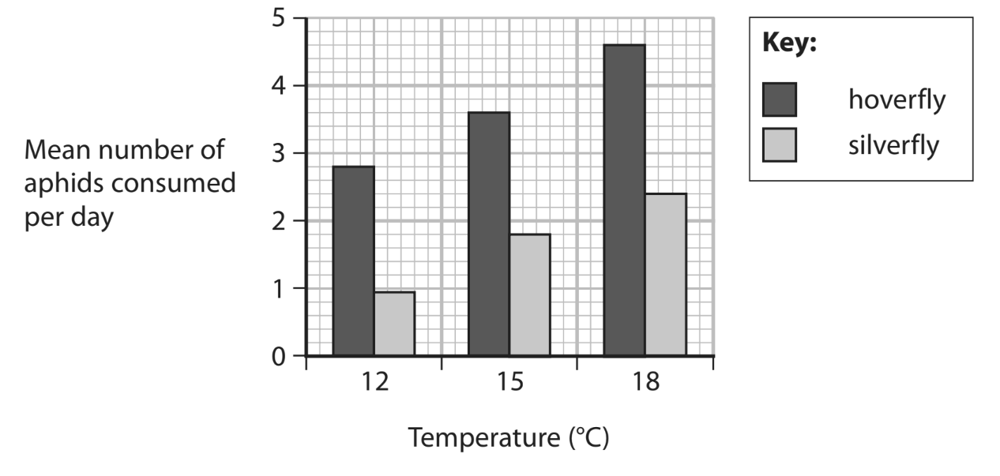
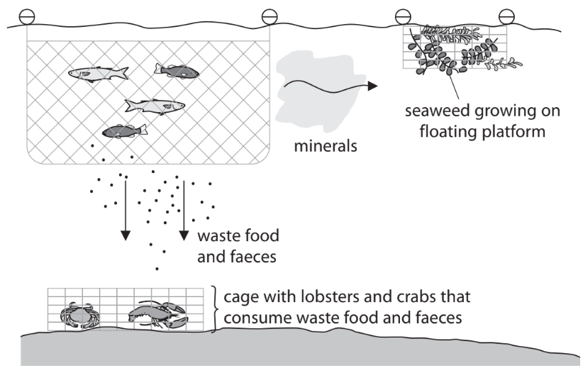
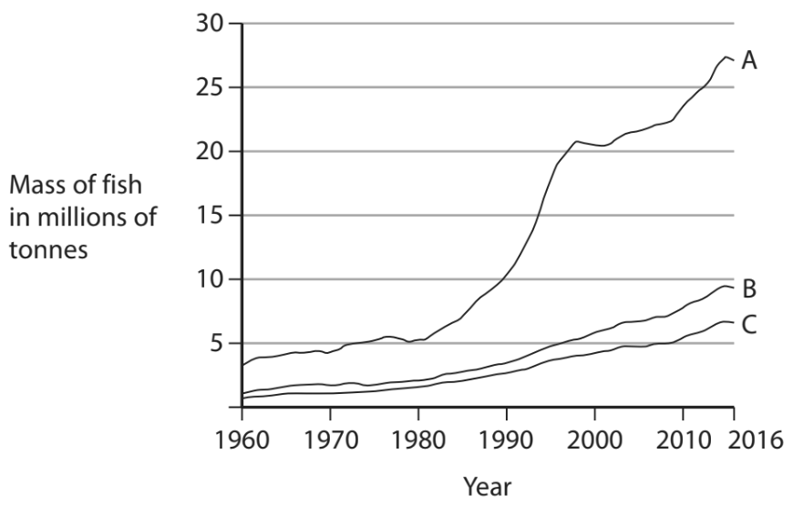
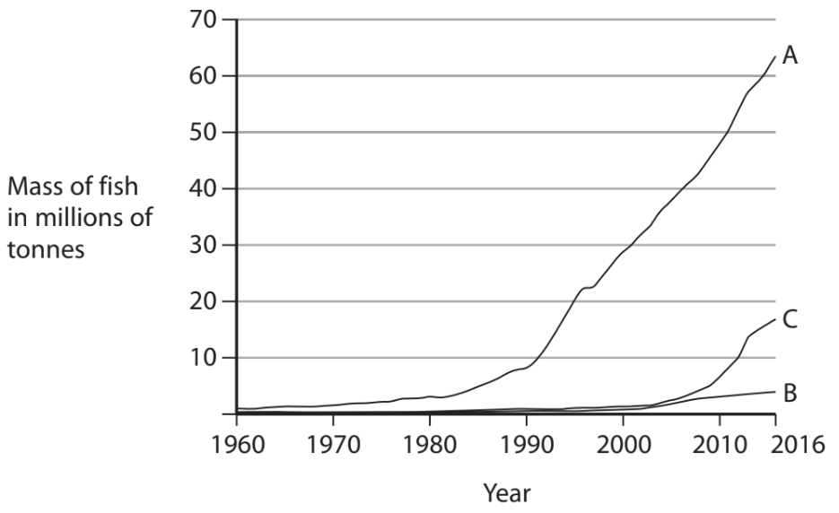

# Exam Questions — Food Production
**5. Use of Biological Resources** · Edexcel IGCSE Biology (4BI1)
> Source: [https://www.savemyexams.com/igcse/biology/edexcel/19/topic-questions/5-use-of-biological-resources/food-production/exam-questions/](https://www.savemyexams.com/igcse/biology/edexcel/19/topic-questions/5-use-of-biological-resources/food-production/exam-questions/) · 17 questions · total 169 marks

## Q1 — easy — 10 marks · exam-questions

### 7((a)) — 2 marks — command: describe — structured — from paper Nov 2020 · 4BI1/1B
The table gives the masses of protein and lipid (fat) in the same volume of milk from a cow and from a human.

|   | **Protein in g** | **Lipid in g** |
|---|---|---|
| Cow | 3.3 | 3.9 |
| Human | 1.3 | 4.1 |

Describe how you would test a sample of cow’s milk and a sample of human milk to show they contain different masses of protein.

### 7((b)) — 2 marks — command: explain — structured — from paper Nov 2020 · 4BI1/1B
Some of the proteins in milk are antibodies.

Explain why antibodies in milk are useful for babies.

### 7((c)) — 2 marks — command: give — structured — from paper Nov 2020 · 4BI1/1B
Give **two** ways that lipid in milk is used by babies.

### 7((d)) — 4 marks — command: multiple — structured — from paper Nov 2020 · 4BI1/1B
Milk is used to make yoghurt.

(i) Name the carbohydrate in milk used to make yoghurt.

**(1)**

(ii) Name the bacteria added to milk to make yoghurt.

**(1)**

(iii) Explain why milk needs to be heated to a high temperature at the start of the process for making yoghurt.

**(2)**

## Q2 — easy — 8 marks · exam-questions

### 1() — 2 marks — command: explain — structured
A vegetable producer is setting up his greenhouse.

He is given advice from two friends on the correct conditions to maximise vegetable production in the greenhouse.

- Friend** X **suggested that he provide plenty of water to his vegetables but should cover all the windows in black card to stop the plants getting too hot.
- Friend** Y **suggested that he provide plenty of water and open the windows of the greenhouse but did not suggest covering them.

Explain whether the farmer should follow the advice of friend **X** or friend **Y**.

### 2() — 2 marks — command: give — structured
The graph below shows how the rate of photosynthesis of strawberry plants is affected by changes in **three** limiting factors.

Give a definition of the term **limiting factor **in the context of the graph above.

### 3() — 2 marks — command: explain — structured
In the graph in part (b) 'mass of strawberry plants' is used to represent the rate of photosynthesis.

Explain why plant mass can be used to assess the rate of photosynthesis.

### 4() — 2 marks — command: multiple — structured
The producer in part (a) decided to use the graph in part (b) as a guide when deciding how to set up his greenhouse. He decided to use bright light and to heat the greenhouse to 20 °C.

(i) Suggest the carbon dioxide concentration that the producer should choose.

**(1)**

(ii) Explain your answer to part (i).

**(1)**

## Q3 — easy — 9 marks · exam-questions

### 1() — 2 marks — command: explain — structured
Farmers often use chemicals or organic fertilisers on their crops.

Explain why fertilisers are needed.

### 2() — 2 marks — command: draw — structured
The diagram below contains information about several components that may be found in fertilisers.

Draw lines from the fertiliser components to the correct role of each component.

| Nitrates |   | Building DNA and cell membranes |
|---|---|---|
| Phosphates |   | Building proteins |
| Magnesium |   | Producing chlorophyll |

### 3() — 4 marks — command: complete — structured
In addition to fertilisers, farmers often need to use a form of pest control, e.g. to control insect pests.

Complete the table below to give an advantage and a disadvantage of chemical and biological pest control.

|   | **Advantage** | **Disadvantage** |
|---|---|---|
| Chemical pest control |   |   |
| Biological pest control |   |   |

### 4() — 1 mark — command: suggest — structured
Insects are one example of an organism that can cause damage to crops.

Suggest one other type of organism that farmers may need to protect their crops against.

## Q4 — easy — 6 marks · exam-questions

### 1() — 1 mark — command: state — structured
The diagram below shows some apparatus set up to investigate anaerobic respiration in yeast.

State the name given to anaerobic respiration in yeast in the context of beer and wine production.

### 2() — 1 mark — command: identify — structured
Identify the gas in the bubbles produced by the yeast in the diagram in part (a).

### 3() — 2 marks — command: suggest — structured
Suggest why the yeast shown in the diagram in part (a) has been covered in paraffin.

### 4() — 2 marks — command: name — structured
The investigation in part (a) was set up in water baths at several different temperatures in order to study the effect of temperature on anaerobic respiration in yeast.

Name two variables that would need to be kept constant in the investigation described.

## Q5 — medium — 16 marks · exam-questions

### 5((a)) — 4 marks — command: explain — structured — from paper Jan 2022 · 4BI1/1BR
Mycoprotein is a protein produced by fungi that can be made into meat substitutes.

Large amounts of fungus are grown in fermenters to produce the mycoprotein.

The diagram shows a typical mycoprotein fermenter.

(i) Explain why air is bubbled into the fermenter.

**(2)**

(ii) Explain why the fermenter is cleaned using steam before the fungus and nutrients are added.

**(2)**

### 5((b)) — 12 marks — command: multiple — structured — from paper Jan 2022 · 4BI1/1BR
A scientist investigates the production of mycoprotein by a genetically modified (GM) fungus and a non-genetically modified fungus (non-GM).

The scientist claims that the GM fungus will be better for large-scale production of mycoprotein.

The scientist measures the mass of mycoprotein produced by the fungi in fermenters for 30 days.

The table shows the scientist’s results.

| **Time in days** | **Mass of mycoprotein produced in kg** |   |
|---|---|---|
| **GM fungus** | **Non-GM fungus** |   |
| 5 | 130 | 125 |
| 10 | 220 | 190 |
| 15 | 330 | 270 |
| 20 | 420 | 360 |
| 30 | 430 | 460 |

(i) Plot a line graph to show how the mass of mycoprotein changes over the 30 days for each type of fungus.

Use a ruler to join the points with straight lines.

**(5)**

(ii) The scientist claims that the GM fungus will be better for large-scale production of mycoprotein than the non-GM fungus.

Comment on the scientist’s claim.

**(2)**

(iii) The table shows the nutritional composition of mycoprotein and the nutritional composition of lamb.

| **Nutritional component** | **Mass of nutritional component in 100 grams of food in grams** |   |
|---|---|---|
| **Mycoprotein** | **Lamb** |   |
| Protein | 10.5 | 20.2 |
| Cholesterol | 0.0 | 0.1 |
| Fat | 3.0 | 25.5 |
| Fibre | 6.0 | 0.7 |
| Iron | 0.00039 | 0.0025 |
| Calcium | 0.048 | 0.010 |

Discuss whether eating mycoprotein is more healthy than eating lamb for a growing human.

**(5)**

## Q6 — medium — 10 marks · exam-questions

### 5((a)) — 2 marks — command: explain — structured — from paper Jan 2022 · 4BI1/1B
Scientists carry out an experiment to see if reducing the availability of oxygen affects the production of yoghurt.

They use increasing acidity as a measure of yoghurt production.

They record the acidity of two cultures, one with a reduced oxygen level and one with a normal oxygen level, over 210 minutes.

The table shows their results.

| **Time in minutes** | **Acidity (%)** |   |
|---|---|---|
| **Reduced oxygen level** | **Normal oxygen level** |   |
| 0 | 0.20 | 0.20 |
| 30 | 0.22 | 0.22 |
| 60 | 0.25 | 0.24 |
| 90 | 0.40 | 0.25 |
| 120 | 0.50 | 0.31 |
| 150 | 0.62 | 0.41 |
| 180 | 0.70 | 0.51 |
| 210 | 0.70 | 0.70 |

Explain why increasing acidity can be used as a measure of yoghurt production.

### 5((b)) — 1 mark — command: give — structured — from paper Jan 2022 · 4BI1/1B
Give one abiotic variable that the scientists should control in their experiment.

### 5((c)) — 7 marks — command: multiple — structured — from paper Jan 2022 · 4BI1/1B
(i) Plot a line graph to show how the percentage acidity changes over the period of 210 minutes for the reduced oxygen level and for the normal oxygen level.

Use a ruler to join the points with straight lines.

**(5)**

(ii) Explain why the changes in percentage acidity are different in the reduced oxygen level and in the normal oxygen level cultures.

**(2)**

## Q7 — medium — 11 marks · exam-questions

### 4((a)) — 2 marks — command: state — structured — from paper Nov 2021 · 4BI1/1B
A balanced diet contains the correct proportion of vitamins.

The table lists the functions of some vitamins.

Complete the table by stating the correct vitamins.

The first one has been done for you.

| **Function of vitamin ** | **Vitamin** |
|---|---|
| Prevents scurvy | C |
| Improves vision |   |
| Helps bone growth |   |

### 4((b)) — 9 marks — command: multiple — structured — from paper Nov 2021 · 4BI1/1B
Yeast is used to make bread.

A student investigates the effect of vitamin C on the growth of yeast cells.

This is his method.

- Put 0.50 g of yeast into a flask containing 200 cm3 of glucose solution and add 0.10 g of vitamin C.
- Put 0.50 g of yeast into another flask containing 200 cm3 of glucose solution without vitamin C.
- Measure the dry mass of yeast in each flask after 30 hours

The table shows the student’s results.

| **Time in hours** | **Dry mass of yeast in g** |   |
|---|---|---|
| **With vitamin C** | **Without vitamin C** |   |
| 0 | 0.50 | 0.50 |
| 30 | 7.10 | 6.50 |

(i) The student calculates that the mean rate of yeast growth with vitamin C is 0.22 g per hour.

Calculate the mean rate of yeast growth without vitamin C.

Give your answer in g per hour.

**(2)**

(ii) Suggest how to find the dry mass of yeast in each flask.

**(2)**

(iii) State the dependent variable in this investigation.

**(1)**

(iv) The method gives some variables that the student controlled.

Justify two other variables the student should control.

**(4)**

## Q8 — medium — 11 marks · exam-questions

### 4((a)) — 2 marks — command: which — structured — from paper June 2021 · 4BI1/1B
The diagram shows a yeast cell.

(i) Which row of the table is correct for this yeast cell?

**(1)**

|   | ** ** | **Substance in cell wall** | **Substance stored in cytoplasm** |
|---|---|---|---|
| ☐ | **A** | cellulose | glycogen |
| ☐ | **B** | cellulose | starch |
| ☐ | **C** | chitin | glycogen |
| ☐ | **D** | chitin | starch |

(ii) Which type of organism is a yeast cell?

**(1)**

| ☐ | **A** | A bacterium |
|---|---|---|
| ☐ | **B** | A fungus |
| ☐ | **C** | A plant |
| ☐ | **D** | A protoctist |

### 4((b)) — 5 marks — command: multiple — structured — from paper June 2021 · 4BI1/1B
Biofuel is made from ethanol.

Scientists use genetically modified (GM) yeast to produce biofuel.

The GM yeast contains an enzyme that digests plant cell walls to produce glucose.

The yeast uses the glucose in respiration to produce ethanol.

(i)  Which of these equations shows the respiration in the yeast?

**(1)**

| ☐ | **A** | Glucose → ethanol |
|---|---|---|
| ☐ | **B** | Glucose → ethanol + carbon dioxide |
| ☐ | **C** | Glucose + oxygen → ethanol |
| ☐ | **D** | Glucose + oxygen → ethanol + carbon dioxide |

(ii) Name an enzyme used by scientists to genetically modify the yeast.

**(1)**

(iii) The GM yeast is a recombinant strain.

State what is meant by the term **recombinant**.

**(1)**

(iv) Suggest why biofuel produced using glucose from plants could reduce global warming.

**(2)**

### 4((c)) — 4 marks — command: multiple — structured — from paper June 2021 · 4BI1/1B
The graph shows the mass of ethanol produced by GM yeast and by normal yeast over a period of 3 days.

(i) Calculate the percentage increase in the mass of ethanol produced by GM yeast compared to normal yeast after 1 day.

**(2)**

(ii) Give two reasons why the rate of ethanol production decreases after 1 day.

**(2)**

## Q9 — medium — 10 marks · exam-questions

### 5((a)) — 1 mark — command: give — structured — from paper Jan 2021 · 4BI1/1B
Farmers can keep their animals indoors or outdoors.

A student uses this apparatus to compare the heat loss from animals kept indoors and outdoors.

He uses a covered beaker to represent animals indoors and an uncovered beaker to represent animals outdoors.

This is the student’s method.

- Pour 200 cm3 of hot water into each beaker
- Measure the temperature of the water in each beaker
- Cover one beaker with a cardboard box
- Measure the temperature of the water in each beaker after 30 minutes

The student repeats the investigation six times and calculates the mean temperature of the water for each beaker.

The table shows the student’s results.

| **Time in minutes** | **Mean temperature of water in °C** |   |
|---|---|---|
| **Uncovered** | **Covered** |   |
| 0 | 80 | 80 |
| 30 | 40 | 44 |

Give the dependent variable in this investigation.

### 5((b)) — 1 mark — command: give — structured — from paper Jan 2021 · 4BI1/1B
Give one reason why the student uses the same volume of water in each beaker.

### 5((c)) — 2 marks — command: calculate — structured — from paper Jan 2021 · 4BI1/1B
Calculate the difference between the percentage decrease in temperature for the uncovered beaker and the percentage decrease in temperature for the covered beaker.

### 5((d)) — 4 marks — command: discuss — structured — from paper Jan 2021 · 4BI1/1B
The student concludes that it is better for farmers to keep their animals indoors.

Discuss this conclusion.

### 5((e)) — 2 marks — command: describe — structured — from paper Jan 2021 · 4BI1/1B
Describe how the student could modify his investigation to find out if an animal’s body size affects heat loss.

## Q10 — medium — 11 marks · exam-questions

### 8((a)) — 1 mark — command: state — structured — from paper Jan 2021 · 4BI1/1B
The table shows data on crops grown and pesticide used in Norway in 2011.

| **Crop type** | **Crop** | **Total area in km****2** | **Percentage of area sprayed with each type of pesticide (%)** |   |   |
|---|---|---|---|---|---|
| **herbicide ** | **fungicide** | **insecticide** |   |   |   |
| Vegetable | potato | 128 | 92 | 88 | 40 |
| onion | 7 | 99 | 96 | 26 |   |
| carrot | 13 | 93 | 42 | 73 |   |
|   |   |   |   |   |   |
| fruit | strawberry | 14 | 72 | 87 | 80 |
| apple | 13 | 56 | 80 | 70 |   |
|   |   |   |   |   |   |
| meadows | meadows for mowing and pastures | 6207 | 6 | - | - |
|   |   |   |   |   |   |
| cereals | barley | 1450 | 91 | 64 | 10 |
| oats | 694 | 94 | 24 | 4 |   |
| spring wheat | 588 | 98 | 86 | 27 |   |
| winter wheat | 139 | 96 | 85 | 7 |   |

State what is meant by the term **pesticide**.

### 8((b)) — 2 marks — command: show — structured — from paper Jan 2021 · 4BI1/1B
Determine which crop had the largest area sprayed with herbicide.

Show your working.

### 8((c)) — 2 marks — command: suggest — structured — from paper Jan 2021 · 4BI1/1B
Suggest why spring and winter wheat have different percentages of insecticide applied to them.

### 8((d)) — 4 marks — command: discuss — structured — from paper Jan 2021 · 4BI1/1B
Discuss the different combinations of pesticides applied to fruit and cereal crops.

### 8((e)) — 2 marks — command: explain — structured — from paper Jan 2021 · 4BI1/1B
Explain an alternative to insecticide that a farmer could use.

## Q11 — medium — 6 marks · exam-questions

### 11() — 6 marks — command: design — structured — from paper Jan 2021 · 4BI1/1B
Bread can be produced from flour using yeast.

Design an investigation to find out if changing the starch content of the flour causes the bread to expand more.

Your answer should include experimental details and be written in full sentences.

## Q12 — medium — 13 marks · exam-questions

### 9((a)) — 11 marks — command: multiple — structured — from paper Nov 2020 · 4BI1/1B
The table shows the production of wheat and barley in the United Kingdom from 2011 to 2015.

| **Crop** | **Crop production in thousand tonnes per year** |   |   |   |   |
|---|---|---|---|---|---|
| **2011** | **2012** | **2013** | **2014** | **2015** |   |
| Wheat | 15 300 | 13 200 | 11 900 | 16 600 | 16 100 |
| Barley | 5 500 | 5 500 | 7 100 | 6 900 | 7 300 |

(i) Plot a line graph to show the changes in wheat and barley production from 2011 to 2015.

Use a ruler to join the points with straight lines.

**(6)**

(ii) Describe the changes in the production of each crop from 2011 to 2015.

**(2)**

(iii) Determine which of the crops had the greatest percentage change in production from 2011 to 2015.

Show your working.

**(3)**

### 9((b)) — 2 marks — command: calculate — structured — from paper Nov 2020 · 4BI1/1B
A wheat field, 100 m by 100 m, can produce a total yield of 25 000 kg of carbohydrate in a year.

Calculate the mean mass, in grams, of carbohydrate produced **each day** by a square metre of the wheat field.

## Q13 — medium — 1 marks · exam-questions

### 1() — 1 mark — command: name — structured
Maize is an important food crop grown in many parts of the world.

Drought (a long period with very little rainfall) can reduce crop yield.

Scientists are developing drought-resistant maize plants to improve food security in areas affected by climate change.

Name one other factor that can affect crop yields.

## Q14 — hard — 12 marks · exam-questions

### 10((a)) — 1 mark — command: which — structured — from paper Jan 2022 · 4BI1/1B
Farmers sometimes use biological control to reduce the damage to their crops caused by pests such as insects.

Which of these is an advantage of using biological control over chemical control?

| ☐ | **A** | It lasts a short time. |
|---|---|---|
| ☐ | **B** | It leads to bioaccumulation. |
| ☐ | **C** | It is specific. |
| ☐ | **D** | It is quicker. |

### 10((b)) — 6 marks — command: multiple — structured — from paper Jan 2022 · 4BI1/1B
Aphids are tiny insects that have very sharp mouthparts. They push these mouthparts into the phloem found in stems. They then feed on the phloem contents.

Shipher Wu and Gee-way Lin, National Taiwan University, CC BY 2.5 <https://creativecommons.org/licenses/by/2.5>, via Wikimedia Commons

(i) Name two substances the aphids obtain from the phloem.

**(2)**

(ii) Explain how aphids feeding from the phloem of crop plants can lead to a reduction in yield.

**(4)**

### 10((c)) — 5 marks — command: discuss — structured — from paper Jan 2022 · 4BI1/1B
Silverflies and hoverflies are two species of insect whose larvae feed on aphids.

Scientists investigate the feeding behaviour of these species in a laboratory experiment.

This is the scientists’ method.

- Place a single silverfly in a container
- Place a single hoverfly in a separate container
- Keep the containers at 12 °C
- Put 30 aphids in each container
- Count the number of aphids consumed each day for several days
- Determine the mean number of aphids consumed per day

The scientists repeat the method at two higher temperatures.

The graph shows the scientists’ results.

The scientists conclude that the hoverfly is the most effective biological control agent for aphids.

Discuss the scientists' conclusion, referring to information in the graph and the scientists' method in your answer.

## Q15 — hard — 16 marks · exam-questions

### 7((a)) — 10 marks — command: multiple — structured — from paper Jan 2021 · 4BI1/1BR
In some countries, snails are farmed as a source of protein.

The image below shows a snail.

A scientist investigates the effect of temperature on the growth of snails.

The scientist measures the mean (average) shell height of groups of snails kept at three different temperatures for 24 weeks.

The table shows the scientist’s results.

| **Time in weeks** | **Mean Shell height in mm** |   |   |
|---|---|---|---|
| **at 8 °C** | **at 15 °C** | **at 23 °C** |   |
| 0 | 15.0 | 15.0 | 15.0 |
| 8 | 15.2 | 15.8 | 17.0 |
| 16 | 15.5 | 16.8 | 20.4 |
| 24 | 16.4 | 18.2 | 21.8 |

(i) Plot a line graph to show how the mean shell height increases with time for each temperature.

Use a ruler to join the points with straight lines.

**(5)**

(ii) Explain the effect of temperature on the growth of snails in this investigation.

**(3)**

(iii) State the dependent variable in the investigation.

**(1)**

(iv) State how the scientist made sure their results were reliable.

**(1)**

### 7((b)) — 4 marks — command: multiple — structured — from paper Jan 2021 · 4BI1/1BR
Assimilation efficiency is the percentage of food that is eaten and not egested as faeces.

Assimilation efficiency is calculated using this formula.

`assimulation space efficiency space open parentheses percent sign close parentheses space equals space open parentheses fraction numerator mass space of space food space eaten space minus space mass space of space faeces space egested over denominator mass space of space food space eaten end fraction close parentheses space cross times space 100`

(i) A snail eats 1.2 g of food and produces 0.30 g of faeces.

Calculate the assimilation efficiency of this snail.

**(2)**

(ii) Explain why the assimilation efficiency of a primary consumer is less than the assimilation efficiency of a secondary consumer.

**(2)**

### 7((c)) — 2 marks — command: suggest — structured — from paper Jan 2021 · 4BI1/1BR
The production efficiency of an animal is the percentage of assimilated food that is made into new biomass.

The table shows the production efficiency of a mammal and a snail, both of which are primary consumers.

| **Animal** | **Product efficiency (%)** |
|---|---|
| Mammal | 2 |
| Snail | 35 |

Suggest why there is a difference in the production efficiency of the mammal and the snail.

## Q16 — hard — 9 marks · exam-questions

### 4((a)) — 2 marks — command: explain — structured — from paper Jan 2022 · 4BI1/2B
Fish farming is often used to produce protein rich food.

Selective breeding is often used to produce fish that grow rapidly and do not waste much food.

Explain how selective breeding can be used to produce fish that grow rapidly.

### 4((b)) — 2 marks — command: describe — structured — from paper Jan 2022 · 4BI1/2B
#### Separate: Biology Only

Fish farming systems can often release ammonia into the water. The ammonia is converted into nitrates.

Describe how ammonia is converted into nitrates.

### 4((c)) — 5 marks — command: explain — structured — from paper Jan 2022 · 4BI1/2B
#### Separate: Biology Only

Multi‐trophic level aquaculture is a method of fish farming that has been developed to reduce environmental pollution and increase profits.

The diagram shows a multi‐trophic level aquaculture system.

Explain how the multi‐trophic level aquaculture system reduces environmental pollution and increases the profits of fish farming.

Use information from the diagram and your own knowledge to support your answer.

## Q17 — hard — 10 marks · exam-questions

### 5((a)) — 5 marks — command: comment — structured — from paper Jan 2022 · 4BI1/2BR
#### Separate: Biology Only

Graph 1 shows the mass of fish caught by traditional fishing in tonnes from 1960 to 2016 in three countries.

**Graph 1**

Graph 2 shows the mass of fish produced by fish farming from 1960 to 2016 in the same three countries.

**Graph 2**

Comment on the changes in the mass of fish caught by traditional fishing and the mass of fish produced by fish farming from 1960 to 2016.

Use information from the graphs to support your answer.

### 5((b)) — 5 marks — command: explain — structured — from paper Jan 2022 · 4BI1/2BR
#### Separate: Biology Only

Explain the methods a fish farmer can use to maximise production of fish.
