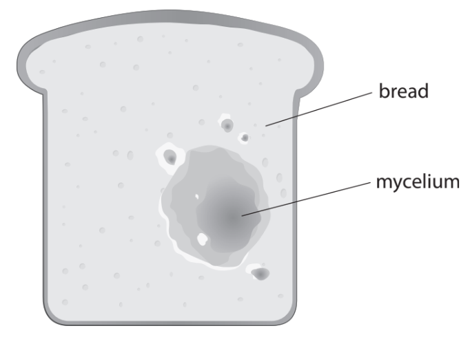
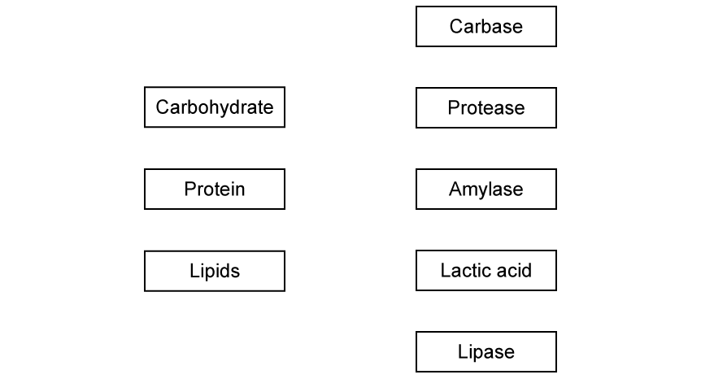
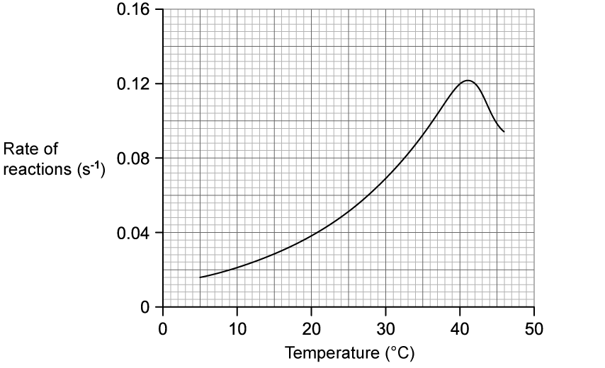
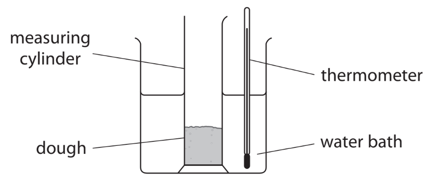
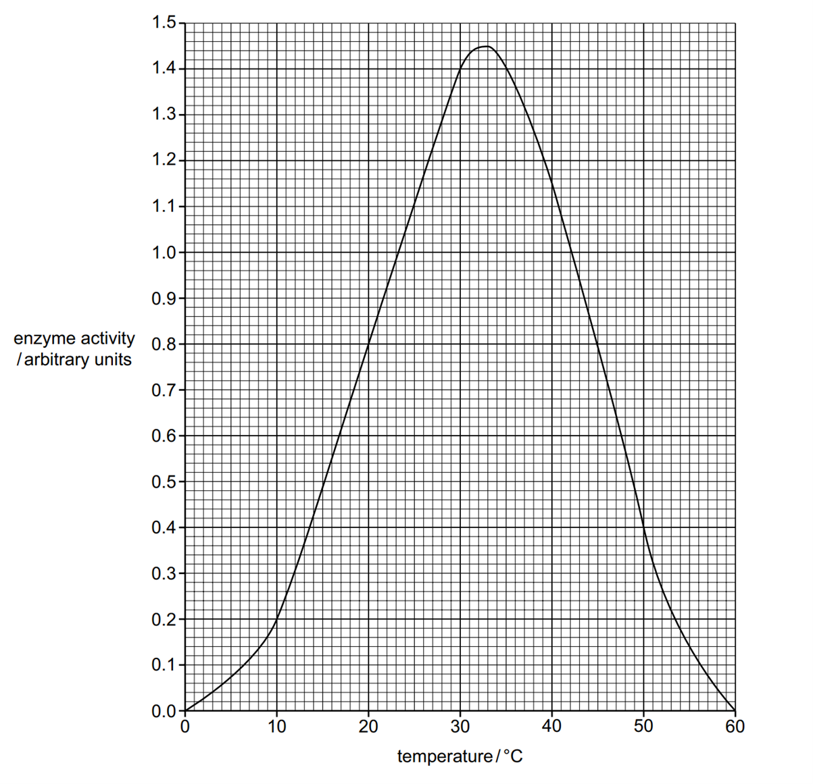
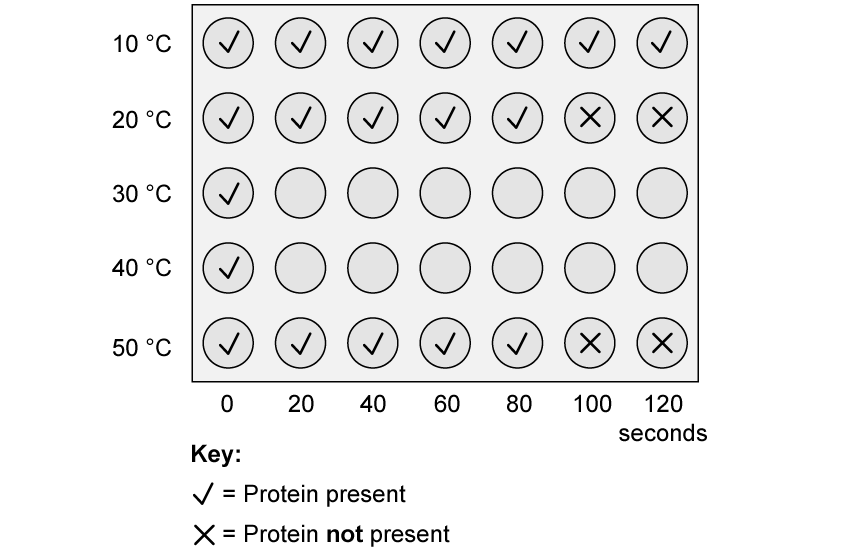
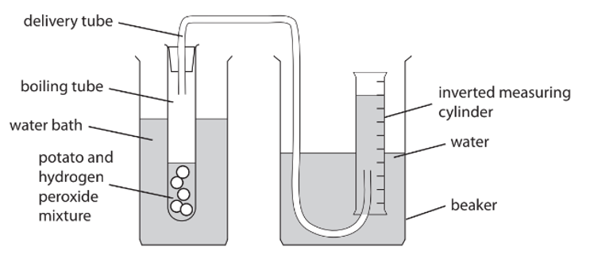
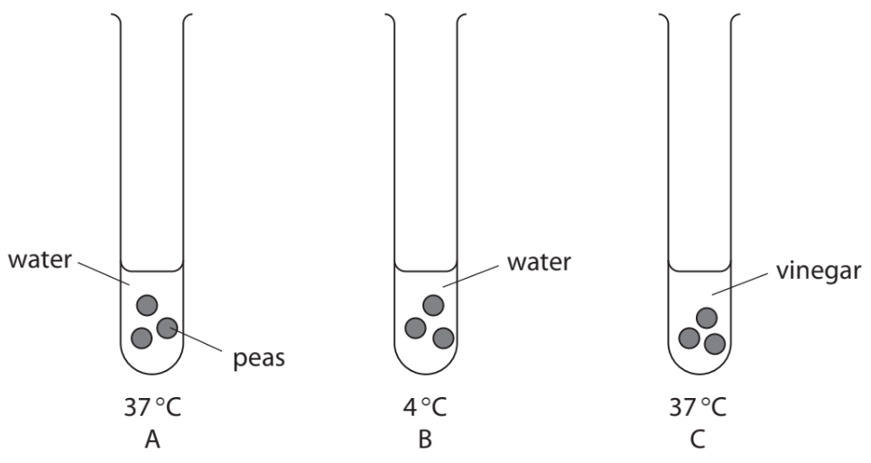
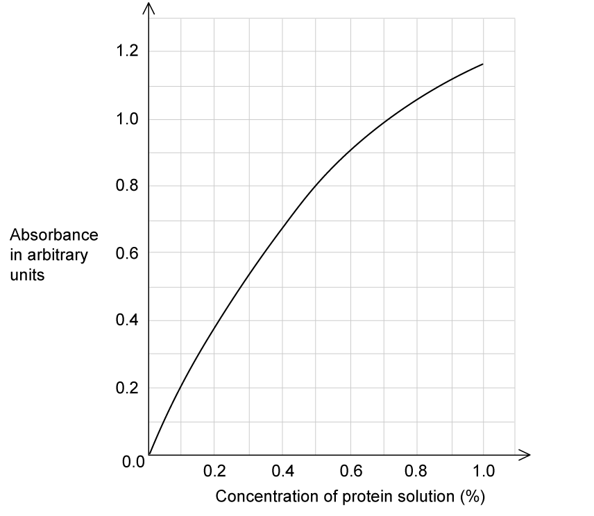
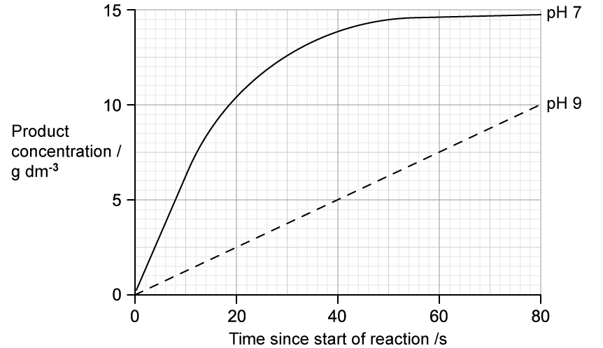

# Exam Questions — Biological Molecules
**2. Structure & Functions in Living Organisms: Part 1** · Edexcel IGCSE Biology (Modular) (4XBI1) — 24/Unit 1
> Source: [https://www.savemyexams.com/igcse/biology/edexcel/modular/24/unit-1/topic-questions/structure-and-functions-in-living-organisms-part-1/biological-molecules/exam-questions/](https://www.savemyexams.com/igcse/biology/edexcel/modular/24/unit-1/topic-questions/structure-and-functions-in-living-organisms-part-1/biological-molecules/exam-questions/) · 15 questions · total 131 marks

## Q1 — easy — 4 marks · exam-questions

### 1((a)) — 2 marks — command: describe — structured — from paper Nov 2021 · 4BI1/1B
Bread contains starch.

Describe how you would test a piece of bread to show it contains starch.

### 1((b)) — 2 marks — command: which — structured — from paper Nov 2021 · 4BI1/1B
The diagram shows the mycelium of an organism growing on a piece of bread.

(i) Which type of organism is shown growing on the bread?

**(1)**

| **A** | Bacterium |
|---|---|
| **B** | Fungus |
| **C** | Protoctist |
| **D** | Virus |

(ii) Which enzyme is released by the organism to digest starch?

**(1)**

| **A** | Amylase |
|---|---|
| **B** | Ligase |
| **C** | Lipase |
| **D** | Protease |

## Q2 — easy — 8 marks · exam-questions

### 1() — 3 marks — command: name — structured
The image shows three different biological molecules.

Name the biological molecules represented by **X**, **Y** and **Z**.

### 2() — 1 mark — command: name — structured
Name one element found in all three of the biological molecules shown in part (a).

### 3() — 4 marks — command: multiple — structured
With reference to molecule** Z** from part (a):

(i) Describe the test used to identify the molecule in a sample of food.

**(2)**

(ii) Explain the effect of very high temperature on the shape of this molecule.

**(2)**

## Q3 — easy — 10 marks · exam-questions

### 1() — 2 marks — command: multiple — structured
Starch is a carbohydrate which contains glucose.

(i) Give the chemical formula for glucose

**(1)**

(ii) Starch is a polysaccharide, while some other carbohydrates are disaccharides.

Name the disaccharide which contains glucose and fructose

**(1)**

### 2() — 3 marks — command: multiple — structured
The pancreas, small intestines and salivary glands produce the enzymes involved in the digestion starch.

(i) Describe what an enzyme is.

**(2)**

(ii) State the name of the enzyme responsible for the digestion of starch.

**(1)**

### 3() — 2 marks — command: state — structured
The diagram below shows the mechanism of enzyme action.

State the name given to molecule **X** and location **Y** in a chemical reaction.

### 4() — 3 marks — command: multiple — structured
The image shows the action of an enzyme on a molecule of starch.

(i) State the name of the product of starch digestion **as shown in the diagram**.

**(1)**

(ii) Some students used iodine solution to show the rate of the above reaction at different temperatures.

They mixed a starch solution with the enzyme at a range of different temperatures between 20 °C and 60 °C, then added 2 drops of iodine. They timed how long it took for the solution to change from black to brown.

Identify the independent variable and dependent variable in this investigation.

**(2)**

## Q4 — easy — 8 marks · exam-questions

### 1() — 3 marks — command: identify — structured
The table** **shows a list of positive and negative results for some tests that can be used to detect the presence of food substances.

| **Test reagent** | **Substance being tested** | **Result if positive** | **Result if negative** |
|---|---|---|---|
|   |   | Purple | Blue |
|   |   | Blue/black | Orange/brown |
|   |   | Green/orange/red | Blue |

Complete the table** **to identify the test reagent and substance being tested.

### 2() — 3 marks — command: match — structured
A balanced diet should contain a variety of different biological molecules, each of which is digested by a specific set of enzymes.

Draw lines to match up the molecule to the specific enzyme involved in its digestion.

### 3() — 1 mark — command: explain — structured
The graph below shows the effect of temperature on an enzyme controlled reaction.

Explain the rate of reaction at 41 °C.

### 4() — 1 mark — command: which — structured
Enzymes are examples of proteins.

Which of the following combinations of chemical elements shows the correct four elements found in proteins?

| **A** | Carbon, hydrogen, oxygen and amino acids |
|---|---|
| **B** | Carbon, hydrogen, oxygen and nitrogen |
| **C** | Carbon, oxygen, calcium and nitrogen |
| **D** | Hydrogen, oxygen, nitrogen and sulfur |

## Q5 — easy — 11 marks · exam-questions

### 1() — 3 marks — command: multiple — structured
Enzyme activity is affected by environmental factors such as pH. Sometimes environmental extremes lead to denaturing of enzymes.

(i) Name another factor, other than pH which may result in denaturing of enzymes.

**(1)**

(ii) Describe what is meant by 'denaturing' of enzymes.

**(2)**

### 2() — 4 marks — command: multiple — structured
#### Separate: Biology Only

Some students carried out an investigation into the effect of pH on the activity of amylase.

The students used the following method:

1. Add a drop of iodine to each well of a spotting tile
2. Set up three test tubes containing solutions as follows:

  - Buffer solution at pH 5, substrate **X**, amylase solution
  - Buffer solution at pH 7, substrate **X**, amylase solution
  - Buffer solution at pH 9, substrate **X**, amylase solution
3. Start a stopwatch as soon as the amylase is added
4. Use a pipette to remove a drop of solution every 10 seconds and add it to the spotting tile
5. Continue this process until the iodine stops changing from brown to black
6. Note down the time taken

Answer the following questions about the method:

(i) Identify substrate **X**.

**(1)**

(ii) State the reason for using buffer solution

**(1)**

(iii) Give two safety precautions needed when doing this investigation

**(2)**

### 3() — 4 marks — command: multiple — structured
#### Separate: Biology Only

The table shows the results from the investigation carried out by the students.

| **pH** | **Time taken until no starch was detected / min** |
|---|---|
| 5 | 7.0 |
| 7 | 1.5 |
| 9 | 3.0 |

(i) Give **two** conclusions that can be made from the results.

**(2)**

(ii) The stomach in the digestive system contains strong hydrochloric acid.

Suggest what the amylase activity would be in the stomach. Explain your answer.

**(2)**

## Q6 — medium — 6 marks · exam-questions

### 11() — 6 marks — command: design — structured — from paper Nov 2020 · 4BI1/1B
Some cosmetic companies claim that adding argan oil to their shampoo increases the strength of human hair.

Design an investigation to find out if argan oil shampoo does increase the strength of human hair.

Include experimental details in your answer and write in full sentences.

## Q7 — medium — 9 marks · exam-questions

### 1() — 3 marks — command: describe — structured
Describe the structure of a protein such as an enzyme.

### 2() — 4 marks — command: describe — structured
The mechanism of enzyme action is often described as being like a 'lock and key'.

Describe the mechanism of enzyme action.

### 3() — 2 marks — command: explain — structured
During the digestive process, digestive enzymes break down larger molecules into smaller molecules.

Explain the role that digestive enzymes play in sustaining respiration in cells of the body.

## Q8 — medium — 8 marks · exam-questions

### 3((b)) — 2 marks — command: calculate — structured — from paper Jan 2022 · 4BI1/1BR
Yeast cells are often used when making bread.

A student uses this method to investigate the effect of temperature on the height that bread dough rises.

- Place dough containing flour, sugar, water and yeast into a measuring cylinder
- Measure the height of the dough
- Place the measuring cylinder in a 25 °C water bath
- Measure the height of the dough after two hours
- Repeat the experiment at temperatures of 35 °C and 65 °C

The diagram shows the student’s apparatus.

The table shows the student’s results.

| **Temperature in °C** | **Height of dough in mm** | **Percentage (%) increase in height of dough** |   |
|---|---|---|---|
| **At start** | **After two hours** |   |   |
| 25 | 25 | 35 | 40 |
| 35 | 25 | 45 |   |
| 65 | 25 | 27 | 8 |

Calculate the percentage increase in the height of the dough after two hours at a temperature of 35 °C.

### 3((b)) — 2 marks — command: explain — structured — from paper Jan 2022 · 4BI1/1BR
Explain why yeast causes the bread dough to increase in height.

### 3((b)) — 2 marks — command: explain — structured — from paper Jan 2022 · 4BI1/1BR
Explain why the dough rises to a different height at 25 °C compared with the height at 35 °C.

### 3((b)) — 2 marks — command: explain — structured — from paper Jan 2022 · 4BI1/1BR
Explain why the dough rises to a different height at 35 °C compared with the height at 65 °C.

## Q9 — medium — 10 marks · exam-questions

### 1() — 4 marks — command: explain — structured
The graph shows the effect of temperature on the activity of an enzyme.

Describe and explain the trend of the graph.

### 2() — 2 marks — command: explain — structured
Explain how the evidence from the graph in part (a) indicates that the enzyme being studied is not likely to be one found in the human body.

### 3() — 1 mark — command: explain — structured
A group of students wanted to investigate the effect that temperature has on the activity of pepsin, a protease found in the human digestive system.

They used the following method:

1. Put 4 cm3 of 1% protein solution into a boiling tube.
2. Put 4 cm3 of pepsin solution into a second boiling tube. Put both boiling tubes into a water bath at 20 °C.
3. After 4 minutes, add the pepsin solution to the protein solution together in one boiling tube, mixing together with a stirring rod.
4. After 20 seconds, add a drop of the mixture to a drop of Biuret solution in one well of a spotting tile.
5. Repeat step 5 until the Biuret solution no longer changes colour.
6. Repeat steps 1 – 6 at 10 °C (using an ice water bath), 30 °C, 40 °C and 50 °C.

Explain why the student left the protein and pepsin solutions in the water bath for 4 minutes in step 3.

### 4() — 2 marks — command: complete — structured
The image below shows the incomplete results of the experiment carried out in part (c).

Complete the image below to show the results you would expect at 30 °C and at 40 °C

You should write a tick or a cross in each well of the spotting tile.

### 5() — 1 mark — command: state — structured
State where in the digestive system protease is secreted.

## Q10 — medium — 9 marks · exam-questions

### 1() — 2 marks — command: suggest — structured
The table shows four samples of food that were tested for glucose (reducing sugar) using the Benedict's test.

| **Test number** | **Contents** |
|---|---|
| 1 | Water |
| 2 | Potato juice |
| 3 | Dilute orange juice |
| 4 | Glucose sports drink e.g. Lucozade™ |

The results were observed as follows:

The Benedict's test is referred to as being **semi-quantitative.**

Use the information provided to suggest what the term 'semi-quantitative' means.

### 2() — 2 marks — command: explain — structured
Explain the purpose of the test tube containing just water in the experiment shown in part **(a)**.

### 3() — 2 marks — command: explain — structured
Explain why the test for lipids is known as an emulsion test.

### 4() — 3 marks — command: predict — structured
Predict the colour changes (if any) of the iodine test on the food samples shown below:

| **Food sample** | **Iodine test result** |
|---|---|
| Bagel |   |
| Eggs |   |
| Fish |   |
| Rice |   |
| Grapefruit |   |

## Q11 — hard — 12 marks · exam-questions

### 6((a)) — 2 marks — command: give — structured — from paper Jan 2021 · 4BI1/2B
Catalase is an enzyme found in many cells.

It speeds up the breakdown of hydrogen peroxide into water and oxygen.

The equation for the reaction is:

2H2O2 → 2H2O + O2

A teacher demonstrates the effect of increasing catalase concentration on the initial rate of the reaction.

This is the teacher’s method.

- Cut five equal size discs from a potato, each 0.2 mm thick
- Place the discs in a boiling tube with 5 cm3 of buffer solution
- Add 5 cm3 of hydrogen peroxide solution to the boiling tube
- Place a bung and delivery tube firmly into the boiling tube
- Position the other end of the delivery tube under an inverted measuring cylinder
- Start a timer as soon as the first bubble of oxygen enters the measuring cylinder
- Measure the volume of oxygen produced in one minute

Repeat this method three times.

The teacher uses this method with different numbers of potato discs, making sure that other conditions are unchanged.

Give the expected relationship between the named independent variable and the named dependent variable in this demonstration.

### 6((b)) — 2 marks — command: give — structured — from paper Jan 2021 · 4BI1/2B
Give **two** variables that the teacher controls in this demonstration.

### 6((c)) — 6 marks — command: multiple — structured — from paper Jan 2021 · 4BI1/2B
The table shows the teacher’s results.

| **Enzyme concentration in number of discs** | **Volume of oxygen produced in one minute in cm****3** |   |   |   |   |
|---|---|---|---|---|---|
| **Reading 1** | **Reading 2** | **Reading 3** | **Reading 4** | **Mean reading** |   |
| 5 | 1.2 | 1.5 | 0.0 | 1.5 |   |
| 10 | 3.5 | 4.5 | 6.0 | 5.5 | 4.9 |
| 15 | 6.5 | 7.0 | 7.5 | 8.0 | 7.3 |
| 20 | 9.0 | 8.5 | 8.0 | 7.5 | 8.3 |
| 25 | 15.0 | 11.0 | 11.5 | 12.0 | 12.4 |

(i) Calculate the mean volume of oxygen produced in one minute using 5 potato discs.

Give your answer in cm3.

**(2)**

(ii) Calculate the percentage increase in the mean volume of oxygen produced in one minute as the concentration of enzyme changes from 15 to 20 discs.

**(2)**

(iii) Explain the relationship between the concentration of enzyme and the mean volume of oxygen produced in one minute.

**(2)**

### 6((d)) — 2 marks — command: suggest — structured — from paper Jan 2021 · 4BI1/2B
Suggest why the teacher measures the volume of oxygen after the first minute of the reaction rather than after 10 minutes.

## Q12 — hard — 8 marks · exam-questions

### 2((a)) — 3 marks — command: describe — structured — from paper Jan 2022 · 4BI1/2B
Food items can often be spoiled if saprotrophic microorganisms such as mould fungi grow on them.

Describe how a saprotrophic fungus such as mould obtains its food.

### 2((b)) — 5 marks — command: multiple — structured — from paper Jan 2022 · 4BI1/2B
A student uses this method to investigate ways of preventing peas from being spoiled.

- Place three peas in each of three test tubes as shown in the diagram
- Cover the peas in test tube A with water and keep at 37 °C
- Cover the peas in test tube B with water and keep at 4 °C
- Cover the peas in test tube C with vinegar, which is a weak acid, and keep at 37 °C
- Leave the peas for 24 hours

The student observes the level of cloudiness of the solution to determine how spoiled the peas have become. The level of cloudiness can be used as a measure of fungal growth.

The table shows the student’s results.

| **Test tube** | **Conditions peas are kept in** | **Level of cloudiness** |
|---|---|---|
| A | Water at 37 °C | Very cloudy |
| B | Water at 4 °C | Slightly cloudy |
| C | Vinegar at 37 °C | No cloudiness |

(i) Suggest a problem with using the level of cloudiness of the solution to determine how spoiled the peas have become.

**(1)**

(ii) Explain the appearance of the peas in water at 4 °C.

**(2)**

(iii) Explain the appearance of the peas in vinegar at 37 °C.

**(2)**

## Q13 — hard — 9 marks · exam-questions

### 1() — 2 marks — command: suggest — structured
A group of students carried out the following practical to establish the effect of temperature on protein breakdown:

1. Place a drop of biuret solution into every well in a spotting tile.
2. Put 4 cm3 of 1 % protein solution into a boiling tube.
3. Put 4 cm3 of pepsin solution into a second boiling tube.
4. Put both boiling tubes into a water bath at 20 °C.
5. After 4 minutes add the pepsin solution to the protein solution together in one boiling tube, mixing together with a stirring rod.
6. After 20 seconds add a drop of the protein/pepsin mixture to a drop of biuret solution in one well of the spotting tile.
7. Repeat step 6 until the biuret solution no longer changes colour.
8. Repeat steps 1–7 at 10 °C (using an ice water bath), 30 °C, 40 °C and 50 °C.

The concentration of protein present in the solution can also be measured using a colorimeter.

In a colorimeter, the amount of light that cannot pass through a solution is measured; giving the ‘absorbance’ of a solution. The darker the colour, the higher the absorbance.

Suggest advantages of using the colorimeter method rather than the method used by the students.

### 2() — 1 mark — command: estimate — structured
The graph below shows a calibration curve of concentration of protein versus absorbance.

An experiment was carried out to investigate the effect of a protease enzyme on a 1 % protein solution.

The absorbance at 30 °C was 0.8 arbitrary units after 20 seconds.Using the calibration curve, estimate the final concentration of protein in this solution after 20 seconds.

### 3() — 3 marks — command: explain — structured
The students found that the concentration of protein in the solution at 10 °C after 1 minute was different to the concentration at 30 °C after 1 minute.

Explain the observation above.

### 4() — 3 marks — command: suggest — structured
The students repeated the experiment while incubating the protease and 1 % protein solution at 80  °C.

The absorbance was measured at approximately 1.14 arbitrary units.

Suggest a reason for this result.

## Q14 — hard — 9 marks · exam-questions

### 1() — 1 mark — command: identify — structured
The protein Rubisco is an enzyme.

Identify where, in a cell, Rubisco would be made.

### 2() — 2 marks — command: describe — structured
Rubisco has a unique 3D shape that enables it to carry out its roles in living organisms.

Describe how the 3D shape of rubisco is determined.

### 3() — 4 marks — command: suggest — structured
Extreme hyperthermia is a condition in which human body temperature rises above the normal body temperature of 37 °C. Body temperatures above 40 °C can be life threatening.

Use your knowledge of proteins to suggest why body temperatures above 40 °C can be life threatening.

### 4() — 2 marks — command: sketch — structured
Sketch a graph to show how the rate of reaction of an enzyme such as Rubisco would change over a range of temperatures from **0 to 60 °C.**

Use the axes provided below.

## Q15 — hard — 10 marks · exam-questions

### 1() — 1 mark — command: which — structured
#### Separate: Biology Only

Catalase is an enzyme found in the liver which catalyses the breakdown of the harmful substrate hydrogen peroxide into the products water and oxygen.

Some students investigated the effect of pH on catalase activity. Each experiment was repeated at a different pH value (pH 2, 4, 7, 9 and 11) and was set up as follows:

- Five potato cubes of similar dimensions were used as a source of catalase.
- Each cube was added to 50 cm3 of hydrogen peroxide.
- The volume of oxygen released from this reaction was collected in a measuring cylinder.
- This was used to calculate the initial rate of the reaction in dm3s-1

Which of the rows in the following table correctly identifies the variables in this experiment?

|   | **Independent variable** | **Dependent variable** | **Control variable** |
|---|---|---|---|
| **A** | pH | Initial reaction rate | Volume of oxygen released |
| **B** | Initial reaction rate | pH | Volume of hydrogen peroxide |
| **C** | pH | Initial reaction rate | Volume of hydrogen peroxide |
| **D** | Volume of oxygen released | pH | Initial reaction rate |

### 2() — 3 marks — command: calculate — structured
#### Separate: Biology only

The results below show the effect of **pH 7** and **pH 9** on the activity of the enzyme catalase.

The rate of reaction can be calculated by using the following formula:

$\mathrm{reaction} \mathrm{rate}=\frac{\mathrm{change} \mathrm{in} \mathrm{product} \mathrm{concentration}(g\mathrm{dm}^{-3})}{\mathrm{time}(s)}$

Calculate the difference in the rate of reaction between pH 7 and pH 9 during the first 20 seconds. Give your answers with the correct units.

**(3)**

### 3() — 2 marks — command: describe — structured
Describe the differences between the curves at **pH 7** and **pH** 9 in the graph in part (b).

### 4() — 1 mark — command: explain — structured
#### Separate: Biology only

Explain the shape of the curve for pH 7 from around 20 s onwards in the graph in part (b).

### 5() — 3 marks — command: predict — structured
#### Separate: Biology Only

Predict the outcome of the experiment described in part (a) if the pH was increased to pH 11.

Explain your answer.
