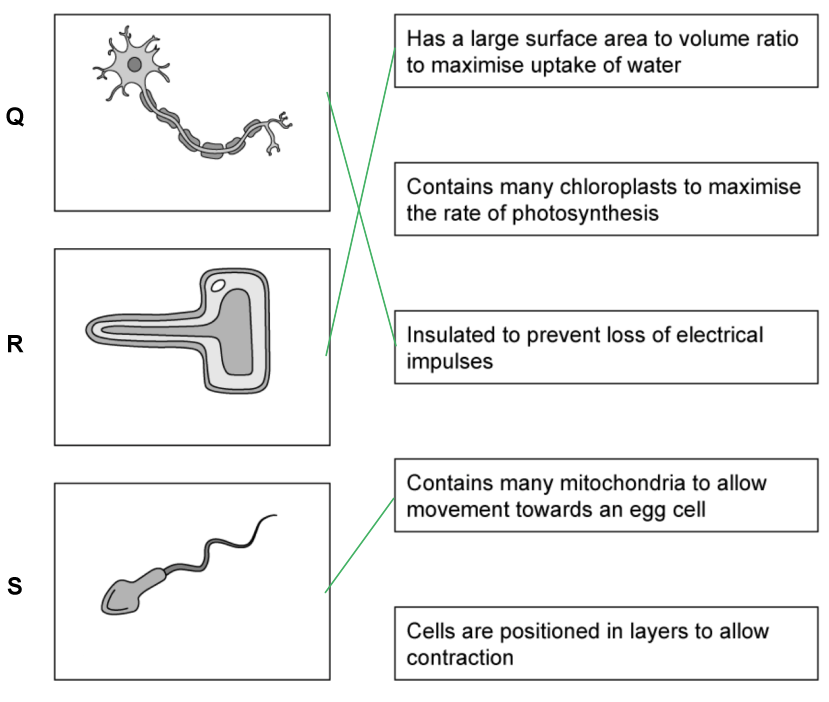
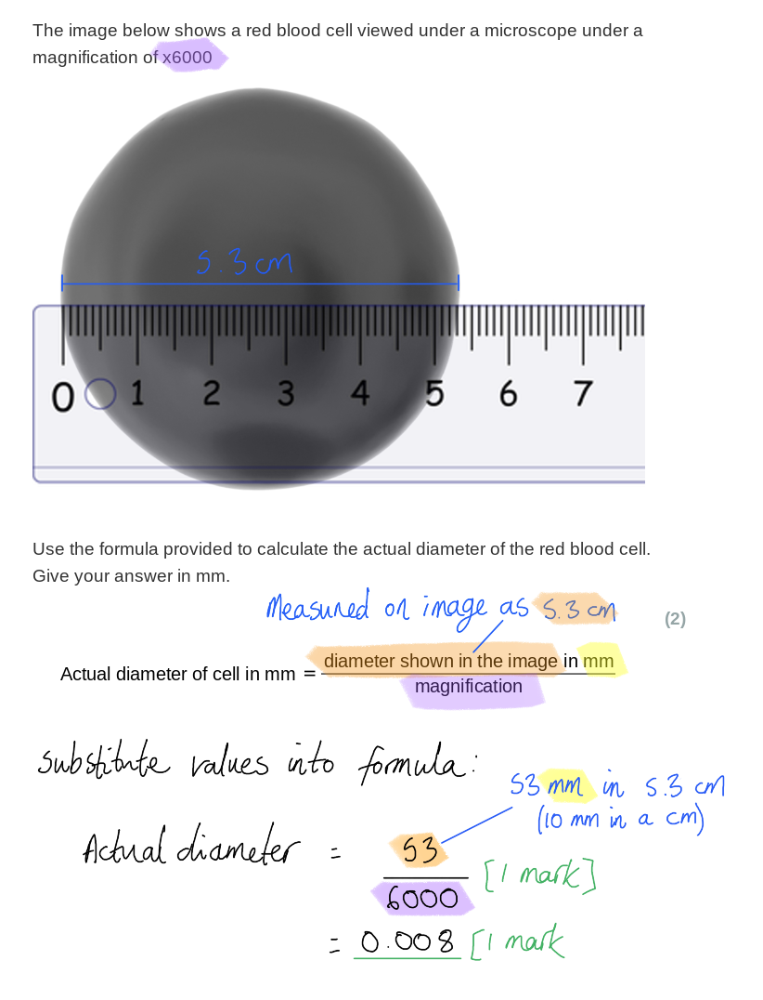
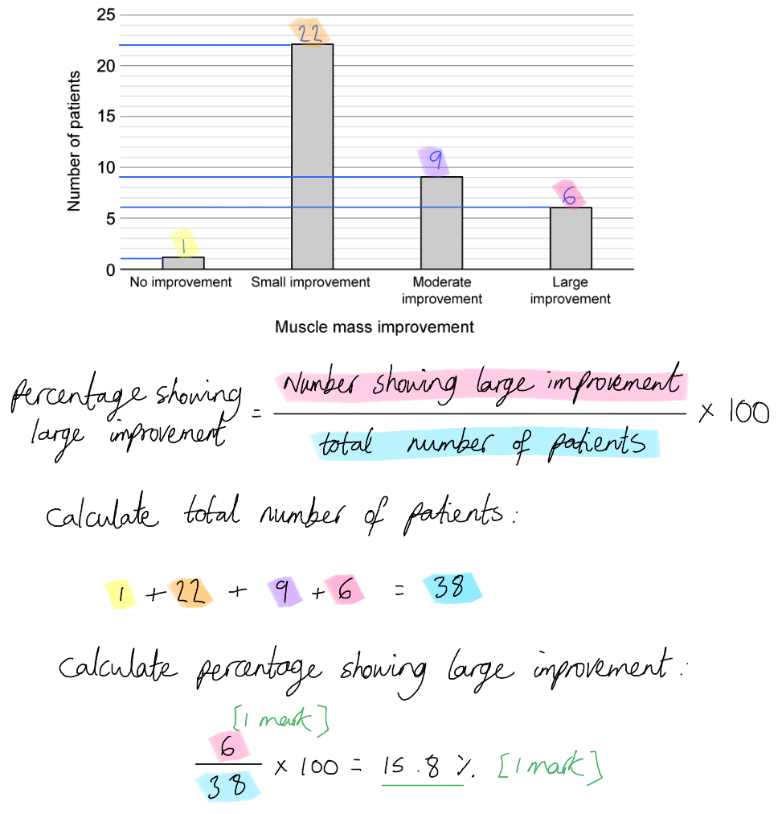
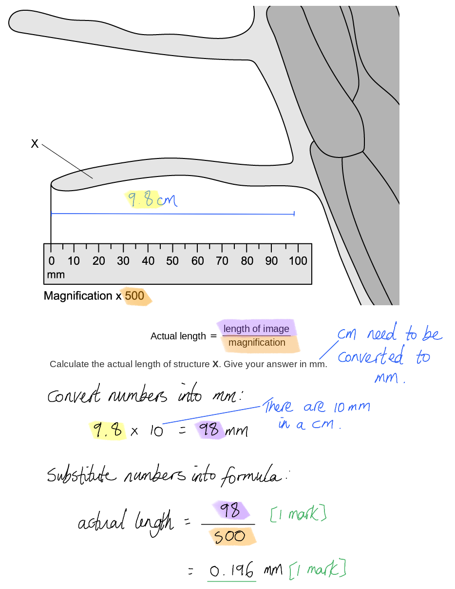
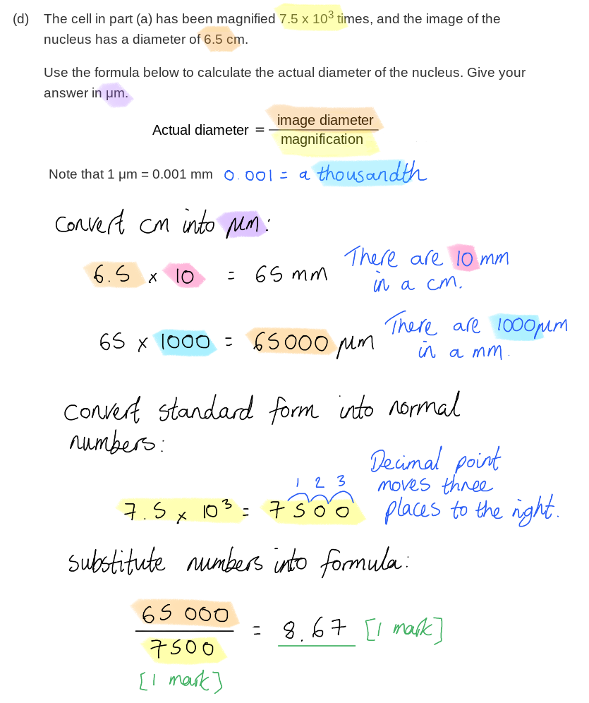
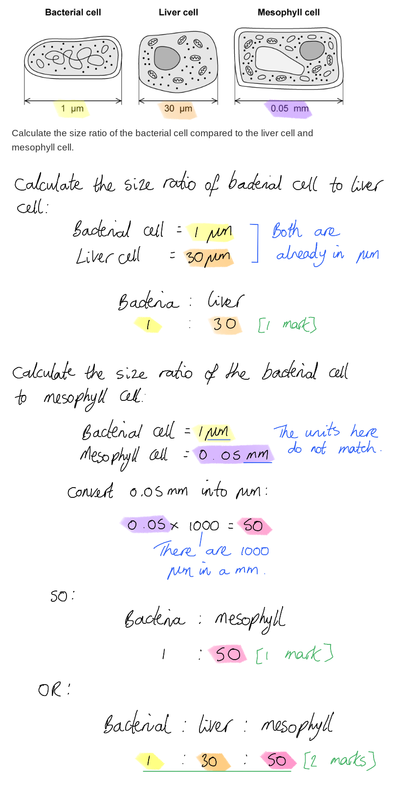

# Mark Schemes — Cell Structure
**2. Structure & Functions in Living Organisms: Part 1** · Edexcel IGCSE Biology (Modular) (4XBI1) — 24/Unit 1

## Q1 — easy — 6 marks · exam-questions

### 1() — 3 marks
Structures P, Q and R are....

- P = Chloroplast **OR** mitochondria; **[1 mark]**
- Q = Cytoplasm; **[1 mark]**
- R = Vacuole; **[1 mark]**

**[Total: 3 marks]**

> *In a simplistic diagram, such as that shown, the organelle labelled P could be either mitochondria (the site of respiration) or a chloroplast (the site of photosynthesis).*

### 2() — 2 marks
(i) A structure** **visible in the diagram that was not identified in part (a) could be...

Any **one** of the following:

- Cell wall; **[1 mark]**
- Cell (surface) membrane; **[1 mark]**
- Nucleus; **[1 mark]**

> *Note that the question asks you to name a structure that is **visible in the diagram**, so you will not be credited for naming ribosomes or mitochondria. These structures are too small to be visible in the diagram shown.*

(ii) The role of the structure named in part (i) is...

**One relevant** point from the following:

- (Cell wall =) provides strength/support/shape to the cell (and to the plant as a whole); **[1 mark]**
- (Cell membrane =) controls what passes into and out of the cell **OR** separates the cell contents from its surroundings; **[1 mark]**
- (Nucleus =) contains the DNA/genetic material/chromosomes (which controls the cell); **[1 mark]**

***Do not accept**** 'controls the cell' without reference to DNA for the role of the nucleus.*

**[Total: 2 marks]**

### 3() — 1 marks
**Final answer:** **The structure not present in prokaryotic cells is ****B****.**

Prokaryotic cells do not contain internal membranes, so they cannot contain chloroplasts, which are surrounded by membrane.

Prokaryotic cells do have a cell wall (A), though the cell wall is different to plant cell walls as it is not made of cellulose.

Prokaryotic cells do contain plasmids (C), small loops of DNA.

Prokaryotic cells do contain circular DNA (D), though this DNA is not contained inside a nucleus but floats free in the cytoplasm.

## Q2 — easy — 9 marks · exam-questions

### 1() — 2 marks
The following calculation shows how much longer the cell length is compared to the chloroplast...

- 50 ÷ 6.25;** [1 mark]**
- 8 (times longer); **[1 mark]**

*Full marks to be awarded for correct answer without calculation*

**[Total: 2 marks]**

### 2() — 2 marks
An animal cell would be different to the cell shown in part (a) as follows...

Any **two** of the following:

- It would not contain chloroplasts; **[1 mark]**
- It would not contain a (permanent) vacuole; **[1 mark]**
- It would not have a cell wall;** [1 mark]**

***Ignore**** references to mitochondria.*

**[Total: 2 marks]**

### 3() — 3 marks
X, Y and Z can be identified as...

- X = cell (surface) membrane; **[1 mark]**
- Y = (permanent) vacuole; **[1 mark]**
- Z = nucleus; **[1 mark]**

**[Total: 3 marks]**

### 4() — 2 marks
The cell in (c) is specialised to carry out its function as follows...

- A large surface area; **[1 mark]**
- To maximise absorption of water/minerals (from the soil); **[1 mark]**

**OR**

- A large vacuole; **[1 mark]**
- To maximise storage of water/minerals/cell sap; **[1 mark]**

**OR**

- Many mitochondria; **[1 mark]**
- For active transport of minerals (which requires energy); **[1 mark]**

*Allow 'thin cell walls'*; **[1 mark] ***and 'to maximise absorption of water/minerals*; **[1 mark]**

**[Total: 2 marks]**

> *When explaining the useful features of specialised cells you should always aim to **clearly relate structure to function**. E.g. you will not get full marks for just stating 'large surface area'; you must explain **why it is helpful** to have a large surface area.*

## Q3 — easy — 8 marks · exam-questions

### 1() — 4 marks
(i) The types of specialised cell represented by Q, R and S are...

- Q = nerve cell/neurone; **[1 mark]**
- R = Root hair (cell); **[1 mark]**
- S = Sperm (cell);** [1 mark]**

(ii) The cells should be matched with their functions as follows...

1 mark to be awarded for all three correct lines.

*Do not award mark if any cell has more than one line.*

**[Total: 4 marks]**

### 2() — 2 marks
One other special feature of a red blood cell is...

- Haemoglobin; **[1 mark]**
- Carries/attaches to oxygen / allows cells to carry oxygen; **[1 mark]**

**OR**

- Biconcave disc; **[1 mark]**
- Increases surface area (for the diffusion of oxygen into the cell); **[1 mark]**

**OR**

- Flexible / easily deform; **[1 mark]**
- Can squeeze through capillaries / small/narrow blood vessels; **[1 mark]**

**[Total: 2 marks]**

> *As ever with questions that ask you to explain special features, ensure that you **relate the structure to its function**.*

### 3() — 2 marks
(i) Cells become specialised in the following process...

- Differentiation; **[1 mark]**

(ii) Differentiation is controlled by DNA as follows...

Any **one** of the following:

- Genes are switched on/off / are activated/inactivated; **[1 mark]**
- DNA controls substances/proteins produced by the cell / development of specific cell organelles/sub cellular features;** [1 mark] **

**[Total: 2 marks]**

> *Every cell in the body contains the same DNA, so cells become different by **switching some genes on and other genes off**. For example, the stem cells that differentiate into red blood cells may switch on the genes for haemoglobin production but switch off the genes for maintaining the nucleus.*

## Q4 — easy — 7 marks · exam-questions

### 1() — 2 marks
The term stem cell can be defined as follows...

Any **two** of the following:

- An undifferentiated/unspecialised cell; **[1 mark]**
- A cell that can divide / carry out mitosis (to produce more identical stem cells); **[1 mark]**
- A cell that can specialise into other cell types; **[1 mark]**

**[Total: 2 marks]**

> *Stem cells are **unspecialised cells** that are capable of **repeated cell division**. When stem cells divide by mitosis they give rise to **more, identical, stem cells**. These stem cells can remain as stem cells or can **differentiate into multiple cell types**. The number of cell types that can be produced depends on the type of stem cell.*

### 2() — 2 marks
Sources of stem cells include...

Any **two** of the following:

- Embryos; **[1 mark]**
- Bone marrow; **[1 mark]**
- The umbilical cord (blood); **[1 mark]**
- The skin; **[1 mark]**
- The liver; **[1 mark]**
- The brain; **[1 mark]**
- Placenta; **[1 mark]**

**[Total: 2 marks]**

### 3() — 3 marks
Stem cells can be used in medicine as follows...

- Stem cells can be encouraged to develop into certain tissue types; **[1 mark]**
- Stem cells can be injected into a damaged tissue to replace lose/dead/damaged cells; **[1 mark]**

**AND**

Any **one** of the following:

- E.g. replacing damaged insulin-producing cells to treat diabetes; **[1 mark]**
- E.g. replacing damaged nerve cells to treat paralysis; **[1 mark]**
- E.g. replacing skin cells to treat burn patients; **[1 mark]**
- E.g. replacing damaged retina cells to treat visual impairment; **[1 mark]**

*Accept other valid examples for marking point 3.*

**[Total: 3 marks]**

## Q5 — easy — 9 marks · exam-questions

### 1() — 2 marks
The actual diameter of the cell is...

- 53 ÷ 6000; **[1 mark]**
- 0.008 (mm); **[1 mark]**

*Allow 1 mark for 8 μm.*

**[Total: 2 marks]**

> *The question asks you to give the answer in mm, and the formula states that the values should be in mm, so be sure to covert the measurement on the diagram (which is in cm) into mm before completing the calculation.*

### 2() — 3 marks
(i) The role of the nucleus is...

- Contains the genetic material/DNA/chromosomes (which control the activities of the cell); **[1 mark]**

> *Note that it is not enough here just to state that the nucleus 'controls the cell'. You need to refer to the **DNA **within the nucleus, as it is the DNA which determines the substances produced by the cell, and so determines the activities of the cell.*

(ii) It is useful to the red blood cell not to have a nucleus because...

- This leaves more space for haemoglobin / allows the cell to contain more haemoglobin; **[1 mark]**
- Which carries/attaches to/binds to oxygen / enables the red blood cells to transport oxygen; **[1 mark]**

**[Total: 3 marks]**

### 3() — 2 marks
A palisade mesophyll cell is adapted to carry out its function as follows...

- It contains many chloroplasts; **[1 mark]**
- To maximise absorption of light (energy) for photosynthesis; **[1 mark]**

**OR**

- It is tall and narrow / column shaped; **[1 mark]**
- To maximise the number of palisade cells that can fit in the upper surface of a leaf (and so maximise photosynthesis); **[1 mark]**

**[Total: 2 marks]**

> *You may not have come across every example of a specialised cell at this stage in your studies, but you will come across many as you move through the syllabus. Palisade mesophyll cells are found in the upper surface of leaves and they are the main location of the reactions of photosynthesis.*

> *Don't forget to explain how each feature that you identify aids the cell in its function; in this case to carry out photosynthesis.*

### 4() — 2 marks
Other examples of specialised cells include...

Any **two** of the following:

- Root hair cell; **[1 mark]**
- Guard cell; **[1 mark]**
- Nerve cell/neurone; **[1 mark]**
- Ciliated epithelial cell; **[1 mark]**
- Sperm cell; **[1 mark]**
- Egg cell/ovum; **[1 mark]**
- Xylem vessel; **[1 mark]**
- Intestinal epithelial cell; **[1 mark]**
- Cone cell; **[1 mark]**
- Rod cell; **[1 mark]**

*Accept other valid examples of specialised cells.*

*Ignore references to phloem as this is a tissue with more than one cell type.*

**[Total: 2 marks]**

## Q6 — medium — 8 marks · exam-questions

### 1((a)) — 2 marks
(i) **The correct answer is ****B ****because...**

A cell wall is only found in plant cells and some microorganisms**.**

Structures A, C and D** **are found in all animal (and plant) cells.

(ii) **The correct answer is ****D ****because...**

Starch is the storage compound used by plants; starch is stored in small granules inside chloroplasts.

A is incorrect because chlorophyll is not a storage compound, it is the pigment that captures light energy for photosynthesis.

B is incorrect because glucose is very soluble so cannot easily be stored in plant cells

C is incorrect because glycogen is a storage compound, but in animals, not plants.

### 1((b)) — 6 marks
(i) The functions of parts labelled **A**, **B**, **C** and **D** are as follows...

- A = (chloroplasts) absorb light for photosynthesis / to make carbohydrate/starch/glucose/sugar / store starch granules; **[1 mark]**
- B = (nucleus) controls protein synthesis / contains DNA/genes / controls cell; **[1 mark]**
- C = (vacuole) contains cell sap / maintains turgor / stores water/salts/pigments/toxins; **[1 mark]**
- D = (cytoplasm) where chemical reactions occur / protein synthesis occurs / respiration occurs / provides a medium for chemical reactions (within the cell);** [1 mark]**

(ii) Ways that the structure of this palisade mesophyll cell is adapted for its function are as follows...

Any **two **of the following:

- Contains chloroplasts **SO **can absorb light / for photosynthesis; **[1 mark]**
- Long / arranged in a vertical plane/vertically / large surface area / rectangular shape **SO** absorb most light (energy); **[1 mark]**
- Large vacuole **SO** can store water/sap;** [1 mark]**

**[Total: 6 marks]**

> *When answering questions about structure and function be sure to explain exactly how each structure aids overall function.*

## Q7 — medium — 5 marks · exam-questions

### 7((a)) — 2 marks
The importance of cell differentiation is...

- (Unspecialised cells) develop into specialised cells / cells with specific functions; **[1 mark]**
- To produce tissues / organs / example of tissue or organ;** [1 mark]**

***Allow**** specific cell types named for marking point 2.*

**[Total: 2 marks]**

### 7((b)) — 3 marks
(i) **The correct answer is ****D ****because...**

Stem cells can be found in some tissues and organs including the heart, brain and bone.

A is incorrect as they can divide.

B is incorrect as they divide by mitosis, not meiosis. Meiosis is the cell division process used to produce gametes.

C is incorrect because they cannot develop into all cell types*.*

(ii) Choosing between adult and embryonic stem cells can cause issues because...

- Cells from embryos can make any cell type / many more cell types / adult stem cells can become fewer cell types **OR **only embryonic stem cells are totipotent; **[1 mark]**
- However, there are ethical issues about the use of embryonic cells **OR **people object to killing embryos (for the stem cells) / embryos are potential human lives;** [1 mark]**

***Allow ****converse statements*

***Allow**** embryo cells can become tumours*

**[Total: 3 marks]**

## Q8 — medium — 9 marks · exam-questions

### 1() — 3 marks
The functions of structures P, Q and R are...

- P (chloroplast) = site of photosynthesis / sugar/carbohydrate production **OR** absorption of (sun)light energy; **[1 mark]**
- Q (cytoplasm) = jelly-like fluid containing dissolved substances **OR** where chemical reactions take place; **[1 mark]**
- R (permanent vacuole) = store of water/sugars/sap **OR** keeps cell turgid / allows the cell to keep its shape; **[1 mark]**

**[Total: 3 marks]**

### 2() — 2 marks
(i) The diagram should be labelled as follows to show the location of the cell wall...

- The outermost layer surrounding the cell labelled with the letter **S**; **[1 mark]**

(ii) The function of the cell wall is to...

- To provide structure/support for the cell / enable the cell to maintain its shape; **[1 mark]**

*Accept references to maintaining turgor pressure.*

**[Total: 2 marks]**

### 3() — 2 marks
(i) Another group of eukaryotes in which you might find structure P (chloroplasts) is...

- Protoctists; **[1 mark]**

*Accept algae or chlorella.*

> *The protoctists can have either animal- or plant-like features, so some protoctists contain chloroplasts.*

(ii) Another feature of the protoctists is...

Any **one **of the following:

- They are single-celled organisms (though they can group together into colonies);** [1 mark]**
- They are (mostly) aquatic; **[1 mark]**
- They can have features of animal or plant cells;** [1 mark]**

*Ignore references to general eukaryotic features as the question states that the group is eukaryotic.*

**[Total: 2 marks]**

### 4() — 2 marks
Possible conclusions about the activities of the salivary gland cell from the image above include...

- They are metabolically active / carry out activities that require energy; **[1 mark]**
- They produce many proteins;** [1 mark]**

*Accept a reference to secretion of substances for 1 mark.*

**[Total: 2 marks]**

> *It is possible to make suggestions about the **role** of a cell by looking at its **structure**. The salivary gland cell has **many mitochondria**, organelles responsible for releasing energy; this suggests that the cell is **metabolically active**. The cell also contains **many ribosomes**, the organelles responsible for protein synthesis; this tells us that the cell **produces lots of proteins**.*

> *In reality, the role of the salivary gland cell is to produce amylase enzymes (which are made of protein). The process of protein synthesis requires energy, hence the high metabolic requirements of the cell.*

> *The proteins are secreted from the cell into the mouth once the protein synthesis process is finished; the evidence for this is the presence of structures known as secretory vesicles near the top of the cell.*

## Q9 — medium — 19 marks · exam-questions

### 1() — 4 marks
(i) A letter that represents a plant cell is...

- B; **[1 mark]**

> *Cell B is the only cell with a cell wall, so is the only cell that can be identified as a plant cell.*

(ii) A letter that represents a cell containing digestive enzymes is...

- A **OR** D; **[1 mark]**

> *Cell A is a phagocyte, and so is able to digest pathogens using digestive enzymes.*

> *Cell D is a sperm cell, so can digest its way through the outer layer of an egg cell using digestive enzymes.*

(iii) A letter that represents a cell that is motile is...

- A **OR** D; **[1 mark]**

> *Phagocytes can move around the body to sites of damage and infection.*

> *Sperm cells can swim using their tails.*

(iv) A letter that represents a cell that is involved with co-ordination is...

- C; **[1 mark]**

> *Cell C is a nerve cell so is involved with sending nerve messages around the body. This allows the body to co-ordinate its responses to the surrounding environment.*

**[Total: 4 marks]**

### 2() — 2 marks
A stem cell can give rise to the cell types shown in part (a) as follows...

Any **two** of the following:

- Some genes are switched on/activated and others are switched off/deactivated; **[1 mark]**
- The cell produces different substances/proteins/organelles (depending on which genes have been switched on/off); **[1 mark]**
- The cell differentiates; **[1 mark]**

**[Total: 2 marks]**

> *All cells in an individual contain identical genetic information (with the exception of unusual cells such as red blood cells, which don't have a nucleus), and yet not all cells in an individual are structurally identical; many cells specialise to carry out particular functions. This is achieved by **switching certain genes on or off** to control the activities and development of the cell. This process of specialisation is known as **differentiation**.*

### 3() — 5 marks
(i) The abilities of stem cells taken from bone marrow are as follows...

- They can differentiate/specialise into a few/a limited number of different cell types; **[1 mark]**
- (This is because they are) <u>adult</u> stem cells / taken from <u>adult</u> tissue (rather than from an embryo); **[1 mark]**

(ii) Stem cells could be used to treat muscle wasting as follows...

- Stem cells can be injected into muscle tissue; **[1 mark]**
- The stem cells divide / carry out mitosis; **[1 mark]**
- The stem cells differentiate into (more) muscle cells (to replace those that are lost during muscle wasting); **[1 mark]**

**[Total: 5 marks]**

### 4() — 5 marks
(i) The dependent variable in this trial was...

- Muscle mass improvement; **[1 mark]**

> *It is essential that you can identify independent and dependent variables. The independent variable is the variable that is changed on purpose (here this would be the administration of the stem cell treatment) and the dependent variable is the **variable that is measured** (here this is the improvement in muscle mass).*

(ii) The dependent variable could have been measured as follows...

- Weighing the patients / measuring the mass of the patients **OR** carrying out a scan of the patients' muscles **OR** calculating the percentage of muscle mass of the patients; **[1 mark]**
- Before the (stem cell) treatment **AND** after the treatment; **[1 mark]**

> *There are several ways that muscle mass could be measured, and you are not expected to show technical knowledge of the medical procedures involved to gain credit here, just a valid **suggestion** of a possible method that could be used. *

> *Note that the variable is a measure of **change **in muscle mass, so the mass would need to be measured both **before and after** the treatment.*

(iii) The percentage of participants that showed significant improvement in the trial is...

- 6 ÷ 38; **[1 mark]**
- 15.8 (%); **[1 mark]**

*Award full marks for the correct answer in the absence of calculations.*

*Award a maximum of one mark for the answer rounded correctly to the wrong number of decimal places.*

*Reject answers with incorrect rounding.*

**[Total: 5 marks]**

### 5() — 3 marks
The conclusion that stem cell therapy is an effective treatment for muscular dystrophy can be evaluated as follows...

*In support of the conclusion*

- Most patients / all patients except 1 showed improvement in muscle mass after treatment; **[1 mark]**
- The trial was a clinical trial / involved human patients; **[1 mark]**

*Against the conclusion*

A **maximum of two **of the following:

- Most patients only showed a small improvement in muscle mass; **[1 mark]**
- Muscle mass improvement may not lead to an improvement in symptoms; **[1 mark]**
- The sample size/number of patients in the study is small / the study only included 38 patients; **[1 mark]**
- 1 patient showed no improvement in muscle mass; **[1 mark]**
- The study does not consider safety/side effects of the treatment; **[1 mark]**
- The study does not include a control group / a group of individuals not receiving stem cell treatment; **[1 mark]**
- More evidence is / other studies are needed; **[1 mark]**

**[Total: 3 marks]**

> *The command word **evaluate** requires you to review the information provided and consider its strengths and weaknesses. Here this means considering the arguments **for and against** the stated conclusion.*

> *When evaluating a conclusion you should consider factors relating to the **data** (i.e. what the graph shows), factors relating to the **design of the investigation** (e.g. the sample size, the use of an experimental control) and factors relating to the **scientific method** (e.g. whether the results of a single study are enough to accept a conclusion).*

## Q10 — medium — 9 marks · exam-questions

### 1() — 3 marks
(i) Structure X is a....

- Root hair/root hair cell; **[1 mark]**

(ii) Two structures that would be present in structure X that would not be found in an animal cell are...

- Cell wall; **[1 mark]**
- Vacuole; **[1 mark]**

*Ignore chloroplasts as these would not be present in cells in a root.*

**[Total: 3 marks]**

### 2() — 2 marks
The actual length of structure X is:

- 98-100 ÷ 500; **[1 mark]**
- (Answers in the range of) 0.196-0.2 (mm);** [1 mark]**

*Full marks can be awarded for the correct answer in the absence of calculations.*

*Award 1 mark for 196-200 μm.*

**[Total: 2 marks]**

> *Reading the length of X using the ruler may yield slightly different measurements depending on which point on X is used, so the mark scheme allows for a range of answers.*

### 3() — 4 marks
The lack of a fully developed structure X could be damaging to a plant because...

Any **four** of the following:

- The function of X/the root hair is to increase surface area; **[1 mark]**
- For absorption of water (by osmosis); **[1 mark]**
- (And) for absorption of mineral ions / named example, e.g. magnesium ions, nitrate ions; **[1 mark]**
- Fewer/shorter root hairs would reduce absorption; **[1 mark]**
- Water is essential for photosynthesis / maintaining pressure / as a solvent;** [1 mark]**
- Reduced absorption could lead to mineral deficiencies / named example of mineral deficiency; **[1 mark]**

**[Total: 4 marks]**

> *This question requires you to apply your knowledge of root hair cells to the scenario provided. A lack of fully developed root hair cells will reduce the overall surface area of the root, so reducing the absorption of water and minerals. This will reduce photosynthesis and lead to mineral deficiencies.*

## Q11 — hard — 7 marks · exam-questions

### 3((a)) — 1 marks
The organelle showing in the student's drawing is the...

- Nucleus;** [1 mark]**

**[Total: 1 mark]**

### 3((b)) — 2 marks
The magnification of the drawing is...

- 60 mm = 60 000 μm; **[1 mark]**
- (60 000 ÷ 6 =) 10 000 / x10 000; **[1 mark]**

*Award full marks for correct numerical answer without working.*

**[Total: 2 marks]**

### 3() — 4 marks
(i) **The correct answer is ****A ****because...**

The table tells us that there are 5 000 mitochondria in a typical heart muscle cell, the volume of which is 15 000 µm3. To calculate the number of mitochondria per µm3, we divide 5 000 by 15 000 µm3, which gives an answer of 0.33 mitochondria per µm3.

**B** is incorrect because the division has been performed the wrong way around.

**C** and **D** are also mathematically incorrect.

(ii) The differences in the data for the sperm and for the egg are...

Any **three **of the following:

- The sperm is smaller (than the egg) / sperm is a small cell; **[1 mark]**
- The sperm has fewer (total) mitochondria (per cell);** [1 mark]**
- The sperm has more mitochondria per unit volume / per μm3; **[1 mark]**
- The sperm needs <u>energy</u> to swim/move / get to/fertilise the egg; **[1 mark]**

*Accept converse arguments in each case. *

**[Total: 4 marks]**

## Q12 — hard — 10 marks · exam-questions

### 1() — 2 marks
(i) The group of organisms from which the cell shown in the image has been taken is...

- Plants;** [1 mark]**

*Accept 'plant cell'.*

(ii) The cell is a plant cell because...

Any **one** of the following:

- A cell wall is visible; **[1 mark]**
- It contains chloroplasts; **[1 mark]**

**[Total: 2 marks]**

> *You may be presented with nice, clear diagrams in an exam, but it is also possible that you could be given microscope images of real cells to interpret; practice at viewing these less predictable images will help you learn about the real-life appearance of cell organelles.*

### 2() — 3 marks
Structure Y is present inside structure X in the image in part (a) because...

- Photosynthesis takes place inside chloroplasts (structure X); **[1 mark]**
- Photosynthesis produces glucose; **[1 mark]**
- Plants store glucose in the form of starch;** [1 mark]**

**[Total: 3 marks]**

> *Plants store the **glucose** that they produce during **photosynthesis** in the form of **starch**. Photosynthesis occurs **inside chloroplasts**, so we would expect the plant cells to store some of the glucose that they produce close to the location where it is made.*

### 3() — 3 marks
Structures that are not identifiable in the image in part (a) that you would expect to find in this cell include...

Any **three** of the following:

- Mitochondria; **[1 mark]**
- Ribosomes; **[1 mark]**
- Cell membrane; **[1 mark]**
- (Large permanent) vacuole; **[1 mark]**

*Accept references to other cell organelles that are not visible, e.g. endoplasmic reticulum, golgi apparatus.*

*Ignore vesicles/lysosomes.*

**[Total: 3 marks]**

> *While there are some small structures visible inside the cell in part (a) that could perhaps be identified as ribosomes, it is not clear that this is what they are, so credit is available for this answer.*

### 4() — 2 marks
The actual diameter of the nucleus is...

- 65 000 ÷ 7 500/7.5 x 103; **[1 mark]**
- 8.7/8.67 (μm); **[1 mark]**

*Award full marks for the correct answer in the absence of other calculations.*

**[Total: 2 marks]**

> *You have been asked to give your answer in μm. The best way to ensure this is to convert any measurements given in cm/mm into μm at the start of the calculation; this will ensure that you don't forget to do the conversion at the end!*

## Q13 — hard — 13 marks · exam-questions

### 1() — 3 marks
Structures X, Y and Z are...

- X = nucleus; **[1 mark]**
- Y = mitochondrion/mitochondria; **[1 mark]**
- Z = cell membrane;** [1 mark]**

**[Total: 3 marks]**

> *Here you need to apply your knowledge of cell structure and the features of sperm cells to this unfamiliar image:*

- *You should be aware that the nucleus of a sperm cell is in the head of the sperm, so the dark-coloured region in the upper part of the image is the nucleus.*
- *Sperm cells have many mitochondria, so the presence of **many** of organelle Y should indicate that these are mitochondria.*
- *Z points to the outermost layer of the cell, which in animal cells is the cell membrane.*

### 2() — 2 marks
The sperm cell in part (a) should be labelled as follows...

- The top of the head of the sperm is labelled **AND** the label states that this feature (the acrosome) contains digestive enzymes / enables the sperm cell to enter the egg; **[1 mark]**
- The tail is labelled **AND** the label states that this feature (the tail) aids movement / allows the sperm to swim (to the egg); **[1 mark]**

*Ignore labels that refer to the nucleus or mitochondria as these are not additional to the features labelled in part (a).*

**[Total: 2 marks]**

### 3() — 3 marks
(i) The image should be labelled with a letter D as follows...

- Anywhere between the spermatids and the mature sperm; **[1 mark]**

> *The structure of the spermatids in the diagram shows that the cells have not yet become specialised at this stage, but by the time the sperm calls are mature their structure has changed and specialisation has occurred; the cells have differentiated **between the spermatid stage and the mature sperm stage**.*

(ii) The events at D that allow differentiation to occur include...

- Some genes are switched on/activated **AND** some genes are switched off/inactivated; **[1 mark]**
- The cells produce different substances/proteins/organelles **OR** the cells produce tails / more mitochondria / an acrosome / digestive enzymes; **[1 mark]**

**[Total: 3 marks]**

### 4() — 5 marks
(i) SSCs could be used to treat male infertility as follows...

- They could be injected into the testes; **[1 mark]**
- They could divide to produce <u>more</u> sperm / <u>increase number</u> of sperm (which could increase fertility); **[1 mark]**

(ii) The potential use of SSCs in stem cell therapy can be evaluated as follows...

*In support of SSCs in stem cell therapy*

A **maximum of two** of the following:

- SSCs could be used to replace cell types other than sperm cells; **[1 mark]**
- SSCs are adult stem cells **SO** they do not have the ethical issues of embryonic stem cells; **[1 mark]**
- SSCs could be harvested from a patient and used to grow replacement tissues that would not be rejected (by the immune system); **[1 mark]**

*Against SSCs in stem cell therapy*

A **maximum of two** of the following:

- SSC therapy may only benefit male patients (as females do not have SSCs); **[1 mark]**
- Stem cell therapy risks the development of cancers (if the stem cells do not receive the correct signals); **[1 mark]**
- Human SSCs may not have the same capabilities as mouse SSCs; **[1 mark]**

> *Remember that **evaluate** questions require you to **consider all aspects** of a concept and to **give arguments for and against it**. Here you can use your knowledge of some of the concerns surrounding stem cells in medicine alongside your reasoning skills to **argue for** **and** **against** the use of SSCs in stem cell therapy.*

**[Total: 5 marks]**

## Q14 — hard — 10 marks · exam-questions

### 1() — 2 marks
The size ratio of the bacterial cell compared to the liver cell and mesophyll cell is...

- 1 : 30; **[1 mark]**
- 1 : 50; **[1 mark]**

**OR**

- 1 : 30 : 50; **[2 marks]**

**[Total: 2 marks]**

> *The crucial piece of knowledge here is that there are 1000 μm in a mm; knowing this will allow you to convert the units given in mm into μm.*

### 2() — 3 marks
(i) The organelles indicated by X are...

- Ribosomes; **[1 mark]**

> *The labels indicating organelle X are pointing to structures that look like tiny dots inside the cell. Ribosomes are usually too small to be viewed at the magnifications that you will have used, but can just be seen with an electron microscope.*

(ii) Possible activities that could be taking place inside the cell include...

- Respiration / metabolism / the cell is metabolically active / the cell activities requires lots of energy; **[1 mark]**
- Production of proteins/enzymes; **[1 mark]**

*Accept other examples of proteins for marking point 2.*

> *The section of the cell shown in the image contains many large organelles which you should recognise as mitochondria (in animal cells these are the next-largest organelles after the nucleus). Mitochondria are the site of respiration, releasing energy for use in cellular activities.*

> *The ribosomes identified in part (i) are involved with protein production, so their presence in the cell shows that protein production is taking place.*

**[Total: 3 marks]**

### 3() — 2 marks
Contrasting features of adult and embryonic stem cells include...

Any **two** of the following:

- Adult stem cells can only become a few different cell types / a specific cell type / are limited in their ability to differentiate **WHILE** embryo stem cells are totipotent / have the ability to become/differentiate into any type of cell; **[1 mark]**
- Adult stem cells are found in specific places in the (fully developed) body / the bone marrow / the skin / the umbilical cord **WHILE** embryonic stem cells are found in a developing embryo; **[1 mark]**
- The role of adult stem cells is to replace old/dead/damaged cells **WHILE **the role of embryonic stem cells is to allow the development of a whole organism/individual / all of the tissues/organs; **[1 mark]**

*Accept other correctly identified sources of adult stem cells for marking point 2.*

**[Total: 2 marks]**

### 4() — 3 marks
Enabling liver cells to de-differentiate could mean the following for stem cell therapies...

Any **three** of the following:

- The liver cells (once they have de-differentiated) would be able to specialise/differentiate into many different cell types / could become pluripotent/totipotent; **[1 mark]**
- De-differentiated liver cells could be grown into new tissues/organs in the lab; **[1 mark]**
- De-differentiated liver cells could be injected into patients to replace damaged cells / instead of an organ/liver transplant; **[1 mark]**
- Tissues/organs grown from a patient's own liver cells would not be rejected (by their immune system); **[1 mark]**

**[Total: 3 marks]**

> *The key to answering this question is working out the meaning of the term 'de-differentiate'. You are unlikely to have come across this term, but you should know what it means for a cell to 'differentiate', so logical reasoning suggests that to 'de-differentiate' should mean reversing this process. Reversing the process of differentiation will cause a specialised cell to revert to a stem cell, increasing its ability to differentiate into multiple cell types.*

## Q15 — hard — 14 marks · exam-questions

### 1() — 5 marks
(i) The specialised cell type shown in the image is...

- Root hair (cell); **[1 mark]**

> *The image is a cross section through the edge of a plant root. There are three root hair cells visible that extend from the outer edge of the root.*

(ii) Differentiation has allowed the cell in the image to carry out its specific function in plants as follows...

Any **four **of the following:

- Certain genes get switched on/activated or switched off/inactivated (during differentiation); **[1 mark] **
- The cell produces different substances/proteins / develops different organelles / develops into a different shape; **[1 mark]**
- Root hair cells grow extensions / root hairs to give a <u>large surface area</u> **SO** maximising water/mineral absorption; **[1 mark]**
- They develop <u>mitochondria</u> to provide energy for absorption of mineral ions; **[1 mark]**
- A <u>large vacuole</u> for storage of water/cell sap; **[1 mark]**
- Root hair cells have no chloroplasts **AS** they do not photosynthesize; **[1 mark]**

Remember that cells differentiate to become specialised so that they are adapted to carry out a particular function.

This question asks for an explanation as to **how differentiation** allows the root hair cell to carry out its **function**, so you need to **explain** the process of **differentiation** and **link each feature to its function**.

**[Total: 4 marks]**

### 2() — 4 marks
(i) The grass roots contain starch because...

Any **two** of the following:

- Plants carry out photosynthesis to produce glucose/sugars; **[1 mark]**
- Sugars/sucrose are transported from the leaves to the roots; **[1 mark]**
- Glucose is stored in the form of starch; **[1 mark]**

(ii) Starch found in the roots of grass supports growth as follows...

Any **two** of the following:

- Starch is broken down into glucose; **[1 mark]**
- Energy is released from glucose in respiration; **[1 mark]**
- Energy is required for growth / building of new molecules **OR** energy is required for active transport of mineral ions / nitrates into the root; **[1 mark]**

**[Total: 4 marks]**

> *This question draws on knowledge gained from topic 1 of the specification. You should be aware that plants are **autotrophic,** producing their own glucose in the process of **photosynthesis**. This glucose is then stored in the form of starch which can be broken down to release the glucose again for **respiration**. Respiration releases** energy** which can be used for growth.*

### 3() — 5 marks
(i) The percentage change between January and October is...

- (25 ÷ 5) x 100;** [1 mark]**
- 500 (%); **[1 mark]**

(ii) This change could be due to...

- During the summer/autumn there are more hours of sunlight / the temperatures are higher; **[1 mark]**
- More photosynthesis occurs in summer/autumn **SO** plants produce lots of glucose; **[1 mark]**
- Plants produce more glucose than they can (immediately) use **SO** excess glucose is stored / used to build up starch stores / transported to roots for storage; **[1 mark]**

**[Total: 5 marks]**
