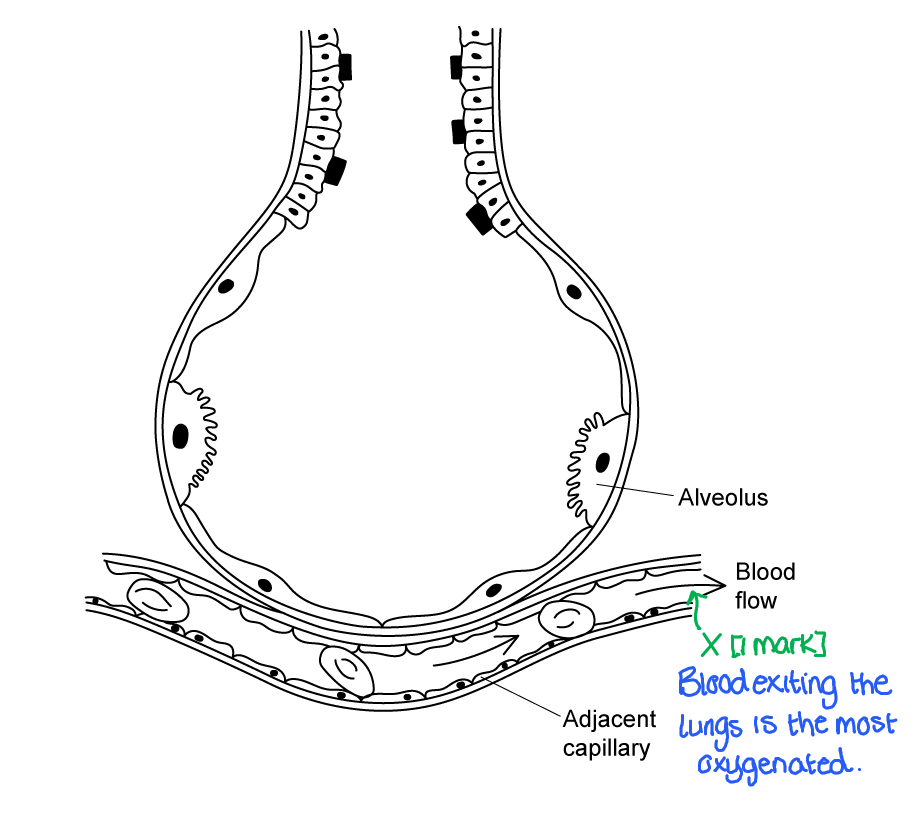
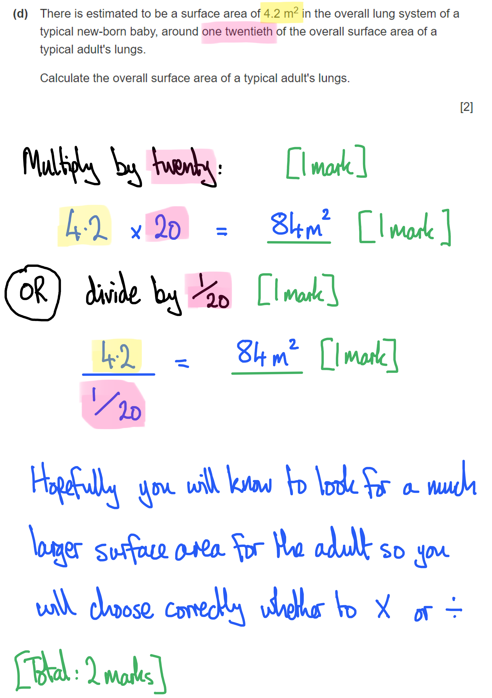
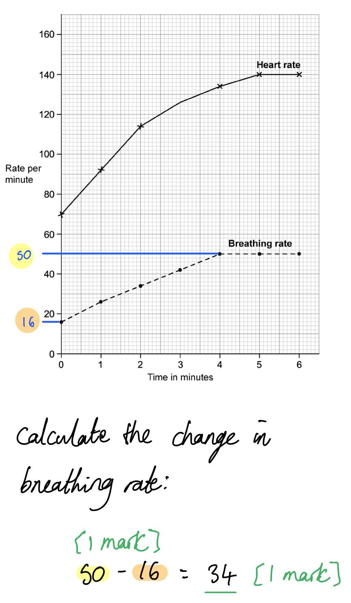
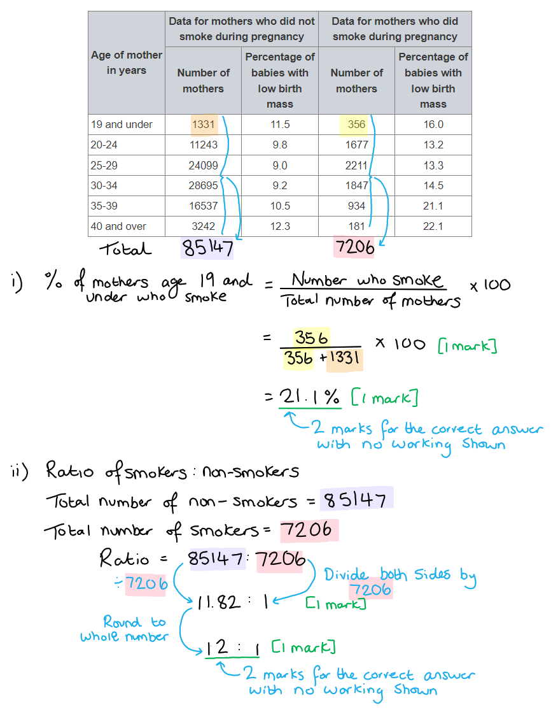
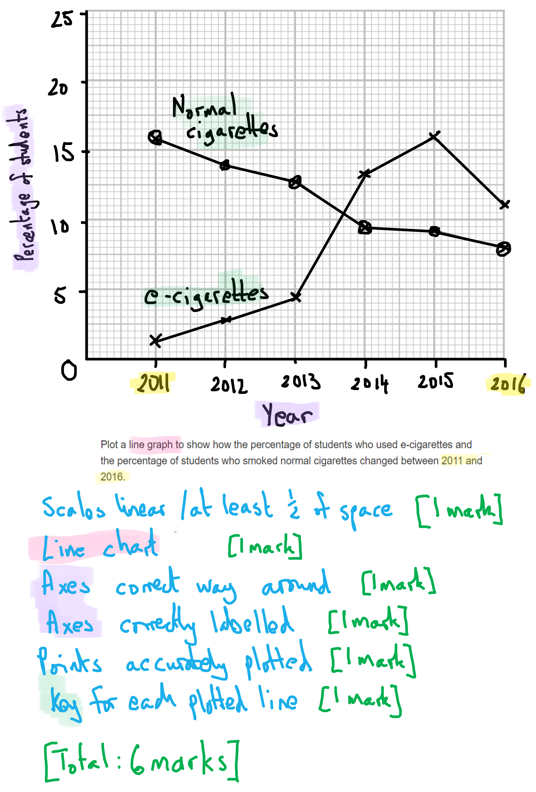
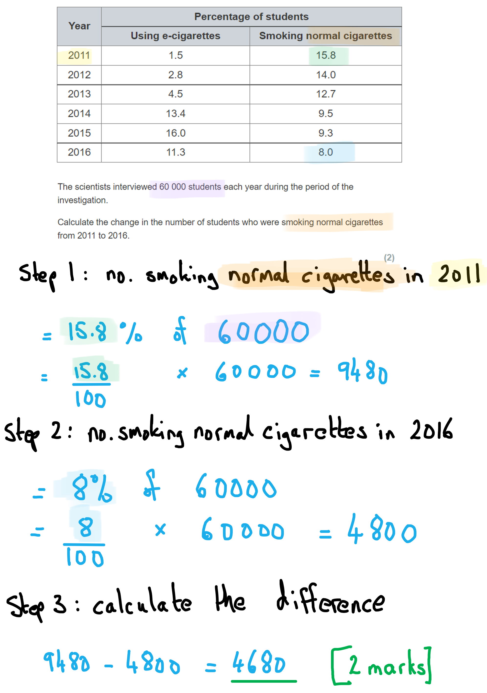
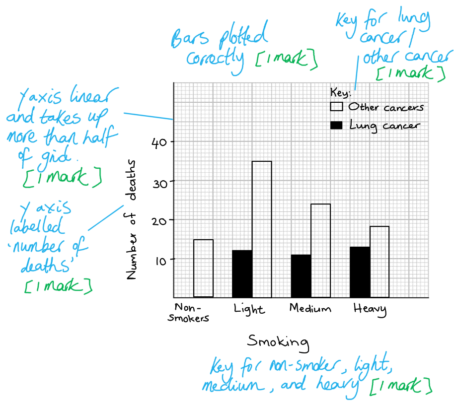
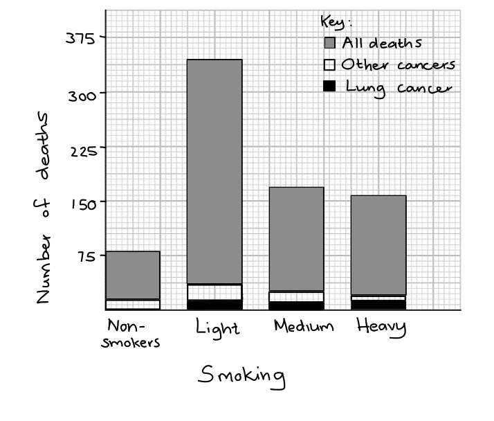
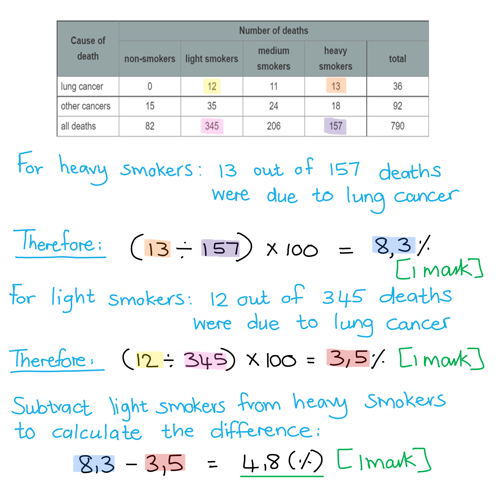

# Mark Schemes — Gas Exchange
**2. Structure & Functions in Living Organisms: Part 1** · Edexcel IGCSE Biology (Modular) (4XBI1) — 24/Unit 1

## Q1 — easy — 8 marks · exam-questions

### 1() — 2 marks
The alveolus is adapted for efficient gas exchange as follows...

- Good blood supply / close to a capillary;** [1 mark]**
- To maintain/ensure a <u>concentration gradient</u> (between the air and the blood); ** [1 mark]**

**OR**

- Alveolar/alveolus wall is one cell thick; ** [1 mark]**
- To minimise diffusion distance / reduce the distance for the diffusion of gases (between the air and the blood); ** [1 mark]**

*Reject references to the alveolar cell wall.*

**[Total: 2 marks]**

> *Be careful with questions like this which request you to identify things that are **clearly visible**. There are other characteristics of the alveoli and breathing system which aid gas exchange, e.g. many alveoli increase the surface area, but we cannot see them in the image so no credit can be awarded.*

> *Beware of descriptions such as 'thin alveolar cell wall'; it is not cell walls that we are concerned with, but the thin **layer of cells** that makes up the **wall of the alveolus**. Quite apart from this, alveoli cells are animal cells and do not have cell walls!*

### 2() — 1 marks
The oxygen content of the blood is highest at the position marked below...

**[Total: 1 mark]**

### 3() — 2 marks
The surface area of a typical adult's lungs is calculated as follows:

- 4.2 (m2) × 20 **OR** 4.2 (m2) ÷ 1/20 ; **[1 mark]**
- 84 m2; **[1 mark]**

**[Total: 2 marks]**

> *This equates to the often-quoted statistic that the adult lungs' surface area is about half the size of a tennis court; a singles tennis court is about 196 m**2** in area. *

### 4() — 1 marks
The sequence in which air passes through the structures during an exhalation is...

| **structure** | **order** |
|---|---|
| bronchus | **3** |
| nasal cavity | **5** |
| alveolus | 1 |
| trachea | **4** |
| bronchioles | **2** |

**[Total: 1 mark]**

> *It's crucial that you read the question right through to the end; if you miss the word **exhalation** you may decide to order the steps for inhalation, and even with a solid knowledge of the various organs your list will be the wrong way around.*

### 5() — 2 marks
The actions of the intercostal muscles and diaphragm during inhalation are as follows...

- The diaphragm contracts / moves downwards/flattens; **[1 mark]**
- The (external) intercostal muscles contract / pull the ribs up/out; **[1 mark]**

**[Total: 2 marks]**

## Q2 — easy — 12 marks · exam-questions

### 1() — 4 marks
(i) X and Y are...

- X = guard cells; **[1 mark]**
- Y = spongy mesophyll cells; **[1 mark]**

(ii) The spongy mesophyll cells are arranged to maximise gas exchange as follows:

- They are loosely packed **OR** there are air spaces between cells; **[1 mark]**
- This allows movement of gases / allows gases to diffuse into/out of the leaf; **[1 mark]**

**[Total: 4 marks]**

### 2() — 2 marks
The table should be completed as follows...

Award 1 mark for each correct **row**:

|   | **Water moves in to guard cells** | **Water moves out of guard cells** | **Cells become flaccid** | **Cells become turgid** |
|---|---|---|---|---|
| Stomata open | **X** |   |   | **X** |
| Stomata close |   | **X** | **X** |   |

**[Total: 2 marks]**

> *Although this is a straightforward recall question, the content that it covers can be tricky to remember. The mechanism by which stomata open and close can feel a little bit counterintuitive, so make sure that you spend time learning it.*

### 3() — 2 marks
Plants only absorb carbon dioxide during the day because...

- Carbon dioxide is required / is a reactant for photosynthesis; **[1 mark]**
- Plants can only photosynthesise when there is light (i.e. during the daytime); **[1 mark]**

**[Total: 2 marks]**

### 4() — 4 marks
(d) (i) The outcome for tube B will be as follows...

Any **two** of the following:

- Tube B will turn purple; **[1 mark]**
- The leaf is photosynthesising faster than it is respiring (because bright light is available); **[1 mark]**
- The leaf is using up carbon dioxide faster than it is respiring (because bright light is available);** [1 mark]**

(ii) The outcome for tube C will be...

Any **two** of the following:

- Tube C will turn yellow; **[1 mark]**
- The leaf is respiring faster than it is photosynthesising / has stopped photosynthesising but is still respiring (due to being in the dark); **[1 mark]**
- The leaf is producing carbon dioxide faster than it is using it (due to being in the dark);** [1 mark]**

**[Total: 4 marks]**

> *This is a practical that you should have some familiarity with, though the question does provide you with all the information needed to answer the question. You need to consider the balance between the rate of photosynthesis and the rate of respiration. In bright light photosynthesis will always occur at a higher rate than respiration.*

> *Note that this is an **explain** question, so you need to say **why** the result will occur for full marks.*

## Q3 — easy — 10 marks · exam-questions

### 1() — 1 marks
** **Organ 1 is the...

- Diaphragm; **[1 mark]**

**[Total: 1 mark]**

### 2() — 2 marks
Contraction of the diaphragm aids inhalation as follows...

Any **two** of the following:

- (Organ 1/diaphragm) flattens / moves downwards; **[1 mark]**
- The thorax/chest/lung volume increases; **[1 mark]**
- The pressure in the thorax/chest/lung decreases; **[1 mark]**
- Air moves/is drawn into the thorax/chest/lungs from high to low pressure / down a pressure gradient; **[1 mark]**

**[Total: 2 marks]**

### 3() — 1 marks
One other antagonistic pair of muscles involved with ventilation is...

- The internal / external intercostal muscles; **[1 mark]**

**[Total: 1 mark]**

### 4() — 6 marks
(i) The change in breathing rate between 0 and 4 minutes is...

- 50 - 16; **[1 mark]**
- 34; **[1 mark]**

(ii) The change in breathing rate that occurs during exercise is due to...

Any **two** of the following:

- The muscles are respiring more; **[1 mark]**
- More oxygen is required / more carbon dioxide needs to be removed; **[1 mark]**
- Respiration requires oxygen / produces carbon dioxide; **[1 mark]**

(iii) Stopping exercise would affect the line on the graph as follows...

- The line would remain at a higher/elevated level / would initially decrease slowly; **[1 mark]**
- The line will (eventually) return to the original level/breathing rate; **[1 mark]**

> *When exercise stops it takes time for the breathing rate to return to normal. This is because more oxygen is needed to pay of the 'oxygen debt' that has occurred, and because excess carbon dioxide still needs to be removed from the blood. Breathing rate will eventually return to normal once recovery has taken place.*

**[Total: 6 marks]**

## Q4 — medium — 7 marks · exam-questions

### 10((a)) — 4 marks
(i) **The correct answer is ****D ****because...**

Structure Q is the trachea and structure R is the bronchus**. **

Bronchioles are the smaller tubes that the bronchi divide into to reach the alveoli.

(ii) Structure S helps a person to exhale by...

Any **three **of the following:

- S/diaphragm/muscle relaxes;
- S/diaphragm moves up / becomes dome shaped;
- Volume (of the chest cavity) decreases;
- Pressure (in the chest cavity) increases;

**[Total: 4 marks]**

> *Remember to read the question carefully; if the question asks about exhalation make sure to only focus on this because any reference to inhalation would not gain any marks. *

### 10((b)) — 3 marks
The person with lung disease is often breathless and unable to exercise because...

Any **three **of the following:

- The (maximum) lung volume of people with lung disease is lower / less volume can be exhaled / less air exhaled; **[1 mark]**
- People with lung disease cannot exhale as rapidly; **[1 mark]**
- Less carbon dioxide removed / less oxygen taken in; **[1 mark]**
- Diffusion gradient (into the blood) is less steep; **[1 mark]**
- Less respiration (in cells) / more anaerobic respiration (needs to occur) / more lactic acid accumulation (as a product of anaerobic respiration); **[1 mark]**

***Accept ****reverse statement for marking point 1, e.g. " the maximum lung volume of people with healthy lungs is higher" / "a larger volume can be exhaled" etc. *

**[Total: 3 marks]**

## Q5 — medium — 9 marks · exam-questions

### 1((a)) — 5 marks
(i) The flask exhaled air passes through is...

Any **two **of the following:

- (Flask B) as (mouthpiece is) connected to the long tube in flask B / (mouthpiece is) connected to flask A is shorter; **[1 mark]**
- (In flask B the) tube (from the mouthpiece is) in limewater / the tube is in liquid in flask B / causes bubbles (in limewater) in B / (the tube is) not in liquid / draws air in flask A; **[1 mark]**
- (The student) cannot inhale in flask B as the limewater would be sucked in / (they) would get a mouthful of liquid / Flask A is for inhalation as no liquid is drawn up; **[1 mark]**

*No marks awarded if Flask A was identified at marking point 1.*

(ii) The changes that will happen in the limewater in flask A and B are...

Any **two **of the following:

- (Limewater in) flask A stays clear / no change / less cloudy / goes cloudy slowly; **[1 mark]**
- (Limewater in) flask B goes (more) cloudy / milky / cloudy quicker; **[1 mark]**
- (Because there is) less carbon dioxide in inhaled/atmospheric air **OR** (more) carbon dioxide in exhaled (air); **[1 mark]**
- (There is more carbon dioxide in exhaled air) due to respiration; **[1 mark]**

*Allow 1 mark if it is stated that the limewater goes cloudy in both flasks (due to the presence of CO**2**).*

*Ignore reference to no CO**2** in inhaled air.*

(iii) An alternative substance they could use to test the composition of inhaled and exhaled air is...

- Sodium hydrogen-carbonate / sodium bicarbonate (solution)/ hydrogen-carbonate / bicarbonate indicator; **[1 mark]**

**[Total: 5 marks]**

### 1((b)) — 4 marks
The role of the diaphragm and the intercostal muscles in inhalation is...

Any **four **of the following:

- Diaphragm contracts; **[1 mark]**
- Diaphragm flattens / moves down; **[1 mark]**
- (External) intercostal muscles contract; **[1 mark]**
- Rib cage is raised / moves out; **[1 mark]**
- Volume (of chest cavity/thorax) increases; **[1 mark]**
- Pressure in (chest cavity/thorax) decreases/reduces; **[1 mark]**
- Air drawn into lungs / lungs inflate; **[1 mark]**

*Ignore reference to the volume of the lungs increasing at marking point 5.*

**[Total: 4 marks]**

## Q6 — medium — 9 marks · exam-questions

### 3() — 3 marks
(i) **The correct answer is ****D ****because...**

The trachea is the main windpipe through which all inhaled and exhaled air flows during breathing.

**A **and **B **are incorrect because the bronchi and bronchioles are smaller-diameter branches of the airway that channel air into and out of the lungs.

**C **is incorrect because the oesophagus carries food to the stomach, so is not a part of the animal's breathing system.

(ii) **The correct answer is ****B ****because...**

The pulmonary artery is an <u>**a**</u>rtery, so carries blood <u>**a**</u>way from the heart. Pulmonary means 'concerning the lungs'.

**A **is incorrect because the aorta is the main artery to the rest of the body

**C** is incorrect because the pulmonary vein carries blood back from the lungs. As a ve<u>**in**</u>, it carries blood <u>**in**</u>to the heart.

**D **is incorrect because the vena cava is the main vein carrying blood back to the heart from the rest of the body.

(iii) **The correct answer is ****A ****because...**

Both sets of muscles **contract**, which both have the effect of enlarging the thorax. This causes a drop in pressure within the thorax, so air is then forced in from outside due to the pressure difference between the outside air and the thorax.

When the diaphragm relaxes it moves back upwards into its dome shape, and in doing so pushes air *out *of the lungs. Similarly, the external intercostal muscles relax and that causes the ribcage to drop by gravity, again having the effect of pushing air *out*.

### 3((b)) — 4 marks
The changes in the percentage of total blood flow in these body parts is...

Any **four** of the following...

- There is more blood supplied to muscles / less blood supplied to the intestine (during exercise) /** **blood is diverted to the muscles from the intestine; **[1 mark]**
- (Blood flow) supplies oxygen / oxygenated blood / glucose to organs/tissues/cells; **[1 mark]**
- (For aerobic) respiration / to avoid/prevent anaerobic respiration; **[1 mark]**
- To release energy / ATP; **[1 mark]**
- (So that) muscle contraction (can take place for running); **[1 mark]**
- (So there is) less absorption of food in the intestine when running / during exercise; **[1 mark]**

***Accept**** converse statements for marking point 1, e.g. "while ****at rest ****there is less blood supplied to muscles / more blood supplied to the intestine / blood is diverted to the intestine from the muscles".*

***Accept**** converse statements for marking point 6, e.g. "so that while ****at rest**** there is a high blood flow to the intestine to absorb food / maintain concentration gradient"*

**[Total: 4 marks]**

### 3((c)) — 2 marks
The horse continues to breathe faster and deeper for a period of time after it has stopped running because...

Any **two **of the following:

- To supply (more) oxygen / there was a shortage of oxygen; **[1 mark]**
- To allow the breakdown of / remove lactic acid; **[1 mark]**
- To repay oxygen debt; **[1 mark]**
- Because anaerobic respiration had occurred; **[1 mark]**

**[Total: 2 marks]**

## Q7 — hard — 10 marks · exam-questions

### 4((a)) — 4 marks
(i) The percentage of mothers aged 19 years and under who smoked during pregnancy was...

- 356 / (356+1331) x 100; **[1 mark]**
- 21(.1)%; **[1 mark]**

*Allow full marks for the correct answer in the absence of calculations.*

(ii) The ratio of non-smokers to smokers used in the study was...

- 85147 **AND** 7206; **[1 mark]**
- 12:1; **[1 mark]**

*Allow full marks for the correct answer in the absence of calculations.*

**[Total: 4 marks]**

### 4((b)) — 6 marks
A comment on the conclusion is that...

Any **six **of the following:

*The conclusion is correct because...*

- (Smokers have a) higher % of low birth mass (at every age) / smokers have more low mass babies **OR** (there is a) correlation between smoking and low birth mass; **[1 mark]**
- Large numbers (of participants were used) in the study; **[1 mark]**

*The conclusion is incorrect because...*

- (There is a) big age effect / (there are) more (babies) with low birth mass (for mothers) at under 19; **[1 mark]**
- More (babies) with low birth mass (for mothers) over 35; **[1 mark]**
- (There is a) greater effect of smoking at older ages above 35; **[1 mark]**
- As older mothers may have smoked for many years / no information on the number of years mothers have smoked for; **[1 mark]**
- No information on mothers’ mass / weight; **[1 mark]**
- No information on mothers’ health care / medical condition / alcohol / diet / drugs; **[1 mark]**
- No information on premature birth; **[1 mark]**
- No information on frequency of smoking or when during pregnancy; **[1 mark]**

*Use of own knowledge is...*

- Smoking reduces oxygen (supply to baby/foetus); **[1 mark]**
- (This leads to) less respiration (in foetal cells); **[1 mark]**

*Ignore mention of mother's lifestyle at marking point 8.*

**[Total: 6 marks]**

> *Whenever you get asked to "comment on a conclusion" you must always discuss points that both agree and disagree with the conclusion. *

> *Always make sure to refer to the data as well as your own knowledge.*

## Q8 — hard — 16 marks · exam-questions

### 8((a)) — 6 marks
The plotted graph should have the following features...

- **S **scales are linear and take up at least half of each axis; **[1 mark]**
- **L **lines are straight and joining each point; **[1 mark]**
- **A1** Axes are the correct way around; **[1 mark]**
- **A2** axes are labelled ‘year’ **AND** ‘percentage of students’; **[1 mark]**
- **P **points are accurately plotted to within one small square; **[1 mark]**
- **K **key included **OR** lines labelled for cigarettes and vaping; **[1 mark]**

***Reject**** marking point L if any lines are extrapolated beyond the points.*

***Reject**** marking point L if a bar chart has been drawn.*

> *Edexcel iGCSE follows the same marking requirements for all questions relating to drawing graphs. There are 5 points and 5 marks available, unless one of the criteria is not relevant, e.g. if a key is not required the graph may be worth a maximum of 4 marks. The 5 possible mark points are as follows: *

> *S - Scale **should be **linear**, increasing in **regular increments**. It should take up more than half the grid (and not be squashed into one corner of the graph paper)*

> *L - The line** should **join the points**. It is important that you use a ruler to join your points together. Don't extrapolate (join your line) to the origin (0,0) unless your data includes this point. *

> *A - Axes** should be **labelled correctly** and include **units.** These can usually be taken directly from the table. It is also worth remembering that the Y axis is usually used for the dependent variable which is found on the right hand side of a table and the X axis is used to represent the independent variable which is found in the left column of the table.*

> *P - Points** should be plotted carefully and accurately as you will only be awarded the mark if all points are** within 1 small square** of where they are supposed to be.*

> *K - Keys** are sometimes necessary but** not always**. If there are multiple lines on a line graph or sets of bars on your bar chart then you might like to distinguish the different data sets using a **key or a label on the lines.*

**[Total: 6 marks]**

### 8((b)) — 2 marks
A description of the changes in the percentages of students smoking cigarettes and using e‐cigarettes between 2011 and 2016 is as follows...

Any **two** of the following:

- E-cigarette use increased (from 2011) <u>up to 2015</u> then decreased / decreased in 2016; **[1 mark]**
- Smoking normal/tobacco cigarettes decreases (from 2011 to 2016); **[1 mark]**
- At the start e-cigarettes (smoking is) lower than smoking / significantly lower **OR** by the end e-cigarette use was higher than smoking / significantly higher; **[1 mark]**

**[Total: 2 marks]**

> *Always look for turning points in a series of data, e.g. when the use of e-cigarettes fell after rising for many years. *

### 8((c)) — 2 marks
the change in the number of students who were smoking normal cigarettes from 2011 to 2016 is calculated as follows...

- 9 480 **OR** 4 800; **[1 mark]**
- 4 680; **[1 mark]**

*Award full marks for correct numerical answer of 4 680 without working.*

***Allow**** 7.8 or 0.078 for 1 mark as part of an alternative method of calculation:*

- *15.8 - 8 = 7.8 (the change in percentage of students smoking normal cigarettes)*
- *(7.8 ÷ 100) x 60 000 = 4 680 (7.8 % of 60 000)*

**[Total: 2 marks]**

### 8((d)) — 6 marks
(i) Using e‐cigarettes may be thought to be less harmful than smoking normal cigarettes because they...

Any **four** of the following:

- Contain less tar; **[1 mark]**
- Contain fewer carcinogens / have a lower risk of cancer; **[1 mark]**
- There is less risk of emphysema / lung disease / damage to alveoli / chronic bronchitis / damage to cilia; **[1 mark]**
- There is less carbon monoxide in their smoke; **[1 mark]**
- They pose less risk of heart disease / strokes; **[1 mark]**
- They show less risk of addiction / nicotine levels can be controlled; **[1 mark]**

***Allow**** converse answers for all marking points, e.g. for marking point 1 "normal cigarettes contain more tar".*

(ii) Many doctors are concerned about promoting the use of e‐cigarettes to young people because...

Any **two** of the following:

- Non-smokers may start using e-cigarettes; **[1 mark]**
- E-cigarette use may lead to smoking; **[1 mark]**
- E-cigarettes are addictive **AS** they contain nicotine; **[1 mark]**
- Nicotine can increase the risk of blood clots / increase blood pressure; **[1 mark]**
- E-cigarettes may also be harmful / cause damage / may have unknown risks; **[1 mark]**

**[Total: 6 marks]**

## Q9 — hard — 12 marks · exam-questions

### 9((a)) — 8 marks
(i) Marks can be awarded for graph drawing as follows...

- ***S****cale: *y-axis scale is linear and covers (at least) half the grid; **[1 mark]**
- ***A****xis: *y axis labelled (number of) "deaths"; **[1 mark]**
- ***P****lot: *bars plotted correctly to within 1 square; **[1 mark]**
- ***K****ey 1: *non- smoker **AND** light **AND** medium **AND** heavy key shown / bars labelled;** [1 mark]**
- ***K****ey 2:* lung cancer **AND** other cancer key shown / bars labelled; **[1 mark]**

*Allow a maximum of* **[4 marks]** *if a line graph has been drawn.*

***Accept**** a stacked bar chart for lung cancer and other cancer ****OR**** lung cancer, other cancer and all deaths (see below).*

> *A stacked bar chart would be as follows...*

> *Edexcel iGCSE follows the same marking requirements for all questions relating to drawing graphs. There are 5 points and 5 marks available, unless one of the criteria is not relevant, e.g. if a key is not required the graph may be worth a maximum of 4 marks. The 5 possible mark points are as follows: *

> *S - Scale **should be **linear**, increasing in **regular increments**. It should take up more than half the grid (and not be squashed into one corner of the graph paper)*

> *L - The line** should **join the points**. It is important that you use a ruler to join your points together. Don't extrapolate (join your line) to the origin (0,0) unless your data includes this point. *

> *A - Axes** should be **labelled correctly** and include **units.** These can usually be taken directly from the table. It is also worth remembering that the Y axis is usually used for the dependent variable which is found on the right hand side of a table and the X axis is used to represent the independent variable which is found in the left column of the table.*

> *P - Points** should be plotted carefully and accurately as you will only be awarded the mark if all points are** within 1 small square** of where they are supposed to be.*

> *K - Keys** are sometimes necessary but** not always**. If there are multiple lines on a line graph or sets of bars on your bar chart then you might like to distinguish the different data sets using a **key or a label on the lines.*

(ii) The difference in the percentage of deaths caused by lung cancer in heavy and light smokers can be calculated as follows...

- (Percentage of deaths due to lung cancer in heavy smokers =)* *8.3 (%); **[1 mark]**
- (Percentage of deaths due to lung cancer in light smokers =) 3.5 (%); **[1 mark]**
- (Difference in percentage =) 4.8 (%); **[1 mark]**

***Allow**** a range of 8.28 to 8.3 for marking point 1.*

***Allow**** a range of 3.48 to 3.5 for marking point 2.*

*Full marks can be awarded for the correct answer of 4.8 % in the absence of other calculations.*

**[Total: 8 marks]**

### 9((b)) — 2 marks
Age may affect the likelihood of dying from lung cancer because...

Any **two** of the following:

- As age increases the incidence of cancers also increases / cancer incidence increases with age / older people are more likely to develop cancer; **[1 mark]**
- (This is because) DNA (inside cells) is more likely to mutate; **[1 mark]**
- (Older people may have) smoked for a longer period; **[1 mark]**
- (Older people may have a) weak immune system; **[1 mark]**

**[Total: 2 marks]**

> *As we age the DNA repair mechanisms may not function as efficiently and the immune response becomes weaker. This means that cancer-causing mutations may occur more easily, and cancerous cells are not detected and destroyed as effectively by the immune system. The damage caused by years of smoking would have time to accumulate, further increasing the likelihood of developing cancer.*

### 9((c)) — 2 marks
Smoking has the following effects on health...

Any **pair of points** from the following:

- (Smoking may) cause CHD / (coronary) heart disease / heart attack / blood clots; **[1 mark]**
- Due to narrowing/blocking of arteries/blood vessels **OR** due to damage to artery/blood vessel lining; **[1 mark]**

**OR**

- (Smoking may lead to) bronchitis / pneumonia / emphysema / lung infection / shortness of breath; **[1 mark]**
- Due to damage to alveoli (which) reduces the surface area/SA (for gas exchange) **OR** (smoking) damages cilia (which leads to a) build-up of mucus / prevents removal of mucus; **[1 mark]**

**OR**

- (Smoking) affects oxygen transport / causes shortness of breath; **[1 mark]**
- Due to carbon monoxide binding to haemoglobin/Hb; **[1 mark]**

***Ignore**** mention of veins for marking point 2.*

***Ignore**** 'cough(ing)' as an effect for marking point 3.*

*The second point of each pair must match the first point in order to gain the second mark.*

*Students may be awarded the second point without mention of the first point e.g. "smoking causes build-up of mucus" for marking point 4.*

**[Total: 2 marks]**

> *Note that this is an **explain** question so you will not get full marks for simply stating an effect of smoking; you need to explain **why** smoking has this effect on the body.*
